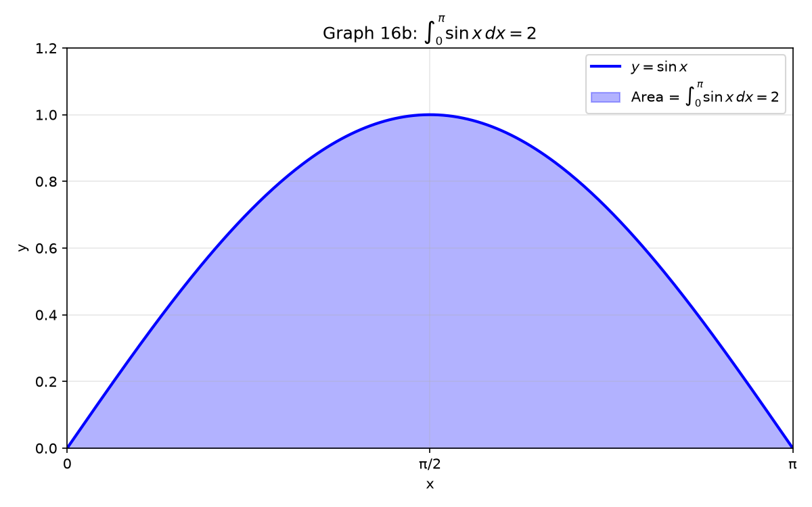

# Session 16A: Integration Fundamentals — FTC and $u$-Substitution

**Phase 2 — Classical Techniques | 80 min**

*Integration is the art of undoing a derivative. You have two tools: the FTC turns an antiderivative into a definite number, and $u$-substitution reverses the chain rule. This session is about knowing exactly which step to take, in which order.*

**Prerequisites**: 14A (basic derivatives), 13A (limits)

---

## Part A: Antiderivatives — The Reverse Dictionary

> **The procedure**: Given $f(x)$, find $F(x)$ such that $F'(x) = f(x)$. Always check your answer by differentiating.

---

## Example 1: The Power Rule in Reverse

$\frac{d}{dx}[x^n] = nx^{n-1}$. Reverse it: $\int x^n\,dx = \frac{x^{n+1}}{n+1} + C$ (for $n \neq -1$).

**Procedure**:
1. Bump the exponent up by 1: $n \to n+1$.
2. Divide by the new exponent: multiply by $\frac{1}{n+1}$.
3. Add $+C$. Never forget $+C$ on an indefinite integral.

$\int x^3\,dx = \frac{x^4}{4} + C$. Check: differentiate $\frac{x^4}{4}$ → $x^3$. ✓
$\int \sqrt{x}\,dx = \int x^{1/2}\,dx = \frac{x^{3/2}}{3/2} + C = \frac{2}{3}x^{3/2} + C$.
$\int \frac{1}{x^2}\,dx = \int x^{-2}\,dx = \frac{x^{-1}}{-1} + C = -\frac{1}{x} + C$.

---

## Example 2: The Special Case — $\int \frac{1}{x}\,dx$

The power rule fails at $n=-1$ (would divide by zero). The antiderivative of $\frac{1}{x}$ is:
$\int \frac{1}{x}\,dx = \ln|x| + C$.

**Why absolute value?** $\ln x$ is only defined for $x>0$. $\ln|x|$ covers both $x>0$ and $x<0$. Check: $\frac{d}{dx}\ln|x| = \frac{1}{x}$ for all $x \neq 0$.

---

## Example 3: The Antiderivative Dictionary — Memorize These

| $f(x)$ | $F(x) = \int f(x)\,dx$ |
|:---:|:---:|
| $x^n$ ($n \neq -1$) | $\frac{x^{n+1}}{n+1} + C$ |
| $\frac{1}{x}$ | $\ln\vert x\vert + C$ |
| $e^x$ | $e^x + C$ |
| $\sin x$ | $-\cos x + C$ |
| $\cos x$ | $\sin x + C$ |
| $\sec^2 x$ | $\tan x + C$ |
| $\frac{1}{1+x^2}$ | $\arctan x + C$ |
| $\frac{1}{\sqrt{1-x^2}}$ | $\arcsin x + C$ |

**Procedure for combined functions**:
1. Split the integral at each $+$ or $-$ sign: $\int (f \pm g) = \int f \pm \int g$.
2. Pull constants outside: $\int cf = c\int f$.
3. Apply the dictionary to each piece.
4. Combine $+C$ (only one $+C$ needed at the end).

$\int (3x^2 + 2e^x - \frac{1}{x})\,dx = 3\cdot\frac{x^3}{3} + 2e^x - \ln|x| + C = x^3 + 2e^x - \ln|x| + C$.

---

## Part B: The FTC — Turning Antiderivatives Into Numbers

> **The procedure**: Find ANY antiderivative $F$ of $f$. Plug in the upper bound. Plug in the lower bound. Subtract.

---

## Example 4: FTC Step by Step

$\displaystyle \int_a^b f(x)\,dx = F(b) - F(a)$, where $F' = f$.

**Procedure**:
1. Forget the bounds temporarily. Find $F(x)$ — any antiderivative of $f$.
2. Write $\left[F(x)\right]_a^b$ (the vertical bar notation).
3. Plug in the upper bound: $F(b)$.
4. Plug in the lower bound: $F(a)$.
5. Subtract: $F(b) - F(a)$.

$\int_0^3 x^2\,dx$:
1. $F(x) = \frac{x^3}{3}$ (ignore $+C$ — it cancels in the subtraction).
2. $\left[\frac{x^3}{3}\right]_0^3$.
3. $F(3) = \frac{27}{3} = 9$.
4. $F(0) = 0$.
5. $9 - 0 = 9$.

**The constant cancels**: $\int_0^3 x^2\,dx = (\frac{27}{3}+C) - (0+C) = 9$. Use the simplest $C=0$.

---

## Example 5: When the Result Is Zero or Negative

$\int_0^\pi \sin x\,dx = [-\cos x]_0^\pi = (-\cos\pi) - (-\cos 0) = (-(-1)) - (-1) = 1+1 = 2$.

$\int_0^{2\pi} \sin x\,dx = [-\cos x]_0^{2\pi} = (-1) - (-1) = 0$. The positive area cancels the negative.

**The definite integral = net signed area.** Parts above the $x$-axis count positive. Parts below count negative.



---

## Example 6: FTC Part 1 — Differentiate an Integral

$\frac{d}{dx}\int_a^x f(t)\,dt = f(x)$. The derivative undoes the integral.

$\frac{d}{dx}\int_0^x \sin(t^2)\,dt = \sin(x^2)$. No need to integrate — just evaluate at $x$.

**With a function in the upper limit** (chain rule): $\frac{d}{dx}\int_a^{g(x)} f(t)\,dt = f(g(x)) \cdot g'(x)$.

$\frac{d}{dx}\int_0^{x^2} \sin t\,dt = \sin(x^2) \cdot 2x$.

---

## Part C: $u$-Substitution — Undoing the Chain Rule

> **The procedure**: Spot a function and its derivative side by side. Replace the inner function with $u$. Replace its derivative $dx$ with $du$. Integrate in $u$. Substitute back to $x$.

---

## Example 7: The $u$-Sub Algorithm — Five Steps

**When to use $u$-sub**: You see a function AND (roughly) its derivative multiplied together.

**Algorithm for $\int f(g(x)) \cdot g'(x)\,dx$**:

| Step | Action | What you write |
|:---:|:---|:---|
| 1 | **Choose $u$** = the inner function (the one inside parentheses, a root, or a denominator) | $u = g(x)$ |
| 2 | **Compute $du$** = derivative of $u$, times $dx$ | $du = g'(x)\,dx$ |
| 3 | **Replace all $x$'s** — the entire integrand must become a function of $u$ only | $\int (\text{something in }u)\,du$ |
| 4 | **Integrate** in $u$ (use the dictionary from Part A) | $F(u) + C$ |
| 5 | **Substitute back** $u = g(x)$ | $F(g(x)) + C$ |

---

## Example 8: Polynomial $u$-Sub — Spot the Derivative

$\int 2x(x^2+1)^5\,dx$.

| Step | Action |
|:---:|:---|
| 1 | Choose $u = x^2+1$ (the inner function, raised to the 5th power) |
| 2 | $du = 2x\,dx$ (exactly the factor multiplying the parentheses!) |
| 3 | Replace: $(x^2+1)^5 \to u^5$, and $2x\,dx \to du$. Integral becomes $\int u^5\,du$ |
| 4 | Integrate: $\frac{u^6}{6} + C$ |
| 5 | Back: $\frac{(x^2+1)^6}{6} + C$ |

**Check**: Differentiate. $\frac{d}{dx}[\frac{(x^2+1)^6}{6}] = \frac{6(x^2+1)^5}{6} \cdot 2x = 2x(x^2+1)^5$. ✓

---

## Example 9: When $du$ Doesn't Match Exactly — Adjust with a Constant

$\int x\sqrt{x^2+4}\,dx$.

1. $u = x^2+4$.
2. $du = 2x\,dx$. But we have $x\,dx$, not $2x\,dx$. → Solve: $x\,dx = \frac{1}{2}du$.
3. Replace: $\sqrt{x^2+4} \to \sqrt{u}$, $x\,dx \to \frac{1}{2}du$. Integral: $\int \sqrt{u} \cdot \frac{1}{2}\,du = \frac{1}{2}\int u^{1/2}\,du$.
4. Integrate: $\frac{1}{2} \cdot \frac{u^{3/2}}{3/2} + C = \frac{1}{3}u^{3/2} + C$.
5. Back: $\frac{1}{3}(x^2+4)^{3/2} + C$.

---

## Example 10: Choosing $u$ — The Decision Rule

**Where to look for $u$** (in priority order):

| Priority | What to try as $u$ | Example |
|:---:|:---|:---|
| 1st | Expression inside parentheses raised to a power | $(x^2+1)^5 \to u = x^2+1$ |
| 2nd | Expression inside a root | $\sqrt{x^3+1} \to u = x^3+1$ |
| 3rd | Denominator of a fraction | $\frac{1}{x^2+1} \to u = x^2+1$ |
| 4th | Exponent of $e$ | $e^{x^2} \to u = x^2$ |
| 5th | Inside $\ln$, $\sin$, $\cos$ | $\sin(x^2) \to u = x^2$ |
| 6th | The whole base of a power | Try multiple, see what works |

$\int xe^{x^2}\,dx$: Priority 4 → $u = x^2$, $du = 2x\,dx$. $= \frac{1}{2}e^{x^2} + C$.

$\int \frac{\ln x}{x}\,dx$: Priority 5 → $u = \ln x$, $du = \frac{1}{x}dx$. $= \frac{(\ln x)^2}{2} + C$.

$\int \tan x\,dx = \int \frac{\sin x}{\cos x}\,dx$: Priority 3 (denominator) → $u = \cos x$, $du = -\sin x\,dx$. $= -\ln|\cos x| + C = \ln|\sec x| + C$.

---

## Example 11: Definite Integrals — Change the Bounds

**Procedure for $\int_a^b f(g(x))g'(x)\,dx$**:

1. Set $u = g(x)$. Compute $du = g'(x)\,dx$.
2. **Change the bounds**: $x=a \to u=g(a)$, $x=b \to u=g(b)$.
3. Replace the entire integral: $\int_{g(a)}^{g(b)} (\text{integrand in }u)\,du$.
4. Integrate in $u$. Plug in the new bounds. **Do NOT go back to $x$.**

$\int_0^1 2x(x^2+1)^4\,dx$.
1. $u = x^2+1$, $du = 2x\,dx$.
2. New bounds: $x=0 \to u=1$, $x=1 \to u=2$.
3. $\int_1^2 u^4\,du$.
4. $[\frac{u^5}{5}]_1^2 = \frac{32}{5} - \frac{1}{5} = \frac{31}{5}$.

**Why not go back to $x$?** You can — the answer is the same. But changing bounds is faster and avoids back-substitution errors.

---

## Example 12: $u$-Sub Checklist — Did You Do It Right?

After finishing a $u$-sub, run this checklist:
- [ ] Did every $x$ disappear? (The integrand should have ONLY $u$ and $du$.)
- [ ] For definite integrals, did you change the bounds?
- [ ] Did you check by differentiating? (Only takes 10 seconds — do it.)
- [ ] Is $+C$ there? (Indefinite integrals only.)

> **Up to here**: Antiderivative dictionary (8 entries). FTC: $\int_a^b f = F(b)-F(a)$. FTC Part 1: $\frac{d}{dx}\int_a^x f = f(x)$. $u$-sub: 5-step algorithm. Choose $u$ by priority. Definite: change bounds.

---

## Common Mistakes

### Mistake 1: Forgetting $+C$ on indefinite integrals

**Wrong**: $\int x^2\,dx = \frac{x^3}{3}$. **Right**: $\int x^2\,dx = \frac{x^3}{3} + C$. The $+C$ represents infinitely many possible answers.

### Mistake 2: Not changing bounds in definite $u$-substitution

**Wrong**: $\int_0^1 2x(x^2+1)^4\,dx = [\frac{u^5}{5}]_0^1$ with $u=x^2+1$. **Right**: Change bounds to $u$-values: $\int_1^2 u^4\,du = [\frac{u^5}{5}]_1^2 = \frac{31}{5}$.

### Mistake 3: $\int \frac{1}{x}\,dx = \ln x + C$ (missing absolute value)

**Wrong**: $\ln x$ is undefined for $x<0$. **Right**: $\ln|x| + C$ works for all $x \neq 0$.

### Mistake 4: Trying to integrate a product by integrating each factor separately

**Wrong**: $\int x\cos x\,dx = (\int x\,dx)(\int \cos x\,dx) = \frac{x^2}{2}\sin x + C$. **Right**: Integration does NOT distribute over multiplication. You need integration by parts (Session 16B).

---

## What We Just Did

```
(1) Antiderivative = reverse derivative. Power rule: ∫xⁿ = xⁿ⁺¹/(n+1) + C.
    Special: ∫1/x = ln|x| + C. Dictionary of 8 standard forms.

(2) FTC: ∫_a^b f = F(b)−F(a). Compute F (any antiderivative), plug bounds, subtract.
    FTC Part 1: d/dx ∫_a^x f(t)dt = f(x). With chain rule: f(g(x))·g'(x).

(3) u-Substitution: 5-step algorithm.
    Step 1: Choose u (use priority list).
    Step 2: Compute du = u'·dx.
    Step 3: Replace ALL x's with u's.
    Step 4: Integrate in u.
    Step 5: Substitute back (indefinite) OR change bounds (definite).
```

---

## Practice 1

$\int (4x^3 - 2x + 5)\,dx$. Use the antiderivative dictionary — split, pull constants, apply power rule.

→ Solutions: [Solutions](solutions/16A-solutions.md#practice-1)

---

## Practice 2

$\int_0^2 (3x^2+1)\,dx$. Apply FTC: find $F$, compute $F(2)-F(0)$.

→ Solutions: [Solutions](solutions/16A-solutions.md#practice-2)

---

## Practice 3

$\int x\sqrt{x^2+4}\,dx$. Run the $u$-sub algorithm. $u=$?, $du=$?, adjust constant?

→ Solutions: [Solutions](solutions/16A-solutions.md#practice-3)

---

## Practice 4

$\int_0^{\pi/2} \sin x\cos^2 x\,dx$. Definite $u$-sub: choose $u$, change bounds, integrate, evaluate.

→ Solutions: [Solutions](solutions/16A-solutions.md#practice-4)

---

## Practice 5: Real Battle (Constructive)

A student computes $\int_{-2}^2 x^3\,dx = [\frac{x^4}{4}]_{-2}^2 = 4-4 = 0$ and concludes "the area under $x^3$ from $-2$ to $2$ is zero." (a) Is the computation correct? (b) Is the conclusion correct? (c) Compute the TOTAL area (treating all regions as positive) from $-2$ to $2$. What property of odd functions explains this?

→ Solutions: [Solutions](solutions/16A-solutions.md#practice-5)

---

## Basic Algebra Drill — Integration Fundamentals (10 Problems)

> Run the prescribed procedure. Show your $u$, $du$, and (for definite) new bounds.

**D1.** $\int x^5\,dx$. Power rule.

**D2.** $\int (2e^x + \frac{3}{x})\,dx$. Dictionary: $e^x \to e^x$, $\frac{1}{x} \to \ln|x|$.

**D3.** $\int_1^4 \sqrt{x}\,dx$. Rewrite as $x^{1/2}$, FTC.

**D4.** $\int_0^{\pi} \cos x\,dx$. Dictionary + FTC.

**D5.** $\int 3x^2(x^3+1)^4\,dx$. $u$-sub: $u=$?, $du=$? Check: does $du$ match $3x^2\,dx$ exactly?

**D6.** $\int e^{3x}\,dx$. $u=3x$, $du=3\,dx \to dx = \frac{du}{3}$.

**D7.** $\int \frac{x}{x^2+1}\,dx$. $u=x^2+1$, $du=2x\,dx \to x\,dx = \frac{du}{2}$.

**D8.** $\int_0^1 xe^{x^2}\,dx$. $u$-sub with bounds.

**D9.** $\int \frac{\cos x}{\sin x}\,dx$. $u=\sin x$, $du=\cos x\,dx$. Dictionary for $\frac{1}{u}$.

**D10.** $\int_{-1}^2 (x^2-2x)\,dx$. FTC — evaluate antiderivative at both bounds.

> Solutions: [Solutions](solutions/16A-solutions.md#basic-drill)

---

## Advanced Algebra Drill — Integration Fundamentals (10 Problems)

> Multi-step. Choose $u$. Handle constants. Use FTC creatively.

**A1.** $\int x^2\sqrt{x^3+1}\,dx$. $u=x^3+1$, $du=3x^2\,dx$ — adjust.

**A2.** $\int \frac{e^x}{1+e^{2x}}\,dx$. $u=e^x$, $du=e^x\,dx$. Result involves $\arctan(u)$.

**A3.** $\int_0^4 \frac{x}{\sqrt{1+2x}}\,dx$. $u=1+2x$, solve for $x$ in terms of $u$, change bounds.

**A4.** $\int \sin^5 x\cos x\,dx$. $u=\sin x$, $du=\cos x\,dx$ — exact match.

**A5.** $\int_1^e \frac{(\ln x)^2}{x}\,dx$. $u=\ln x$, change bounds: $x=1 \to u=0$, $x=e \to u=1$.

**A6.** $F(x)=\int_0^x \sin(t^2)\,dt$. Find $F'(x)$. (FTC Part 1 — no integration needed.)

**A7.** $\int \frac{1}{x\ln x}\,dx$. $u=\ln x$, $du=\frac{1}{x}dx$. Result: $\ln|\ln x| + C$.

**A8.** $\int_0^{\pi/4} \tan x\,dx$. Write as $\frac{\sin x}{\cos x}$, $u=\cos x$, change bounds. Careful with sign.

**A9.** $\int_0^1 \frac{x}{1+x^4}\,dx$. $u=x^2$, $du=2x\,dx$. Then $\frac{1}{1+u^2} \to \arctan u$.

**A10.** Prove $\int_{-a}^a \sin x\,dx = 0$ for any $a$ without computing. Use the fact that $\sin x$ is odd: $\sin(-x) = -\sin x$. What does this say about the area?

> Solutions: [Solutions](solutions/16A-solutions.md#advanced-drill)

---

## Today's Procedure

| When you see... | Do this... |
|:---|:---|
| A basic function ($x^n$, $e^x$, $\sin x$, $\frac{1}{x}$, etc.) | Use the antiderivative dictionary directly |
| A sum or constant multiple | Split at $+/-$, pull constants out, apply dictionary |
| A definite integral $\int_a^b f$ | Find $F$, compute $F(b)-F(a)$ |
| A function AND (roughly) its derivative multiplied | Run the 5-step $u$-sub algorithm |
| A definite integral with $u$-sub | Change bounds to $u$-values; don't go back to $x$ |
| $\frac{d}{dx}\int_a^x f(t)\,dt$ | FTC Part 1: answer is $f(x)$. With chain rule: $f(g(x))\cdot g'(x)$ |

---

## Terminology

| What we call it | Math term | Notation |
|:---:|:---:|:---:|
| reverse derivative | antiderivative / indefinite integral | $\int f(x)\,dx = F(x) + C$ |
| the $+C$ | constant of integration | $C \in \mathbb{R}$ |
| plug bounds and subtract | Fundamental Theorem of Calculus (FTC) | $\int_a^b f = F(b)-F(a)$ |
| differentiate an integral | FTC Part 1 | $\frac{d}{dx}\int_a^x f(t)dt = f(x)$ |
| reverse chain rule | $u$-substitution | $u=g(x)$, $du=g'(x)dx$ |
| net signed area | definite integral | $\int_a^b f(x)\,dx$ |
| bounds expressed in $u$ | change of limits | $x=a \to u=g(a)$ |
