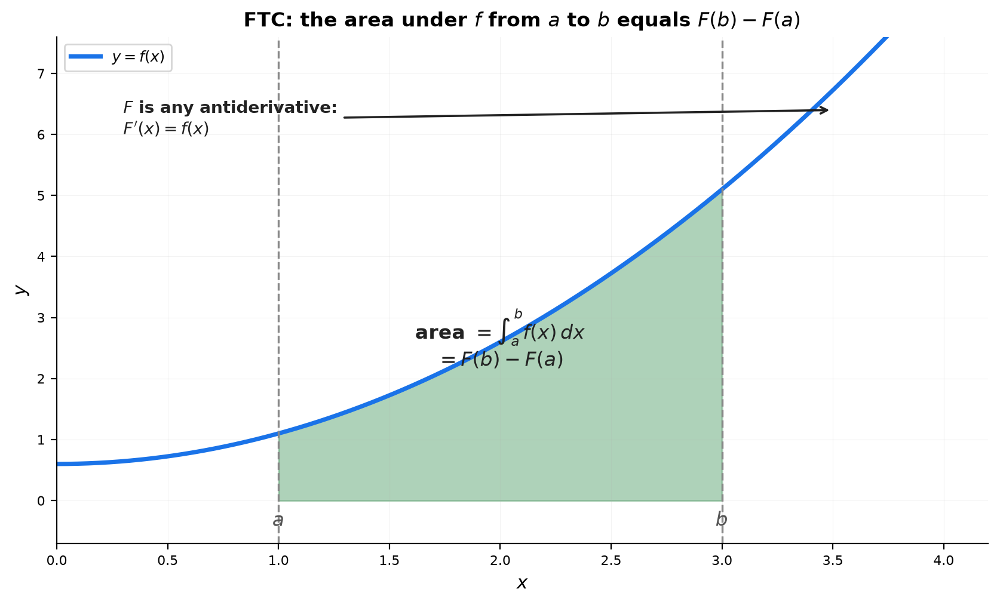
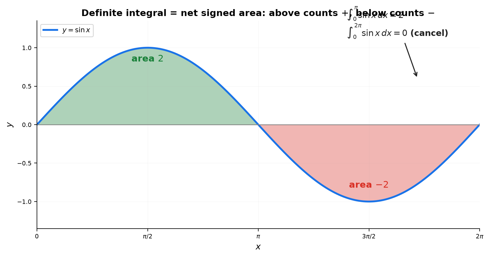
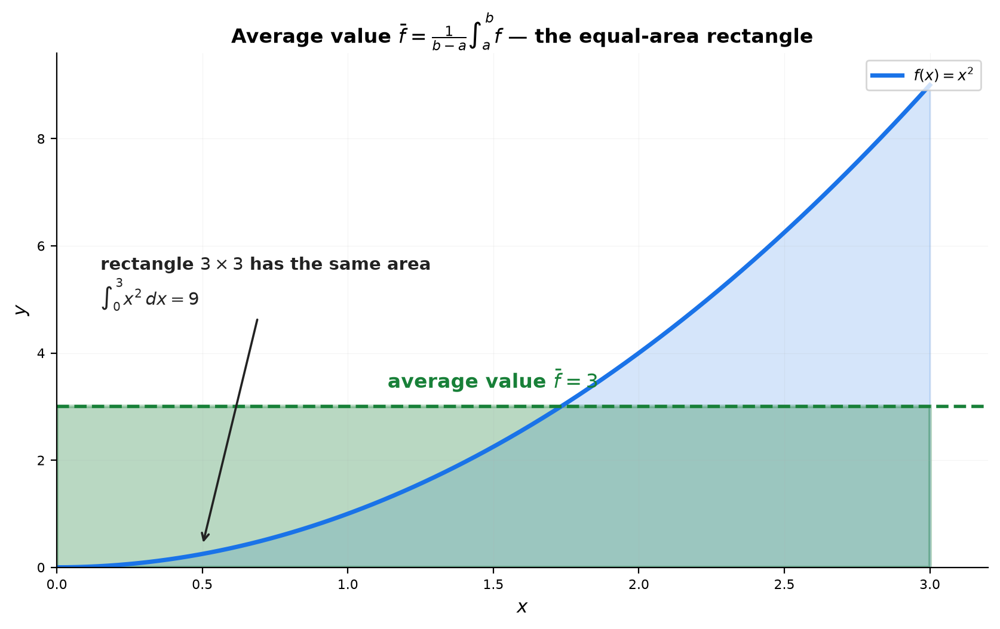

# Session 16A: Integration Fundamentals — FTC and $u$-Substitution

**Phase 2 — Classical Techniques | 80 min**

*Integration is the art of undoing a derivative. You have two tools: the FTC turns an antiderivative into a definite number, and $u$-substitution reverses the chain rule. This session is about knowing exactly which step to take, in which order.*

**Prerequisites**: 14A (basic derivatives), 13A (limits)

> 💡 **Stuck?** Every drill below has a collapsible **Hint** — click it only when you need a nudge.

---

## Part A: Antiderivatives — The Reverse Dictionary

> **The procedure**: Given $f(x)$, find $F(x)$ such that $F'(x) = f(x)$. Always check your answer by differentiating.

---

## Example 1: The Power Rule in Reverse

$\frac{d}{dx}[x^n] = nx^{n-1}$. Reverse it: $\int x^n\,dx = \frac{x^{n+1}}{n+1} + C$ (for $n \neq -1$).

**Procedure**:
1. Bump the exponent up by 1: $n \to n+1$.
2. Divide by the new exponent: multiply by $\frac{1}{n+1}$.
3. Add $+C$. Never forget $+C$ on an indefinite integral.

$\int x^3\,dx = \frac{x^4}{4} + C$. Check: differentiate $\frac{x^4}{4}$ → $x^3$. ✓
$\int \sqrt{x}\,dx = \int x^{1/2}\,dx = \frac{x^{3/2}}{3/2} + C = \frac{2}{3}x^{3/2} + C$.
$\int \frac{1}{x^2}\,dx = \int x^{-2}\,dx = \frac{x^{-1}}{-1} + C = -\frac{1}{x} + C$.

> **How to think**: Before integrating any power, rewrite it in the form $x^n$ — $\sqrt{x} = x^{1/2}$, $\frac{1}{x^2} = x^{-2}$. Integration can't "see" roots or fractions; it only sees exponents. Once it's $x^n$, the rule is mechanical.

---

## Example 2: The Special Case — $\int \frac{1}{x}\,dx$

The power rule fails at $n=-1$ (would divide by zero). The antiderivative of $\frac{1}{x}$ is:
$\int \frac{1}{x}\,dx = \ln|x| + C$.

**Why absolute value?** $\ln x$ is only defined for $x>0$. $\ln|x|$ covers both $x>0$ and $x<0$. Check: $\frac{d}{dx}\ln|x| = \frac{1}{x}$ for all $x \neq 0$.

---

## Example 3: The Antiderivative Dictionary — Memorize These

| $f(x)$ | $F(x) = \int f(x)\,dx$ |
|:---:|:---:|
| $x^n$ ($n \neq -1$) | $\frac{x^{n+1}}{n+1} + C$ |
| $\frac{1}{x}$ | $\ln\vert x\vert + C$ |
| $e^x$ | $e^x + C$ |
| $\sin x$ | $-\cos x + C$ |
| $\cos x$ | $\sin x + C$ |
| $\sec^2 x$ | $\tan x + C$ |
| $\frac{1}{1+x^2}$ | $\arctan x + C$ |
| $\frac{1}{\sqrt{1-x^2}}$ | $\arcsin x + C$ |
| $\sec x\tan x$ | $\sec x + C$ |
| $\csc^2 x$ | $-\cot x + C$ |
| $\csc x\cot x$ | $-\csc x + C$ |
| $a^x$ | $\frac{a^x}{\ln a} + C$ |

**Procedure for combined functions**:
1. Split the integral at each $+$ or $-$ sign: $\int (f \pm g) = \int f \pm \int g$.
2. Pull constants outside: $\int cf = c\int f$.
3. Apply the dictionary to each piece.
4. Combine $+C$ (only one $+C$ needed at the end).

$\int (3x^2 + 2e^x - \frac{1}{x})\,dx = 3\cdot\frac{x^3}{3} + 2e^x - \ln|x| + C = x^3 + 2e^x - \ln|x| + C$.

---

## Part B: The FTC — Turning Antiderivatives Into Numbers

> **The procedure**: Find ANY antiderivative $F$ of $f$. Plug in the upper bound. Plug in the lower bound. Subtract.

---

## Example 4: FTC Step by Step

$\displaystyle \int_a^b f(x)\,dx = F(b) - F(a)$, where $F' = f$.

**Procedure**:
1. Forget the bounds temporarily. Find $F(x)$ — any antiderivative of $f$.
2. Write $\left[F(x)\right]_a^b$ (the vertical bar notation).
3. Plug in the upper bound: $F(b)$.
4. Plug in the lower bound: $F(a)$.
5. Subtract: $F(b) - F(a)$.

$\int_0^3 x^2\,dx$:
1. $F(x) = \frac{x^3}{3}$ (ignore $+C$ — it cancels in the subtraction).
2. $\left[\frac{x^3}{3}\right]_0^3$.
3. $F(3) = \frac{27}{3} = 9$.
4. $F(0) = 0$.
5. $9 - 0 = 9$.

**The constant cancels**: $\int_0^3 x^2\,dx = (\frac{27}{3}+C) - (0+C) = 9$. Use the simplest $C=0$.

> **How to think**: Forget the bounds until the antiderivative is found — the bounds only get plugged in at the very end. And keep the "why" in mind: $F$ is the *running total* of $f$, so $F(b) - F(a)$ is the net change of that total between $a$ and $b$ — exactly the net signed area. That's why the $+C$ always cancels.



---

## Example 5: When the Result Is Zero or Negative

$\int_0^\pi \sin x\,dx = [-\cos x]_0^\pi = (-\cos\pi) - (-\cos 0) = (-(-1)) - (-1) = 1+1 = 2$.

$\int_0^{2\pi} \sin x\,dx = [-\cos x]_0^{2\pi} = (-1) - (-1) = 0$. The positive area cancels the negative.

**The definite integral = net signed area.** Parts above the $x$-axis count positive. Parts below count negative.



---

## Example 5A: Average Value — The Equal-Area Rectangle

The **average value** of $f$ on $[a,b]$ is $\bar{f} = \frac{1}{b-a}\int_a^b f(x)\,dx$.

**Why**: the region under $f$ can be reshaped into a rectangle of width $b-a$; its height is exactly $\bar f$ (equal area).

$f(x)=x^2$ on $[0,3]$: $\bar f = \frac{1}{3}\int_0^3 x^2\,dx = \frac{1}{3}\cdot\frac{27}{3} = 3$.

**Check**: the rectangle $3\times3$ has area $9$ — the same as $\int_0^3 x^2\,dx = 9$. ✓



---

## Example 6: FTC Part 1 — Differentiate an Integral

$\frac{d}{dx}\int_a^x f(t)\,dt = f(x)$. The derivative undoes the integral.

$\frac{d}{dx}\int_0^x \sin(t^2)\,dt = \sin(x^2)$. No need to integrate — just evaluate at $x$.

**With a function in the upper limit** (chain rule): $\frac{d}{dx}\int_a^{g(x)} f(t)\,dt = f(g(x)) \cdot g'(x)$.

$\frac{d}{dx}\int_0^{x^2} \sin t\,dt = \sin(x^2) \cdot 2x$.

---

## Part C: $u$-Substitution — Undoing the Chain Rule

> **The procedure**: Spot a function and its derivative side by side. Replace the inner function with $u$. Replace its derivative $dx$ with $du$. Integrate in $u$. Substitute back to $x$.

---

## Example 7: The $u$-Sub Algorithm — Five Steps

**When to use $u$-sub**: You see a function AND (roughly) its derivative multiplied together.

**Algorithm for $\int f(g(x)) \cdot g'(x)\,dx$**:

| Step | Action | What you write |
|:---:|:---|:---|
| 1 | **Choose $u$** = the inner function (the one inside parentheses, a root, or a denominator) | $u = g(x)$ |
| 2 | **Compute $du$** = derivative of $u$, times $dx$ | $du = g'(x)\,dx$ |
| 3 | **Replace all $x$'s** — the entire integrand must become a function of $u$ only | $\int (\text{something in }u)\,du$ |
| 4 | **Integrate** in $u$ (use the dictionary from Part A) | $F(u) + C$ |
| 5 | **Substitute back** $u = g(x)$ | $F(g(x)) + C$ |

**Why it works — the chain rule in reverse**:

The chain rule (14A) says $\frac{d}{dx}F(g(x)) = F'(g(x))\,g'(x)$. Read it backward: the integrand $f(g(x))\,g'(x)$ is *already the derivative of $F(g(x))$* — you just have to recognize it. The substitution $u = g(x)$, $du = g'(x)\,dx$ peels off the $g'(x)$ factor (the chain rule's "multiply by the inner derivative"), leaving $\int f(u)\,du$ whose antiderivative is $F(u)$. Step 5 puts the inner function back. Verify by differentiating $F(g(x))$: the chain rule reproduces the integrand — that's why the method always works.

> **How to think**: On a product, ask the one question — "is one factor (up to a constant) the derivative of the *inside* of the other factor?" That single question IS the $u$-sub decision.

---

## Example 8: Polynomial $u$-Sub — Spot the Derivative

$\int 2x(x^2+1)^5\,dx$.

| Step | Action |
|:---:|:---|
| 1 | Choose $u = x^2+1$ (the inner function, raised to the 5th power) |
| 2 | $du = 2x\,dx$ (exactly the factor multiplying the parentheses!) |
| 3 | Replace: $(x^2+1)^5 \to u^5$, and $2x\,dx \to du$. Integral becomes $\int u^5\,du$ |
| 4 | Integrate: $\frac{u^6}{6} + C$ |
| 5 | Back: $\frac{(x^2+1)^6}{6} + C$ |

**Check**: Differentiate. $\frac{d}{dx}[\frac{(x^2+1)^6}{6}] = \frac{6(x^2+1)^5}{6} \cdot 2x = 2x(x^2+1)^5$. ✓

---

## Example 9: When $du$ Doesn't Match Exactly — Adjust with a Constant

$\int x\sqrt{x^2+4}\,dx$.

1. $u = x^2+4$.
2. $du = 2x\,dx$. But we have $x\,dx$, not $2x\,dx$. → Solve: $x\,dx = \frac{1}{2}du$.
3. Replace: $\sqrt{x^2+4} \to \sqrt{u}$, $x\,dx \to \frac{1}{2}du$. Integral: $\int \sqrt{u} \cdot \frac{1}{2}\,du = \frac{1}{2}\int u^{1/2}\,du$.
4. Integrate: $\frac{1}{2} \cdot \frac{u^{3/2}}{3/2} + C = \frac{1}{3}u^{3/2} + C$.
5. Back: $\frac{1}{3}(x^2+4)^{3/2} + C$.

> **How to think**: A *constant* mismatch ($x\,dx$ vs $2x\,dx$) is never a problem — constants slide outside the integral. A *non-constant* leftover is the real alarm: if after setting $u$ you still see an $x$ that no $du$ will absorb, you chose the wrong $u$.

---

## Example 10: Choosing $u$ — The Decision Rule

**Where to look for $u$** (in priority order):

| Priority | What to try as $u$ | Example |
|:---:|:---|:---|
| 1st | Expression inside parentheses raised to a power | $(x^2+1)^5 \to u = x^2+1$ |
| 2nd | Expression inside a root | $\sqrt{x^3+1} \to u = x^3+1$ |
| 3rd | Denominator of a fraction | $\frac{1}{x^2+1} \to u = x^2+1$ |
| 4th | Exponent of $e$ | $e^{x^2} \to u = x^2$ |
| 5th | Inside $\ln$, $\sin$, $\cos$ | $\sin(x^2) \to u = x^2$ |
| 6th | The whole base of a power | Try multiple, see what works |

$\int xe^{x^2}\,dx$: Priority 4 → $u = x^2$, $du = 2x\,dx$. $= \frac{1}{2}e^{x^2} + C$.

$\int \frac{\ln x}{x}\,dx$: Priority 5 → $u = \ln x$, $du = \frac{1}{x}dx$. $= \frac{(\ln x)^2}{2} + C$.

$\int \tan x\,dx = \int \frac{\sin x}{\cos x}\,dx$: Priority 3 (denominator) → $u = \cos x$, $du = -\sin x\,dx$. $= -\ln|\cos x| + C = \ln|\sec x| + C$.

> **How to think**: The priority list is a *search*, not a formula. Scan left to right — a parenthesized power, a root, a denominator, an exponent, a log/trig inside — and take the first match as $u$. Then confirm its derivative shows up (up to a constant). If no candidate's derivative appears, the problem belongs to a *different* technique (16B).

---

## Example 11: Definite Integrals — Change the Bounds

**Procedure for $\int_a^b f(g(x))g'(x)\,dx$**:

1. Set $u = g(x)$. Compute $du = g'(x)\,dx$.
2. **Change the bounds**: $x=a \to u=g(a)$, $x=b \to u=g(b)$.
3. Replace the entire integral: $\int_{g(a)}^{g(b)} (\text{integrand in }u)\,du$.
4. Integrate in $u$. Plug in the new bounds. **Do NOT go back to $x$.**

$\int_0^1 2x(x^2+1)^4\,dx$.
1. $u = x^2+1$, $du = 2x\,dx$.
2. New bounds: $x=0 \to u=1$, $x=1 \to u=2$.
3. $\int_1^2 u^4\,du$.
4. $[\frac{u^5}{5}]_1^2 = \frac{32}{5} - \frac{1}{5} = \frac{31}{5}$.

**Why not go back to $x$?** You can — the answer is the same. But changing bounds is faster and avoids back-substitution errors.

**Why changing bounds works**: Either route evaluates the *same* antiderivative $F(g(x))$ at the *same* two endpoints — $F(g(b)) - F(g(a))$. Changing bounds just performs the map $x \mapsto g(x)$ on the limits *before* integrating, so there is nothing left to undo at the end. Same answer, less writing, fewer sign errors.

---

## Example 12: $u$-Sub Checklist — Did You Do It Right?

After finishing a $u$-sub, run this checklist:
- [ ] Did every $x$ disappear? (The integrand should have ONLY $u$ and $du$.)
- [ ] For definite integrals, did you change the bounds?
- [ ] Did you check by differentiating? (Only takes 10 seconds — do it.)
- [ ] Is $+C$ there? (Indefinite integrals only.)

> **Up to here**: Antiderivative dictionary (8 entries). FTC: $\int_a^b f = F(b)-F(a)$. FTC Part 1: $\frac{d}{dx}\int_a^x f = f(x)$. $u$-sub: 5-step algorithm. Choose $u$ by priority. Definite: change bounds.

---

**Why the checklist is the whole idea** — integration is a reverse dictionary of derivative rules:

| Derivative rule (14A) | Read backward (16A) |
|:---|:---|
| Power rule: $\frac{d}{dx}\frac{x^{n+1}}{n+1}=x^n$ | $\int x^n\,dx=\frac{x^{n+1}}{n+1}+C$ (Ex 1) |
| $\frac{d}{dx}\ln|x|=\frac{1}{x}$ | $\int\frac{1}{x}\,dx=\ln|x|+C$ (Ex 2) |
| Chain rule: $\frac{d}{dx}F(g(x))=F'(g(x))g'(x)$ | $u$-sub: $\int f(g(x))g'(x)\,dx=\int f(u)\,du$ (Ex 7–12) |
| FTC: $\frac{d}{dx}\int_a^x f(t)\,dt=f(x)$ | $\int_a^b f\,dx=F(b)-F(a)$ (Ex 4–6) |

That's why "check by differentiating" is the ultimate test: if your answer's derivative equals the integrand, you have correctly undone a derivative — nothing else can go wrong.

---

## Common Mistakes

### Mistake 1: Forgetting $+C$ on indefinite integrals

**Wrong**: $\int x^2\,dx = \frac{x^3}{3}$. **Right**: $\int x^2\,dx = \frac{x^3}{3} + C$. The $+C$ represents infinitely many possible answers.

### Mistake 2: Not changing bounds in definite $u$-substitution

**Wrong**: $\int_0^1 2x(x^2+1)^4\,dx = [\frac{u^5}{5}]_0^1$ with $u=x^2+1$. **Right**: Change bounds to $u$-values: $\int_1^2 u^4\,du = [\frac{u^5}{5}]_1^2 = \frac{31}{5}$.

### Mistake 3: $\int \frac{1}{x}\,dx = \ln x + C$ (missing absolute value)

**Wrong**: $\ln x$ is undefined for $x<0$. **Right**: $\ln|x| + C$ works for all $x \neq 0$.

### Mistake 4: Trying to integrate a product by integrating each factor separately

**Wrong**: $\int x\cos x\,dx = (\int x\,dx)(\int \cos x\,dx) = \frac{x^2}{2}\sin x + C$. **Right**: Integration does NOT distribute over multiplication. You need integration by parts (Session 16B).

---

## What We Just Did

```
(1) Antiderivative = reverse derivative. Power rule: ∫xⁿ = xⁿ⁺¹/(n+1) + C.
    Special: ∫1/x = ln|x| + C. Dictionary: 12 standard forms (incl. sec/csc/cot, aˣ).

(2) FTC: ∫_a^b f = F(b)−F(a). Compute F (any antiderivative), plug bounds, subtract.
    FTC Part 1: d/dx ∫_a^x f(t)dt = f(x). With chain rule: f(g(x))·g'(x).
    Average value: f̄ = (1/(b−a))∫_a^b f — the equal-area rectangle height.

(3) u-Substitution: 5-step algorithm.
    Step 1: Choose u (use priority list).
    Step 2: Compute du = u'·dx.
    Step 3: Replace ALL x's with u's.
    Step 4: Integrate in u.
    Step 5: Substitute back (indefinite) OR change bounds (definite).
```

---

## Practice 1

<details>
<summary><b>P1.1</b></summary>

Split the integral at each $+$/$-$ sign.

<details>
<summary><b>P1.2</b></summary>

Pull each constant outside.

<details>
<summary><b>P1.3</b></summary>

Apply the power rule to each term, then combine into one $+C$.

</details>
</details>
</details>

→ Solutions: [Solutions](solutions/16A-solutions.md#practice-1)

---

## Practice 2

<details>
<summary><b>P2.1</b></summary>

Find an antiderivative $F(x)$ of $3x^2+1$ (ignore $+C$).

<details>
<summary><b>P2.2</b></summary>

Compute $F(2) - F(0)$.

</details>
</details>

→ Solutions: [Solutions](solutions/16A-solutions.md#practice-2)

---

## Practice 3

<details>
<summary><b>P3.1</b></summary>

Choose the inner function $u$ and compute $du$.

<details>
<summary><b>P3.2</b></summary>

Adjust the constant mismatch so the integrand becomes exactly $f(u)\,du$.

<details>
<summary><b>P3.3</b></summary>

Integrate in $u$ and substitute back.

</details>
</details>
</details>

→ Solutions: [Solutions](solutions/16A-solutions.md#practice-3)

---

## Practice 4

<details>
<summary><b>P4.1</b></summary>

Choose $u$ and compute $du$.

<details>
<summary><b>P4.2</b></summary>

Change the bounds to $u$-values.

<details>
<summary><b>P4.3</b></summary>

Integrate and evaluate.

</details>
</details>
</details>

→ Solutions: [Solutions](solutions/16A-solutions.md#practice-4)

---

## Practice 5: Real Battle (Constructive)

A student computes $\int_{-2}^2 x^3\,dx = [\frac{x^4}{4}]_{-2}^2 = 4-4 = 0$ and concludes "the area under $x^3$ from $-2$ to $2$ is zero."

<details>
<summary><b>P5.1</b></summary>

Is the computation correct?

<details>
<summary><b>P5.2</b></summary>

Is the conclusion correct? (What does $0$ actually measure?)

<details>
<summary><b>P5.3</b></summary>

Compute the TOTAL area (treating all regions as positive) from $-2$ to $2$.

<details>
<summary><b>P5.4</b></summary>

What property of odd functions explains this?

</details>
</details>
</details>
</details>

→ Solutions: [Solutions](solutions/16A-solutions.md#practice-5)

---

## Basic Drills

> Solve each sub-problem in order. Show your $u$, $du$, and (for definite integrals) the new bounds.

**B1.** $\int x^5\,dx$

<details>
<summary><b>B1.1</b></summary>

Which rule applies to a pure power?

<details>
<summary><b>B1.2</b></summary>

Compute the integral.

</details>
</details>

**B2.** $\int \left(2e^x + \frac{3}{x}\right)\,dx$

<details>
<summary><b>B2.1</b></summary>

Identify the dictionary entry for each term.

<details>
<summary><b>B2.2</b></summary>

Compute the integral.

</details>
</details>

**B3.** $\int_1^4 \sqrt{x}\,dx$

<details>
<summary><b>B3.1</b></summary>

Rewrite $\sqrt{x}$ as a power of $x$.

<details>
<summary><b>B3.2</b></summary>

Apply the FTC and evaluate.

</details>
</details>

**B4.** $\int_0^{\pi} \cos x\,dx$

<details>
<summary><b>B4.1</b></summary>

Write the antiderivative of $\cos x$.

<details>
<summary><b>B4.2</b></summary>

Evaluate at the bounds.

</details>
</details>

**B5.** $\int 3x^2(x^3+1)^4\,dx$

<details>
<summary><b>B5.1</b></summary>

Choose $u$ (the inner function) and compute $du$.

<details>
<summary><b>B5.2</b></summary>

Compute the integral.

</details>
</details>

**B6.** $\int e^{3x}\,dx$

<details>
<summary><b>B6.1</b></summary>

Choose $u$ so that $du$ accounts for the factor $3$.

<details>
<summary><b>B6.2</b></summary>

Compute the integral.

</details>
</details>

**B7.** $\int \frac{x}{x^2+1}\,dx$

<details>
<summary><b>B7.1</b></summary>

Choose $u$ and express $x\,dx$ in terms of $du$.

<details>
<summary><b>B7.2</b></summary>

Compute the integral.

</details>
</details>

**B8.** $\int_0^1 x e^{x^2}\,dx$

<details>
<summary><b>B8.1</b></summary>

Choose $u$ and change the bounds to $u$-values.

<details>
<summary><b>B8.2</b></summary>

Compute and evaluate.

</details>
</details>

**B9.** $\int \frac{\cos x}{\sin x}\,dx$

<details>
<summary><b>B9.1</b></summary>

Choose $u$ so the numerator is (up to sign) $du$.

<details>
<summary><b>B9.2</b></summary>

Compute the integral.

</details>
</details>

**B10.** $\int_{-1}^2 (x^2 - 2x)\,dx$

<details>
<summary><b>B10.1</b></summary>

Find the antiderivative.

<details>
<summary><b>B10.2</b></summary>

Plug in both bounds and subtract.

</details>
</details>

**B11.** Find the average value of $f(x) = \sin x$ on $[0, \pi]$.

<details>
<summary><b>B11.1</b></summary>

Write the average-value formula for $[0,\pi]$.

<details>
<summary><b>B11.2</b></summary>

Compute it.

</details>
</details>

**B12.** $\int \sec x\tan x\,dx$

<details>
<summary><b>B12.1</b></summary>

Which dictionary entry has derivative $\sec x\tan x$?

<details>
<summary><b>B12.2</b></summary>

Compute the integral.

</details>
</details>

> Solutions: [Solutions](solutions/16A-solutions.md#basic-drill)

---

## Calculation Drills

> Pure computation — solve each sub-problem in order, then the full problem. No hints.

**C1.** $\int \frac{(x^2+1)^3}{x^4}\,dx$

<details>
<summary><b>C1.1</b></summary>

Expand $(x^2+1)^3$ and split into a sum of powers.

<details>
<summary><b>C1.2</b></summary>

Integrate each term.

</details>
</details>

**C2.** $\int \left(e^x + e^{-x}\right)^2\,dx$

<details>
<summary><b>C2.1</b></summary>

Expand the square.

<details>
<summary><b>C2.2</b></summary>

Integrate each term.

</details>
</details>

**C3.** $\int \frac{\ln\left(x\sqrt{x}\right)}{x}\,dx$

<details>
<summary><b>C3.1</b></summary>

Simplify $\ln(x\sqrt{x})$ with log laws.

<details>
<summary><b>C3.2</b></summary>

Substitute $u=\ln x$.

<details>
<summary><b>C3.3</b></summary>

Integrate.

</details>
</details>
</details>

**C4.** $\int_1^2 \frac{x^2+1}{x^3+3x}\,dx$

<details>
<summary><b>C4.1</b></summary>

Check: is the numerator (up to a constant) the derivative of the denominator?

<details>
<summary><b>C4.2</b></summary>

Substitute $u$, change the bounds.

<details>
<summary><b>C4.3</b></summary>

Integrate and evaluate.

</details>
</details>
</details>

**C5.** $\int \sin^3 x\cos^3 x\,dx$

<details>
<summary><b>C5.1</b></summary>

Check the parity of both exponents and pick the move.

<details>
<summary><b>C5.2</b></summary>

Peel one factor and convert the rest.

<details>
<summary><b>C5.3</b></summary>

Substitute and integrate.

</details>
</details>
</details>

**C6.** $\int \frac{\tan x}{\ln(\sec x)}\,dx$

<details>
<summary><b>C6.1</b></summary>

Find a function whose derivative is the numerator.

<details>
<summary><b>C6.2</b></summary>

Substitute and integrate.

</details>
</details>

**C7.** $\int_0^{\pi}\sin^2 x\cos^2 x\,dx$

<details>
<summary><b>C7.1</b></summary>

Simplify using $\sin^2x\cos^2x = \frac14\sin^2 2x$.

<details>
<summary><b>C7.2</b></summary>

Integrate (half-angle) and evaluate.

</details>
</details>

**C8.** $\int_0^{\pi/2}\left(e^{\sin x}\cos x + \sin 2x\right)\,dx$

<details>
<summary><b>C8.1</b></summary>

Split into two integrals.

<details>
<summary><b>C8.2</b></summary>

Integrate the first term.

<details>
<summary><b>C8.3</b></summary>

Integrate the second term.

<details>
<summary><b>C8.4</b></summary>

Evaluate at the bounds.

</details>
</details>
</details>
</details>

**C9.** $\int_0^1 x^3\sqrt{1-x^2}\,dx$

<details>
<summary><b>C9.1</b></summary>

Choose $u$ and express $x^3\,dx$ in terms of $u$ and $du$.

<details>
<summary><b>C9.2</b></summary>

Change the bounds.

<details>
<summary><b>C9.3</b></summary>

Integrate and evaluate.

</details>
</details>
</details>

**C10.** $\int_0^1\left(\frac{x}{1+x^2} + \frac{e^x}{e^x+1}\right)\,dx$

<details>
<summary><b>C10.1</b></summary>

Split into two integrals.

<details>
<summary><b>C10.2</b></summary>

Integrate the first ($P'/P$ form).

<details>
<summary><b>C10.3</b></summary>

Integrate the second ($P'/P$ form).

<details>
<summary><b>C10.4</b></summary>

Evaluate.

</details>
</details>
</details>
</details>

> Solutions: [Solutions](solutions/16A-solutions.md#calculation-drill)

---

## Advanced Drills

> Each problem is scoped into sub-problems: compute first, then explain. Don't skip the explanation parts.

**A1.** $\int x^2\sqrt{x^3+1}\,dx$

<details>
<summary><b>A1.1</b></summary>

Compute the integral.

<details>
<summary><b>A1.2</b></summary>

Verify your answer by differentiating.

<details>
<summary><b>A1.3</b></summary>

Explain where the factor $\frac13$ comes from.

</details>
</details>
</details>

**A2.** $\int \frac{e^x}{1+e^{2x}}\,dx$

<details>
<summary><b>A2.1</b></summary>

Compute the integral.

<details>
<summary><b>A2.2</b></summary>

Compare with $\int \frac{e^x}{1+e^x}\,dx$ and explain why the answer is an arctan and not a logarithm.

</details>
</details>

**A3.** $\int_0^4 \frac{x}{\sqrt{1+2x}}\,dx$

<details>
<summary><b>A3.1</b></summary>

Compute the integral.

<details>
<summary><b>A3.2</b></summary>

Explain why you must solve $x = \frac{u-1}{2}$ here, but didn't need to in A1.

</details>
</details>

**A4.** $\int \sin^3 x\,dx$

<details>
<summary><b>A4.1</b></summary>

Compute the integral.

<details>
<summary><b>A4.2</b></summary>

Explain why the "peel one $\sin x$" trick works.

<details>
<summary><b>A4.3</b></summary>

Explain why it fails for $\int \sin^2 x\,dx$.

</details>
</details>
</details>

**A5.** $\int_1^e \frac{(\ln x)^n}{x}\,dx$

<details>
<summary><b>A5.1</b></summary>

Compute the integral for $n = 2$.

<details>
<summary><b>A5.2</b></summary>

Write the general formula for natural $n$.

<details>
<summary><b>A5.3</b></summary>

Check it for $n = 0$ and $n = 1$.

</details>
</details>
</details>

**A6.** $\int \frac{x^2+1}{x^3+3x+1}\,dx$

<details>
<summary><b>A6.1</b></summary>

Compute the integral.

<details>
<summary><b>A6.2</b></summary>

State the general rule $\int \frac{P'(x)}{P(x)}\,dx = \ln|P(x)| + C$ and use it to explain your answer.

</details>
</details>

**A7.** Find the upper bound $b$ such that $\int_0^b x\cos(x^2)\,dx = \frac12$

<details>
<summary><b>A7.1</b></summary>

Do the substitution and write the value as a function of the unknown bound $b$.

<details>
<summary><b>A7.2</b></summary>

Solve for $b$.

<details>
<summary><b>A7.3</b></summary>

Explain how you knew to aim for $\sin = 1$.

</details>
</details>
</details>

**A8.** $\int \frac{dx}{1+e^x}$

<details>
<summary><b>A8.1</b></summary>

Compute the integral.

<details>
<summary><b>A8.2</b></summary>

Show your answer equals $x - \ln(1+e^x) + C$.

<details>
<summary><b>A8.3</b></summary>

Explain why two correct-looking answers can appear.

</details>
</details>
</details>

**A9.** $\int_0^1 \frac{x}{1+x^4}\,dx$

<details>
<summary><b>A9.1</b></summary>

Compute the integral.

<details>
<summary><b>A9.2</b></summary>

Trace where the $\pi$ comes from.

<details>
<summary><b>A9.3</b></summary>

Explain why the answer is $\frac{\pi}{8}$ and not $\frac{\pi}{4}$.

</details>
</details>
</details>

**A10.** Compute $\int_{-2}^{2}\left(x^5 + x^3 - 3x\right)\,dx$ without any antiderivative.

<details>
<summary><b>A10.1</b></summary>

Determine the parity of each term and evaluate the integral.

<details>
<summary><b>A10.2</b></summary>

Is $\int_{-2}^{2}(x^2 + x)\,dx$ also $0$? Explain.

<details>
<summary><b>A10.3</b></summary>

Find the TOTAL (absolute) area of $y = x^5$ on $[-2, 2]$.

</details>
</details>
</details>

> Solutions: [Solutions](solutions/16A-solutions.md#advanced-drill)

---

## Today's Procedure

| When you see... | Do this... |
|:---|:---|
| A basic function ($x^n$, $e^x$, $\sin x$, $\frac{1}{x}$, etc.) | Use the antiderivative dictionary directly |
| A sum or constant multiple | Split at $+/-$, pull constants out, apply dictionary |
| A definite integral $\int_a^b f$ | Find $F$, compute $F(b)-F(a)$ |
| A function AND (roughly) its derivative multiplied | Run the 5-step $u$-sub algorithm |
| A definite integral with $u$-sub | Change bounds to $u$-values; don't go back to $x$ |
| $\frac{d}{dx}\int_a^x f(t)\,dt$ | FTC Part 1: answer is $f(x)$. With chain rule: $f(g(x))\cdot g'(x)$ |
| The average value on $[a,b]$ | $\bar f = \frac{1}{b-a}\int_a^b f$ — reshape the area into a rectangle |

---

## How to Read These Symbols

| Symbol | Reads as | Meaning |
|:---:|:---:|------|
| $\int f(x)\,dx$ | "integral of f of x d x" / "antiderivative" | indefinite integral — family of functions whose derivative is f |
| $\int_a^b f(x)\,dx$ | "integral from a to b of f of x d x" | definite integral — net signed area under curve |
| FTC | "F T C" / "Fundamental Theorem of Calculus" | $\int_a^b f = F(b)-F(a)$ where $F'=f$ |
| $\int x^n\,dx = \frac{x^{n+1}}{n+1} + C$ | "integral of x to the n equals x to the n+1 over n+1 plus C" | power rule for integration — reverse of derivative power rule |
| $+C$ | "plus C" / "constant of integration" | antiderivative is a family — all differ by a constant |
| $u$-substitution | "u substitution" | reverse chain rule: $u=g(x)$, $du=g'(x)dx$ |
| $\int e^x\,dx = e^x + C$ | "integral of e to the x equals e to the x plus C" | exponential antiderivative |
| $\int \frac{1}{x}\,dx = \ln|x| + C$ | "integral of one over x equals natural log of absolute x plus C" | produces natural log — absolute value essential |
| $\int \sin x\,dx = -\cos x + C$ | "integral of sine x equals negative cosine x plus C" | note the minus sign — derivative of cos is -sin |
| $\int \cos x\,dx = \sin x + C$ | "integral of cosine x equals sine x plus C" | cosine antiderivative |
| Riemann sum | "Riemann sum" | $\sum f(x_i^*)\Delta x$ — approximates area with rectangles |

---

## Terminology

| What we call it | Math term | Notation |
|:---:|:---:|:---:|
| reverse derivative | antiderivative / indefinite integral | $\int f(x)\,dx = F(x) + C$ |
| the $+C$ | constant of integration | $C \in \mathbb{R}$ |
| plug bounds and subtract | Fundamental Theorem of Calculus (FTC) | $\int_a^b f = F(b)-F(a)$ |
| differentiate an integral | FTC Part 1 | $\frac{d}{dx}\int_a^x f(t)dt = f(x)$ |
| reverse chain rule | $u$-substitution | $u=g(x)$, $du=g'(x)dx$ |
| net signed area | definite integral | $\int_a^b f(x)\,dx$ |
| bounds expressed in $u$ | change of limits | $x=a \to u=g(a)$ |
