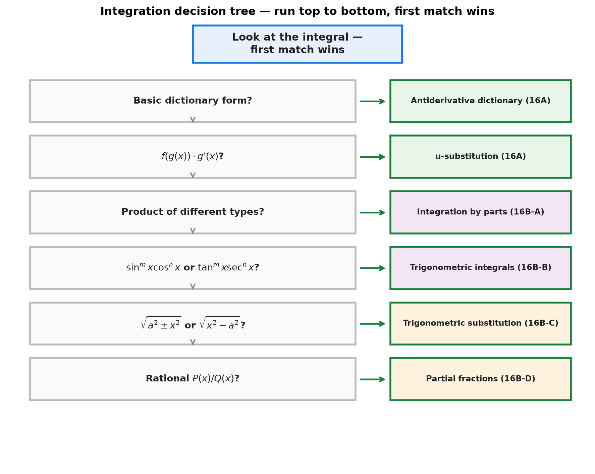
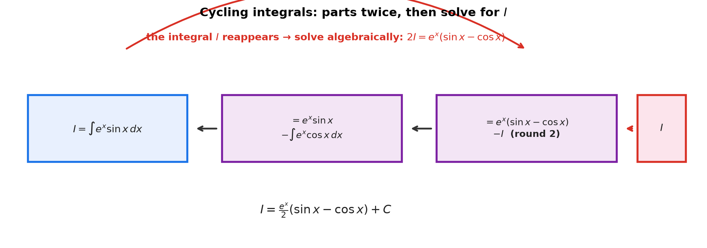
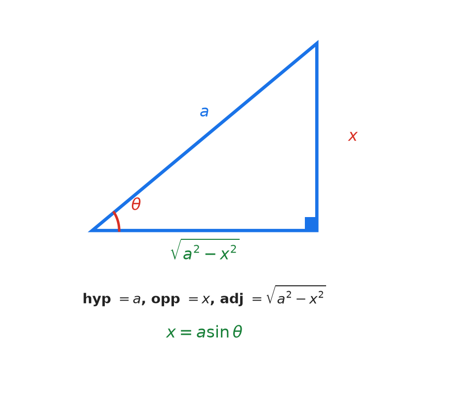
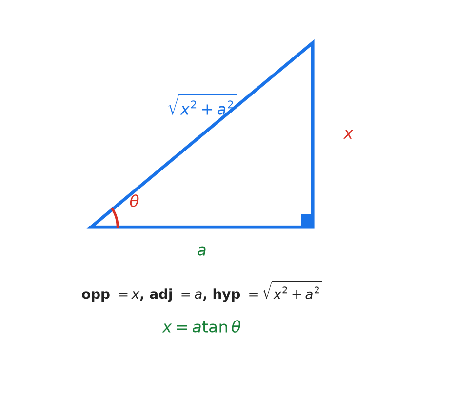
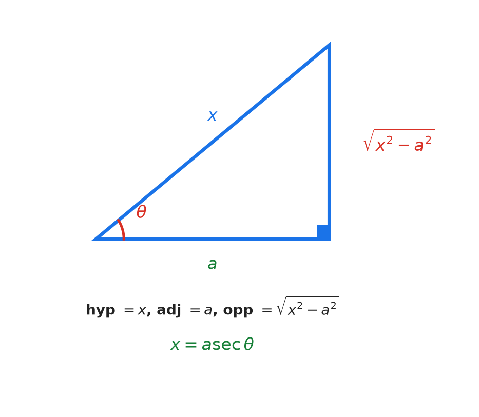

# Session 16B: Advanced Integration — Parts, Trig Integrals, Trig Sub, Partial Fractions

**Phase 2 — Classical Techniques | 85 min**

*Four technique families. Each has a clear trigger, a step-by-step procedure, and a telltale pattern. The hard part isn't executing any single technique — it's choosing the right one. This session teaches you the decision tree.*

**Prerequisites**: 16A (FTC & $u$-sub), 14B (chain/product rules), 11A (trig)

> 💡 **Stuck?** Every drill below has a collapsible **Hint** — click it only when you need a nudge.

---

## The Integration Decision Tree

> **Before you start**, run this checklist top to bottom. The first match wins.

```
Look at the integral. Ask:

1. Is it a basic form from the dictionary?           →  Antiderivative dictionary (16A)
2. Is it f(g(x))·g'(x) — a function AND its deriv?   →  u-substitution (16A)
3. Is it a PRODUCT of two different function types?   →  Integration by PARTS (16B-A)
4. Is it sin^m cos^n or tan^m sec^n?                 →  Trigonometric INTEGRALS (16B-B)
5. Is there √(a²±x²) or √(x²-a²)?                    →  Trigonometric SUBSTITUTION (16B-C)
6. Is it a rational function P(x)/Q(x)?              →  PARTIAL FRACTIONS (16B-D)
```

---

## Part A: Integration by Parts — Undoing the Product Rule

> **Trigger**: A **product of two unrelated function families** (polynomial×exponential, log×polynomial, inverse trig×anything).
>
> **Procedure**: $\int u\,dv = uv - \int v\,du$. Choose $u$ using LIATE. Let $dv$ be everything else.

---

## Example 1: The Parts Algorithm — Six Steps

**Algorithm for $\int f(x)g(x)\,dx$**:

| Step | Action |
|:---:|:---|
| 1 | **Choose $u$** using LIATE: **L**og, **I**nverse trig, **A**lgebraic ($x^n$), **T**rig, **E**xponential |
| 2 | **Set $dv$** = everything else (including $dx$) |
| 3 | **Compute $du$** = derivative of $u$, times $dx$ |
| 4 | **Compute $v$** = integrate $dv$ (no $+C$ needed here) |
| 5 | **Assemble**: $uv - \int v\,du$ |
| 6 | **Integrate** $\int v\,du$. It should be simpler than the original |

**Why it works — the product rule in reverse**:

The product rule (14A) reads $d(uv) = u\,dv + v\,du$. Integrate both sides: $uv = \int u\,dv + \int v\,du$, so $\int u\,dv = uv - \int v\,du$. You can't integrate the product as-is, but you *can* if one factor is a derivative you recognize — parts splits the product so one piece integrates and the other differentiates into something simpler.

> **How to think**: LIATE is a *ranking of what gets simpler when differentiated* — log (→ algebraic), inverse trig (→ algebraic), polynomial (→ lower degree), trig (→ cycles), exponential (→ never simpler). Pick $u$ as the factor whose derivative moves toward the dictionary; everything else becomes $dv$.

---

## Example 2: Polynomial × Exponential — LIATE in Action

$\int x e^x\,dx$.

| Step | Action |
|:---:|:---|
| 1 | $u = x$ (Algebraic beats Exponential) |
| 2 | $dv = e^x\,dx$ |
| 3 | $du = 1\cdot dx$ |
| 4 | $v = \int e^x\,dx = e^x$ |
| 5 | $uv - \int v\,du = x e^x - \int e^x\,dx$ |
| 6 | $= x e^x - e^x + C = e^x(x-1) + C$ |

**Check**: $\frac{d}{dx}[e^x(x-1)] = e^x(x-1) + e^x(1) = x e^x$. ✓

---

## Example 3: Log × Anything — Log Always Wins (LIATE Priority 1)

$\int \ln x\,dx$. This is a product of $\ln x$ and $1$ (implicit).

| Step | Action |
|:---:|:---|
| 1 | $u = \ln x$ (Log — highest priority) |
| 2 | $dv = 1\cdot dx$ |
| 3 | $du = \frac{1}{x}\,dx$ |
| 4 | $v = \int 1\,dx = x$ |
| 5, 6 | $x\ln x - \int x\cdot\frac{1}{x}\,dx = x\ln x - \int 1\,dx = x\ln x - x + C$ |

**Memorize**: $\int \ln x\,dx = x\ln x - x + C$. This comes up constantly.

---

## Example 4: Inverse Trig — LIATE Priority 2

$\int \arctan x\,dx$.

| Step | Action |
|:---:|:---|
| 1 | $u = \arctan x$ (Inverse trig beats implicit 1) |
| 2 | $dv = 1\cdot dx$ |
| 3 | $du = \frac{1}{1+x^2}\,dx$ |
| 4 | $v = x$ |
| 5, 6 | $x\arctan x - \int \frac{x}{1+x^2}\,dx$ |

The new integral is now a $u$-sub: $w=1+x^2$, $dw=2x\,dx$.
$= x\arctan x - \frac{1}{2}\ln(1+x^2) + C$.

---

## Example 5: Two Rounds — Trig × Exponential (The Cycling Pattern)

$\int e^x\sin x\,dx$. Neither function simplifies when differentiated. The integral **cycles**.

**Procedure for cycling integrals**:
1. Apply parts twice. Name the original integral $I$.
2. When $I$ reappears, solve for it algebraically.
3. Add $+C$ at the very end.

| Round | $u$ | $dv$ | $du$ | $v$ | Result |
|:---:|:---|:---|:---|:---|:---|
| 1 | $\sin x$ | $e^x dx$ | $\cos x\,dx$ | $e^x$ | $I = e^x\sin x - \int e^x\cos x\,dx$ |
| 2 | $\cos x$ | $e^x dx$ | $-\sin x\,dx$ | $e^x$ | $I = e^x\sin x - (e^x\cos x + I)$ |

Simplify: $I = e^x\sin x - e^x\cos x - I$ → $2I = e^x(\sin x - \cos x)$ → $I = \frac{e^x}{2}(\sin x - \cos x) + C$.

**Add $+C$ only when the integral is fully solved** — at the end.



---

## Example 6: Parts Quick Reference

| If you see... | Choose $u=$ | Why |
|:---|:---|:---|
| $x^n e^{kx}$ | $u = x^n$ | Differentiating polynomial lowers its degree → simpler |
| $x^n \sin x$ or $x^n \cos x$ | $u = x^n$ | Same — polynomial simplifies |
| $(\ln x) \times (\text{anything})$ | $u = \ln x$ | Derivative is $\frac{1}{x}$, which tames the rest |
| $(\arctan x) \times (\text{anything})$ | $u = \text{inverse trig}$ | Derivative is algebraic → simpler |
| $e^{kx}\sin(mx)$ or $e^{kx}\cos(mx)$ | Either | It cycles — apply twice, solve for $I$ |

---

## Part B: Trigonometric Integrals — Exploiting $\sin^2+\cos^2=1$

> **Trigger**: The integrand is built from $\sin^m x$, $\cos^n x$, $\tan^m x$, $\sec^n x$.
>
> **Strategy**: Use identities to reduce to a $u$-sub.

---

## Example 7: $\int \sin^m x\cos^n x\,dx$ — The Parity Decision Tree

```
Check the exponents m and n:

Is m ODD?
  → Peel off ONE sin x.
  → Convert sin^{m-1} x to (1−cos²x)^{(m-1)/2}.
  → u = cos x, du = −sin x dx.
  
Is n ODD?  (if m is even)
  → Peel off ONE cos x.
  → Convert cos^{n-1} x to (1−sin²x)^{(n-1)/2}.
  → u = sin x, du = cos x dx.
  
Are BOTH EVEN?
  → Use half-angle: sin²x = (1−cos2x)/2, cos²x = (1+cos2x)/2.
  → Reduces powers. Repeat if needed.
```

---

## Example 8: Odd Power — Peel, Convert, $u$-Sub

$\int \sin^3 x\,dx$. $m=3$ (odd). Follow the "m odd" branch.

1. **Peel**: $\sin^3 x = \sin x \cdot \sin^2 x$.
2. **Convert**: $\sin^2 x = 1 - \cos^2 x$. Integral: $\int \sin x(1-\cos^2 x)\,dx$.
3. **$u$-sub**: $u = \cos x$, $du = -\sin x\,dx \to \sin x\,dx = -du$.
4. **Integrate**: $\int (1-u^2)(-du) = -u + \frac{u^3}{3} + C$.
5. **Back**: $-\cos x + \frac{\cos^3 x}{3} + C$.

---

## Example 9: Even Power — Half-Angle Formula

$\int \cos^2 x\,dx$. $n=2$ (even, and $m=0$ which is even too).

1. **Half-angle**: $\cos^2 x = \frac{1+\cos 2x}{2}$.
2. **Integrate**: $\int \frac{1+\cos 2x}{2}\,dx = \frac{1}{2}\int (1+\cos 2x)\,dx$.
3. $= \frac{1}{2}(x + \frac{\sin 2x}{2}) + C = \frac{x}{2} + \frac{\sin 2x}{4} + C$.

**Why half-angle works**: $\sin^2 x$ and $\cos^2 x$ have no dictionary entry — but $\cos 2x$ does (its antiderivative $\frac{\sin 2x}{2}$ comes straight from the chain rule: $\frac{d}{dx}\sin 2x = 2\cos 2x$). The half-angle identities trade an unintegratable square for an integratable first power.

> **How to think**: Odd powers → peel one off, then $u$-sub. Even powers → half-angle. The parity tree in Example 7 is the thinking; these two moves cover every $\sin^m x\cos^n x$.

---

## Example 10: $\int \tan^m x\sec^n x\,dx$ — Save $\sec^2 x$

```
Is n EVEN (n≥2)?
  → Save ONE sec²x. It becomes du.
  → Convert remaining sec^{n-2} to (tan²x+1)^{(n-2)/2}.
  → u = tan x, du = sec²x dx.
  
Is m ODD (n≥1)?
  → Save ONE sec x tan x. It becomes du.
  → Convert remaining tan^{m-1} to (sec²x−1)^{(m-1)/2}.
  → u = sec x, du = sec x tan x dx.
  
Otherwise → convert everything to sin/cos and use the sin^m cos^n strategy.
```

$\int \tan^3 x\sec^2 x\,dx$: $n=2$ (even). Save $\sec^2 x$ for $du$.
$u = \tan x$, $du = \sec^2 x\,dx$. Integral = $\int u^3\,du = \frac{\tan^4 x}{4} + C$.

---

## Part C: Trigonometric Substitution — Killing the Square Root

> **Trigger**: The integrand contains $\sqrt{a^2 \pm x^2}$ or $\sqrt{x^2 - a^2}$.
>
> **Strategy**: Replace $x$ with a trig function. The root disappears via a Pythagorean identity.

---

## Example 11: The Trig Sub Lookup Table

| Form | Substitute | $dx$ becomes | The root simplifies to |
|:---|:---|:---|:---|
| $\sqrt{a^2-x^2}$ | $x = a\sin\theta$ | $a\cos\theta\,d\theta$ | $a\cos\theta$ |
| $\sqrt{a^2+x^2}$ | $x = a\tan\theta$ | $a\sec^2\theta\,d\theta$ | $a\sec\theta$ |
| $\sqrt{x^2-a^2}$ | $x = a\sec\theta$ | $a\sec\theta\tan\theta\,d\theta$ | $a\tan\theta$ |

**Why it works — the Pythagorean identities in reverse**:

The square root is the obstacle. Each substitution makes the inside a perfect square via a Pythagorean identity:

- $\sqrt{a^2-x^2}$: $x=a\sin\theta$ → $\sqrt{a^2(1-\sin^2\theta)}=a\cos\theta$ (uses $\cos^2=1-\sin^2$).
- $\sqrt{a^2+x^2}$: $x=a\tan\theta$ → $\sqrt{a^2(1+\tan^2\theta)}=a\sec\theta$ (uses $\sec^2=1+\tan^2$).
- $\sqrt{x^2-a^2}$: $x=a\sec\theta$ → $\sqrt{a^2(\sec^2\theta-1)}=a\tan\theta$ (uses $\tan^2=\sec^2-1$).

One move, three faces: **kill the root by turning the inside into a perfect square with an identity.** The right triangle (Ex 14) is just the reverse mapping back to $x$.

> **How to think**: See a root of a sum/difference of squares → ask "which identity makes this a perfect square?" That choice IS the substitution.

---

## Example 12: Trig Sub Step by Step

| Step | Action | For $\int\frac{dx}{\sqrt{4-x^2}}$ |
|:---:|:---|:---|
| 1 | **Identify** the root form | $\sqrt{4-x^2} = \sqrt{2^2-x^2}$ → Form 1 |
| 2 | **Substitute** $x$ and $dx$ | $x = 2\sin\theta$, $dx = 2\cos\theta\,d\theta$ |
| 3 | **Simplify** the root | $\sqrt{4-x^2} = \sqrt{4-4\sin^2\theta} = 2\cos\theta$ |
| 4 | **Rewrite** integral in $\theta$ | $\int\frac{2\cos\theta\,d\theta}{2\cos\theta} = \int d\theta$ |
| 5 | **Integrate** | $\theta + C$ |
| 6 | **Back-substitute** via right triangle | $\theta = \arcsin(x/2)$ |

---

## Example 13: $\sqrt{a^2+x^2}$ — The Tangent Case

$\int \frac{dx}{\sqrt{x^2+1}}$. Form: $\sqrt{x^2+1}$ → $x=\tan\theta$, $a=1$.

1. $x = \tan\theta$, $dx = \sec^2\theta\,d\theta$.
2. $\sqrt{x^2+1} = \sqrt{\tan^2\theta+1} = \sec\theta$.
3. Integral: $\int \frac{\sec^2\theta\,d\theta}{\sec\theta} = \int \sec\theta\,d\theta$.
4. $\int \sec\theta\,d\theta = \ln|\sec\theta + \tan\theta| + C$. (Standard — memorize.)
5. **Back-substitute**: Draw a right triangle with angle $\theta$, opposite = $x$, adjacent = $1$. Hypotenuse = $\sqrt{x^2+1}$. So $\sec\theta = \sqrt{x^2+1}$, $\tan\theta = x$.
6. Answer: $\ln|x + \sqrt{x^2+1}| + C$.

> **Where $\int\sec\theta\,d\theta$ comes from** (used in step 4): multiply by $\frac{\sec\theta+\tan\theta}{\sec\theta+\tan\theta}$:
> $\int\sec\theta\,d\theta = \int\frac{\sec^2\theta+\sec\theta\tan\theta}{\sec\theta+\tan\theta}\,d\theta$.
> With $u = \sec\theta+\tan\theta$ (whose derivative is exactly the numerator), this becomes $\int\frac{du}{u} = \ln|\sec\theta+\tan\theta| + C$.

---

## Example 14: The Right Triangle Method

**After integrating in $\theta$, draw a right triangle to express trig functions in $x$:**

| Substitution | Triangle label | $\sin\theta$ | $\cos\theta$ | $\tan\theta$ | $\sec\theta$ |
|:---|:---|:---|:---|:---|:---|
| $x=a\sin\theta$ | Opp=$x$, Hyp=$a$ | $x/a$ | $\sqrt{a^2-x^2}/a$ | $x/\sqrt{a^2-x^2}$ | — |
| $x=a\tan\theta$ | Opp=$x$, Adj=$a$ | $x/\sqrt{x^2+a^2}$ | $a/\sqrt{x^2+a^2}$ | $x/a$ | $\sqrt{x^2+a^2}/a$ |
| $x=a\sec\theta$ | Hyp=$x$, Adj=$a$ | $\sqrt{x^2-a^2}/x$ | $a/x$ | $\sqrt{x^2-a^2}/a$ | $x/a$ |

| $x=a\sin\theta$ | $x=a\tan\theta$ | $x=a\sec\theta$ |
|:---:|:---:|:---:|
|  |  |  |

---

## Part D: Partial Fractions — Splitting Rational Functions

> **Trigger**: The integrand is $\frac{P(x)}{Q(x)}$ — a rational function with a factorable denominator.
>
> **Strategy**: Decompose into a sum of simpler fractions, each matching the dictionary.

---

## Example 15: The Partial Fractions Algorithm

| Step | Action |
|:---:|:---|
| 1 | **Check degrees**: If $\deg(P) \geq \deg(Q)$, do polynomial long division FIRST |
| 2 | **Factor** $Q(x)$ into linear factors $(ax+b)^k$ and irreducible quadratics $(ax^2+bx+c)^m$ |
| 3 | **Write decomposition** using the template below |
| 4 | **Solve** for constants $A,B,C,\ldots$ (plug roots or match coefficients) |
| 5 | **Integrate** each term |

---

## Example 16: Decomposition Templates

| Factor type | Template |
|:---|:---|
| $(ax+b)$ — distinct linear | $\dfrac{A}{ax+b}$ |
| $(ax+b)^k$ — repeated linear | $\dfrac{A_1}{ax+b} + \dfrac{A_2}{(ax+b)^2} + \cdots + \dfrac{A_k}{(ax+b)^k}$ |
| $ax^2+bx+c$ — irreducible quadratic | $\dfrac{Ax+B}{ax^2+bx+c}$ |

---

## Example 17: Distinct Linear Factors

$\int \frac{1}{x^2-1}\,dx = \int \frac{1}{(x-1)(x+1)}\,dx$.

1. Degree: 0 < 2. No division.
2. Denominator already factored: $(x-1)(x+1)$.
3. Template: $\frac{1}{(x-1)(x+1)} = \frac{A}{x-1} + \frac{B}{x+1}$.
4. Clear denominators: $1 = A(x+1) + B(x-1)$.

**Solve by plugging roots** (fastest):
- Plug $x=1$: $1 = 2A \to A = 1/2$.
- Plug $x=-1$: $1 = -2B \to B = -1/2$.

5. Integrate: $\int (\frac{1/2}{x-1} - \frac{1/2}{x+1})\,dx = \frac{1}{2}\ln|x-1| - \frac{1}{2}\ln|x+1| + C = \frac{1}{2}\ln\left|\frac{x-1}{x+1}\right| + C$.

**Why it works — reverse of the common-denominator trick**:

You already know how to *add* $\frac{A}{x-1}+\frac{B}{x+1}$: common denominator $(x-1)(x+1)$, numerator $A(x+1)+B(x-1)$. Partial fractions run that operation **backward** — given the single fraction $\frac{1}{(x-1)(x+1)}$, find $A,B$ so that the "added" numerator $A(x+1)+B(x-1)$ equals $1$. Plugging roots ($x=1$ kills the $B$-term; $x=-1$ kills the $A$-term) is the fastest way to reverse the addition.

> **How to think**: A rational function is a sum of "dictionary atoms" — $\frac{1}{ax+b}$ (→ ln), $\frac{1}{(ax+b)^k}$ (→ power), $\frac{Ax+B}{x^2+c^2}$ (→ arctan/ln). Partial fractions is the machinery that decomposes any proper fraction into exactly these atoms.

---

## Example 18: Repeated Linear Factor

$\int \frac{x}{(x-1)^2}\,dx$.

Template: $\frac{x}{(x-1)^2} = \frac{A}{x-1} + \frac{B}{(x-1)^2}$.
Clear: $x = A(x-1) + B = Ax + (B-A)$.
Match: $A=1$, $B-A=0 \to B=1$.

Integrate: $\int (\frac{1}{x-1} + \frac{1}{(x-1)^2})\,dx = \ln|x-1| - \frac{1}{x-1} + C$.

---

## Example 19: Quadratic Factor

$\int \frac{1}{x(x^2+1)}\,dx$.

Template: $\frac{1}{x(x^2+1)} = \frac{A}{x} + \frac{Bx+C}{x^2+1}$.
Clear: $1 = A(x^2+1) + (Bx+C)x = (A+B)x^2 + Cx + A$.
Match: $A+B=0$, $C=0$, $A=1 \to B=-1$.

Integrate: $\int (\frac{1}{x} - \frac{x}{x^2+1})\,dx = \ln|x| - \frac{1}{2}\ln(x^2+1) + C$.

---

## Example 19A: Completing the Square — Quadratic Denominators

When the denominator is an irreducible quadratic WITH an $x$-term (not the clean form $x^2+a^2$), **complete the square** first:

$x^2+bx+c = \left(x+\frac{b}{2}\right)^2 + \left(c-\frac{b^2}{4}\right)$.

**$\int \frac{dx}{x^2+2x+5}$** (arctan form):
$x^2+2x+5 = (x+1)^2+4$. Let $u=x+1$: $\int\frac{du}{u^2+2^2} = \frac{1}{2}\arctan\frac{u}{2}+C = \frac{1}{2}\arctan\frac{x+1}{2}+C$.

**$\int \frac{dx}{\sqrt{8x-x^2}}$** (arcsin form):
$8x-x^2 = 16-(x-4)^2$ — a perfect square minus a square. Let $u=x-4$:
$\int\frac{du}{\sqrt{4^2-u^2}} = \arcsin\frac{u}{4}+C = \arcsin\frac{x-4}{4}+C$.

> **When to reach for it**: denominator $x^2+bx+c$ with $b\neq0$ → arctan form; or a square-minus-square under a root → arcsin form.

---

## Example 20: When Long Division Is Required First

$\int \frac{x^3}{x^2+1}\,dx$. Degree: $3 \geq 2$ → divide.

$x^3 \div (x^2+1)$: $x^3 = x(x^2+1) - x$. So $\frac{x^3}{x^2+1} = x - \frac{x}{x^2+1}$.

Integrate: $\int x\,dx - \int \frac{x}{x^2+1}\,dx = \frac{x^2}{2} - \frac{1}{2}\ln(x^2+1) + C$.

**Why divide first — the degree check IS the thinking**:

A fraction with $\deg P \geq \deg Q$ is not yet in dictionary form: it contains a polynomial part that *grows*, which no $\frac{1}{ax+b}$ atom can reproduce. Long division peels off that polynomial part (integrated by the power rule) and leaves a **proper** fraction ($\deg P < \deg Q$) that partial fractions can decompose. This mirrors ordinary arithmetic: just as $\frac{7}{3} = 2 + \frac{1}{3}$, every rational function splits as **polynomial + proper fraction** — and each half has its own technique.

> **How to think**: Fixed order: **divide → factor → decompose → integrate.** Check degrees first (is it proper?), factor second (can the dictionary see the pieces?), then decompose. Skipping the degree check is the classic error.

> **Up to here**: Parts (LIATE). Trig integrals (odd→peel+sub, even→half-angle, tan/sec→save sec²). Trig sub (√form→sin/tan/sec). Partial fractions (factor→template→solve→integrate). All four techniques integrated into one decision tree.

---

## Common Mistakes

### Mistake 1: Choosing $u$ and $dv$ backwards in parts

**Wrong**: $u=e^x$, $dv=x\,dx$ for $\int xe^x\,dx$. Then $\int v\,du = \int \frac{x^2}{2}e^x\,dx$ — worse! **Right**: $u=x$, $dv=e^x\,dx$. The new integral $\int e^x\,dx$ is simpler.

### Mistake 2: Using trig sub when $u$-sub is faster

**Wrong**: $\int \frac{x}{\sqrt{1-x^2}}\,dx$ → trig sub leads to $\int \sin\theta\,d\theta$. **Right**: $u=1-x^2$, $du=-2x\,dx$. One step: $-\frac{1}{2}\int u^{-1/2}\,du = -\sqrt{1-x^2} + C$. Always check if a simple $u$-sub works first.

### Mistake 3: Wrong trig substitution for the root form

**Wrong**: $x=2\sin\theta$ for $\sqrt{x^2+4}$. Then $\sqrt{4\sin^2\theta+4}$ does NOT simplify. **Right**: $x=2\tan\theta$. Then $\sqrt{4\tan^2\theta+4} = 2\sec\theta$.

### Mistake 4: Forgetting long division before partial fractions

**Wrong**: Decomposing $\frac{x^3}{x^2-1}$ directly. **Right**: Numerator degree (3) ≥ denominator degree (2). Divide first: result = $x + \frac{x}{x^2-1}$. Then decompose the remainder.

### Mistake 5: Half-angle when an odd power is available

**Wrong**: Using $\sin^2 x = \frac{1-\cos 2x}{2}$ for $\int \sin^3 x\,dx$. **Right**: Peel one $\sin x$, convert $\sin^2 x = 1-\cos^2 x$, $u$-sub with $u=\cos x$. Much faster.

---

## What We Just Did

```
(1) Parts: ∫u dv = uv − ∫v du. LIATE for u. Cycle → apply twice, solve for I.

(2) Trig Integrals:
    sin^m cos^n: odd→peel+convert+u-sub. both even→half-angle.
    tan^m sec^n: even n→save sec², u=tan. odd m→save sec tan, u=sec.

(3) Trig Sub: √(a²−x²)→x=a sinθ. √(a²+x²)→x=a tanθ. √(x²−a²)→x=a secθ.
    Right triangle for back-substitution.

(4) Partial Fractions:
    deg(P)≥deg(Q)? → long divide first.
    Factor Q. Write template. Solve constants. Integrate each term.
```

---

## Practice 1

<details>
<summary><b>P1.1</b></summary>

Choose $u$ and $dv$ using LIATE.

<details>
<summary><b>P1.2</b></summary>

Compute $du$ and $v$.

<details>
<summary><b>P1.3</b></summary>

Assemble $uv - \int v\,du$ and integrate.

</details>
</details>
</details>

→ Solutions: [Solutions](solutions/16B-solutions.md#practice-1)

---

## Practice 2

<details>
<summary><b>P2.1</b></summary>

Check the parity of the exponents.

<details>
<summary><b>P2.2</b></summary>

Peel one $\cos x$, convert the rest.

<details>
<summary><b>P2.3</b></summary>

Substitute and integrate.

</details>
</details>
</details>

→ Solutions: [Solutions](solutions/16B-solutions.md#practice-2)

---

## Practice 3

<details>
<summary><b>P3.1</b></summary>

Recognize the form of $\frac{1}{x^2+4}$.

<details>
<summary><b>P3.2</b></summary>

Apply the arctan formula directly.

<details>
<summary><b>P3.3</b></summary>

Show the same result via trig sub $x=2\tan\theta$.

</details>
</details>
</details>

→ Solutions: [Solutions](solutions/16B-solutions.md#practice-3)

---

## Practice 4

<details>
<summary><b>P4.1</b></summary>

Factor the denominator.

<details>
<summary><b>P4.2</b></summary>

Write the partial fractions template.

<details>
<summary><b>P4.3</b></summary>

Solve for the constants.

<details>
<summary><b>P4.4</b></summary>

Integrate each term.

</details>
</details>
</details>
</details>

→ Solutions: [Solutions](solutions/16B-solutions.md#practice-4)

---

## Practice 5: Real Battle (Constructive)

A classmate sees $\int \frac{x}{\sqrt{1-x^2}}\,dx$ and says: "Trig sub! $\sqrt{1-x^2}$ means $x=\sin\theta$."

<details>
<summary><b>P5.1</b></summary>

Is there a faster way? Solve it with $u$-sub.

<details>
<summary><b>P5.2</b></summary>

Now solve $\int \frac{1}{\sqrt{1-x^2}}\,dx$ — was trig sub the right call this time?

<details>
<summary><b>P5.3</b></summary>

Write a one-sentence rule: when $\sqrt{a^2-x^2}$ appears, how do you choose between $u$-sub and trig sub?

</details>
</details>
</details>

→ Solutions: [Solutions](solutions/16B-solutions.md#practice-5)

---

## Basic Drills

> Use the decision tree to identify the technique first, then solve each sub-problem in order.

**B1.** $\int x\cos x\,dx$

<details>
<summary><b>B1.1</b></summary>

Choose $u$ and $dv$ (LIATE).

<details>
<summary><b>B1.2</b></summary>

Assemble and integrate.

</details>
</details>

**B2.** $\int \ln(2x)\,dx$

<details>
<summary><b>B2.1</b></summary>

Choose $u$ (implicit product with $1$).

<details>
<summary><b>B2.2</b></summary>

Assemble and integrate.

</details>
</details>

**B3.** $\int \sin^2 x\,dx$

<details>
<summary><b>B3.1</b></summary>

Check parity and choose the identity.

<details>
<summary><b>B3.2</b></summary>

Integrate.

</details>
</details>

**B4.** $\int \tan x\sec^2 x\,dx$

<details>
<summary><b>B4.1</b></summary>

Check parity and save the piece that becomes $du$.

<details>
<summary><b>B4.2</b></summary>

Substitute and integrate.

</details>
</details>

**B5.** $\int \frac{dx}{\sqrt{9-x^2}}$

<details>
<summary><b>B5.1</b></summary>

Identify the root form.

<details>
<summary><b>B5.2</b></summary>

Apply the matching substitution (or dictionary entry).

</details>
</details>

**B6.** $\int \frac{dx}{x^2+9}$

<details>
<summary><b>B6.1</b></summary>

Identify the form.

<details>
<summary><b>B6.2</b></summary>

Apply the arctan formula.

</details>
</details>

**B7.** $\int \frac{dx}{x^2-x}$

<details>
<summary><b>B7.1</b></summary>

Factor the denominator.

<details>
<summary><b>B7.2</b></summary>

Decompose and integrate.

</details>
</details>

**B8.** $\int x^2 e^x\,dx$

<details>
<summary><b>B8.1</b></summary>

First round of parts.

<details>
<summary><b>B8.2</b></summary>

Second round and finish.

</details>
</details>

**B9.** $\int \sin x\cos x\,dx$

<details>
<summary><b>B9.1</b></summary>

Solve with $u = \sin x$.

<details>
<summary><b>B9.2</b></summary>

Solve with $\sin 2x = 2\sin x\cos x$.

<details>
<summary><b>B9.3</b></summary>

Verify the answers agree.

</details>
</details>
</details>

**B10.** $\int \frac{x}{\sqrt{1-x^2}}\,dx$

<details>
<summary><b>B10.1</b></summary>

Choose the faster method.

<details>
<summary><b>B10.2</b></summary>

Compute.

</details>
</details>

**B11.** $\int \frac{dx}{x^2+6x+13}$

<details>
<summary><b>B11.1</b></summary>

Complete the square.

<details>
<summary><b>B11.2</b></summary>

Integrate (arctan form).

</details>
</details>

**B12.** $\int \sec x\,dx$

<details>
<summary><b>B12.1</b></summary>

Multiply by the right form of $1$.

<details>
<summary><b>B12.2</b></summary>

Integrate.

</details>
</details>

> Solutions: [Solutions](solutions/16B-solutions.md#basic-drill)

---

## Calculation Drills

> Pure computation — solve each sub-problem in order, then the full problem. No hints.

**C1.** $\int \frac{5x+7}{x^2+x-2}\,dx$

<details>
<summary><b>C1.1</b></summary>

Factor the denominator.

<details>
<summary><b>C1.2</b></summary>

Write the partial fractions template.

<details>
<summary><b>C1.3</b></summary>

Solve for the constants.

<details>
<summary><b>C1.4</b></summary>

Integrate.

</details>
</details>
</details>
</details>

**C2.** $\int x^2\ln x\,dx$

<details>
<summary><b>C2.1</b></summary>

Choose $u$ (LIATE).

<details>
<summary><b>C2.2</b></summary>

Apply parts.

<details>
<summary><b>C2.3</b></summary>

Integrate the leftover.

</details>
</details>
</details>

**C3.** $\int_0^{\pi/2} x\cos x\,dx$

<details>
<summary><b>C3.1</b></summary>

Apply parts.

<details>
<summary><b>C3.2</b></summary>

Evaluate at the bounds.

</details>
</details>

**C4.** $\int \tan^3 x\sec^4 x\,dx$

<details>
<summary><b>C4.1</b></summary>

Check parity, save the $du$ piece.

<details>
<summary><b>C4.2</b></summary>

Convert the rest and substitute.

<details>
<summary><b>C4.3</b></summary>

Integrate.

</details>
</details>
</details>

**C5.** $\int_0^{\pi/2}\sin^4 x\cos^3 x\,dx$

<details>
<summary><b>C5.1</b></summary>

Check parity.

<details>
<summary><b>C5.2</b></summary>

Peel, convert, substitute.

<details>
<summary><b>C5.3</b></summary>

Integrate and evaluate.

</details>
</details>
</details>

**C6.** $\int \frac{dx}{(x^2+1)^{3/2}}$

<details>
<summary><b>C6.1</b></summary>

Choose the trig substitution.

<details>
<summary><b>C6.2</b></summary>

Substitute and simplify.

<details>
<summary><b>C6.3</b></summary>

Integrate and back-substitute.

</details>
</details>
</details>

**C7.** $\int \frac{x^2}{\sqrt{4-x^2}}\,dx$

<details>
<summary><b>C7.1</b></summary>

Choose the trig substitution.

<details>
<summary><b>C7.2</b></summary>

Integrate in $\theta$.

<details>
<summary><b>C7.3</b></summary>

Back-substitute via the right triangle.

</details>
</details>
</details>

**C8.** $\int e^{2x}\sin 3x\,dx$

<details>
<summary><b>C8.1</b></summary>

First round of parts.

<details>
<summary><b>C8.2</b></summary>

Second round.

<details>
<summary><b>C8.3</b></summary>

Solve for $I$.

</details>
</details>
</details>

**C9.** $\int \frac{3x^2+4x+3}{(x+1)(x^2+1)}\,dx$

<details>
<summary><b>C9.1</b></summary>

Write the decomposition template.

<details>
<summary><b>C9.2</b></summary>

Solve for the constants.

<details>
<summary><b>C9.3</b></summary>

Integrate each term.

</details>
</details>
</details>

**C10.** $\int_0^1 x\arctan x\,dx$

<details>
<summary><b>C10.1</b></summary>

Apply parts.

<details>
<summary><b>C10.2</b></summary>

Handle the leftover integral.

<details>
<summary><b>C10.3</b></summary>

Evaluate.

</details>
</details>
</details>

> Solutions: [Solutions](solutions/16B-solutions.md#calculation-drill)

---

## Advanced Drills

> Each problem is scoped into sub-problems: compute first, then explain. Don't skip the explanation parts.

**A1.** $\int e^x\cos x\,dx$

<details>
<summary><b>A1.1</b></summary>

Solve by cycling (parts twice).

<details>
<summary><b>A1.2</b></summary>

Explain why choosing $u = \cos x$ vs $u = e^x$ does not change the outcome.

</details>
</details>

**A2.** $\int \sin^4 x\,dx$

<details>
<summary><b>A2.1</b></summary>

Compute the integral.

<details>
<summary><b>A2.2</b></summary>

Use the even-power pattern $\int_0^{\pi/2}\sin^n x\,dx = \frac{n-1}{n}\cdot\frac{n-3}{n-2}\cdots\frac12\cdot\frac{\pi}{2}$ to write the $n=2$ and $n=4$ values.

<details>
<summary><b>A2.3</b></summary>

State $\int_0^{\pi/2}\cos^4 x\,dx$ without integrating.

</details>
</details>
</details>

**A3.** $\int \frac{dx}{(x^2+1)^2}$

<details>
<summary><b>A3.1</b></summary>

Solve via trig sub.

<details>
<summary><b>A3.2</b></summary>

Find the constant $C$ such that $\int_0^1 = \frac{\pi}{8} + C$, without extra integration.

</details>
</details>

**A4.** $\int \frac{x^3}{\sqrt{x^2+1}}\,dx$

<details>
<summary><b>A4.1</b></summary>

Compute the integral.

<details>
<summary><b>A4.2</b></summary>

Compute $\int \frac{x^5}{\sqrt{x^2+1}}\,dx$ with the same move.

<details>
<summary><b>A4.3</b></summary>

Describe how the answer's terms grow as the odd power increases.

</details>
</details>
</details>

**A5.** $\int \frac{x^2+2x-1}{(x-1)(x^2+1)}\,dx$

<details>
<summary><b>A5.1</b></summary>

Compute the integral.

<details>
<summary><b>A5.2</b></summary>

Check the answer by substituting $x=0$ into both sides.

<details>
<summary><b>A5.3</b></summary>

Explain why $B=0$ is plausible from the original numerator.

</details>
</details>
</details>

**A6.** $\int \arctan x\,dx$

<details>
<summary><b>A6.1</b></summary>

Compute the integral.

<details>
<summary><b>A6.2</b></summary>

Compute $\int x\arctan x\,dx$ with the same first move.

<details>
<summary><b>A6.3</b></summary>

Explain why the $\frac12\ln(1+x^2)$ carries a $\frac12$.

</details>
</details>
</details>

**A7.** $\int \sec^3 x\,dx$

<details>
<summary><b>A7.1</b></summary>

Compute the integral.

<details>
<summary><b>A7.2</b></summary>

Derive $\int \sec^5 x\,dx$ using the recursion $I_n = \frac{\sec^{n-2}x\tan x}{n-1} + \frac{n-2}{n-1}I_{n-2}$.

</details>
</details>

**A8.** $\int \frac{\sqrt{x^2-4}}{x}\,dx$

<details>
<summary><b>A8.1</b></summary>

Compute the integral.

<details>
<summary><b>A8.2</b></summary>

Write the choice table (which substitution for each root form).

<details>
<summary><b>A8.3</b></summary>

Explain where $|2\tan\theta|$ comes from and why you may drop the bars.

</details>
</details>
</details>

**A9.** $\int x\arcsin x\,dx$

<details>
<summary><b>A9.1</b></summary>

Compute the integral.

<details>
<summary><b>A9.2</b></summary>

Compare with A6's $\int \arctan x\,dx$ — identify the shared structure and where the $\frac14$ factors appear.

</details>
</details>

**A10.** $\int_0^{\pi/2}\sin^3 x\cos^2 x\,dx$

<details>
<summary><b>A10.1</b></summary>

Compute the integral.

<details>
<summary><b>A10.2</b></summary>

Evaluate $\int_0^{\pi/2}\sin^2 x\cos^2 x\,dx$.

<details>
<summary><b>A10.3</b></summary>

Explain why one answer is rational and the other contains $\pi$.

</details>
</details>
</details>

> Solutions: [Solutions](solutions/16B-solutions.md#advanced-drill)

---

## Today's Procedure

| When you see... | Do this... |
|:---|:---|
| Product of unrelated functions | **Parts**: LIATE for $u$, $dv$ = rest. Cycle → twice, solve for $I$ |
| $\sin^m x\cos^n x$, $m$ or $n$ odd | **Trig integral**: peel one, convert rest, $u$-sub |
| $\sin^m x\cos^n x$, both even | **Half-angle**: reduce powers, integrate, repeat if needed |
| $\tan^m x\sec^n x$, $n$ even | Save $\sec^2 x$, $u=\tan x$ |
| $\sqrt{a^2-x^2}$ | **Trig sub**: $x = a\sin\theta$ |
| $\sqrt{a^2+x^2}$ | **Trig sub**: $x = a\tan\theta$ |
| $\sqrt{x^2-a^2}$ | **Trig sub**: $x = a\sec\theta$ |
| $\frac{P(x)}{Q(x)}$, $Q$ factorable | **Partial fractions**: factor → template → solve → integrate |
| $\frac{P(x)}{Q(x)}$, $\deg P \geq \deg Q$ | Long divide first, then partial fractions on remainder |
| $x^2+bx+c$ with an $x$-term (or square-minus-square root) | Complete the square → arctan/arcsin form |

---

## How to Read These Symbols

| Symbol | Reads as | Meaning |
|:---:|:---:|------|
| integration by parts | "integration by parts" | $\int u\,dv = uv - \int v\,du$ — reverse product rule |
| LIATE | "L I A T E" / "lee-ah-tay" | order for choosing u: Logarithmic, Inverse trig, Algebraic, Trig, Exponential |
| $\int \sin^2 x\,dx$ | "integral of sine squared x" | use power-reduction: $\sin^2 x = (1-\cos2x)/2$ |
| $\int \tan x\,dx = \ln|\sec x| + C$ | "integral of tangent x equals ln absolute secant x plus C" | write as sin/cos, substitute u=cos x |
| $\int \sec x\,dx = \ln|\sec x + \tan x| + C$ | "integral of secant x" | multiply top and bottom by sec x + tan x |
| $\sqrt{a^2-x^2}$ | "square root of a squared minus x squared" | trig substitution: $x = a\sin\theta$ |
| $\sqrt{a^2+x^2}$ | "square root of a squared plus x squared" | trig substitution: $x = a\tan\theta$ |
| $\sqrt{x^2-a^2}$ | "square root of x squared minus a squared" | trig substitution: $x = a\sec\theta$ |
| partial fractions | "partial fractions" | decompose rational function into sum of simpler fractions |
| completing the square | "completing the square" | rewrite $ax^2+bx+c$ as $a(x-h)^2+k$ — used for arctan/arcsin integrals |

---

## Terminology

| What we call it | Math term | Notation |
|:---:|:---:|:---:|
| reverse product rule | integration by parts | $\int u\,dv = uv - \int v\,du$ |
| priority order for $u$ | LIATE | Log, Inverse trig, Algebraic, Trig, Exponential |
| peel-convert-substitute | odd-power trig strategy | $\sin^3 x = \sin x(1-\cos^2 x)$ |
| halve the angle | half-angle formula | $\sin^2 x = \frac{1-\cos 2x}{2}$ |
| remove root via trig | trigonometric substitution | $x = a\sin\theta$, etc. |
| triangle for back-sub | reference triangle | SOH CAH TOA |
| split rational function | partial fraction decomposition | $\frac{A}{x-a} + \frac{B}{x-b} + \cdots$ |
| numerator too big | improper rational function | do long division first |
| integral appears on both sides | cycling / recursive integral | solve for $I$ algebraically |
