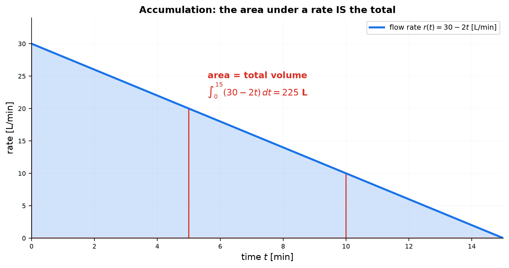
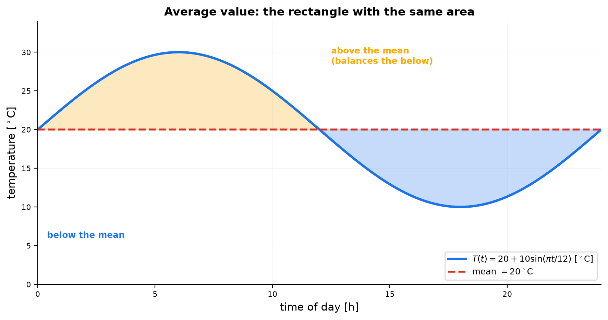
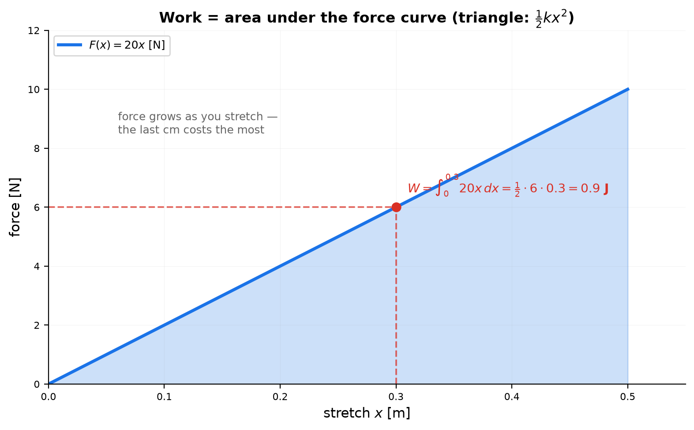
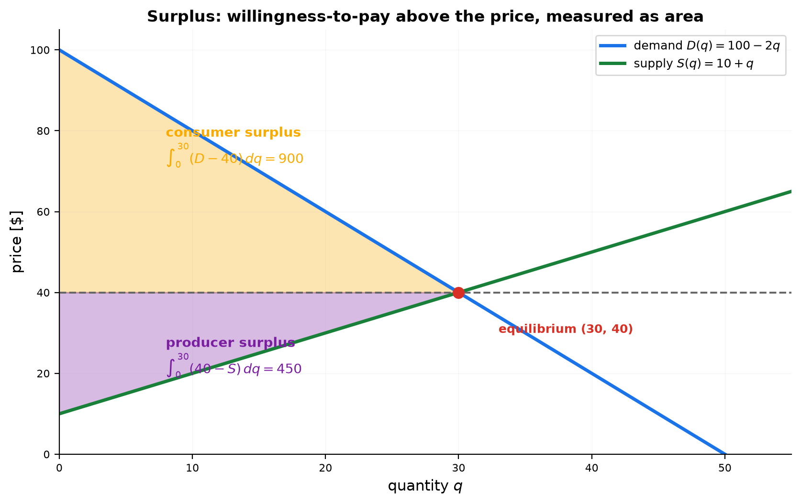
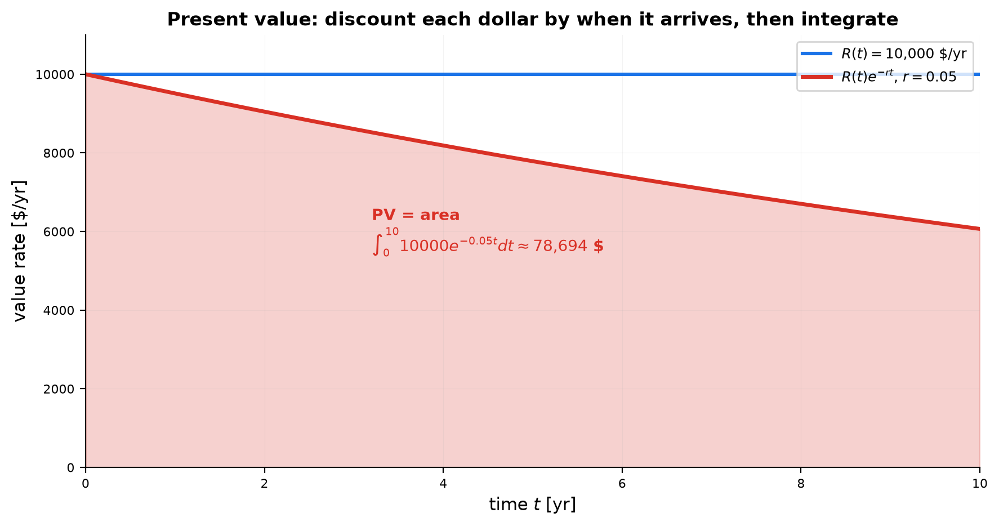
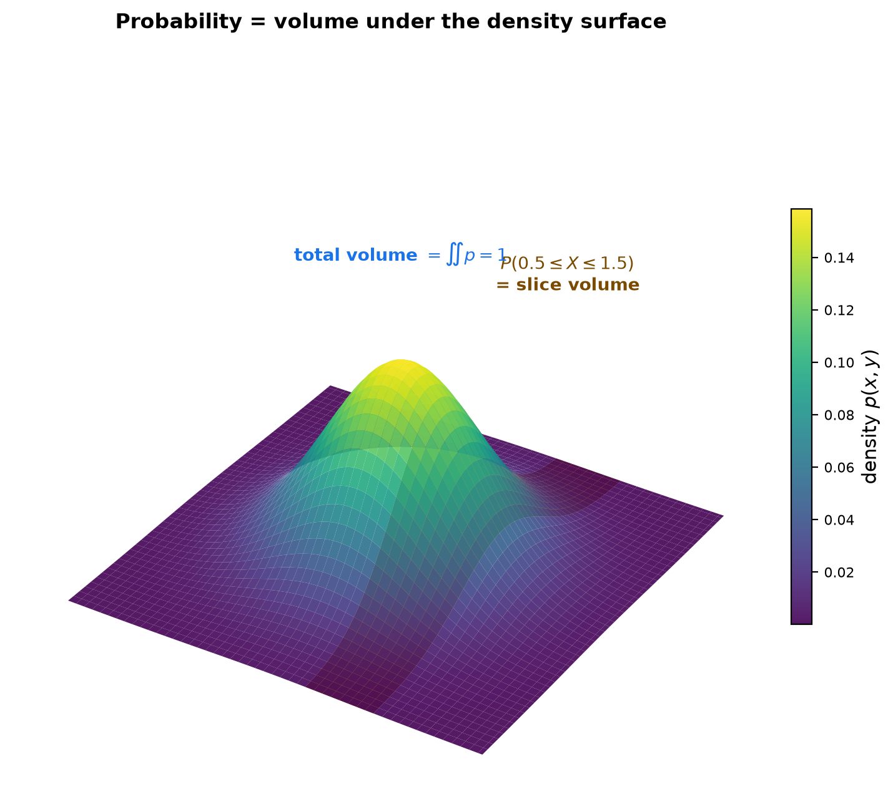
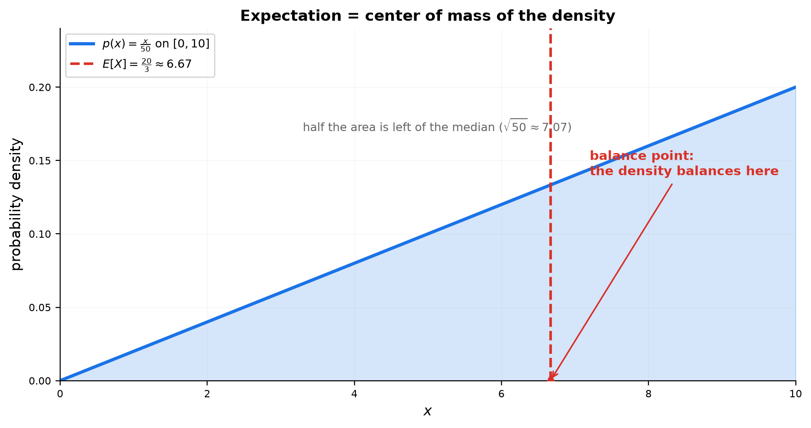

# Session 16C1: Integral Interpretation — From Rates Back to Totals

**Phase 2 — Classical Techniques | 60 min**

*Differentiation told you a rate at every instant; integration tells you what all those instants add up to. Every integral here is easy to compute — the practice is seeing: what accumulates, what the area means, what the units are, and how to read the same integral three different ways. Science, engineering, and economics all run on this grammar.*

**Prerequisites**: 16A (FTC & $u$-sub), 16B (techniques), 14D (units & relations)

*Prerequisite for: [16C2 — Advanced Integral Interpretation](16C2-advanced-integral-interpretation.md), [16C1A — Implicit Regions](16C1A-integral-interpretation.md), [16C1B — Integral Techniques](16C1B-integral-techniques.md)*

> 💡 **Stuck?** Every problem has a collapsible **Hint** below it — click it only when you need a nudge.

---

## Part A: The Accumulation Lens — An Integral Is a Total

> **The procedure**: Identify the rate. Its units × the x-units give the total's units. The integral is the running sum of all the small pieces.

---

## Example 1: The Units of an Integral — Area Is Not Always m²

An integral multiplies units: $\int f(x)\,dx$ has **units of $f$ × units of $x$**. "Area under the curve" is the picture, not the meaning.

| Rate $f(x)$ | Units | Integral | Units | What it totals |
|:---:|:---:|:---:|:---:|:---|
| velocity $v(t)$ | m/s | $\int v\,dt$ | m | distance traveled |
| water flow $r(t)$ | L/min | $\int r\,dt$ | L | volume delivered |
| power $P(t)$ | W | $\int P\,dt$ | J | energy used |
| birth rate $b(t)$ | people/yr | $\int b\,dt$ | people | population added |

**The net change theorem** (the FTC in work clothes): $\int_a^b F'(x)\,dx = F(b) - F(a)$. The integral of a rate is the **total change** of the quantity. If $f'$ says "each step adds $f'$", then $\int f'$ says "adding all the steps recovers $f$".

**Lens reading**: an integral is the collected relation — rate-units × x-units, and the FTC is the undo button: collect the degree $f'$, recover the quantity $f$.

---

## Example 2: The Filling Tank — Area Under the Rate Curve

Water flows into a tank at $r(t) = 30 - 2t$ L/min (a tap that is slowly closing).

Total delivered in $[0,15]$: $\int_0^{15}(30-2t)\,dt = [30t - t^2]_0^{15} = 450 - 225 = 225$ L.

**Same number from the table**: read the rate at $t=0, 5, 10, 15$: $30, 20, 10, 0$ L/min. Trapezoids:

$\frac{30+20}{2}\cdot 5 + \frac{20+10}{2}\cdot 5 + \frac{10+0}{2}\cdot 5 = 125 + 75 + 25 = 225$ L.

**The reading**: the area under the rate curve is literally the water. Each thin vertical strip is (rate) × (small time) = a small volume, and the integral stacks the strips.



*Graph 16C-1: Flow rate $r(t)=30-2t$. The shaded area (225 L) is the total water delivered; the trapezoids show how a rate table approximates the same total.*

**Lens reading**: the total is the collected relation of flow to time — 225 L is the area because each strip is the rate's degree at that instant, times one instant of the driver.

---

## Part B: The Average Lens — One Number That Speaks for a Whole Interval

> **The procedure**: Integrate, then divide by the length. The average value is the height of the rectangle with the same area.

---

## Example 3: Average Temperature — The Equal-Area Rectangle

Temperature over a day: $T(t) = 20 + 10\sin(\pi t/12)$ (°C, $t$ in hours from midnight).

Average over 24 h: $\bar{T} = \frac{1}{24}\int_0^{24}\left(20 + 10\sin\frac{\pi t}{12}\right)dt$.

The sine integrates to zero over a full period: $\bar{T} = \frac{1}{24}\cdot 20\cdot 24 = 20$ °C.

**The geometry**: $\bar{T}=20$ is the height of the rectangle $[0,24]\times 20$ whose area equals the area under $T$ — the day's total **degree-hours** ($20 \cdot 24 = 480$ °C·h). Above-the-mean lobes exactly balance below-the-mean lobes.

**Why engineers care**: the average of a rate × time is the total. $\bar{T}\cdot 24$ is the heat bill; $\bar{v}\cdot \Delta t$ is the distance.



*Graph 16C-2: $T(t)$ over 24 h. The dashed line at 20 °C is the equal-area height — amber above balances blue below.*

**Lens reading**: the average is the *uniform* relation that delivers the same total — the equal-area rectangle replaces the varying degree with one constant degree over the whole interval.

---

## Part C: The Work Lens — Physics and Engineering

> **The procedure**: Slice the problem into thin layers or small displacements. Each slice contributes (force) × (distance). Integrate the slices.

---

## Example 4: Spring Work — The Triangle Under $F = kx$

Stretch a spring (stiffness $k=20$ N/m) from its rest length to $x=0.3$ m. The force grows as you pull: $F(x) = 20x$.

$W = \int_0^{0.3} 20x\,dx = \left[10x^2\right]_0^{0.3} = 0.9$ J.

**The geometry**: the work is the area of the triangle under the line $F=20x$: $\frac12 \cdot (\text{base } 0.3) \cdot (\text{height } 6) = 0.9$ J. General: $W = \frac12 kx^2$ — the triangle formula in disguise.

**The symmetry that pays off**: differentiate the result — $\frac{dW}{dx} = kx = F(x)$. Integration built work from force; differentiation reads force back off work. Every accumulation formula in this session has this undo button, and pressing it is a free error check.

**The insight**: stretching from 0.3 m to 0.4 m costs $0.7$ J — *more* than the first 0.3 m cost ($0.9$ J spread over three times the distance). The last centimeter is the most expensive, because the spring is already tense.



*Graph 16C-3: $F=20x$ with the shaded triangle — work $=\frac12kx^2$, and the slope of the work function is the force.*

**Lens reading**: work is the collected relation of force to stretch — and because that relation *grows*, the collection is a triangle: the last step pays the fully-built degree $kx$.

---

## Example 5: Pumping a Tank — Slicing Turns 3D Into 1D

A cylindrical tank (radius 2 m, height 5 m) is full of water. Pump all of it out over the top rim. Water density $\rho = 1000$ kg/m³, $g = 9.8$ m/s².

**The slice**: a thin disk at depth $h$ below the rim has volume $\pi \cdot 2^2\,dh$, weight $\rho g \cdot 4\pi\,dh$, and must travel distance $h$.

$W = \int_0^5 \rho g \cdot 4\pi \cdot h\,dh = 4\pi\rho g\left[\frac{h^2}{2}\right]_0^5 = 50\pi\rho g \approx 1.54$ MJ.

**The reading**: every layer pays its own fare — weight × its own distance — and the integral is the sum of all the fares. The slices near the bottom contribute the most, because they travel farthest *and* the water above them must be lifted too.

**The pattern**: slicing + a per-slice contribution + an integral = the master method for "how much total X is needed" problems in engineering.

**Lens reading**: each slice's fare is its own weight × its own distance — the integral collects a relation whose degree (distance to the rim) varies layer by layer.

---

## Part D: The Economics Lens — Areas That Are Money

> **The procedure**: Draw the supply and demand curves. The equilibrium price cuts a triangle above and a triangle below. Each triangle is an integral with a money meaning.

---

## Example 6: Consumer and Producer Surplus

Demand $D(q) = 100 - 2q$ (what buyers will pay for the $q$-th unit), supply $S(q) = 10 + q$ (what sellers will accept).

Equilibrium: $100 - 2q = 10 + q$ → $q^* = 30$, $p^* = 40$.

**Consumer surplus** (buyers' bargain — they were willing to pay more): $CS = \int_0^{30}\big(D(q) - 40\big)dq = \int_0^{30}(60-2q)\,dq = \left[60q - q^2\right]_0^{30} = 1800 - 900 = 900$.

**Producer surplus** (sellers' profit margin): $PS = \int_0^{30}\big(40 - S(q)\big)dq = \int_0^{30}(30-q)\,dq = 900 - 450 = 450$.

**The reading**: the demand curve is a list of willingnesses-to-pay. Everyone between $q=0$ and $q=30$ who would have paid more than \$40 keeps the difference — the integral totals all those saved dollars into the amber triangle. Total welfare = $900 + 450 = 1350$.



*Graph 16C-4: Equilibrium (30, 40). Amber triangle = consumer surplus 900; purple triangle = producer surplus 450.*

**Lens reading**: surplus collects the relation between willingness-to-pay and quantity — each buyer keeps the difference between their degree and the market's, stacked into a money triangle.

---

## Example 7: Present Value — Discounting a Stream of Money

An income stream pays $R(t)$ dollars per year for $T$ years, interest rate $r$. A dollar earned at time $t$ is worth $e^{-rt}$ today (continuously compounded discounting).

$PV = \int_0^T R(t)\,e^{-rt}\,dt$.

Constant stream: $R(t) = 10{,}000$ \$/yr, $r = 0.05$, $T = 10$:

$PV = \int_0^{10} 10{,}000\,e^{-0.05t}\,dt = 10{,}000\cdot\frac{1-e^{-0.5}}{0.05} \approx 78{,}694$ \$.

**The reading**: \$100,000 of raw payments over ten years is worth only \$78,694 today, because each dollar is weighted by *when* it arrives. The discount factor $e^{-rt}$ is a "time-to-money exchange rate," and the integral runs a continuous currency conversion.



*Graph 16C-5: The flat line is the raw income \$10,000/yr; the falling curve is the same income discounted. PV is the area under the falling curve.*

**Lens reading**: discounting is a relation between money and time — each dollar's worth decays at degree $-r$; the integral collects that decaying relation into today's value.

---

## Part E: The Probability Lens — Density, Area, and the Balance Point

> **The procedure**: A probability density is a nonnegative function with total area 1. Probability of an interval = area over that interval. Expectation = balance point of that area.

---

## Example 8: Probability As Area, Expectation As Center of Mass

Density $p(x) = \frac{x}{50}$ on $[0,10]$ (a triangular model).

**Total area = 1**: $\int_0^{10}\frac{x}{50}\,dx = \frac{100}{100} = 1$ ✓ — a density must integrate to 1.

**Probability is area**: $P(2 \le X \le 5) = \int_2^5 \frac{x}{50}\,dx = \frac{25-4}{100} = 0.21$ — a 21% chance.

**Single points have zero probability**: $P(X = 5) = \int_5^5 p = 0$. Only intervals have positive probability — one consequence of probability being *area*.

**Expectation is the balance point**: $E[X] = \int_0^{10} x\cdot\frac{x}{50}\,dx = \frac{1000}{150} = \frac{20}{3} \approx 6.67$ — the triangle balances at its center of mass, exactly $\frac23$ of the way along the base.

**The reading**: every "average" from Part B is secretly a balance point. Mean value, expectation, centroid — one concept, three names.



*Graph 16C-6 (3D): A two-variable density surface. Total volume = 1 (probability of everything); the amber slice's volume = probability of one interval.*



*Graph 16C-7: The triangular density $p(x)=x/50$. The dashed line at $E[X]=20/3$ marks where the area balances; half the area sits left of the median $\sqrt{50}\approx7.07$.*

**Lens reading**: probability is the collected relation of density to the interval; expectation is the balance point of that collected area — one pattern, two names.

> **Up to here**: $\int$ rate = total change; units multiply; average value = equal-area rectangle; work = force area, $\frac{dW}{dx}=F$; pumping = slice-and-sum; surplus = money triangles; present value = discounted area; probability = area, expectation = balance point. (The two computation techniques — substitution and parts, derived as relations — live in [16C1B](16C1B-integral-techniques.md).)

---

## The Accumulation Checklist

> When an integral appears, run this checklist. It is the whole session in one box.

```
1. THE RATE     → what quantity is flowing, and what are its units?
2. THE TOTAL    → what accumulates? Units of integral = rate-units × x-units.
3. THE PICTURE  → area under the curve / slice-and-sum geometry.
4. THE CHECK    → differentiate the result — you must get the rate back (FTC).
5. AVERAGE?     → divide the integral by the interval length for one summary number.
```

---

## Common Mistakes

### Mistake 1: Calling every integral an "area"

**Wrong**: "$\int_0^{15}r(t)dt$ is the area, 225 m²." **Right**: it is 225 L of water. Area is the geometry; the meaning comes from the units of the rate.

### Mistake 2: Forgetting to divide by the interval length

**Wrong**: "average temperature = $\int_0^{24}T\,dt = 480$ °C." **Right**: divide by 24 → 20 °C. The integral is total degree-hours, not the average.

### Mistake 3: Surplus without subtracting the price

**Wrong**: $CS = \int_0^{30}D(q)dq$. **Right**: buyers keep only $D(q) - p^*$ per unit. The integral without the subtraction is total willingness-to-pay, not the saved amount.

### Mistake 4: Positive probability at a single point

**Wrong**: "the chance the battery dies at exactly $t=5$ is the density there." **Right**: for a continuous density, $P(X=5)=0$. Only intervals accumulate positive probability — density is a rate, not a probability.

### Mistake 5: Measuring work distance from the wrong end

**Wrong**: pumping water from a tank 5 m deep, using distance $h$ from the *bottom*. **Right**: each layer travels its distance to the *destination* (the rim). The deepest layer travels the full 5 m.

---

## What We Just Did

```
(1) Accumulation: ∫ rate = total change (net change theorem). Units multiply:
    (m/s)·s = m, (L/min)·min = L, W·s = J.
(2) Average: f̄ = ∫f/(b−a) — the equal-area rectangle height.
(3) Work: W = ∫F dx. Spring: triangle under F=kx → W = ½kx². Check: dW/dx = F.
(4) Pumping: slice into layers; each contributes weight × own distance; integrate.
(5) Surplus: CS = ∫(D−p*), PS = ∫(p*−S) — money triangles between curves.
(6) Present value: PV = ∫ R(t)e^(−rt) — discount each dollar by its arrival time.
(7) Probability: ∫ density = probability; ∫ x·density = expectation (balance point).
```

---

## Practice 1

Water flows into a tank at $r(t) = 30 - 2t$ L/min. Find the total delivered over $[0,15]$ (a) by integration and (b) by trapezoids from the rate table at $t=0, 5, 10, 15$. Compare.

<details>
<summary>💡 Hint</summary>

(a) $[30t - t^2]_0^{15}$. (b) Each 5-minute trapezoid has area (average height) × 5. Both should say 225 L.

</details>

→ Solutions: [Solutions](solutions/16C1-solutions.md#practice-1)

---

## Practice 2

Temperature is $T(t) = 20 + 10\sin(\pi t/12)$ °C over 24 hours. Find (a) the average temperature and (b) the total degree-hours, and (c) explain what the equal-area rectangle says.

<details>
<summary>💡 Hint</summary>

The sine integrates to zero over any full period. The rectangle is $[0,24]\times\bar{T}$.

</details>

→ Solutions: [Solutions](solutions/16C1-solutions.md#practice-2)

---

## Practice 3

A spring with $k=20$ N/m is stretched from rest to 0.3 m. (a) Find the work. (b) Find the extra work to go from 0.3 m to 0.4 m. (c) Why does the second, shorter stretch cost nearly as much as the first?

<details>
<summary>💡 Hint</summary>

$W = \int F\,dx = \frac12 k x^2$ between the two endpoints. (c) the force at the start of the second stretch is already 6 N.

</details>

→ Solutions: [Solutions](solutions/16C1-solutions.md#practice-3)

---

## Practice 4

Demand $D(q) = 120 - 3q$, supply $S(q) = 20 + 2q$. Find the equilibrium, the consumer surplus, and the producer surplus.

<details>
<summary>💡 Hint</summary>

$120-3q = 20+2q$ → $q^*=20$, $p^*=60$. Then integrate $D-60$ and $60-S$ from 0 to 20.

</details>

→ Solutions: [Solutions](solutions/16C1-solutions.md#practice-4)

---

## Practice 5: Real Battle — A Growing Income Stream (🔗 10B)

An income stream pays $R(t) = 50{,}000\,e^{0.02t}$ \$/yr (2% annual growth) for 20 years, discounted at 6%. Find the present value, and explain why a growing stream is still heavily discounted.

<details>
<summary>💡 Hint</summary>

$PV = \int_0^{20} 50{,}000 e^{0.02t} e^{-0.06t}dt$ — the exponents combine into one decaying factor.

</details>

→ Solutions: [Solutions](solutions/16C1-solutions.md#practice-5)

---

## Practice 6: Real Battle — Battery Lifetime

A battery's lifetime (in years) has density $p(x) = \frac{3x^2}{1000}$ on $[0,10]$. (a) Verify the total probability is 1. (b) Find $P(X > 5)$ — the chance it lasts more than 5 years. (c) Find the expected lifetime. (d) Explain why $P(X = 5) = 0$ even though the density is positive at $x=5$.

<details>
<summary>💡 Hint</summary>

(b) $\int_5^{10}$. (c) $E[X]=\int_0^{10}x\,p(x)\,dx$. (d) a single point has zero width, so its area is zero.

</details>

→ Solutions: [Solutions](solutions/16C1-solutions.md#practice-6)

---

## Integral Practice: Building the Total from Rates

> The relationship lens applied to integrals: rate → total → units → sentence. **Setting up the rate and collecting it is the whole skill** — everything after that is routine.

#### Basic RP — Straight Setups (RPB1–RPB5)

**RPB1.** A pump delivers $r(t) = 60 - 4t$ L/min, slowly closing over 15 min. (a) Set up the total-delivery integral. (b) Evaluate it. (c) State the units and read the total in one sentence. (d) Why is the answer a trapezoid's area, and what does each thin strip mean?

<details>
<summary>💡 Hint</summary>

$[60t-2t^2]_0^{15} = 900-450 = 450$ L. Strip = (L/min) × (small minutes) = a small volume.

</details>

**RPB2.** A particle's velocity is $v(t) = 3t^2$ m/s. (a) Set up and evaluate the distance over $[0,4]$. (b) One sentence, with units. (c) Differentiate your answer — what relation do you read back?

<details>
<summary>💡 Hint</summary>

$[t^3]_0^4 = 64$ m. The undo button reads the velocity back.

</details>

**RPB3.** Marginal cost is $MC(q) = 2q + 1$ \$/item. (a) Set up and evaluate the added cost of producing items 0 through 10. (b) Why is the added cost an area under the marginal-cost curve? (c) One sentence.

<details>
<summary>💡 Hint</summary>

$[q^2+q]_0^{10} = 110$. Each strip = (cost of one more item) × (one item).

</details>

**RPB4.** Find the average of $f(x) = x^2$ on $[0,3]$. (a) Set up, evaluate, divide. (b) Explain the equal-area rectangle in one sentence.

<details>
<summary>💡 Hint</summary>

$\frac13\int_0^3 x^2\,dx = \frac13\cdot 9 = 3$ — the uniform relation that delivers the same total.

</details>

**RPB5.** A constant force $F = 5$ N pushes a block 8 m. (a) Set up and evaluate the work. (b) Why is the integral a rectangle here, and what does "the relation is uniform" mean for the total?

<details>
<summary>💡 Hint</summary>

$5 \times 8 = 40$ J — no triangle, because the force's relation to distance never grows.

</details>

#### Advanced RP — Real Totals, Derived (RPA1–RPA5)

**RPA1.** Derive spring work end to end: (a) state the force-stretch relation and its degree; (b) set up and evaluate $W$ from 0 to $x$; (c) press the undo button; (d) explain why the last centimeter costs the most.

<details>
<summary>💡 Hint</summary>

$F = kx$ (degree $k$, relation grows from zero). $W = \frac12 kx^2$; $\frac{dW}{dx} = F$ ✓.

</details>

**RPA2.** A uniform rope, 30 m long and 20 kg/m, hangs from a cliff. (a) Slice the rope and set up the work to wind it all up. (b) Evaluate ($g=9.8$). (c) Which segment pays the most, and why?

<details>
<summary>💡 Hint</summary>

$W = \int_0^{30}\rho g\,y\,dy = 20\cdot9.8\cdot450 = 88{,}200$ J. The bottom segment climbs the full 30 m.

</details>

**RPA3.** A growing perpetuity pays $R(t) = R_0 e^{gt}$ \$/yr forever, discounted at rate $r > g$. (a) Set up the PV integral. (b) Evaluate and interpret the denominator. (c) Compute for $R_0=1000$, $r=8\%$, $g=3\%$.

<details>
<summary>💡 Hint</summary>

$PV = \int_0^\infty R_0 e^{(g-r)t}dt = \frac{R_0}{r-g}$ — a difference of two percentage relations. $= 20{,}000$.

</details>

**RPA4.** Waiting times have density $p(t) = \lambda e^{-\lambda t}$ on $[0,\infty)$. (a) Verify the total area is 1. (b) Derive $P(X>1) = e^{-\lambda}$ and read the sentence. (c) Derive $E[X] = \frac1\lambda$ by parts. (d) Compute both for $\lambda = 2$.

<details>
<summary>💡 Hint</summary>

(b) $\int_1^\infty = e^{-\lambda}$. (c) parts with $u=t$, $dv=\lambda e^{-\lambda t}dt$.

</details>

**RPA5.** A particle has $v(t) = t^2 - 4t + 3$ m/s on $[0,4]$. (a) Displacement? (b) Total distance? (split where the sign flips). (c) Which answer does the FTC own, and why does the other need splitting?

<details>
<summary>💡 Hint</summary>

$v=(t-1)(t-3)$: flips at $t=1,3$. Displacement $\frac43$; distance $4$.

</details>

→ Solutions: [Solutions](solutions/16C1-solutions.md#integral-practice)

---

## Basic Drills

**D1.** Write the units of each integral: (a) $\int v(t)dt$, $v$ in m/s; (b) $\int r(t)dt$, $r$ in L/min; (c) $\int F(x)dx$, $F$ in N; (d) $\int D(q)dq$, $D$ in \$.

<details>
<summary>💡 Hint</summary>

rate-units × x-units: m, L, J, \$ (the last is money, since demand \$/unit × units).

</details>

**D2.** A chemical leaks at $r(t) = 5e^{-t/10}$ L/min. How much leaks out over the first 20 minutes?

<details>
<summary>💡 Hint</summary>

$\int_0^{20}5e^{-t/10}dt = 50(1-e^{-2})$ L.

</details>

**D3.** Find the average value of $f(x) = x^2$ on $[0,4]$.

<details>
<summary>💡 Hint</summary>

$\int_0^4 x^2 dx = \frac{64}{3}$, then divide by 4.

</details>

**D4.** A spring with $k=100$ N/m is stretched 0.2 m from rest. Find the work.

**D5.** A car moves with $v(t) = 3t^2 + 1$ m/s. How far does it travel in $[0,2]$?

**D6.** $X$ is uniform on $[0,8]$. Find $P(2 < X < 6)$ and $E[X]$.

<details>
<summary>💡 Hint</summary>

Uniform density is $\frac18$; probability = width × height, expectation = midpoint.

</details>

**D7.** Find $\int_{-2}^2 (4-x^2)dx$. If both axes are in cm, what does the number mean?

<details>
<summary>💡 Hint</summary>

$\frac{32}{3}$. With cm axes the units are cm × cm = cm² — a true area under a parabola.

</details>

**D8.** Demand $D(q) = 60 - 2q$ with market price \$20. Find the consumer surplus.

<details>
<summary>💡 Hint</summary>

$q^* = 20$; $CS = \int_0^{20}(60-2q-20)dq$.

</details>

**D9.** A stream pays \$1,000/yr for 10 years, discounted at 10%. Find the present value.

<details>
<summary>💡 Hint</summary>

$PV = 1000\cdot\frac{1-e^{-1}}{0.1}$.

</details>

**D10.** A random variable has density $p(x) = 2x$ on $[0,1]$. Find $E[X]$.

<details>
<summary>💡 Hint</summary>

$E[X] = \int_0^1 x\cdot 2x\,dx = \frac23$ — the balance point of the ramp.

</details>

> Solutions: [Solutions](solutions/16C1-solutions.md#basic-drill)

---

## Advanced Drills

> Each problem has a computation part AND an interpretation part. Don't skip the explanation parts.

**A1.** Write the net change theorem $\int_a^b F'(x)dx = F(b)-F(a)$ in three one-sentence translations: a population with birth rate $P'(t)$, a tank with inflow $V'(t)$, and a bank account with interest rate $B'(t)$.

<details>
<summary>💡 Hint</summary>

Each sentence has the shape "the total X added between $a$ and $b$ equals the final amount minus the starting amount."

</details>

**A2.** A force $F(x) = 6x^2$ N acts along the $x$-axis. Find the work from $x=1$ to $x=3$, verify that $\frac{dW}{dx} = F(x)$ at the endpoint, and state the units of the answer.

<details>
<summary>💡 Hint</summary>

$W = [2x^3]_1^3 = 52$ J. Differentiating $2x^3$ gives $6x^2$ — the FTC undo button.

</details>

**A3.** A conical tank (radius 3 m at the top, height 6 m, vertex at the bottom) is full of water. Pump it out over the top. ($\rho g = 9800$ N/m³.) Slice, set up the integral, and interpret why the lower layers dominate the work.

<details>
<summary>💡 Hint</summary>

At height $h$ from the bottom the radius is $r = \frac{h}{2}$. Layer volume $\pi r^2 dh$ travels $6-h$ meters: $W = \int_0^6 9800\,\pi\,\frac{h^2}{4}(6-h)\,dh$.

</details>

**A4.** Mean Value Theorem for integrals: continuous $f$ hits its average somewhere. For $f(x)=x^2$ on $[0,4]$, find the point $c$ where $f(c)$ equals the average value, and explain what the theorem guarantees in general.

<details>
<summary>💡 Hint</summary>

Average $=\frac{16}{3}$, so $c^2 = \frac{16}{3}$, $c = \frac{4}{\sqrt3}\approx 2.31$. The guarantee: some single instant achieves the interval's average.

</details>

**A5.** Demand $D(q)=200-2q$, supply $S(q)=q$. A quota limits production to $q=50$. Compute the deadweight loss (the lost-trade triangle) and explain what it measures.

<details>
<summary>💡 Hint</summary>

Free-market equilibrium is $q^* = \frac{200}{3}$. Deadweight loss $= \int_{50}^{q^*}(D-S)dq$ — trades that would have benefited both sides but are now banned.

</details>

**A6.** Show that a constant stream $R$ \$/yr for $T$ years has $PV = \frac{R}{r}(1-e^{-rT})$, take $T\to\infty$ for a perpetuity, and interpret the perpetuity formula.

<details>
<summary>💡 Hint</summary>

$\int_0^T Re^{-rt}dt = \frac{R}{r}(1-e^{-rT})$. As $T\to\infty$: $\frac{R}{r}$ — a perpetuity at 5% is worth exactly 20 years of income.

</details>

**A7.** Density $p(x) = 2x$ on $[0,1]$. Find the median $m$ (the point splitting the probability in half) and compare it with the mean $\frac23$. Why is the median larger?

<details>
<summary>💡 Hint</summary>

$\int_0^m 2x\,dx = m^2 = \frac12$ → $m = \frac{1}{\sqrt2} \approx 0.707$. The density leans right (more mass at high $x$), and the median is where the *area* halves — the mean chases the heavier tail.

</details>

**A8.** Density $p(x) = 2e^{-2x}$ on $[0,\infty)$. (a) Verify $\int_0^\infty p = 1$. (b) Find $P(X>1)$. (c) Find $E[X]$. (d) Interpret: why is the chance of surviving past 1 unit exactly $e^{-2}$?

<details>
<summary>💡 Hint</summary>

(b) $\int_1^\infty 2e^{-2x}dx = e^{-2}\approx 0.135$. (c) by parts: $\frac12$. (d) exponential decay of the survival function — this is the memoryless pattern from 10A/19A.

</details>

**A9.** One number, three pictures: $\int_0^1 x^2 dx = \frac13$. Describe it (a) as an area, (b) as average × length, and (c) as the total change of a quantity whose rate is $x^2$. Why is "which picture?" the first question in interpretation?

<details>
<summary>💡 Hint</summary>

(a) area under $y=x^2$. (b) $\frac13 = \bar{f}\cdot 1$ with $\bar{f}=\frac13$. (c) $F(1)-F(0)$ with $F=\frac{x^3}{3}$ — accumulated volume of a growing cube's layers, etc.

</details>

**A10.** A snowball grows so its radius increases at a constant rate $\frac{dr}{dt} = c$. (a) Show $\frac{dV}{dt} = 4\pi r^2\cdot c$ — surface area times the radial speed. (b) Integrate $\int_0^R 4\pi r^2 dr$ and confirm it rebuilds $V(R)$. (c) If $r = ct$, describe how volume grows with time.

<details>
<summary>💡 Hint</summary>

(a) chain rule with 14D's $\frac{dV}{dr}=4\pi r^2$. (b) $\frac{4}{3}\pi R^3$. (c) $V(t) = \frac{4}{3}\pi (ct)^3$ — cubic growth, fast even for constant radial growth.

</details>

> Solutions: [Solutions](solutions/16C1-solutions.md#advanced-drill)

---

## Deep Insight

> One problem, pushed to the edge of this session's method. Compute it — then explain *why* the method breaks or holds. The "why" is the whole point.

**DI1.** A boat moves with velocity $v(t) = \cos t$ m/h on $0 \le t \le \pi$. Compute (a) the net displacement, (b) the total distance traveled, (c) the average velocity, (d) the average speed. Then the insight question: which pair is joined by the FTC and which pair is not — and what exactly breaks the FTC for the failing pair? State the general rule.

<details>
<summary>💡 Hint</summary>

$\int_0^\pi\cos t\,dt$ is one line. For distance, $|\cos t|$ flips sign at $t=\frac\pi2$ — split there.

</details>

→ Solutions: [Solutions](solutions/16C1-solutions.md#deep-insight)

---

## Today's Procedure

| When you see... | Do this... |
|:---|:---|
| A rate and a time interval | Integrate the rate — the total is $\int$ rate; units multiply |
| "Find the average value" | Integrate, then divide by the interval length |
| Variable force / spring | $W=\int F\,dx$; spring: $\frac12 kx^2$; check $\frac{dW}{dx}=F$ |
| Pumping / lifting problems | Slice into layers; each contributes weight × own distance; integrate |
| Supply & demand surplus | Integrate $D-p^*$ (consumer) and $p^*-S$ (producer) up to equilibrium |
| Money arriving over time | $PV=\int R(t)e^{-rt}dt$ — discount each instant, then sum |
| Probability density | $\int_a^b p = P(a\le X\le b)$; $\int xp = E[X]$; total area always 1 |

---

## How to Read These Symbols

| Symbol | Reads as | Meaning |
|:---:|:---:|------|
| $\int_a^b f(x)dx$ | "integral from a to b" | total accumulation — sum of f·dx over the interval |
| $\bar{f}$ | "f bar" | average value $\frac{1}{b-a}\int_a^b f$ |
| $W$ | "work" | $\int F\,dx$ — force × distance accumulated |
| $CS$, $PS$ | "consumer/producer surplus" | $\int(D-p^*)$, $\int(p^*-S)$ — saved willingness-to-pay / profit margin |
| $PV$ | "present value" | $\int R(t)e^{-rt}dt$ — today's worth of future money |
| $p(x)$ | "probability density" | nonnegative rate whose area is probability; total area 1 |
| $E[X]$ | "expectation of X" | $\int x\,p(x)dx$ — balance point of the density |
| L, J, \$ | "liters, joules, dollars" | units of the total — rate-units × x-units |

---

## Terminology

| What we call it | Math term | Notation |
|:---:|:---:|:---:|
| integral of a rate | net change theorem | $\int_a^b F' = F(b)-F(a)$ |
| one number summarizing an interval | average value | $\bar{f}=\frac{1}{b-a}\int f$ |
| force × distance added up | work | $W=\int F\,dx$ |
| thin-layer slicing method | shell/slab method (engineering) | $\sum \rho g A(h)\,\Delta h \to \int$ |
| buyers' bargain triangle | consumer surplus | $CS=\int_0^{q^*}(D-p^*)dq$ |
| sellers' margin triangle | producer surplus | $PS=\int_0^{q^*}(p^*-S)dq$ |
| today's worth of future money | present value | $PV=\int R e^{-rt}dt$ |
| area = chance | probability density | $P(a\le X\le b)=\int_a^b p$ |
| area's balance point | expectation / center of mass | $E[X]=\int x\,p\,dx$ |
