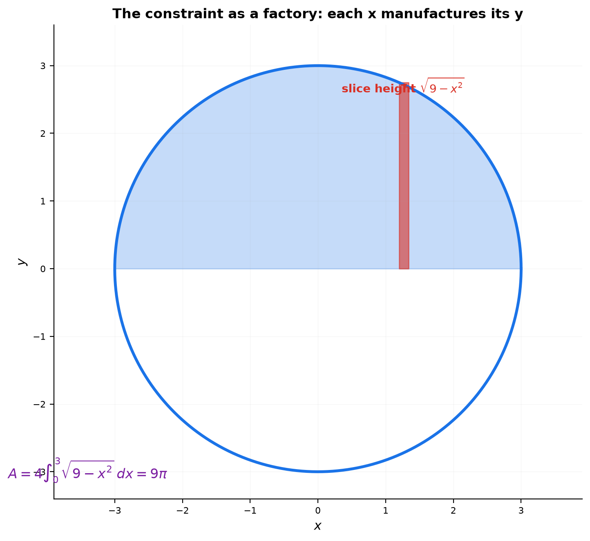
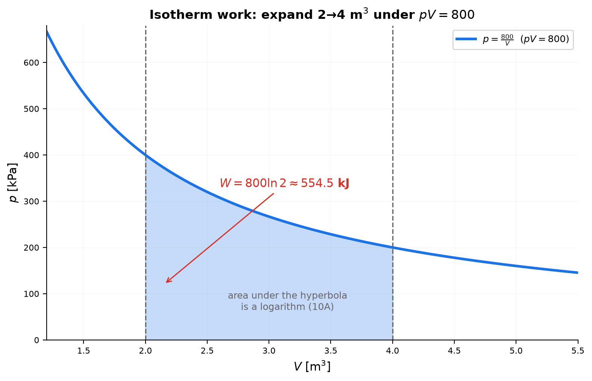
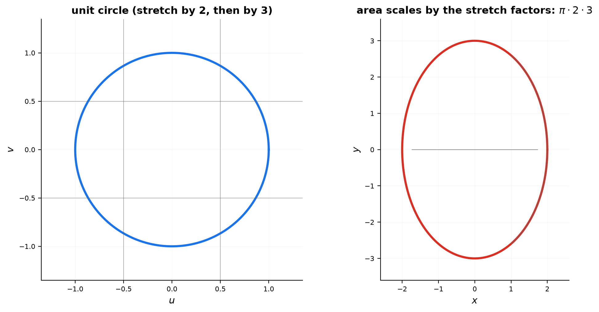
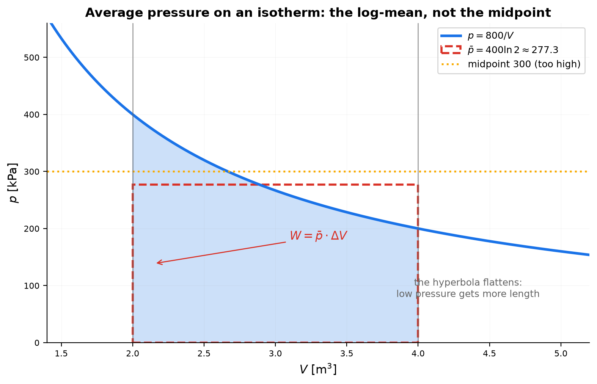
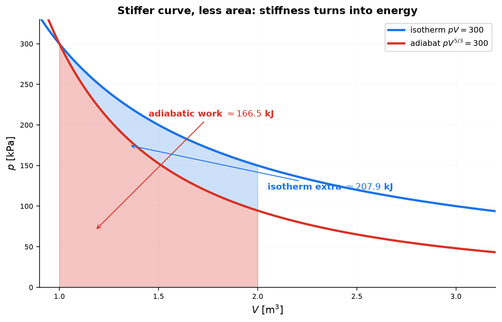
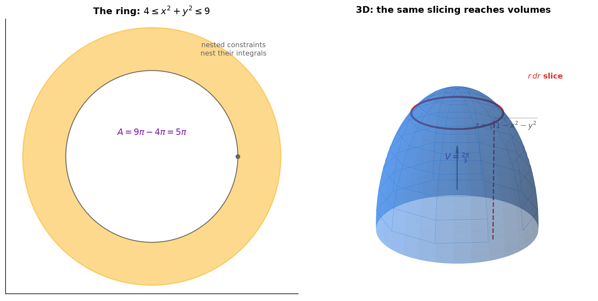

# Session 16C1A: Implicit Regions — Integrating When Equations Entangle Variables

**Phase 2 — Classical Techniques | Supplement to 16C1 | 40 min**

*In 16C1 you integrated explicit rates and densities. But many quantities live behind an entangled equation — $pV = C$, $x^2 + y^2 = R^2$, $PV = nRT$ — where no variable is written as a function of another. This supplement trains you to integrate those tangles: solve the constraint for one variable (or stretch it into a known shape), set the measure element, integrate, and read what the entanglement did to the answer.*

**Prerequisites**: 16C1 (accumulation), 14D1A (implicit trade-offs), 10A (logarithms), 16A (FTC)

> 💡 **Stuck?** Every problem has a collapsible **Hint** below it — click it only when you need a nudge.

---

## Part A: Solve, Then Integrate — The Constraint As a Factory

> **The procedure**: An implicit equation is a factory: for each $x$ it manufactures the allowed $y$. Integrate what the constraint permits — solve first, slice second.

---

## Example 1: The Circle's Area from Its Own Equation (🔗 9B)

$x^2 + y^2 = R^2$ never names $y$. Solve it: $y = \pm\sqrt{R^2 - x^2}$. The top half's area:

$$A_{\text{top}} = \int_{-R}^{R}\sqrt{R^2-x^2}\,dx, \qquad A = 4\int_0^R \sqrt{R^2-x^2}\,dx.$$

- **The slice reading**: at position $x$, the constraint allows height $\sqrt{R^2-x^2}$ — the slice is "the $y$ the equation permits." Integrating sums what the constraint manufactures.
- **Units**: y-units × x-units = m² — a true area.
- **Numbers**: $R = 3$: $A = 9\pi \approx 28.27$ m². The four-quarter symmetry (even function, symmetric interval) is the constraint's own mirror.
- **Why bother**: the same move — solve the tangle, then slice — works for *every* implicit region. Entangled does not mean unusable.



*Graph 16C1A-1: The constraint manufactures the slice height $\sqrt{9-x^2}$ at each $x$; four quarters integrate to $9\pi$.*

---

## Example 2: The Isotherm — Work Under the Hyperbola (🔗 10A, 16C1 Ex4)

Gas at fixed temperature obeys $pV = C$, so $p = \frac{C}{V}$. Work during expansion from $V_1$ to $V_2$:

$$W = \int_{V_1}^{V_2} p\,dV = \int_{V_1}^{V_2}\frac{C}{V}\,dV = C\ln\frac{V_2}{V_1}.$$

- **Units**: kPa × m³ = kJ. Pressure and volume entangle into *one* integration variable before the integral even starts — solving the constraint is step 0.
- **The logarithm**: the hyperbola's area is a logarithm (10A's $\int \frac{dV}{V}$). Each extra m³ at high volume contributes less pressure, hence less work — the area under $y = 1/x$ grows as $\ln$.
- **Sign story**: expansion ($V_2 > V_1$) → $W > 0$: the gas pushes out, doing work on the world. Compression → $W < 0$: the world pushes in.
- **Numbers**: $pV = 800$ kPa·m³, expand $2 \to 4$ m³: $W = 800\ln 2 \approx 554.5$ kJ.
- **The FTC check** (16C1's undo button): $\frac{dW}{dV} = \frac{C}{V} = p$ — differentiating the work recovers the pressure. Entangled or not, the check always fires.



*Graph 16C1A-2: Work = area under $p=800/V$ from 2 to 4 m³ — $800\ln 2 \approx 554.5$ kJ, the hyperbola's logarithmic area.*

---

## Part B: Stretching Tangles — Implicit Shapes As Known Shapes

> **The procedure**: Some implicit equations are a known shape wearing a disguise. Rescale the variables (12A2's determinant idea) and read the area through the stretch factors.

---

## Example 3: The Ellipse — A Stretched Circle (🔗 9B, 12A2)

$\frac{x^2}{a^2} + \frac{y^2}{b^2} = 1$. Rescale: $u = \frac{x}{a}$, $v = \frac{y}{b}$ turns it into $u^2 + v^2 = 1$ — the unit circle.

- The map $(x,y) \mapsto (u,v)$ shrinks $x$ by $a$ and $y$ by $b$, so areas scale by the determinant $\frac{1}{a}\cdot\frac{1}{b}$ (12A2). Inverting: the ellipse's area is $ab$ times the circle's: $A = \pi ab$.
- **The direct integral agrees**: $y = b\sqrt{1 - \frac{x^2}{a^2}}$, so $A = 4\int_0^a b\sqrt{1-\frac{x^2}{a^2}}dx = \pi ab$.
- **Numbers**: $a = 2$, $b = 3$: $A = 6\pi \approx 18.85$.
- **The reading**: an implicit equation hides a *transformation*. Spot the stretch, and the integration collapses to a known shape. Entanglement is often just symmetry in disguise.



*Graph 16C1A-3: Rescaling $u=x/2$, $v=y/3$ maps the ellipse to the unit circle — area scales by the stretch factors: $\pi\cdot2\cdot3$.*

---

## Part C: Averages and Work Along Entangled Curves

> **The procedure**: Divide work by the volume span to get the average pressure — but the average along a hyperbola is *not* the midpoint. The curve's shape is the weighting.

---

## Example 4: Average Pressure on an Isotherm — The Log-Mean

Between $V_1$ and $V_2$ along $pV = C$:

$$\bar p = \frac{1}{V_2 - V_1}\int_{V_1}^{V_2}\frac{C}{V}\,dV = \frac{C\ln(V_2/V_1)}{V_2 - V_1}.$$

- **The work connection**: $W = \bar p \cdot (V_2 - V_1)$ — work equals average pressure × volume change, the equal-area rectangle of 16C1 (Example 3), drawn under a hyperbola.
- **Numbers**: $C = 800$, $V_1 = 2$, $V_2 = 4$: $\bar p = \frac{800\ln 2}{2} = 400\ln 2 \approx 277.3$ kPa. Then $W = 277.3 \times 2 = 554.5$ kJ ✓ — the same work as Example 2, recomputed as a rectangle.
- **Why not the midpoint**: the arithmetic mean $\frac{p(2)+p(4)}{2} = \frac{400+200}{2} = 300$ kPa overshoots. The hyperbola spends more of its length at *low* pressure (it flattens toward the axis), so the area-average sits below the midpoint — the log-mean. The curve's shape is the weighting.



*Graph 16C1A-4: The log-mean rectangle at 277.3 kPa (dashed) has the same area as the hyperbola — the midpoint 300 overshoots because the curve flattens.*

---

## Example 5: Adiabatic Work — A Steeper Curve, A Different Area (🔗 14D1A Ex6)

$pV^{\gamma} = C$ ($\gamma > 1$), so $p = C V^{-\gamma}$. Work from $V_1$ to $V_2$:

$$W = \int_{V_1}^{V_2} C V^{-\gamma}\,dV = \frac{C}{1-\gamma}\left(V_2^{1-\gamma} - V_1^{1-\gamma}\right) = \frac{p_2V_2 - p_1V_1}{1-\gamma}.$$

- **Numbers**: $\gamma = \frac53$, $p_1 = 300$ kPa, $V_1 = 1$ m³, expand to $V_2 = 2$ m³. First $p_2 = 300\cdot 2^{-5/3} \approx 94.5$ kPa, then $W = \frac{94.5\cdot 2 - 300\cdot 1}{1 - \frac53} \approx 166.5$ kJ.
- **The reading**: the adiabat is $\gamma$ times steeper (14D1A), so it drops faster and sweeps *less* area — the gas delivers less work per expansion than an isotherm would. The exponent $\gamma$ is not decoration: it directly sets the area under the curve. The integral is where stiffness turns into energy.
- **The formula's second face**: $W = \frac{p_2V_2 - p_1V_1}{1-\gamma}$ reads "work = the drop in $pV$, divided by $(\gamma - 1)$" — one line, two endpoints, no logarithms. Each entangled law gives work its own fingerprint formula.



*Graph 16C1A-5: The steeper adiabat sweeps less area — 166.5 kJ vs the isotherm's 207.9 kJ. Stiffness becomes energy.*

---

## Example 6: Integrating Over an Implicit Region — The Annulus

The region between $x^2 + y^2 = 4$ and $x^2 + y^2 = 9$ (a ring): its area is the difference of the two constraint-regions' areas:

$$A = 9\pi - 4\pi = 5\pi \approx 15.7.$$

- **The reading**: nested implicit equations describe nested regions, and integration respects the nesting — areas (and masses, charges, moments) subtract as cleanly as the equations nest. The entanglement organizes itself into layers.
- **With density**: if the ring carries density $\rho = 1$, its mass is $5\pi$; with density $\rho = r$ (heavier outward), $M = \int_0^{2\pi}\int_2^3 r\cdot r\,dr\,d\theta = \frac{2\pi}{3}(27-8) = \frac{38\pi}{3} \approx 39.8$ — the measure (16C2's concept) sits on top of the constraint.



*Graph 16C1A-6: Left — the ring's area $5\pi$ by subtracting nested constraints. Right (3D) — the same slicing reaches volumes: the hemisphere $z=\sqrt{1-x^2-y^2}$ sliced into $r\,dr$ cylinders (A9).*

> **Up to here**: solve the constraint, then integrate — circle area $4\int_0^R\sqrt{R^2-x^2}dx$; isotherm work $C\ln\frac{V_2}{V_1}$ (the hyperbola's area is a logarithm); the ellipse is a stretched circle, area $\pi ab$; the average along an isotherm is the log-mean, and work $= \bar p\,\Delta V$; adiabatic work is $\frac{p_2V_2-p_1V_1}{1-\gamma}$; nested constraints nest their integrals.

---

## The Implicit Integration Checklist

> When an entangled equation needs integrating, run this. It is the whole supplement in one box.

```
1. THE CONSTRAINT → which equation ties the variables? Name units of both sides.
2. SOLVE          → express the integrand variable from the constraint (or rescale
                    to a known shape; or parametrize).
3. THE ELEMENT    → dV? dx? dA? The constraint decides the natural integration variable.
4. INTEGRATE      → units multiply (kPa·m³ = kJ); sign = direction of the process.
5. THE CHECK      → differentiate the result (FTC: dW/dV = p) or match a known shape
                    (ellipse → πab).
6. AVERAGE        → total ÷ span = the curve-weighted average (log-mean, not midpoint).
```

---

## Common Mistakes

### Mistake 1: Integrating the constraint instead of solving it

**Wrong**: "work $= \int pV\,dV$." **Right**: the constraint says $p = \frac{C}{V}$; substitute first, then integrate $\int\frac{C}{V}dV$. An equation is not an integrand — it is a factory that builds one.

### Mistake 2: Forgetting the units of the product

**Wrong**: "work $= 554.5$." **Right**: kPa × m³ = kJ, so $554.5$ kJ. The entanglement of $p$ and $V$ produces a *new* unit — that is exactly why the product appears in the law.

### Mistake 3: Averaging pressure as the midpoint

**Wrong**: "$\bar p = \frac{400+200}{2} = 300$." **Right**: the log-mean $400\ln 2 \approx 277.3$ kPa. The hyperbola flattens toward the axis — the curve itself weights the average.

### Mistake 4: Taking the wrong symmetry factor

**Wrong**: circle area $= 2\int_0^R\sqrt{R^2-x^2}dx$. **Right**: that is only the top half — the full circle is $4\int_0^R$ (four quarters). Constraint regions carry their own symmetry; count the lobes.

### Mistake 5: Using the isotherm formula for any process

**Wrong**: "work $= C\ln\frac{V_2}{V_1}$ always." **Right**: that formula belongs to $pV = C$ alone. For $pV^{\gamma} = C$ the work is $\frac{p_2V_2-p_1V_1}{1-\gamma}$. Each entangled law has its own fingerprint formula — read the law before writing the integral.

---

## What We Just Did

```
(1) Solve-then-integrate: x²+y²=R² → A = 4∫₀ᴿ√(R²−x²)dx (slices the constraint allows).
(2) Isotherm pV=C: W = C ln(V2/V1) — the hyperbola's area is a logarithm; dW/dV = p ✓.
(3) Ellipse x²/a²+y²/b²=1: rescale → unit circle; area scales by ab → A = πab.
(4) Log-mean: p̄ = C ln(V2/V1)/(V2−V1); W = p̄·ΔV; below the midpoint (curve-weighted).
(5) Adiabatic pV^γ=C: W = (p2V2−p1V1)/(1−γ) — steeper curve, less area, no logarithm.
(6) Nested constraints: annulus area = 9π−4π = 5π; density sits on top of the region.
```

---

## Practice 1

Find the area of the circle $x^2 + y^2 = 16$ by solving for $y$ and integrating. State the units and the symmetry factor you used.

<details>
<summary>💡 Hint</summary>

$A = 4\int_0^4\sqrt{16-x^2}dx = 4\cdot\frac{16\pi}{4} = 16\pi \approx 50.3$ (units²). Four quarters, not two.

</details>

→ Solutions: [Solutions](solutions/16C1A-solutions.md#practice-1)

---

## Practice 2

A gas obeys $pV = 500$ kPa·m³ (fixed temperature). Find the work expanding from 1 to 3 m³, and explain the sign and the units.

<details>
<summary>💡 Hint</summary>

$W = 500\ln 3 \approx 549.3$ kJ — positive: the gas expands, pushing outward and doing work on the world.

</details>

→ Solutions: [Solutions](solutions/16C1A-solutions.md#practice-2)

---

## Practice 3

For the isotherm $pV = 800$ between $V = 2$ and $V = 4$: (a) compute the average pressure; (b) show that work $= \bar p \cdot \Delta V$; (c) explain why the midpoint pressure is wrong.

<details>
<summary>💡 Hint</summary>

(a) $\bar p = 400\ln 2 \approx 277.3$ kPa. (b) $277.3 \times 2 = 554.5 = 800\ln 2$ ✓. (c) midpoint is 300; the hyperbola flattens, spending more length at low pressure.

</details>

→ Solutions: [Solutions](solutions/16C1A-solutions.md#practice-3)

---

## Practice 4

Find the area of the ellipse $\frac{x^2}{4} + \frac{y^2}{9} = 1$ two ways: by integrating, and by reading it as a stretched circle. Confirm they agree.

<details>
<summary>💡 Hint</summary>

$y = 3\sqrt{1-x^2/4}$, $A = 4\int_0^2 3\sqrt{1-x^2/4}\,dx = \pi\cdot 2\cdot 3 = 6\pi \approx 18.85$ — stretch factors 2 and 3 multiply the unit circle's $\pi$.

</details>

→ Solutions: [Solutions](solutions/16C1A-solutions.md#practice-4)

---

## Practice 5: Real Battle — Adiabatic Expansion

An adiabatic process ($\gamma = \frac53$) starts at $p_1 = 300$ kPa, $V_1 = 1$ m³ and expands to $V_2 = 2$ m³. Find $p_2$ and the work, and compare with the isotherm through the same start.

<details>
<summary>💡 Hint</summary>

$p_2 = 300\cdot 2^{-5/3} \approx 94.5$ kPa; $W = \frac{94.5\cdot2 - 300}{1-\frac53} \approx 166.5$ kJ. The adiabat is steeper, drops faster, sweeps less area — less work.

</details>

→ Solutions: [Solutions](solutions/16C1A-solutions.md#practice-5)

---

## Practice 6: Real Battle — The Ring

The ring between $x^2+y^2 = 4$ and $x^2+y^2 = 9$ carries density $\rho = r$ (kg/m², heavier outward). Find its area and its mass.

<details>
<summary>💡 Hint</summary>

Area $= 9\pi - 4\pi = 5\pi$. Mass $= \int_0^{2\pi}\int_2^3 r\cdot r\,dr\,d\theta = \frac{2\pi}{3}(27-8) = \frac{38\pi}{3} \approx 39.8$ kg.

</details>

→ Solutions: [Solutions](solutions/16C1A-solutions.md#practice-6)

---

## Basic Drills

**D1.** What are the units of $\int p\,dV$ when $p$ is in kPa and $V$ in m³?

<details>
<summary>💡 Hint</summary>

kPa·m³ = 1000 Pa·m³ = 1000 J = 1 kJ.

</details>

**D2.** Find the area of $x^2 + y^2 = 16$ by integration.

<details>
<summary>💡 Hint</summary>

$4\int_0^4\sqrt{16-x^2}dx = 16\pi \approx 50.3$.

</details>

**D3.** $pV = 500$ kPa·m³. Work from $V=1$ to $V=3$.

<details>
<summary>💡 Hint</summary>

$500\ln 3 \approx 549.3$ kJ.

</details>

**D4.** $pV = 500$ kPa·m³. Work from $V=3$ to $V=1$, and read the sign.

<details>
<summary>💡 Hint</summary>

$500\ln\frac13 = -549.3$ kJ — negative: the world compresses the gas.

</details>

**D5.** Area of the ellipse $\frac{x^2}{4}+\frac{y^2}{9}=1$.

<details>
<summary>💡 Hint</summary>

$\pi\cdot 2\cdot 3 = 6\pi \approx 18.85$.

</details>

**D6.** Average pressure on the isotherm $pV = 800$ between $V=2$ and $V=4$.

<details>
<summary>💡 Hint</summary>

$\frac{800\ln 2}{2} = 400\ln 2 \approx 277.3$ kPa.

</details>

**D7.** Verify $W = \bar p\,\Delta V$ for the previous drill against $800\ln 2$.

<details>
<summary>💡 Hint</summary>

$277.3 \times 2 = 554.5 = 800\ln 2$ ✓.

</details>

**D8.** Derive the adiabatic work formula $W = \frac{p_2V_2-p_1V_1}{1-\gamma}$ from $pV^{\gamma} = C$.

<details>
<summary>💡 Hint</summary>

$\int C V^{-\gamma}dV = \frac{C V^{1-\gamma}}{1-\gamma}$, and $C V^{1-\gamma} = pV$ at each endpoint.

</details>

**D9.** Area of the half-ellipse $\frac{x^2}{4}+\frac{y^2}{9}=1$ above the $x$-axis.

<details>
<summary>💡 Hint</summary>

$3\pi \approx 9.42$ — half the full ellipse.

</details>

**D10.** Why is the isotherm's work a logarithm, while the adiabat's is a power law?

<details>
<summary>💡 Hint</summary>

$p = \frac{C}{V}$ integrates to $\ln$ (10A's special case); $p = CV^{-\gamma}$ integrates to a power. The law's exponent decides the integral's fingerprint.

</details>

> Solutions: [Solutions](solutions/16C1A-solutions.md#basic-drill)

---

## Advanced Drills

> Each problem has a computation part AND an interpretation part. Don't skip the explanation parts.

**A1.** Derive the isotherm work $W = C\ln\frac{V_2}{V_1}$ and verify the FTC check $\frac{dW}{dV} = p$. Why is this check *free* for every gas law?

<details>
<summary>💡 Hint</summary>

$\frac{d}{dV}\left(C\ln\frac{V}{V_1}\right) = \frac{C}{V} = p$ — because $W$ was built by accumulating $p\,dV$, the derivative hands $p$ back by construction. The undo button (16C1 Ex4) is built into the definition.

</details>

**A2.** Prove that the log-mean $\bar p = \frac{C\ln(V_2/V_1)}{V_2-V_1}$ is always below the arithmetic mean for $V_1 \neq V_2$. Interpret: why does the hyperbola weight low pressure more?

<details>
<summary>💡 Hint</summary>

The log-mean is the average of $p$ with respect to *equal volume steps*, and $p$ drops faster than linearly; the curve's long, flat tail (large $V$, low $p$) occupies more length. Hence area-average < midpoint-average.

</details>

**A3.** Show the ellipse's area is $\pi ab$ by the rescaling argument: map $u = x/a$, $v = y/b$, and explain why the area scales by the determinant $ab$ (12A2).

<details>
<summary>💡 Hint</summary>

The map shrinks $x$ by $a$ and $y$ by $b$ — a diagonal matrix with determinant $\frac{1}{ab}$ (12A2). Inverting, the ellipse area = $ab \times$ (unit circle area) = $\pi ab$.

</details>

**A4.** Adiabatic work with numbers: $\gamma = \frac53$, $p_1 = 300$ kPa, $V_1 = 1$ m³, $V_2 = 2$ m³. Compute $p_2$ and $W$ two ways (endpoint formula and direct integral), and explain why the adiabat yields *less* work than an isotherm through the same point.

<details>
<summary>💡 Hint</summary>

$p_2 = 300\cdot2^{-5/3} \approx 94.5$; $W = \frac{188.99-300}{1-1.667} \approx 166.5$ kJ (both methods agree). The adiabat is steeper (14D1A Ex6) — it dives below the isotherm, sweeping less area.

</details>

**A5.** If the temperature is *not* fixed, work $\int p\,dV$ depends on the path. Take $pV = nRT$ with two paths between the same endpoints (an isotherm and a straight $p$-$V$ line) and explain in words why the areas differ.

<details>
<summary>💡 Hint</summary>

The constraint only fixes the curve when $T$ is pinned. With $T$ free, different paths are different curves between the same endpoints — different heights, different areas. Path-dependence is the fingerprint of a non-fixed constraint (16C2's line-integral preview).

</details>

**A6.** The annulus between $x^2+y^2=4$ and $x^2+y^2=9$ has density $\rho = 1$. Find its area by subtraction, then its moment of inertia $\int\int r^2\,dA$ about the origin, and interpret each.

<details>
<summary>💡 Hint</summary>

Area $= 9\pi - 4\pi = 5\pi$. $I = \int_0^{2\pi}\int_2^3 r^2\cdot r\,dr\,d\theta = \frac{2\pi}{4}(81-16) = \frac{65\pi}{2} \approx 102.1$ — the ring's resistance to spinning, dominated by its outer rim.

</details>

**A7.** Find the moment of inertia of the full disk $x^2+y^2 \le R^2$ (density 1) about its center, $\int\int r^2\,dA = \frac{\pi R^4}{2}$. Why does $I$ grow as the *fourth* power of the radius?

<details>
<summary>💡 Hint</summary>

$I = \int_0^{2\pi}\int_0^R r^3\,dr\,d\theta = \frac{\pi R^4}{2}$. Fourth power: mass grows as $R^2$, and the mass sits at distances $\sim R$, and $I$ weights distance *squared* — three factors for mass-spread plus one from the radius itself. The constraint's nesting ($r^2\,dA$) is the $R^4$.

</details>

**A8.** Work convention: why is work *negative* when a gas is compressed? Trace the sign through $W = \int p\,dV$ and explain what the negative sign buys in the energy budget.

<details>
<summary>💡 Hint</summary>

Compression: $dV < 0$ with $p > 0$, so every slice contributes negative work — energy flows *into* the gas from the outside. The sign convention records who pays: the gas (positive) or the compressor (negative).

</details>

**A9.** The volume under the hemisphere $z = \sqrt{1-x^2-y^2}$ over the unit disk equals $\frac{2\pi}{3}$. Set up the double integral and interpret the result as the half-ball's volume (9C's sphere sliced).

<details>
<summary>💡 Hint</summary>

$V = \int\int_{x^2+y^2\le1}\sqrt{1-x^2-y^2}\,dA = \int_0^{2\pi}\int_0^1 \sqrt{1-r^2}\,r\,dr\,d\theta = \frac{2\pi}{3}$ — the implicit 3D equation, sliced into cylinders (the $r\,dr$ is the $u$-sub for $u = 1-r^2$).

</details>

**A10.** The astroid $x^{2/3} + y^{2/3} = 1$ has parametrization $x = \cos^3 t$, $y = \sin^3 t$ (9B-style). Find its full arc length, and explain why parametrizing an entangled curve is often the *fastest* way to integrate along it.

<details>
<summary>💡 Hint</summary>

$ds = \sqrt{(x')^2+(y')^2}\,dt = 3|\sin t\cos t|dt$; over one quarter $3\int_0^{\pi/2}\sin t\cos t\,dt = \frac32$; four quarters → length 6. The parameter turns the tangle into one variable — the same "solve the constraint" step, done by geometry instead of algebra.

</details>

> Solutions: [Solutions](solutions/16C1A-solutions.md#advanced-drill)

---

## Deep Insight

> One problem, pushed to the edge of this session's method. Compute it — then explain *why* the method breaks or holds. The "why" is the whole point.

**DI1.** The adiabatic work formula $W = \frac{p_2V_2-p_1V_1}{1-\gamma}$ divides by zero as $\gamma \to 1$ — yet $\gamma=1$ is the isotherm, whose work is perfectly finite: $C\ln\frac{V_2}{V_1}$. Show that the limit as $\gamma\to1$ recovers the isotherm formula. Then verify numerically ($\gamma=1.001$ vs $\gamma=1$, with $C=300$ kPa·m³, $V_1=1$, $V_2=2$ m³), and explain what "the two laws are one family" means physically.

<details>
<summary>💡 Hint</summary>

Set $s = 1-\gamma$ and recognize $\frac{V^{s}-1}{s}$ as a difference quotient — the derivative of $V^{s}$ with respect to $s$ at $s=0$.

</details>

→ Solutions: [Solutions](solutions/16C1A-solutions.md#deep-insight)

---

## Today's Procedure

| When you see... | Do this... |
|:---|:---|
| A region given implicitly ($x^2+y^2=R^2$) | Solve for one variable, slice, integrate — and count the symmetry lobes |
| Work under a gas law | Substitute the law into $\int p\,dV$; $pV=C$ → logarithm, $pV^{\gamma}=C$ → power law |
| A shape in disguise (ellipse) | Rescale to a known shape; multiply by the stretch factors (determinant) |
| "Average pressure" along a curve | Total ÷ span — the curve-weighted (log-)mean, not the midpoint |
| Nested implicit regions | Subtract the integrals the way the equations nest |
| An entangled curve to integrate along | Parametrize (9B) — the parameter is the solved constraint |

---

## How to Read These Symbols

| Symbol | Reads as | Meaning |
|:---:|:---:|------|
| $p = \frac{C}{V}$ | "p equals C over V" | the constraint solved — the factory that builds the integrand |
| $C\ln\frac{V_2}{V_1}$ | "C log V-two over V-one" | work under the isotherm — the hyperbola's area |
| $\pi ab$ | "pi a b" | ellipse area — circle area × the two stretch factors |
| $\bar p$ | "p bar" | log-mean pressure — the equal-area rectangle height |
| $\frac{p_2V_2-p_1V_1}{1-\gamma}$ | "endpoint formula" | adiabatic work — the drop in $pV$ divided by $(\gamma-1)$ |
| $dV$, $dA$ | "d V, d A" | the measure elements the constraint hands you |

---

## Terminology

| What we call it | Math term | Notation |
|:---:|:---:|:---:|
| equation that ties the variables | constraint / implicit relation | $pV = C$, $x^2+y^2=R^2$ |
| substituting the constraint before integrating | solve-then-integrate | $p = C/V \to \int C/V\,dV$ |
| work at fixed temperature | isothermal work | $W = C\ln(V_2/V_1)$ |
| area-average along a curve | log-mean (mean value) | $\bar p = \frac{C\ln(V_2/V_1)}{V_2-V_1}$ |
| work without heat exchange | adiabatic work | $W = \frac{p_2V_2-p_1V_1}{1-\gamma}$ |
| rescaling a tangle to a known shape | change of variables | ellipse → unit circle, area × $ab$ |
| integrating along an entangled curve | arc length via parametrization | $ds = \sqrt{x'^2+y'^2}\,dt$ |
