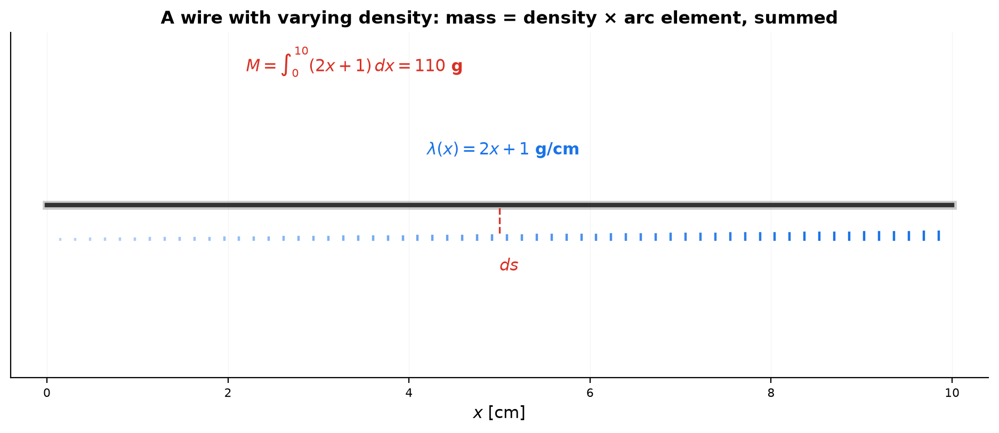
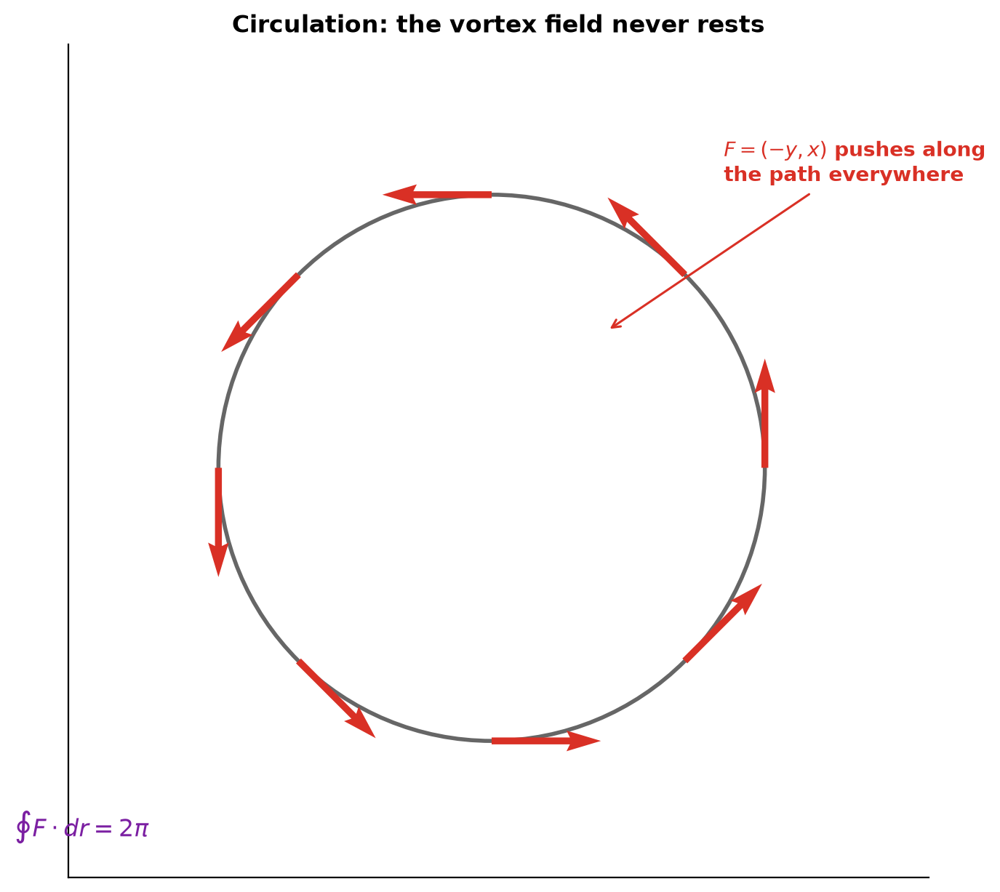
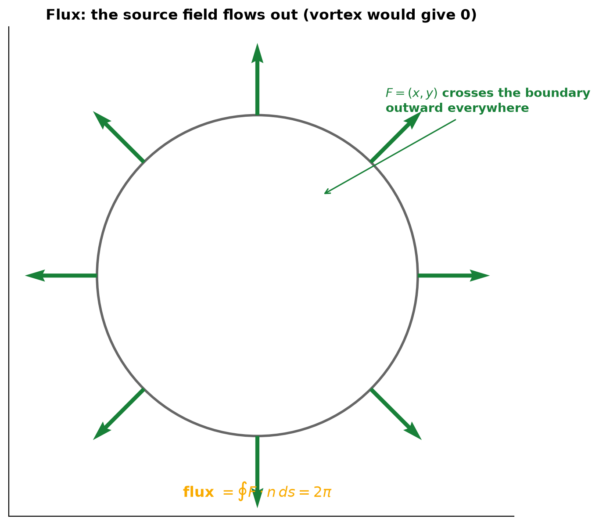
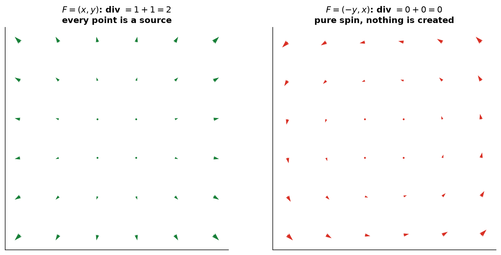
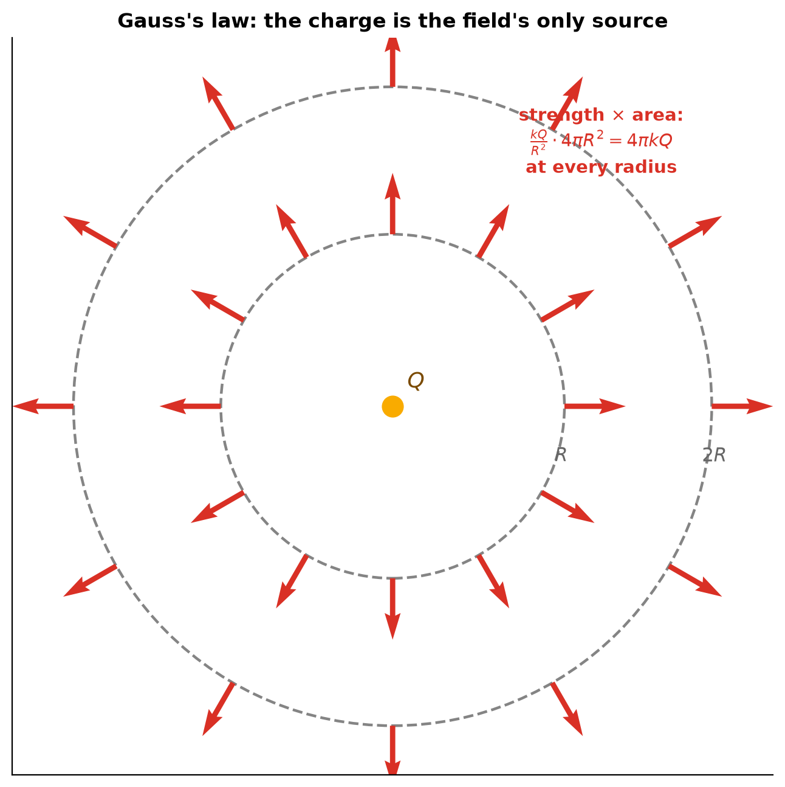
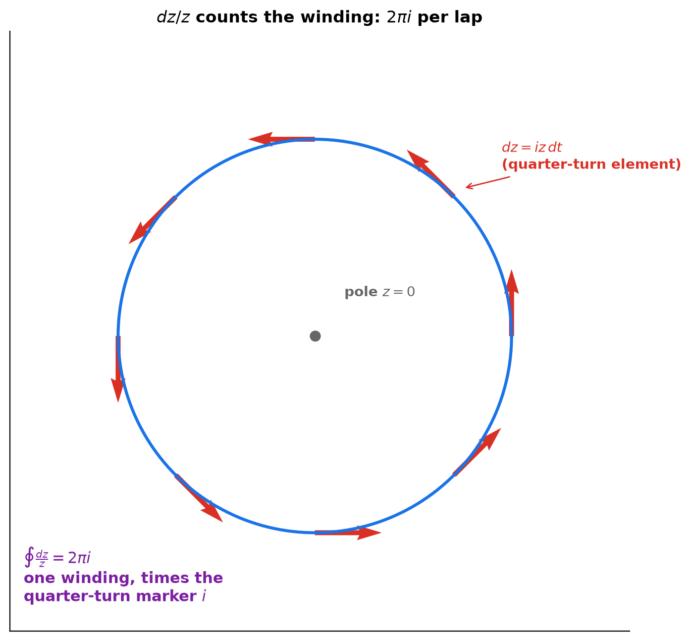

# Session 16C2: Advanced Integral Interpretation — Line, Flux, and Abstract Measures

**Phase 2 — Classical Techniques | 90 min**

*16C1 integrated rates into totals. This session integrates **fields**: a force field along a path (work), a flow field across a boundary (flux), a density field against space (mass). You will meet two new measuring elements — the arc element $ds$ and the area element $dA$ — and see that every integral is "a field summed against a measure." The finale connects both 16-sessions back to 14D2: the total outflow of a field equals the integral of its divergence — differentiation and integration, reconciled at the level of fields.*

**Prerequisites**: 16C1 (accumulation), 14D2 (gradient & fields), 9B (parametric curves), 9C (3D & surfaces), 12A1 (complex), 12A2 (vectors), 16B (techniques)

> 💡 **Stuck?** Every problem has a collapsible **Hint** below it — click it only when you need a nudge.

---

## Part A: Abstract Measures — New Elements to Sum Against

> **The procedure**: An integral is $\int (\text{field}) \times (\text{measure element})$. The field carries meaning; the element carries geometry. Units multiply. Three elements do almost all the work: $ds$ (along a curve), $dA$ (over a region), $dV$ (inside a volume).

---

## Example 1: The Measure Elements and Their Units

| Element | Geometry | Units | Example: field × element = total |
|:---:|:---:|:---:|:---|
| $ds$ | tiny arc of a wire | m | density $\lambda$ (kg/m) → mass $\int\lambda\,ds$ |
| $dA$ | tiny patch of a plate | m² | density $\rho$ (kg/m²) → mass $\iint\rho\,dA$ |
| $dV$ | tiny cell of a region | m³ | charge density (C/m³) → charge $\iiint\rho\,dV$ |
| $dt$ | tiny stretch of time | s | the 16C1 case: rate → total |

**The abstract step**: the element $ds$, $dA$, $dV$ is a **measure** — a rule that assigns a size to every piece of space. An integral is "sum the field's value over each piece, weighted by the piece's size." Units always multiply: $\mathrm{kg/m \times m = kg}$.

**The wire example**: a wire along $[0,10]$ has density $\lambda(x) = 2x+1$ g/cm. Mass:

$$M = \int_0^{10}(2x+1)\,dx = [x^2+x]_0^{10} = 110\ \mathrm{g}.$$

Read it as a sentence: "the wire gets denser to the right; the integral adds every gram." Each thin piece contributes its own density × its own length — the slice-and-sum pattern of 16C1, now in space.



*Graph 16C2-1: A wire whose shading shows density $\lambda(x)=2x+1$. Mass = the integral of density against the arc element $ds$ — density × length, added up.*

**Lens reading**: a measure is the relation between a piece of space and its size — and integrating is collecting a field's value against that relation, units multiplying at every step.

---

## Part B: Line Integrals — Work and Circulation

> **The procedure**: Along a path, only the piece of the force **along** the path does work: $F \cdot dr$. Sum those dot products. Whether the total depends on the path is the deepest question in this session.

---

## Example 2: The Circulation Field — Work Around a Circle (🔗 9B)

The field $F(x,y) = (-y, x)$ pushes every point **tangent to the circle through it** — it is the spinning-plate field of 14D2 Example 8.

Walk once around the unit circle (9B's parametrization): $r(t) = (\cos t, \sin t)$, so $dr = (-\sin t, \cos t)\,dt$ and $F = (-\sin t, \cos t)$.

$$W = \oint F\cdot dr = \int_0^{2\pi}\big[(-\sin t)(-\sin t) + (\cos t)(\cos t)\big]dt = \int_0^{2\pi} 1\,dt = 2\pi.$$

**Read it**: at every instant the field pushes with full strength in the direction of motion ($F \cdot dr = 1\,dt$ — the field does 1 joule of work per meter walked). Walking the whole circle earns $2\pi$ joules. Around a circle of radius $R$ the answer scales to $2\pi R^2$ (speed grows with $R$).

**Circulation** = the work around a **closed** loop. For this field it is not zero — the field is a vortex that never lets you rest. This single fact will divide all fields into two kinds.



*Graph 16C2-2: The field $F=(-y,x)$ is tangent to circles everywhere; the work around one lap is $2\pi$. Each arrow pushes along the path — circulation is nonzero.*

**Lens reading**: circulation is the collected relation between force and direction — the vortex's degree along the path is 1 everywhere, so a full lap collects $2\pi$.

---

## Example 3: The Radial Field — A Field That Is a Derivative

The field $F(x,y) = (x,y)$ points straight away from the origin.

**Around the same circle**: $F$ is **perpendicular** to $dr$ at every point, so $F \cdot dr = 0$ — circulation $= 0$. Walking around a radial field earns nothing, because it never pushes along the path.

**Along a straight path** from $(0,0)$ to $(1,1)$: $r(t) = (t,t)$, $dr = (1,1)dt$, $F = (t,t)$:

$$W = \int_0^1 2t\,dt = 1.$$

**The pattern**: try $\phi(x,y) = \frac12(x^2+y^2)$. Its gradient is $\nabla\phi = (x,y) = F$ — the field **is a derivative** (14D2's first ladder rung). And the work equals the potential difference:

$$W = \phi(1,1) - \phi(0,0) = 1 - 0 = 1.$$

**The field-level FTC**: if $F = \nabla\phi$, the work between two points is $\phi(\text{end}) - \phi(\text{start})$ — **path-independent**. The vortex field has no such $\phi$: going around a loop changes the "potential" by $2\pi$, so it can never be a gradient. Two fields, two destinies — the loop test tells them apart. (That loop test is exactly 16C1's "differentiate the answer to check" — at field level.)

**Lens reading**: the radial field is a gradient — its relation to position is someone's derivative, so work collects the potential difference: path-independent, the field-level FTC.

---

## Part C: Flux and Divergence — Counting What Leaves

> **The procedure**: For flow fields, the right question is not "work along the path" but "how much crosses the boundary?" — the **flux** through a curve, using the outward normal $n$. Dividing flux by enclosed area gives the **divergence**: the source density at a point.

---

## Example 4: Flux — The Component Across the Boundary

Field $F(x,y) = (x,y)$ (a source: everything flows outward). Through the unit circle, the outward normal is $n = (\cos t, \sin t)$, and on the circle $F = (\cos t, \sin t) = n$:

$$\text{Flux} = \oint F\cdot n\,ds = \int_0^{2\pi} 1\,dt = 2\pi.$$

**Compare the vortex** $F = (-y,x)$: on the circle it is **tangent**, so $F \cdot n = 0$ — flux $= 0$. The vortex spins but nothing leaves.

**The pair of numbers**: for $F=(x,y)$: circulation 0, flux $2\pi$. For $F=(-y,x)$: circulation $2\pi$, flux 0. Two fields that look equally circular are distinguished by two integrals — one measures **spin along** the boundary, one measures **spread across** it.



*Graph 16C2-3: $F=(x,y)$ crosses the circle outward everywhere — flux $2\pi$. The vortex field (right inset) is tangent everywhere: flux 0.*

**Lens reading**: flux collects the relation across the boundary — the source field crosses everywhere (flux $2\pi$), the vortex is tangent everywhere (flux 0): two relations, two integrals.

---

## Example 5: Divergence — The Source Density

Flux through a circle of radius $R$ for $F=(x,y)$: $\text{flux} = 2\pi R^2$ = (field strength at radius × circumference) = $R \cdot 2\pi R$. Divide by the enclosed **area** $\pi R^2$:

$$\frac{\text{flux}}{\text{area}} = \frac{2\pi R^2}{\pi R^2} = 2.$$

The outflow per unit area is $2$, **independent of $R$** — the field is uniformly "squirting": every point is a source of strength 2. That number is the **divergence**:

$$\operatorname{div} F = \frac{\partial F_1}{\partial x} + \frac{\partial F_2}{\partial y}.$$

Check: for $F=(x,y)$: $1+1 = 2$ ✓. For the vortex $F=(-y,x)$: $0+0=0$ — no sources, pure spin. (For 14D2's linear fields, the divergence was exactly the **trace** — Example 9 there.)

**Gauss's theorem (2D)**: the total flux out of any region equals the integral of the divergence inside:

$$\oint F\cdot n\,ds = \iint \operatorname{div}F\,dA.$$

It says: *the total that leaves equals the sum of all the little sources.* This is the FTC of fields — integrating a derivative (div) over the inside recovers the boundary values. 14D2's ladder, completed by integration.



*Graph 16C2-4: Left — $F=(x,y)$, divergence 2: every point emits. Right — $F=(-y,x)$, divergence 0: pure rotation, nothing is created.*

**Lens reading**: divergence is the source relation per unit area — for $F=(x,y)$ every point squirts with degree 2, and Gauss's theorem is the undo button: total outflow = collected sources.

---

## Example 6: Gauss's Law — The Electric Field's Secret (🔗 9C)

A point charge $Q$ at the origin creates the electric field $E = \frac{kQ}{r^2}\hat r$ (points radially, strength falls as $1/r^2$).

**Flux through a sphere of radius $R$** (9C's sphere): $E$ is parallel to the outward normal everywhere, with constant magnitude $kQ/R^2$ on the sphere. Flux = strength × surface area:

$$\text{flux} = \frac{kQ}{R^2}\cdot 4\pi R^2 = 4\pi kQ.$$

**The miracle**: the flux does not depend on $R$. Through a tiny sphere or a giant one, the same $4\pi kQ$ crosses. Read the sentence: *the inverse-square law and the surface-area law are inverse to each other* — strength falls like $1/R^2$, the sphere grows like $R^2$, and the product is the enclosed charge.

**Divergence reading**: div $E = 0$ everywhere **except at the charge itself**. All the outflow originates from one point — the charge is the only source. Gauss's law $\oint E\cdot n\,dA = 4\pi kQ_{\text{inside}}$ is the divergence theorem with one source: *the flux through any closed surface counts the total charge inside, no matter how far away or how oddly shaped.*



*Graph 16C2-5: The electric field of a point charge through two spheres ($R$ and $2R$). Strength drops to a quarter, area quadruples — the flux is the same. The charge is the field's only source.*

**Lens reading**: the inverse-square relation and the surface-area relation cancel — strength's degree $1/R^2$ times the sphere's $R^2$ leaves the charge: flux counts sources, not distance.

---

## Part D: Complex Integrals — Winding and the $2\pi i$ Miracle (🔗 12A1)

> **The procedure**: Integrate along a circle in $\mathbb{C}$ using 14D2's key fact: $dz = i z\,dt$ — the path element is the position rotated a quarter-turn. One power of $z$ will refuse to average out.

---

## Example 7: $\oint z^n\,dz$ — Why $n=-1$ Is Special

Around the unit circle $z = e^{it}$, $dz = ie^{it}dt = iz\,dt$ (the quarter-turn element, 14D2 Example 6):

$$\oint z^n\,dz = \int_0^{2\pi} e^{int}\cdot ie^{it}\,dt = i\int_0^{2\pi} e^{i(n+1)t}dt.$$

For $n \neq -1$ the integrand is a point rotating around the circle — its **average is zero** (16C1's balance point, now complex): $\oint z^n dz = 0$.

For $n = -1$ the rotation **stops**: $e^{i0t} = 1$, and

$$\oint \frac{dz}{z} = i\int_0^{2\pi} 1\,dt = 2\pi i.$$

**Read it**: integrating $1/z$ around the origin measures the path's **angle traveled** — $2\pi$ radians — and the factor $i$ records that the measurement itself was a rotation. The integral $\oint dz/z$ is a **winding counter**: $2\pi i$ per lap around the pole at $z=0$. Every other power winds to zero; only the $-1$ power sees the hole.



*Graph 16C2-6: Integrating $1/z$ around the unit circle. The path element $dz$ is the position rotated 90°; $1/z$ un-rotates it, leaving the total angle $2\pi$, times the quarter-turn marker $i$.*

**Lens reading**: integrating $1/z$ collects the path's angular relation to the origin — one lap, $2\pi i$; every other power's relation averages to zero. The winding is the only survivor.

---

## Example 8: Integrating Rotation — The Circle's Average Position

$\int_0^{2\pi} e^{it}dt = \left[\frac{e^{it}}{i}\right]_0^{2\pi} = 0$ — a point going around a circle has **average position zero**: every position is balanced by its opposite. This is 16C1's "average = balance point" (Example 8 there) living inside the complex field: the mean of a full circle is its center.

For a **half** turn: $\int_0^{\pi} e^{it}dt = \frac{e^{i\pi}-1}{i} = \frac{-2}{i} = 2i$ — the average over the half-circle is $2i/\pi \approx 0.64i$: a point **above** the center, on the imaginary axis — exactly where a semicircle's center of mass sits. Integration over the complex field recovers 16C1's geometric facts in one line.

**Lens reading**: the average of a full circle is its center — the collected relation balances to zero; over a half-circle the collection leaves the balance point $2i/\pi$ above center.

---

## Part E: Abstract Measures — Centers and Moments

> **The procedure**: The measure $dm = \rho\,dA$ turns any region into a weighted space. All "weighted averages" — centroid, expectation (16C1), moment of inertia — are one pattern: $\frac{\int (\text{quantity})\,dm}{\int dm}$.

---

## Example 9: The Half-Disk — Centroid As a Measure-Average

A half-disk of radius 1 with uniform density ($\rho=1$): mass $M = \frac{\pi}{2}$ (area of the half-disk). The centroid's height:

$$\bar y = \frac{\iint y\,dA}{M} = \frac{1}{\pi/2}\int_0^{\pi}\int_0^1 (r\sin\theta)\,r\,dr\,d\theta = \frac{2}{\pi}\cdot\frac23 = \frac{4}{3\pi} \approx 0.42.$$

**Read it**: the centroid is the balance point of the measure $dm = dA$ — the point where the plate balances on a fingertip. Note the pairing with 16C1: **probability is a measure of total 1**, so its expectation was the same calculation with the density as the weighting. Centroid, expectation, center of mass — one pattern: *sum the quantity against the measure, divide by the total measure.*

**Moment of inertia** $I = \int r^2\,dm$ is the same pattern with the quantity $r^2$: it measures how far the mass sits from the axis — the resistance to spinning (A6).

**Lens reading**: the centroid is the balance point of the measure — the same collected-average pattern as probability's expectation, with $dm$ as the relation weighting each point.

> **Up to here**: $ds, dA, dV$ are measures and units multiply; work is $\int F\cdot dr$ — zero around loops exactly when $F$ is a gradient (the field-level FTC); flux is $\int F\cdot n\,ds$ and divergence is flux per area — Gauss's theorem says total outflow = integral of sources; inverse-square fields have constant flux (the charge counts); $\oint dz/z = 2\pi i$ counts windings; centroids and expectations are measure-averages.

---

## The Field Integral Checklist

> When an integral over a field appears, run this. It is the whole session in one box.

```
1. THE ELEMENT  → ds, dA, dV, or dt? That fixes the geometry and the units.
2. THE PRODUCT  → field × element: dot products for work, normal for flux.
3. THE LOOP     → closed path? Compute circulation. Zero ⇒ gradient (FTC of fields).
4. THE BOUNDARY → closed curve? Compute flux. Flux/area = divergence (source density).
5. THE CHECK    → differentiate the potential (get F back); div of the field = source rate.
6. THE MEASURE  → could the field be a density? Then the integral is a mass/centroid/expectation.
```

---

## Common Mistakes

### Mistake 1: Using $dt$ instead of the arc element $ds$

**Wrong**: writing $\int F\cdot n\,dt$ on a curve. **Right**: the boundary element carries its own geometry: $ds = |r'(t)|dt$ for arc length, $dr = r'(t)dt$ for work. Units differ — $ds$ is meters, $dt$ is seconds.

### Mistake 2: Mixing up circulation and flux

**Wrong**: "the vortex's flux is $2\pi$." **Right**: the vortex has **circulation** $2\pi$ (tangent arrows) and **flux 0** (nothing crosses). Work uses $F\cdot dr$ (tangent); flux uses $F\cdot n\,ds$ (normal). One measures spin, one measures spread.

### Mistake 3: Divergence with the wrong sign convention

**Wrong**: counting inward flow as positive flux. **Right**: the normal $n$ points **outward**; outward flow is positive. Divergence positive = source (emitting), negative = sink (absorbing).

### Mistake 4: Forgetting that $n=-1$ is the special power

**Wrong**: "$\oint z^{-1}dz = 0$ like the others." **Right**: only $z^{-1}$ fails to wind to zero — $\oint dz/z = 2\pi i$. The pole at the origin is what the integral counts.

### Mistake 5: Assuming every field is a gradient

**Wrong**: "work is always path-independent." **Right**: only gradient fields ($F=\nabla\phi$) are. The loop test decides: circulation zero around every loop ⟺ a potential exists. The vortex field fails the test.

---

## What We Just Did

```
(1) Measures: ds (m), dA (m²), dV (m³). Integral = field × element; units multiply.
(2) Work: W = ∫F·dr. Around a loop: circulation. F=∇φ ⟺ circulation = 0 (field FTC).
    Vortex (−y,x): circulation 2π, no potential. Radial (x,y): potential ½(x²+y²).
(3) Flux: ∮F·n ds. Source field: 2π through unit circle; vortex: 0.
    Divergence = flux/area = ∂F₁/∂x + ∂F₂/∂y. Gauss: ∮F·n ds = ∬div F dA.
(4) Inverse-square E = kQ r̂/r²: flux = 4πkQ independent of R — the charge is the source.
(5) Complex: dz = iz dt (quarter-turn element). ∮zⁿdz = 0 (n≠−1), ∮dz/z = 2πi (winding).
    ∫e^{it}dt over a full circle = 0: average position is the center.
(6) Measure-averages: centroid ȳ = ∫y dm / ∫dm; moment I = ∫r²dm.
```

---

## Practice 1

A wire along $[0,10]$ has density $\lambda(x) = 2x+1$ g/cm. (a) Find its mass. (b) Find the mass of just the right half $[5,10]$. (c) Why is the right half more than half the mass?

<details>
<summary>💡 Hint</summary>

(a) $[x^2+x]_0^{10} = 110$ g. (b) $(100+10)-(25+5) = 80$ g. (c) the wire is denser to the right — measure and density multiply.

</details>

→ Solutions: [Solutions](solutions/16C2-solutions.md#practice-1)

---

## Practice 2

Compute the circulation of $F = (-y, x)$ around the circle of radius 2, and explain what each factor of the answer means.

<details>
<summary>💡 Hint</summary>

On the circle, $F\cdot dr = R^2\,dt = 4\,dt$, so the total is $4 \cdot 2\pi = 8\pi$. One factor $R$ from field strength, one from path length.

</details>

→ Solutions: [Solutions](solutions/16C2-solutions.md#practice-2)

---

## Practice 3

For $F = (x,y)$: (a) compute the work along the straight path from $(0,0)$ to $(2,2)$; (b) verify it equals $\phi(2,2)-\phi(0,0)$ for $\phi = \frac12(x^2+y^2)$; (c) what is the circulation around any closed loop?

<details>
<summary>💡 Hint</summary>

(a) $r(t)=(t,t)$: $\int_0^2 2t\,dt = 4$. (b) $\phi(2,2) = 4$ ✓. (c) gradient field → zero around every loop.

</details>

→ Solutions: [Solutions](solutions/16C2-solutions.md#practice-3)

---

## Practice 4

Compute the flux of $F=(x,y)$ through the circle of radius 3. Then check Gauss's theorem: the flux should equal the area times the divergence.

<details>
<summary>💡 Hint</summary>

Flux $= 2\pi R^2 = 18\pi$. Divergence $= 2$; area $= 9\pi$; product $= 18\pi$ ✓.

</details>

→ Solutions: [Solutions](solutions/16C2-solutions.md#practice-4)

---

## Practice 5: Real Battle — Gauss's Law

A charge $Q$ sits at the origin: $E = \frac{kQ}{r^2}\hat r$. Compute the flux through the sphere of radius $R$, then through the sphere of radius $2R$. They are equal — explain in one sentence why the inverse-square law *must* pair with the surface-area law this way.

<details>
<summary>💡 Hint</summary>

$|E|\cdot 4\pi R^2 = \frac{kQ}{R^2}\cdot 4\pi R^2 = 4\pi kQ$ — and at radius $2R$ the strength is $\frac14$ but the area is $4\times$.

</details>

→ Solutions: [Solutions](solutions/16C2-solutions.md#practice-5)

---

## Practice 6: Real Battle — The Winding Integral (🔗 12A1)

Compute $\oint z\,dz$ and $\oint \frac{dz}{z}$ around the unit circle. One is zero, one is $2\pi i$ — explain what the two answers say about the functions $z$ and $1/z$.

<details>
<summary>💡 Hint</summary>

$dz = ie^{it}dt$. For $z\,dz$ the integrand keeps rotating → averages to 0. For $dz/z$ the rotation cancels → the total angle $2\pi$ survives, times $i$.

</details>

→ Solutions: [Solutions](solutions/16C2-solutions.md#practice-6)

---

## Basic Drills

**D1.** Write the units of $\int\lambda\,ds$, $\iint\rho\,dA$, $\int F\cdot dr$, and $\oint F\cdot n\,ds$.

<details>
<summary>💡 Hint</summary>

kg; kg; J (=N·m); and field-units × m (for $F$ in N/m: N, or for velocity fields: m²/s).

</details>

**D2.** A wire 20 cm long has constant density 3 g/cm. Find its mass.

<details>
<summary>💡 Hint</summary>

$3 \cdot 20 = 60$ g — density × length, the constant-field case of Example 1.

</details>

**D3.** For $F=(x,y)$, find the work along the $x$-axis from $x=0$ to $x=2$.

<details>
<summary>💡 Hint</summary>

On the axis $F=(x,0)$, $dr=(dx,0)$: $\int_0^2 x\,dx = 2$.

</details>

**D4.** Compute the circulation of $F=(-y,x)$ around the unit circle.

<details>
<summary>💡 Hint</summary>

$F\cdot dr = dt$ everywhere: total $2\pi$.

</details>

**D5.** Compute the flux of $F=(x,y)$ through the unit circle.

<details>
<summary>💡 Hint</summary>

$F = n$ on the circle: flux $= 2\pi$.

</details>

**D6.** Compute $\operatorname{div}(2x, 3y)$ and $\operatorname{div}(-y, x)$.

<details>
<summary>💡 Hint</summary>

$2+3 = 5$ (strong source); $0+0 = 0$ (pure spin).

</details>

**D7.** For $E = kQ\,\hat r/r^2$, the field strength at radius $R$ is $kQ/R^2$. Compute the flux through the sphere of radius $R$.

<details>
<summary>💡 Hint</summary>

strength × surface area $= 4\pi kQ$ — the $R$'s cancel.

</details>

**D8.** Compute $\int_0^{2\pi}e^{it}dt$ and explain the result geometrically.

<details>
<summary>💡 Hint</summary>

$0$ — a full circle's average position is its center; every point is balanced by its opposite.

</details>

**D9.** A square plate $[0,2]\times[0,2]$ has density 1. Find its mass and centroid.

<details>
<summary>💡 Hint</summary>

$M = 4$; by symmetry the centroid is $(1,1)$ — the balance point of a uniform square.

</details>

**D10.** Compute $\oint z^2\,dz$ around the unit circle.

<details>
<summary>💡 Hint</summary>

$\int_0^{2\pi} e^{2it}\cdot ie^{it}dt = i\int_0^{2\pi}e^{3it}dt = 0$ — every power except $-1$ winds to zero.

</details>

> Solutions: [Solutions](solutions/16C2-solutions.md#basic-drill)

---

## Advanced Drills

> Each problem has a computation part AND an interpretation part. Don't skip the explanation parts.

**A1.** Show that $F=(-y,x)$ has circulation $2\pi R^2$ around a circle of radius $R$ but $F=(x,y)$ has circulation 0 around the same circle. Why does the loop test prove that only one of them can be a gradient?

<details>
<summary>💡 Hint</summary>

$F\cdot dr = R^2 dt$ vs $0$. If $F=\nabla\phi$, the work around any closed loop is $\phi(\text{start})-\phi(\text{start})=0$. The vortex's $2\pi R^2$ violates this.

</details>

**A2.** Verify Green's theorem on the unit square for $F=(-y,x)$: compute the circulation around the square's boundary directly (four sides), and compare with $\iint\left(\frac{\partial F_2}{\partial x}-\frac{\partial F_1}{\partial y}\right)dA$.

<details>
<summary>💡 Hint</summary>

Boundary: only the right and top sides contribute 1 each — total 2. Inside: $\iint(1-(-1))dA = 2\cdot1 = 2$ ✓.

</details>

**A3.** For $F=(x,y)$, compute the flux through the unit square directly (four sides) and verify Gauss's theorem: flux = area × divergence.

<details>
<summary>💡 Hint</summary>

Right and top faces each contribute 1; left and bottom 0 — flux 2. div = 2, area = 1: $2\cdot1=2$ ✓.

</details>

**A4.** For $E = kQ\,\hat r/r^2$ in 3D, explain why div $E = 0$ at every point except the origin, yet the flux through any closed surface around the origin is $4\pi kQ$. Where does all the outflow come from?

<details>
<summary>💡 Hint</summary>

No spreading happens away from the origin (flux through nested spheres is equal). All the outflow originates at the one point where the field is undefined — the charge itself is the single source.

</details>

**A5.** $\phi(x,y) = x^2y$. Compute the work of $F=\nabla\phi$ from $(0,0)$ to $(1,2)$ along two different paths — straight line, and the L-shaped path — and confirm both equal $\phi(1,2)$.

<details>
<summary>💡 Hint</summary>

$F=(2xy, x^2)$. Straight path: $\int_0^1 6t^2dt = 2$. L-path: horizontal leg 0, vertical leg $\int_0^2 dy = 2$. Both equal $\phi(1,2)=2$ — path-independence in action.

</details>

**A6.** A uniform rod of length $L$ and density 1 lies on $[-L/2, L/2]$. Find its moment of inertia about its center, $\int x^2 dm$, and explain why the answer grows as $L^3$.

<details>
<summary>💡 Hint</summary>

$I = \int_{-L/2}^{L/2}x^2 dx = \frac{L^3}{12}$. Cubic: mass grows with $L$, and mass sits at distances that grow with $L$ — two factors, and $r^2$ supplies the third power's worth of leverage.

</details>

**A7.** Prove $\int_0^{2\pi}e^{int}dt = 0$ for every nonzero integer $n$, and $=2\pi$ for $n=0$. Why does this orthogonality make rotations the perfect measuring units for periodic signals?

<details>
<summary>💡 Hint</summary>

$n\neq0$: $\frac{1}{in}e^{int}\big|_0^{2\pi} = 0$ (the circle closes). Different rotation speeds are orthogonal — a signal can be decomposed into rotation speeds without interference (the seed of Fourier analysis, 25E).

</details>

**A8.** Compute $\oint z\,dz$ and $\oint \bar z\,dz$ around the unit circle. One is 0 and one is $2\pi i$ — which, and why does the reflection fail the same test that $1/z$ passes?

<details>
<summary>💡 Hint</summary>

$\oint z\,dz = 0$; $\oint \bar z\,dz = \int e^{-it}\cdot ie^{it}dt = 2\pi i$. $z$ winds once and averages out; $\bar z$ winds once *backward*, so the quarter-turn element $dz$ fails to cancel it — the integral detects the reversed rotation.

</details>

**A9.** Find the centroid of the half-disk of radius 1 (density 1): compute $\bar x$ and $\bar y$. Why is $\bar x = 0$ but $\bar y = \frac{4}{3\pi}$?

<details>
<summary>💡 Hint</summary>

$\bar x = 0$ by left-right symmetry. $\bar y = \frac{\iint y\,dA}{\pi/2} = \frac{2}{\pi}\cdot\frac23 = \frac{4}{3\pi}\approx0.42$ — the half-disk's mass sits lower than the rim because the measure thins toward the top.

</details>

**A10.** A wire on $[0,L]$ has density $\lambda(x) = kx$ (the ramp). Find its mass and centroid. Compare with 16C1's triangular probability density — what is the same, and what changed?

<details>
<summary>💡 Hint</summary>

$M = kL^2/2$; $\bar x = \frac{\int kx^2}{\int kx} = \frac{kL^3/3}{kL^2/2} = \frac{2L}{3}$. Identical math to the triangular density's expectation $\frac23$ — only the units (kg·m vs probability) changed. That is the measure concept: the weighting scheme is the math; the meaning is the units.

</details>

> Solutions: [Solutions](solutions/16C2-solutions.md#advanced-drill)

---

## Deep Insight

> One problem, pushed to the edge of this session's method. Compute it — then explain *why* the method breaks or holds. The "why" is the whole point.

**DI1.** In 2D, a point charge at the origin creates the field $E = kQ\frac{(x,y)}{r^2}$. (a) Compute the flux of $E$ through the square $|x|\le1$, $|y|\le1$ by direct integration over the four sides. (b) Compare with the flux through the circle of radius 1. (c) They agree — explain why **any** closed curve around the charge gives the same flux, and what that reveals about what flux actually counts.

<details>
<summary>💡 Hint</summary>

On the side $x=1$, $E\cdot n = \frac{kQ}{1+y^2}$ — the arctan is waiting. For (c): where is $\operatorname{div} E$ nonzero?

</details>

→ Solutions: [Solutions](solutions/16C2-solutions.md#deep-insight)

---

## Today's Procedure

| When you see... | Do this... |
|:---|:---|
| A wire/plate/region with density | Mass $=\int\lambda\,ds$, $\iint\rho\,dA$, $\iiint\rho\,dV$ — units multiply |
| Work along a path | $W=\int F\cdot dr$; parametrize the path (9B) and dot with $dr$ |
| A closed loop | Compute circulation. Zero ⟺ $F$ is a gradient (potential exists) |
| A flow crossing a boundary | Flux $=\oint F\cdot n\,ds$; divide by area → divergence (source density) |
| Inverse-square radial field | Flux $=$ field strength × surface area; the $R$'s cancel — count the charge |
| A complex loop integral | $dz = iz\,dt$; only $z^{-1}$ survives — $2\pi i$ per winding |
| A centroid or expectation | $\frac{\int (\text{quantity})\,dm}{\int dm}$ — the measure-average pattern |

---

## How to Read These Symbols

| Symbol | Reads as | Meaning |
|:---:|:---:|------|
| $ds$, $dA$, $dV$ | "d s, d A, d V" | arc, area, and volume elements — the measures |
| $F \cdot dr$ | "F dot d r" | work piece: the force's piece along the path |
| $F \cdot n\,ds$ | "F dot n d s" | flux piece: the field's piece across the boundary |
| $\oint$ | "integral around a closed path" | circulation (or flux through a closed curve) |
| $\operatorname{div} F$ | "divergence of F" | source density $= \frac{\partial F_1}{\partial x}+\frac{\partial F_2}{\partial y}$ |
| $\bar x,\ \bar y$ | "x bar, y bar" | centroid coordinates — balance point of the measure |
| $I$ | "moment of inertia" | $\int r^2\,dm$ — resistance to spinning |
| $2\pi i$ | "two pi i" | one winding's worth — the loop integral of $1/z$ |

---

## Terminology

| What we call it | Math term | Notation |
|:---:|:---:|:---:|
| size assigned to each piece of space | measure | $ds$, $dA$, $dV$ |
| work accumulated along a path | line integral | $\int F\cdot dr$ |
| work around a closed loop | circulation | $\oint F\cdot dr$ |
| field whose line integral is path-independent | conservative / gradient field | $F = \nabla\phi$ |
| amount crossing a boundary | flux | $\oint F\cdot n\,ds$ |
| outflow per unit area | divergence | $\operatorname{div} F$ |
| flux = total sources inside | Gauss's theorem / divergence theorem | $\oint F\cdot n\,ds = \iint\operatorname{div}F\,dA$ |
| loop integral that counts laps around a pole | winding number | $\frac{1}{2\pi i}\oint\frac{dz}{z}$ |
| weighted average against a measure | centroid / expectation | $\frac{\int x\,dm}{\int dm}$ |
