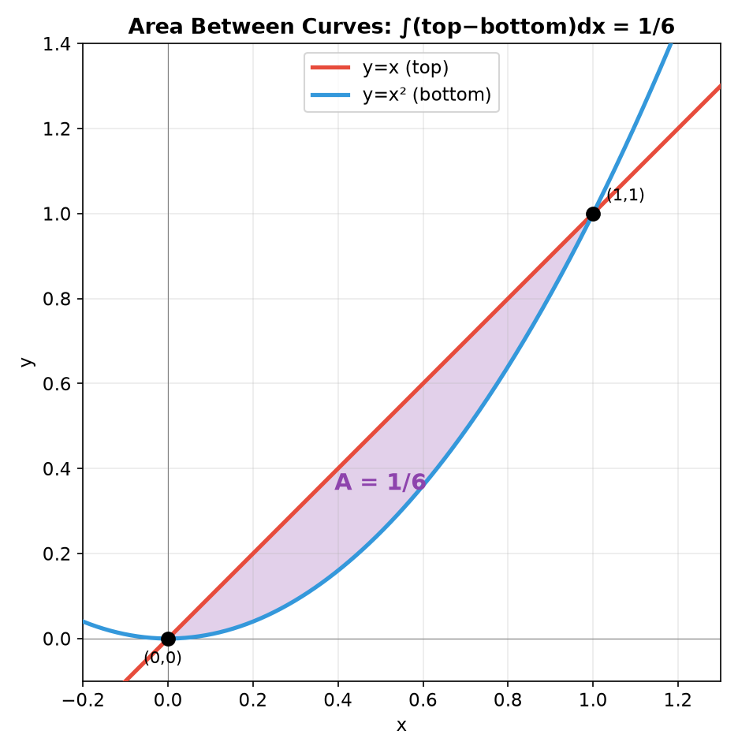
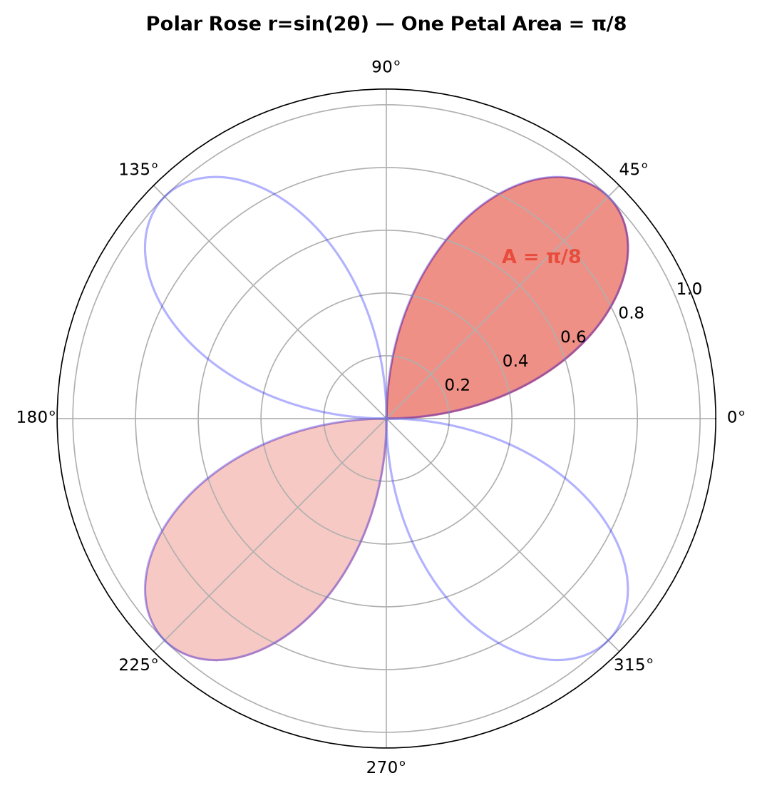
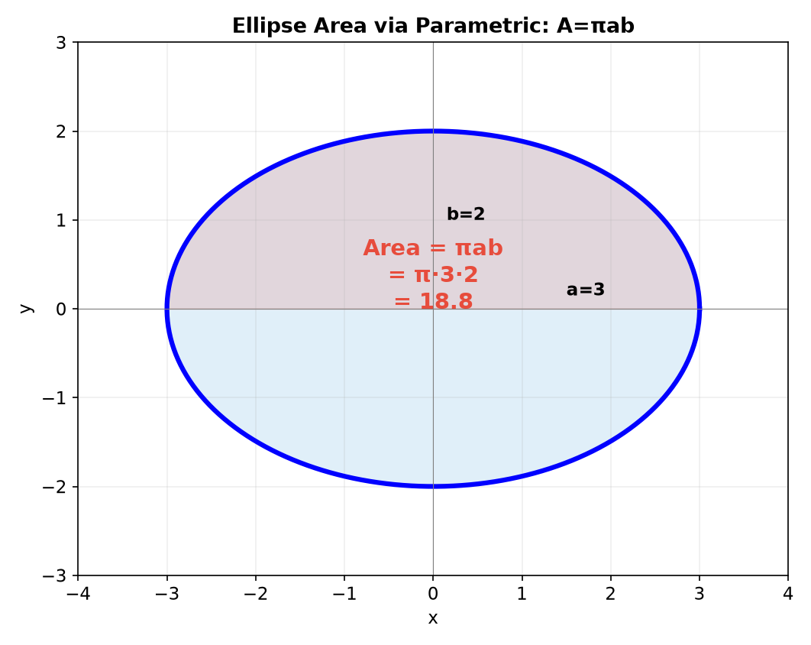
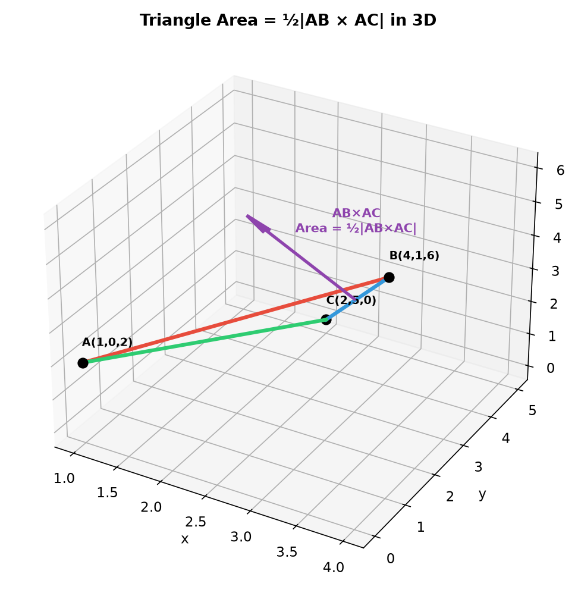
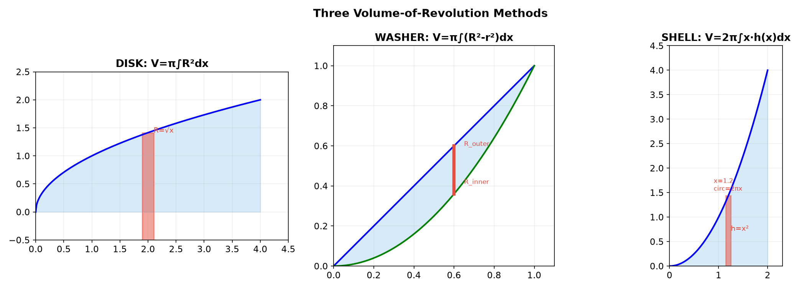
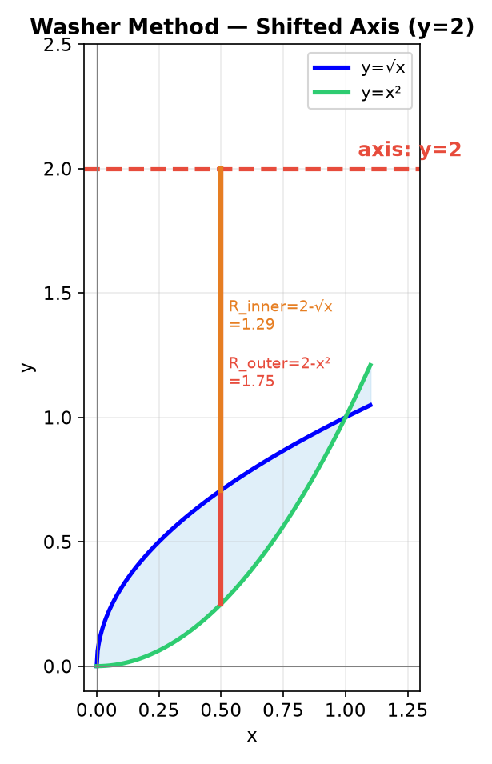
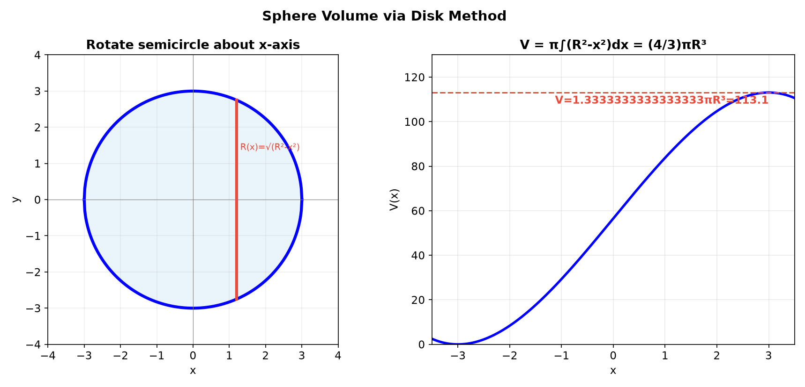
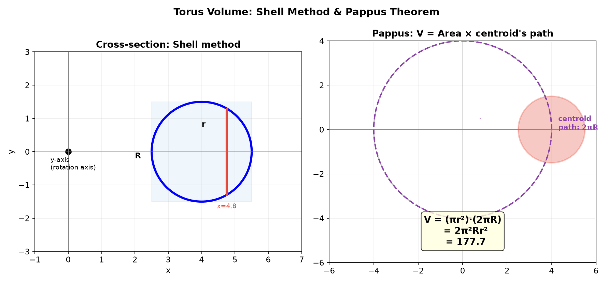
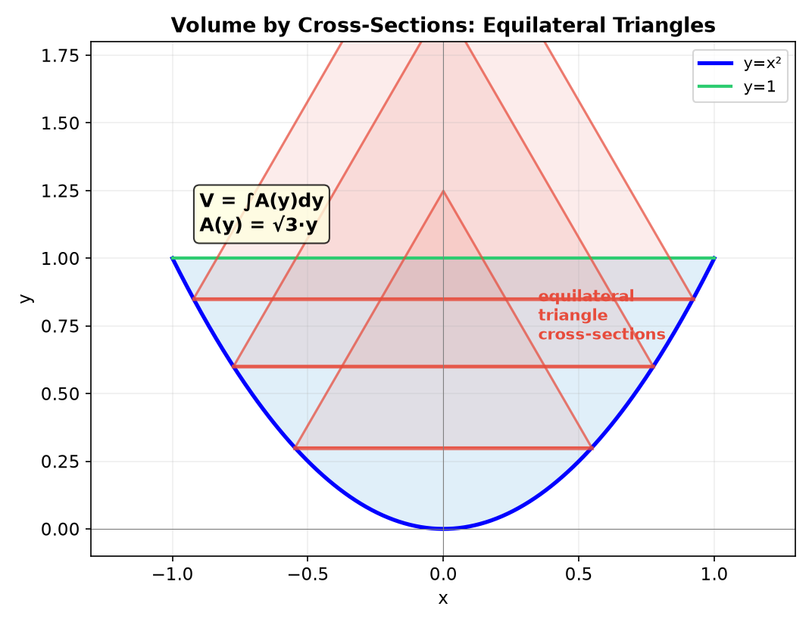
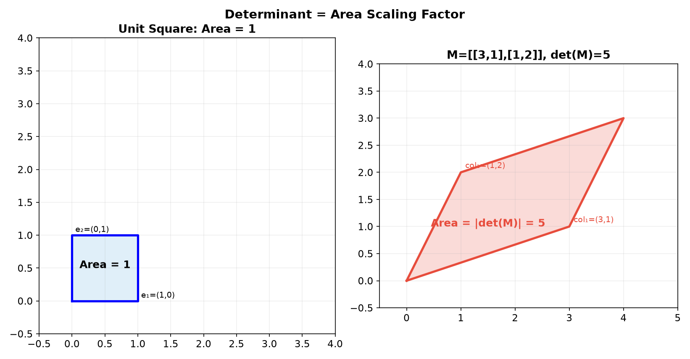

# Session 17A: Area and Volume — Geometry Meets Integration

**Phase 2 — Classical Techniques | 75 min**

*Prerequisites: 16A (FTC & u-sub), 12A2 (matrices & vectors), 12C1 (geometric transformations), 12C2 (parametric curves), 9C (3D geometry)*

> Integration computes area and volume. But when geometry — vectors, transformations, parametric curves, and coordinate systems — enters the picture, the same formulas unlock a much richer world. This session fuses calculus with the spatial reasoning you've already built.

---

## Part A: Area Between Curves — Beyond $y=f(x)$

---

## Example 1: Area Between $y=x^2$ and $y=x$ — The Classic

$A = \displaystyle \int_0^1 (x - x^2)\,dx = \left[\frac{x^2}{2} - \frac{x^3}{3}\right]_0^1 = \frac{1}{6}$.

Intersections: $x^2 = x \to x(x-1)=0 \to x=0,1$.



> **Key principle**: Area = $\int_a^b$ [top − bottom]. Always find intersections first.

---

## Example 2: Area in Polar Coordinates — Rotational Symmetry (🔗 12C3)

When a region has radial symmetry, polar integration simplifies everything.

$A = \displaystyle \frac{1}{2}\int_{\theta_1}^{\theta_2} r^2\,d\theta$.

**One petal of $r = \sin(2\theta)$** (4-petal rose): A petal forms when $r \ge 0$, i.e., $\sin(2\theta) \ge 0 \to \theta \in [0, \pi/2]$.

$A_{\text{petal}} = \frac{1}{2}\int_0^{\pi/2} \sin^2(2\theta)\,d\theta = \frac{1}{2}\int_0^{\pi/2} \frac{1-\cos(4\theta)}{2}\,d\theta = \frac{1}{4}\left[\theta - \frac{\sin(4\theta)}{4}\right]_0^{\pi/2} = \frac{\pi}{8}$.

> **Why polar?** $r=\sin(2\theta)$ is a single trig function in polar. In Cartesian: $(x^2+y^2)^{3/2} = 2xy$. Choose the coordinate system matching the symmetry.



---

## Example 3: Area via Parametric Curves (🔗 12C2)

For a parametric curve $(x(t), y(t))$, area under the curve:

$A = \displaystyle \int_{t_1}^{t_2} y(t)\,x'(t)\,dt$.

**Area of ellipse** $\frac{x^2}{a^2} + \frac{y^2}{b^2} = 1$:
Parametrize: $x = a\cos t$, $y = b\sin t$, $t \in [0, 2\pi]$, upper half $t \in [0, \pi]$.

$x'(t) = -a\sin t$.
$A_{\text{upper}} = \int_0^\pi (b\sin t)(-a\sin t)\,dt = -ab\int_0^\pi \sin^2 t\,dt = -ab \cdot \frac{\pi}{2}$.

Taking absolute value: $A_{\text{total}} = 2 \cdot \frac{ab\pi}{2} = \pi ab$. ✓ (When $a=b=R$, gives $\pi R^2$.)



---

## Example 4: Triangle Area via Cross Product — 3D Geometry (🔗 9C, 12A2)

Triangle with vertices $A, B, C$ in 3D: $A = \frac{1}{2}|\vec{AB} \times \vec{AC}|$.

**Example**: $A(1,0,2)$, $B(4,1,6)$, $C(2,5,0)$.
$\vec{AB} = (3, 1, 4)$, $\vec{AC} = (1, 5, -2)$.
$\vec{AB} \times \vec{AC} = (-22, 10, 14)$, $|\vec{AB} \times \vec{AC}| = \sqrt{780} = 2\sqrt{195}$.
$A = \sqrt{195}$.

> **Key insight**: For shapes with straight edges (triangles, parallelograms), geometry alone gives the area — no integration needed. The cross product is the 3D version of "base × height." But when boundaries are curved, integration becomes essential — that's what the rest of this session is about.



---

## Example 5: Area Between Inverse Curves — Reflection Symmetry (🔗 12C1)

Area between $y=e^x$ and $y=\ln x$ on $[0,1]$. These are inverses — reflections across $y=x$.

On $[0,1]$: $e^x \ge 0$ and $\ln x \le 0$, so $e^x$ is above $\ln x$.

$A = \int_0^1 (e^x - \ln x)\,dx$. Antiderivative: $\int e^x dx = e^x$, $\int \ln x\,dx = x\ln x - x$.

So $F(x) = e^x - x\ln x + x$. Evaluate:
- At $x=1$: $F(1) = e^1 - 1\cdot 0 + 1 = e + 1$.
- At $x \to 0^+$: $e^0 = 1$, $\lim_{x\to 0^+}x\ln x = 0$, so $F(0^+) = 1 - 0 + 0 = 1$.

$A = (e+1) - 1 = e$.

> **Geometric note**: Since $e^x$ and $\ln x$ are reflections of each other across $y=x$, the area between them on $[0,1]$ equals the area between $\ln x$ and the line $y=x$, plus the area between $e^x$ and $y=x$ — a symmetry that can simplify some calculations.

---

## Part B: Volumes of Revolution



---

## Example 6: Disk Method — Rotate $y=\sqrt{x}$ About $x$-Axis

$V = \pi \displaystyle \int_0^4 (\sqrt{x})^2\,dx = \pi\int_0^4 x\,dx = 8\pi$.

---

## Example 7: Washer with Shifted Axis — Translation Geometry (🔗 12C1)

Region between $y=\sqrt{x}$ and $y=x^2$ on $[0,1]$ rotated about $y=2$.

On $[0,1]$: $\sqrt{x} \ge x^2$, so the region lies **below** both curves relative to $y=2$.

The axis $y=2$ is above the region. The washer's outer edge comes from the curve **farthest** from $y=2$, which is $y=x^2$ (lower → greater distance). The inner edge comes from $y=\sqrt{x}$ (closer to $y=2$).

Outer radius: $R_{\text{outer}} = 2 - x^2$ (distance from $y=2$ down to $y=x^2$).
Inner radius: $R_{\text{inner}} = 2 - \sqrt{x}$ (distance from $y=2$ down to $y=\sqrt{x}$).

> **Rule for shifted axis**: For rotation about $y = c$, the radius to a curve $y = f(x)$ is $|c - f(x)|$. The outer radius uses the curve farther from $c$.

$V = \pi\int_0^1 [(2-x^2)^2 - (2-\sqrt{x})^2]\,dx$
$= \pi\int_0^1 (-4x^2 + x^4 + 4\sqrt{x} - x)\,dx = \pi\left[-\frac{4}{3}x^3 + \frac{x^5}{5} + \frac{8}{3}x^{3/2} - \frac{x^2}{2}\right]_0^1$
$= \pi\left(-\frac{4}{3} + \frac{1}{5} + \frac{8}{3} - \frac{1}{2}\right) = \frac{31\pi}{30}$.



---

## Example 8: Sphere Volume Derivation — $V = \frac{4}{3}\pi R^3$ (🔗 9C)

Rotate $y = \sqrt{R^2 - x^2}$ about $x$-axis:

$V = \pi\int_{-R}^R (R^2 - x^2)\,dx = \pi\left[R^2 x - \frac{x^3}{3}\right]_{-R}^R = \frac{4}{3}\pi R^3$. ✓

> In spherical coordinates ($\rho=R$), the same result via triple integral — coordinate symmetry.



---

## Example 9: Shell Method — Rotate $y=x^2$ About $y$-Axis

$V = 2\pi \displaystyle \int_0^2 x \cdot x^2\,dx = 2\pi\left[\frac{x^4}{4}\right]_0^2 = 8\pi$.

> Each shell: circumference $2\pi x$, height $h(x)=x^2$, thickness $dx$.

---

## Example 10: Volume of a Torus — Rotation + Translation (🔗 12C1, 12C2)

Rotate circle $(x-R)^2 + y^2 = r^2$ ($R > r$) about $y$-axis.

**Shell method**: $h(x) = 2\sqrt{r^2 - (x-R)^2}$, $x \in [R-r, R+r]$.
$V = 2\pi\int_{R-r}^{R+r} x \cdot 2\sqrt{r^2-(x-R)^2}\,dx$.

Sub $u = x-R$: $V = 4\pi\int_{-r}^r (u+R)\sqrt{r^2-u^2}\,du = 4\pi R \cdot \frac{\pi r^2}{2} = 2\pi^2 R r^2$.

> **Pappus's Centroid Theorem**: $V = (\text{area}) \times (\text{distance centroid travels}) = (\pi r^2) \times (2\pi R) = 2\pi^2 R r^2$.



---

## Example 11: Volume via Cross-Sections — General Shapes

Base: region bounded by $y=x^2$ and $y=1$. Cross-sections ⟂ $y$-axis are equilateral triangles. At height $y$: base width $=2\sqrt{y}$, side $s=2\sqrt{y}$, triangle area $= \frac{\sqrt{3}}{4}s^2 = \sqrt{3}y$.

$V = \int_0^1 \sqrt{3}y\,dy = \frac{\sqrt{3}}{2}$.

> The disk method is the special case where cross-sections are circles. Any shape works: $V = \int A(y)\,dy$.



---

## Example 12: Area Scaling Under Linear Transformations

A linear transformation stretches space uniformly. The factor by which it scales area is called the **determinant**: for $M = \begin{pmatrix} a & b \\ c & d \end{pmatrix}$, every region's area is multiplied by $|\det(M)| = |ad-bc|$.

**Example**: The triangle under $y=2x$ on $[0,1]$ has area $1$. After applying $M = \begin{pmatrix} 3 & 0 \\ 0 & 2 \end{pmatrix}$ (stretch $x$ by 3, $y$ by 2), the triangle's area becomes $1 \cdot |3 \cdot 2 - 0| = 6$.

> This is why the substitution rule ($u$-sub) has a "$du = g'(x)dx$" factor — it's the 1D version of the same area-scaling principle.



---

## What We Just Did

```
(1) Area between curves. Polar area = ½∫r²dθ. Parametric area = ∫y(t)x'(t)dt.
(2) Triangle area via cross product: ½|AB × AC| — no integration needed.
(3) Disk/washer/shell methods. Shifted axis → adjust radii.
(4) Torus: shell method + symmetry → 2π²Rr² (Pappus shortcut).
(5) Cross-sections: V = ∫A(y)dy for any shape.
(6) Determinant = area scaling factor for matrix transformations.
```

---

## Practice 1

Find the area enclosed by the cardioid $r = 1 + \cos\theta$. ($\theta \in [0, 2\pi]$, use symmetry.)

→ Solutions: [Solutions](solutions/17A-solutions.md#practice-1)

---

## Practice 2

Find the area of the triangle with vertices $P(2,1,3)$, $Q(5,4,7)$, $R(1,6,2)$ using the cross product. Verify using Heron's formula.

→ Solutions: [Solutions](solutions/17A-solutions.md#practice-2)

---

## Practice 3 (🔗 12C2)

Ellipse $\frac{x^2}{9} + \frac{y^2}{4} = 1$ rotated about $x$-axis. Find the ellipsoid volume.

→ Solutions: [Solutions](solutions/17A-solutions.md#practice-3)

---

## Practice 4

Region between $y = x^2$ and $y = \sqrt{x}$ rotated about $y = -1$. Washer method.

→ Solutions: [Solutions](solutions/17A-solutions.md#practice-4)

---

## Practice 5: Real Battle (🔗 12C3)

Archimedean spiral $r = \theta$ from $\theta = 0$ to $2\pi$ encloses a region with the $x$-axis. Find its area using polar integration.

→ Solutions: [Solutions](solutions/17A-solutions.md#practice-5)

---

## Practice 6: Real Battle (🔗 12C1, 12A2)

Unit square $[0,1] \times [0,1]$ transformed by $M = \begin{pmatrix} 3 & 1 \\ 1 & 2 \end{pmatrix}$. Find the parallelogram area (a) via determinant, (b) via cross product of adjacent sides.

→ Solutions: [Solutions](solutions/17A-solutions.md#practice-6)

---

## Practice 7: Real Battle (🔗 12C2, 9C)

Torus: $R=5$, $r=2$. (a) Volume via shell method. (b) Verify via Pappus: $V = (\text{area}) \times (\text{distance centroid travels})$.

→ Solutions: [Solutions](solutions/17A-solutions.md#practice-7)

---

## Basic Drills

**D1.** Find the area between $y = 2x$ and $y = x^2$ from $x=0$ to $x=2$.

**D2.** Rotate $y = 3x$, $x \in [0,2]$ about the $x$-axis. (Disk method.)

**D3.** Region between $y = x$ and $y = x^3$ on $[0,1]$ rotated about $x$-axis. (Washer.)

**D4.** Rotate $y = x^2$, $x \in [0,3]$ about the $y$-axis. (Shell method.)

**D5.** Find the area of one petal of the polar rose $r = \sin(3\theta)$.

**D6.** Region under $y = e^x$, $x \in [0, \ln 3]$, rotated about $x$-axis. Find the volume.

**D7.** Region between $y = 4$ and $y = x^2$ rotated about $y = 4$. (Washer with shifted axis.)

**D8.** (🔗 12A2) Parallelogram with vertices $(0,0)$, $(3,1)$, $(4,5)$, $(1,4)$. Find area (a) via cross product, (b) via determinant of side-vector matrix.

**D9.** (🔗 9C) Cone of radius $R$, height $H$: rotate $y = \frac{R}{H}x$, $x \in [0,H]$ about $x$-axis. Derive $V = \frac{1}{3}\pi R^2 H$.

**D10.** (🔗 12C3) Find the area inside both $r = 1$ and $r = 2\sin\theta$. Sketch first.

**D11.** Base: region bounded by $y = \sqrt{x}$, $y=0$, $x=4$. Cross-sections ⟂ $x$-axis are squares. Find the volume.

**D12.** (🔗 12C2) Use parametric area formula to verify ellipse area = $\pi ab$.

**D13.** (🔗 12C1) Region under $y = \sin x$, $x \in [0,\pi]$, rotated about $y = 1$. Set up (do not evaluate) the volume integral.

**D14.** Sphere of radius $R$ with cylindrical hole of radius $r$ drilled through center (napkin ring). Set up the washer integral. The result depends only on the ring's height, not on $R$ and $r$ individually — verify.

**D15.** (🔗 12A2, 12C1) Parabola $y = x^2$ on $[0,2]$ rotated about $y$-axis. Show shell method and disk method ($x=\sqrt{y}$) give the same volume.

> Solutions: [Solutions](solutions/17A-solutions.md#basic-drill)

---

## Advanced Drills

**A1.** Find the area common to the two circles $r = 2\cos\theta$ and $r = 2\sin\theta$.

**A2.** (🔗 9C) Derive the volume of a spherical cap of height $h$ from a sphere of radius $R$: $V = \frac{\pi h^2}{3}(3R - h)$.

**A3.** (🔗 12C2) Cycloid $x = a(t - \sin t)$, $y = a(1 - \cos t)$, $t \in [0, 2\pi]$, encloses a region with the $x$-axis. Find its area. (Answer: $3\pi a^2$ — 3× the generating circle's area!)

**A4.** (🔗 12C1, 12A2) Transformation $T(\vec{x}) = M\vec{x}$ with $M = \begin{pmatrix} 2 & 1 \\ 0 & 3 \end{pmatrix}$ applied to the region bounded by $y=x^2$ and $y=x$ on $[0,1]$. Find the transformed area (a) via $\det(M)$, (b) via direct integration of transformed boundaries.

**A5.** (🔗 12C2) Lemniscate $r^2 = a^2\cos(2\theta)$ (figure-eight). Find its total area.

**A6.** Torus via washer method (cut horizontally). Show the integral simplifies to $2\pi^2 R r^2$.

**A7.** Region inside cardioid $r = 1 + \cos\theta$ and outside $r = 1$ rotated about $x$-axis. Set up the polar volume integral.

**A8.** (🔗 12B2, 9C) Base: infinite region under $y = e^{-x}$ for $x \ge 0$. Cross-sections ⟂ $x$-axis are semicircles. Find the volume.

**A9.** Unit disk $x^2 + y^2 \le 1$ transformed by $M = \begin{pmatrix} 4 & 2 \\ 1 & 3 \end{pmatrix}$. The image is an ellipse. Find its area. (Hint: the area of the image = $|\det(M)|$ times the area of the original disk.)

**A10.** (🔗 12C3) Solid bounded by paraboloid $z = x^2 + y^2$ and plane $z = 4$. Find volume via (a) disk method in $z$, (b) cylindrical coordinates.

> Solutions: [Solutions](solutions/17A-solutions.md#advanced-drill)

---

## How to Read These Symbols

| Symbol | Reads as | Meaning |
|:---:|:---:|------|
| $\int_a^b [f-g]\,dx$ | "integral a to b of f minus g d x" | area between curves — top minus bottom |
| $\frac{1}{2}\int r^2\,d\theta$ | "one-half integral r squared d theta" | area in polar coordinates |
| $\int y(t)\,x'(t)\,dt$ | "integral y of t times x prime of t d t" | area under parametric curve |
| $\frac{1}{2}|\vec{AB}\times\vec{AC}|$ | "half magnitude AB cross AC" | triangle area via cross product |
| $\det(M)$ | "determinant of M" | area (2D) / volume (3D) scaling factor |
| $2\pi^2 R r^2$ | "two pi squared R r squared" | volume of a torus |
| $\pi ab$ | "pi a b" | area of an ellipse |

---

## Today's Procedure

```
Step 1: Area = ∫(top − bottom). Find intersections first.
Step 2: Polar area = ½∫r²dθ. Use symmetry.
Step 3: Parametric area = ∫y(t)x'(t)dt. Sign = orientation.
Step 4: Cross product area = ½|AB × AC| for triangles.
Step 5: Volume: disk (π∫R²), washer (π∫(R²−r²)), shell (2π∫x·h).
Step 6: Shifted axis → adjust all radii by translation distance.
Step 7: Cross-sections: V = ∫A(s)ds for any shape.
```
