# Session 17A: Area and Volume — Geometry Meets Integration

**Phase 2 — Classical Techniques | 75 min**

*Prerequisites: 16A (FTC & u-sub), 16B (integration by parts & advanced integrals), 12A2 (matrices & vectors), 12C1 (geometric transformations), 12C2 (parametric curves), 9C (3D geometry)*

> Integration computes area and volume. But when geometry — vectors, transformations, parametric curves, and coordinate systems — enters the picture, the same formulas unlock a much richer world. This session fuses calculus with the spatial reasoning you've already built.

> 💡 **Stuck?** Every problem has a collapsible **Hint** below it — click it only when you need a nudge.

---

## Part A: Area Between Curves — Beyond $y=f(x)$

---

## Example 1: Area Between $y=x^2$ and $y=x$ — The Classic

$A = \displaystyle \int_0^1 (x - x^2)\,dx = \left[\frac{x^2}{2} - \frac{x^3}{3}\right]_0^1 = \frac{1}{6}$.

Intersections: $x^2 = x \to x(x-1)=0 \to x=0,1$.

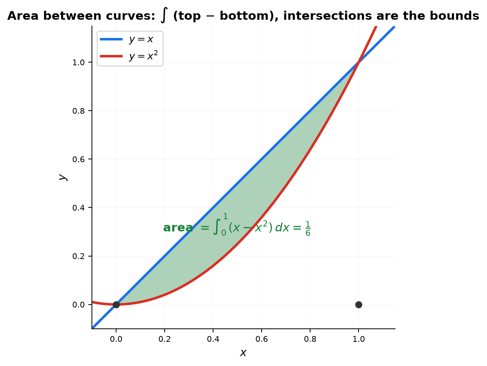

> **Key principle**: Area = $\int_a^b$ [top − bottom]. Always find intersections first.

---

## Example 2: Area in Polar Coordinates — Rotational Symmetry (🔗 12C3)

When a region has radial symmetry, polar integration simplifies everything.

$A = \displaystyle \frac{1}{2}\int_{\theta_1}^{\theta_2} r^2\,d\theta$.

**One petal of $r = \sin(2\theta)$** (4-petal rose): A petal forms when $r \ge 0$, i.e., $\sin(2\theta) \ge 0 \to \theta \in [0, \pi/2]$.

$A_{\text{petal}} = \frac{1}{2}\int_0^{\pi/2} \sin^2(2\theta)\,d\theta = \frac{1}{2}\int_0^{\pi/2} \frac{1-\cos(4\theta)}{2}\,d\theta = \frac{1}{4}\left[\theta - \frac{\sin(4\theta)}{4}\right]_0^{\pi/2} = \frac{\pi}{8}$.

> **Why polar?** $r=\sin(2\theta)$ is a single trig function in polar. In Cartesian: $(x^2+y^2)^{3/2} = 2xy$. Choose the coordinate system matching the symmetry.

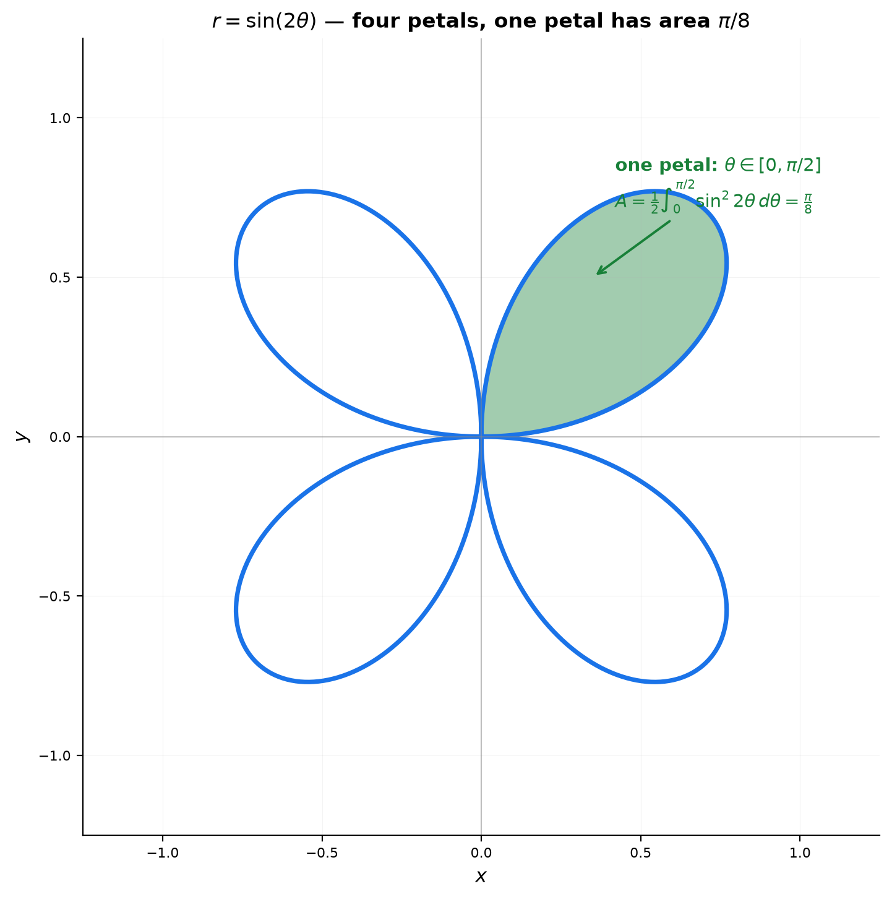

---

## Example 3: Area via Parametric Curves (🔗 12C2)

For a parametric curve $(x(t), y(t))$, area under the curve:

$A = \displaystyle \int_{t_1}^{t_2} y(t)\,x'(t)\,dt$.

**Area of ellipse** $\frac{x^2}{a^2} + \frac{y^2}{b^2} = 1$:
Parametrize: $x = a\cos t$, $y = b\sin t$, $t \in [0, 2\pi]$, upper half $t \in [0, \pi]$.

$x'(t) = -a\sin t$.
$A_{\text{upper}} = \int_0^\pi (b\sin t)(-a\sin t)\,dt = -ab\int_0^\pi \sin^2 t\,dt = -ab \cdot \frac{\pi}{2}$.

Taking absolute value: $A_{\text{total}} = 2 \cdot \frac{ab\pi}{2} = \pi ab$. ✓ (When $a=b=R$, gives $\pi R^2$.)

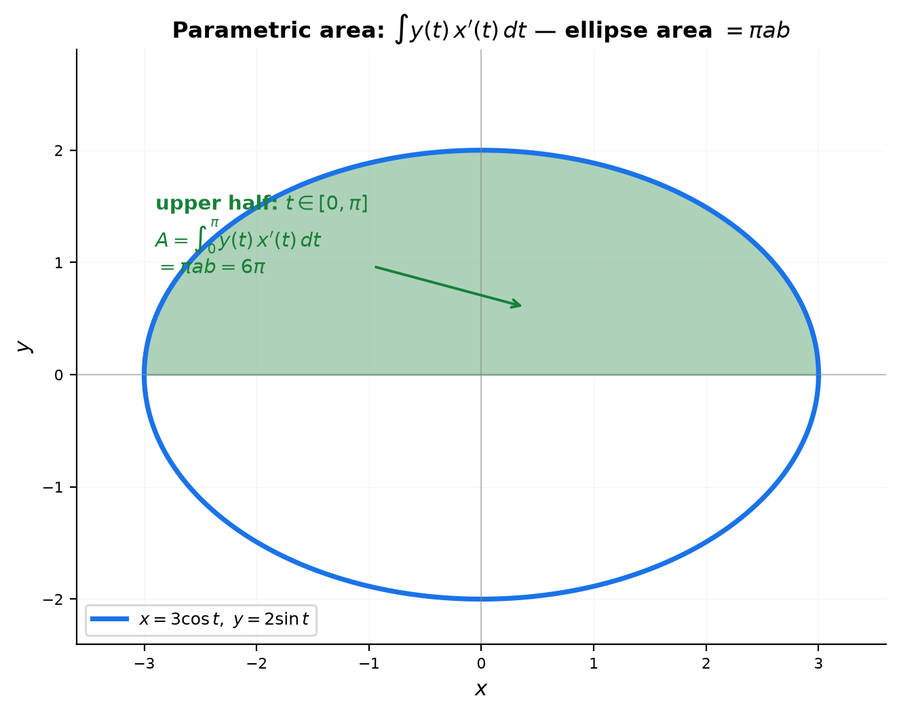

---

## Example 4: Triangle Area via Cross Product — 3D Geometry (🔗 9C, 12A2)

Triangle with vertices $A, B, C$ in 3D: $A = \frac{1}{2}|\vec{AB} \times \vec{AC}|$.

**Example**: $A(1,0,2)$, $B(4,1,6)$, $C(2,5,0)$.
$\vec{AB} = (3, 1, 4)$, $\vec{AC} = (1, 5, -2)$.
$\vec{AB} \times \vec{AC} = (-22, 10, 14)$, $|\vec{AB} \times \vec{AC}| = \sqrt{780} = 2\sqrt{195}$.
$A = \sqrt{195}$.

> **Key insight**: For shapes with straight edges (triangles, parallelograms), geometry alone gives the area — no integration needed. The cross product is the 3D version of "base × height." But when boundaries are curved, integration becomes essential — that's what the rest of this session is about.

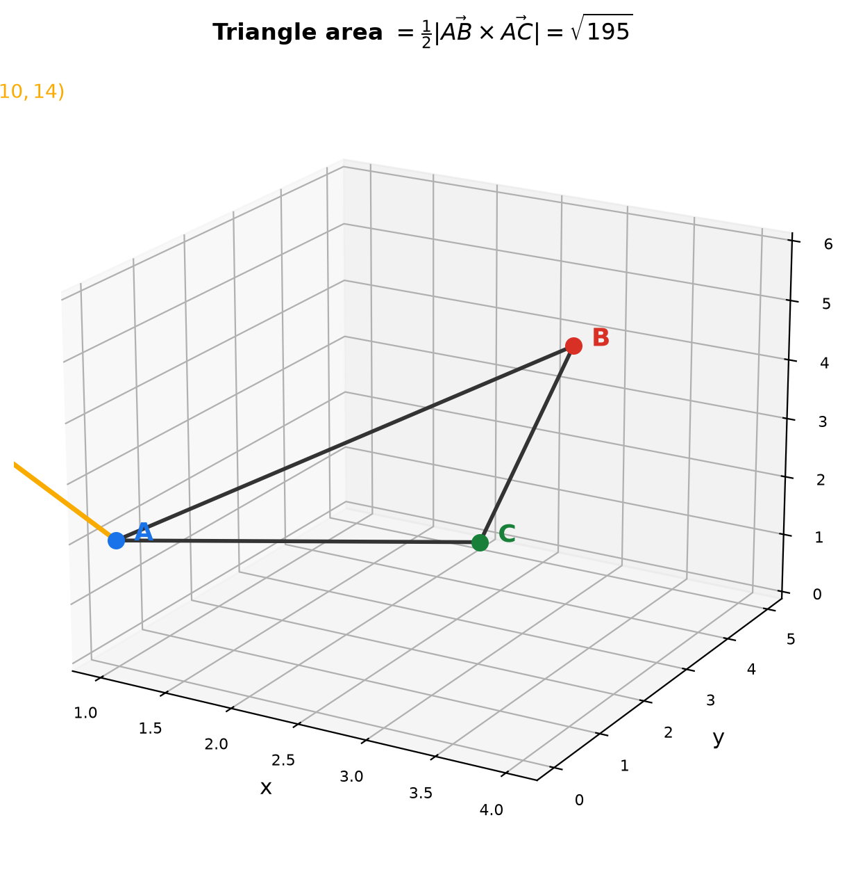

---

## Example 5: Area Between Inverse Curves — Reflection Symmetry (🔗 12C1)

Area between $y=e^x$ and $y=\ln x$ on $[0,1]$. These are inverses — reflections across $y=x$.

On $[0,1]$: $e^x \ge 0$ and $\ln x \le 0$, so $e^x$ is above $\ln x$.

$A = \int_0^1 (e^x - \ln x)\,dx$. Antiderivative: $\int e^x dx = e^x$, $\int \ln x\,dx = x\ln x - x$.

So $F(x) = e^x - x\ln x + x$. Evaluate:
- At $x=1$: $F(1) = e^1 - 1\cdot 0 + 1 = e + 1$.
- At $x \to 0^+$: $e^0 = 1$, $\lim_{x\to 0^+}x\ln x = 0$, so $F(0^+) = 1 - 0 + 0 = 1$.

$A = (e+1) - 1 = e$.

> **Geometric note**: Since $e^x$ and $\ln x$ are reflections of each other across $y=x$, the area between them on $[0,1]$ equals the area between $\ln x$ and the line $y=x$, plus the area between $e^x$ and $y=x$ — a symmetry that can simplify some calculations.

![Lens between e^x and ln x on [0,1]: area = e](graphs/0808/17A/17a-inverse-curves.png)

---

## Part B: Volumes of Revolution

> **The Slicing Principle (2D → 3D)**: Every volume method slices the solid into thin pieces and sums them. The method is decided by the slice direction:
> - **Slice ⟂ rotation axis** → the slice is a **disk** (region touches the axis) or a **washer** (hole). Integrate along the axis: $V=\pi\int R^2\,d\ell$ or $\pi\int(R^2-r^2)\,d\ell$.
> - **Slice ∥ rotation axis** → the slice is a **cylindrical shell**. Integrate perpendicular to the axis: $V=2\pi\int(\text{radius})(\text{height})\,d\ell$.
> - **No rotation** → general cross-sections: $V = \int A(\text{position})\,d(\text{position})$.
>
> **"Axis ⟂ slice → disk/washer; axis ∥ slice → shell"** is the entire decision. Every example below is the same idea in a different coordinate — and each method has a $dx$ version and a $dy$ version.

**Disk — the slice touches the axis (no hole):**

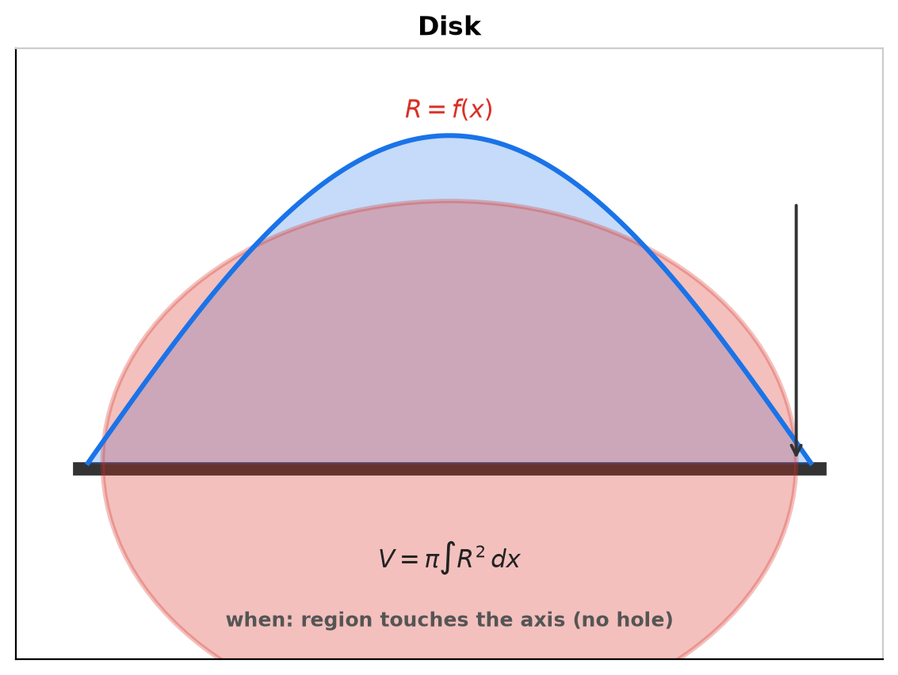

**Washer — the axis sits outside the region (a hole appears):**

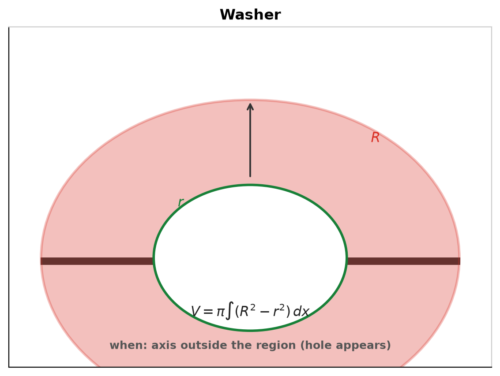

**Shell — the slice runs parallel to the axis:**

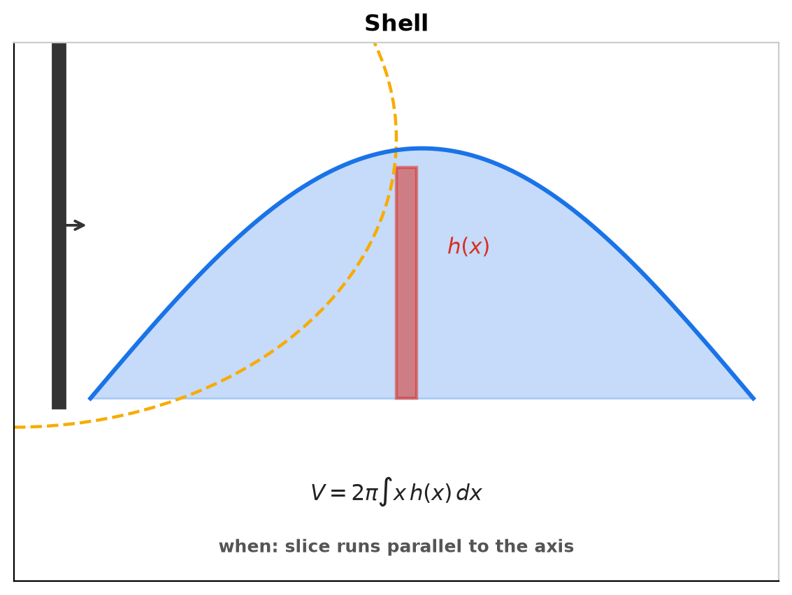

---

## Part B1: The Three Methods — Five Scenes Each

Every method unfolds in the same five scenes. Read each method's five scenes **top to bottom** (each scene is its own image):

- **Scene 1 answers WHEN** — the setup that forces this method (does the region touch the axis? does the slice run ⟂ or ∥ to it?).
- **Scenes 2–3 answer HOW** — how the solid is sliced and how one slice rotates into the 3D building block.
- **Scenes 4–5 answer WHERE** — where the volume of ONE piece comes from (Scene 4), and where integration accumulates all the pieces (Scene 5).

The three methods use the *same five-scene rhythm*, so you can compare them scene by scene. The formula is never "just there" — it is assembled in Scene 4 and summed in Scene 5.

### Disk Method — Five Scenes ($y=\sqrt{x}$ rotated about the $x$-axis)

**Scene 1 — When: setup.** The region sits **on** the rotation axis. A slice has **no hole** → a solid **disk**.

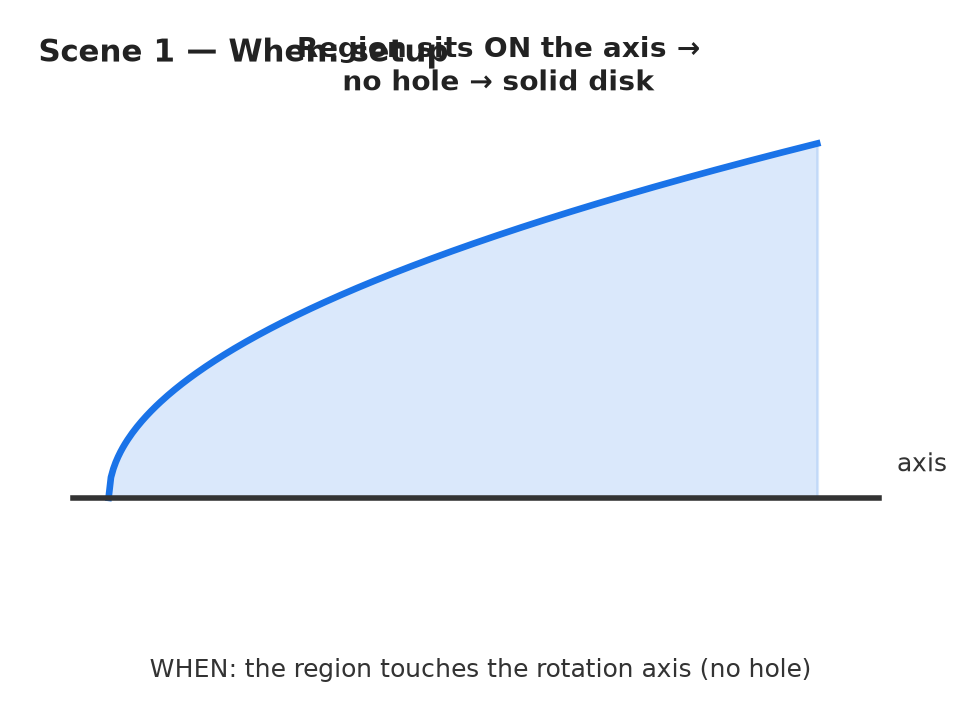

**Scene 2 — How: slice.** Cut a thin strip **⟂ to the axis**: thickness $dx$, height $\sqrt{x}$. Slices ⟂ axis → integrate along the axis.

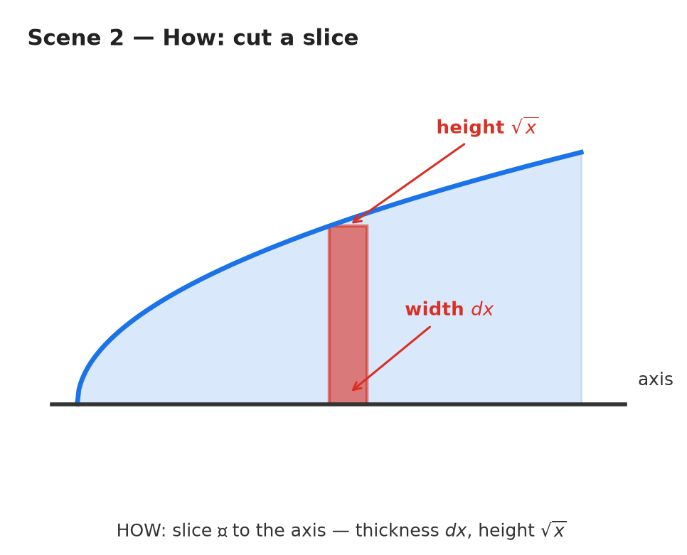

**Scene 3 — How: rotate.** Spin the strip about the axis → a **disk**: radius $R=\sqrt{x}$, thickness $dx$.

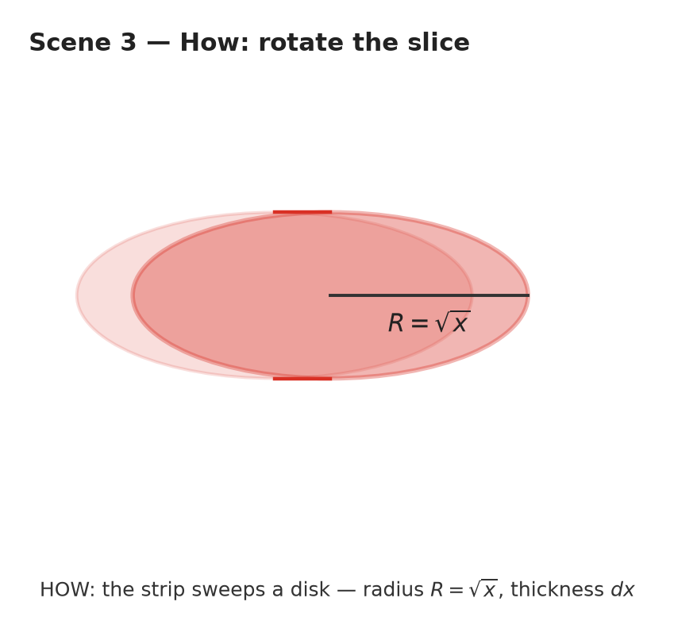

**Scene 4 — Where: one piece.** Disk volume = (face area $\pi R^2$) × (thickness $dx$): $dV=\pi(\sqrt{x})^2\,dx=\pi x\,dx$. The radius is the distance from the axis to the curve.

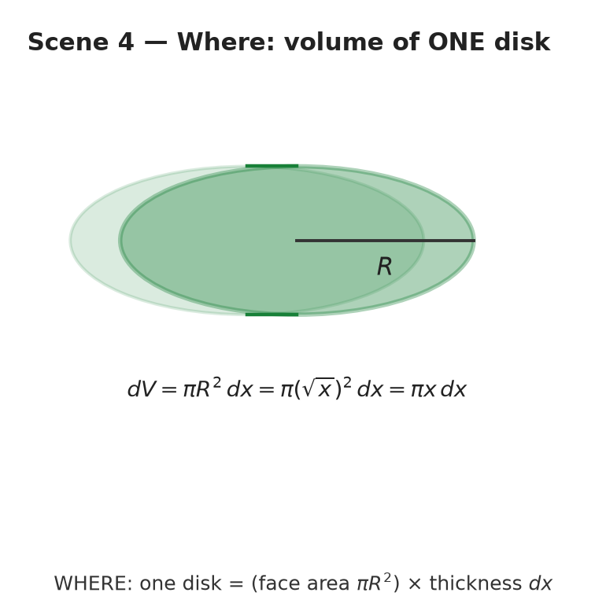

**Scene 5 — Where: accumulate.** Stack every disk from $x=0$ to $x=4$: $V=\pi\int_0^4 x\,dx = 8\pi$.

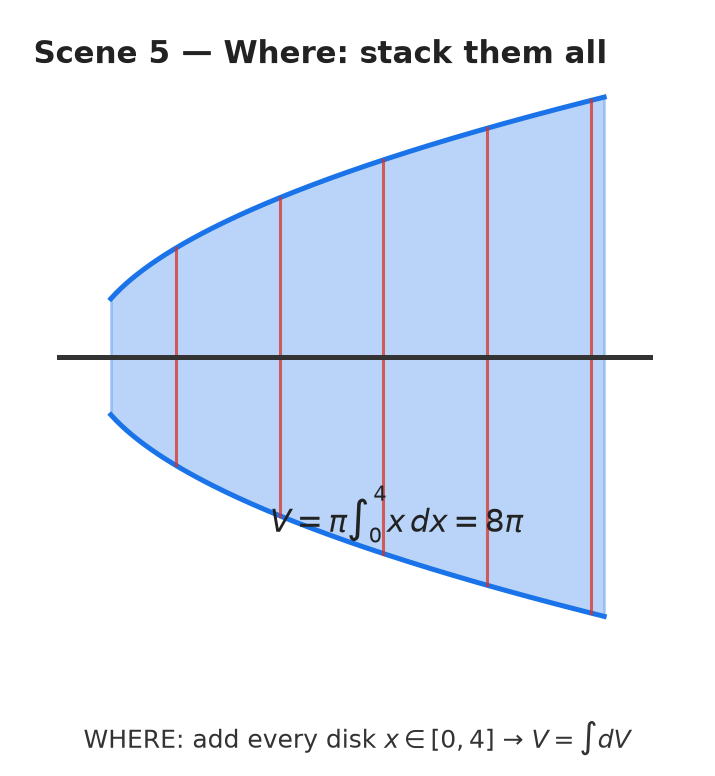

> **The formula, decoded**: $V=\pi\int R^2\,dx$ is nothing but Scene 4 ($dV=\pi R^2\,dx$) summed over Scene 5 ($\int$). Nothing is memorized — the disk's face area $\pi R^2$ and its thickness $dx$ are read straight off the picture.

### Washer Method — Five Scenes (region between $\sqrt{x}$ and $x^2$ rotated about $y=2$)

**Scene 1 — When: setup.** The axis $y=2$ is **outside** the region. The region does NOT touch the axis → spinning leaves a **hole** → a **washer**.

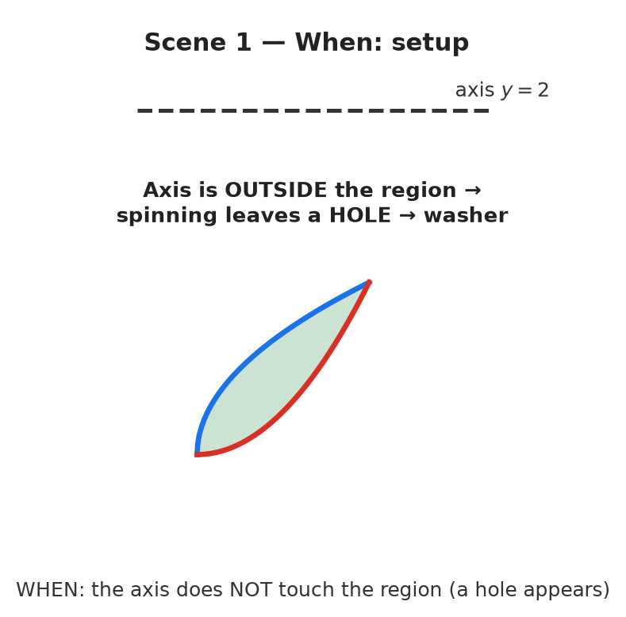

**Scene 2 — How: slice.** Strip **⟂ to the axis** at $x$, from the bottom curve $y=x^2$ up to the top curve $y=\sqrt{x}$; thickness $dx$.

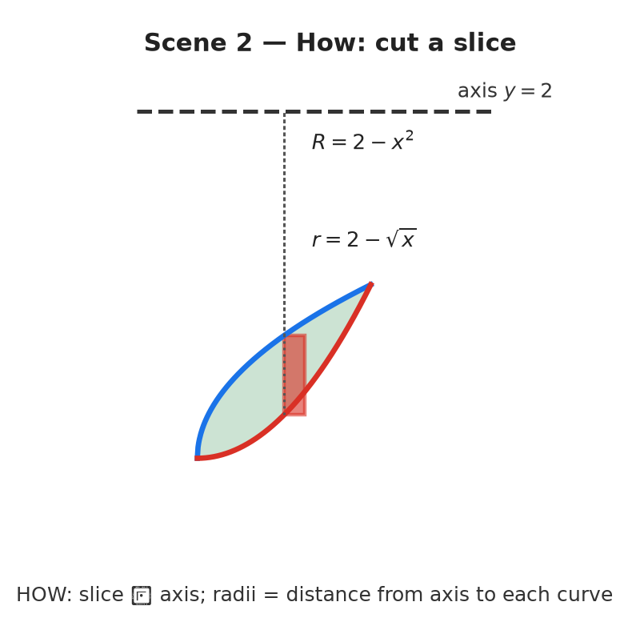

**Scene 3 — How: rotate.** The strip sweeps a **washer (annulus)**. Outer radius $R$ comes from the curve **farthest** from the axis ($2-x^2$); inner radius $r$ from the nearer curve ($2-\sqrt{x}$).

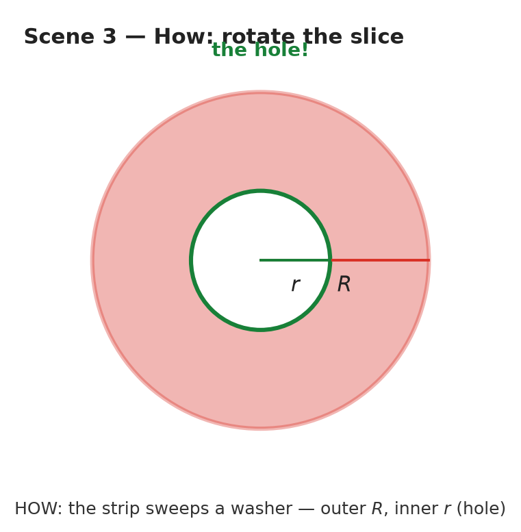

**Scene 4 — Where: one piece.** Washer volume = (annulus area $\pi(R^2-r^2)$) × ($dx$): $dV=\pi[(2-x^2)^2-(2-\sqrt{x})^2]\,dx$. Annulus = big disk minus the hole.

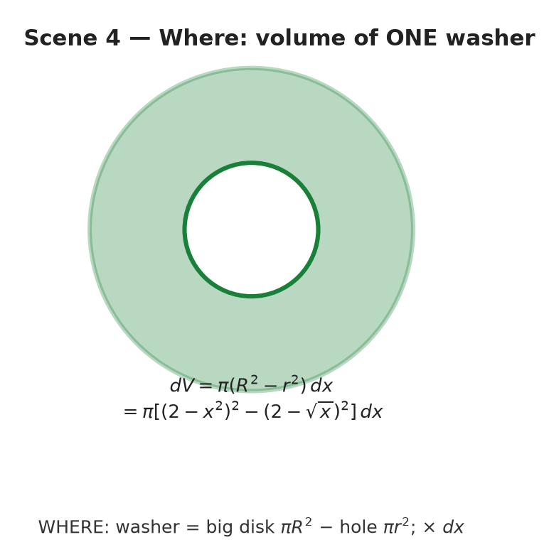

**Scene 5 — Where: accumulate.** $V=\pi\int_0^1[(2-x^2)^2-(2-\sqrt{x})^2]\,dx = \frac{31\pi}{30}$. The side view shows the hollow cross-section.

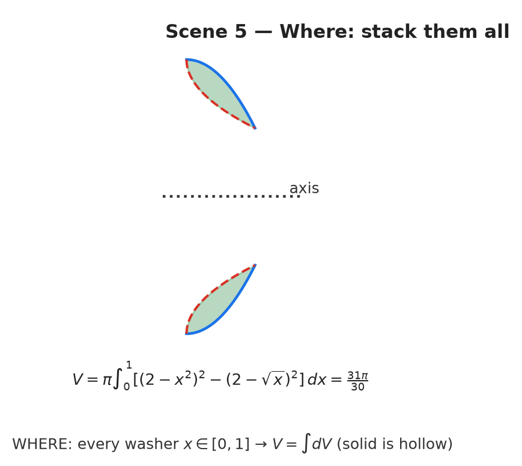

> **When to expect a washer**: the axis is parallel to but **not on the boundary** of the region (a shifted axis, or a gap between region and axis). The disk becomes a washer exactly when a hole appears. The side view in Scene 5 shows the hole — the solid's cross-section is hollow.

### Shell Method — Five Scenes ($y=x^2$ rotated about the $y$-axis)

**Scene 1 — When: setup.** This time the natural strip runs **parallel to the axis** (a vertical strip at $x$). Slices ∥ axis → a **cylindrical shell**.

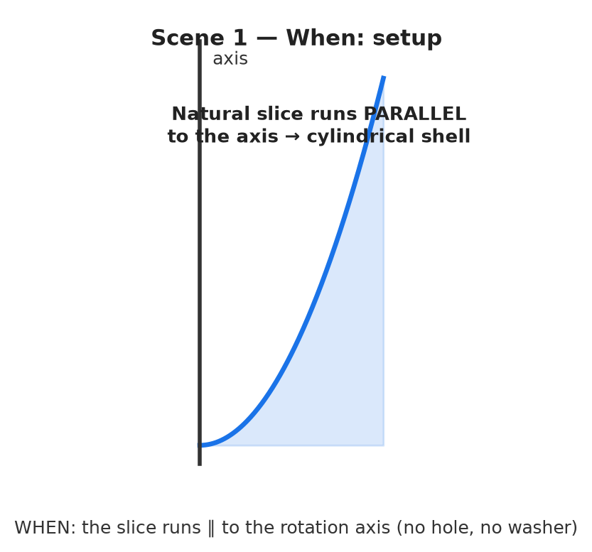

**Scene 2 — How: slice.** Strip at distance $x$ from the axis: height $x^2$, thickness $dx$.

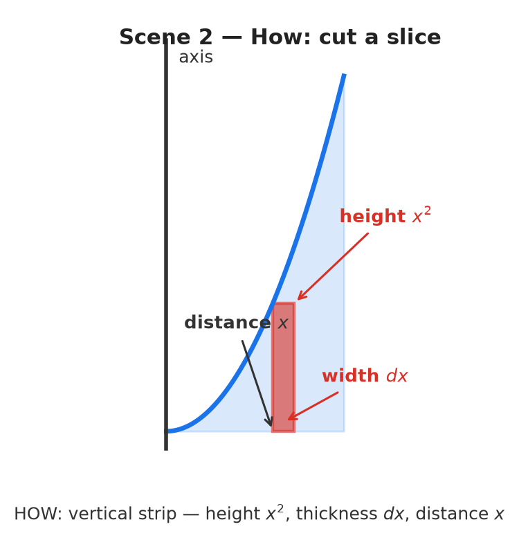

**Scene 3 — How: rotate.** The strip sweeps a **hollow cylinder (shell)**: radius $x$, height $x^2$, thickness $dx$.

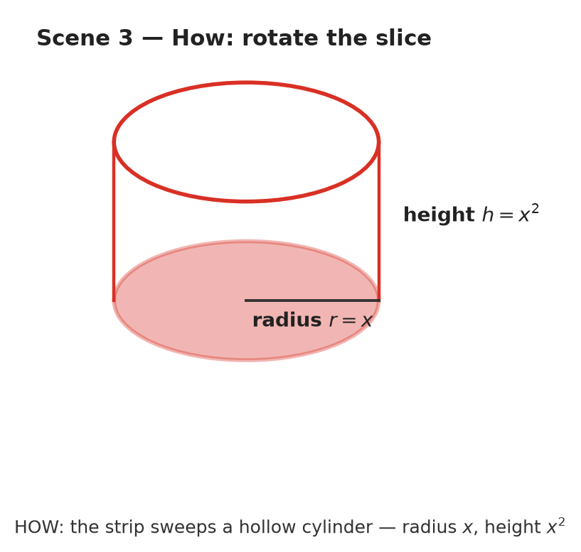

**Scene 4 — Where: one piece.** **Unroll the shell** into a flat rectangle: length = circumference $2\pi x$, height $x^2$, thickness $dx$. So $dV=2\pi x\cdot x^2\,dx$. **THIS is where the $2\pi r$ comes from** — it is the length of the flattened rectangle.

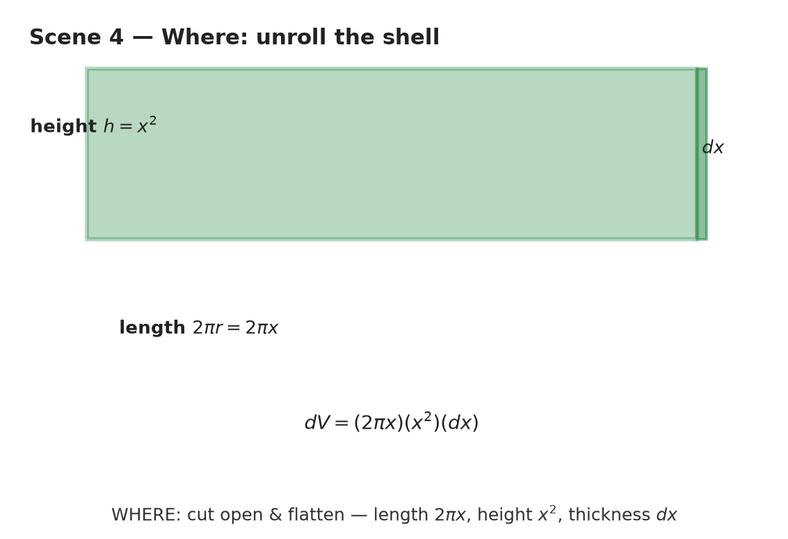

**Scene 5 — Where: accumulate.** $V=2\pi\int_0^2 x\cdot x^2\,dx = 8\pi$.

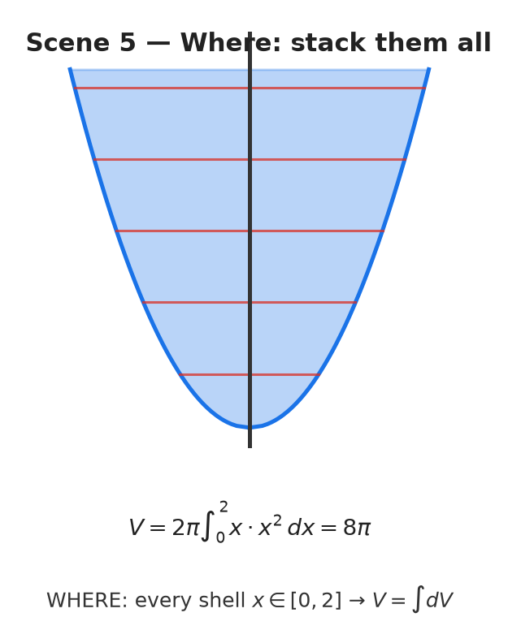

> **Shell = unroll**: the whole method is "cut the cylinder open and flatten it." When the natural slice is parallel to the axis, shell is usually the simpler choice — and Scene 4 shows exactly why the formula has a $2\pi r$ in it.

> **Reading the scenes together**: all three methods are the same film with a different frame at Scenes 3–4. Disk = the slice touches the axis (no hole). Washer = the slice has a hole. Shell = the slice is parallel to the axis and gets unrolled. **Scene 4 is always "volume of ONE piece"; Scene 5 is always "add them all up."** Once you can fill in those two frames, you can rebuild any of the three formulas from scratch.

---

## Example 6: Disk Method — Rotate $y=\sqrt{x}$ About $x$-Axis

*(Follow Disk Scenes 1–5 above: the region sits on the axis → slice ⟂ axis → disk of radius $R=\sqrt{x}$ → $dV=\pi x\,dx$ → integrate.)*

Slice **perpendicular to the $x$-axis**: each slice is a disk of radius $\sqrt{x}$ and thickness $dx$.

$V = \pi \displaystyle \int_0^4 (\sqrt{x})^2\,dx = \pi\int_0^4 x\,dx = 8\pi$.

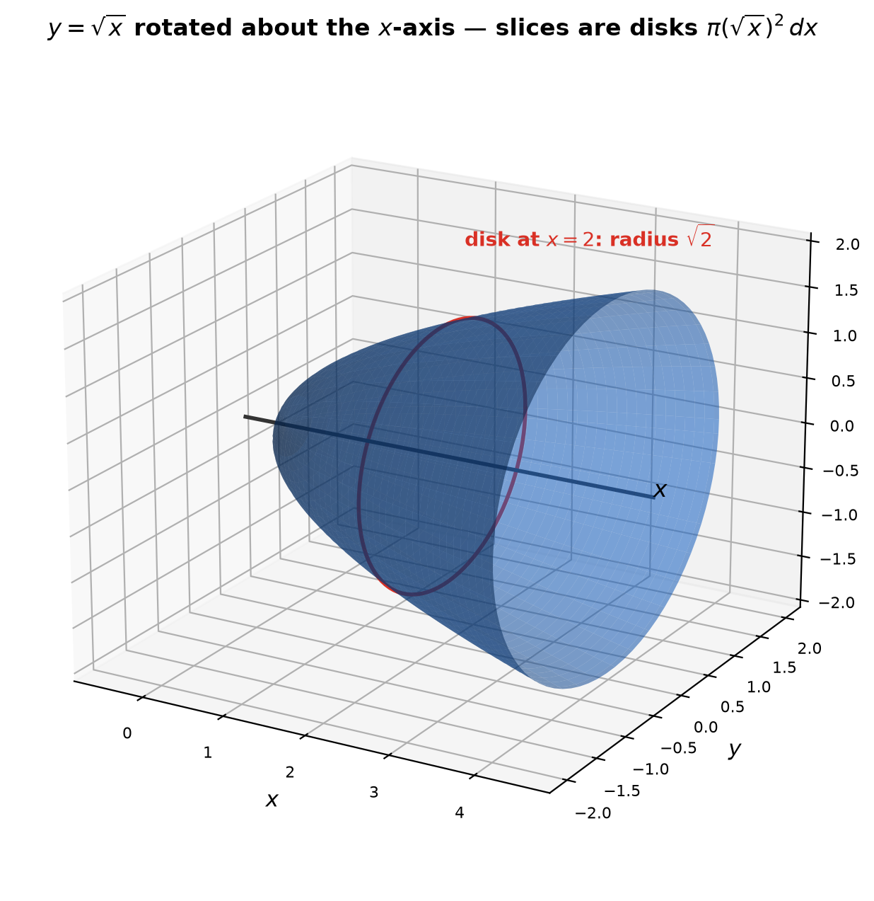

---

## Example 6A: Disk with $dy$ — Rotate $y=x^2$ About the $y$-Axis

The Slicing Principle works in both directions. Rotate $y=x^2$, $x\in[0,2]$, about the $y$-axis — this time slice **perpendicular to the $y$-axis**.

At height $y$, the slice is a disk of radius $x=\sqrt{y}$ (solve $y=x^2$ for $x$) and thickness $dy$:

$V = \pi\int_0^4 (\sqrt{y})^2\,dy = \pi\int_0^4 y\,dy = 8\pi$.

**Cross-check**: Example 9 computes the SAME solid with shells and also gets $8\pi$. The method changed, the solid did not — pick whichever radius/height is simpler.

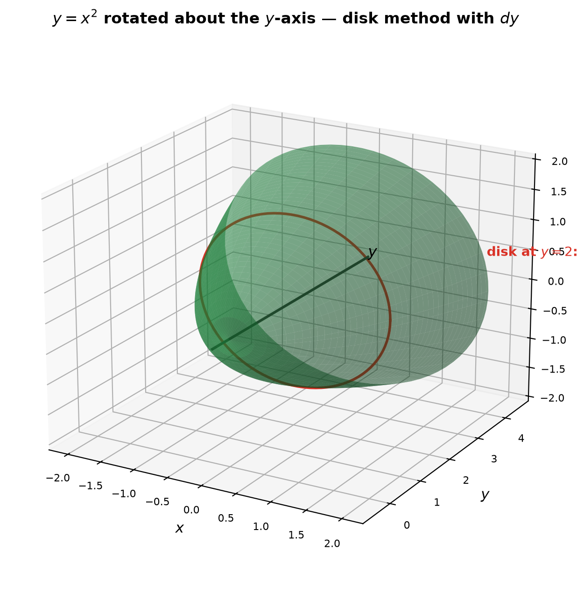

---

## Example 7: Washer with Shifted Axis — Translation Geometry (🔗 12C1)

*(Follow Washer Scenes 1–5 above: the axis sits outside the region → a hole appears → washer; the outer radius comes from the curve farthest from the axis.)*

Region between $y=\sqrt{x}$ and $y=x^2$ on $[0,1]$ rotated about $y=2$.

On $[0,1]$: $\sqrt{x} \ge x^2$, so the region lies **below** both curves relative to $y=2$.

The axis $y=2$ is above the region. The washer's outer edge comes from the curve **farthest** from $y=2$, which is $y=x^2$ (lower → greater distance). The inner edge comes from $y=\sqrt{x}$ (closer to $y=2$).

Outer radius: $R_{\text{outer}} = 2 - x^2$ (distance from $y=2$ down to $y=x^2$).
Inner radius: $R_{\text{inner}} = 2 - \sqrt{x}$ (distance from $y=2$ down to $y=\sqrt{x}$).

> **Rule for shifted axis**: For rotation about $y = c$, the radius to a curve $y = f(x)$ is $|c - f(x)|$. The outer radius uses the curve farther from $c$.

$V = \pi\int_0^1 [(2-x^2)^2 - (2-\sqrt{x})^2]\,dx$
$= \pi\int_0^1 (-4x^2 + x^4 + 4\sqrt{x} - x)\,dx = \pi\left[-\frac{4}{3}x^3 + \frac{x^5}{5} + \frac{8}{3}x^{3/2} - \frac{x^2}{2}\right]_0^1$
$= \pi\left(-\frac{4}{3} + \frac{1}{5} + \frac{8}{3} - \frac{1}{2}\right) = \frac{31\pi}{30}$.

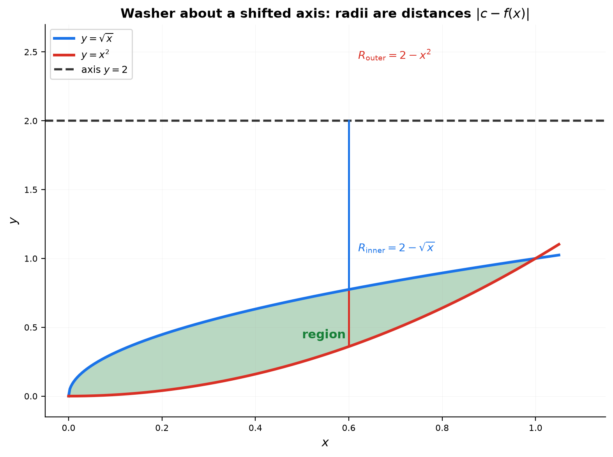

---

## Example 7A: Washer about a Vertical Axis — Rotate About $x=2$

Same region (between $y=\sqrt{x}$ and $y=x^2$ on $[0,1]$), now rotated about the **vertical** axis $x=2$. Slice perpendicular to the $y$-axis.

At height $y\in[0,1]$, the region spans $x$ from $y^2$ (on $y=x^2$) to $\sqrt{y}$ (on $y=\sqrt{x}$). Distances from $x=2$:
- **Outer radius** (farther from the axis): $2 - y^2$ (because $y^2 \le \sqrt{y}$)
- **Inner radius**: $2 - \sqrt{y}$

> **Rule for a vertical shifted axis**: For rotation about $x = c$, the radius to a curve $x = g(y)$ is $|c - g(y)|$. The outer radius comes from the curve farther from $c$.

$V = \pi\int_0^1 [(2-y^2)^2 - (2-\sqrt{y})^2]\,dy = \pi\left[-\frac{4}{3}y^3 + \frac{y^5}{5} + \frac{8}{3}y^{3/2} - \frac{y^2}{2}\right]_0^1 = \frac{31\pi}{30}$.

**Why the same $31\pi/30$ as Example 7?** The region is symmetric under $x \leftrightarrow y$, and both axes sit at coordinate $2$ — rotating about $x=2$ is the mirror of rotating about $y=2$. Verify independently with shells: $V=2\pi\int_0^1(2-x)(\sqrt{x}-x^2)\,dx=\frac{31\pi}{30}$ ✓

---

## Example 8: Sphere Volume Derivation — $V = \frac{4}{3}\pi R^3$ (🔗 9C)

Rotate $y = \sqrt{R^2 - x^2}$ about $x$-axis:

$V = \pi\int_{-R}^R (R^2 - x^2)\,dx = \pi\left[R^2 x - \frac{x^3}{3}\right]_{-R}^R = \frac{4}{3}\pi R^3$. ✓

> In spherical coordinates ($\rho=R$), the same result via triple integral — coordinate symmetry.

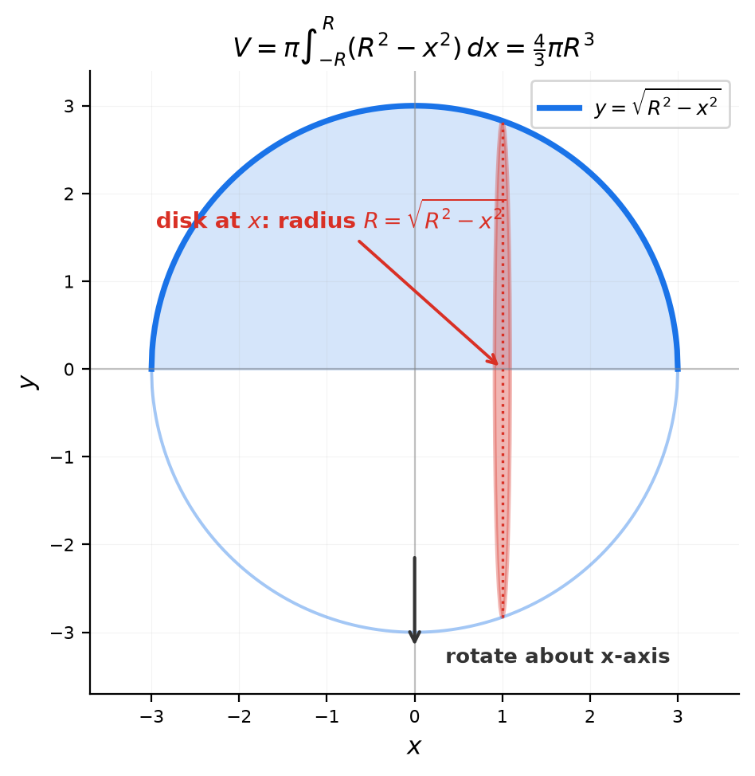

---

## Example 9: Shell Method — Rotate $y=x^2$ About $y$-Axis

*(Follow Shell Scenes 1–5 above: the strip runs parallel to the axis → unroll the shell → $dV=2\pi x\cdot x^2\,dx$ → integrate.)*

$V = 2\pi \displaystyle \int_0^2 x \cdot x^2\,dx = 2\pi\left[\frac{x^4}{4}\right]_0^2 = 8\pi$.

> Each shell: circumference $2\pi x$, height $h(x)=x^2$, thickness $dx$.

---

## Example 9A: Shell with $dy$ — Rotate $y=x^2$ About the $x$-Axis

The shell version also has a second direction. Rotate the SAME region ($y=x^2$, $x\in[0,2]$) about the **$x$-axis**, slicing **parallel to the axis** (horizontal strips).

At height $y\in[0,4]$, the horizontal strip spans $x$ from $\sqrt{y}$ to $2$ (the region reaches $x=2$). It sweeps a shell of:
- radius $y$ (distance from the $x$-axis),
- height $2-\sqrt{y}$,
- thickness $dy$.

$V = 2\pi\int_0^4 y\,(2-\sqrt{y})\,dy = 2\pi\left[y^2 - \frac{2}{5}y^{5/2}\right]_0^4 = 2\pi\left(16 - \frac{64}{5}\right) = \frac{32\pi}{5}$.

**Cross-check with disks**: $V=\pi\int_0^2(x^2)^2\,dx = \pi\cdot\frac{32}{5}$ — same solid, same answer ✓

> **Pattern to remember**: rotation about a horizontal axis → $dx$-disks or $dy$-shells; rotation about a vertical axis → $dy$-disks or $dx$-shells.

---

## Which Method? — The Two-Question Decision

**Q1 — Slice direction**: perpendicular to the axis → disk/washer (integrate along the axis); parallel to the axis → shell (integrate perpendicular to the axis).

**Q2 — Which integral is simpler?** Pick the method whose radius and height have the easiest expressions. When both apply, compute both to **cross-check** — every pair above agreed ($8\pi$, $8\pi$, $31\pi/30$, $32\pi/5$).

| Rotation axis | ⟂-slice (disk/washer) | ∥-slice (shell) |
|:---|:---|:---|
| $x$-axis ($y=0$) | disk with $dx$: Ex 6, 8 | shell with $dy$: Ex 9A |
| $y$-axis ($x=0$) | disk with $dy$: Ex 6A | shell with $dx$: Ex 9 |
| horizontal $y=c$ | washer with $dx$: Ex 7 | shell with $dy$ |
| vertical $x=c$ | washer with $dy$: Ex 7A | shell with $dx$ |

---

## Example 10: Volume of a Torus — Rotation + Translation (🔗 12C1, 12C2)

Rotate circle $(x-R)^2 + y^2 = r^2$ ($R > r$) about $y$-axis.

**Shell method**: $h(x) = 2\sqrt{r^2 - (x-R)^2}$, $x \in [R-r, R+r]$.
$V = 2\pi\int_{R-r}^{R+r} x \cdot 2\sqrt{r^2-(x-R)^2}\,dx$.

Sub $u = x-R$: $V = 4\pi\int_{-r}^r (u+R)\sqrt{r^2-u^2}\,du = 4\pi R \cdot \frac{\pi r^2}{2} = 2\pi^2 R r^2$.

> **Pappus's Centroid Theorem**: $V = (\text{area}) \times (\text{distance centroid travels}) = (\pi r^2) \times (2\pi R) = 2\pi^2 R r^2$.

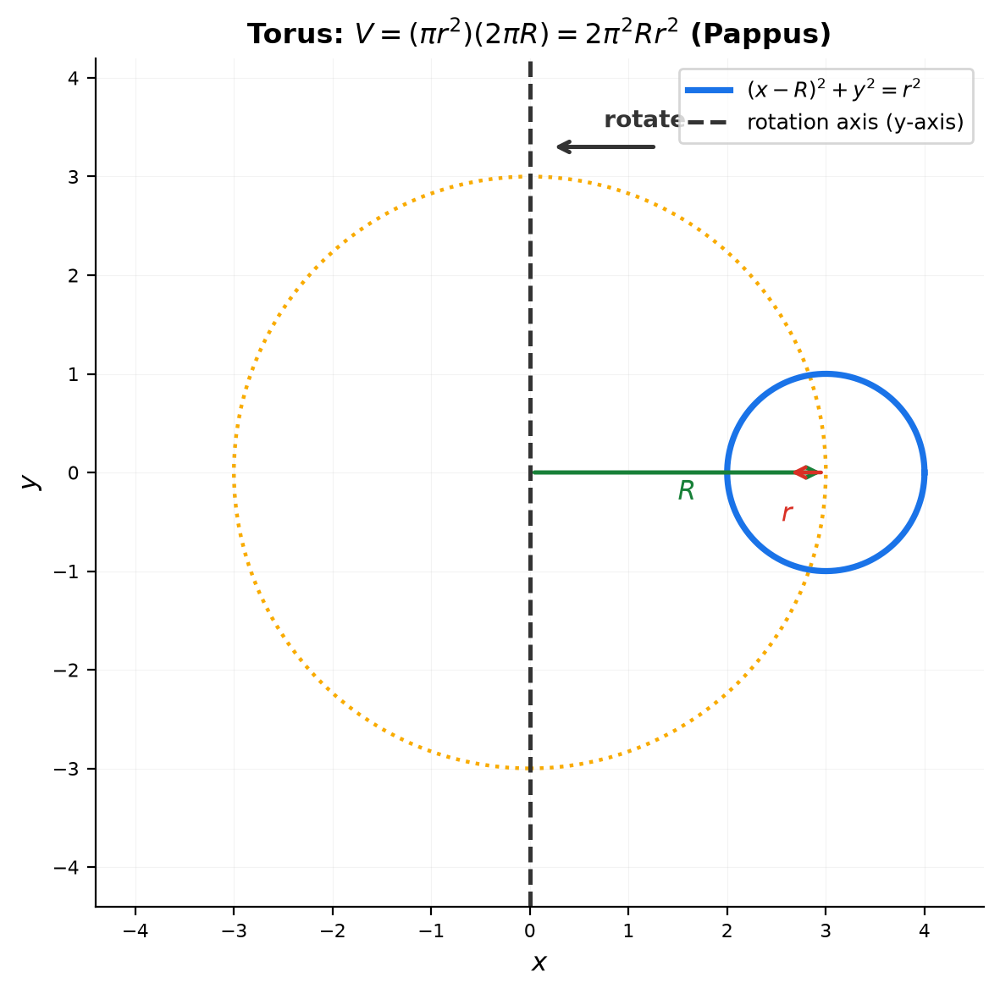

---

## Example 11: Volume via Cross-Sections — General Shapes

> **Reading the notation**: "cross-sections ⟂ $y$-axis" means **cut at a fixed height $y$** (a horizontal slice). In general: ⟂ $x$-axis = vertical slices at fixed $x$; ⟂ $y$-axis = horizontal slices at fixed $y$. The slice area $A(y)$ is then integrated over the position.

Base: region bounded by $y=x^2$ and $y=1$. Cross-sections ⟂ $y$-axis are equilateral triangles. At height $y$: base width $=2\sqrt{y}$, side $s=2\sqrt{y}$, triangle area $= \frac{\sqrt{3}}{4}s^2 = \sqrt{3}y$.

$V = \int_0^1 \sqrt{3}y\,dy = \frac{\sqrt{3}}{2}$.

> The disk method is the special case where cross-sections are circles. Any shape works: $V = \int A(y)\,dy$.

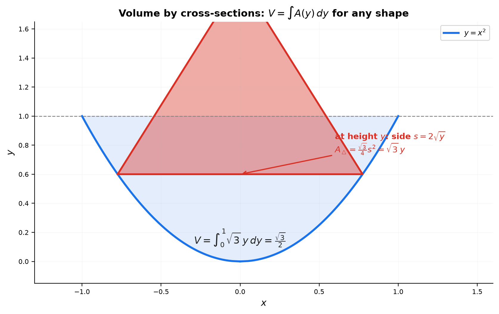

---

## Example 12: Area Scaling Under Linear Transformations

A linear transformation stretches space uniformly. The factor by which it scales area is called the **determinant**: for $M = \begin{pmatrix} a & b \\ c & d \end{pmatrix}$, every region's area is multiplied by $|\det(M)| = |ad-bc|$.

**Example**: The triangle under $y=2x$ on $[0,1]$ has area $1$. After applying $M = \begin{pmatrix} 3 & 0 \\ 0 & 2 \end{pmatrix}$ (stretch $x$ by 3, $y$ by 2), the triangle's area becomes $1 \cdot |3 \cdot 2 - 0| = 6$.

> This is why the substitution rule ($u$-sub) has a "$du = g'(x)dx$" factor — it's the 1D version of the same area-scaling principle.

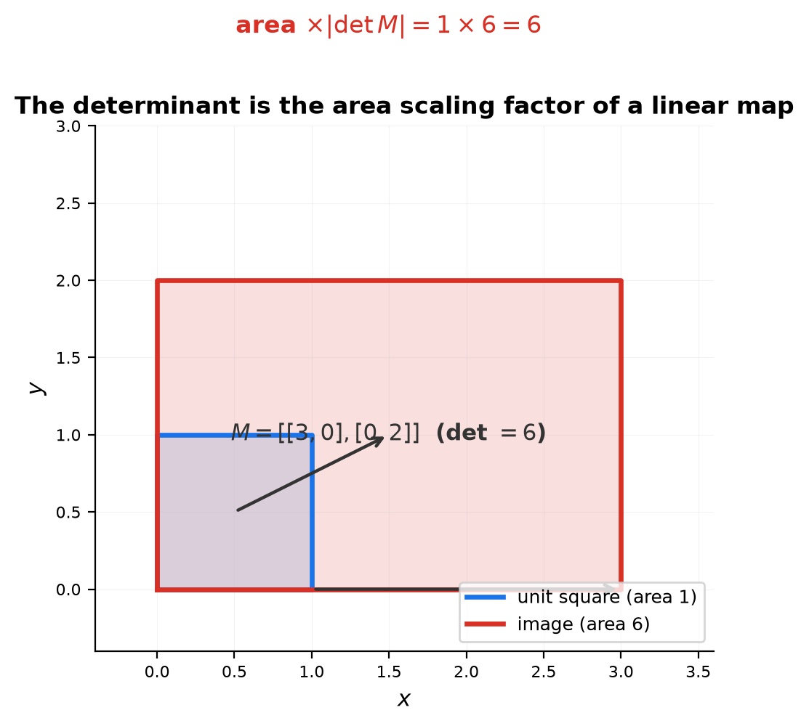

---

## Common Mistakes

### Mistake 1: Integrating with guessed bounds — find intersections first

**Wrong**: "The area between $y=x$ and $y=x^2$ is $\int_0^2 (x-x^2)\,dx$."

**Why wrong**: The curves cross at $x=0$ and $x=1$, not at a guessed bound. Wrong bounds give a wrong (even negative) area.

**Right**: Solve $f(x)=g(x)$ first. The intersections ARE the bounds.

### Mistake 2: Disk method when the axis doesn't touch the region

**Wrong**: Rotating the region between $y=\sqrt{x}$ and $y=x^2$ about $y=2$ with a single disk $\pi\int (2-\sqrt{x})^2\,dx$.

**Why wrong**: The axis $y=2$ is OUTSIDE the region, so the solid has a hole. A single disk overfills it.

**Right**: Use the washer method $\pi\int (R_{\text{outer}}^2 - R_{\text{inner}}^2)\,dx$.

### Mistake 3: Wrong radius for a shifted axis

**Wrong**: Using $f(x)$ as the radius when rotating about $y=c$.

**Why wrong**: The radius is the distance from the axis to the curve: $|c-f(x)|$, not $f(x)$.

**Right**: For rotation about $y=c$, the radius to curve $y=f(x)$ is $|c-f(x)|$. The outer radius comes from the farther curve.

### Mistake 4: Negative parametric area

**Wrong**: Reporting $\int_0^\pi (b\sin t)(-a\sin t)\,dt = -\frac{ab\pi}{2}$ as the area.

**Why wrong**: $\int y\,x'\,dt$ carries a sign from orientation. Area is always positive.

**Right**: Take the absolute value, or parametrize so $x'(t)\ge 0$.

### Mistake 5: Forgetting the $\frac12$ in polar area

**Wrong**: $A=\int_{\theta_1}^{\theta_2} r^2\,d\theta$.

**Why wrong**: A polar sector has area $\frac12 r^2\Delta\theta$, so the integral carries a $\frac12$.

**Right**: $A=\frac12\int r^2\,d\theta$. Also check where $r\ge 0$ to find the petal bounds.

---

## What We Just Did

```
(1) Area between curves. Polar area = ½∫r²dθ. Parametric area = ∫y(t)x'(t)dt.
(2) Triangle area via cross product: ½|AB × AC| — no integration needed.
(3) Slicing Principle: ⟂ axis → disk/washer; ∥ axis → shell.
    Every method has a dx and a dy version — cross-check them.
    Shifted axis → radius = |c − f|, outer from the farther curve.
    Five-scene flow per method: WHEN (setup) → HOW (slice, rotate)
    → WHERE (one piece dV) → WHERE (integrate all pieces).
    Disk = no hole; Washer = hole; Shell = parallel slice, unrolled.
(4) Torus: shell method + symmetry → 2π²Rr² (Pappus shortcut).
(5) Cross-sections: V = ∫A(y)dy for any shape. "⟂ y-axis" = fixed-height slice.
(6) Determinant = area scaling factor for matrix transformations.
```

---

## Practice 1

Find the area enclosed by the cardioid $r = 1 + \cos\theta$. ($\theta \in [0, 2\pi]$, use symmetry.)

<details>
<summary>💡 Hint</summary>

$A = \frac12\int_0^{2\pi}(1+\cos\theta)^2 d\theta$. Expand and use $\int_0^{2\pi}\cos^2\theta\,d\theta = \pi$ (the $\cos\theta$ term integrates to 0).

</details>

→ Solutions: [Solutions](solutions/17A-solutions.md#practice-1)

---

## Practice 2

Find the area of the triangle with vertices $P(2,1,3)$, $Q(5,4,7)$, $R(1,6,2)$ using the cross product. Verify using Heron's formula.

<details>
<summary>💡 Hint</summary>

Take $\vec{PQ}$ and $\vec{PR}$, then $A = \frac12|\vec{PQ}\times\vec{PR}|$. For Heron, first find the three side lengths $|\vec{PQ}|$, $|\vec{QR}|$, $|\vec{PR}|$.

</details>

→ Solutions: [Solutions](solutions/17A-solutions.md#practice-2)

---

## Practice 3 (🔗 12C2)

Ellipse $\frac{x^2}{9} + \frac{y^2}{4} = 1$ rotated about $x$-axis. Find the ellipsoid volume.

<details>
<summary>💡 Hint</summary>

At each $x \in [-3,3]$ the cross-section is a disk of radius $y = 2\sqrt{1-x^2/9}$. So $V = \pi\int_{-3}^3 y^2\,dx$.

</details>

→ Solutions: [Solutions](solutions/17A-solutions.md#practice-3)

---

## Practice 4

Region between $y = x^2$ and $y = \sqrt{x}$ rotated about $y = -1$. Washer method.

<details>
<summary>💡 Hint</summary>

The axis $y=-1$ lies below the region, so a washer forms. Radii are distances from $y=-1$: outer $\sqrt{x}+1$ (top curve), inner $x^2+1$ (bottom curve).

</details>

→ Solutions: [Solutions](solutions/17A-solutions.md#practice-4)

---

## Practice 5: Real Battle (🔗 12C3)

Archimedean spiral $r = \theta$ from $\theta = 0$ to $2\pi$ encloses a region with the $x$-axis. Find its area using polar integration.

<details>
<summary>💡 Hint</summary>

$A = \frac12\int_0^{2\pi} r^2\,d\theta = \frac12\int_0^{2\pi}\theta^2\,d\theta$.

</details>

→ Solutions: [Solutions](solutions/17A-solutions.md#practice-5)

---

## Practice 6: Real Battle (🔗 12C1, 12A2)

Unit square $[0,1] \times [0,1]$ transformed by $M = \begin{pmatrix} 3 & 1 \\ 1 & 2 \end{pmatrix}$. Find the parallelogram area (a) via determinant, (b) via cross product of adjacent sides.

<details>
<summary>💡 Hint</summary>

$\det M = 3\cdot2 - 1\cdot1 = 5$. For (b), apply $M$ to the two unit side vectors $(1,0)$ and $(0,1)$ and take the cross product.

</details>

→ Solutions: [Solutions](solutions/17A-solutions.md#practice-6)

---

## Practice 7: Real Battle (🔗 12C2, 9C)

Torus: $R=5$, $r=2$. (a) Volume via shell method. (b) Verify via Pappus: $V = (\text{area}) \times (\text{distance centroid travels})$.

<details>
<summary>💡 Hint</summary>

Shell: $V = 4\pi\int_{-2}^{2}(u+5)\sqrt{4-u^2}\,du$ (sub $u=x-5$); the $u\sqrt{\cdot}$ term vanishes by oddness. Pappus: $V = \pi r^2 \cdot 2\pi R$.

</details>

→ Solutions: [Solutions](solutions/17A-solutions.md#practice-7)

---

## Basic Drills

**D1.** Find the area between $y = 2x$ and $y = x^2$ from $x=0$ to $x=2$.

**D2.** Rotate $y = 3x$, $x \in [0,2]$ about the $x$-axis. (Disk method.)

**D3.** Region between $y = x$ and $y = x^3$ on $[0,1]$ rotated about $x$-axis. (Washer.)

**D4.** Rotate $y = x^2$, $x \in [0,3]$ about the $y$-axis. (Shell method.)

**D5.** Find the area of one petal of the polar rose $r = \sin(3\theta)$.

<details>
<summary>💡 Hint</summary>

One petal forms where $\sin(3\theta) \ge 0$, i.e. $\theta \in [0, \pi/3]$. Then $A = \frac12\int_0^{\pi/3}\sin^2(3\theta)\,d\theta$.

</details>

**D6.** Region under $y = e^x$, $x \in [0, \ln 3]$, rotated about $x$-axis. Find the volume.

**D7.** Region between $y = 4$ and $y = x^2$ rotated about $y = 4$. (Disk with shifted axis.)

<details>
<summary>💡 Hint</summary>

The axis $y=4$ is the top boundary of the region — the region touches the axis, so there is **no hole**. Radius $= 4 - x^2$, $x \in [-2,2]$.

</details>

**D8.** (🔗 12A2) Parallelogram with vertices $(0,0)$, $(3,1)$, $(4,5)$, $(1,4)$. Find area (a) via cross product, (b) via determinant of side-vector matrix.

**D9.** (🔗 9C) Cone of radius $R$, height $H$: rotate $y = \frac{R}{H}x$, $x \in [0,H]$ about $x$-axis. Derive $V = \frac{1}{3}\pi R^2 H$.

**D10.** (🔗 12C3) Find the area inside both $r = 1$ and $r = 2\sin\theta$. Sketch first.

<details>
<summary>💡 Hint</summary>

The circles meet where $2\sin\theta = 1 \to \theta = \pi/6$. For $\theta \in [0,\pi/6]$ the inner boundary is $r=2\sin\theta$; for $\theta \in [\pi/6,\pi/2]$ it is $r=1$. Use symmetry about the $y$-axis.

</details>

**D11.** Base: region bounded by $y = \sqrt{x}$, $y=0$, $x=4$. Cross-sections ⟂ $x$-axis are squares. Find the volume.

<details>
<summary>💡 Hint</summary>

At position $x$, the square's side equals the region's height $\sqrt{x}$, so $A(x) = (\sqrt{x})^2 = x$.

</details>

**D12.** (🔗 12C2) Use parametric area formula to verify ellipse area = $\pi ab$.

**D13.** (🔗 12C1) Region under $y = \sin x$, $x \in [0,\pi]$, rotated about $y = 1$. Set up (do not evaluate) the volume integral.

<details>
<summary>💡 Hint</summary>

The axis $y=1$ is above the region, so use a washer: outer radius $1$ (reaching $y=0$), inner radius $1-\sin x$ (reaching $y=\sin x$).

</details>

**D14.** Sphere of radius $R$ with cylindrical hole of radius $r$ drilled through center (napkin ring). Set up the washer integral. The result depends only on the ring's height, not on $R$ and $r$ individually — verify.

<details>
<summary>💡 Hint</summary>

At height $x$, the washer has outer radius $\sqrt{R^2-x^2}$ and inner radius $r$, over $x \in [-\sqrt{R^2-r^2},\,\sqrt{R^2-r^2}]$. The ring height is $h = 2\sqrt{R^2-r^2}$.

</details>

**D15.** (🔗 12A2, 12C1) Parabola $y = x^2$ on $[0,2]$ rotated about $y$-axis. Show shell method and disk method ($x=\sqrt{y}$) give the same volume.

**D16.** Rotate $y = \sqrt{x}$, $x \in [0,4]$, about the $y$-axis using the disk method with $dy$.

<details>
<summary>💡 Hint</summary>

Solve $y = \sqrt{x}$ for $x$: $x = y^2$, with $y \in [0,2]$. Each disk has radius $x = y^2$.

</details>

**D17.** Region between $y=x^2$ and $y=\sqrt{x}$ on $[0,1]$ rotated about $x=1$. Set up the washer integral with $dy$.

<details>
<summary>💡 Hint</summary>

At height $y$, the region spans $x$ from $y^2$ to $\sqrt{y}$. Distances from $x=1$: outer $1-y^2$, inner $1-\sqrt{y}$.

</details>

**D18.** Region under $y=x$, $x \in [0,2]$, rotated about the $x$-axis using shells with $dy$.

<details>
<summary>💡 Hint</summary>

At height $y$, the horizontal strip spans $x$ from $y$ to $2$: shell radius $y$, height $2-y$.

</details>

> Solutions: [Solutions](solutions/17A-solutions.md#basic-drill)

---

## Advanced Drills

**A1.** Find the area common to the two circles $r = 2\cos\theta$ and $r = 2\sin\theta$.

<details>
<summary>💡 Hint</summary>

The circles meet where $2\cos\theta = 2\sin\theta \to \theta = \pi/4$. On $[0,\pi/4]$ the inner boundary is $r=2\sin\theta$; double by symmetry.

</details>

**A2.** (🔗 9C) Derive the volume of a spherical cap of height $h$ from a sphere of radius $R$: $V = \frac{\pi h^2}{3}(3R - h)$.

<details>
<summary>💡 Hint</summary>

Rotate $y = \sqrt{R^2-x^2}$ over the cap's $x$-range $[R-h, R]$ using disks of radius $y$.

</details>

**A3.** (🔗 12C2) Cycloid $x = a(t - \sin t)$, $y = a(1 - \cos t)$, $t \in [0, 2\pi]$, encloses a region with the $x$-axis. Find its area.

<details>
<summary>💡 Hint</summary>

Area $= \int_0^{2\pi} y(t)\,x'(t)\,dt$ with $x' = a(1-\cos t)$. Simplify $1-\cos t = 2\sin^2(t/2)$. (Answer: $3\pi a^2$ — 3× the generating circle's area!)

</details>

**A4.** (🔗 12C1, 12A2) Transformation $T(\vec{x}) = M\vec{x}$ with $M = \begin{pmatrix} 2 & 1 \\ 0 & 3 \end{pmatrix}$ applied to the region bounded by $y=x^2$ and $y=x$ on $[0,1]$. Find the transformed area (a) via $\det(M)$, (b) via direct integration of transformed boundaries.

<details>
<summary>💡 Hint</summary>

$\det M = 6$. The original area is $\int_0^1 (x-x^2)\,dx = 1/6$, so the image has area $6 \cdot \tfrac16 = 1$.

</details>

**A5.** (🔗 12C2) Lemniscate $r^2 = a^2\cos(2\theta)$ (figure-eight). Find its total area.

<details>
<summary>💡 Hint</summary>

One loop has $\cos(2\theta) \ge 0$, i.e. $\theta \in [-\pi/4, \pi/4]$. Total $= 2 \cdot \frac12\int_{-\pi/4}^{\pi/4} a^2\cos(2\theta)\,d\theta$.

</details>

**A6.** Torus via washer method (cut horizontally). Show the integral simplifies to $2\pi^2 R r^2$.

<details>
<summary>💡 Hint</summary>

At height $y$, the washer has outer radius $R+\sqrt{r^2-y^2}$ and inner radius $R-\sqrt{r^2-y^2}$ over $y \in [-r,r]$. The difference of squares kills the $R$-linear terms.

</details>

**A7.** Region inside cardioid $r = 1 + \cos\theta$ and outside $r = 1$ rotated about $x$-axis. Set up the polar volume integral.

<details>
<summary>💡 Hint</summary>

The curves meet where $1+\cos\theta = 1 \to \theta = \pm\pi/2$. At angle $\theta$, a washer's radii come from $y = r\sin\theta$ for each boundary curve.

</details>

**A8.** (🔗 12B2, 9C) Base: infinite region under $y = e^{-x}$ for $x \ge 0$. Cross-sections ⟂ $x$-axis are semicircles. Find the volume.

<details>
<summary>💡 Hint</summary>

At position $x$ the semicircle has diameter $e^{-x}$, so radius $e^{-x}/2$ and area $\frac12\pi(e^{-x}/2)^2$. Integrate to $\infty$.

</details>

**A9.** Unit disk $x^2 + y^2 \le 1$ transformed by $M = \begin{pmatrix} 4 & 2 \\ 1 & 3 \end{pmatrix}$. The image is an ellipse. Find its area.

<details>
<summary>💡 Hint</summary>

The image's area is $|\det M|$ times the original disk's area: $\det M = 12-2 = 10$, so the answer is $10\pi$.

</details>

**A10.** (🔗 12C3) Solid bounded by paraboloid $z = x^2 + y^2$ and plane $z = 4$. Find volume via (a) disk method in $z$, (b) cylindrical coordinates.

<details>
<summary>💡 Hint</summary>

At height $z$, the cross-section is a disk of radius $\sqrt{z}$: $V = \pi\int_0^4 z\,dz$. In cylindrical coordinates, integrate $r$ from $0$ to $\sqrt{z}$.

</details>

> Solutions: [Solutions](solutions/17A-solutions.md#advanced-drill)

---

## How to Read These Symbols

| Symbol | Reads as | Meaning |
|:---:|:---:|------|
| $\int_a^b [f-g]\,dx$ | "integral a to b of f minus g d x" | area between curves — top minus bottom |
| $\frac{1}{2}\int r^2\,d\theta$ | "one-half integral r squared d theta" | area in polar coordinates |
| $\int y(t)\,x'(t)\,dt$ | "integral y of t times x prime of t d t" | area under parametric curve |
| $\frac{1}{2}|\vec{AB}\times\vec{AC}|$ | "half magnitude AB cross AC" | triangle area via cross product |
| $\det(M)$ | "determinant of M" | area (2D) / volume (3D) scaling factor |
| $2\pi^2 R r^2$ | "two pi squared R r squared" | volume of a torus |
| $\pi ab$ | "pi a b" | area of an ellipse |

---

## Today's Procedure

```
Step 1: Area = ∫(top − bottom). Find intersections first.
Step 2: Polar area = ½∫r²dθ. Use symmetry.
Step 3: Parametric area = ∫y(t)x'(t)dt. Sign = orientation.
Step 4: Cross product area = ½|AB × AC| for triangles.
Step 5: Pick the slice: ⟂ axis → disk/washer (π∫R², π∫(R²−r²)); ∥ axis → shell (2π∫radius·height).
Step 5b: Run the five scenes in your head: When (hole? parallel?)
    → Slice → Rotate → dV of one piece → ∫ over all pieces.
Step 6: Horizontal axis → dx-disks or dy-shells. Vertical axis → dy-disks or dx-shells.
Step 7: Shifted axis → radius = |c − f|. Outer from the farther curve.
Step 8: Cross-sections: V = ∫A(s)ds. "⟂ y-axis" = fixed-height slice.
```

---

## Terminology

| What we call it | Math term | Notation / Explanation |
|:-----------------:|:-----------------:|:----------------------:|
| top minus bottom | area between curves | $\int_a^b [f(x)-g(x)]\,dx$ |
| polar area | polar area | $\frac12\int r^2\,d\theta$ |
| parametric area | parametric area | $\int y(t)\,x'(t)\,dt$ |
| cross product area | vector area | $\frac12|\vec{AB}\times\vec{AC}|$ |
| disk method | disk method | $V=\pi\int R^2\,dx$ |
| washer method | washer method | $V=\pi\int (R^2-r^2)\,dx$ |
| shell method | cylindrical shells | $V=2\pi\int x\cdot h(x)\,dx$ |
| cross-section volume | volume by cross-sections | $V=\int A(s)\,ds$ |
| area scaling factor | determinant | $|\det M|$ |
| Pappus's theorem | Pappus's centroid theorem | $V=(\text{area})\times(\text{distance centroid travels})$ |
