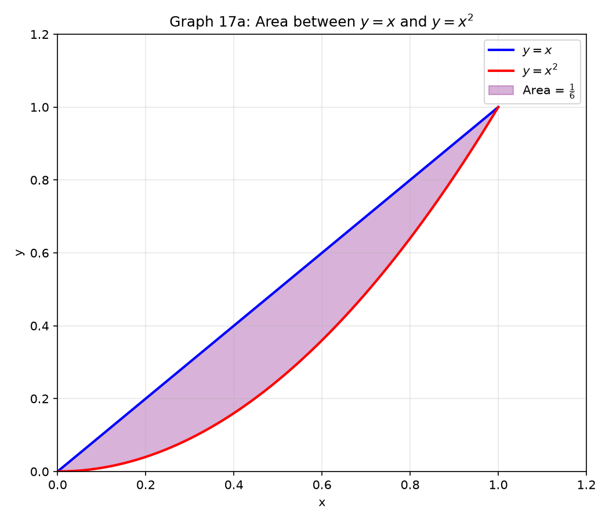
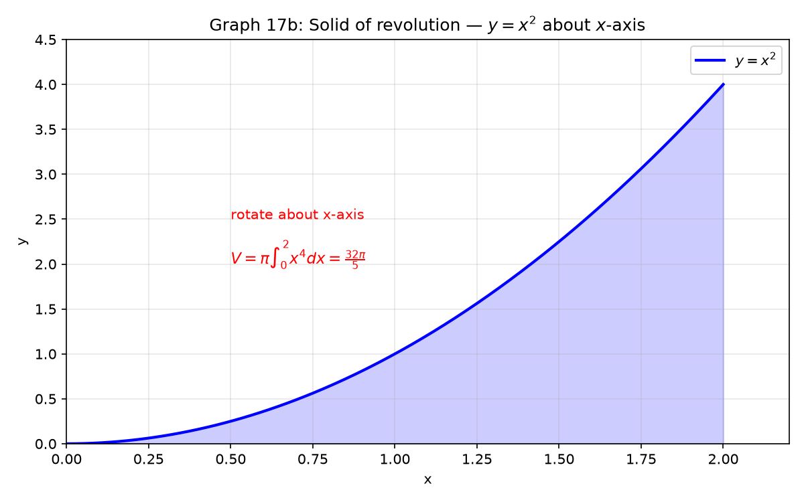

# Session 17A: Area and Volume — Between Curves and Solids of Revolution

**Phase 2 — Classical Techniques | 75 min**

*Prerequisites: 16A (FTC & u-sub), 09B (2D geometry), 09C (3D geometry)*

---

## Part A: Area Between Curves

---

## Example 1: Area Between $y=f(x)$ and $x$-Axis

$A = \displaystyle \int_a^b |f(x)|\,dx$. Split where $f$ crosses the axis.

$\displaystyle \int_0^{2\pi} \sin x\,dx = 0$ (cancels!). Area = $\displaystyle 2\int_0^\pi \sin x\,dx = 4$.



---

## Example 2: Area Between Two Curves

$A = \displaystyle \int_a^b [f(x)-g(x)]\,dx$ where $f$ is the **top** function, $g$ is the **bottom**.

Find the area between $y=x^2$ and $y=x$ from $x=0$ to $x=1$.

$A = \displaystyle \int_0^1 (x-x^2)\,dx = \left[\frac{x^2}{2}-\frac{x^3}{3}\right]_0^1 = \frac{1}{2}-\frac{1}{3} = \frac{1}{6}$.

---

## Example 3: Trigonometric Area

Area between $y=\sin x$ and $y=\cos x$ from $x=0$ to $x=\pi/2$.

Curves cross at $x=\pi/4$. $\sin x > \cos x$ on $[\pi/4,\pi/2]$, $\cos x > \sin x$ on $[0,\pi/4]$.

$A = \displaystyle \int_0^{\pi/4}(\cos x-\sin x)dx + \int_{\pi/4}^{\pi/2}(\sin x-\cos x)dx = 2\sqrt{2}-2$.

---

## Example 4: Exponential and Log Area

Area between $y=e^x$ and $y=\ln x$? These are inverses — the region is symmetric. Use the fact that $e^x$ and $\ln x$ are reflections across $y=x$.

---

## Example 5: Area with Respect to $y$-Axis

$A = \displaystyle \int_c^d [\text{right}(y)-\text{left}(y)]\,dy$.

Area between $x=y^2$ and $x=y+2$. Solve: $y^2=y+2 \to y^2-y-2=0 \to y=-1,2$.
$A = \displaystyle \int_{-1}^2 [(y+2)-y^2]\,dy = \left[\frac{y^2}{2}+2y-\frac{y^3}{3}\right]_{-1}^2 = \frac{9}{2}$.

---

## Part B: Volumes of Revolution

---

## Example 6: Disk Method — Rotate About $x$-Axis

$V = \pi \displaystyle \int_a^b [R(x)]^2\,dx$.

Rotate $y=\sqrt{x}$ about $x$-axis from $x=0$ to $x=4$:
$V = \pi\int_0^4 (\sqrt{x})^2\,dx = \pi\int_0^4 x\,dx = \pi\left[\frac{x^2}{2}\right]_0^4 = 8\pi$.



---

## Example 7: Washer Method — Hollow Solid

$V = \pi \displaystyle \int_a^b [(R_{\text{outer}})^2 - (R_{\text{inner}})^2]\,dx$.

Region between $y=x$ and $y=x^2$ rotated about $x$-axis:
$V = \pi\int_0^1 (x^2-(x^2)^2)dx = \pi\int_0^1 (x^2-x^4)dx = \frac{2\pi}{15}$.

---

## Example 8: Trig and Exponential Solids

Rotate $y=\sin x$, $x\in[0,\pi]$ about $x$-axis:
$V = \pi\int_0^\pi \sin^2 x\,dx = \pi\int_0^\pi \frac{1-\cos2x}{2}dx = \frac{\pi^2}{2}$.

---

## Example 9: Shell Method — Rotate About $y$-Axis

$V = 2\pi \displaystyle \int_a^b x\cdot h(x)\,dx$ where $h(x)$ is the height of the shell.

Rotate $y=x^2$, $x\in[0,2]$ about $y$-axis:
$V = 2\pi\int_0^2 x\cdot x^2\,dx = 2\pi\int_0^2 x^3\,dx = 2\pi\left[\frac{x^4}{4}\right]_0^2 = 8\pi$.

---

## What We Just Did

```
(1) Area between curves: top - bottom, integrated over intersection interval.
(2) Disk method (x-axis): V = π∫R² dx.
(3) Washer method (hollow): V = π∫(R_outer² - R_inner²) dx.
(4) Shell method (y-axis): V = 2π∫x·h(x) dx.
```

---

## Practice 1

Find the area between $y=x^2$ and $y=2x+3$.

→ Solutions: [Solutions](solutions/17A-solutions.md#practice-1)

---

## Practice 2

Rotate $y=x^2$, $x\in[0,1]$ about $x$-axis. Find the volume (disk method).

→ Solutions: [Solutions](solutions/17A-solutions.md#practice-2)

---

## Practice 3

Region between $y=x^2$ and $y=x$ rotated about $x$-axis. Washer method.

→ Solutions: [Solutions](solutions/17A-solutions.md#practice-3)

---

## Practice 4

$y=x^2$, $x\in[0,2]$ rotated about $y$-axis. Shell method.

→ Solutions: [Solutions](solutions/17A-solutions.md#practice-4)

---

## Basic Algebra Drill — Area & Volume (10 Problems)

**D1.** Find area between $y=x$ and $x$-axis from $x=0$ to $x=4$.

**D2.** Find area between $y=x^2$ and $y=4$.

**D3.** Rotate $y=2x$, $x\in[0,3]$ about $x$-axis. Disk method.

**D4.** Rotate $y=\sqrt{x}$, $x\in[0,1]$ about $x$-axis.

**D5.** Region between $y=2$ and $y=x$ from $x=0$ to $x=2$ rotated about $x$-axis. Washer.

**D6.** Rotate $y=x$, $x\in[0,4]$ about $y$-axis. Shell method.

**D7.** Find area between $x=y^2$ and $x=4$ using $y$-integration.

**D8.** Rotate $y=e^x$, $x\in[0,\ln2]$ about $x$-axis.

**D9.** Find area between $y=\sin x$ and $x$-axis from $x=0$ to $x=2\pi$.

**D10.** Rotate region under $y=1/x$, $x\in[1,2]$ about $x$-axis.

> Solutions: [Solutions](solutions/17A-solutions.md#basic-drill)

---

## Advanced Algebra Drill — Area & Volume (10 Problems)

**A1.** Find the area between $y=x^3$ and $y=x$ (all intersection regions).

**A2.** Rotate the circle $x^2+y^2=R^2$ about $x$-axis. Derive the sphere volume formula $V=\frac{4}{3}\pi R^3$.

**A3.** A hole of radius $r$ is drilled through the center of a sphere of radius $R$. Find the remaining volume.

**A4.** Region between $y=\sqrt{x}$ and $y=x^2$ rotated about $y=2$. Washer with shifted axis.

**A5.** Find the volume when $y=\sin x$, $x\in[0,\pi]$ is rotated about $y=-1$.

**A6.** Use shells to find the volume of a cone of radius $R$ and height $H$.

**A7.** The region bounded by $y=x^2$ and $y=4$ is rotated about $x=3$. Shell method.

**A8.** Find the area of the region common to the circles $x^2+y^2=1$ and $(x-1)^2+y^2=1$.

**A9.** Rotate $y=\ln x$, $x\in[1,e]$ about $y$-axis. Shell method.

**A10.** A torus is formed by rotating $(x-R)^2+y^2=r^2$ about $y$-axis. Find its volume.

> Solutions: [Solutions](solutions/17A-solutions.md#advanced-drill)

---

## Today's Procedure

```
Step 1: Area between curves = ∫(top - bottom)dx or ∫(right - left)dy.
Step 2: Disk about x-axis: V = π∫R(x)² dx.
Step 3: Washer (hollow): V = π∫(R² - r²) dx.
Step 4: Shell about y-axis: V = 2π∫x·h(x) dx.
```
