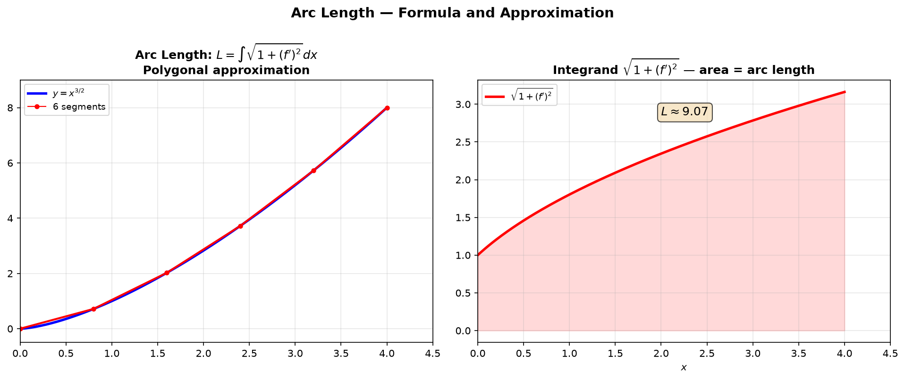
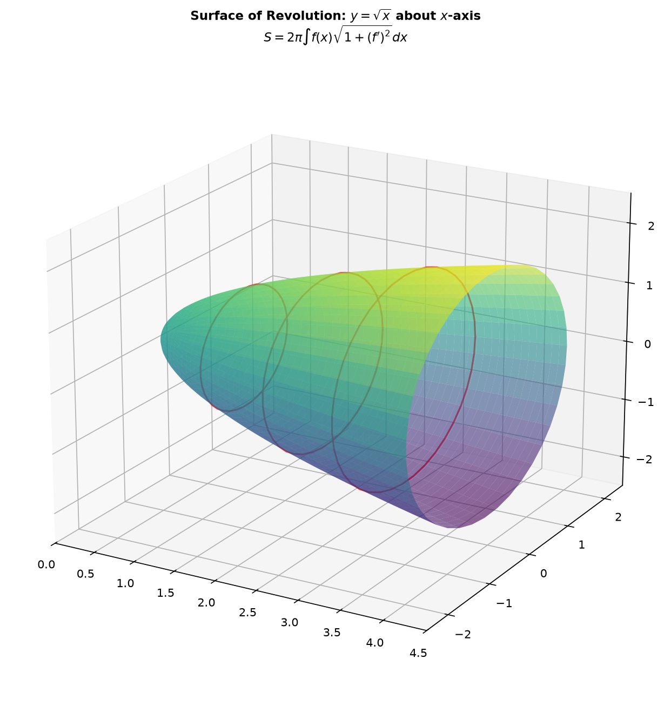
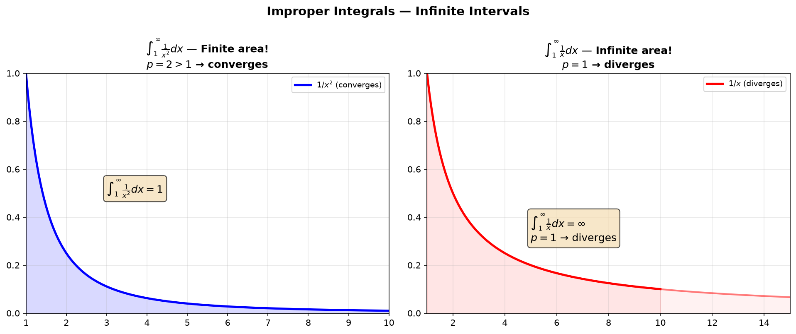
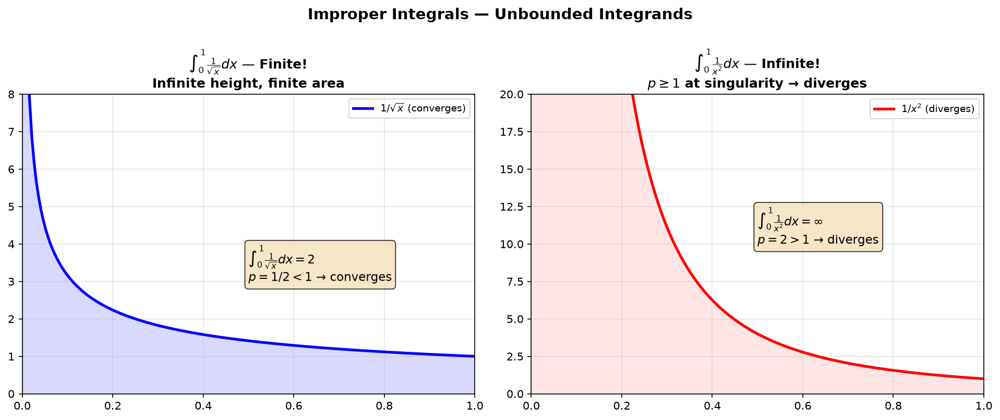
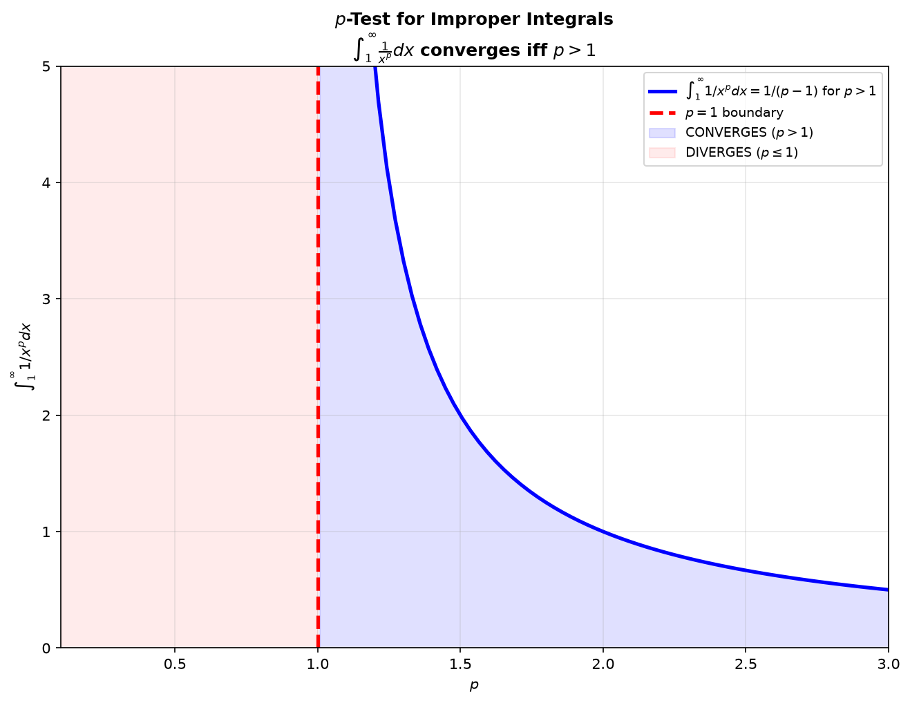
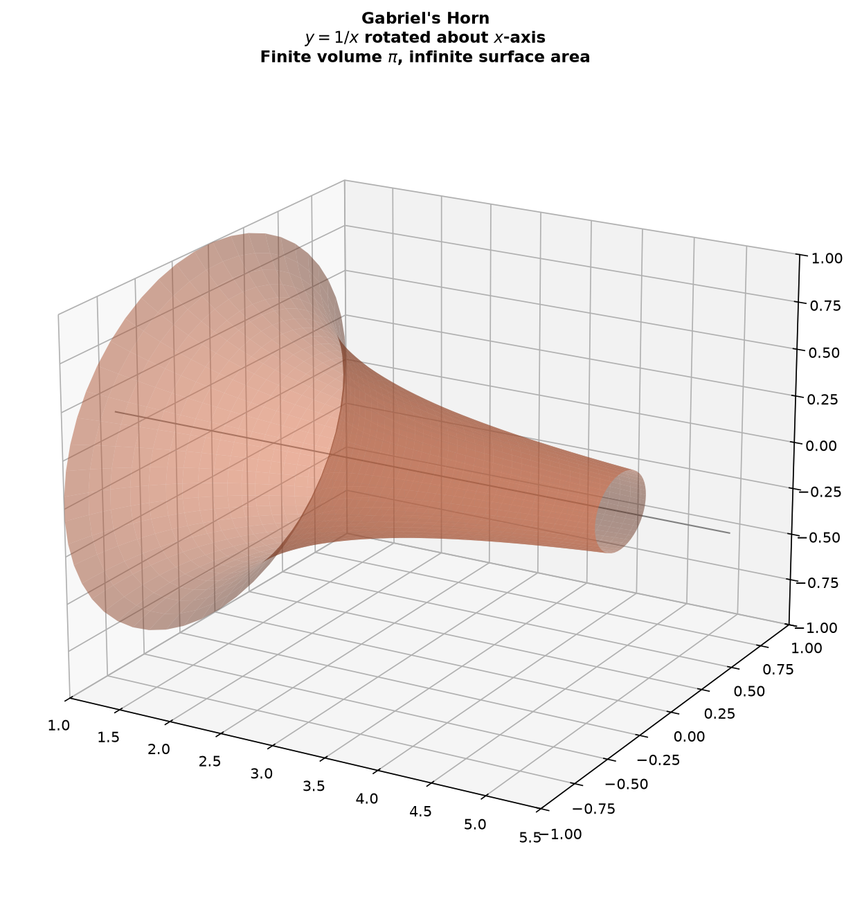

# Session 17B: Arc Length, Surface Area, and Improper Integrals

**Phase 2 — Classical Techniques | 70 min**

*Prerequisites: 17A (area & volume), 16B (advanced integration), 14B (parametric)*

---

## Part A: Arc Length

---

## Example 1: Arc Length Formula

$L = \displaystyle \int_a^b \sqrt{1 + [f'(x)]^2}\,dx$.

Arc length of $y=x^{3/2}$ from $x=0$ to $x=4$:
$f'(x)=\frac{3}{2}\sqrt{x}$, $1+[f']^2 = 1+\frac{9}{4}x$.
$L = \int_0^4 \sqrt{1+\frac{9}{4}x}\,dx$. $u=1+\frac{9}{4}x$, $du=\frac{9}{4}dx$.
$L = \frac{4}{9}\int_1^{10} u^{1/2}du = \frac{8}{27}(10^{3/2}-1) \approx 8.63$.



*Graph 17B-1: Left — $y=x^{3/2}$ with a 6-segment polygonal approximation (red). Each segment length $\Delta L = \sqrt{\Delta x^2 + \Delta y^2}$ approximates the curve. As the number of segments $n\to\infty$, the total approaches the true arc length. Right — The integrand $\sqrt{1+(f')^2} = \sqrt{1+2.25x}$ (shaded). The arc length $L\approx8.63$ is the area under this curve.*

---

## Example 2: Circle Arc Length

A circle of radius $R$: parametrize as $x=R\cos t$, $y=R\sin t$, $t\in[0,2\pi]$.
$L = \int_0^{2\pi}\sqrt{(-R\sin t)^2+(R\cos t)^2}dt = \int_0^{2\pi}R\,dt = 2\pi R$. ✓

---

## Example 3: Logarithmic and Exponential Arc Lengths

$y=\ln(\cos x)$ from $x=0$ to $x=\pi/3$: $y'=-\tan x$, $1+(y')^2=\sec^2 x$.
$L = \int_0^{\pi/3}\sec x\,dx = \ln|\sec x+\tan x|\Big|_0^{\pi/3} = \ln(2+\sqrt{3})$.

---

## Example 4: Parametric Arc Length

$x=f(t), y=g(t)$: $L = \displaystyle \int_{t_1}^{t_2}\sqrt{(dx/dt)^2+(dy/dt)^2}\,dt$.

Cycloid one arch: $x=t-\sin t$, $y=1-\cos t$, $t\in[0,2\pi]$.
$dx/dt=1-\cos t$, $dy/dt=\sin t$.
$(dx/dt)^2+(dy/dt)^2 = 2-2\cos t = 4\sin^2(t/2)$.
$L = \int_0^{2\pi}2\sin(t/2)dt = 8$.

---

## Part B: Surface Area of Revolution

---

## Example 5: Surface Area About $x$-Axis

$S = 2\pi \displaystyle \int_a^b f(x)\sqrt{1+[f'(x)]^2}\,dx$.

Rotate $y=\sqrt{x}$ from $x=0$ to $x=4$: $f'=\frac{1}{2\sqrt{x}}$, $1+(f')^2=1+\frac{1}{4x}=\frac{4x+1}{4x}$.
$S = 2\pi\int_0^4\sqrt{x}\sqrt{\frac{4x+1}{4x}}dx = 2\pi\int_0^4\frac{\sqrt{4x+1}}{2}dx = \pi\int_0^4\sqrt{4x+1}\,dx$.
$u=4x+1$: $S = \pi\cdot\frac{1}{6}(17^{3/2}-1) \approx 36.18$.



*Graph 17B-2: The surface formed by rotating $y=\sqrt{x}$ about the $x$-axis. Red rings highlight individual surface area bands. Each band at position $x$ has radius $y=\sqrt{x}$, slant width $ds=\sqrt{1+(y')^2}\,dx$, and area $dS=2\pi y\cdot ds$.*

---

## Example 6: Surface Area of a Sphere

Rotate $y=\sqrt{R^2-x^2}$, $x\in[-R,R]$ about $x$-axis: $S=4\pi R^2$. ✓

---

## Part C: Improper Integrals

---

## Part C: Improper Integrals

---

## Example 7: Infinite Interval

$\displaystyle \int_1^\infty \frac{1}{x^2}\,dx = \lim_{b\to\infty}\int_1^b x^{-2}dx = \lim_{b\to\infty}\left[-\frac{1}{x}\right]_1^b = \lim_{b\to\infty}(-\frac{1}{b}+1) = 1$. **Converges.**

$\displaystyle \int_1^\infty \frac{1}{x}\,dx = \lim_{b\to\infty}[\ln b - 0] = \infty$. **Diverges.**



*Graph 17B-3: Left — $\int_1^\infty 1/x^2\,dx$ converges (finite area = 1) because $p=2>1$. The tail hugs the axis tightly. Right — $\int_1^\infty 1/x\,dx$ diverges (infinite area) because $p=1$. The tail is too thick to sum to a finite value.*

---

## Example 8: Unbounded Integrand

$\displaystyle \int_0^1 \frac{1}{\sqrt{x}}\,dx = \lim_{a\to0^+}\int_a^1 x^{-1/2}dx = \lim_{a\to0^+}[2\sqrt{x}]_a^1 = 2$. **Converges** (finite area despite infinite height).



*Graph 17B-4: Left — $\int_0^1 1/\sqrt{x}\,dx$ converges ($p=1/2<1$). The area is finite despite the function blowing up at $x=0$. Right — $\int_0^1 1/x^2\,dx$ diverges ($p=2>1$). The singularity is too strong for the area to converge.*

---

## Example 9: The $p$-Test

$\displaystyle \int_1^\infty \frac{1}{x^p}\,dx$ converges if $p>1$, diverges if $p\leq1$.

$\displaystyle \int_0^1 \frac{1}{x^p}\,dx$ converges if $p<1$, diverges if $p\geq1$.



*Graph 17B-5: The $p$-test visualized. For $\int_1^\infty 1/x^p\,dx$, convergence occurs when $p>1$ (blue region, finite value $1/(p-1)$). The boundary at $p=1$ (red dashed) is where convergence tips into divergence. Just above $p=1$, convergence; at $p=1$ or below, divergence.*

---

## Example 10: Exponential and Trig Improper Integrals

$\int_0^\infty e^{-x}\,dx = 1$ (converges). $\int_0^\infty e^{-x}\sin x\,dx = \frac{1}{2}$ (integration by parts + limit).

---

## Example 11: Gabriel's Horn — Finite Volume, Infinite Surface

Rotate $y=1/x$, $x\in[1,\infty)$ about the $x$-axis.

**Volume**: $V = \pi\int_1^\infty (1/x)^2\,dx = \pi\int_1^\infty x^{-2}\,dx = \pi(1) = \pi$ (finite!).

**Surface area**: $S = 2\pi\int_1^\infty (1/x)\sqrt{1+(-1/x^2)^2}\,dx \geq 2\pi\int_1^\infty 1/x\,dx = \infty$ (diverges!).

**Paradox**: You can fill the horn with $\pi$ units of paint, but you can't paint its surface!



*Graph 17B-6: Gabriel's Horn — the surface formed by rotating $y=1/x$ for $x\ge1$ about the $x$-axis. Its volume converges to $\pi$ (you can fill it), but its surface area diverges (you can't paint it). This paradox illustrates the subtle difference between $1/x^2$ (convergent, used for volume) and $1/x$ (divergent, used for surface area).*

---

## What We Just Did

```
(1) Arc length: L = ∫√(1+(dy/dx)²) dx. Parametric: √((dx/dt)²+(dy/dt)²).
(2) Surface area: S = 2π∫f(x)√(1+(f')²) dx (about x-axis).
(3) Improper integrals: replace ∞ or singularity with limit.
(4) p-test: ∫₁∞ 1/x^p converges iff p>1. ∫₀¹ 1/x^p converges iff p<1.
```

---

## Practice 1

Find the arc length of $y=\frac{2}{3}x^{3/2}$ from $x=0$ to $x=3$.

→ Solutions: [Solutions](solutions/17B-solutions.md#practice-1)

---

## Practice 2

Find the surface area when $y=x$, $x\in[0,1]$ is rotated about the $x$-axis.

→ Solutions: [Solutions](solutions/17B-solutions.md#practice-2)

---

## Practice 3

$\displaystyle \int_0^\infty \frac{dx}{x^2+1}$. Improper integral.

→ Solutions: [Solutions](solutions/17B-solutions.md#practice-3)

---

## Practice 4

$\displaystyle \int_0^1 \ln x\,dx$. Improper at $x=0$.

→ Solutions: [Solutions](solutions/17B-solutions.md#practice-4)

---

## Practice 5: Parametric Arc Length (🔗 12C2)

Find the arc length of one arch of the cycloid: $x=t-\sin t$, $y=1-\cos t$, $t\in[0,2\pi]$.

→ Solutions: [Solutions](solutions/17B-solutions.md#practice-5)

---

## Practice 6: Gabriel's Horn (🔗 12B2)

Verify that rotating $y=1/x$, $x\in[1,\infty)$ about the $x$-axis gives finite volume $\pi$ but infinite surface area.

→ Solutions: [Solutions](solutions/17B-solutions.md#practice-6)

---

## Practice 7: Real Battle (🔗 12C2)

Find the surface area when the parametric curve $x=t^2$, $y=t$, $t\in[0,2]$ is rotated about the $x$-axis. (Use $S=2\pi\int y\sqrt{(dx/dt)^2+(dy/dt)^2}\,dt$.)

→ Solutions: [Solutions](solutions/17B-solutions.md#practice-7)

---

## Basic Drills

**D1.** Find arc length of $y=2x$ from $x=0$ to $x=3$.

**D2.** $\int_1^\infty \frac{dx}{x^3}$. Improper, $p$-test.

**D3.** $\int_0^1 \frac{dx}{\sqrt[3]{x}}$. Improper, $p$-test.

**D4.** Arc length of $y=\sqrt{1-x^2}$ from $x=0$ to $x=1$ (quarter circle). Geometry check.

**D5.** $\int_2^\infty \frac{dx}{x\ln x}$. Improper.

**D6.** Rotate $y=3$, $x\in[0,5]$ about $x$-axis. Surface area (cylinder check).

**D7.** $\int_{-\infty}^\infty \frac{dx}{1+x^2}$. Improper, symmetric.

**D8.** Arc length of one arch of $y=\sin x$.

**D9.** $\int_0^\infty e^{-2x}\,dx$. Improper.

**D10.** Rotate $y=\sqrt{4-x^2}$, $x\in[-2,2]$ about $x$-axis. Surface area (sphere check).

**D11.** (🔗 12C2) Arc length of the helix $x=\cos t$, $y=\sin t$, $z=t$, $t\in[0,2\pi]$.

**D12.** (🔗 12B2) $\int_1^\infty \frac{dx}{x^{1.01}}$ — does it converge or diverge?

> Solutions: [Solutions](solutions/17B-solutions.md#basic-drill)

---

## Advanced Drills

**A1.** Find the arc length of $y=\ln(\sec x)$ from $x=0$ to $x=\pi/3$.

**A2.** Derive the surface area of Gabriel's Horn: rotate $y=1/x$, $x\in[1,\infty)$ about $x$-axis. Show volume is finite but surface area is infinite.

**A3.** $\int_0^\infty x e^{-x}\,dx$. Improper, parts.

**A4.** Arc length of the curve $y=\frac{x^2}{4}-\frac{\ln x}{2}$ from $x=1$ to $x=e$.

**A5.** $\int_{-\infty}^\infty e^{-x^2}\,dx$ converges. Show it equals $\sqrt{\pi}$ using the polar coordinate trick (double integral preview).

**A6.** Find the surface area when $y=e^{-x}$, $x\in[0,\infty)$ is rotated about $x$-axis.

**A7.** $\int_0^1 \frac{\arcsin x}{\sqrt{1-x^2}}\,dx$. Use $u$-sub, then handle improperness if any.

**A8.** The curve $y=x^2$ from $x=0$ to $x=2$ is rotated about the $y$-axis. Find the surface area.

**A9.** $\int_0^\infty \frac{\arctan x}{1+x^2}\,dx$. $u$-sub, then improper.

**A10.** Prove $\int_0^\infty \frac{\sin x}{x}\,dx$ converges (but do not evaluate — this is the Dirichlet integral, value $\pi/2$).

**A11.** (🔗 12C2, 17A) Find the surface area of the paraboloid formed by rotating $y=x^2$ from $x=0$ to $x=2$ about the $y$-axis.

**A12.** (🔗 9C, 12C2) The curve $y=\ln x$ from $x=1$ to $x=e$ is rotated about the $y$-axis. Find the surface area. (Hint: express $x=e^y$ for $y$-integration.)

> Solutions: [Solutions](solutions/17B-solutions.md#advanced-drill)

---

## Today's Procedure

```
Step 1: Arc length = ∫√(1+(dy/dx)²)dx. Simplify the expression under the root first.
Step 2: Surface area = 2π∫(radius)√(1+(dy/dx)²)dx. Radius depends on axis of rotation.
Step 3: Improper integrals: replace ∞/singularity with a limit.
    Evaluate the definite integral, then take the limit.
Step 4: p-test determines convergence quickly without full computation.
```

---

## How to Read These Symbols

| Symbol | Reads as | Meaning |
|:---:|:---:|------|
| $L = \int_a^b \sqrt{1+(y')^2}\,dx$ | "arc length equals integral from a to b of square root of one plus y prime squared d x" | length of curve y=f(x) from x=a to x=b |
| $L = \int_a^b \sqrt{(dx/dt)^2+(dy/dt)^2}\,dt$ | "arc length in parametric form" | length of parametric curve |
| $\int_a^\infty f(x)\,dx$ | "improper integral from a to infinity" | limit: $\lim_{b\to\infty}\int_a^b f(x)dx$ — infinite interval |
| $\int_a^b f(x)\,dx$ with discontinuity | "improper integral with a discontinuity" | limit at the point where integrand blows up |
| convergent / divergent | "convergent" / "divergent" | improper integral has finite value / does not |
| $\int_1^\infty \frac{1}{x^p}\,dx$ | "integral from 1 to infinity of 1 over x to the p" | p-test: converges if p>1, diverges if p≤1 |
| comparison test | "comparison test" | if 0 ≤ f(x) ≤ g(x) and ∫g converges, then ∫f converges |
| surface of revolution | "surface area of revolution" | $S = 2\pi\int y\sqrt{1+(y')^2}\,dx$ — rotate curve, find surface area |

---

## Terminology

| What we call it | Math term | Notation |
|:---------------:|:---------:|:--------:|
| arc length | arc length | $L = \int\sqrt{1+(dy/dx)^2}\,dx$ |
| surface of revolution | surface area | $S = 2\pi\int f\sqrt{1+(f')^2}\,dx$ |
| improper integral | improper integral | $\int_a^\infty$ or $\int$ with singularity |
| $p$-test | $p$-test for convergence | $\int_1^\infty 1/x^p$: conv. iff $p>1$ |
| Gabriel's Horn | Gabriel's Horn | finite volume, infinite surface area |
