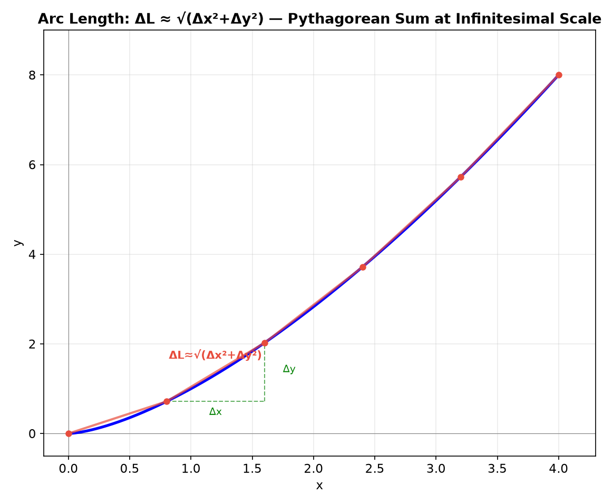
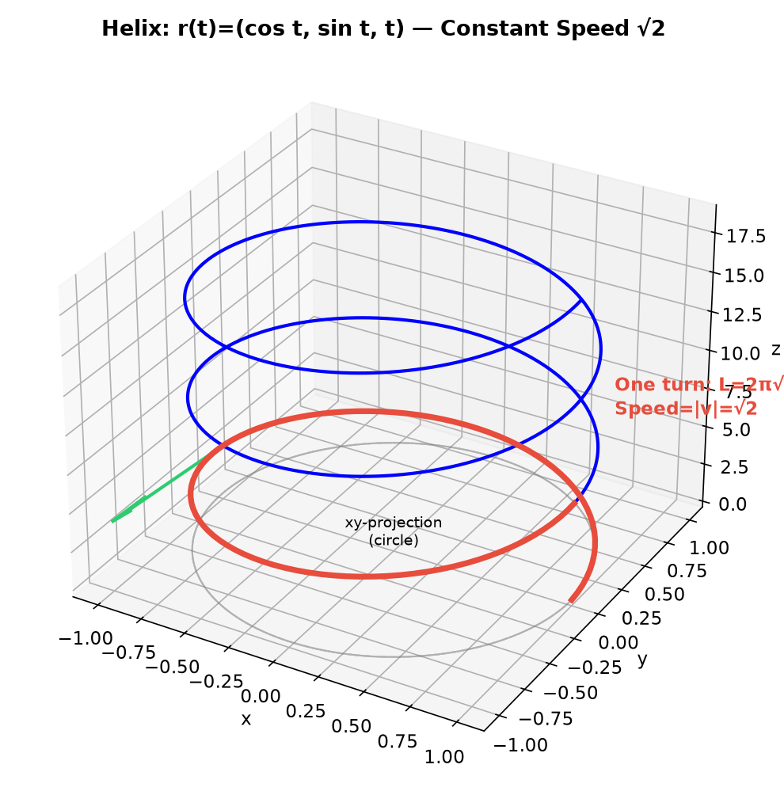
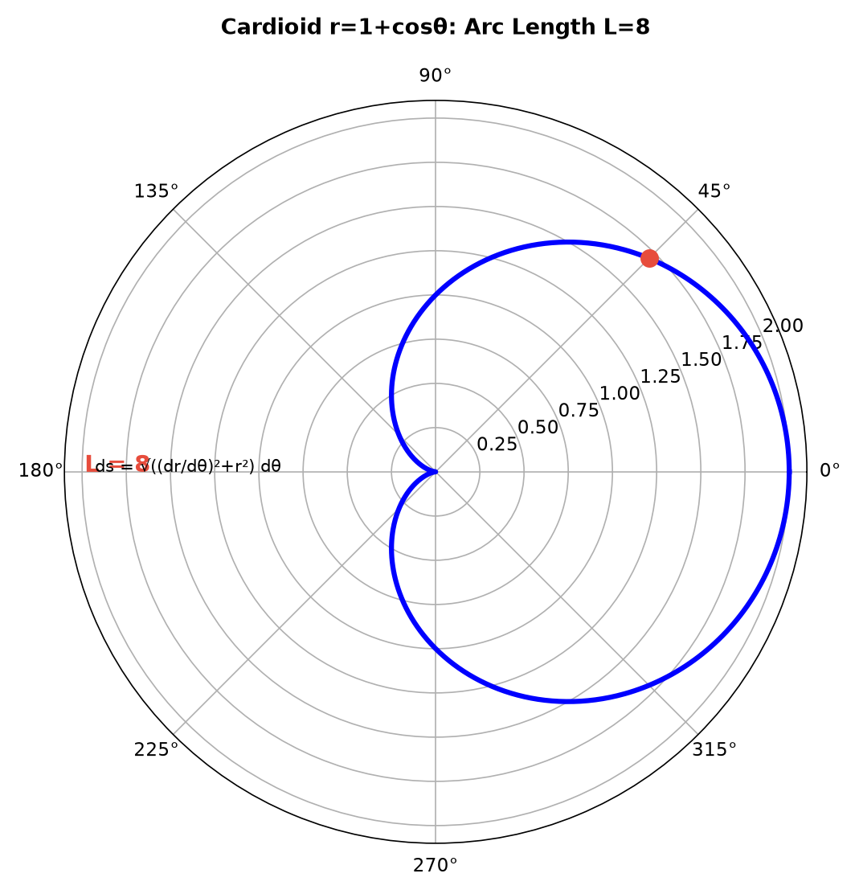
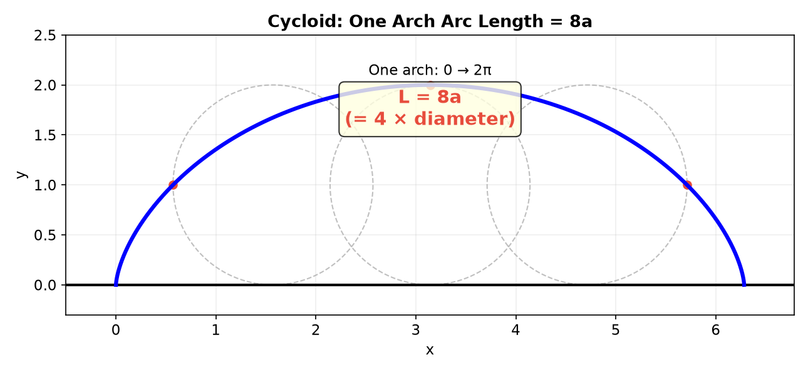
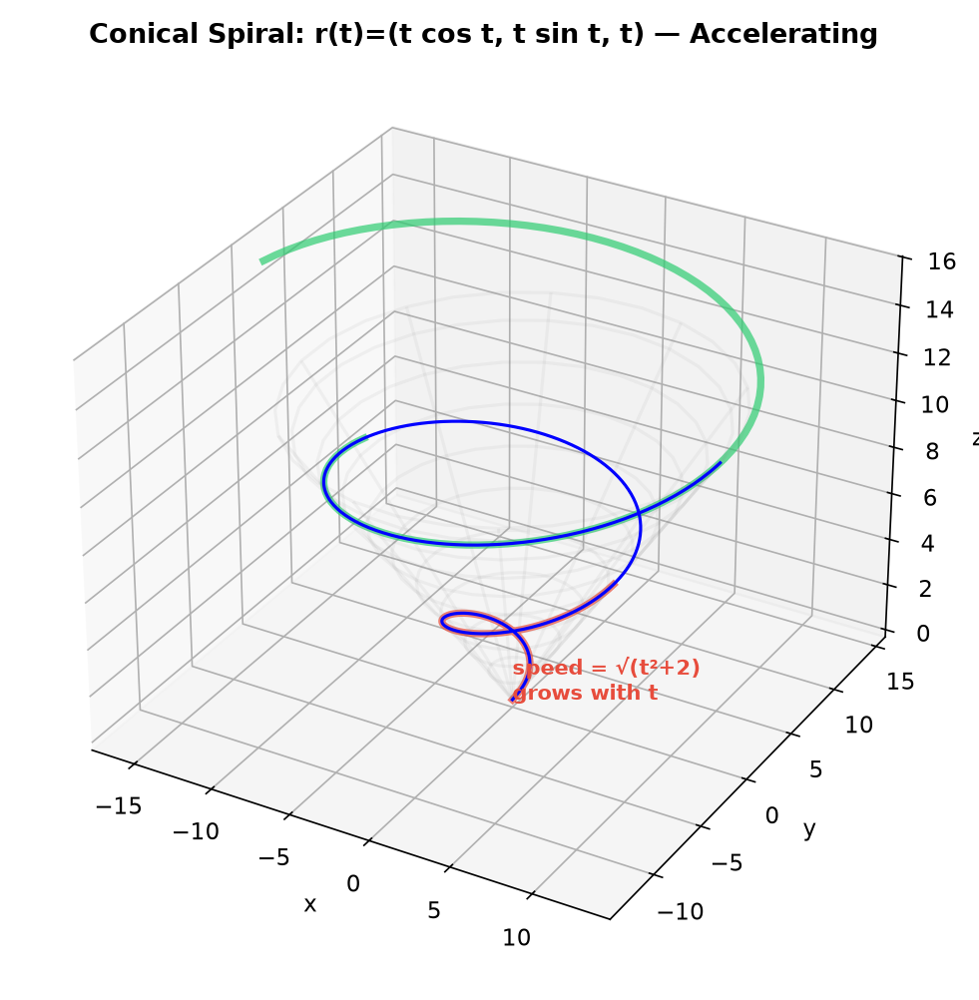
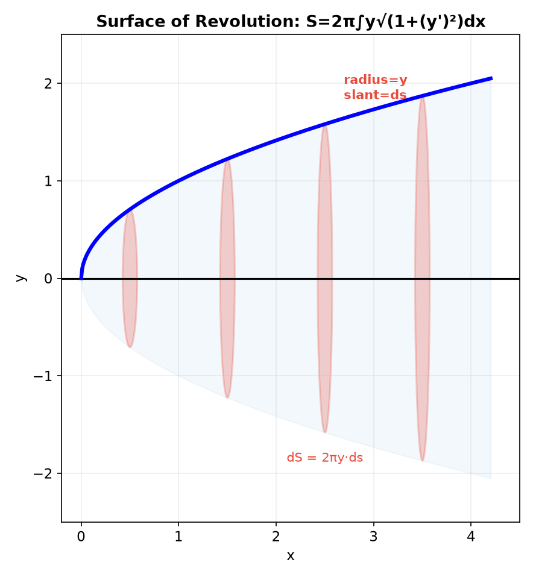
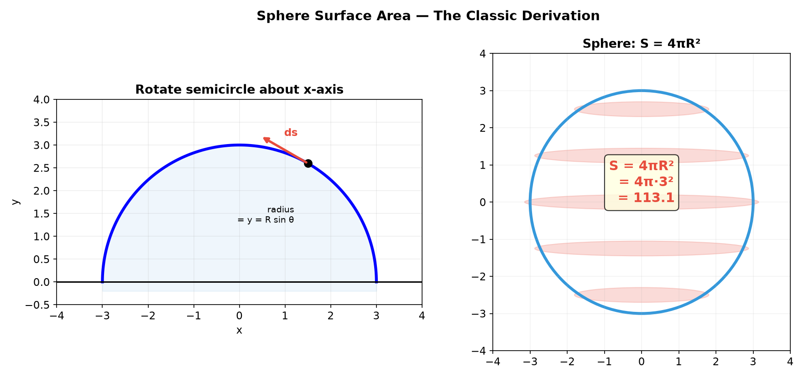
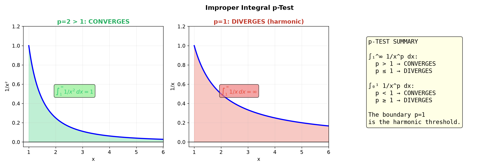
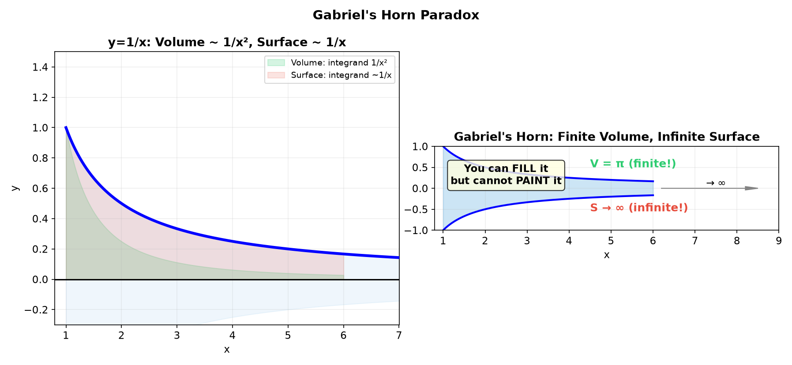
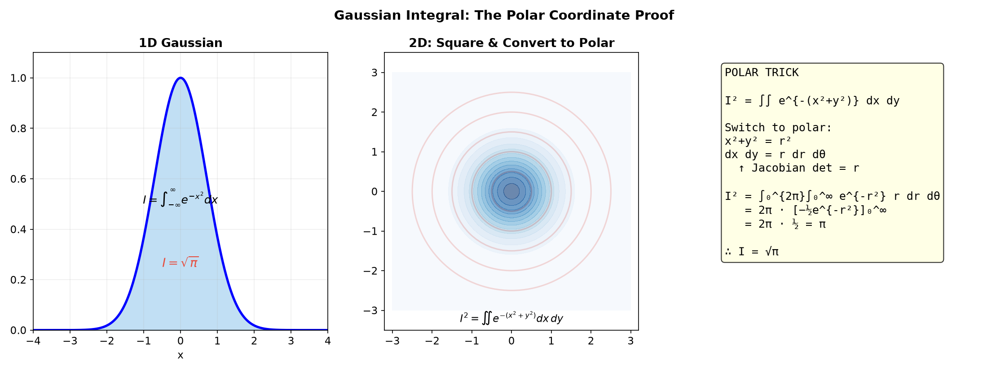

# Session 17B: Arc Length, Surface Area, and Improper Integrals — The Geometry of Infinite Curves

**Phase 2 — Classical Techniques | 70 min**

*Prerequisites: 17A (area & volume), 16B (advanced integration), 12C2 (parametric curves), 12A2 (vectors), 9C (3D geometry)*

> Arc length measures how far a curve travels. Surface area measures the skin of a solid. Improper integrals extend integration to infinity. When geometry — vectors, parametric motion, and infinite series — joins these calculus tools, we can measure spirals, prove convergence, and resolve paradoxes like Gabriel's Horn.

---

## Part A: Arc Length — Integrating Speed

---

## Example 1: Arc Length Formula — The Pythagorean Sum

$L = \displaystyle \int_a^b \sqrt{1 + [f'(x)]^2}\,dx$.

For $y = x^{3/2}$ on $[0,4]$: $f'(x) = \frac{3}{2}\sqrt{x}$, $1+[f']^2 = 1+\frac{9}{4}x$.

$L = \int_0^4 \sqrt{1+\frac{9}{4}x}\,dx$. Let $u=1+\frac{9}{4}x$, $du=\frac{9}{4}dx$:
$L = \frac{4}{9}\int_1^{10} u^{1/2}\,du = \frac{8}{27}(10^{3/2}-1) \approx 8.63$.

> **Geometric origin**: $\Delta L \approx \sqrt{(\Delta x)^2 + (\Delta y)^2}$. As $\Delta x \to 0$, this becomes $\sqrt{1+(dy/dx)^2}\,dx$ — the Pythagorean theorem at infinitesimal scale.



---

## Example 2: Parametric Arc Length — Speed of a Moving Point (🔗 12C2)

$x = f(t), y = g(t)$: $L = \displaystyle \int_{t_1}^{t_2} \sqrt{(dx/dt)^2 + (dy/dt)^2}\,dt = \int_{t_1}^{t_2} |\vec{r}{\,}'(t)|\,dt$.

**Circle of radius $R$**: $x = R\cos t$, $y = R\sin t$, $t \in [0, 2\pi]$.
Speed = $\sqrt{(-R\sin t)^2 + (R\cos t)^2} = R$. $L = \int_0^{2\pi} R\,dt = 2\pi R$. ✓

**Helix** (3D, 🔗 12C2): $\vec{r}(t) = (\cos t, \sin t, t)$, $t \in [0, 6\pi]$.
Speed = $\sqrt{\sin^2 t + \cos^2 t + 1} = \sqrt{2}$.
$L = \int_0^{6\pi} \sqrt{2}\,dt = 6\pi\sqrt{2}$ for 3 full turns.

> **Key**: Arc length = integral of speed. The velocity vector $\vec{r}{\,}'(t)$ encodes both direction and speed. Its magnitude is the instantaneous rate of distance accumulation.



---

## Example 3: Arc Length in Polar Coordinates (🔗 12C3)

$r = f(\theta)$: parametrize $\vec{r}(\theta) = (r\cos\theta, r\sin\theta)$.
Speed$^2 = (dr/d\theta)^2 + r^2$. $L = \int_{\theta_1}^{\theta_2} \sqrt{(f')^2 + f^2}\,d\theta$.

**Spiral of Archimedes** $r = \theta$ from $\theta = 0$ to $2\pi$:
$(f')^2 + f^2 = 1 + \theta^2$. $L = \int_0^{2\pi} \sqrt{1+\theta^2}\,d\theta$.

**How to integrate $\sqrt{1+\theta^2}$**: Use the substitution $\theta = \sinh u$ (since $1+\sinh^2 u = \cosh^2 u$). Then $d\theta = \cosh u\,du$, and $\sqrt{1+\theta^2} = \cosh u$.
$\int\sqrt{1+\theta^2}\,d\theta = \int \cosh^2 u\,du = \int \frac{\cosh(2u)+1}{2}\,du = \frac{\sinh(2u)}{4} + \frac{u}{2} + C$.
Using $\sinh(2u) = 2\sinh u\cosh u = 2\theta\sqrt{1+\theta^2}$ and $u = \sinh^{-1}\theta = \ln(\theta + \sqrt{1+\theta^2})$:
$\int\sqrt{1+\theta^2}\,d\theta = \frac{\theta}{2}\sqrt{1+\theta^2} + \frac{1}{2}\ln(\theta+\sqrt{1+\theta^2}) + C$.

Applying bounds $[0, 2\pi]$:
$L = \frac{1}{2}\left[2\pi\sqrt{1+4\pi^2} + \ln(2\pi+\sqrt{1+4\pi^2})\right] \approx 21.26$.

> This is the **inverse hyperbolic sine**: $\sinh^{-1}(\theta) = \ln(\theta+\sqrt{1+\theta^2})$. The arc length formula for the spiral naturally produces this function.

> **Insight**: The spiral lengthens faster than a circle because the radius grows — each turn adds more distance than the previous one. This is unlike the helix, which has constant speed.



---

## Example 4: Arc Length of the Cycloid (🔗 12C2)

$x = a(t - \sin t)$, $y = a(1 - \cos t)$, $t \in [0, 2\pi]$ (one arch).

$dx/dt = a(1-\cos t)$, $dy/dt = a\sin t$.
Speed$^2 = a^2[(1-\cos t)^2 + \sin^2 t] = a^2[1 - 2\cos t + \cos^2 t + \sin^2 t] = 2a^2(1-\cos t) = 4a^2\sin^2(t/2)$.

Speed = $2a|\sin(t/2)|$. On $[0, 2\pi]$, $\sin(t/2) \ge 0$, so speed = $2a\sin(t/2)$.

$L = \int_0^{2\pi} 2a\sin(t/2)\,dt = 2a \cdot 2\int_0^\pi \sin u\,du = 4a[-\cos u]_0^\pi = 8a$.

> One arch of the cycloid is exactly $8a$ — four times the diameter ($2a$) of the rolling circle. The wheel's rotating and translating motion combine in a remarkably clean result.



---

## Example 5: Arc Length and the Vector Dot Product (🔗 12A2, 9C)

For a 3D parametric curve $\vec{r}(t) = (x(t), y(t), z(t))$:

$|\vec{r}{\,}'(t)| = \sqrt{\vec{r}{\,}'(t) \cdot \vec{r}{\,}'(t)}$.

The speed is the square root of the velocity vector dotted with itself. This unifies all arc length formulas:
- 2D Cartesian: $|\vec{r}{\,}'| = \sqrt{1 + (dy/dx)^2}$ (after parametrizing by $x$)
- 2D parametric: $|\vec{r}{\,}'| = \sqrt{(dx/dt)^2 + (dy/dt)^2}$
- 3D parametric: $|\vec{r}{\,}'| = \sqrt{(dx/dt)^2 + (dy/dt)^2 + (dz/dt)^2}$

**Example**: $\vec{r}(t) = (t\cos t,\; t\sin t,\; t)$ (conical spiral, 🔗 12C2).
$\vec{r}{\,}'(t) = (\cos t - t\sin t,\; \sin t + t\cos t,\; 1)$.
$|\vec{r}{\,}'(t)|^2 = (\cos t - t\sin t)^2 + (\sin t + t\cos t)^2 + 1 = \cos^2 t - 2t\sin t\cos t + t^2\sin^2 t + \sin^2 t + 2t\sin t\cos t + t^2\cos^2 t + 1$
$= 1 + t^2 + 1 = t^2 + 2$. $|\vec{r}{\,}'(t)| = \sqrt{t^2+2}$.

The speed **grows** with $t$ — the spiral accelerates outward.



---

## Part B: Surface Area of Revolution

---

## Example 6: Surface Area About $x$-Axis

$S = 2\pi \displaystyle \int_a^b f(x)\sqrt{1+[f'(x)]^2}\,dx$.

Rotate $y = \sqrt{x}$ from $x=0$ to $x=4$:
$f' = \frac{1}{2\sqrt{x}}$, $1+(f')^2 = 1 + \frac{1}{4x} = \frac{4x+1}{4x}$.
$S = 2\pi\int_0^4 \sqrt{x}\sqrt{\frac{4x+1}{4x}}\,dx = \pi\int_0^4 \sqrt{4x+1}\,dx = \frac{\pi}{6}(17^{3/2}-1) \approx 36.18$.



---

## Example 7: Surface Area of a Sphere — The Classic Derivation (🔗 9C)

Rotate $y = \sqrt{R^2-x^2}$, $x \in [-R, R]$ about $x$-axis:
$f' = \frac{-x}{\sqrt{R^2-x^2}}$, $1+(f')^2 = 1 + \frac{x^2}{R^2-x^2} = \frac{R^2}{R^2-x^2}$.
$\sqrt{1+(f')^2} = \frac{R}{\sqrt{R^2-x^2}}$.

$S = 2\pi\int_{-R}^R \sqrt{R^2-x^2} \cdot \frac{R}{\sqrt{R^2-x^2}}\,dx = 2\pi R\int_{-R}^R dx = 4\pi R^2$. ✓

> The integrand simplifies beautifully — the $\sqrt{R^2-x^2}$ cancels, leaving a constant. The sphere's surface area has this elegant property because the slant factor exactly compensates for the shrinking radius near the poles.



---

## Example 8: Parametric Surface Area (🔗 12C2)

For $x = f(t), y = g(t)$ rotated about $x$-axis:
$S = 2\pi \displaystyle \int_{t_1}^{t_2} y(t)\sqrt{(dx/dt)^2 + (dy/dt)^2}\,dt$.

**Prolate spheroid**: Rotate ellipse $x = a\cos t$, $y = b\sin t$ ($a > b$) about $x$-axis:
$dx/dt = -a\sin t$, $dy/dt = b\cos t$.
Speed = $\sqrt{a^2\sin^2 t + b^2\cos^2 t}$.

$S = 2\pi\int_0^\pi b\sin t\sqrt{a^2\sin^2 t + b^2\cos^2 t}\,dt$.

Let $u = \cos t$, $du = -\sin t\,dt$: $S = 2\pi b\int_{-1}^1 \sqrt{a^2(1-u^2) + b^2 u^2}\,du = 2\pi b\int_{-1}^1 \sqrt{a^2 - (a^2-b^2)u^2}\,du$.

With $e^2 = 1 - (b/a)^2$ (eccentricity): $S = 2\pi b^2 + \frac{2\pi ab}{e}\arcsin e$ (for a prolate spheroid).

> When $a=b=R$ (sphere): $e=0$, and taking the limit gives $4\pi R^2$. ✓

---

## Part C: Improper Integrals — Infinity and Singularities

---

## Example 9: Infinite Interval — The $p$-Test (🔗 12B1, 12B2)

$\displaystyle \int_1^\infty \frac{1}{x^p}\,dx$: converges if $p > 1$, diverges if $p \le 1$.

- $\int_1^\infty \frac{1}{x^2}\,dx = 1$ (converges, $p=2>1$).
- $\int_1^\infty \frac{1}{x}\,dx = \infty$ (diverges, $p=1$ — harmonic tail).

> **Connection to series (12B1)**: $\int_1^\infty 1/x^p\,dx$ converges iff $\sum 1/n^p$ converges. The integral test links continuous and discrete infinity — the geometric series $\sum r^n$ with $|r|<1$ is the discrete analog of the exponential decay $\int e^{-x}\,dx$.

---

## Example 10: Unbounded Integrand

$\displaystyle \int_0^1 \frac{1}{x^p}\,dx$: converges if $p < 1$, diverges if $p \ge 1$.

- $\int_0^1 \frac{1}{\sqrt{x}}\,dx = 2$ (converges, $p=1/2<1$ — finite area despite infinite height).
- $\int_0^1 \frac{1}{x^2}\,dx = \infty$ (diverges, $p=2 \ge 1$ — singularity too strong).



> **Geometric intuition**: $\int_0^1 1/\sqrt{x}\,dx$ converges because the function is "thin enough" near 0. The area $2$ is exactly the area of a rectangle of width 1 and height 2 — the singularity compresses into a finite zone.

---

## Example 11: Gabriel's Horn — The Ultimate Paradox (🔗 12B2)

Rotate $y = 1/x$, $x \in [1, \infty)$ about $x$-axis.

**Volume** (finite!): $V = \pi\int_1^\infty (1/x)^2\,dx = \pi\int_1^\infty x^{-2}\,dx = \pi(1) = \pi$.

**Surface area** (infinite!): $S = 2\pi\int_1^\infty \frac{1}{x}\sqrt{1 + (-1/x^2)^2}\,dx \ge 2\pi\int_1^\infty \frac{1}{x}\,dx = \infty$ (diverges like harmonic).

**Paradox**: You can fill the horn with $\pi$ units of paint (finite volume), but you cannot paint its surface (infinite area). The resolution: painting requires a finite thickness of paint — the horn is infinitely long but so thin that volume converges while surface area diverges.

> This is **not** a contradiction — it reveals that volume and surface area measure fundamentally different things. Volume integrates $(1/x)^2 \sim 1/x^2$ (convergent $p=2$), while surface area integrates $(1/x) \cdot 1 \sim 1/x$ (divergent $p=1$).



---

## Example 12: Improper Integral via Matrix Determinant — Gaussian Integral (🔗 12A2)

$\displaystyle \int_{-\infty}^\infty e^{-x^2}\,dx = \sqrt{\pi}$.

**Why this matters**: The Gaussian integral is the foundation of probability (normal distribution). The proof uses a 2D trick: square the integral and convert to polar coordinates.

$I = \int_{-\infty}^\infty e^{-x^2}\,dx$, so $I^2 = \int_{-\infty}^\infty\int_{-\infty}^\infty e^{-(x^2+y^2)}\,dx\,dy$.

Switch to polar: $x^2+y^2 = r^2$, $dx\,dy = r\,dr\,d\theta$ (the Jacobian determinant!).
$I^2 = \int_0^{2\pi}\int_0^\infty e^{-r^2} r\,dr\,d\theta = 2\pi \cdot \left[-\frac{1}{2}e^{-r^2}\right]_0^\infty = 2\pi \cdot \frac{1}{2} = \pi$. So $I = \sqrt{\pi}$.

> **Matrix connection**: The Jacobian $r$ in $dx\,dy = r\,dr\,d\theta$ is $\det(J)$ where $J = \begin{pmatrix} \cos\theta & -r\sin\theta \\ \sin\theta & r\cos\theta \end{pmatrix}$. The determinant of the coordinate transformation matrix IS the area scaling factor — exactly as in 12A2.



---

## What We Just Did

```
(1) Arc length = ∫√(1+(dy/dx)²)dx = ∫|r'(t)|dt (integral of speed).
(2) Polar arc length: ∫√((dr/dθ)²+r²)dθ.
(3) Parametric/vector arc length unifies all: L = ∫√(r'·r')dt.
(4) Surface area: 2π∫(radius)·(arc length element).
(5) Improper integrals: replace ∞/singularity with limit.
(6) p-test: ∫₁∞ 1/x^p converges iff p>1. ∫₀¹ 1/x^p converges iff p<1.
(7) Gabriel's Horn: finite volume, infinite surface — not a contradiction.
(8) Gaussian integral via polar Jacobian → √π.
```

---

## Practice 1

Find the arc length of $y = \frac{2}{3}x^{3/2}$ from $x=0$ to $x=3$.

→ Solutions: [Solutions](solutions/17B-solutions.md#practice-1)

---

## Practice 2 (🔗 12C2)

Find the arc length of the helix $\vec{r}(t) = (2\cos t, 2\sin t, 3t)$ for $t \in [0, 4\pi]$.

→ Solutions: [Solutions](solutions/17B-solutions.md#practice-2)

---

## Practice 3 (🔗 12C3)

Find the arc length of the cardioid $r = 1 + \cos\theta$ (the whole curve, $\theta \in [0, 2\pi]$, using symmetry). Simplify: $\sqrt{(dr/d\theta)^2 + r^2} = \sqrt{2+2\cos\theta} = 2|\cos(\theta/2)|$.

→ Solutions: [Solutions](solutions/17B-solutions.md#practice-3)

---

## Practice 4

$\displaystyle \int_0^\infty \frac{dx}{x^2+1}$. (Improper — both infinite interval and the arctan connection.)

→ Solutions: [Solutions](solutions/17B-solutions.md#practice-4)

---

## Practice 5: Real Battle (🔗 12C2)

One arch of the cycloid: $x = t - \sin t$, $y = 1 - \cos t$, $t \in [0, 2\pi]$. Find its arc length. Also compute the length of the straight line from start to end and compare: why is the cycloid longer?

→ Solutions: [Solutions](solutions/17B-solutions.md#practice-5)

---

## Practice 6: Gabriel's Horn (🔗 12B2)

Verify: rotating $y=1/x$, $x \in [1,\infty)$ about $x$-axis gives volume $\pi$ (finite) but surface area diverges. Explain why this is not a paradox using the $p$-test.

→ Solutions: [Solutions](solutions/17B-solutions.md#practice-6)

---

## Practice 7: Real Battle (🔗 12C3, 12A2)

The Gaussian integral: sketch the proof that $\int_{-\infty}^\infty e^{-x^2}\,dx = \sqrt{\pi}$ by squaring and switching to polar coordinates. Identify the Jacobian determinant in the coordinate change.

→ Solutions: [Solutions](solutions/17B-solutions.md#practice-7)

---

## Basic Drills

**D1.** Find the arc length of $y = 2x$ from $x=0$ to $x=3$. (Check via distance formula.)

**D2.** $\displaystyle \int_1^\infty \frac{dx}{x^3}$. $p$-test.

**D3.** $\displaystyle \int_0^1 \frac{dx}{\sqrt[3]{x}}$. $p$-test for unbounded integrand.

**D4.** Arc length of $y = \sqrt{1-x^2}$ from $x=0$ to $x=1$ (quarter circle). Check: the result should be $\pi/2$.

**D5.** $\displaystyle \int_2^\infty \frac{dx}{x\ln x}$. Does it converge? Use $u$-sub.

**D6.** Rotate $y = 3$, $x \in [0,5]$ about $x$-axis. Find surface area. (Check: lateral area of a cylinder = $2\pi rh$.)

**D7.** $\displaystyle \int_{-\infty}^\infty \frac{dx}{1+x^2}$. Improper, symmetric. (Result should be $\pi$.)

**D8.** Arc length of one arch of $y = \sin x$ on $[0, \pi]$. ($\int_0^\pi \sqrt{1+\cos^2 x}\,dx$ — elliptic integral, leave as setup.)

**D9.** $\displaystyle \int_0^\infty e^{-2x}\,dx$. Improper exponential.

**D10.** Rotate $y = \sqrt{4-x^2}$, $x \in [-2,2]$ about $x$-axis. Surface area. (Check: sphere area = $4\pi R^2$.)

**D11.** (🔗 12C2) Arc length of the unit-speed helix: parametrize so that speed = 1. The standard helix $(\cos t, \sin t, t)$ has speed $\sqrt{2}$. Find $c$ so that $(\cos(ct), \sin(ct), ct)$ has speed exactly 1.

**D12.** (🔗 12B2) $\displaystyle \int_1^\infty \frac{dx}{x^{1.01}}$. Converge or diverge?

**D13.** (🔗 12C3) Arc length of the polar curve $r = e^\theta$ (logarithmic spiral) from $\theta = 0$ to $\theta = 2\pi$. Hint: $\sqrt{(dr/d\theta)^2 + r^2} = \sqrt{2}e^\theta$.

**D14.** $\displaystyle \int_0^1 \ln x\,dx$. Improper at $x=0$. Evaluate the limit carefully.

**D15.** (🔗 12C2, 9C) Rotate the cycloid arch ($x = t-\sin t$, $y = 1-\cos t$, $t \in [0, 2\pi]$) about the $x$-axis. Set up the surface area integral (do not evaluate — it's elliptic).

> Solutions: [Solutions](solutions/17B-solutions.md#basic-drill)

---

## Advanced Drills

**A1.** Find the arc length of $y = \ln(\sec x)$ from $x=0$ to $x=\pi/3$.

**A2.** Gabriel's Horn extended: rotate $y=1/x^p$, $x \in [1,\infty)$ about $x$-axis. For which $p$ is the volume finite? For which $p$ is the surface area finite? Find the $p$-range where volume is finite but surface area is infinite (the Gabriel's Horn phenomenon).

**A3.** $\displaystyle \int_0^\infty x e^{-x}\,dx$. Integration by parts + improper limit.

**A4.** Arc length of $y = \frac{x^2}{4} - \frac{\ln x}{2}$ from $x=1$ to $x=e$. (Hint: the expression under the root becomes a perfect square.)

**A5.** (🔗 12A2, 12C3) Prove $\int_{-\infty}^\infty e^{-x^2}\,dx = \sqrt{\pi}$ using the polar coordinate trick. Explain how the Jacobian determinant $r$ emerges.

**A6.** Surface area when $y = e^{-x}$, $x \in [0,\infty)$ is rotated about $x$-axis. Does it converge? Compare with Gabriel's Horn.

**A7.** $\displaystyle \int_0^1 \frac{\arcsin x}{\sqrt{1-x^2}}\,dx$. $u$-sub then check for improperness.

**A8.** (🔗 12C2) Curve $y = x^2$ from $x=0$ to $x=2$ rotated about the $y$-axis. Find surface area (use $x = \sqrt{y}$, integrate with respect to $y$).

**A9.** $\displaystyle \int_0^\infty \frac{\arctan x}{1+x^2}\,dx$. $u$-sub + improper.

**A10.** (🔗 12B2) Prove $\int_0^\infty \frac{\sin x}{x}\,dx$ converges by writing it as an alternating series of integrals over $[n\pi, (n+1)\pi]$ and applying the alternating series test. (Value = $\pi/2$, the Dirichlet integral.)

**A11.** (🔗 12C2, 17A) Paraboloid formed by rotating $y = x^2$ from $x=0$ to $x=2$ about the $y$-axis. Find its surface area.

**A12.** (🔗 9C, 12C2) Curve $y = \ln x$ from $x=1$ to $x=e$ rotated about $y$-axis. Find surface area. Express $x = e^y$ and integrate with respect to $y$.

**A13.** (🔗 9C) Derive the surface area of a zone of a sphere (the portion between two parallel planes). If the planes are distance $h$ apart, the zone surface area is $2\pi R h$ — independent of where the zone is on the sphere!

> Solutions: [Solutions](solutions/17B-solutions.md#advanced-drill)

---

## Today's Procedure

```
Step 1: Arc length = ∫√(1+(dy/dx)²)dx. Simplify under the root first.
Step 2: Parametric/polar: L = ∫|r'(t)|dt = ∫√((dx/dt)²+(dy/dt)²)dt.
Step 3: Surface area = 2π∫(radius)·(arc length element).
Step 4: Improper: replace ∞/singularity with limit → evaluate → take limit.
Step 5: p-test for quick convergence decisions.
Step 6: Gabriel's Horn = classic paradox: V finite, S infinite.
```

---

## How to Read These Symbols

| Symbol | Reads as | Meaning |
|:---:|:---:|------|
| $L = \int\sqrt{1+(y')^2}\,dx$ | "arc length integral" | length of $y=f(x)$ |
| $L = \int|\vec{r}{\,}'(t)|\,dt$ | "integral of speed" | unified arc length via vectors |
| $\int_a^\infty f(x)\,dx$ | "improper integral to infinity" | $\lim_{b\to\infty}\int_a^b f(x)dx$ |
| convergent / divergent | "converges / diverges" | finite limit exists / does not |
| $p$-test | "p-test" | $\int_1^\infty 1/x^p$: converges iff $p>1$ |
| Gabriel's Horn | "Gabriel's Horn" | $y=1/x$, $x\ge1$, finite $V$, infinite $S$ |
| $\int_{-\infty}^\infty e^{-x^2}dx = \sqrt{\pi}$ | "Gaussian integral equals root pi" | fundamental probability integral |
