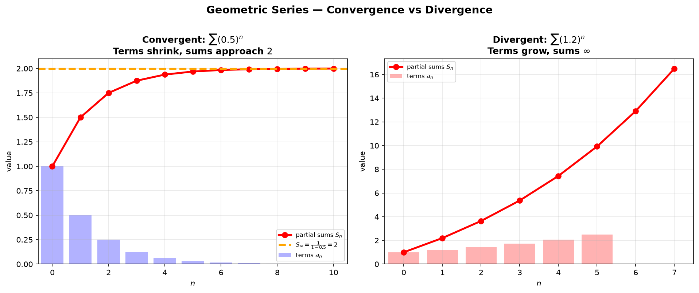
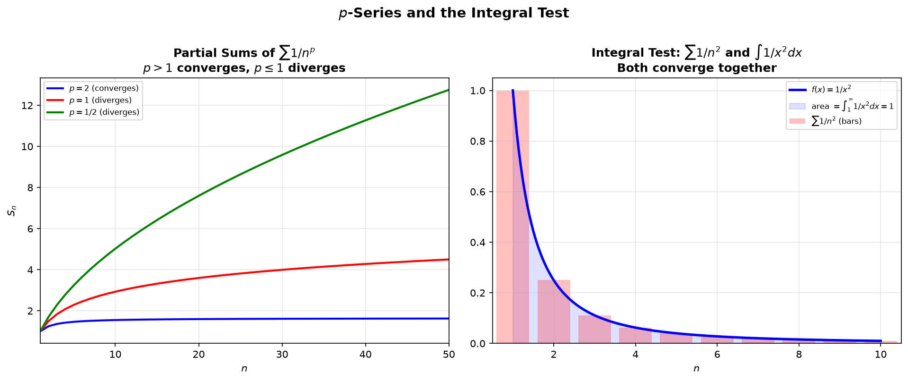
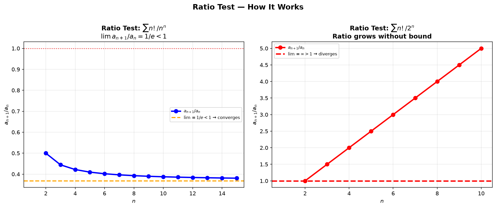
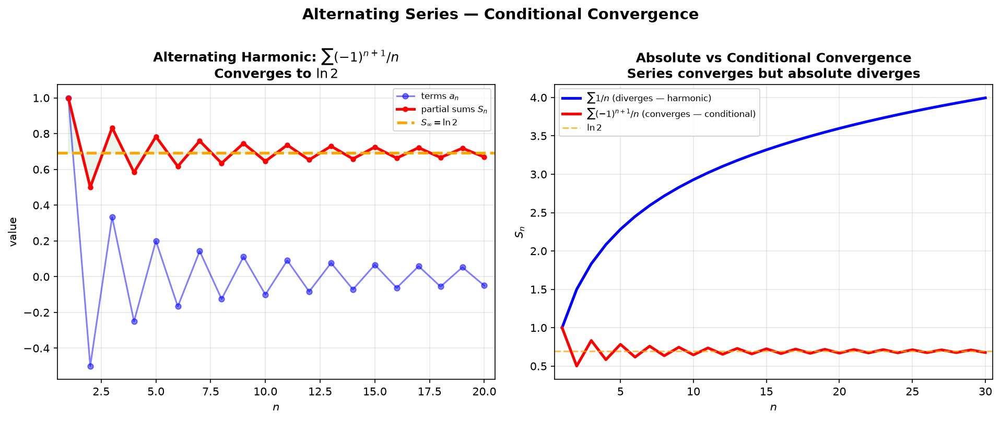

# Session 18A: Infinite Series — Does It Converge?

**Phase 2 — Classical Techniques | 70 min**

*Prerequisites: 12B (sequences), 13C (limits of sequences), 17B (improper integrals)*

> 💡 **Stuck?** Every problem has a collapsible **Hint** below it — click it only when you need a nudge.

---

## Part A: What Is a Series?

---

## Example 1: From Sequence to Series

A **series** $\sum_{n=1}^\infty a_n$ is the limit of **partial sums** $S_N = \sum_{n=1}^N a_n$.

If $\lim_{N\to\infty} S_N = S$ (finite), the series **converges** to $S$. Otherwise it **diverges**.

**Divergence Test** (🔗 13C): If $\lim a_n \neq 0$, the series diverges. But $\lim a_n = 0$ does NOT guarantee convergence — the harmonic series $\sum 1/n$ proves this.

---

## Part B: The Two Series You Must Memorize

---

## Example 2: Geometric Series (🔗 12B1)

$\displaystyle \sum_{n=0}^\infty ar^n = \frac{a}{1-r}$ **if and only if** $|r| < 1$. Diverges if $|r| \ge 1$.

$\sum_{n=0}^\infty \frac{2}{3^n} = \frac{2}{1-1/3} = 3$.
$\sum_{n=1}^\infty 5\left(-\frac{1}{2}\right)^n = \frac{5(-1/2)}{1-(-1/2)} = -\frac{5}{3}$.



*Graph 18A-1: Left — Convergent geometric series $\sum (0.5)^n$: terms shrink, partial sums approach $S_\infty=2$. Right — Divergent geometric series $\sum (1.2)^n$: terms grow, partial sums diverge to infinity.*

---

## Example 3: Telescoping Series (🔗 12B2)

Terms cancel in pairs — only first and last survive.

$\displaystyle \sum_{n=1}^\infty \frac{1}{n(n+1)} = \sum_{n=1}^\infty\left(\frac{1}{n}-\frac{1}{n+1}\right)$.

$S_N = (1-\frac{1}{2})+(\frac{1}{2}-\frac{1}{3})+\cdots+(\frac{1}{N}-\frac{1}{N+1}) = 1-\frac{1}{N+1} \to 1$.

---

## Example 4: $p$-Series (🔗 12B2, 17B)

$\displaystyle \sum_{n=1}^\infty \frac{1}{n^p}$ converges $\iff p > 1$.

$p=1$: harmonic series — **diverges** (very slowly).
$p=2$: $\sum 1/n^2 = \pi^2/6 \approx 1.645$ — **converges**.
$p=1/2$: $\sum 1/\sqrt{n}$ — **diverges**.



*Graph 18A-2: Left — Partial sums of $\sum 1/n^p$ for $p=2$ (converges), $p=1$ (diverges), $p=1/2$ (diverges). Right — Integral test: $\sum 1/n^2$ converges because $\int_1^\infty 1/x^2\,dx$ converges.*

---

## Part C: Convergence Tests — The Workflow

> **Decision order**: Divergence Test → Geometric? → Telescoping? → $p$-series? → Integral Test → Comparison → Limit Comparison → Ratio → Root → Alternating.

---

## Example 5: Integral Test (🔗 17B)

If $f(x)$ is positive, continuous, decreasing: $\sum f(n)$ and $\int_1^\infty f(x)dx$ **both converge or both diverge**.

$\sum_{n=1}^\infty \frac{1}{n^2+1}$: compare to $\int_1^\infty \frac{dx}{x^2+1} = \frac{\pi}{4}$ (converges). → Converges.

---

## Example 6: Comparison Test

Given $0 \le a_n \le b_n$: if $\sum b_n$ converges, $\sum a_n$ converges. If $\sum a_n$ diverges, $\sum b_n$ diverges.

$\sum_{n=1}^\infty \frac{1}{n^2+3n}$: $\frac{1}{n^2+3n} \le \frac{1}{n^2}$. $\sum 1/n^2$ converges → converges.

$\sum_{n=1}^\infty \frac{n}{n^2+1}$: $\frac{n}{n^2+1} \ge \frac{n}{n^2+n^2} = \frac{1}{2n}$. Diverges by harmonic.

---

## Example 7: Limit Comparison Test

$\lim_{n\to\infty} \frac{a_n}{b_n} = L$ with $0 < L < \infty$ → both converge or both diverge.

$\sum \frac{n^2+1}{n^3+5}$: choose $b_n = 1/n$ (harmonic). $\lim \frac{a_n}{b_n} = 1$. → Diverges.

---

## Example 8: Ratio Test (🔗 12B1)

The ratio test generalizes the geometric series intuition: a series converges if, eventually, each term is at most $r<1$ times the previous term.

$\displaystyle \lim_{n\to\infty} \left|\frac{a_{n+1}}{a_n}\right| = \rho$.

$\rho < 1$ → converges absolutely. $\rho > 1$ → diverges. $\rho = 1$ → inconclusive.



*Graph 18A-4: Left — $\sum n!/n^n$: the ratio $a_{n+1}/a_n$ converges to $1/e < 1$, so the series converges. Right — $\sum n!/2^n$: the ratio grows without bound ($> 1$), so the series diverges.*

$\sum \frac{2^n}{n!}$: $\rho = \lim \frac{2^{n+1}/(n+1)!}{2^n/n!} = \lim \frac{2}{n+1} = 0 < 1$ → converges.

$\sum \frac{n!}{n^n}$: $\rho = \lim \frac{(n+1)!/(n+1)^{n+1}}{n!/n^n} = \lim \left(\frac{n}{n+1}\right)^n = \frac{1}{e} < 1$ → converges.

---

## Example 9: Root Test

$\displaystyle \lim_{n\to\infty} \sqrt[n]{|a_n|} = \rho$. Same criteria as ratio test.

$\sum \left(\frac{n}{2n+1}\right)^n$: $\rho = \lim \frac{n}{2n+1} = \frac{1}{2} < 1$ → converges.

---

## Example 10: Alternating Series Test

If $a_n > 0$, $a_n$ decreasing, and $\lim a_n = 0$: $\sum (-1)^{n+1}a_n$ converges.



*Graph 18A-3: Left — Alternating harmonic series $\sum (-1)^{n+1}/n$ converges to $\ln 2$. Terms alternate sign and shrink to zero; partial sums converge in a zigzag pattern. Right — Comparison of $\sum 1/n$ (divergent) vs $\sum (-1)^{n+1}/n$ (convergent conditional): the absolute series diverges while the alternating series converges.*

**Error bound**: $|S - S_N| \le a_{N+1}$. The error after $N$ terms is at most the first omitted term.

$\sum_{n=1}^\infty \frac{(-1)^{n+1}}{n} = \ln 2$. $a_n = 1/n \searrow 0$ → converges (conditionally).

---

## Example 11: Absolute vs Conditional Convergence

$\sum |a_n|$ converges → $\sum a_n$ converges **absolutely** (rearrangement doesn't matter).
$\sum a_n$ converges but $\sum |a_n|$ diverges → **conditionally convergent** (rearrangement can change the sum!).

$\sum \frac{(-1)^{n+1}}{n^2}$: $\sum 1/n^2$ converges → absolutely convergent.
$\sum \frac{(-1)^{n+1}}{n}$: $\sum 1/n$ diverges → conditionally convergent.

> **Up to here**: 10 convergence tests. Geometric: $|r|<1$. $p$-series: $p>1$. Integral/Comparison/Limit Comparison/Ratio/Root/Alternating + Divergence Test.

---

## Common Mistakes

### Mistake 1: $\lim a_n = 0$ guarantees convergence

**Wrong**. The harmonic series $\sum 1/n$ has $a_n \to 0$ but diverges.

### Mistake 2: Ratio test gives $\rho=1$ and you conclude divergence

**Wrong**. $\rho=1$ is inconclusive. Try comparison or integral test.

---

## What We Just Did

```
(1) Series = limit of partial sums. Divergence Test: a_n →/ 0 ⇒ diverges.
(2) Geometric: Σar^n = a/(1-r), |r|<1. Telescoping: Σ(b_n-b_{n+1}). p-series: Σ1/n^p, p>1.
(3) Integral Test: Σf(n) ↔ ∫f(x)dx. Comparison: bound by known series.
(4) Ratio/Root: limit < 1 ⇒ converges. Alternating: decreasing+→0 ⇒ converges.
(5) Absolute convergence ⇒ convergence. Conditional: rearrangements matter.
```

---

## Practice 1

$\displaystyle \sum_{n=0}^\infty \frac{3}{4^n}$. Identify $a$ and $r$, find the sum.

<details>
<summary>💡 Hint</summary>

This is a geometric series. The first term (at $n=0$) is $3$ — that's $a$. Each step multiplies by $r = \frac14$. Sum $= \frac{a}{1-r}$.

</details>

→ Solutions: [Solutions](solutions/18A-solutions.md#practice-1)

---

## Practice 2

Determine convergence: $\displaystyle \sum_{n=1}^\infty \frac{n}{n^2+4}$. Use comparison or limit comparison.

<details>
<summary>💡 Hint</summary>

For large $n$, $\frac{n}{n^2+4} \approx \frac{n}{n^2} = \frac{1}{n}$. Use limit comparison with $b_n = \frac{1}{n}$ — the limit is $1$.

</details>

→ Solutions: [Solutions](solutions/18A-solutions.md#practice-2)

---

## Practice 3

Determine convergence: $\displaystyle \sum_{n=1}^\infty \frac{3^n}{n!}$. Ratio test.

<details>
<summary>💡 Hint</summary>

$\frac{a_{n+1}}{a_n} = \frac{3^{n+1}/(n+1)!}{3^n/n!} = \frac{3}{n+1}$. What does this tend to?

</details>

→ Solutions: [Solutions](solutions/18A-solutions.md#practice-3)

---

## Practice 4

Determine convergence: $\displaystyle \sum_{n=1}^\infty \frac{(-1)^{n+1}}{\sqrt{n}}$. Alternating series test. Absolute or conditional?

<details>
<summary>💡 Hint</summary>

$a_n = \frac{1}{\sqrt{n}}$ is decreasing and tends to $0$ — the alternating test applies. Then decide convergence of $\sum |a_n| = \sum \frac{1}{n^{1/2}}$: what kind of $p$-series is that?

</details>

→ Solutions: [Solutions](solutions/18A-solutions.md#practice-4)

---

## Practice 5: Real Battle (🔗 12B2, 17B)

$\displaystyle \sum_{n=2}^\infty \frac{1}{n(\ln n)^p}$. For which $p$ does this converge? Use the integral test.

<details>
<summary>💡 Hint</summary>

Use the integral test with $u = \ln x$, so $du = \frac{dx}{x}$. You'll get $\int \frac{du}{u^p}$ — a $p$-integral. The answer mirrors the $p$-series rule.

</details>

→ Solutions: [Solutions](solutions/18A-solutions.md#practice-5)

---

## Practice 6: Real Battle — Strategy Challenge (🔗 18B, 17B)

Determine convergence of $\displaystyle \sum_{n=1}^\infty \frac{n!}{n^n}$. Use the ratio test. Then use the comparison test to show $\frac{n!}{n^n} \leq \frac{1}{2^n}$ for $n\geq 6$. Which approach is simpler?

<details>
<summary>💡 Hint</summary>

Ratio test: $\frac{a_{n+1}}{a_n} = \left(\frac{n}{n+1}\right)^n \to \frac1e$. For the comparison, check $n=6$ directly, then use $\left(\frac{n}{n+1}\right)^n \le \frac12$ to induct upward.

</details>

→ Solutions: [Solutions](solutions/18A-solutions.md#practice-6)

---

## Basic Drills

**D1.** $\sum_{n=0}^\infty \left(\frac{2}{5}\right)^n$. Sum if convergent.

**D2.** $\sum_{n=1}^\infty \frac{1}{n^3}$. $p$-series — converge or diverge?

**D3.** $\sum_{n=1}^\infty \frac{1}{\sqrt[3]{n}}$. $p$-series.

**D4.** Apply the Divergence Test to $\sum_{n=1}^\infty \frac{n}{n+1}$.

**D5.** $\sum_{n=1}^\infty \frac{2}{n^2+1}$. Compare to $p$-series.

**D6.** $\sum_{n=1}^\infty \frac{(-1)^{n}}{n^2+1}$. Absolute convergence?

**D7.** $\sum_{n=1}^\infty \frac{5^n}{n!}$. Ratio test.

**D8.** $\sum_{n=1}^\infty \frac{1}{n\ln n}$. Integral test.

**D9.** Telescoping: $\sum_{n=1}^\infty \frac{2}{(2n-1)(2n+1)}$.

<details>
<summary>💡 Hint</summary>

Partial fractions: $\frac{2}{(2n-1)(2n+1)} = \frac{1}{2n-1} - \frac{1}{2n+1}$. Write out $S_N$ — which terms survive?

</details>

**D10.** Root test on $\sum_{n=1}^\infty \left(1+\frac{1}{n}\right)^{-n^2}$.

<details>
<summary>💡 Hint</summary>

$\sqrt[n]{a_n} = \left(1+\frac1n\right)^{-n}$. What famous limit is that?

</details>

**D11.** $\sum_{n=1}^\infty \frac{n^{10}}{10^n}$. Ratio test — which dominates, polynomial or exponential?

<details>
<summary>💡 Hint</summary>

$\frac{a_{n+1}}{a_n} = \frac{1}{10}\left(\frac{n+1}{n}\right)^{10} \to \frac{1}{10}$ — the $\left(\frac{n+1}{n}\right)^{10}$ factor tends to $1$.

</details>

**D12.** $\sum_{n=1}^\infty \frac{n\cos(n\pi)}{n^3+1}$. Determine absolute vs conditional convergence.

<details>
<summary>💡 Hint</summary>

$\cos(n\pi) = (-1)^n$. For absolute convergence, compare $\sum \frac{n}{n^3+1}$ to a $p$-series.

</details>

> Solutions: [Solutions](solutions/18A-solutions.md#basic-drill)

---

## Advanced Drills

**A1.** Determine convergence of $\sum_{n=2}^\infty \frac{1}{n(\ln n)^2}$.

<details>
<summary>💡 Hint</summary>

$u = \ln x$ turns $\int \frac{dx}{x(\ln x)^2}$ into $\int \frac{du}{u^2}$, which converges.

</details>

**A2.** $\sum_{n=1}^\infty \frac{n!}{2^n}$. Determine convergence.

<details>
<summary>💡 Hint</summary>

$\frac{a_{n+1}}{a_n} = \frac{n+1}{2}$ — this grows without bound, so $\rho = \infty > 1$.

</details>

**A3.** $\sum_{n=1}^\infty \frac{\sin n}{n^2}$. Determine convergence.

<details>
<summary>💡 Hint</summary>

$\left|\frac{\sin n}{n^2}\right| \le \frac{1}{n^2}$ — compare to a converging $p$-series to get absolute convergence.

</details>

**A4.** $\sum_{n=1}^\infty \frac{(-1)^n n}{n^2+1}$. Determine convergence; absolute or conditional?

<details>
<summary>💡 Hint</summary>

$a_n = \frac{n}{n^2+1}$ is decreasing (check $f'(x) = \frac{1-x^2}{(x^2+1)^2} < 0$) and $\to 0$. For absolute convergence, $\frac{n}{n^2+1}$ behaves like $\frac1n$.

</details>

**A5.** $\sum_{n=1}^\infty \left(\frac{n}{n+1}\right)^{n^2}$. Determine convergence.

<details>
<summary>💡 Hint</summary>

$\sqrt[n]{a_n} = \left(\frac{n}{n+1}\right)^n = \left(1 - \frac{1}{n+1}\right)^n \to \frac1e < 1$.

</details>

**A6.** Determine all $x$ where $\sum_{n=1}^\infty \frac{x^n}{n}$ converges.

<details>
<summary>💡 Hint</summary>

Ratio test gives radius $R=1$. The two endpoints must be checked separately: $x=1$ is harmonic, $x=-1$ is alternating.

</details>

**A7.** $\sum_{n=1}^\infty \frac{1\cdot3\cdot5\cdots(2n-1)}{n!\,3^n}$. Determine convergence.

<details>
<summary>💡 Hint</summary>

The next numerator factor is $2n+1$, so $\frac{a_{n+1}}{a_n} = \frac{2n+1}{3(n+1)} \to \frac23$.

</details>

**A8.** Prove $\sum_{n=1}^\infty \frac{1}{n^2}$ converges.

<details>
<summary>💡 Hint</summary>

For $n \ge 2$: $\frac{1}{n^2} \le \frac{1}{n(n-1)}$. Then $\frac{1}{n(n-1)} = \frac{1}{n-1} - \frac{1}{n}$ — a telescoping series.

</details>

**A9.** $\sum_{n=1}^\infty \frac{\ln n}{n^2}$. Determine convergence.

<details>
<summary>💡 Hint</summary>

For large $n$, $\ln n \le n^{1/2}$ (logs grow slower than any power). So $\frac{\ln n}{n^2} \le \frac{1}{n^{3/2}}$.

</details>

**A10.** True or false: if $\sum a_n$ converges, then $\sum a_n^2$ converges?

<details>
<summary>💡 Hint</summary>

$\sum \frac{(-1)^n}{\sqrt{n}}$ converges (alternating). What is $\sum a_n^2$?

</details>

**A11.** Determine convergence of $\sum_{n=1}^\infty \frac{\sqrt{n}}{\sqrt{n^3+1}}$.

<details>
<summary>💡 Hint</summary>

The general term behaves like $\frac{\sqrt{n}}{\sqrt{n^3}} = \frac{1}{n}$. Use limit comparison with $b_n = \frac1n$.

</details>

**A12.** (🔗 17B) Determine convergence of $\sum_{n=2}^\infty \frac{\ln n}{n(\ln n)^2-1}$.

<details>
<summary>💡 Hint</summary>

With $u = \ln x$: $dx = e^u du$ and $x(\ln x)^2 - 1 = e^u u^2 - 1$. The $e^u$ factors cancel, leaving $\int \frac{u}{u^2-1}du$.

</details>

> Solutions: [Solutions](solutions/18A-solutions.md#advanced-drill)

---

## How to Read These Symbols

| Symbol | Reads as | Meaning |
|:---:|:---:|------|
| $\sum_{n=1}^{\infty} a_n$ converges | "the series converges" | partial sums approach a finite limit |
| $\sum a_n$ diverges | "the series diverges" | partial sums → ∞, −∞, or oscillate |
| $\lim_{n\to\infty} a_n \neq 0$ | "limit of a n does not equal zero" | Divergence Test: if limit ≠ 0, series MUST diverge (but limit=0 does NOT guarantee convergence!) |
| geometric series | "geometric series" | $\sum ar^n$ — converges to $a/(1-r)$ if |r|<1 |
| $p$-series | "p series" | $\sum 1/n^p$ — converges if p>1, diverges if p≤1 |
| Integral Test | "integral test" | compare series to $\int f(x)dx$ where $f(n)=a_n$ — same convergence behavior |
| Comparison Test | "comparison test" / "direct comparison" | term-by-term ≤ known series — if bigger converges, smaller also converges |
| Limit Comparison Test | "limit comparison test" | if $\lim a_n/b_n = c > 0$ (finite), series share convergence fate |
| Ratio Test | "ratio test" | $\lim |a_{n+1}/a_n| = L$: L<1→converges, L>1→diverges, L=1→inconclusive |
| Root Test | "root test" | $\lim \sqrt[n]{|a_n|} = L$ — same criteria as Ratio Test |
| Alternating Series Test | "alternating series test" | terms decrease to 0 in absolute value → converges |
| absolutely / conditionally convergent | "absolutely convergent" / "conditionally convergent" | ∑|a_n| converges / ∑|a_n| diverges but ∑a_n converges |

---

## Today's Procedure

```
Step 1: Divergence Test first — if a_n →/ 0, stop.
Step 2: Recognize the type — geometric? p-series? telescoping?
Step 3: Choose test in order: Integral → Comparison → Limit Comparison → Ratio → Root.
Step 4: For alternating: check decreasing + limit zero. Check absolute vs conditional.
```
