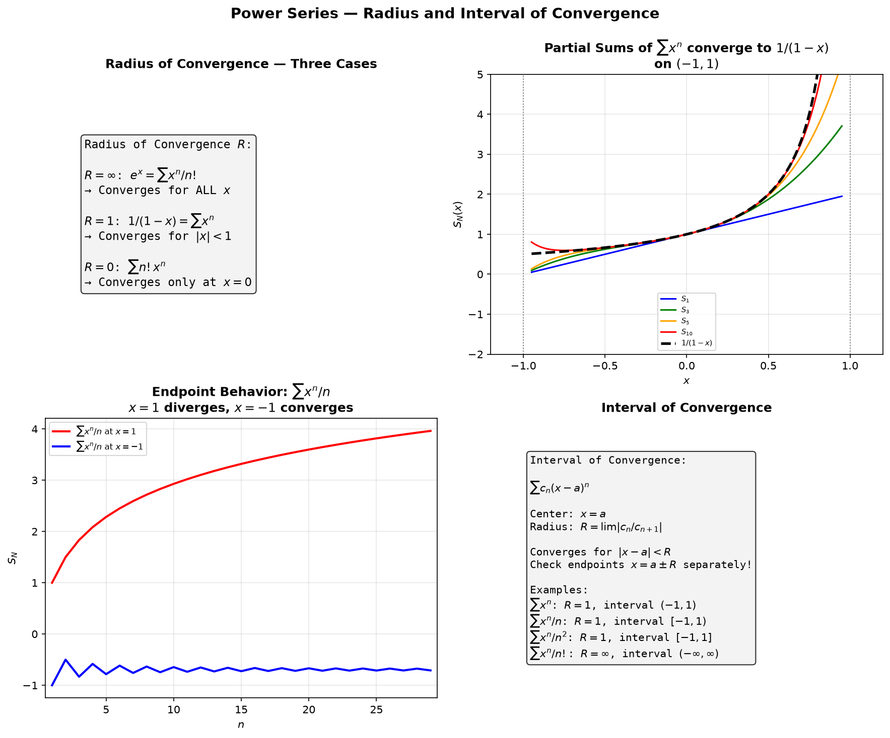
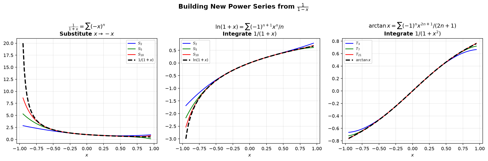

# Session 18B: Power Series — Where Does It Converge?

**Phase 2 — Classical Techniques | 60 min**

*Prerequisites: 18A (convergence tests), 14B (chain rule), 16A (FTC)*

---

## Example 1: What Is a Power Series?

$\displaystyle \sum_{n=0}^\infty c_n(x-a)^n = c_0 + c_1(x-a) + c_2(x-a)^2 + \cdots$

$a$ = center. The series is a **function of $x$**. Question: for which $x$ does it converge?

---

## Example 2: Radius of Convergence (🔗 18A)

Use the **Ratio Test** (or Root Test) from 18A on the terms:

$\displaystyle \lim_{n\to\infty}\left|\frac{c_{n+1}(x-a)^{n+1}}{c_n(x-a)^n}\right| = |x-a|\lim_{n\to\infty}\left|\frac{c_{n+1}}{c_n}\right| < 1$.

**Radius** $R = \displaystyle \lim_{n\to\infty}\left|\frac{c_n}{c_{n+1}}\right|$ (if the limit exists).

$\sum_{n=0}^\infty \frac{x^n}{n!}$: $R = \lim \frac{1/n!}{1/(n+1)!} = \lim (n+1) = \infty$. **Converges for all $x$.** This is $e^x$!

$\sum_{n=0}^\infty n!\,x^n$: $R = \lim \frac{n!}{(n+1)!} = \lim \frac{1}{n+1} = 0$. **Converges only at $x=0$.**

$\sum_{n=0}^\infty x^n$: $R = 1$. Converges for $|x|<1$, diverges for $|x|>1$. At $x=\pm1$: check separately (both diverge).

**Connection to geometric series** (🔗 12B1): This is the geometric series $\sum r^n$ with $r=x$. The radius $R=1$ comes directly from the geometric condition $|r|<1$.



*Graph 18B-1: Top-left — Three cases of radius of convergence. Top-right — Partial sums $S_N(x)$ of $\sum x^n$ converging to $1/(1-x)$ on $(-1,1)$. Bottom-left — Endpoint behavior of $\sum x^n/n$. Bottom-right — Interval of convergence reference.*

---

## Example 3: Interval of Convergence — Check the Endpoints

For $\sum \frac{x^n}{n}$: $R=1$. At $x=1$: $\sum 1/n$ diverges. At $x=-1$: $\sum (-1)^n/n$ converges (alternating).
**Interval**: $[-1, 1)$.

For $\sum \frac{x^n}{n^2}$: $R=1$. At $x=\pm1$: $\sum 1/n^2$ converges.
**Interval**: $[-1, 1]$.

---

## Example 4: Differentiation and Integration Term-by-Term (🔗 14A, 16A)

Within the radius of convergence, you can differentiate and integrate a power series **term by term** (🔗 14A for differentiation rules, 16A for FTC):

$\frac{d}{dx}\sum c_n(x-a)^n = \sum n c_n(x-a)^{n-1}$.
$\int \sum c_n(x-a)^n dx = C + \sum \frac{c_n}{n+1}(x-a)^{n+1}$.

**The radius of convergence stays the same** (endpoints may change).

---



*Graph 18B-2: Three key series built from $1/(1-x)$. Left — $1/(1+x)$ by substituting $x\to -x$. Middle — $\ln(1+x)$ by integrating $1/(1+x)$. Right — $\arctan x$ by integrating $1/(1+x^2)$. All converge on $(-1,1)$ and partial sums approach the true function.*

## Example 5: Building New Series from $\frac{1}{1-x}$ (🔗 12B1, 12C1)

The geometric series $\sum x^n$ from 12B1 is the foundation. By substituting, differentiating, and integrating, we build many series — similar to how 12C1 builds transformations from basic matrices.

$\frac{1}{1-x} = \sum_{n=0}^\infty x^n$, $|x|<1$.

Replace $x$ with $-x$: $\frac{1}{1+x} = \sum (-1)^n x^n$.
Replace $x$ with $x^2$: $\frac{1}{1-x^2} = \sum x^{2n}$.
Integrate: $\int \frac{1}{1-x}dx = -\ln(1-x) = \sum \frac{x^{n+1}}{n+1}$. So $\ln(1+x) = \sum_{n=1}^\infty \frac{(-1)^{n+1}x^n}{n}$.
Integrate $\frac{1}{1+x^2}$: $\arctan x = \sum_{n=0}^\infty \frac{(-1)^n x^{2n+1}}{2n+1}$.

---

## What We Just Did

```
(1) Power series: Σc_n(x-a)^n. Center a. Radius R from Ratio/Root test.
(2) Interval of convergence: (-R,R) guaranteed. Check endpoints separately.
(3) Term-by-term differentiation/integration preserves R.
(4) Build new series from geometric: substitute, differentiate, integrate.
```

---

## Practice 1

Find radius and interval for $\sum_{n=1}^\infty \frac{(x-2)^n}{3^n n}$.

→ Solutions: [Solutions](solutions/18B-solutions.md#practice-1)

---

## Practice 2

Find a power series for $\ln(1-x^2)$ using the geometric series.

→ Solutions: [Solutions](solutions/18B-solutions.md#practice-2)

---

## Practice 3

Differentiate $\sum_{n=0}^\infty \frac{x^n}{n!}$ term-by-term. What do you notice?

→ Solutions: [Solutions](solutions/18B-solutions.md#practice-3)

---

## Practice 4: Real Battle (🔗 12B1, 18A)

Find the interval of convergence for $\sum_{n=1}^\infty \frac{(x-1)^n}{n\cdot 3^n}$. Check both endpoints. Connect to the geometric series (12B1) and ratio test (18A).

---

## Practice 5: Real Battle — Series for $\pi$ (🔗 18C)

Use the series for $\arctan x$ to find a series for $\pi$. Hint: $\arctan 1 = \pi/4$. How many terms are needed to estimate $\pi$ to 3 decimal places? Connect to alternating series error bound.

---

## Basic Drills

**D1.** Find $R$ for $\sum_{n=0}^\infty \frac{x^n}{2^n}$.

**D2.** Find $R$ for $\sum_{n=1}^\infty \frac{n x^n}{3^n}$.

**D3.** Find interval for $\sum_{n=0}^\infty \frac{(-1)^n x^n}{n+1}$.

**D4.** Write $\frac{1}{1+2x}$ as a power series. For which $x$?

**D5.** Find a series for $\frac{1}{(1-x)^2}$ by differentiating $\frac{1}{1-x}$.

**D6.** Find a series for $\ln(1-x)$ by integrating $\frac{1}{1-x}$.

**D7.** Evaluate $\sum_{n=1}^\infty \frac{n}{2^n}$ by recognizing a differentiated series.

**D8.** Find interval for $\sum_{n=1}^\infty \frac{(x+1)^n}{n^2}$.

**D9.** Differentiate the series for $\sin x = \sum (-1)^n \frac{x^{2n+1}}{(2n+1)!}$.

**D10.** Find $R$ for $\sum_{n=0}^\infty \frac{(2n)!}{(n!)^2}x^n$. Use ratio test.

**D11.** Find a power series for $\frac{x}{(1-x)^2}$ by differentiating $\frac{1}{1-x}$.

**D12.** Evaluate $\sum_{n=0}^\infty \frac{(-1)^n}{2^n}$ by recognizing it as a geometric series.

> Solutions: [Solutions](solutions/18B-solutions.md#basic-drill)

---

## Advanced Drills

**A1.** Find the interval for $\sum_{n=1}^\infty \frac{n(x+3)^n}{4^n}$. Be careful with endpoints.

**A2.** Find a power series for $\frac{x}{1+x-2x^2}$ by partial fractions + geometric series.

**A3.** Use series to evaluate $\lim_{x\to0}\frac{e^x-1-x}{x^2}$.

**A4.** Prove $\sum_{n=1}^\infty \frac{n}{3^n} = \frac{3}{4}$ by differentiating a geometric series.

**A5.** Find the interval for $\sum_{n=1}^\infty \frac{(x-1)^n}{n\cdot5^n}$.

**A6.** Express $\int_0^{1/2} \frac{dx}{1+x^4}$ as a series. Compute to 4 decimal places.

**A7.** Find all $x$ for which $\sum_{n=0}^\infty \frac{n!\,(x-2)^n}{n^n}$ converges. Use ratio + Stirling.

**A8.** A power series satisfies $f'(x)=f(x)$ with $f(0)=1$. Find the series and identify $f$.

**A9.** Find the radius for $\sum_{n=0}^\infty \binom{2n}{n}x^n$ using the ratio test.

**A10.** Cauchy product: multiply the series for $e^x$ by itself. Show the result is the series for $e^{2x}$.

**A11.** (🔗 18A) Find the radius and interval of convergence for $\sum_{n=1}^\infty \frac{(3x-1)^n}{n\cdot 2^n}$. (Hint: rewrite as $\sum \frac{3^n}{n\cdot 2^n}(x-1/3)^n$.)

**A12.** Find a power series for $\ln\left(\frac{1+x}{1-x}\right)$ by combining the series for $\ln(1+x)$ and $\ln(1-x)$. What is its interval of convergence?

> Solutions: [Solutions](solutions/18B-solutions.md#advanced-drill)

---

## How to Read These Symbols

| Symbol | Reads as | Meaning |
|:---:|:---:|------|
| $\sum_{n=0}^{\infty} c_n (x-a)^n$ | "power series centered at a" | infinite polynomial — function represented as series around a |
| center | "center" / "a" | point around which the power series is expanded |
| radius of convergence $R$ | "radius of convergence" | series converges for |x-a|<R, diverges for |x-a|>R |
| interval of convergence | "interval of convergence" | (a-R, a+R) — endpoints must be checked separately |
| Ratio Test for $R$ | "ratio test for radius" | R = lim |c_n/c_{n+1}| if the limit exists |
| term-by-term differentiation | "term-by-term differentiation" | derivative of power series = sum of derivatives — valid inside radius |
| term-by-term integration | "term-by-term integration" | integral of power series = sum of integrals — valid inside radius |
| $e^x = \sum_{n=0}^{\infty} \frac{x^n}{n!}$ | "e to the x equals sum of x to the n over n factorial" | Maclaurin series for exponential — converges for all x |
| analytic function | "analytic function" | function that equals its power series in some interval |
| singular point | "singular point" | where function is not analytic — determines radius of convergence |

---

## Terminology

| What we call it | Math term | Notation |
|:---:|:---:|:---:|
| infinite polynomial around a | power series | $\sum c_n(x-a)^n$ |
| distance to nearest singularity | radius of convergence | $R$ |
| domain of convergence | interval of convergence | $(a-R, a+R)$ plus checked endpoints |
| differentiate/integrate term-by-term | termwise operations | valid for |x-a|<R |
| equals its power series | analytic function | locally represented by series |
