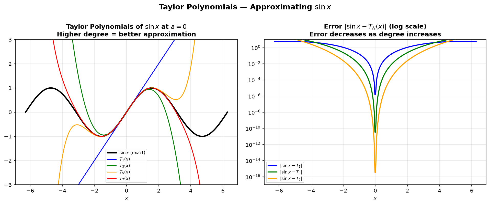
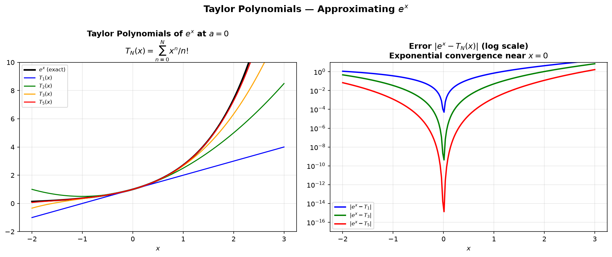

# Session 18C: Taylor Series — Approximating Any Function

**Phase 2 — Classical Techniques | 65 min**

*Prerequisites: 18B (power series), 14C (higher derivatives)*

---

## Example 1: Taylor Polynomials — The Idea (🔗 14C)

A Taylor polynomial $T_n(x)$ matches $f$ and its first $n$ derivatives at $x=a$ (🔗 14C for higher derivatives).

$T_1$ = tangent line. $T_2$ = tangent parabola (matches curvature). $T_3$ = matches jerk too.

$f(x)=\sin x$ at $a=0$:
$T_1(x)=x$. $T_3(x)=x-\frac{x^3}{6}$. $T_5(x)=x-\frac{x^3}{6}+\frac{x^5}{120}$.

*Graph 18C-1: Left — Taylor polynomials $T_1$, $T_3$, $T_5$, $T_7$ of $\sin x$ at $a=0$. Higher degree = better approximation over a wider interval. Right — Error $|\sin x - T_N(x)|$ on log scale: error decreases as degree increases, especially near the center.*

---

## Example 2: The Taylor Series Formula

$f(x) = \displaystyle \sum_{n=0}^\infty \frac{f^{(n)}(a)}{n!}(x-a)^n$.

When $a=0$, it's called a **Maclaurin series**.

---

## Example 3: Maclaurin Series — The Six You Must Memorize

| Function | Maclaurin Series | Radius |
|:--------:|:-----------------|:------:|
| $e^x$ | $\sum_{n=0}^\infty \frac{x^n}{n!} = 1+x+\frac{x^2}{2!}+\frac{x^3}{3!}+\cdots$ | $\infty$ |
| $\sin x$ | $\sum_{n=0}^\infty \frac{(-1)^n x^{2n+1}}{(2n+1)!}$ | $\infty$ |
| $\cos x$ | $\sum_{n=0}^\infty \frac{(-1)^n x^{2n}}{(2n)!}$ | $\infty$ |
| $\frac{1}{1-x}$ | $\sum_{n=0}^\infty x^n$ | $1$ |
| $\ln(1+x)$ | $\sum_{n=1}^\infty \frac{(-1)^{n+1}x^n}{n}$ | $1$ |
| $\arctan x$ | $\sum_{n=0}^\infty \frac{(-1)^n x^{2n+1}}{2n+1}$ | $1$ |

*Graph 18C-2: Left — Taylor polynomials $T_1$, $T_2$, $T_3$, $T_5$ of $e^x$ at $a=0$. Right — Error on log scale: exponential convergence near $x=0$.*

---

## Example 4: Building New Taylor Series

**Substitution**: Replace $x$ with something.
$\sin(x^2) = \sum (-1)^n \frac{(x^2)^{2n+1}}{(2n+1)!} = \sum (-1)^n \frac{x^{4n+2}}{(2n+1)!}$.

**Multiply/divide by $x$**:
$\frac{\sin x}{x} = \sum (-1)^n \frac{x^{2n}}{(2n+1)!}$.

**Binomial series** (🔗 12B2): $(1+x)^k = \sum_{n=0}^\infty \binom{k}{n}x^n = 1+kx+\frac{k(k-1)}{2!}x^2+\cdots$, $|x|<1$.

$\sqrt{1+x} = (1+x)^{1/2} = 1+\frac{x}{2}-\frac{x^2}{8}+\frac{x^3}{16}-\cdots$.
$\frac{1}{\sqrt{1-x^2}} = (1-x^2)^{-1/2} = 1+\frac{x^2}{2}+\frac{3x^4}{8}+\cdots$.

---

## Example 5: Error Bound — Lagrange Remainder

$f(x) = T_n(x) + R_n(x)$ where $R_n(x) = \frac{f^{(n+1)}(c)}{(n+1)!}(x-a)^{n+1}$ for some $c$ between $a$ and $x$.

For alternating series: $|R_n| \le |\text{first omitted term}|$.

**Estimate $e^{0.1}$ to 4 decimal places** using $n=3$: $1+0.1+\frac{0.01}{2}+\frac{0.001}{6}=1.105167$.
Error bound: $|R_3| \le \frac{e^{0.1}(0.1)^4}{24} \le \frac{3\cdot10^{-4}}{24} = 0.0000125 < 0.00005$. Good!

---

## Example 6: Limits Using Taylor Series (🔗 13A)

$\displaystyle \lim_{x\to0}\frac{\sin x - x}{x^3} = \lim_{x\to0}\frac{(x-\frac{x^3}{6}+\frac{x^5}{120}-\cdots)-x}{x^3} = -\frac{1}{6}$.

$\displaystyle \lim_{x\to0}\frac{e^x-1-x}{x^2} = \frac{1}{2}$.

**Why this works**: Taylor series reveal exactly how fast numerator and denominator approach 0. The lowest surviving power of $x$ determines the limit.

---

## Example 7: Definite Integrals Using Series (🔗 18B, 16A)

$\int_0^1 e^{-x^2}dx = \int_0^1\left(1-x^2+\frac{x^4}{2!}-\frac{x^6}{3!}+\cdots\right)dx = 1-\frac{1}{3}+\frac{1}{5\cdot2!}-\frac{1}{7\cdot3!}+\cdots$.

Term-by-term integration (🔗 18B) gives an alternating series — easy to estimate to any accuracy.

> **Up to here**: Taylor polynomial matches derivatives. Maclaurin series = Taylor at 0. Six must-memorize. Substitution/multiply/integrate to build new ones. Error bound via Lagrange or alternating first-term.

---

## Practice 1

Find the Maclaurin series for $f(x)=xe^x$.

→ Solutions: [Solutions](solutions/18C-solutions.md#practice-1)

---

## Practice 2

Find the Taylor series for $f(x)=\ln x$ centered at $a=1$.

→ Solutions: [Solutions](solutions/18C-solutions.md#practice-2)

---

## Practice 3

Use Taylor series to evaluate $\lim_{x\to0}\frac{\cos x-1+x^2/2}{x^4}$.

→ Solutions: [Solutions](solutions/18C-solutions.md#practice-3)

---

## Practice 4

Estimate $\int_0^{0.5} \sin(x^2)dx$ to 4 decimal places using series.

→ Solutions: [Solutions](solutions/18C-solutions.md#practice-4)

---

## Practice 5: Real Battle (🔗 12B2, 13A, 18B)

Use the binomial series (🔗 12B2) to find the Maclaurin series for $\arcsin x$. Integrate $(1-x^2)^{-1/2}$ term-by-term (🔗 18B). Then use your series to evaluate $\lim_{x\to0}\frac{\arcsin x - x}{x^3}$ (🔗 13A).

---

## Practice 6: Real Battle — Error Analysis (🔗 18B)

How many terms of the Maclaurin series for $e^x$ are needed to approximate $e$ (i.e., $e^1$) with error less than $10^{-6}$? Use the Lagrange remainder bound. Compare with the actual error after that many terms.

---

## Basic Drills

**D1.** Write the Maclaurin series for $e^{-x}$ (first 4 terms).

**D2.** Write the Maclaurin series for $\cos(2x)$ (first 4 nonzero terms).

**D3.** Find the 3rd-degree Taylor polynomial of $f(x)=\sqrt{x}$ at $a=4$.

**D4.** Find the Maclaurin series for $\frac{1}{1+x^2}$ and its radius.

**D5.** Find the Maclaurin series for $\ln(1-x)$.

**D6.** Use series to compute $\lim_{x\to0}\frac{e^x-1}{x}$.

**D7.** Find $T_2(x)$ (2nd-degree Taylor) for $f(x)=\tan x$ at $a=0$.

**D8.** Write the binomial series for $\frac{1}{\sqrt{1+x}} = (1+x)^{-1/2}$ (first 3 terms).

**D9.** Multiply the series for $e^x$ and $e^{-x}$. What do you get?

**D10.** Use $\cos x$ series to estimate $\cos(0.2)$ to 4 decimal places.

**D11.** Use the binomial series to write the first 3 nonzero terms of $(1+2x)^{1/3}$.

**D12.** Find the Taylor series for $f(x)=x^3-2x^2+3x-4$ at $a=1$ directly using the formula.

> Solutions: [Solutions](solutions/18C-solutions.md#basic-drill)

---

## Advanced Drills

**A1.** Find the Maclaurin series for $\sinh x = \frac{e^x-e^{-x}}{2}$.

**A2.** Prove $e^{i\theta} = \cos\theta + i\sin\theta$ using Maclaurin series.

**A3.** Find the Taylor series for $f(x)=\frac{1}{x}$ about $a=2$.

**A4.** Evaluate $\lim_{x\to0}\frac{\tan x - x}{x^3}$ using series.

**A5.** Compute $\int_0^1 \frac{\sin x}{x}dx$ to 4 decimal places using series.

**A6.** Find the Maclaurin series for $\arcsin x$ by integrating the binomial series for $(1-x^2)^{-1/2}$.

**A7.** How many terms of $\sin x$ series are needed to estimate $\sin(1)$ with error $<10^{-6}$?

**A8.** Find the sum: $1-\frac{1}{2}+\frac{1}{3}-\frac{1}{4}+\cdots$. Recognize the series.

**A9.** Derive the Taylor series for $\frac{1}{(1-x)^2}$ by differentiating the geometric series.

**A10.** Use the Lagrange remainder to prove that $e$ is irrational. (Sketch: assume $e=p/q$, multiply by $q!$, use remainder bound.)

**A11.** (🔗 13A, 18B) Use series to evaluate $\lim_{x\to 0}\frac{\sin x - x + x^3/6}{x^5}$. How many terms are needed?

**A12.** Find the Maclaurin series for $\ln(1+\sin x)$ up to $x^4$ by composing the series for $\ln(1+u)$ and $u=\sin x$.

> Solutions: [Solutions](solutions/18C-solutions.md#advanced-drill)

---

## How to Read These Symbols

| Symbol | Reads as | Meaning |
|:---:|:---:|------|
| Taylor series | "Taylor series" | f(x) = Σ f^{(n)}(a)/n! · (x-a)^n — infinite polynomial matching all derivatives at a |
| Maclaurin series | "Maclaurin series" | Taylor series centered at a=0 — special case |
| $n!$ | "n factorial" | product 1×2×3×...×n — grows extremely fast |
| $\sin x = x - \frac{x^3}{3!} + \frac{x^5}{5!} - \cdots$ | "sine x equals x minus x cubed over 3 factorial plus x to the fifth over 5 factorial minus ..." | Maclaurin series for sine — odd powers, alternating signs |
| $\cos x = 1 - \frac{x^2}{2!} + \frac{x^4}{4!} - \cdots$ | "cosine x equals one minus x squared over 2 factorial plus ..." | Maclaurin series for cosine — even powers, alternating signs |
| $e^x = 1 + x + \frac{x^2}{2!} + \frac{x^3}{3!} + \cdots$ | "e to the x equals one plus x plus x squared over 2 factorial ..." | Maclaurin series for exponential — all positive |
| $\frac{1}{1-x} = 1 + x + x^2 + x^3 + \cdots$ | "one over one minus x equals one plus x plus x squared ..." | geometric series — converges for |x|<1 |
| $\ln(1+x) = x - \frac{x^2}{2} + \frac{x^3}{3} - \cdots$ | "ln of one plus x equals x minus x squared over 2 plus x cubed over 3 ..." | Maclaurin series for natural log — alternating, converges for -1<x≤1 |
| Lagrange remainder | "Lagrange remainder" | R_n = f^{(n+1)}(ξ)/(n+1)! · (x-a)^{n+1} — bounds error of Taylor polynomial |
| $|R_n| \leq \frac{M}{(n+1)!}|x-a|^{n+1}$ | "absolute remainder less than or equal to M over n+1 factorial times x minus a to the n+1" | error bound — M = max of |f^{(n+1)}| on the interval |

---

## Terminology

| What we call it | Math term | Notation |
|:---:|:---:|:---:|
| infinite polynomial matching derivatives | Taylor series | $\sum \frac{f^{(n)}(a)}{n!}(x-a)^n$ |
| Taylor series at 0 | Maclaurin series | $\sum \frac{f^{(n)}(0)}{n!}x^n$ |
| error of n-th degree approximation | Lagrange remainder | $R_n = \frac{f^{(n+1)}(\xi)}{(n+1)!}(x-a)^{n+1}$ |
| product 1·2·3·...·n | factorial | $n!$ |
| bounding the remainder | error estimation | $|R_n| \leq \frac{M}{(n+1)!}|x-a|^{n+1}$ |
