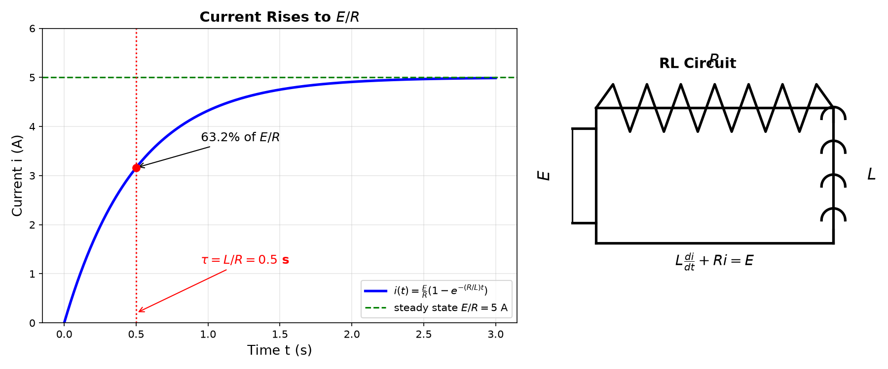

# Session 19A: ODE Modeling — Translating Nature into Equations

**Phase 2 — Classical Techniques | 65 min**

*Prerequisites: 15B (related rates), 10B (exponential growth/decay), 16A (FTC)*

> 💡 **Stuck?** Every problem has a collapsible **Hint** below it — click it only when you need a nudge.

---

## Example 1: What Is a Differential Equation?

An **ordinary differential equation (ODE)** is an equation whose unknown is a *function*, and which involves that function's derivatives. Instead of "find the number $x$", the question is **"find the function $y(t)$ whose rate of change behaves in a specified way."**

**Why they matter**: Nature rarely hands you a quantity — it hands you a *rate rule*. A population grows proportionally to itself; a hot object cools proportionally to the temperature gap; a tank's salt changes as inflow minus outflow. Each "how fast" statement is a differential equation, and *solving* it converts the rate-rule into the quantity itself. This session is about that translation (modeling); 19B is the full solving toolbox.

**Notation**:
- $y' = \frac{dy}{dx}$ — first derivative (rate of change).
- $y'' = \frac{d^2y}{dx^2}$ — second derivative (acceleration / curvature).
- An equation may mix $y$, $y'$, $y''$, ... and the independent variable.

**Order** = the highest derivative that appears:
- $\frac{dy}{dx} = ky$ — **1st order** (only $y'$).
- $y'' + y = 0$ — **2nd order** (contains $y''$).
- $y' = x + y$ — 1st order, with the independent variable $x$ appearing on the right.

(If the unknown function had several variables, the derivatives would be partial — a **PDE**. Those appear later in the curriculum.)

**What "solving" means**: a **solution** is a *function* that makes the equation true for every input in its domain. Checking a candidate answer is a purely mechanical job: substitute and verify.

**Worked check** — is $y = 3e^{2x}$ a solution of $y' = 2y$?

① Differentiate: $y' = 3\cdot2e^{2x} = 6e^{2x}$.
② Right side: $2y = 2\cdot3e^{2x} = 6e^{2x}$.
③ Both sides match for every $x$ → **yes**, $y = 3e^{2x}$ is a solution.

**General vs particular**:
- **General solution** — contains arbitrary constants (one per order): $y = Ce^{kt}$ works for *any* $C$ in $y' = ky$.
- **Particular solution** — the constants are fixed by an **initial condition** such as $y(0) = y_0$: here $C = y_0$, giving $y = y_0e^{kt}$.

**Method — Verify a proposed solution in 3 steps:**

(1) **Differentiate** the candidate to produce every derivative appearing in the ODE.

(2) **Substitute** the candidate and its derivatives into the equation.

(3) **Simplify** and check that both sides are identical for all inputs.

> **Geometric insight**: An ODE is a *rule for slopes*. The equation $y' = f(x,y)$ says: at every point $(x,y)$ in the plane, any solution curve passing through that point must have slope $f(x,y)$. Example 2 draws exactly this — a slope field is a differential equation turned into a picture.

---

## Example 2: Slope Fields — Seeing Solutions Before Solving

For $\frac{dy}{dx} = f(x,y)$, draw a short line segment with slope $f(x,y)$ at each grid point $(x,y)$. **Solution curves follow the field.**

$\frac{dy}{dx} = x+y$: the slope field shows curves that look like $-x-1+Ce^x$.

**Verify the claimed shape**: $y = -x-1+Ce^x$ → $y' = -1+Ce^x$. Right side: $x + y = x + (-x-1+Ce^x) = -1+Ce^x$. ✓ They match, so these curves really do follow the field.

**How to read the field**: at each grid point, draw a short segment with slope $f(x,y)$ — where the segments are steep the solution is changing fast, where they are flat ($f=0$) the solution is momentarily constant, and curves follow the stream of segments like a river follows its current.


---

## Example 3: Exponential Model — $y' = ky$

**Setup**: the rate of change is proportional to the amount itself. (More individuals → more births per hour → faster growth.)

**Solve by separation of variables** (🔗 16A):

① Separate: $\frac{dy}{dt} = ky$ → $\frac{dy}{y} = k\,dt$ (valid for $y \neq 0$).
② Integrate both sides (FTC): $\int\frac{dy}{y} = \int k\,dt$ → $\ln|y| = kt + C_1$.
③ Exponentiate: $|y| = e^{kt+C_1} = e^{C_1}e^{kt}$. Absorb the sign into the constant: $y = Ce^{kt}$.

So $\frac{dy}{dt} = ky$ ⟹ $y(t) = Ce^{kt}$; with $y(0) = y_0$, $C = y_0$ and $y = y_0e^{kt}$.

$k>0$: exponential growth (population, compound interest). $k<0$: exponential decay (radiation, cooling).

**Doubling time**: $t_2 = \frac{\ln 2}{k}$. **Half-life**: $t_{1/2} = \frac{\ln 2}{|k|}$.


*Graph 19A-2: 3D — the surface $y = e^{kt}$ over the $(t, k)$ plane. When $k>0$ the surface rises; $k<0$ it falls; $k=0$ it's flat. 2D — families of growth (red, $k=0.5$) and decay (blue, $k=-0.5$) with different starting values. 1D — log-scale reveals doubling time and half-life are the same horizontal distance: $\ln 2 / |k| \approx 1.39$.*

Bacteria double every 3 hours. $k = \frac{\ln 2}{3} \approx 0.231$. From 1000: $P(t)=1000e^{0.231t}$.

**Method — Building a model in 3 steps:**

(1) **Name the quantity.** Decide what function $y(t)$ you are tracking (population, temperature, amount, current...).

(2) **Write its rate of change.** Either a proportionality law ($y' = ky$) or a balance law: $\frac{dy}{dt} = \text{rate in} - \text{rate out}$.

(3) **Attach the initial condition** $y(0) = y_0$, then solve and interpret (doubling time, steady state, etc.).

> This 3-step loop is the whole session. Every example below is just a different "rate in / rate out" or "proportional to" story.

---

## Example 4: Continuous Compound Interest

This is Example 3 with a new name: the balance changes proportionally to itself.

**Solve**: $\frac{dA}{dt} = rA$ → separate: $\frac{dA}{A} = r\,dt$ → $\ln A = rt + C$ → $A(t) = Ce^{rt}$. With $A(0) = P$: $C = P$, so $A(t) = Pe^{rt}$.

\$1000 at 5% continuous for 10 years: $A = 1000e^{0.05\cdot10} = 1000e^{0.5} \approx 1000(1.6487) \approx \$1648.72$.

**Compare with yearly compounding** (🔗 12B1): $1000(1.05)^{10} \approx \$1628.89$. Continuous pays more because interest earns interest *every instant* — the exact bridge between the two is Example 10 ($r = e^k$).

---

## Example 5: Newton's Law of Cooling

**Setup**: a hot object cools proportionally to the temperature gap between it and the room.

**Solve by substitution** — reduce to Example 3:

① Let $u = T - T_{\text{env}}$ (the "excess temperature"). Since $T_{\text{env}}$ is constant, $u' = T'$.
② The ODE becomes $u' = -ku$, so by Example 3: $u = Ce^{-kt}$.
③ Back-substitute: $T(t) = T_{\text{env}} + Ce^{-kt}$. With $T(0) = T_0$: $C = T_0 - T_{\text{env}}$.

$$T(t) = T_{\text{env}} + (T_0 - T_{\text{env}})e^{-kt}.$$

**Worked example** — Coffee at 90°C in a 20°C room; after 5 min it is 60°C. Find $k$:

① Plug in: $60 = 20 + (90-20)e^{-5k} = 20 + 70e^{-5k}$.
② Isolate the exponential: $70e^{-5k} = 40$ → $e^{-5k} = \frac{40}{70} = \frac47$.
③ Take $\ln$ and solve: $-5k = \ln\frac47$ → $k = \frac15\ln\frac74 \approx 0.112$ per min.

> **Interpretation**: the excess temperature $T - T_{\text{env}}$ halves every $\frac{\ln 2}{k} \approx 6.2$ minutes — the "half-life of the gap."

---

## Example 6: Mixing Problems

Tank: 100L water, 0.5 kg/L salt enters at 2 L/min, drains at 2 L/min.

$\frac{dA}{dt} = \text{rate in} - \text{rate out} = (0.5)(2) - \frac{A}{100}(2) = 1 - \frac{A}{50}$, i.e. $\frac{dA}{dt} + \frac{A}{50} = 1$, with $A(0) = 0$.

**Solve (linear 1st-order, 3 steps):**

① **Homogeneous part**: $\frac{dA}{dt} + \frac{A}{50} = 0$ → $A_h = Ce^{-t/50}$ (Example 3 with $k=-\frac1{50}$).
② **One particular solution**: the right side is the constant $1$, so try $A_p = c$: plug in → $\frac{c}{50} = 1$ → $c = 50$.
③ **General + initial condition**: $A(t) = 50 + Ce^{-t/50}$; $A(0)=0$ → $0 = 50 + C$ → $C = -50$.

$$A(t) = 50\left(1 - e^{-t/50}\right).$$

**Interpret**: as $t\to\infty$, $A \to 50$ kg — the steady state where rate in = rate out ($1 = \frac{A}{50}$). After one time constant ($t=50$ min) it has covered $1-e^{-1} \approx 63.2\%$ of the way: $A(50) \approx 31.6$ kg.

**Method — Mixing problems in 3 steps:**

(1) **Track the volume** $V(t)$ — constant if inflow = outflow, otherwise $V(t) = V_0 + (\text{in} - \text{out})t$.

(2) **Write the two rates**: rate in $= c_{\text{in}} \times f_{\text{in}}$; rate out $= \frac{A(t)}{V(t)} \times f_{\text{out}}$ (concentration $\times$ flow).

(3) **Set** $\frac{dA}{dt} = \text{rate in} - \text{rate out}$ and solve (linear 1st-order — 19B has the full toolbox).

---

## Example 7: Logistic Growth — The S-Curve

$\frac{dP}{dt} = kP\left(1 - \frac{P}{L}\right)$. $L$ = carrying capacity.

**Behavior**: When $P$ is small, near-exponential $P' \approx kP$. As $P \to L$, growth slows to zero.

**Verify the solution** (the full derivation is in 19B): candidate $P(t) = \frac{L}{1 + Ae^{-kt}}$.

① Differentiate (chain rule): $P' = \frac{L\,A\,k\,e^{-kt}}{(1+Ae^{-kt})^2}$.
② Right side: $kP\left(1-\frac{P}{L}\right) = k\cdot\frac{L}{1+Ae^{-kt}}\cdot\frac{Ae^{-kt}}{1+Ae^{-kt}} = \frac{kLAe^{-kt}}{(1+Ae^{-kt})^2}$.
③ Both sides match ✓ — the candidate really is a solution.

**Pinning $A$ with $P(0)=P_0$**: $P_0 = \frac{L}{1+A}$ → $1+A = \frac{L}{P_0}$ → $A = \frac{L-P_0}{P_0}$.

**Example**: $P_0=100$, $L=1000$, $k=0.5$: $A = \frac{900}{100} = 9$, so $P(t)=\frac{1000}{1+9e^{-0.5t}}$.

**Inflection (fastest growth)**: $P'' = 0$ occurs at $P = \frac{L}{2} = 500$. Growth is slow near $P=0$ (few individuals) and near $P=L$ (no room left), so the maximum growth rate sits in the middle — exactly at half the capacity.


---

## Example 8: Radioactive Decay Chain

**Setup**: $A$ decays into $B$, which decays into $C$: $A \xrightarrow{k_1} B \xrightarrow{k_2} C$.

- $\frac{dA}{dt} = -k_1A$ — $A$ only leaves.
- $\frac{dB}{dt} = k_1A - k_2B$ — $B$ is born from $A$, dies into $C$.

① **Solve for $A$** (Example 3): $A(t) = A_0e^{-k_1t}$.

② **Solve for $B$**: substitute $A$ into the $B$-equation to get a linear 1st-order ODE:
$\frac{dB}{dt} + k_2B = k_1A_0e^{-k_1t}$, with $B(0)=0$.

Integrating factor $e^{k_2t}$: $\frac{d}{dt}\left(e^{k_2t}B\right) = k_1A_0e^{(k_2-k_1)t}$.

Integrate: $e^{k_2t}B = \frac{k_1A_0}{k_2-k_1}e^{(k_2-k_1)t} + C$ → $B(t) = \frac{k_1A_0}{k_2-k_1}e^{-k_1t} + Ce^{-k_2t}$.

$B(0)=0$ fixes $C = -\frac{k_1A_0}{k_2-k_1}$:

$$B(t) = \frac{k_1A_0}{k_2-k_1}\left(e^{-k_1t} - e^{-k_2t}\right) \quad (k_1 \neq k_2).$$

**Shape**: $B$ starts at 0, is fed by $A$, peaks, then dies away. Peak time: set $B' = 0$ → $t_{\max} = \frac{\ln(k_2/k_1)}{k_2-k_1}$.

---

## Example 9: Phase Line — 1D Autonomous Systems (🔗 15A)

An **autonomous** ODE has no explicit $t$: $\frac{dy}{dt} = f(y)$. The behavior depends only on $y$.

**Phase line**: Draw the $y$-axis, mark equilibria ($f(y)=0$), and indicate direction of motion.

$y' = y(1-y)(y-2)$:
- Equilibria: $y=0,1,2$.
- Sign of $f(y)$: $y<0$ → $f>0$ (positive, moving right), $0<y<1$ → $f<0$, $1<y<2$ → $f>0$, $y>2$ → $f<0$.
- Stability: $y=0$ (stable, attracts), $y=1$ (unstable, repels), $y=2$ (stable, attracts).


*Graph 19A-Phase: The phase line for $y' = y(1-y)(y-2)$. Left — 3D view showing solution curves over $(t,y)$. Middle — the 1D phase line with arrows showing direction. Right — time traces $y(t)$ for different initial conditions converge to or diverge from equilibria.*

> **🔗 Bridge to 15A (Curve Analysis)**: The phase line is the ODE version of the **first derivative test** from 15A. In 15A, you find where $f'(x)=0$ (critical points) and check sign of $f'$. Here, you find where $f(y)=0$ (equilibria) and check sign of $f$. Same logic — different context. The phase line also connects to the **sign chart** method from 08A (inequalities): mark zeros, test intervals, read sign.

**Method — Phase line in 3 steps:**

(1) **Find equilibria**: solve $f(y) = 0$.

(2) **Test one point per interval** between equilibria to get the sign of $f(y)$.

(3) **Draw arrows**: $f>0$ → move right (up on a vertical line), $f<0$ → move left (down). Where arrows point in on both sides → **stable** (sink); where they point out on both sides → **unstable** (source).

---

## Example 10: Discrete vs Continuous Growth — Same DNA (🔗 12B1)

**Discrete (12B1)**: $a_{n+1} = r a_n$, $a_n = a_0 r^n$. Population multiplies each generation.
**Continuous (19A)**: $\frac{dy}{dt} = ky$, $y(t) = y_0 e^{kt}$. Population grows every instant.

**The connection**: $r = e^k$ (or equivalently $k = \ln r$).

| Concept | Discrete (12B1) | Continuous (19A) |
|:---|:---|:---|
| Growth rule | $a_{n+1} = r a_n$ | $y' = ky$ |
| Solution | $a_n = a_0 r^n$ | $y(t) = y_0 e^{kt}$ |
| Doubling | $n_2 = \frac{\ln 2}{\ln r}$ steps (solve $r^{n_2}=2$) | $t_2 = \frac{\ln 2}{k}$ |
| Relation | $r = e^k$, $k = \ln r$ | — |

**Example**: 5% annual interest
- **Discrete** (compounded yearly): $a_n = a_0 (1.05)^n$. After 10 years: $a_0 \times 1.05^{10} \approx 1.629a_0$.
- **Continuous**: $k = \ln(1.05) \approx 0.04879$, $y(t) = a_0 e^{0.04879t}$. After 10 years: $a_0 e^{0.4879} \approx 1.629a_0$.

**Same result** — same mathematics, different formulations.

> **🔗 12B1 Connection**: The infinite geometric series $S_\infty = \frac{a_1}{1-r}$ converges when $|r|<1$. The continuous analogue: the integral $\int_0^\infty y_0 e^{-kt}\,dt = \frac{y_0}{k}$ converges when $k>0$ (decay). The discrete/continuous bridge $r = e^k$ makes these two formulas equivalent.

---

## Example 11: Torricelli's Law — Draining Tank

A tank with cross-sectional area $A(y)$ at height $y$ drains through a hole of area $a$ at the bottom.

**Torricelli's law**: $\frac{dV}{dt} = -a\sqrt{2gy}$ (velocity of efflux = $\sqrt{2gy}$ from energy conservation).

For a cylindrical tank of radius $R$: $V = \pi R^2 y$, so $\pi R^2 \frac{dy}{dt} = -a\sqrt{2g}\sqrt{y}$.

Separable: $\frac{dy}{\sqrt{y}} = -\frac{a\sqrt{2g}}{\pi R^2}\,dt$. Integrate: $2\sqrt{y} = -\frac{a\sqrt{2g}}{\pi R^2}t + C$.

If $y(0)=H$: $2\sqrt{H} = C$. Then $\sqrt{y} = \sqrt{H} - \frac{a\sqrt{2g}}{2\pi R^2}t$.

**Drain time**: set $y=0$ → $T = \frac{2\pi R^2\sqrt{H}}{a\sqrt{2g}}$.

**Numeric example** (this is A11): $R = 0.5$ m, $H = 2$ m, hole $a = 2\,\text{cm}^2 = 2\times10^{-4}\,\text{m}^2$, $g = 9.8$:

$T = \frac{2\pi(0.5)^2\sqrt{2}}{(2\times10^{-4})\sqrt{2(9.8)}} \approx \frac{2.2213}{8.854\times10^{-4}} \approx 2509$ s $\approx 42$ min.

**Units sanity check**: $\frac{\text{m}^2\cdot\sqrt{\text{m}}}{\text{m}^2\cdot\sqrt{\text{m}/\text{s}^2}} = \frac{\text{m}^{5/2}}{\text{m}^{5/2}/\text{s}} = \text{s}$ ✓ — the formula really outputs a time, provided you convert everything to SI first.

---

## Example 12: RL Circuit — The Electrical Cousin

An RL circuit has a resistor $R$ and inductor $L$ in series with a voltage source $E(t)$. Kirchhoff's voltage law says the drops across $R$ and $L$ must balance the source:

$$L\frac{di}{dt} + Ri = E(t) \quad\Longleftrightarrow\quad \frac{di}{dt} = \frac{E(t) - Ri}{L}.$$

The inductor resists sudden changes in current; the resistor dissipates energy. For **constant** $E$ with $i(0)=0$:

$$i(t) = \frac{E}{R}\left(1 - e^{-\frac{R}{L}t}\right).$$

- **Steady state**: $i \to \frac{E}{R}$ (the inductor becomes a plain wire; only $R$ limits the current).
- **Time constant**: $\tau = \frac{L}{R}$ — the time to reach $1 - e^{-1} \approx 63.2\%$ of steady state.

**Example**: $R = 2\,\Omega$, $L = 1\,\text{H}$, $E = 10\,\text{V}$: $i(t) = 5(1-e^{-2t})$, $i_{ss} = 5$ A, $\tau = 0.5$ s, and $i(0.5) = 5(1-e^{-1}) \approx 3.16$ A.



*Graph 19A-5: Left — current $i(t) = 5(1-e^{-2t})$ rises to the steady state $5$ A; the dashed line marks the time constant $\tau = L/R = 0.5$ s, where the current reaches $63.2\%$ of its final value. Right — the circuit: battery $E$, resistor $R$, inductor $L$ in series.*

> **Geometric insight**: Newton's cooling, the mixing tank, and the RL circuit are all the **same** linear model $y' = a - by$: $y$ starts at some value and runs exponentially toward a steady state $a/b$. One formula, three physical settings — temperature, salt, current.

---

## What We Just Did

```
(1) ODE = equation linking a function to its derivatives. Order = highest derivative.
    General solution has constants; particular solution fits initial conditions.

(2) Slope field = direction field: draw slope f(x,y) at grid points; solution curves follow.

(3) Exponential model y' = ky → y = Ce^{kt}. k>0 growth, k<0 decay.
    Doubling time t₂ = ln2/k. Half-life t½ = ln2/|k|.

(4) Linear "approach" models y' = a − by: Newton cooling (T → Tenv), mixing (A → steady),
    RL circuit (i → E/R). Same shape: Ce^{−bt} + steady state.

(5) Logistic y' = ky(1−y/L) → L/(1+Ae^{−kt}). S-curve, inflection at P = L/2.

(6) Phase line (autonomous y'=f(y)): equilibria f(y)=0; sign of f gives direction;
    stable = sink (arrows in), unstable = source (arrows out). = 1D version of 15A's
    first-derivative test.

(7) Discrete ↔ continuous: a_{n+1} = r a_n vs y' = ky, bridged by r = e^k (k = ln r).

(8) Torricelli: drain rate ∝ √(depth) (energy conservation). RL circuit: L di/dt + Ri = E,
    current approaches E/R with time constant L/R.
```

---

## Common Mistakes

### Mistake 1: Mixing — using the initial volume for rate out

When the volume changes (Practice 4), rate out $= \frac{A}{V(t)} \times f_{\text{out}}$ with $V(t) = V_0 + (\text{in} - \text{out})t$. Using the constant initial volume is wrong — and don't forget to find when the tank overflows.

### Mistake 2: Logistic — confusing $A$ or thinking the inflection is at $L$

$A = \frac{L - P_0}{P_0}$, and the S-curve's inflection point is at $P = \frac{L}{2}$ (fastest growth), not at $P = L$ (where growth stops).

### Mistake 3: Newton cooling — wrong sign or wrong "room temperature"

The ODE is $T' = -k(T - T_{\text{env}})$ with $k > 0$, so $T$ approaches $T_{\text{env}}$ (not 0, and not runaway). Writing $+k$ gives the wrong direction.

### Mistake 4: Discrete vs continuous — using $r$ as $k$

5% yearly interest means $r = 1.05$; the continuous rate is $k = \ln 1.05 \approx 0.0488$, **not** $0.05$. They give the same answer only when used correctly via $r = e^k$.

### Mistake 5: Unit mismatch in physical models

Torricelli (A11): hole area in $\text{cm}^2$ must become $\text{m}^2$ before plugging into $T = \frac{2\pi R^2\sqrt{H}}{a\sqrt{2g}}$ with $g = 9.8$. Always convert units first.

---

## Practice 1

A population doubles every 5 years and starts at 1000. Write the ODE and solution.

<details>
<summary>💡 Hint</summary>

Exponential model: $P' = kP$. Doubling time $t_2 = \frac{\ln 2}{k} = 5$, so $k = \frac{\ln 2}{5}$. Then $P(t) = 1000e^{kt}$.

</details>

→ Solutions: [Solutions](solutions/19A-solutions.md#practice-1)

---

## Practice 2

A corpse at 32°C is found in a 20°C room. Normal body temp is 37°C. Cooling constant $k=0.1$. Estimate time of death.

<details>
<summary>💡 Hint</summary>

$T(t) = 20 + (37-20)e^{-0.1t}$. Time of death is when $T = 32$: solve $32 = 20 + 17e^{-0.1t}$ for $t$.

</details>

→ Solutions: [Solutions](solutions/19A-solutions.md#practice-2)

---

## Practice 3

Solve the logistic ODE: $P'=0.2P(1-P/500)$, $P(0)=50$. Find $P(10)$.

<details>
<summary>💡 Hint</summary>

$L=500$, $A = \frac{L-P_0}{P_0} = \frac{450}{50} = 9$. So $P(t) = \frac{500}{1+9e^{-0.2t}}$; plug in $t=10$.

</details>

→ Solutions: [Solutions](solutions/19A-solutions.md#practice-3)

---

## Practice 4: Real Battle

A 200L tank initially contains 100L pure water. Brine (2 kg/L salt) enters at 3 L/min. Mixture drains at 2 L/min. Find the amount of salt when the tank overflows.

<details>
<summary>💡 Hint</summary>

Volume grows: $V(t) = 100 + t$, overflow at $V=200$ → $t=100$. Rate in $= 2\times3 = 6$; rate out $= \frac{A}{100+t}\times 2$. ODE: $A' + \frac{2}{100+t}A = 6$; integrate with integrating factor $(100+t)^2$.

</details>

→ Solutions: [Solutions](solutions/19A-solutions.md#practice-4)

---

## Practice 5

Draw the phase line for $y' = y^2 - 3y + 2 = (y-1)(y-2)$. Label each equilibrium as stable or unstable.

<details>
<summary>💡 Hint</summary>

Equilibria at $y=1, 2$. Test one point per interval (e.g. $y=0, 1.5, 3$): $y=1$ is stable, $y=2$ is unstable.

</details>

→ Solutions: [Solutions](solutions/19A-solutions.md#practice-5)

---

## Practice 6: Real Battle — Discrete vs Continuous (🔗 12B1)

A population doubles every 3 hours.
(a) Write the discrete model $a_{n+1}=ra_n$ and find $r$.
(b) Write the continuous model $P'=kP$ and find $k$.
(c) After 24 hours, what does each model predict? Are they the same? Why or why not?

<details>
<summary>💡 Hint</summary>

(a) $r=2$ per 3-hour step. (b) $k = \frac{\ln 2}{3}$. (c) 24 hours = 8 steps: discrete gives $2^8 = 256$; continuous gives $e^{k\cdot24} = e^{8\ln2} = 256$. They agree because 24 is an exact multiple of the doubling time.

</details>

→ Solutions: [Solutions](solutions/19A-solutions.md#practice-6)

---

## Basic Drills

> Stepping stones for the Advanced drills. Each D is **ONE component skill**; the Advanced problems (A1–A12) chain 2–3 of these. The *(→ A#)* tag says which Advanced problem this component feeds. If a component feels unfamiliar, it's worked out in the examples above.

**D1.** Solve $e^{-0.1t} = 0.4$ for $t$. Give the exact ($\ln$) form and an approximation. *(→ A1, A5, A6)*

<details>
<summary>💡 Hint</summary>

$\ln$ both sides: $-0.1t = \ln 0.4$ → $t = -10\ln 0.4 = 10\ln 2.5 \approx 9.16$.

</details>

**D2.** Radium-226 has half-life 1600 years. Write $N(t) = N_0e^{-kt}$ with $k$ filled in, and find the fraction remaining after 3200 years. *(→ A1)*

<details>
<summary>💡 Hint</summary>

$k = \frac{\ln 2}{1600}$. After 3200 yr = 2 half-lives: $N = N_0e^{-2\ln2} = \frac{N_0}{4}$.

</details>

**D3.** Solve $y' = -0.05y$, $y(0)=200$. Find $y(20)$. *(→ A2)*

<details>
<summary>💡 Hint</summary>

$y(t) = 200e^{-0.05t}$; $y(20) = 200e^{-1} \approx 73.6$.

</details>

**D4.** A 100L tank holds 200 kg of salt; pure water flushes it at 5 L/min (constant volume). Write $A' = \text{rate in} - \text{rate out}$ and simplify it to the form $A' = -bA$. *(→ A2, A4, A10)*

<details>
<summary>💡 Hint</summary>

Rate out $= \frac{A}{100}\times5 = \frac{A}{20}$ → $A' = -\frac{A}{20}$ ($b = \frac{1}{20}$).

</details>

**D5.** For $P' = 0.4P(1-P/800)$ with $P(0)=200$: (a) what is $L$? (b) what is $A$ in $P(t) = \frac{L}{1+Ae^{-kt}}$? *(→ A3, A6)*

<details>
<summary>💡 Hint</summary>

$L = 800$; $A = \frac{L-P_0}{P_0} = \frac{600}{200} = 3$.

</details>

**D6.** $P(t) = \frac{800}{1+3e^{-0.4t}}$ has its inflection at $P = \frac{L}{2} = 400$. Write and solve the equation you get from setting $P(t) = 400$. *(→ A3)*

<details>
<summary>💡 Hint</summary>

$\frac{800}{1+3e^{-0.4t}} = 400$ → $1+3e^{-0.4t} = 2$ → $e^{-0.4t} = \frac13$ → $t = \frac{\ln 3}{0.4} \approx 2.75$.

</details>

**D7.** For $y' = 3 - 0.5y$ with $y(0)=0$: what is the steady state $y_{ss}$? Write $y(t) = y_{ss}(1-e^{-bt})$. *(→ A7, A8, A10)*

<details>
<summary>💡 Hint</summary>

$y_{ss} = \frac{3}{0.5} = 6$; $y(t) = 6(1-e^{-0.5t})$.

</details>

**D8.** Newton's cooling: $T(t) = 30 + 50e^{-kt}$ with $T(5) = 60$. First isolate $e^{-5k}$, then solve for $k$. *(→ A5)*

<details>
<summary>💡 Hint</summary>

$60 = 30 + 50e^{-5k}$ → $e^{-5k} = \frac35$ → $k = \frac15\ln\frac53 \approx 0.102$.

</details>

**D9.** Solve both for $t$ (exact $\ln$ forms): (a) $100e^{0.2t} = 900$ (b) $\frac{1000}{1+9e^{-0.2t}} = 900$. *(→ A9)*

<details>
<summary>💡 Hint</summary>

(a) $e^{0.2t} = 9$ → $t = 5\ln 9$. (b) $1+9e^{-0.2t} = \frac{10}{9}$ → $e^{-0.2t} = \frac1{81}$ → $t = 5\ln 81$.

</details>

**D10.** A lake: $P' = 10 - \frac{P}{10^4}$, $P(0)=0$. Find the steady state $P_{ss}$ and write $P(t) = P_{ss}(1-e^{-bt})$. *(→ A10)*

<details>
<summary>💡 Hint</summary>

$P_{ss} = 10\times10^4 = 10^5$; $b = 10^{-4}$, so $P(t) = 10^5\left(1-e^{-t/10^4}\right)$.

</details>

**D11.** Convert $2\,\text{cm}^2$ to $\text{m}^2$, then plug $R = 0.5$ m, $H = 2$ m, $a$ (converted), $g = 9.8$ into $T = \frac{2\pi R^2\sqrt{H}}{a\sqrt{2g}}$ and evaluate $T$. *(→ A11)*

<details>
<summary>💡 Hint</summary>

$2\,\text{cm}^2 = 2\times10^{-4}\,\text{m}^2$. $T = \frac{2\pi(0.25)\sqrt2}{(2\times10^{-4})\sqrt{19.6}} \approx 2509$ s $\approx 42$ min.

</details>

**D12.** Find all equilibria (don't classify yet): (a) $y' = y(y-3)(y+1)$ (b) $y' = y\sin y$ on $0<y<2\pi$. *(→ A12)*

<details>
<summary>💡 Hint</summary>

(a) $y = -1, 0, 3$. (b) Since $y>0$: $\sin y = 0$ → $y = \pi$ inside the open interval.

</details>

> Solutions: [Solutions](solutions/19A-solutions.md#basic-drill)

---

## Advanced Drills

**A1.** Carbon-14 half-life 5730 years. A fossil has 15% original C-14. How old?

<details>
<summary>💡 Hint</summary>

$N(t)=N_0e^{-kt}$ with $k=\frac{\ln 2}{5730}$. Set $0.15=e^{-kt}$ and solve: $t = 5730\cdot\frac{\ln(1/0.15)}{\ln 2}$.

</details>

**A2.** A tank initially has 100L of 2 kg/L salt. Pure water enters at 5 L/min, drains at 5 L/min. Find salt after 20 min.

<details>
<summary>💡 Hint</summary>

Volume constant at 100L, initial salt $200$ kg. $A' = 0 - \frac{A}{100}\cdot5 = -\frac{A}{20}$, so $A(t)=200e^{-t/20}$; at $t=20$: $200e^{-1}$.

</details>

**A3.** Logistic: $P'=0.4P(1-P/800)$, $P(0)=200$. Find inflection time (when $P=L/2$).

<details>
<summary>💡 Hint</summary>

$A=(800-200)/200=3$, so $P(t)=\frac{800}{1+3e^{-0.4t}}$. Set $P=400$: $1+3e^{-0.4t}=2$, so $t = \frac{\ln 3}{0.4}$.

</details>

**A4.** Two tanks in series: tank 1 drains into tank 2. Write the system of ODEs.

<details>
<summary>💡 Hint</summary>

Each tank gets its own balance: $A_1' = \text{in}_1 - \text{out}_1$; $A_2' = (\text{outflow from tank 1}) - \text{out}_2$. The outflow of tank 1 is the inflow of tank 2.

</details>

**A5.** Newton cooling: object at 80° in 30° room. At $t=5$, $T=60$. Find $k$, then find $T(15)$.

<details>
<summary>💡 Hint</summary>

$T(t)=30+50e^{-kt}$. $T(5)=60$: $e^{-5k}=\frac35$, so $k=\frac15\ln\frac53$. Then $T(15)=30+50e^{-15k}$.

</details>

**A6.** A rumor spreads logistically. 10 people know at $t=0$, 100 know at $t=2$, $L=5000$. Find $k$.

<details>
<summary>💡 Hint</summary>

$A=(5000-10)/10=499$, so $P(t)=\frac{5000}{1+499e^{-kt}}$. Use $P(2)=100$ to solve $499e^{-2k}=49$, so $k=\frac12\ln\frac{499}{49}$.

</details>

**A7.** Drug concentration: $\frac{dC}{dt} = -kC + D$ (constant infusion $D$). Find equilibrium $C_{ss}$.

<details>
<summary>💡 Hint</summary>

At equilibrium $\frac{dC}{dt}=0$: $-kC_{ss}+D=0$, so $C_{ss}=D/k$.

</details>

**A8.** Terminal velocity: $m\frac{dv}{dt}=mg-kv$. Find $v(t)$ and terminal speed.

<details>
<summary>💡 Hint</summary>

It's an approach model with $v(0)=0$: $v(t)=\frac{mg}{k}\left(1-e^{-(k/m)t}\right)$. Terminal speed $= mg/k$.

</details>

**A9.** Compare exponential vs logistic: both start at 100, $k=0.2$, but logistic has $L=1000$. Find $t$ when logistic reaches 900 vs exponential reaches 900.

<details>
<summary>💡 Hint</summary>

Logistic $A=9$: $\frac{1000}{1+9e^{-0.2t}}=900$ → $e^{-0.2t}=\frac19\cdot\frac{1}{9}$, so $t=5\ln81$. Exponential: $100e^{0.2t}=900$ → $t=5\ln9$.

</details>

**A10.** A lake (10⁶ m³) receives polluted water (0.1 kg/m³) at 100 m³/day, drains at same rate. Initially clean. Write ODE, find pollution after 1 year.

<details>
<summary>💡 Hint</summary>

$P' = 0.1\times100 - \frac{P}{10^6}\times100 = 10 - \frac{P}{10^4}$. Steady state $10^5$ kg: $P(t)=10^5(1-e^{-t/10^4})$; use $t=365$.

</details>

**A11.** Torricelli: A cylindrical tank (radius 0.5 m, height 2 m) drains through a 2 cm² hole. Find drain time. Use $g=9.8$.

<details>
<summary>💡 Hint</summary>

$T = \frac{2\pi R^2\sqrt{H}}{a\sqrt{2g}}$ with $R=0.5$, $H=2$, $g=9.8$, and $a=2\times10^{-4}$ m² (convert cm²!).

</details>

**A12.** For $y' = y\sin y$ on $0<y<2\pi$, find all equilibria and classify stability using the phase line.

<details>
<summary>💡 Hint</summary>

$y\sin y=0$: since $y>0$, only $\sin y=0$ → $y=\pi$ inside $(0,2\pi)$. Just left of $\pi$, $\sin y>0$ (rising toward $\pi$); just right, $\sin y<0$ (falling back) — stable.

</details>

> Solutions: [Solutions](solutions/19A-solutions.md#advanced-drill)

---

## Today's Procedure

```
Step 1: Recognize the model — y'=ky (growth/decay), y'=k(L−y) (approach to a limit),
         y'=ky(1−y/L) (logistic), dA/dt = rate in − rate out (mixing/tanks),
         y'=f(y) (autonomous → phase line).

Step 2: Build the ODE — name the quantity; write rate = in − out (or a proportional law);
         attach the initial condition y(0)=y₀.

Step 3: Solve — exponential: y = Ce^{kt}. Approach: y = steady + Ce^{−kt}.
         Logistic: L/(1+Ae^{−kt}) with A=(L−P₀)/P₀. Mixing: linear 1st order
         (full toolbox in 19B).

Step 4: Interpret — doubling time ln2/k, half-life ln2/|k|, steady state, carrying
         capacity L, time constant L/R or 1/b. Discrete↔continuous: r = e^k.

Step 5: Qualitatively — slope field first; then phase line: equilibria f(y)=0,
         test signs, label stable (sink) vs unstable (source).
```

---

## How to Read These Symbols

| Symbol | Reads as | Meaning |
|:---:|:---:|------|
| $\frac{dy}{dx}$ | "d y d x" / "the derivative of y with respect to x" | instantaneous rate of change, slope |
| $y'$ | "y prime" | shorthand for dy/dx |
| $\frac{dP}{dt}$ | "d P d t" / "the rate of change of P" | time derivative — how P changes per unit time |
| $\int$ | "integral" | integration symbol — finds area, accumulation |
| $e^{kt}$ | "e to the k t" | exponential function — e ≈ 2.718, base of natural growth/decay |
| $\ln$ | "natural log" / "ell-en" | logarithm base e — inverse of e^x |
| $\lim$ | "limit" | limit — value approached, not necessarily reached |
| $t_{1/2}$ | "t-half" / "half-life" | time for quantity to decrease by half |
| $t_2$ | "t-two" / "doubling time" | time for quantity to double |
| $k$ | "k" / "rate constant" | growth (k>0) or decay (k<0) rate |
| $L$ | "L" / "carrying capacity" | upper bound in logistic growth — saturation level |
| $C$ | "C" / "constant of integration" | arbitrary constant — determined by initial condition |
| $T_{\text{env}}$ | "T env" / "environment temperature" | ambient temperature in Newton cooling |
| $f(y)=0$ | "f of y equals zero" | equilibrium condition — no change over time |
| $\uparrow$ / $\downarrow$ | "up arrow / down arrow" | direction of motion on the phase line — increasing / decreasing |
| $a_{n+1}=ra_n$ | "a n plus one equals r a n" | discrete growth — geometric sequence (12B1) |
| $r = e^k$ | "r equals e to the k" | bridge between discrete ratio and continuous rate |


---

## Terminology

| What we call it | Math term | Notation |
|:---:|:---:|:---:|
| equation with derivatives | ordinary differential equation (ODE) | $\frac{dy}{dx}=f(x,y)$ |
| solution + arbitrary constant | general solution | $y = Ce^{kt}$ |
| solution with specific initial value | particular solution | $y(0)=y_0$ plugged in |
| exponential growth/decay model | $y'=ky$ | $y=Ce^{kt}$ |
| S-shaped growth to a limit | logistic equation | $\frac{dP}{dt}=kP(1-P/L)$ |
| temperature approaches environment | Newton's law of cooling | $\frac{dT}{dt}=-k(T-T_{\text{env}})$ |
| inflow minus outflow | mixing problem | $\frac{dA}{dt} = \text{rate in} - \text{rate out}$ |
| 1D stability diagram | phase line | $y$-axis with arrows showing direction of $y'$ |
| stable equilibrium | attractor / sink | nearby solutions converge to it |
| unstable equilibrium | repellor / source | nearby solutions diverge from it |
| discrete growth (12B1) | geometric sequence | $a_{n+1}=ra_n$, $a_n = a_0r^n$ |
| continuous ↔ discrete bridge | $r = e^k$ | $r$ (ratio) = $e^k$ (continuous rate) |
