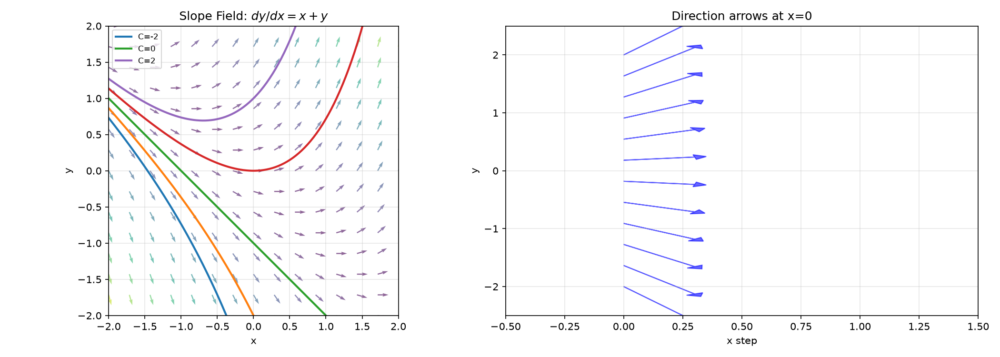
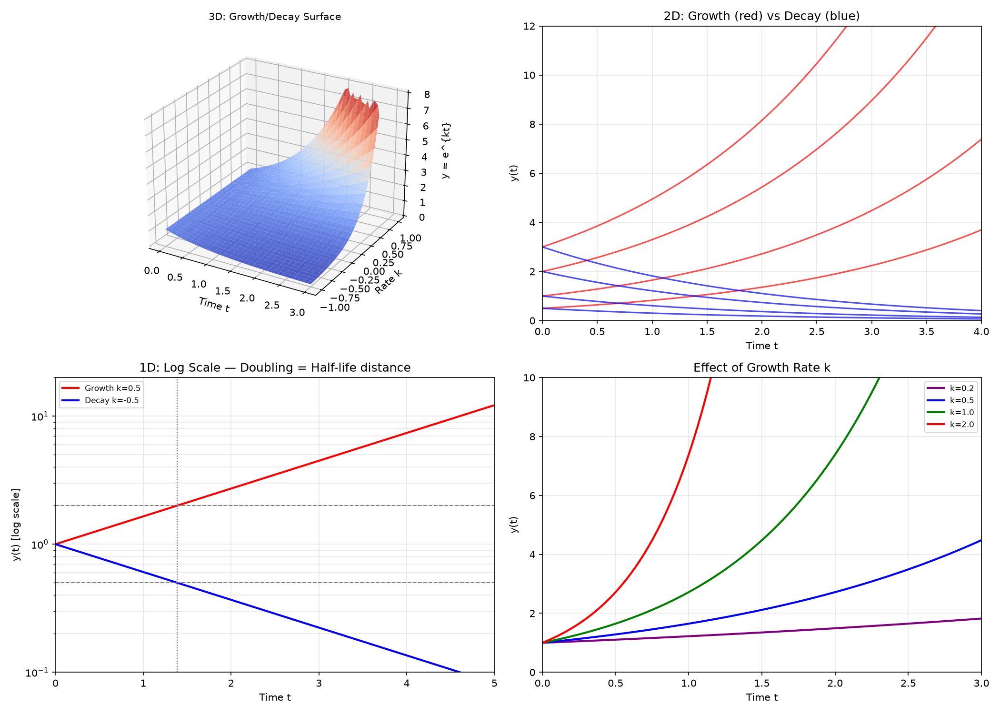
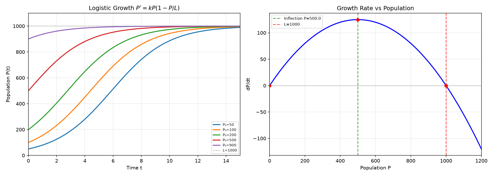
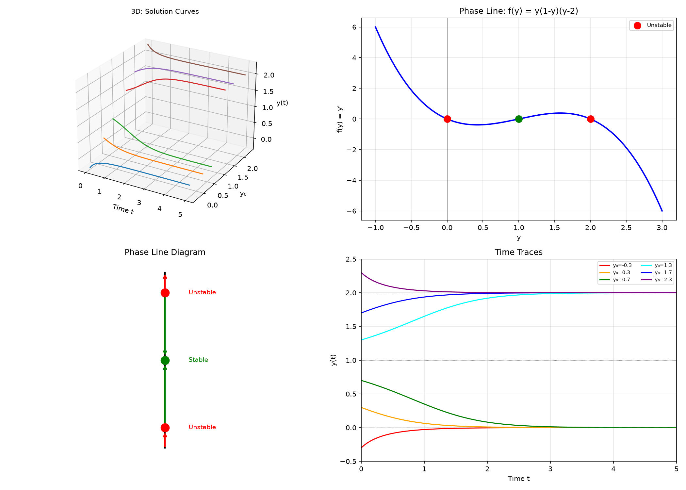

# Session 19A: ODE Modeling — Translating Nature into Equations

**Phase 2 — Classical Techniques | 65 min**

*Prerequisites: 15B (related rates), 10B (exponential growth/decay), 16A (FTC)*

---

## Example 1: What Is a Differential Equation?

An ODE relates a function $y$ to its derivatives. **Order** = highest derivative appearing.

$\frac{dy}{dx} = ky$ (1st order). $y''+y=0$ (2nd order).

A **solution** is any function satisfying the equation. **General solution** has arbitrary constants; **particular solution** satisfies initial conditions.

---

## Example 2: Slope Fields — Seeing Solutions Before Solving

For $\frac{dy}{dx} = f(x,y)$, draw a short line segment with slope $f(x,y)$ at each grid point $(x,y)$. **Solution curves follow the field.**

$\frac{dy}{dx} = x+y$: the slope field shows curves that look like $-x-1+Ce^x$.

---

## Example 3: Exponential Model — $y' = ky$

$\frac{dy}{dx} = ky$ → $y = Ce^{kt}$.

$k>0$: exponential growth (population, compound interest). $k<0$: exponential decay (radiation, cooling).

**Doubling time**: $t_2 = \frac{\ln 2}{k}$. **Half-life**: $t_{1/2} = \frac{\ln 2}{|k|}$.

*Graph 19A-2: 3D — the surface $y = e^{kt}$ over the $(t, k)$ plane. When $k>0$ the surface rises; $k<0$ it falls; $k=0$ it's flat. 2D — families of growth (red, $k=0.5$) and decay (blue, $k=-0.5$) with different starting values. 1D — log-scale reveals doubling time and half-life are the same horizontal distance: $\ln 2 / |k| \approx 1.39$.*

Bacteria double every 3 hours. $k = \frac{\ln 2}{3} \approx 0.231$. From 1000: $P(t)=1000e^{0.231t}$.

---

## Example 4: Continuous Compound Interest

$\frac{dA}{dt} = rA$ with $A(0)=P$ → $A(t) = Pe^{rt}$.

\$1000 at 5% continuous for 10 years: $A = 1000e^{0.5} \approx \$1648.72$.

---

## Example 5: Newton's Law of Cooling

$\frac{dT}{dt} = -k(T - T_{\text{env}})$. Let $u = T - T_{\text{env}}$: $\frac{du}{dt} = -ku$ → $u = Ce^{-kt}$.

$T(t) = T_{\text{env}} + (T_0 - T_{\text{env}})e^{-kt}$.

Coffee at 90°C in 20°C room. After 5 min: 60°C. Find $k$:
$60 = 20 + 70e^{-5k}$ → $e^{-5k} = 40/70 = 4/7$ → $k = \frac{1}{5}\ln\frac{7}{4} \approx 0.112$.

---

## Example 6: Mixing Problems

Tank: 100L water, 0.5 kg/L salt enters at 2 L/min, drains at 2 L/min.

$\frac{dA}{dt} = \text{rate in} - \text{rate out} = (0.5)(2) - \frac{A}{100}(2) = 1 - \frac{A}{50}$.

Linear 1st-order: $\frac{dA}{dt} + \frac{A}{50} = 1$. Solution: $A(t) = 50 + Ce^{-t/50}$. With $A(0)=0$: $A(t)=50(1-e^{-t/50})$. → Limits to 50 kg.

---

## Example 7: Logistic Growth — The S-Curve

$\frac{dP}{dt} = kP\left(1 - \frac{P}{L}\right)$. $L$ = carrying capacity.

**Behavior**: When $P$ is small, near-exponential $P' \approx kP$. As $P \to L$, growth slows to zero.

Solution: $P(t) = \frac{L}{1 + Ae^{-kt}}$, where $A = \frac{L-P_0}{P_0}$.

$P_0=100$, $L=1000$, $k=0.5$: $P(t)=\frac{1000}{1+9e^{-0.5t}}$. Inflection at $P=500$.

---

## Example 8: Radioactive Decay Chain

$A \xrightarrow{k_1} B \xrightarrow{k_2} C$. $\frac{dA}{dt} = -k_1A$, $\frac{dB}{dt} = k_1A - k_2B$.

$A=A_0e^{-k_1t}$. $B = \frac{k_1A_0}{k_2-k_1}(e^{-k_1t}-e^{-k_2t})$ (if $k_1\neq k_2$).

---

## Example 9: Phase Line — 1D Autonomous Systems (🔗 15A)

An **autonomous** ODE has no explicit $t$: $\frac{dy}{dt} = f(y)$. The behavior depends only on $y$.

**Phase line**: Draw the $y$-axis, mark equilibria ($f(y)=0$), and indicate direction of motion.

$y' = y(1-y)(y-2)$:
- Equilibria: $y=0,1,2$.
- Sign of $f(y)$: $y<0$ → $f<0$ (negative, moving left), $0<y<1$ → $f>0$, $1<y<2$ → $f<0$, $y>2$ → $f>0$.
- Stability: $y=0$ (unstable, repels), $y=1$ (stable, attracts), $y=2$ (unstable, repels).

*Graph 19A-Phase: The phase line for $y' = y(1-y)(y-2)$. Left — 3D view showing solution curves over $(t,y)$. Middle — the 1D phase line with arrows showing direction. Right — time traces $y(t)$ for different initial conditions converge to or diverge from equilibria.*

> **🔗 Bridge to 15A (Curve Analysis)**: The phase line is the ODE version of the **first derivative test** from 15A. In 15A, you find where $f'(x)=0$ (critical points) and check sign of $f'$. Here, you find where $f(y)=0$ (equilibria) and check sign of $f$. Same logic — different context. The phase line also connects to the **sign chart** method from 08A (inequalities): mark zeros, test intervals, read sign.

---

## Example 10: Discrete vs Continuous Growth — Same DNA (🔗 12B1)

**Discrete (12B1)**: $a_{n+1} = r a_n$, $a_n = a_0 r^n$. Population multiplies each generation.
**Continuous (19A)**: $\frac{dy}{dt} = ky$, $y(t) = y_0 e^{kt}$. Population grows every instant.

**The connection**: $r = e^k$ (or equivalently $k = \ln r$).

| Concept | Discrete (12B1) | Continuous (19A) |
|:---|:---|:---|
| Growth rule | $a_{n+1} = r a_n$ | $y' = ky$ |
| Solution | $a_n = a_0 r^n$ | $y(t) = y_0 e^{kt}$ |
| Doubling | $n_2 = \log_2(1/r)$... Wait — $n_2$ steps for $r^n=2$ | $t_2 = \ln 2/k$ |
| Relation | $r = e^k$, $k = \ln r$ | — |

**Example**: 5% annual interest
- **Discrete** (compounded yearly): $a_n = a_0 (1.05)^n$. After 10 years: $a_0 \times 1.05^{10} \approx 1.629a_0$.
- **Continuous**: $k = \ln(1.05) \approx 0.04879$, $y(t) = a_0 e^{0.04879t}$. After 10 years: $a_0 e^{0.4879} \approx 1.629a_0$.

**Same result** — same mathematics, different formulations.

> **🔗 12B1 Connection**: The infinite geometric series $S_\infty = \frac{a_1}{1-r}$ converges when $|r|<1$. The continuous analogue: the integral $\int_0^\infty y_0 e^{-kt}\,dt = \frac{y_0}{k}$ converges when $k>0$ (decay). The discrete/continuous bridge $r = e^k$ makes these two formulas equivalent.

---

## Example 11: Torricelli's Law — Draining Tank

A tank with cross-sectional area $A(y)$ at height $y$ drains through a hole of area $a$ at the bottom.

**Torricelli's law**: $\frac{dV}{dt} = -a\sqrt{2gy}$ (velocity of efflux = $\sqrt{2gy}$ from energy conservation).

For a cylindrical tank of radius $R$: $V = \pi R^2 y$, so $\pi R^2 \frac{dy}{dt} = -a\sqrt{2g}\sqrt{y}$.

Separable: $\frac{dy}{\sqrt{y}} = -\frac{a\sqrt{2g}}{\pi R^2}\,dt$. Integrate: $2\sqrt{y} = -\frac{a\sqrt{2g}}{\pi R^2}t + C$.

If $y(0)=H$: $2\sqrt{H} = C$. Then $\sqrt{y} = \sqrt{H} - \frac{a\sqrt{2g}}{2\pi R^2}t$.

**Drain time**: set $y=0$ → $T = \frac{2\pi R^2\sqrt{H}}{a\sqrt{2g}}$.

> **Up to here**: ODE = equation with derivatives. Slope field visualizes solutions. Exponential $y'=ky$ governs growth/decay. Logistic = S-curve with carrying capacity. Phase line = 1D stability diagram. Discrete/continuous = same math, different language. Torricelli = gravity-driven draining.

---

## Practice 1

A population doubles every 5 years and starts at 1000. Write the ODE and solution.

→ Solutions: [Solutions](solutions/19A-solutions.md#practice-1)

---

## Practice 2

A corpse at 32°C is found in a 20°C room. Normal body temp is 37°C. Cooling constant $k=0.1$. Estimate time of death.

→ Solutions: [Solutions](solutions/19A-solutions.md#practice-2)

---

## Practice 3

Solve the logistic ODE: $P'=0.2P(1-P/500)$, $P(0)=50$. Find $P(10)$.

→ Solutions: [Solutions](solutions/19A-solutions.md#practice-3)

---

## Practice 4: Real Battle

A 200L tank initially contains 100L pure water. Brine (2 kg/L salt) enters at 3 L/min. Mixture drains at 2 L/min. Find the amount of salt when the tank overflows.

→ Solutions: [Solutions](solutions/19A-solutions.md#practice-4)

---

## Practice 5

Draw the phase line for $y' = y^2 - 3y + 2 = (y-1)(y-2)$. Label each equilibrium as stable or unstable.

→ Solutions: [Solutions](solutions/19A-solutions.md#practice-5)

---

## Practice 6: Real Battle — Discrete vs Continuous (🔗 12B1)

A population doubles every 3 hours.
(a) Write the discrete model $a_{n+1}=ra_n$ and find $r$.
(b) Write the continuous model $P'=kP$ and find $k$.
(c) After 24 hours, what does each model predict? Are they the same? Why or why not?

→ Solutions: [Solutions](solutions/19A-solutions.md#practice-6)

---

## Basic Algebra Drill — ODE Modeling (12 Problems)

**D1.** Solve $y'=3y$, $y(0)=5$.

**D2.** Solve $y'=-0.5y$, $y(0)=100$. Find half-life.

**D3.** Write the ODE for continuous compounding at 4%.

**D4.** A cooling object: $T'=-0.2(T-25)$, $T(0)=100$. Find $T(10)$.

**D5.** Logistic: $P'=0.3P(1-P/600)$, $P(0)=100$. What is $L$?

**D6.** Find the slope at $(1,2)$ for $dy/dx = xy - y^2$.

**D7.** Is $y=e^{2x}$ a solution of $y'-2y=0$? Verify.

**D8.** A tank has 50L water, salt enters at 1 kg/L, 3 L/min. Drains at 3 L/min initially 0 kg salt. Write the ODE for $A(t)$.

**D9.** Doubling time is 8 hours. Find $k$.

**D10.** Sketch the slope field direction at $(0,0), (1,0), (0,1)$ for $dy/dx = x-y$.

**D11.** Draw the phase line for $y' = y(y-3)$. Which equilibrium is stable?

**D12.** A continuous 6% interest vs yearly compounding at 6%. Which grows faster after 1 year? After 10 years? (🔗 12B1)

> Solutions: [Solutions](solutions/19A-solutions.md#basic-drill)

---

## Advanced Algebra Drill — ODE Modeling (12 Problems)

**A1.** Carbon-14 half-life 5730 years. A fossil has 15% original C-14. How old?

**A2.** A tank initially has 100L of 2 kg/L salt. Pure water enters at 5 L/min, drains at 5 L/min. Find salt after 20 min.

**A3.** Logistic: $P'=0.4P(1-P/800)$, $P(0)=200$. Find inflection time (when $P=L/2$).

**A4.** Two tanks in series: tank 1 drains into tank 2. Write the system of ODEs.

**A5.** Newton cooling: object at 80° in 30° room. At $t=5$, $T=60$. Find $k$, then find $T(15)$.

**A6.** A rumor spreads logistically. 10 people know at $t=0$, 100 know at $t=2$, $L=5000$. Find $k$.

**A7.** Drug concentration: $\frac{dC}{dt} = -kC + D$ (constant infusion $D$). Find equilibrium $C_{ss}$.

**A8.** Terminal velocity: $m\frac{dv}{dt}=mg-kv$. Find $v(t)$ and terminal speed.

**A9.** Compare exponential vs logistic: both start at 100, $k=0.2$, but logistic has $L=1000$. Find $t$ when logistic reaches 900 vs exponential reaches 900.

**A10.** A lake (10⁶ m³) receives polluted water (0.1 kg/m³) at 100 m³/day, drains at same rate. Initially clean. Write ODE, find pollution after 1 year.

**A11.** Torricelli: A cylindrical tank (radius 0.5 m, height 2 m) drains through a 2 cm² hole. Find drain time. Use $g=9.8$.

**A12.** For $y' = y\sin y$ on $0<y<2\pi$, find all equilibria and classify stability using the phase line.

> Solutions: [Solutions](solutions/19A-solutions.md#advanced-drill)

---

## How to Read These Symbols

| Symbol | Reads as | Meaning |
|:---:|:---:|------|
| $\frac{dy}{dx}$ | "d y d x" / "the derivative of y with respect to x" | instantaneous rate of change, slope |
| $y'$ | "y prime" | shorthand for dy/dx |
| $\frac{dP}{dt}$ | "d P d t" / "the rate of change of P" | time derivative — how P changes per unit time |
| $\int$ | "integral" | integration symbol — finds area, accumulation |
| $e^{kt}$ | "e to the k t" | exponential function — e ≈ 2.718, base of natural growth/decay |
| $\ln$ | "natural log" / "ell-en" | logarithm base e — inverse of e^x |
| $\lim$ | "limit" | limit — value approached, not necessarily reached |
| $t_{1/2}$ | "t-half" / "half-life" | time for quantity to decrease by half |
| $t_2$ | "t-two" / "doubling time" | time for quantity to double |
| $k$ | "k" / "rate constant" | growth (k>0) or decay (k<0) rate |
| $L$ | "L" / "carrying capacity" | upper bound in logistic growth — saturation level |
| $C$ | "C" / "constant of integration" | arbitrary constant — determined by initial condition |
| $T_{\text{env}}$ | "T env" / "environment temperature" | ambient temperature in Newton cooling |
| $f(y)=0$ | "f of y equals zero" | equilibrium condition — no change over time |
| $\uparrow$ / $\downarrow$ | "up arrow / down arrow" | direction of motion on the phase line — increasing / decreasing |
| $a_{n+1}=ra_n$ | "a n plus one equals r a n" | discrete growth — geometric sequence (12B1) |
| $r = e^k$ | "r equals e to the k" | bridge between discrete ratio and continuous rate |

---

## Terminology

| What we call it | Math term | Notation |
|:---:|:---:|:---:|
| equation with derivatives | ordinary differential equation (ODE) | $\frac{dy}{dx}=f(x,y)$ |
| solution + arbitrary constant | general solution | $y = Ce^{kt}$ |
| solution with specific initial value | particular solution | $y(0)=y_0$ plugged in |
| exponential growth/decay model | $y'=ky$ | $y=Ce^{kt}$ |
| S-shaped growth to a limit | logistic equation | $\frac{dP}{dt}=kP(1-P/L)$ |
| temperature approaches environment | Newton's law of cooling | $\frac{dT}{dt}=-k(T-T_{\text{env}})$ |
| inflow minus outflow | mixing problem | $\frac{dA}{dt} = \text{rate in} - \text{rate out}$ |
| 1D stability diagram | phase line | $y$-axis with arrows showing direction of $y'$ |
| stable equilibrium | attractor / sink | nearby solutions converge to it |
| unstable equilibrium | repellor / source | nearby solutions diverge from it |
| discrete growth (12B1) | geometric sequence | $a_{n+1}=ra_n$, $a_n = a_0r^n$ |
| continuous ↔ discrete bridge | $r = e^k$ | $r$ (ratio) = $e^k$ (continuous rate) |
