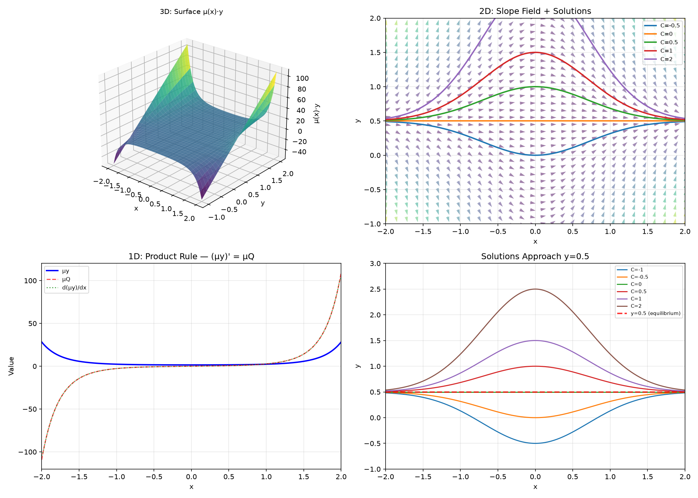

# Session 19B: First-Order Solution Methods

**Phase 2 — Classical Techniques | 65 min**

*Prerequisites: 19A (ODE modeling), 16A/B (integration techniques)*

---

## Example 1: Separable Equations

If $\frac{dy}{dx} = g(x)h(y)$: separate → $\int \frac{dy}{h(y)} = \int g(x)dx$.

$\frac{dy}{dx} = xy$. Separate: $\int \frac{dy}{y} = \int x\,dx$. $\ln|y| = \frac{x^2}{2}+C$. $y = Ce^{x^2/2}$.

$\frac{dy}{dx} = \frac{x}{y}$: $y\,dy = x\,dx$. $\frac{y^2}{2} = \frac{x^2}{2}+C$. $y^2 = x^2 + C$.

**Always isolate $dy/dx$ first, then separate.**

---

## Example 2: Separable with Trig and Exponential

$\frac{dy}{dx} = y^2\cos x$. Separate: $\int y^{-2}dy = \int \cos x\,dx$. $-\frac{1}{y} = \sin x + C$. $y = \frac{-1}{\sin x + C}$.

$\frac{dy}{dx} = e^{x+y} = e^x e^y$. $\int e^{-y}dy = \int e^x dx$. $-e^{-y} = e^x + C$. $y = -\ln(C - e^x)$.

---

## Example 3: Linear First-Order — Integrating Factor

**Standard form**: $y' + P(x)y = Q(x)$. **Integrating factor**: $\mu(x) = e^{\int P(x)dx}$.

Multiply ODE by $\mu$: $\frac{d}{dx}(\mu y) = \mu Q$. Integrate: $y = \frac{1}{\mu}\int \mu Q\,dx + \frac{C}{\mu}$.

**Why it works**: $\mu' = \mu P$, so $(\mu y)' = \mu y' + \mu' y = \mu(y'+Py) = \mu Q$.

*Graph 19B: 3D — the surface $\mu y$ for $y' + 2xy = x$ with $\mu = e^{x^2}$. Multiplying by $\mu$ turns the left side into an exact derivative. 2D — slope field with solution curves $y = 0.5 + Ce^{-x^2}$. The red line $y=0.5$ is the equilibrium ($C=0$). 1D — the product rule in action: $(\mu y)'$ (orange) exactly equals $\mu Q = xe^{x^2}$ (red dashed).*

---

## Example 4: Integrating Factor in Action

$y' + 2xy = x$. $P(x)=2x$, $\mu = e^{\int 2x\,dx} = e^{x^2}$.

$e^{x^2}y' + 2xe^{x^2}y = xe^{x^2}$. Left side = $(e^{x^2}y)'$.

$e^{x^2}y = \int xe^{x^2}dx = \frac{1}{2}e^{x^2} + C$. $y = \frac{1}{2} + Ce^{-x^2}$.

---

## Example 5: $y' + \frac{1}{x}y = x^2$

$P=1/x$, $\mu = e^{\ln x} = x$. $(xy)' = x^3$. $xy = \frac{x^4}{4} + C$. $y = \frac{x^3}{4} + \frac{C}{x}$.

---

## Example 6: Logistic Equation in Full

$\frac{dP}{dt} = kP(1-P/L)$. This is separable!

$\int \frac{dP}{P(1-P/L)} = \int k\,dt$. Use partial fractions: $\frac{1}{P(1-P/L)} = \frac{1}{P} + \frac{1/L}{1-P/L}$.

$\ln|P| - \ln|1-P/L| = kt + C$. $\frac{P}{1-P/L} = Ae^{kt}$. Solve: $P = \frac{L}{1+Be^{-kt}}$ where $B = \frac{L-P_0}{P_0}$.

---

## Example 7: Equilibrium Solutions and Stability

For $\frac{dy}{dt} = f(y)$, equilibrium where $f(y)=0$.

$y' = y(1-y)$: equilibria at $y=0,1$. $y=0$ unstable (small positive pushes away). $y=1$ stable (nearby solutions converge to 1).

---

## Example 8: Interval of Validity — Where Does the Solution Actually Work?

When you solve an ODE, the solution may only be valid on a **specific interval**. The general solution formula might suggest a wider domain, but the actual solution with initial conditions might blow up at finite $x$.

$y' = y^2$, $y(0)=1$. Separate: $\int y^{-2}dy = \int dx$ → $-\frac{1}{y} = x + C$. With $y(0)=1$: $-1 = C$.

$-\frac{1}{y} = x - 1$ → $y = \frac{1}{1-x}$.

**This solution is only valid for $x < 1$.** At $x=1$, $y\to\infty$ (vertical asymptote). The solution doesn't "stop" at $x=1$ — it blows up.

**Why this matters**: The formula $y=1/(1-x)$ exists for all $x\neq1$, but the initial condition at $x=0$ only determines the solution on $(-\infty, 1)$. If you started at $x=2$ with $y(2)=-1$, you'd get a different branch.

**Interval of validity** = the largest interval containing the initial point where the solution exists and is well-defined.

$y' = \frac{1}{y}$, $y(0)=2$. Separate: $y\,dy = dx$ → $\frac{y^2}{2} = x + C$. With $y(0)=2$: $2 = C$.

$y^2 = 2x + 4$ → $y = \sqrt{2x+4}$. Valid for $x > -2$. At $x=-2$, $y=0$, and the ODE $y'=1/y$ blows up.

> **🔗 Bridge to 15A (Domain Analysis)**: In 15A, you find the domain of a function before analyzing it. The interval of validity is the same idea — the solution of an ODE is only meaningful where it stays finite and differentiable. Just as $\sqrt{x}$ is only defined for $x\ge0$, the solution $y=1/(1-x)$ is only defined for $x<1$ (with that initial condition).

---

## Example 9: Bernoulli Application — Logistic with Harvesting

A fish population grows logistically ($k=0.3$, $L=5000$) but is harvested at a constant rate $H=200$ fish per year.

$\frac{dP}{dt} = 0.3P\left(1-\frac{P}{5000}\right) - 200 = 0.3P - 0.00006P^2 - 200$.

This is a **Bernoulli equation** with $n=2$: $P' - 0.3P = -0.00006P^2 - 200$. Wait — the constant $200$ makes it not purely Bernoulli. But rewrite as:

$\frac{dP}{dt} = -0.00006(P^2 - 5000P + 3,\!333,\!333)$

Find equilibria: $P^2 - 5000P + 3,\!333,\!333 = 0$.

$P = \frac{5000 \pm \sqrt{25\times10^6 - 13.33\times10^6}}{2} = \frac{5000 \pm \sqrt{11.67\times10^6}}{2} \approx \frac{5000 \pm 3416}{2}$.

$P_1 \approx 4208$ (stable), $P_2 \approx 792$ (unstable — extinction threshold).

**Interpretation**: If the population drops below 792, harvesting exceeds growth → extinction. Above 4208, the population self-regulates at the carrying capacity minus harvesting losses.

> **🔗 Bridge to Phase Line (19A, Example 9)**: Draw the phase line for this harvesting model: $f(P)$ is a downward-opening parabola. Two equilibria — the smaller one is unstable (threshold), the larger one is stable. This is a **saddle-node bifurcation** in disguise: if $H$ exceeds the maximum sustainable yield, both equilibria disappear and extinction is inevitable.

---

## Common Mistakes

### Mistake 1: Forgetting the absolute value in $\int \frac{dy}{y} = \ln|y|$
### Mistake 2: Not putting ODE in standard form before identifying $P(x)$
### Mistake 3: Losing the $+C$ — it's always there for indefinite integration

### Mistake 4: Forgetting the interval of validity

**Wrong**: Solving $y'=y^2$, $y(0)=1$ and writing $y=1/(1-x)$ without noting it blows up at $x=1$. **Right**: Always check where the solution becomes undefined — the interval of validity contains the initial point and excludes singularities.

---

## Practice 1

Solve: $\frac{dy}{dx} = \frac{x^2}{y}$, $y(0)=3$.

→ Solutions: [Solutions](solutions/19B-solutions.md#practice-1)

---

## Practice 2

Solve: $y' + 3y = 6$, $y(0)=2$. Find equilibrium.

→ Solutions: [Solutions](solutions/19B-solutions.md#practice-2)

---

## Practice 3

Solve: $y' - \frac{2}{x}y = x^3$, $x>0$.

→ Solutions: [Solutions](solutions/19B-solutions.md#practice-3)

---

## Practice 4

Find the interval of validity for $y' = y^2$, $y(0) = \frac{1}{2}$. At what $x$ does the solution blow up?

→ Solutions: [Solutions](solutions/19B-solutions.md#practice-4)

---

## Practice 5

A population satisfies $P' = 0.2P(1-P/1000) - 50$ (harvesting constant rate 50). Find equilibria and determine which is stable. (🔗 19A)

→ Solutions: [Solutions](solutions/19B-solutions.md#practice-5)

---

## Basic Drills

**D1.** Solve $dy/dx = 2xy$. Separable.

**D2.** Solve $dy/dx = y\sin x$, $y(0)=1$.

**D3.** Solve $y' + y = e^x$. Integrating factor.

**D4.** Solve $y' - y = 2$, $y(0)=3$.

**D5.** Solve $dy/dx = \frac{\cos x}{2y}$, $y(0)=1$.

**D6.** Solve $xy' + y = x^2$. Write in standard form first.

**D7.** Solve $y' + 2y = 4$, equilibrium?

**D8.** Find $\mu(x)$ for $y' + (\tan x)y = \sec x$.

**D9.** Solve $dy/dx = y^2$, $y(0)=1$. Watch domain.

**D10.** Solve $y' = \frac{y}{x}$, $x>0$.

**D11.** Find the interval of validity for $y' = y^3$, $y(0)=1$.

**D12.** Solve $y' = \frac{x}{y}$, $y(0)=2$. Where does the solution become vertical?

> Solutions: [Solutions](solutions/19B-solutions.md#basic-drill)

---

## Advanced Drills

**A1.** Solve $dy/dx = (x+y)^2$ using substitution $u=x+y$.

**A2.** Solve $y' + y = y^2$ (Bernoulli with $n=2$).

**A3.** Solve $y' + \frac{2}{x}y = \frac{\sin x}{x^2}$.

**A4.** Tank: $A' + \frac{2}{100}A = 1$, $A(0)=0$. Solve and find $\lim_{t\to\infty}A(t)$.

**A5.** Solve $dy/dx = \frac{y}{x} + x\sin x$ (linear, not separable).

**A6.** An ODE has integrating factor $\mu = \sec x$. Write the general solution form.

**A7.** Solve $(1+x^2)y' + 2xy = 1$, $y(0)=0$. The left side is already a perfect derivative.

**A8.** Solve $\frac{dy}{dx} = \frac{x+y}{x-y}$ (homogeneous). Use $v=y/x$.

**A9.** Solve $y' + P(x)y = Q(x)$ where $P$ and $Q$ are constants. Derive the general formula.

**A10.** Show that every solution of $y' = y(1-y)$ approaches 1 as $t\to\infty$ (except $y\equiv0$).

**A11.** A logistic population ($L=2000$, $k=0.4$) is harvested at a constant rate $H$. Find the maximum $H$ such that a stable positive equilibrium exists. What does this imply for fishery management? (🔗 19A)

**A12.** Solve $y' = \frac{y}{1+x^2}$ and find the explicit interval of validity for $y(0)=1$.

> Solutions: [Solutions](solutions/19B-solutions.md#advanced-drill)

---

## How to Read These Symbols

| Symbol | Reads as | Meaning |
|:---:|:---:|------|
| $\frac{dy}{dx} = g(x)h(y)$ | "d y d x equals g of x times h of y" | separable ODE — split y and x to opposite sides |
| $\int \frac{dy}{h(y)}$ | "integral of d y over h of y" | integration with respect to y after separation |
| $y' + P(x)y = Q(x)$ | "y prime plus P of x y equals Q of x" | standard form of a first-order linear ODE |
| $\mu(x)$ | "mu of x" / "integrating factor" | μ = e^{∫P dx} — multiplies ODE to make left side an exact derivative |
| $\frac{d}{dx}(\mu y)$ | "d d x of mu y" | derivative of product — left side becomes this after multiplying by μ |
| $\ln|y|$ | "natural log of absolute y" | absolute value is essential — domain of ln is positive numbers only |
| $y \equiv 0$ | "y is identically zero" | zero everywhere — the trivial equilibrium solution |
| $\lim_{t\to\infty}$ | "limit as t goes to infinity" | long-term behavior of the solution |
| equilibrium | "equilibrium" / "steady state" | constant solution where y'=0 — no change over time |
| interval of validity | "interval of validity" | largest interval containing $x_0$ where solution exists |
| blow-up / singularity | "blow-up" / "finite-time singularity" | solution → ±∞ at finite $x$ (e.g., $y=1/(1-x)$) |
| separable / linear | "separable" / "linear" | ODE classification — determines solution method |

---

## Terminology

| What we call it | Math term | Notation |
|:---:|:---:|:---:|
| separate y and x | separable equation | $\frac{dy}{dx}=g(x)h(y)$ |
| multiply by μ to make left side exact | integrating factor | $\mu(x) = e^{\int P(x)dx}$ |
| standard form for first-order linear | linear first-order ODE | $y' + P(x)y = Q(x)$ |
| constant solution where y'=0 | equilibrium / steady state | $f(y)=0$ |
| nearby solutions converge to it | stable equilibrium | (attractor) |
| nearby solutions move away | unstable equilibrium | (repellor) |
| largest interval where solution exists | interval of validity | contains $x_0$, excludes singularities |
| logistic with constant removal | harvesting model | $P' = kP(1-P/L) - H$ |
