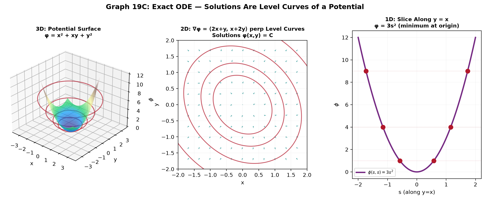

# Session 19C: Advanced First-Order — Substitutions and Exact Equations

**Phase 2 — Classical Techniques | 55 min**

*Prerequisites: 19B (separable & linear), 14B (implicit differentiation)*

---

## Example 1: Homogeneous Equations

Form: $\frac{dy}{dx} = F\left(\frac{y}{x}\right)$. Substitute $v = \frac{y}{x}$, so $y = xv$, $\frac{dy}{dx} = v + x\frac{dv}{dx}$.

$\frac{dy}{dx} = \frac{x+y}{x}$. Rewrite: $\frac{dy}{dx} = 1 + \frac{y}{x}$. $F(v)=1+v$.

$v + x\frac{dv}{dx} = 1+v$ → $x\frac{dv}{dx} = 1$ → $dv = \frac{dx}{x}$ → $v = \ln|x| + C$.

$y = xv = x\ln|x| + Cx$.

---

## Example 2: Bernoulli Equation

$y' + P(x)y = Q(x)y^n$. Substitute $v = y^{1-n}$. Then $v' = (1-n)y^{-n}y'$, and the ODE becomes **linear** in $v$.

$y' - y = xy^2$. $n=2$, $v = y^{-1}$. $v' = -y^{-2}y'$.

Original: $y^{-2}y' - y^{-1} = x$. In $v$: $-v' - v = x$ → $v' + v = -x$.

Linear! $\mu = e^x$. $ve^x = \int -xe^x dx$. Parts: $ve^x = -(xe^x - e^x) + C$ → $v = 1-x + Ce^{-x}$. $y = 1/v$.

---

## Example 3: Exact Equations

Form: $M(x,y)dx + N(x,y)dy = 0$. **Exactness test**: $\frac{\partial M}{\partial y} = \frac{\partial N}{\partial x}$.

If exact, there exists $\phi(x,y)$ with $\frac{\partial\phi}{\partial x}=M$, $\frac{\partial\phi}{\partial y}=N$. Solution: $\phi(x,y)=C$.

$(2x+y)dx + (x+2y)dy = 0$. $M=2x+y$, $N=x+2y$. $M_y=1$, $N_x=1$. → **Exact**.

$\phi = \int M\,dx = x^2+xy + h(y)$. $\frac{\partial\phi}{\partial y} = x + h'(y) = N = x+2y$. $h'(y)=2y$, $h=y^2$.

$\phi(x,y) = x^2+xy+y^2 = C$.

*Graph 19C: 3D — the potential surface $\phi(x,y) = x^2 + xy + y^2$. Solutions are level curves of this surface (red ellipses at constant height). 2D — the vector field $\nabla\phi = \langle 2x+y, x+2y\rangle$ is everywhere perpendicular to the level curves. The ODE $(2x+y)dx + (x+2y)dy = 0$ says "walk perpendicular to the gradient" — i.e., stay on a level curve. 1D — a slice along $y=x$ shows the potential minimum at the origin — all solution ellipses surround this point.*

---

> **🔗 Bridge to Vector Calculus**: The exactness condition $\frac{\partial M}{\partial y} = \frac{\partial N}{\partial x}$ has a deeper meaning. In 2D vector calculus (Session 25D), a vector field $\vec{F} = \langle M, N \rangle$ has zero curl if and only if $\frac{\partial N}{\partial x} - \frac{\partial M}{\partial y} = 0$. That's the **same condition** — an exact ODE is one where $\langle M, N \rangle$ is a conservative vector field.
>
> The function $\phi(x,y)$ that satisfies $\frac{\partial\phi}{\partial x}=M$, $\frac{\partial\phi}{\partial y}=N$ is the **scalar potential**: $\nabla\phi = \langle M, N \rangle$. The solution $\phi(x,y)=C$ means "the potential is constant along solution curves" — exactly like energy conservation in physics, where a particle follows a level curve of the potential.
>
> When you study conservative fields in Session 25D, you'll see this same idea in 3D: $\nabla\times\vec{F}=\vec{0} \iff \vec{F}=\nabla\phi$, and the potential is found by the same partial integration algorithm you just used here.

---

## Example 4: Making Equations Exact — Integrating Factors

If $M_y \neq N_x$, try $\mu(x)$ or $\mu(y)$:

If $\frac{M_y-N_x}{N}$ depends only on $x$: $\mu(x) = e^{\int\frac{M_y-N_x}{N}dx}$.

$(3xy+y^2)dx + (x^2+xy)dy = 0$. $M_y=3x+2y$, $N_x=2x+y$. Not exact.
$\frac{M_y-N_x}{N} = \frac{x+y}{x^2+xy} = \frac{1}{x}$. Depends only on $x$. $\mu = e^{\int\frac{1}{x}dx} = x$.

Multiply by $x$: $(3x^2y+xy^2)dx + (x^3+x^2y)dy = 0$. Now $M_y=3x^2+2xy = N_x$. Exact!

---

## Example 5: Orthogonal Trajectories

Given family $F(x,y,C)=0$, find curves that intersect at right angles. Replace $\frac{dy}{dx}$ with $-\frac{dx}{dy}$.

Family $y = Cx^2$. $\frac{dy}{dx} = 2Cx = 2\frac{y}{x}$. Orthogonal: $\frac{dy}{dx} = -\frac{x}{2y}$.
Separable: $2y\,dy = -x\,dx$. $y^2 = -\frac{x^2}{2} + K$. Ellipses orthogonal to parabolas!

---

## Example 6: Riccati Equation (Preview)

$y' = P(x)y^2 + Q(x)y + R(x)$. If one solution $y_1$ is known, substitute $y = y_1 + \frac{1}{v}$ reduces to linear in $v$.

> **Up to here**: Homogeneous → $v=y/x$. Bernoulli → $v=y^{1-n}$. Exact → $\phi(x,y)=C$. Non-exact → find $\mu$. Orthogonal trajectories: flip slope to $-1/$slope.

---

## Practice 1

Solve: $\frac{dy}{dx} = \frac{y^2-x^2}{2xy}$. Homogeneous.

→ Solutions: [Solutions](solutions/19C-solutions.md#practice-1)

---

## Practice 2

Solve: $y' + \frac{y}{x} = y^3$. Bernoulli.

→ Solutions: [Solutions](solutions/19C-solutions.md#practice-2)

---

## Practice 3

Solve: $(2xy+1)dx + (x^2+3y^2)dy = 0$. Test for exactness.

→ Solutions: [Solutions](solutions/19C-solutions.md#practice-3)

---

## Basic Algebra Drill — Advanced First-Order (10 Problems)

**D1.** Solve $dy/dx = (y/x)^2 + y/x$. Homogeneous.

**D2.** Solve $y' + y = y^3$. Bernoulli, $n=3$.

**D3.** Test exactness: $(3x^2+y)dx + (x+\cos y)dy = 0$.

**D4.** Solve exact: $(2x+y^3)dx + (3xy^2+4)dy = 0$.

**D5.** Find orthogonal trajectories of $y = Cx$.

**D6.** Solve homogeneous: $dy/dx = \frac{2xy}{x^2-y^2}$.

**D7.** Solve Bernoulli: $y' - \frac{y}{x} = xy^2$.

**D8.** Find integrating factor if $(y)dx + (-x)dy = 0$. Why is this not exact?

**D9.** Solve exact: $(\sin y + y\cos x)dx + (x\cos y + \sin x)dy = 0$.

**D10.** Classify: $y' = x+y$ — separable? linear? homogeneous? exact?

> Solutions: [Solutions](solutions/19C-solutions.md#basic-drill)

---

## Advanced Algebra Drill — Advanced First-Order (10 Problems)

**A1.** Solve $x\frac{dy}{dx} = y + \sqrt{x^2-y^2}$. Homogeneous, use $y=x\sin\theta$.

**A2.** $(y^2+2xy)dx - x^2dy = 0$. Find $\mu$ and solve.

**A3.** Solve $y' = \frac{2y^2+xy}{x^2}$. Homogeneous.

**A4.** $(e^x\sin y + 2x)dx + (e^x\cos y + 2y)dy = 0$. Exact — solve.

**A5.** Orthogonal trajectories of $x^2 + y^2 = C$ (circles). What are they?

**A6.** $(x^2+y^2+x)dx + xy\,dy = 0$. Find $\mu(x)$ and solve.

**A7.** Prove that if $M_y = N_x$, the ODE is exact by showing $\phi$ exists via line integrals.

**A8.** $y' = y^2 - \frac{y}{x} - \frac{1}{x^2}$. Guess $y_1=1/x$ is a solution (Riccati). Find general solution.

**A9.** Clairaut: $y = xy' + (y')^2$. Differentiate and solve for $y'$.

**A10.** Find curves such that every tangent line passes through the origin. Set up ODE and solve.

> Solutions: [Solutions](solutions/19C-solutions.md#advanced-drill)

---

## How to Read These Symbols

| Symbol | Reads as | Meaning |
|:---:|:---:|------|
| $v = \frac{y}{x}$ | "v equals y over x" | substitution for homogeneous equations — y = xv |
| $\frac{dy}{dx} = F(\frac{y}{x})$ | "d y d x equals F of y over x" | homogeneous ODE — depends only on ratio y/x |
| $y' + P(x)y = Q(x)y^n$ | "y prime plus P y equals Q y to the n" | Bernoulli equation — nonlinear, reduces to linear via v = y^{1-n} |
| $v = y^{1-n}$ | "v equals y to the one minus n" | Bernoulli substitution — transforms to linear ODE in v |
| $M(x,y)dx + N(x,y)dy = 0$ | "M d x plus N d y equals zero" | standard form for exact ODE |
| $\frac{\partial M}{\partial y}$ | "partial M partial y" / "M sub y" | partial derivative of M with respect to y |
| $M_y = N_x$ | "M sub y equals N sub x" | exactness condition — partial derivatives match |
| $\phi(x,y)$ | "phi of x y" / "potential function" | scalar function whose gradient gives the vector field ⟨M,N⟩ |
| $\mu(x)$, $\mu(y)$ | "mu of x" / "integrating factor" | factor making a non-exact ODE exact |
| orthogonal trajectories | "orthogonal trajectories" | curves intersecting a given family at right angles |
| Riccati | "Riccati" / "ree-CAH-tee" | y' = P y² + Q y + R — nonlinear, needs one known solution |

---

## Terminology

| What we call it | Math term | Notation |
|:---:|:---:|:---:|
| F depends only on y/x | homogeneous equation | $\frac{dy}{dx}=F(y/x)$ |
| y^n term makes it nonlinear | Bernoulli equation | $y'+Py=Qy^n$ |
| M dx + N dy is an exact differential | exact equation | $M_y = N_x$ |
| function whose gradient gives (M,N) | potential / scalar function | $\phi(x,y)$ s.t. $\nabla\phi=\langle M,N\rangle$ |
| multiply to make exact | integrating factor (exact) | $\mu(x)$ or $\mu(y)$ |
| curves intersecting at right angles | orthogonal trajectories | slope → −1/slope |
