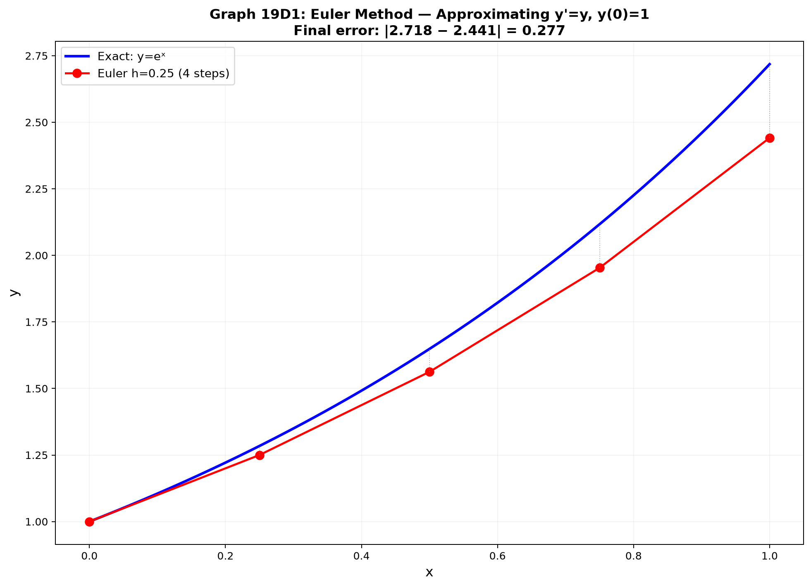

# Session 19D: Higher Order & Numerical Methods

**Phase 2 — Classical Techniques | 55 min**

*Prerequisites: 19B (first-order), 14C (higher derivatives), 12A1 (complex numbers)*

---

## Example 1: Second-Order Homogeneous — $ay''+by'+cy=0$

Assume $y=e^{rx}$. Characteristic equation: $ar^2+br+c=0$.

**Case 1 — Distinct real roots**: $y = c_1e^{r_1x} + c_2e^{r_2x}$.

$y''-5y'+6y=0$. $r^2-5r+6=0$. Roots $r=2,3$. $y=c_1e^{2x}+c_2e^{3x}$.

**Case 2 — Repeated root**: $y = (c_1+c_2x)e^{rx}$.

$y''-4y'+4y=0$. $r^2-4r+4=(r-2)^2=0$. $r=2$ (double). $y=(c_1+c_2x)e^{2x}$.

**Case 3 — Complex roots** $r=\alpha\pm i\beta$: $y = e^{\alpha x}(c_1\cos\beta x + c_2\sin\beta x)$.

$y''+4y'+13y=0$. $r^2+4r+13=0$. $r=-2\pm3i$. $y=e^{-2x}(c_1\cos3x+c_2\sin3x)$.

---

## Example 2: Simple Harmonic Motion

$y'' + \omega^2 y = 0$. $r^2+\omega^2=0$, $r=\pm i\omega$. $y=c_1\cos\omega t + c_2\sin\omega t = A\sin(\omega t+\phi)$.

Period $T=2\pi/\omega$. Frequency $f=\omega/2\pi$.

Mass-spring: $my''+ky=0$. $\omega = \sqrt{k/m}$. Pendulum (small angle): $\theta''+\frac{g}{L}\theta=0$.

---

## Example 3: Damped Harmonic Motion

$my'' + cy' + ky = 0$. Characteristic: $mr^2+cr+k=0$.

$r = \frac{-c\pm\sqrt{c^2-4mk}}{2m}$.

- **Overdamped** ($c^2 > 4mk$): two real roots, no oscillation.
- **Critically damped** ($c^2 = 4mk$): repeated root, fastest return.
- **Underdamped** ($c^2 < 4mk$): complex roots, oscillation with decaying amplitude.

---

## Example 4: Euler's Method — Numerical Approximation

For $y'=f(x,y)$, $y(x_0)=y_0$: $y_{n+1} = y_n + h\cdot f(x_n, y_n)$. Step size $h$.

$y' = x+y$, $y(0)=1$. Estimate $y(0.5)$ with $h=0.1$:

$x_0=0,y_0=1$: $y_1=1+0.1(0+1)=1.1$.
$x_1=0.1,y_1=1.1$: $y_2=1.1+0.1(0.1+1.1)=1.22$.
$x_2=0.2,y_2=1.22$: $y_3=1.22+0.1(0.2+1.22)=1.362$.
$x_3=0.3,y_3=1.362$: $y_4=1.362+0.1(0.3+1.362)=1.5282$.
$x_4=0.4,y_4=1.5282$: $y_5=1.5282+0.1(0.4+1.5282)=1.7210$.

$y(0.5)\approx1.721$. Exact: $y=-x-1+2e^x$, $y(0.5)=1.797$. Error $\approx0.076$.

---

## Example 5: Improved Euler (RK2)

**Predictor step**: $\tilde{y}_{n+1} = y_n + h f(x_n,y_n)$ (Euler).
**Corrector step**: $y_{n+1} = y_n + \frac{h}{2}[f(x_n,y_n) + f(x_{n+1},\tilde{y}_{n+1})]$.

Averages the slope at start and predicted end — much better accuracy ($O(h^2)$ local error vs $O(h)$ for Euler).

---

## Example 6: Phase Plane Preview — Lotka-Volterra

Predator-prey: $\frac{dx}{dt} = ax - bxy$ (prey), $\frac{dy}{dt} = -cy + dxy$ (predator).

Equilibria: $(0,0)$ and $(c/d, a/b)$. Orbits form closed loops — populations oscillate!

> **Up to here**: 2nd-order homogeneous: characteristic equation → 3 cases. Euler's method = linear approximation with steps. Improved Euler averages slopes. Phase 4 awaits with full ODE theory.

---

## Practice 1

Solve $y''-y'-2y=0$, $y(0)=1$, $y'(0)=0$.

→ Solutions: [Solutions](solutions/19D-solutions.md#practice-1)

---

## Practice 2

Use Euler with $h=0.2$ to estimate $y(0.4)$ for $y'=y$, $y(0)=1$.

→ Solutions: [Solutions](solutions/19D-solutions.md#practice-2)

---

## Basic Algebra Drill — Higher Order & Numerical (10 Problems)

**D1.** Solve $y''+y'-6y=0$.

**D2.** Solve $y''+6y'+9y=0$.

**D3.** Solve $y''+4y=0$, $y(0)=0$, $y'(0)=2$.

**D4.** Find the characteristic equation for $2y''-3y'+y=0$.

**D5.** Euler: $y'=2x$, $y(0)=0$, $h=0.5$. Find $y(1)$.

**D6.** Euler: $y'=x+y$, $y(0)=1$. One step with $h=0.1$.

**D7.** Classify damping: $y''+5y'+6y=0$ (over/critical/under?).

**D8.** Find period of $y''+9y=0$.

**D9.** Solve $y''-4y=0$, $y(0)=1$, $y'(0)=4$.

**D10.** Improved Euler: $y'=y$, $y(0)=1$, $h=0.2$. One step.

> Solutions: [Solutions](solutions/19D-solutions.md#basic-drill)

---

## Advanced Algebra Drill — Higher Order & Numerical (10 Problems)

**A1.** Solve $y''-2y'+5y=0$, $y(0)=1$, $y'(0)=3$.

**A2.** Find the general solution of $y''+2y'+y=e^{-x}$ by guessing $y_p=Ax^2e^{-x}$.

**A3.** For $y''+4y'+20y=0$, express as damped oscillation. Find pseudo-frequency.

**A4.** Euler vs exact: $y'=-2xy$, $y(0)=1$. Compute Euler $y(1)$ with $h=0.25$. Compare to exact $e^{-1}$.

**A5.** Improved Euler on $y'=x+y$, $y(0)=1$, $h=0.2$. Two steps. Compare to Euler.

**A6.** A spring-mass: $m=1$, $c=2$, $k=5$. Classify. Solve $y''+2y'+5y=0$, $y(0)=1$, $y'(0)=0$.

**A7.** Find the ODE whose characteristic equation has roots $r=-1\pm2i$.

**A8.** Euler error: prove local truncation error is $O(h^2)$ for $y'=f(x,y)$ by Taylor expanding $y(x_{n+1})$.

**A9.** RLC circuit: $LQ''+RQ'+Q/C=0$. Find condition for underdamped oscillation.

**A10.** Lotka-Volterra: show $(c/d, a/b)$ is an equilibrium. Linearize and classify stability.

> Solutions: [Solutions](solutions/19D-solutions.md#advanced-drill)
