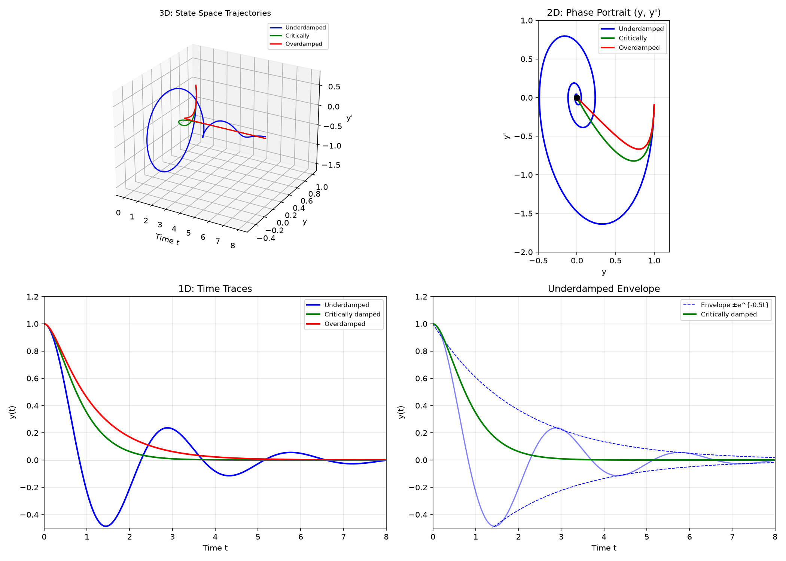
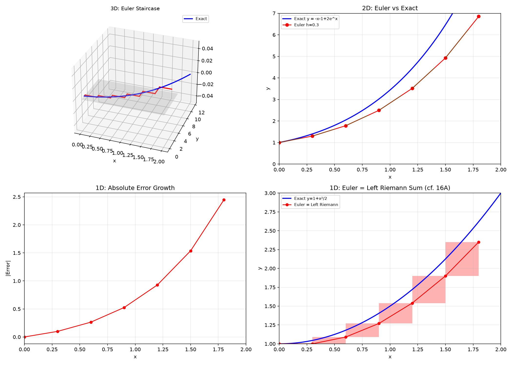
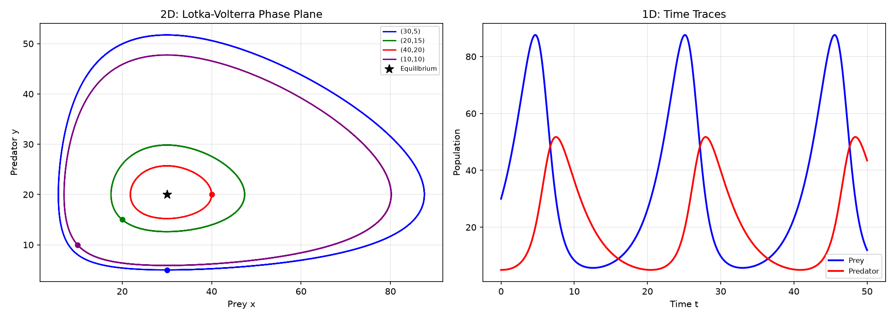

# Session 19D: Higher Order & Numerical Methods

**Phase 2 — Classical Techniques | 70 min**

*Prerequisites: 19B (first-order), 14C (higher derivatives), 12A1 (complex numbers)*

---

## Example 1: Second-Order Homogeneous — $ay''+by'+cy=0$

Assume $y=e^{rx}$. Characteristic equation: $ar^2+br+c=0$.

**Case 1 — Distinct real roots**: $y = c_1e^{r_1x} + c_2e^{r_2x}$.

$y''-5y'+6y=0$. $r^2-5r+6=0$. Roots $r=2,3$. $y=c_1e^{2x}+c_2e^{3x}$.

**Case 2 — Repeated root**: $y = (c_1+c_2x)e^{rx}$.

$y''-4y'+4y=0$. $r^2-4r+4=(r-2)^2=0$. $r=2$ (double). $y=(c_1+c_2x)e^{2x}$.

**Case 3 — Complex roots** $r=\alpha\pm i\beta$: $y = e^{\alpha x}(c_1\cos\beta x + c_2\sin\beta x)$.

$y''+4y'+13y=0$. $r^2+4r+13=0$. $r=-2\pm3i$. $y=e^{-2x}(c_1\cos3x+c_2\sin3x)$.

> **🔗 Bridge to 12A1 (Complex Numbers)**: The complex root $r = \alpha + i\beta$ corresponds to the complex exponential $e^{(\alpha+i\beta)x} = e^{\alpha x}(\cos\beta x + i\sin\beta x)$ (Euler's formula from 12A1). The real solution $e^{\alpha x}\cos\beta x$ and $e^{\alpha x}\sin\beta x$ are just the real and imaginary parts. In 12A1, you saw that $e^{i\theta}$ is a rotation matrix — here, $e^{i\beta x}$ creates oscillation and $e^{\alpha x}$ creates growth/decay. The complex plane of 12A1 is literally the plane of possible solutions to $y''+by'+cy=0$.

---

> **🔗 Bridge to Linear Algebra**: The characteristic equation $ar^2+br+c=0$ is secretly an eigenvalue problem. Rewrite $y''+ay'+by=0$ in state-space form (Session 19E):
>
> $$\dot{\vec{x}} = \begin{pmatrix} 0 & 1 \\ -b & -a \end{pmatrix}\vec{x}, \quad \vec{x} = \begin{pmatrix} y \\ y' \end{pmatrix}.$$
>
> The eigenvalues of $A = \begin{pmatrix} 0 & 1 \\ -b & -a \end{pmatrix}$ satisfy $\det(A - rI) = 0$:
>
> $$\det\begin{pmatrix} -r & 1 \\ -b & -a-r \end{pmatrix} = r(a+r) + b = r^2 + ar + b = 0.$$
>
> **The characteristic equation IS the eigenvalue equation.** The roots $r_1, r_2$ are eigenvalues. The solution $y=e^{rt}$ corresponds to the eigenvector $\begin{pmatrix}1 \\ r\end{pmatrix}$. This is why complex eigenvalues give sines and cosines — they're the same complex exponentials rotating in the phase plane. When you move to Session 19E, you'll see this connection fully exploited: coupled systems → matrix $A$ → eigenvalues → solution.

---

## Example 2: Simple Harmonic Motion

$y'' + \omega^2 y = 0$. $r^2+\omega^2=0$, $r=\pm i\omega$. $y=c_1\cos\omega t + c_2\sin\omega t = A\sin(\omega t+\phi)$.

Period $T=2\pi/\omega$. Frequency $f=\omega/2\pi$.

Mass-spring: $my''+ky=0$. $\omega = \sqrt{k/m}$. Pendulum (small angle): $\theta''+\frac{g}{L}\theta=0$.

---

## Example 3: Damped Harmonic Motion

$my'' + cy' + ky = 0$. Characteristic: $mr^2+cr+k=0$.

$r = \frac{-c\pm\sqrt{c^2-4mk}}{2m}$.

- **Overdamped** ($c^2 > 4mk$): two real roots, no oscillation.
- **Critically damped** ($c^2 = 4mk$): repeated root, fastest return.
- **Underdamped** ($c^2 < 4mk$): complex roots, oscillation with decaying amplitude.

*Graph 19D-1: 3D — state space trajectories $(y, y', t)$ for all three damping regimes. Red: overdamped (slides to zero), Blue: underdamped (spirals in), Green: critically damped (fastest return without oscillation). 2D — phase portraits $(y, y')$ reveal the geometry: overdamped follows the slow eigen-direction, critically damped touches the origin along one line, underdamped spirals. 1D — time traces show overdamped as sum of two decaying exponentials (slow + fast), critically damped as $(c_1+c_2 t)e^{-t}$, underdamped as $e^{-\alpha t}\cos(\beta t)$ with its exponential envelope.*

---

## Example 4: Euler's Method — Numerical Approximation

For $y'=f(x,y)$, $y(x_0)=y_0$: $y_{n+1} = y_n + h\cdot f(x_n, y_n)$. Step size $h$.

$y' = x+y$, $y(0)=1$. Estimate $y(0.5)$ with $h=0.1$:

$x_0=0,y_0=1$: $y_1=1+0.1(0+1)=1.1$.
$x_1=0.1,y_1=1.1$: $y_2=1.1+0.1(0.1+1.1)=1.22$.
$x_2=0.2,y_2=1.22$: $y_3=1.22+0.1(0.2+1.22)=1.362$.
$x_3=0.3,y_3=1.362$: $y_4=1.362+0.1(0.3+1.362)=1.5282$.
$x_4=0.4,y_4=1.5282$: $y_5=1.5282+0.1(0.4+1.5282)=1.7210$.

$y(0.5)\approx1.721$. Exact: $y=-x-1+2e^x$, $y(0.5)=1.797$. Error $\approx0.076$.

*Graph 19D-2: 3D — Euler's method as a staircase climbing the unknown solution surface. Each vertical step = $h$, each horizontal jump = $h \cdot f(x_n, y_n)$. 2D — Euler approximation (red dots) vs exact solution (blue curve) for $y' = x+y$, $y(0)=1$ with step $h=0.3$. The red segments show the slope used at each step. 1D — absolute error grows roughly linearly with $x$: global error $\propto h$ (first-order method).*

> **🔗 Bridge to 16A (Integration)**: Euler's method $y_{n+1} = y_n + h\cdot f(x_n, y_n)$ is exactly the same idea as a **left Riemann sum**. When $y' = f(x)$ (no $y$ dependence), Euler's method IS a left Riemann sum:
>
> $$y(x_n) = y_0 + \int_{x_0}^{x_n} f(t)\,dt \approx y_0 + \sum_{k=0}^{n-1} f(x_k)\cdot h$$
>
> The rectangular stepped approximation in Euler is the same geometry as the rectangular approximation of an integral. The difference is that Euler handles $y' = f(x,y)$ where the slope depends on $y$ itself — making each step feed into the next. This is why Euler is a **first-order method**: local error $O(h^2)$, global error $O(h)$, exactly like the left Riemann sum.

---

## Example 5: Improved Euler (RK2)

**Predictor step**: $\tilde{y}_{n+1} = y_n + h f(x_n,y_n)$ (Euler).
**Corrector step**: $y_{n+1} = y_n + \frac{h}{2}[f(x_n,y_n) + f(x_{n+1},\tilde{y}_{n+1})]$.

Averages the slope at start and predicted end — much better accuracy ($O(h^2)$ local error vs $O(h)$ for Euler).

---

## Example 6: Phase Plane Preview — Lotka-Volterra

Predator-prey: $\frac{dx}{dt} = ax - bxy$ (prey), $\frac{dy}{dt} = -cy + dxy$ (predator).

Equilibria: $(0,0)$ and $(c/d, a/b)$. Orbits form closed loops — populations oscillate!

---

## Example 7: Non-Homogeneous 2nd-Order ODEs — Method of Undetermined Coefficients

So far we solved $ay''+by'+cy = 0$ (homogeneous). Now we tackle **non-homogeneous** equations:

$$ay''+by'+cy = f(x)$$

**General solution**: $y = y_h + y_p$ where $y_h$ solves the homogeneous equation and $y_p$ is one **particular solution**.

**Method of undetermined coefficients**: For specific forms of $f(x)$, guess $y_p$ with unknown coefficients, plug in, and solve.

| $f(x)$ form | Guess for $y_p$ |
|:---|:---|
| $P_n(x)$ (polynomial) | $A_n x^n + A_{n-1}x^{n-1} + \cdots + A_0$ |
| $e^{\alpha x}$ | $A e^{\alpha x}$ |
| $\cos\beta x$ or $\sin\beta x$ | $A\cos\beta x + B\sin\beta x$ |
| $e^{\alpha x}\cos\beta x$ | $e^{\alpha x}(A\cos\beta x + B\sin\beta x)$ |

**Modification rule**: If the guess already solves the homogeneous equation, multiply by $x$ (or $x^2$ for repeated roots).

**Example 7A**: $y''-3y'+2y = 2x^2 - 6x + 2$

Homogeneous: $y_h = c_1 e^{x} + c_2 e^{2x}$. Guess $y_p = Ax^2 + Bx + C$.

$y_p' = 2Ax + B$, $y_p'' = 2A$. Plug in:

$(2A) - 3(2Ax+B) + 2(Ax^2+Bx+C) = 2x^2 - 6x + 2$

$2Ax^2 + (-6A+2B)x + (2A-3B+2C) = 2x^2 - 6x + 2$

Compare coefficients: $2A = 2 \to A=1$. $-6A+2B = -6 \to -6+2B=-6 \to B=0$. $2A-3B+2C = 2 \to 2+0+2C=2 \to C=0$.

$y_p = x^2$. General solution: $y = c_1 e^x + c_2 e^{2x} + x^2$.

**Example 7B**: $y''+y = \sin x$ (🔗 12A1 complex numbers)

Homogeneous: $y''+y=0$, $r^2+1=0$, $r=\pm i$. $y_h = c_1\cos x + c_2\sin x$.

Guess for $\sin x$ would be $A\cos x + B\sin x$, but this already solves the homogeneous! Modify: multiply by $x$.

$y_p = x(A\cos x + B\sin x)$. Compute derivatives:

$y_p' = A\cos x + B\sin x + x(-A\sin x + B\cos x)$
$y_p'' = -A\sin x + B\cos x + (-A\sin x + B\cos x) + x(-A\cos x - B\sin x)$
$\qquad = -2A\sin x + 2B\cos x - x(A\cos x + B\sin x)$

Plug into $y''+y = \sin x$: $-2A\sin x + 2B\cos x = \sin x$.

$-2A = 1 \to A = -\frac{1}{2}$, $2B = 0 \to B = 0$.

$y_p = -\frac{1}{2}x\cos x$. General: $y = c_1\cos x + c_2\sin x - \frac{1}{2}x\cos x$.

**Why multiply by $x$?** The homogeneous solution already accounts for the $\sin x$ and $\cos x$ terms. Multiplying by $x$ creates a new independent function $x\cos x$ that is NOT in $y_h$. This is the key insight — resonance in disguise.

> **🔗 Bridge to 12A1 (Complex Numbers)**: The characteristic equation $r^2+1=0$ has roots $r=\pm i$. The function $\sin x$ is the imaginary part of $e^{ix}$. When the forcing frequency $\beta=1$ matches the natural frequency $\omega_0=1$, the solution grows linearly in amplitude — this is **resonance** (Example 8).

---

## Example 8: Resonance — When the Driving Force Hits the Natural Frequency (🔗 12A1)

$y'' + \omega_0^2 y = F_0\cos(\omega t)$ (mass-spring with periodic forcing).

**Case 1 — $\omega \neq \omega_0$ (off-resonance)**:
$y_h = c_1\cos\omega_0 t + c_2\sin\omega_0 t$. Guess $y_p = A\cos\omega t + B\sin\omega t$.
Plug in: $A = \frac{F_0}{\omega_0^2 - \omega^2}$, $B=0$.
$y = c_1\cos\omega_0 t + c_2\sin\omega_0 t + \frac{F_0}{\omega_0^2 - \omega^2}\cos\omega t$.

The solution is a sum of two frequencies — **beats** occur when $\omega \approx \omega_0$.

**Case 2 — $\omega = \omega_0$ (resonance!)**:
The guess $A\cos\omega_0 t$ solves the homogeneous equation. Modify: multiply by $t$.

$y_p = t(A\cos\omega_0 t + B\sin\omega_0 t)$.
Plugging in yields $A=0$, $B = \frac{F_0}{2\omega_0}$.

$$y_p = \frac{F_0}{2\omega_0}\, t\sin\omega_0 t$$

**The amplitude grows linearly with time!** This is resonance — the Tacoma Narrows Bridge, opera singers shattering glass, electrons absorbing light at specific frequencies.

> **Why this connects to 12A1 (Complex Numbers)**: The complex exponential $e^{i\omega t}$ is a rotating vector. The ODE $y''+\omega_0^2 y = e^{i\omega t}$ has solution $y_p = \frac{e^{i\omega t}}{\omega_0^2 - \omega^2}$ when $\omega \neq \omega_0$. At $\omega = \omega_0$, the denominator is zero — the system absorbs energy without bound because the forcing is exactly in phase with the natural rotation. Complex numbers make this transparent: resonance is division by zero in the frequency domain.

> **🔗 12B2 Connection**: The linearly growing amplitude $t\sin\omega_0 t$ is a **non-harmonic** term — it doesn't come from the characteristic equation. This parallels the repeated-root case where $xe^{rx}$ appears as a linearly independent solution.

---

## Example 9: Variation of Parameters — The General Method

When $f(x)$ doesn't fit the simple forms above, use **variation of parameters**. For $y''+P(x)y'+Q(x)y = f(x)$:

Given two independent homogeneous solutions $y_1, y_2$:

$$y_p = -y_1\int\frac{y_2 f}{W}\,dx + y_2\int\frac{y_1 f}{W}\,dx$$

where $W = y_1 y_2' - y_2 y_1'$ is the **Wronskian**.

**Example**: $y''+y = \sec x$. $y_1=\cos x$, $y_2=\sin x$. $W = \cos x\cdot\cos x - \sin x\cdot(-\sin x) = \cos^2 x + \sin^2 x = 1$.

$y_p = -\cos x\int\frac{\sin x\cdot\sec x}{1}\,dx + \sin x\int\frac{\cos x\cdot\sec x}{1}\,dx$
$\quad = -\cos x\int\tan x\,dx + \sin x\int 1\,dx$
$\quad = -\cos x\cdot(-\ln|\cos x|) + \sin x\cdot x$
$\quad = \cos x\ln|\cos x| + x\sin x$.

General: $y = c_1\cos x + c_2\sin x + \cos x\ln|\cos x| + x\sin x$.

> **Up to here**: 2nd-order homogeneous → characteristic equation → 3 cases. Non-homogeneous → undetermined coefficients (form matching) or variation of parameters (general). Resonance when forcing frequency = natural frequency → amplitude grows linearly. Euler method = staircase approximation. Improved Euler averages slopes.

---

## Practice 1

Solve $y''-y'-2y=0$, $y(0)=1$, $y'(0)=0$.

→ Solutions: [Solutions](solutions/19D-solutions.md#practice-1)

---

## Practice 2

Use Euler with $h=0.2$ to estimate $y(0.4)$ for $y'=y$, $y(0)=1$.

→ Solutions: [Solutions](solutions/19D-solutions.md#practice-2)

---

## Practice 3

Solve $y''-3y'+2y = e^{3x}$. Find $y_h$, guess $y_p$, add them.

→ Solutions: [Solutions](solutions/19D-solutions.md#practice-3)

---

## Practice 4: Real Battle — Resonance

A mass-spring system ($m=1$, $k=4$) is driven by $F(t) = 2\cos(2t)$.
(a) Find the natural frequency $\omega_0$.
(b) Write and solve the ODE $y''+4y = 2\cos(2t)$.
(c) Describe the long-term behavior.

→ Solutions: [Solutions](solutions/19D-solutions.md#practice-4)

---

## Basic Algebra Drill — Higher Order & Numerical (12 Problems)

**D1.** Solve $y''+y'-6y=0$.

**D2.** Solve $y''+6y'+9y=0$.

**D3.** Solve $y''+4y=0$, $y(0)=0$, $y'(0)=2$.

**D4.** Find the characteristic equation for $2y''-3y'+y=0$.

**D5.** Euler: $y'=2x$, $y(0)=0$, $h=0.5$. Find $y(1)$.

**D6.** Euler: $y'=x+y$, $y(0)=1$. One step with $h=0.1$.

**D7.** Classify damping: $y''+5y'+6y=0$ (over/critical/under?).

**D8.** Find period of $y''+9y=0$.

**D9.** Solve $y''-4y=0$, $y(0)=1$, $y'(0)=4$.

**D10.** Improved Euler: $y'=y$, $y(0)=1$, $h=0.2$. One step.

**D11.** Solve $y''-y = e^x$ (watch for modification rule — $e^x$ solves homogeneous!).

**D12.** Find the resonance frequency for $y''+9y = \cos(\omega t)$: at what $\omega$ does amplitude blow up?

> Solutions: [Solutions](solutions/19D-solutions.md#basic-drill)

---

## Advanced Algebra Drill — Higher Order & Numerical (12 Problems)

**A1.** Solve $y''-2y'+5y=0$, $y(0)=1$, $y'(0)=3$.

**A2.** Find the general solution of $y''+2y'+y=e^{-x}$ by guessing $y_p=Ax^2e^{-x}$.

**A3.** For $y''+4y'+20y=0$, express as damped oscillation. Find pseudo-frequency.

**A4.** Euler vs exact: $y'=-2xy$, $y(0)=1$. Compute Euler $y(1)$ with $h=0.25$. Compare to exact $e^{-1}$.

**A5.** Improved Euler on $y'=x+y$, $y(0)=1$, $h=0.2$. Two steps. Compare to Euler.

**A6.** A spring-mass: $m=1$, $c=2$, $k=5$. Classify. Solve $y''+2y'+5y=0$, $y(0)=1$, $y'(0)=0$.

**A7.** Find the ODE whose characteristic equation has roots $r=-1\pm2i$.

**A8.** Euler error: prove local truncation error is $O(h^2)$ for $y'=f(x,y)$ by Taylor expanding $y(x_{n+1})$.

**A9.** RLC circuit: $LQ''+RQ'+Q/C=0$. Find condition for underdamped oscillation.

**A10.** Lotka-Volterra: show $(c/d, a/b)$ is an equilibrium. Linearize and classify stability.

**A11.** Solve $y''+4y = \sin(2x)$ using undetermined coefficients (modification rule). Interpret the result physically.

**A12.** Use variation of parameters to solve $y''-2y'+y = e^x\ln x$. Hint: $y_h = (c_1+c_2x)e^x$, $W = e^{2x}$.

> Solutions: [Solutions](solutions/19D-solutions.md#advanced-drill)

---

## How to Read These Symbols

| Symbol | Reads as | Meaning |
|:---:|:---:|------|
| $y''$ | "y double prime" / "second derivative" | acceleration — rate of change of slope |
| $ay''+by'+cy=0$ | "a y double prime plus b y prime plus c y equals zero" | second-order linear homogeneous ODE |
| $r$ | "r" / "characteristic root" | root of ar²+br+c=0 — determines solution form |
| $i$ | "i" / "the imaginary unit" | i² = −1 — appears in complex roots for oscillatory solutions |
| $e^{\alpha x}(c_1\cos\beta x + c_2\sin\beta x)$ | "e to the alpha x times c1 cosine beta x plus c2 sine beta x" | solution for complex roots α±iβ — damped/growing oscillation |
| $c_1, c_2$ | "c one, c two" / "arbitrary constants" | determined by initial conditions |
| $\omega$ | "omega" / "angular frequency" | ω = 2πf = 2π/T — radians per unit time |
| $T = 2\pi/\omega$ | "T equals two pi over omega" | period — time for one complete cycle |
| $h$ | "h" / "step size" | Euler method step — smaller h = better accuracy |
| $y_{n+1} = y_n + h f(x_n, y_n)$ | "y n+1 equals y n plus h times f of x n, y n" | Euler method — one step of slope-following |
| $y = y_h + y_p$ | "y equals y h plus y p" | general solution = homogeneous + particular (non-homogeneous) |
| $y_p$ | "y p" / "particular solution" | one specific solution to the non-homogeneous ODE |
| $W = y_1y_2' - y_2y_1'$ | "Wronskian" / "W" | determinant of the fundamental solution matrix |
| resonance | "resonance" | amplitude grows linearly when forcing matches natural frequency |
| $O(h^2)$ | "big-O of h squared" | local truncation error proportional to h² |
| RK2 | "R K two" / "Runge-Kutta second order" | improved Euler — averages slopes for better accuracy |
| overdamped / critically damped / underdamped | "overdamped" / "critically damped" / "underdamped" | three damping regimes: no oscillation / fastest return / decaying oscillation |

---

## Terminology

| What we call it | Math term | Notation |
|:---:|:---:|:---:|
| highest derivative is 2nd | second-order ODE | $ay''+by'+cy=0$ |
| equation for r from y=e^{rx} | characteristic equation | $ar^2+br+c=0$ |
| roots are real numbers | real distinct / repeated roots | $r_1,r_2 \in \mathbb{R}$ |
| roots are α±iβ | complex conjugate roots | $r = \alpha \pm i\beta$ |
| mass-spring oscillation | simple harmonic motion | $y''+\omega^2y=0$ |
| non-zero right-hand side | non-homogeneous ODE | $ay''+by'+cy=f(x)$ |
| guess solution form from $f(x)$ | undetermined coefficients | $y_p$ with unknown parameters |
| modify guess if it overlaps $y_h$ | modification rule | multiply by $x$ or $x^2$ |
| forcing frequency = natural frequency | resonance | $y_p \propto t\sin\omega_0 t$ |
| general formula for $y_p$ using $y_1,y_2$ | variation of parameters | $y_p = -y_1\int\frac{y_2 f}{W} + y_2\int\frac{y_1 f}{W}$ |
| step-by-step slope approximation | Euler's method | $y_{n+1}=y_n+h f(x_n,y_n)$ |
| predict-correct average slope | improved Euler / RK2 | $y_{n+1}=y_n+\frac{h}{2}[f_n+f_{n+1}]$ |
