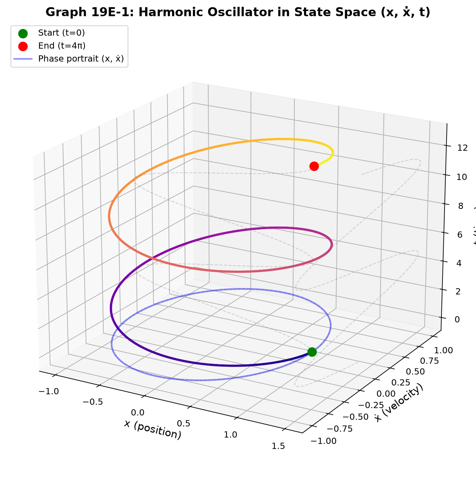
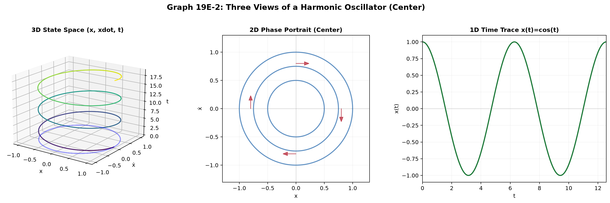
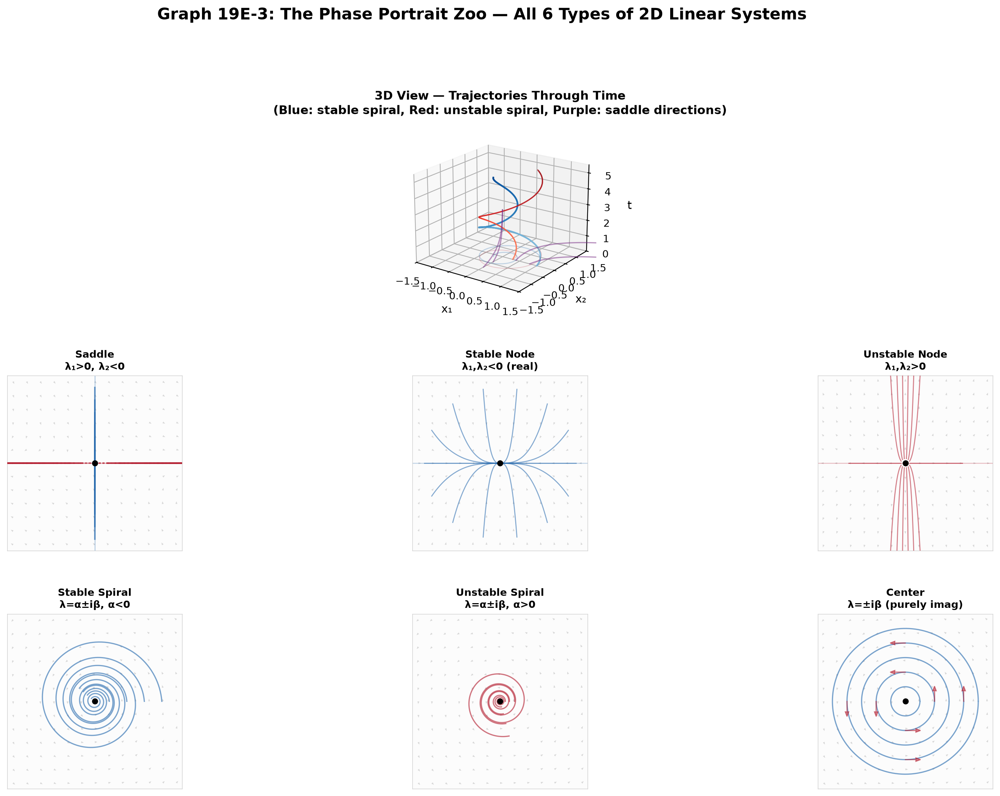
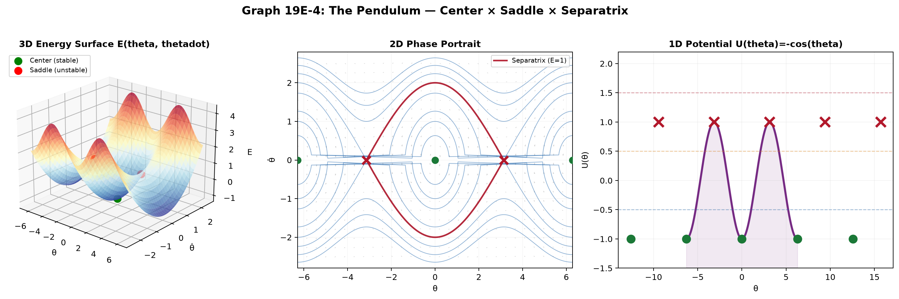

# Session 19E: Linear Systems and Phase Portraits — When Two Equations Talk

**Phase 2 — Classical Techniques | 75 min**

*One differential equation models growth. Two coupled equations model interaction — predator and prey, position and velocity, current and voltage. The state of any physical system lives in a space of two or more dimensions. This session teaches you to solve $\dot{\vec{x}} = A\vec{x}$ using eigenvalues, draw phase portraits that reveal the system's soul, and linearize nonlinear systems near equilibrium — the gateway to classical mechanics, circuit theory, and reaction dynamics.*

**Prerequisites**: Session 19D (2nd-order homogeneous ODEs). Session 12A2 (matrix multiplication). Session 26B (eigenvalues — can be read concurrently).

---

## Part A: From One Equation to Many — The State Vector

---

## Example 1: One Spring Becomes Two Numbers

A mass on a spring: $m\ddot{x} + kx = 0$. You solved this in 19D as $x(t) = A\cos\omega t + B\sin\omega t$.

But there's another way. Define the **state vector**: $\vec{y} = \begin{pmatrix} x \\ \dot{x} \end{pmatrix}$ — position AND velocity at the same time.

Then $\dot{\vec{y}} = \begin{pmatrix} \dot{x} \\ \ddot{x} \end{pmatrix} = \begin{pmatrix} \dot{x} \\ -\frac{k}{m}x \end{pmatrix} = \begin{pmatrix} 0 & 1 \\ -\frac{k}{m} & 0 \end{pmatrix}\begin{pmatrix} x \\ \dot{x} \end{pmatrix}$.

A **second-order** scalar ODE became a **first-order** system in 2D: $\dot{\vec{y}} = A\vec{y}$ with $A = \begin{pmatrix} 0 & 1 \\ -\omega^2 & 0 \end{pmatrix}$, $\omega^2 = k/m$.

**Why do this?** Because every classical mechanics problem, every circuit, every reaction network reduces to $\dot{\vec{x}} = A\vec{x}$ (or its nonlinear cousin). Master this form and you master all of them.



*Graph 19E-1: The harmonic oscillator in state space $(x, \dot{x})$. Each point is a complete description of the system at one instant. The trajectory is an ellipse — position and velocity trade off, conserving energy $E = \frac{1}{2}kx^2 + \frac{1}{2}m\dot{x}^2$. The arrows show the direction of motion (clockwise).*

---

## Example 2: The General Recipe — From $n$-th Order to $n$ First-Order

Any $n$-th order linear ODE becomes $n$ first-order equations:

$a_n y^{(n)} + a_{n-1}y^{(n-1)} + \cdots + a_1 y' + a_0 y = 0$.

Define $x_1 = y$, $x_2 = y'$, $x_3 = y''$, ..., $x_n = y^{(n-1)}$.

Then $\dot{x}_1 = x_2$, $\dot{x}_2 = x_3$, ..., $\dot{x}_{n-1} = x_n$,
$\dot{x}_n = -\frac{a_0}{a_n}x_1 - \frac{a_1}{a_n}x_2 - \cdots - \frac{a_{n-1}}{a_n}x_n$.

In matrix form: $\dot{\vec{x}} = \begin{pmatrix} 0 & 1 & 0 & \cdots & 0 \\ 0 & 0 & 1 & \cdots & 0 \\ \vdots & \vdots & \vdots & \ddots & \vdots \\ 0 & 0 & 0 & \cdots & 1 \\ -a_0/a_n & -a_1/a_n & -a_2/a_n & \cdots & -a_{n-1}/a_n \end{pmatrix}\vec{x}$.

This is the **companion matrix**. Its eigenvalues are the roots of the characteristic equation $a_n r^n + \cdots + a_0 = 0$. The 19D method and the matrix method are the SAME mathematics viewed from different angles.

---

## Example 3: Coupled Springs — Two Masses, Four State Variables

Two masses $m_1, m_2$ connected by three springs (constants $k_1, k_2, k_3$). Displacements $x_1, x_2$ from equilibrium.

$m_1\ddot{x}_1 = -k_1 x_1 + k_2(x_2 - x_1)$
$m_2\ddot{x}_2 = -k_2(x_2 - x_1) - k_3 x_2$

State vector: $\vec{y} = (x_1, x_2, \dot{x}_1, \dot{x}_2)^\mathsf{T}$. System: $\dot{\vec{y}} = A\vec{y}$ where $A$ is $4\times4$.

This is a **4-dimensional** phase space. Eigenvalues of $A$ give the normal mode frequencies. Eigenvectors describe the pattern of motion in each mode (masses moving together vs. opposite). This is Session 26B Example 8 cast in state-space language.

---

## Part B: Solving $\dot{\vec{x}} = A\vec{x}$ — The Eigenvalue Method

---

## Example 4: The Ansatz — Try $\vec{x}(t) = e^{\lambda t}\vec{v}$

Plug into $\dot{\vec{x}} = A\vec{x}$: $\lambda e^{\lambda t}\vec{v} = A e^{\lambda t}\vec{v}$ → $A\vec{v} = \lambda\vec{v}$.

**The growth rate $\lambda$ is an eigenvalue of $A$. The direction $\vec{v}$ is the corresponding eigenvector.** This is why Session 26B is so essential.

$A = \begin{pmatrix} 1 & 2 \\ 2 & 1 \end{pmatrix}$. Eigenvalues: $\lambda_1 = 3$, $\lambda_2 = -1$.
Eigenvectors: $\vec{v}_1 = \begin{pmatrix} 1 \\ 1 \end{pmatrix}$, $\vec{v}_2 = \begin{pmatrix} 1 \\ -1 \end{pmatrix}$.

General solution: $\vec{x}(t) = c_1 e^{3t}\begin{pmatrix} 1 \\ 1 \end{pmatrix} + c_2 e^{-t}\begin{pmatrix} 1 \\ -1 \end{pmatrix}$.

**Reading the solution**: Along $(1,1)$, everything grows exponentially (unstable direction). Along $(1,-1)$, everything decays (stable direction). A generic initial condition is a mix — it eventually aligns with the growing direction.

---

## Example 5: Complex Eigenvalues — Spirals and Centers

$A = \begin{pmatrix} 0 & 1 \\ -1 & 0 \end{pmatrix}$ (harmonic oscillator with $\omega=1$).

Eigenvalues: $\det(A-\lambda I) = \lambda^2 + 1 = 0$ → $\lambda = \pm i$.

Eigenvectors: For $\lambda = i$: $\begin{pmatrix} -i & 1 \\ -1 & -i \end{pmatrix}\begin{pmatrix} v_1 \\ v_2 \end{pmatrix} = \begin{pmatrix} 0 \\ 0 \end{pmatrix}$ → $v_2 = iv_1$. So $\vec{v} = \begin{pmatrix} 1 \\ i \end{pmatrix}$.

General solution (real form): $\vec{x}(t) = c_1\begin{pmatrix} \cos t \\ -\sin t \end{pmatrix} + c_2\begin{pmatrix} \sin t \\ \cos t \end{pmatrix}$.

Trajectories are **ellipses** — pure oscillation, no growth or decay. The eigenvalues being purely imaginary ($\pm i\omega$) means the system is a **center**.



*Graph 19E-2: ⬢ 3D view of the harmonic oscillator's state space $(x, \dot{x}, t)$. The trajectory spirals up the time axis as a helix. ⬡ 2D projection onto the $(x, \dot{x})$ plane — a closed ellipse (center). ⬝ 1D time trace $x(t)$ — pure cosine. Three views of the same motion.*

---

## Example 6: Damped Oscillator — Spiral Sink

$m\ddot{x} + c\dot{x} + kx = 0$, with $c^2 < 4mk$ (underdamped). State-space form:

$\dot{\vec{y}} = \begin{pmatrix} 0 & 1 \\ -k/m & -c/m \end{pmatrix}\vec{y}$.

For $m=1, c=1, k=2$: $A = \begin{pmatrix} 0 & 1 \\ -2 & -1 \end{pmatrix}$. Eigenvalues: $\lambda = -\frac{1}{2} \pm i\frac{\sqrt{7}}{2}$.

The real part $-\frac{1}{2}$ is the **decay rate**. The imaginary part $\frac{\sqrt{7}}{2}$ is the **oscillation frequency**.

General solution: $\vec{x}(t) = e^{-t/2}\left[c_1\begin{pmatrix} \cos(\omega t) \\ \cdots \end{pmatrix} + c_2\begin{pmatrix} \sin(\omega t) \\ \cdots \end{pmatrix}\right]$, $\omega = \sqrt{7}/2$.

Trajectories spiral into the origin — a **stable spiral**. The real part of the eigenvalue determines stability: negative → stable, positive → unstable, zero → center.

---

## Part C: The Phase Portrait Zoo — 2D Linear Systems

---

## Example 7: The Six Canonical Portraits

For $\dot{\vec{x}} = A\vec{x}$ with $A$ a $2\times2$ matrix, the eigenvalues completely determine the geometry:

| Eigenvalues | Name | Portrait | Physical Example |
|:---|:---|:---|:---|
| $\lambda_1 < 0 < \lambda_2$ (real, opposite signs) | **Saddle** | ⬡ trajectories approach along stable direction, flee along unstable | Inverted pendulum (upright equilibrium) |
| $\lambda_1 < \lambda_2 < 0$ (real, both negative) | **Stable Node** | ⬡ all trajectories → origin, tangent to slow eigen-direction | Overdamped oscillator |
| $0 < \lambda_1 < \lambda_2$ (real, both positive) | **Unstable Node** | ⬡ all trajectories → infinity | Population explosion with two growth rates |
| $\lambda = \alpha \pm i\beta$ with $\alpha < 0$ | **Stable Spiral** | ⬡ swirl into origin | Underdamped oscillator |
| $\lambda = \alpha \pm i\beta$ with $\alpha > 0$ | **Unstable Spiral** | ⬡ swirl outward | Self-excited oscillation (violin string) |
| $\lambda = \pm i\beta$ (purely imaginary) | **Center** | ⬡ closed ellipses | Undamped harmonic oscillator |

**Trace-determinant plane**: For $A = \begin{pmatrix} a & b \\ c & d \end{pmatrix}$, $\tau = \text{tr}(A) = a+d$, $\Delta = \det(A) = ad-bc$.

Eigenvalues: $\lambda = \frac{\tau \pm \sqrt{\tau^2 - 4\Delta}}{2}$. The discriminant $\tau^2 - 4\Delta$ splits the plane:

- $\Delta < 0$: **Saddle** (eigenvalues have opposite signs)
- $\Delta > 0$, $\tau^2 > 4\Delta$: **Node** (real distinct)
- $\Delta > 0$, $\tau^2 < 4\Delta$: **Spiral** (complex conjugate)
- $\Delta > 0$, $\tau = 0$: **Center** (purely imaginary)



*Graph 19E-3: ⬢ 3D view — each portrait is a slice of the $(x_1, x_2, t)$ space. ⬡ 2D $(x_1, x_2)$ phase planes for all six types. ⬝ 1D time traces $x_1(t)$ beneath each — saddle (diverges), node (monotone), spiral (oscillatory decay). The eigenvalue pair dictates everything.*

---

## Example 8: Reading Stability from the Trace and Determinant

You don't always need to compute eigenvalues explicitly. For a $2\times2$ system:

- **Stable** (all trajectories → 0): $\tau < 0$ AND $\Delta > 0$
- **Unstable** (trajectories → ∞): $\tau > 0$ OR $\Delta < 0$
- **Center** (undamped oscillation): $\tau = 0$ AND $\Delta > 0$

$A = \begin{pmatrix} -1 & 2 \\ -2 & -1 \end{pmatrix}$: $\tau = -2$, $\Delta = 1+4 = 5$. $\tau < 0$, $\Delta > 0$ → stable. $\tau^2 - 4\Delta = 4-20 = -16 < 0$ → spiral. **Stable spiral.** Computation confirms: $\lambda = -1 \pm 2i$.

---

## Part D: Nonlinear Systems — Linearize with the Jacobian

---

## Example 9: The Pendulum — Two Equilibria, Two Stories

$\ddot{\theta} = -\frac{g}{L}\sin\theta$. Let $x_1 = \theta$, $x_2 = \dot{\theta}$.

$\dot{x}_1 = x_2$, $\dot{x}_2 = -\frac{g}{L}\sin x_1$.

This is a **nonlinear** system. It has two equilibria: $(0,0)$ (hanging down) and $(\pi,0)$ (inverted).

Near each equilibrium, approximate $\sin x_1$ by its tangent line.

**At $(0,0)$**: $\sin x_1 \approx x_1$. System: $\dot{\vec{x}} \approx \begin{pmatrix} 0 & 1 \\ -g/L & 0 \end{pmatrix}\vec{x}$.
$\tau = 0$, $\Delta = g/L > 0$ → **Center**. Small oscillations, period $2\pi\sqrt{L/g}$.

**At $(\pi,0)$**: Let $y_1 = x_1 - \pi$. $\sin(y_1+\pi) = -\sin y_1 \approx -y_1$.
System: $\dot{\vec{y}} \approx \begin{pmatrix} 0 & 1 \\ g/L & 0 \end{pmatrix}\vec{y}$.
$\Delta = -g/L < 0$ → **Saddle**. Any tiny push sends it falling away.



*Graph 19E-4: ⬢ 3D energy surface of the pendulum $E = \frac{1}{2}\dot{\theta}^2 - \frac{g}{L}\cos\theta$. ⬡ 2D phase portrait: centers at $(2n\pi, 0)$ (stable hanging), saddles at $((2n+1)\pi, 0)$ (unstable inverted). The separatrix (red curve) divides oscillatory from whirling motion. ⬝ 1D potential $U(\theta) = -\cos\theta$ with equilibrium points marked.*

---

## Example 10: The General Linearization Recipe

For a nonlinear system $\dot{\vec{x}} = \vec{F}(\vec{x})$ with equilibrium $\vec{x}^*$ (where $\vec{F}(\vec{x}^*) = \vec{0}$):

1. Compute the **Jacobian matrix** $J$ of $\vec{F}$ at $\vec{x}^*$ (Session 26A)
2. The linearized system near $\vec{x}^*$ is $\dot{\vec{y}} = J\vec{y}$ where $\vec{y} = \vec{x} - \vec{x}^*$
3. Eigenvalues of $J$ determine local stability (Session 26B)

**The Hartman-Grobman theorem** guarantees: as long as no eigenvalue has zero real part, the nonlinear phase portrait near equilibrium is **topologically equivalent** to the linearized portrait. A saddle stays a saddle. A spiral stays a spiral.

---

## Example 11: Chemistry — Reaction Network Stability

The Brusselator (a model chemical oscillator):

$\dot{x} = a - (b+1)x + x^2y$
$\dot{y} = bx - x^2y$

Equilibrium: $x^* = a$, $y^* = b/a$.

Jacobian at equilibrium: $J = \begin{pmatrix} b-1 & a^2 \\ -b & -a^2 \end{pmatrix}$.

$\tau = b-1-a^2$, $\Delta = a^2$.

For $a=1, b=3$: $\tau = 1$, $\Delta = 1$. $\tau > 0$ → unstable. $\tau^2 - 4\Delta = 1-4 < 0$ → spiral. **Unstable spiral** — concentrations oscillate with growing amplitude, settling into a limit cycle (chemical oscillation!).

**This is how chemists predict oscillating reactions.** The Jacobian eigenvalues $\lambda = \frac{1}{2} \pm i\frac{\sqrt{3}}{2}$ tell you: the steady state is unstable, expect oscillations (Belousov-Zhabotinsky reaction, Briggs-Rauscher).

---

## Part E: Physics Bridge — Coupled Oscillators as Eigenvalue Problems

---

## Example 12: Two Coupled Pendulums — Complete Analysis

Two identical pendulums (mass $m$, length $L$) coupled by a weak spring (constant $\kappa$). Small-angle approximation:

$\ddot{\theta}_1 = -\frac{g}{L}\theta_1 + \frac{\kappa}{m}(\theta_2 - \theta_1)$
$\ddot{\theta}_2 = -\frac{g}{L}\theta_2 + \frac{\kappa}{m}(\theta_1 - \theta_2)$

Define $\omega_0^2 = g/L$, $\varepsilon = \kappa/m$. In matrix form for $\ddot{\vec{\theta}} = -K\vec{\theta}$:

$K = \begin{pmatrix} \omega_0^2 + \varepsilon & -\varepsilon \\ -\varepsilon & \omega_0^2 + \varepsilon \end{pmatrix}$.

State-space: $\dot{\vec{y}} = \begin{pmatrix} 0 & I \\ -K & 0 \end{pmatrix}\vec{y}$, but we can find normal modes directly from $K$.

**Eigenvalues of $K$**: $\lambda_1 = \omega_0^2$ (eigenvector $(1,1)$ — in-phase, pendulum together, spring unstretched). $\lambda_2 = \omega_0^2 + 2\varepsilon$ (eigenvector $(1,-1)$ — out-of-phase, spring stretches, higher frequency).

**Normal mode frequencies**: $\omega_1 = \sqrt{\lambda_1} = \omega_0$, $\omega_2 = \sqrt{\lambda_2} = \sqrt{\omega_0^2 + 2\kappa/m}$.

**General motion**: $\vec{\theta}(t) = (A_1\cos\omega_1 t + B_1\sin\omega_1 t)\begin{pmatrix}1\\1\end{pmatrix} + (A_2\cos\omega_2 t + B_2\sin\omega_2 t)\begin{pmatrix}1\\-1\end{pmatrix}$.

The coupled system decoupled into two **independent** oscillators in the eigen-directions. This is the universal pattern: coupled → find eigenvalues → decoupled normal modes.

> **Up to here**: $\dot{\vec{x}} = A\vec{x}$ is the universal form for linear systems. Solution: $\vec{x}(t) = \sum c_i e^{\lambda_i t}\vec{v}_i$. Phase portraits classify all 2D behavior by eigenvalues (saddle, node, spiral, center). Nonlinear systems linearize via the Jacobian near equilibria. Physics: coupled oscillators → eigenvalue problem → normal modes. Chemistry: reaction Jacobian → stability → oscillations.

---

## Common Mistakes

### Mistake 1: Confusing the state vector with the physical variable

**Wrong**: Treating $(x_1, x_2)$ as two independent physical quantities when one is actually the derivative of the other. **Right**: The state vector $(x, \dot{x})$ packages position AND velocity. The phase portrait is a parametric plot — read the direction of motion from $\dot{x}_1$ (the second component).

### Mistake 2: Forgetting that complex eigenvalues come in conjugate pairs

**Wrong**: Writing a solution with only one complex exponential. **Right**: Real solutions require both $e^{(\alpha+i\beta)t}$ and $e^{(\alpha-i\beta)t}$. Combine them into $e^{\alpha t}(C_1\cos\beta t + C_2\sin\beta t)$.

### Mistake 3: Linearizing at the wrong point

**Wrong**: Computing the Jacobian at the initial condition instead of at the equilibrium. **Right**: Linearization is valid ONLY near an equilibrium point where $\vec{F}(\vec{x}^*) = \vec{0}$. The Jacobian must be evaluated at $\vec{x}^*$.

### Mistake 4: Assuming a center in the linearization means a center in the nonlinear system

Linear centers are **structurally unstable**. A small nonlinearity can turn a center into a stable or unstable spiral. The pendulum's downward equilibrium is genuinely a nonlinear center (energy conserved). But the Lotka-Volterra predator-prey center can be destroyed by small modifications.

---

## What We Just Did

```
(1) State-space representation: n-th order ODE → n first-order ODEs.
    ẋ = Ax where x is the state vector (position + velocity, concentrations, etc.).

(2) Solution via eigenvalues: x(t) = Σ cᵢ e^{λᵢt} vᵢ.
    Real λ → exponential growth/decay along eigen-direction.
    Complex λ = α±iβ → e^{αt}(oscillation at frequency β).

(3) Phase portraits: 6 types determined by eigenvalues (saddle/node/spiral/center, stable/unstable).
    τ-Δ plane: τ=tr(A), Δ=det(A) classify without computing eigenvalues.

(4) Nonlinear linearization: ẋ=F(x), equilibrium x*, Jacobian J at x*.
    Near x*: ẏ ≈ Jy. Eigenvalues of J → local stability/oscillation.

(5) Physics: Coupled oscillators → eigenvalue problem of K → normal modes.
    Chemistry: Reaction Jacobian → stable/unstable/oscillatory steady states.
```

---

## Practice 1

Write the state-space form $\dot{\vec{x}} = A\vec{x}$ for the ODE $2y''' - 3y'' + y' - 4y = 0$. What is the size of $A$? What is the characteristic equation of $A$?

---

## Practice 2

Solve $\dot{\vec{x}} = \begin{pmatrix} 3 & 4 \\ 1 & 3 \end{pmatrix}\vec{x}$ with $\vec{x}(0) = \begin{pmatrix} 1 \\ 0 \end{pmatrix}$. Find eigenvalues, eigenvectors, and the general solution.

---

## Practice 3

Classify the equilibrium $\vec{x}^* = (0,0)$ for $\dot{\vec{x}} = \begin{pmatrix} -2 & 5 \\ -1 & -2 \end{pmatrix}\vec{x}$. Use $\tau$ and $\Delta$ first, then verify by computing eigenvalues. Sketch the phase portrait (at least the stable/unstable directions).

---

## Practice 4: Nonlinear System — Two Interacting Variables

Consider the nonlinear system $\dot{x} = x(2 - x - y)$, $\dot{y} = y(3 - 2x - y)$.
(a) Find all equilibria in the first quadrant ($x \geq 0, y \geq 0$).
(b) Compute the Jacobian at each equilibrium.
(c) Classify each equilibrium using eigenvalues.

---

## Practice 5: Real Battle — Cubic Nonlinear Oscillator

A nonlinear oscillator satisfies $\ddot{x} + x - \frac{1}{6}x^3 = 0$.
(a) Write as a first-order system.
(b) Find all equilibria.
(c) Linearize around each equilibrium and classify.
(d) One equilibrium is a saddle, one is a center. Which is which? Why can you be sure the center is genuine (not just an artifact of linearization)?

---

## Basic Drill (10)

**D1.** Convert $y'' + 3y' + 2y = 0$ to state-space form. Write $A$.
**D2.** $\dot{\vec{x}} = \begin{pmatrix} -1 & 0 \\ 0 & -2 \end{pmatrix}\vec{x}$. Write the general solution. (Diagonal — read eigenvalues directly.)
**D3.** $\dot{\vec{x}} = \begin{pmatrix} 0 & 1 \\ -4 & 0 \end{pmatrix}\vec{x}$. Find eigenvalues. Center, spiral, or node?
**D4.** Compute $\tau$ and $\Delta$ for $A = \begin{pmatrix} 1 & 2 \\ -3 & 1 \end{pmatrix}$. Classify without solving for eigenvalues.
**D5.** $\dot{\vec{x}} = \begin{pmatrix} 2 & 1 \\ 1 & 2 \end{pmatrix}\vec{x}$. Find eigenvalues and eigenvectors. Write the general solution.
**D6.** For $\dot{x}_1 = x_2$, $\dot{x}_2 = -x_1 - x_2$, compute $\tau$ and $\Delta$. What type of portrait?
**D7.** Linearize $\dot{x} = x(1-x)$, $\dot{y} = -y + x$ around the equilibrium $(1,1)$. Find the Jacobian.
**D8.** The eigenvalues of a Jacobian at equilibrium are $\{-0.5+2i, -0.5-2i\}$. Stable or unstable? Spiral or node?
**D9.** A $2\times2$ matrix has $\tau = 0$, $\Delta = -4$. What type of portrait?
**D10.** Convert the coupled system $\dot{u} = 2u - v$, $\dot{v} = u + 2v$ into matrix form. Find eigenvalues.

---

## Advanced Drill (10)

**A1.** Find all equilibria of $\ddot{x} + \dot{x} - x + x^3 = 0$. Write as a first-order system, linearize around each equilibrium, and classify.
**A2.** For the nonlinear system $\dot{x} = x - xy$, $\dot{y} = -y + xy$, find all three equilibria. Compute the Jacobian at each and classify. One equilibrium gives a center in the linearization — what does this imply about the actual nonlinear behavior?
**A3.** Prove that if $\vec{v}$ is an eigenvector of $A$ with eigenvalue $\lambda$, then $\vec{x}(t) = e^{\lambda t}\vec{v}$ is a solution of $\dot{\vec{x}} = A\vec{x}$.
**A4.** The ODE $\ddot{x} + a\dot{x} + bx = 0$ becomes $\dot{\vec{y}} = \begin{pmatrix} 0 & 1 \\ -b & -a \end{pmatrix}\vec{y}$ in state space. Map the $(a,b)$ parameter plane to the 6 phase portrait types. Where is the boundary between node and spiral? Between stable and unstable?
**A5.** Show that the trace-determinant criterion $\tau < 0$, $\Delta > 0$ is equivalent to "both eigenvalues have negative real part" (Routh-Hurwitz for $n=2$).
**A6.** The system $\dot{x} = \mu x - y - x(x^2+y^2)$, $\dot{y} = x + \mu y - y(x^2+y^2)$ undergoes a Hopf bifurcation at $\mu = 0$. (a) Convert to polar: let $x = r\cos\theta, y = r\sin\theta$ and find $\dot{r}, \dot{\theta}$. (b) What happens to the radius for $\mu < 0$, $\mu = 0$, $\mu > 0$?
**A7.** Compute the matrix exponential $e^{At}$ for $A = \begin{pmatrix} 0 & 1 \\ -1 & 0 \end{pmatrix}$ using the series definition. Show it equals $\begin{pmatrix} \cos t & \sin t \\ -\sin t & \cos t \end{pmatrix}$ — a rotation matrix.
**A8.** For $\ddot{x} = x - x^3$, find all equilibria in state space. Linearize around each. Classify. Sketch the phase portrait showing the homoclinic orbits (curves that start and end at the saddle).
**A9.** For the system $\dot{\vec{x}} = A\vec{x}$, show that $V(\vec{x}) = \vec{x}^\mathsf{T}P\vec{x}$ is a Lyapunov function if $A^\mathsf{T}P + PA = -Q$ with $Q$ positive definite. For $A = \begin{pmatrix} -1 & 2 \\ -1 & -1 \end{pmatrix}$, solve $A^\mathsf{T}P + PA = -I$ for $P$. Is $P$ positive definite? What does this prove about stability?
**A10.** A $3\times3$ linear system $\dot{\vec{x}} = A\vec{x}$ has eigenvalues $\{-1, -2, -3\}$. Describe the long-term behavior. Now suppose the eigenvalues are $\{-1, 2i, -2i\}$. Describe the long-term behavior in this case. Which directions persist forever?

> Solutions: [Solutions](solutions/19E-solutions.md)

---

## Today's Procedure

```
Step 1: Identify the state variables. n-th order → n first-order. Physical: position+velocity.
        Write ẋ = Ax (linear) or ẋ = F(x) (nonlinear).

Step 2: For linear system: find eigenvalues λ of A. det(A−λI)=0.
        For each λ, find eigenvector v: (A−λI)v=0.
        General solution: x(t) = Σcᵢe^{λᵢt}vᵢ.
        Complex λ=α±iβ → real form: e^{αt}(C₁cos(βt)+C₂sin(βt)).

Step 3: Classify portrait. Compute τ=tr(A), Δ=det(A).
        Δ<0→saddle. Δ>0,τ²>4Δ→node. Δ>0,τ²<4Δ→spiral. τ=0,Δ>0→center.
        τ<0→stable, τ>0→unstable.

Step 4: For nonlinear: find equilibria (F(x*)=0). Compute Jacobian J at x*.
        Near x*: ẏ≈Jy. Eigenvalues of J → local stability.
        Physics: K matrix → eigenvalues → normal mode ω².
        Chemistry: reaction Jacobian → stability → oscillations (Hopf bifurcation).
```

---

## How to Read These Symbols

| Symbol | Reads as | Meaning |
|:---:|:---:|------|
| $\dot{\vec{x}}$ | "x dot" | time derivative of state vector — dx/dt |
| $\dot{\vec{x}} = A\vec{x}$ | "x dot equals A x" | linear dynamical system in state-space form |
| $A$ | "A" / "system matrix" | coefficient matrix — n×n for n-dimensional system |
| $\lambda$ | "lambda" / "eigenvalue" | growth/decay rate + oscillation frequency — λ = α ± iβ |
| $\vec{v}$ | "v" / "eigenvector" | direction of pure exponential motion — A v = λ v |
| $\det(A-\lambda I)$ | "determinant of A minus lambda I" | characteristic polynomial — roots are eigenvalues |
| $\tau = \operatorname{tr}(A)$ | "tau equals trace of A" | sum of diagonal = sum of eigenvalues: τ = λ₁ + λ₂ |
| $\Delta = \det(A)$ | "Delta equals determinant of A" | product of eigenvalues: Δ = λ₁·λ₂ |
| $J$ | "J" / "Jacobian matrix" | J_{ij} = ∂F_i/∂x_j — linearization of nonlinear system at equilibrium |
| $\vec{F}(\vec{x})$ | "F of x" / "vector field" | right-hand side of nonlinear system ẋ = F(x) |
| $\vec{x}^*$ | "x star" / "equilibrium point" | F(x*) = 0 — system at rest |
| saddle / node / spiral / center | "saddle" / "node" / "spiral" / "center" | six canonical 2D phase portraits determined by eigenvalues |
| Hartman-Grobman | "Hartman-Grobman theorem" | near equilibrium, nonlinear phase portrait ≈ linearized portrait |


---

## Terminology

| What we call it | Math term | Notation |
|:---:|:---:|:---:|
| vector of positions and velocities | state vector | $\vec{x} = (x_1, \ldots, x_n)^\mathsf{T}$ |
| first-order matrix ODE | linear dynamical system | $\dot{\vec{x}} = A\vec{x}$ |
| growth/decay + oscillation rate | eigenvalue | $\lambda = \alpha \pm i\beta$ |
| direction of pure exponential motion | eigenvector | $\vec{v}$ |
| 2D plot of $(x_1, x_2)$ trajectories | phase portrait | (physics/math) |
| sum of diagonal = sum of eigenvalues | trace | $\tau = \text{tr}(A)$ |
| product of eigenvalues | determinant | $\Delta = \det(A)$ |
| Jacobian at equilibrium | linearization matrix | $J = \partial\vec{F}/\partial\vec{x}|_{\vec{x}^*}$ |
| parameter value where stability changes | bifurcation point | (physics/chemistry) |
| independent vibrational patterns | normal modes | (physics/chemistry) |
