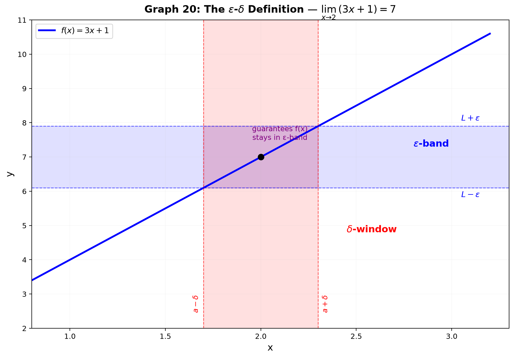

# Session 20: Rigorous Limits — ε-δ and ε-N

**Phase 2 — Proof Bridge | 90 min**

*"The limit of f(x) as x approaches a equals L." You've computed hundreds of limits in Sessions 13A–C. Now prove why those computations are correct — using the language of ε and δ that Phase 1 prepared you for.*

**Prerequisites**: ∀, ∃, ⇒, ¬ from Session 02. Direct proof, contrapositive, contradiction from Session 03.

---

## Part A: The ε-δ Definition — Decoding the Symbols

---

## Example 1: What "Limit" Really Means — The Funnel Picture

You know $\lim_{x \to 2} (3x+1) = 7$ from direct substitution. But **why** is it 7, not 6.999?

**The challenge**: I give you any tolerance band around 7, say $7 \pm 0.1$ (so $y$ must land between 6.9 and 7.1). Can you find a window around $x=2$ that guarantees $f(x)$ stays inside my band?

$|f(x) - 7| < 0.1$ means $|3x+1 - 7| = |3x-6| = 3|x-2| < 0.1$.
$|x-2| < 0.1/3 \approx 0.0333$.

If you keep $x$ within $0.0333$ of $2$, then $f(x)$ stays within $0.1$ of $7$.

**The definition says**: For **every** tolerance $\varepsilon > 0$ (no matter how tiny), there **exists** a window radius $\delta > 0$ such that:

$$
0 < |x - a| < \delta \quad\Longrightarrow\quad |f(x) - L| < \varepsilon
$$

In symbols from Session 02: $\forall \varepsilon > 0,\; \exists \delta > 0,\; \forall x\; (0 < |x-a| < \delta \Rightarrow |f(x)-L| < \varepsilon)$.

**The double inequality $0 < |x-a|$**: We exclude $x=a$ itself. The limit doesn't care what happens exactly at $a$ — only what happens as we approach.

---

## Example 2: Linear Functions — $\delta$ Is Proportional to $\varepsilon$

Prove $\lim_{x \to 3} (2x-1) = 5$.

**Step 1 — Start from what you want**: $|f(x) - L| < \varepsilon$.
$|(2x-1) - 5| = |2x-6| = 2|x-3| < \varepsilon$.

**Step 2 — Solve for $|x-a|$**: $|x-3| < \varepsilon/2$.

**Step 3 — Choose $\delta$**: Set $\delta = \varepsilon/2$.

**Step 4 — Verify the implication**: If $0 < |x-3| < \delta = \varepsilon/2$, then
$|f(x)-5| = |2x-6| = 2|x-3| < 2(\varepsilon/2) = \varepsilon$. Done.

**The pattern for $f(x)=mx+b$**: $\delta = \varepsilon/|m|$. The steeper the line ($|m|$ large), the narrower the window must be.

---

## Example 3: Proving a Quadratic Limit — $\lim_{x \to 2} x^2 = 4$

$|f(x) - L| = |x^2 - 4| = |x-2| \cdot |x+2|$.

The $|x+2|$ factor depends on $x$. We need to bound it.

**The trick — restrict $\delta$ first**: Assume $\delta \leq 1$. Then $|x-2| < 1$ means $1 < x < 3$, so $|x+2| < 5$.

Now $|x^2-4| = |x-2| \cdot |x+2| < |x-2| \cdot 5 < 5\delta$.

We want $5\delta \leq \varepsilon$, so $\delta \leq \varepsilon/5$.

**Final choice**: $\delta = \min(1, \varepsilon/5)$.

**Verification**: If $0 < |x-2| < \delta$, then $|x-2| < 1$ (so $|x+2| < 5$) AND $|x-2| < \varepsilon/5$. Multiply: $|x^2-4| < 5 \cdot \varepsilon/5 = \varepsilon$.

**The standard strategy for non-linear functions**:
1. Factor $|f(x)-L|$ to isolate $|x-a|$.
2. Bound the remaining factor by restricting $\delta$ (usually $\delta \leq 1$ or some convenient number).
3. Choose $\delta = \min(\text{bound radius}, \varepsilon/\text{max factor})$.

---

## Example 4: Limit of a Rational Function — $\lim_{x \to 1} \frac{x^2-1}{x-1} = 2$

$|\frac{x^2-1}{x-1} - 2| = |\frac{(x-1)(x+1)}{x-1} - 2| = |(x+1) - 2| = |x-1|$ (for $x \neq 1$).

This simplifies beautifully. $|f(x)-L| = |x-1| < \varepsilon$ directly.

Choose $\delta = \varepsilon$. Done.

**Lesson**: The $0 < |x-a|$ in the definition (excluding $x=1$) is exactly what lets us cancel $(x-1)$. The limit doesn't see the hole.

---

## Part B: ε-N — Limits of Sequences

---

## Example 5: The Sequence Definition — $\lim_{n \to \infty} a_n = L$

For sequences, "$n$ approaches infinity" means "eventually stays close." The definition:

$$
\forall \varepsilon > 0,\; \exists N \in \mathbb{N},\; \forall n \geq N,\; |a_n - L| < \varepsilon
$$

**Prove $\lim_{n \to \infty} \frac{1}{n} = 0$**:

We need $|\frac{1}{n} - 0| = \frac{1}{n} < \varepsilon$.

Solve: $n > 1/\varepsilon$. Choose $N = \lceil 1/\varepsilon \rceil$ (first integer larger than $1/\varepsilon$).

If $n \geq N$, then $n \geq \lceil 1/\varepsilon \rceil \geq 1/\varepsilon$, so $\frac{1}{n} \leq \varepsilon$ (strict inequality holds for $n > 1/\varepsilon$).

Done.

---

## Example 6: Linear Over Quadratic — $\lim_{n \to \infty} \frac{2n+1}{n^2} = 0$

$\frac{2n+1}{n^2} = \frac{2}{n} + \frac{1}{n^2} < \frac{2}{n} + \frac{1}{n} = \frac{3}{n}$ (for $n \geq 1$, since $\frac{1}{n^2} \leq \frac{1}{n}$).

We want $\frac{3}{n} < \varepsilon$ → $n > 3/\varepsilon$. Choose $N = \max(1, \lceil 3/\varepsilon \rceil)$.

**Strategy**: Over-estimate with a simpler expression, then solve.

---

## Example 7: Constant Sequence and the Uniqueness of Limits

**Trivial case**: $\lim_{n \to \infty} c = c$ (constant sequence). $|c-c| = 0 < \varepsilon$ for all $n$. Any $N$ works — choose $N=1$.

**Theorem — Limits are unique**: If $\lim_{n\to\infty} a_n = L$ and $\lim_{n\to\infty} a_n = M$, then $L = M$.

**Proof by contradiction** (Session 03 template):
Assume $L \neq M$. Let $\varepsilon = |L-M|/3 > 0$.

Because $a_n \to L$: $\exists N_1$ such that $n \geq N_1 \Rightarrow |a_n - L| < \varepsilon$.
Because $a_n \to M$: $\exists N_2$ such that $n \geq N_2 \Rightarrow |a_n - M| < \varepsilon$.

Take $n = \max(N_1, N_2)$. Then by the triangle inequality:
$|L-M| = |(L - a_n) + (a_n - M)| \leq |a_n-L| + |a_n-M| < \varepsilon + \varepsilon = 2\varepsilon = 2|L-M|/3$.

So $|L-M| < \frac{2}{3}|L-M|$. Impossible unless $|L-M| = 0$. Contradiction. Thus $L = M$.

**This proof is tested on virtually every Calculus credit exam.**

---

## Part C: Limit Laws — Proving the Arithmetic of Limits

---

## Example 8: The Sum Law — $\lim (f+g) = \lim f + \lim g$

**Claim**: If $\lim_{x \to a} f(x) = L$ and $\lim_{x \to a} g(x) = M$, then $\lim_{x \to a} [f(x)+g(x)] = L+M$.

**ε-δ proof** (using the Session 03 direct proof template):

Given $\varepsilon > 0$.

Since $f(x) \to L$: $\exists \delta_1 > 0$ such that $0 < |x-a| < \delta_1 \Rightarrow |f(x)-L| < \varepsilon/2$.
Since $g(x) \to M$: $\exists \delta_2 > 0$ such that $0 < |x-a| < \delta_2 \Rightarrow |g(x)-M| < \varepsilon/2$.

Choose $\delta = \min(\delta_1, \delta_2)$. If $0 < |x-a| < \delta$, then both conditions hold:
$|(f(x)+g(x)) - (L+M)| = |(f(x)-L) + (g(x)-M)| \leq |f(x)-L| + |g(x)-M| < \varepsilon/2 + \varepsilon/2 = \varepsilon$.

**Why ε/2?**: We split the tolerance equally between the two functions. The triangle inequality does the rest.

---

## Example 9: The Constant Multiple Law — $\lim (c \cdot f) = c \cdot \lim f$

If $c = 0$, trivial (both sides are 0). Assume $c \neq 0$.

Given $\varepsilon > 0$. Since $f(x) \to L$: $\exists \delta > 0$ such that $|f(x)-L| < \varepsilon/|c|$.

Then $|c \cdot f(x) - c \cdot L| = |c| \cdot |f(x)-L| < |c| \cdot \varepsilon/|c| = \varepsilon$.

Choose $\delta$ from the $f$-limit with tolerance $\varepsilon/|c|$.

---

## Example 10: The Product Law — $\lim (f \cdot g) = \lim f \cdot \lim g$

**Claim**: If $\lim_{x \to a} f(x) = L$ and $\lim_{x \to a} g(x) = M$, then $\lim_{x \to a} [f(x)g(x)] = LM$.

This one needs a small preliminary fact first.

**Lemma — convergent functions are locally bounded**: If $f(x) \to L$ as $x \to a$, then there exist $\delta_0 > 0$ and a constant $C > 0$ with $|f(x)| \leq C$ for all $0 < |x-a| < \delta_0$.

*Proof*: Apply the definition with $\varepsilon = 1$: some $\delta_0$ makes $|f(x)-L| < 1$. By the triangle inequality, $|f(x)| \leq |f(x)-L| + |L| < 1 + |L| =: C$. ✓

**Proof of the product law**:

Add and subtract the cross term $f(x)M$ — the same trick that later proves the product rule in Session 21:

$|f(x)g(x) - LM| = |f(x)g(x) - f(x)M \;+\; f(x)M - LM|$
$\leq |f(x)|\cdot|g(x)-M| \;+\; |M|\cdot|f(x)-L|$ (triangle inequality).

Given $\varepsilon > 0$:
- choose $\delta_1$ so that $|f(x)-L| < \frac{\varepsilon}{2(C+1)}$,
- choose $\delta_2$ so that $|g(x)-M| < \frac{\varepsilon}{2(|M|+1)}$.

Let $\delta = \min(\delta_0, \delta_1, \delta_2)$. For $0 < |x-a| < \delta$:

$|f(x)g(x)-LM| < C\cdot\frac{\varepsilon}{2(C+1)} + |M|\cdot\frac{\varepsilon}{2(|M|+1)} < \frac{\varepsilon}{2} + \frac{\varepsilon}{2} = \varepsilon$. Done.

**Why the $+1$'s in the denominators?** They keep the fractions safe when $C = 0$ or $M = 0$ — no division by zero.

**Why this law matters here**: Session 21 proves "differentiable $\Rightarrow$ continuous" by multiplying two limits, and proves the product rule by multiplying limits too. Without the product law those proofs would float. Now the support chain is complete: sum, constant multiple, product, squeeze.

---

## Example 11: The Squeeze Theorem — Proof and Application

**Statement**: If $g(x) \leq f(x) \leq h(x)$ near $a$ (except possibly at $a$) and $\lim_{x \to a} g(x) = \lim_{x \to a} h(x) = L$, then $\lim_{x \to a} f(x) = L$.

**Proof**: Given $\varepsilon > 0$.
$g(x) \to L$: $\exists \delta_1$ with $|g(x)-L| < \varepsilon$ → $L-\varepsilon < g(x) < L+\varepsilon$.
$h(x) \to L$: $\exists \delta_2$ with $|h(x)-L| < \varepsilon$ → $L-\varepsilon < h(x) < L+\varepsilon$.

Let $\delta = \min(\delta_1, \delta_2)$. For $0 < |x-a| < \delta$:
$L-\varepsilon < g(x) \leq f(x) \leq h(x) < L+\varepsilon$.

So $L-\varepsilon < f(x) < L+\varepsilon$ → $|f(x)-L| < \varepsilon$.

**Classic application**: $\lim_{x \to 0} \frac{\sin x}{x} = 1$.

**Geometric proof sketch** (from the unit circle, Session 11):
For $0 < x < \pi/2$: $\sin x < x < \tan x$. Divide by $\sin x$: $1 < \frac{x}{\sin x} < \frac{1}{\cos x}$.

Take reciprocals: $\cos x < \frac{\sin x}{x} < 1$.

As $x \to 0^+$, $\cos x \to 1$. By the squeeze theorem, $\frac{\sin x}{x} \to 1$.

For $x \to 0^-$, use $\sin(-x)/(−x) = \sin x / x$ (even function symmetry).



*Graph 20: The ε-δ definition. The ε-band (horizontal blue strip) around L=7 constrains the output. The δ-window (vertical red strip) around a=2 guarantees all x-values inside it produce outputs within the ε-band. For any ε, a δ exists.*

---

## Example 12: Counterexample — When the Limit Does Not Exist

**$f(x) = \sin(1/x)$ near $x=0$**: As $x \to 0$, $1/x \to \infty$, and $\sin(1/x)$ oscillates between $-1$ and $1$ infinitely often. No single $L$ can satisfy the ε-δ definition.

**Proof of non-existence**: Suppose a limit $L$ exists. Take $\varepsilon = 1/2$. For any $\delta > 0$, there exist $x_1, x_2$ with $0 < x_1, x_2 < \delta$ such that $f(x_1) = 1$ and $f(x_2) = -1$ (because $\sin(1/x)$ hits 1 and −1 arbitrarily close to 0).

Then $|f(x_1)-L| < 1/2$ and $|f(x_2)-L| < 1/2$ would imply $|1 - (-1)| \leq |1-L| + |L-(-1)| < 1$. But $2 < 1$ is impossible. Contradiction. No limit.

---

## Example 13: Infinite Limits — A Variant Definition

$\lim_{x \to a} f(x) = \infty$ means: $\forall M > 0,\; \exists \delta > 0,\; 0 < |x-a| < \delta \Rightarrow f(x) > M$.

**Prove $\lim_{x \to 0^+} \frac{1}{x} = \infty$**:

Given any $M > 0$, choose $\delta = 1/M$. If $0 < x < \delta$, then $\frac{1}{x} > \frac{1}{\delta} = M$. Done.

This is NOT the same as "the limit exists and equals infinity" — infinity is not a number. The notation means "grows without bound."

> **Up to here**: ε-δ: $\forall\varepsilon>0,\exists\delta>0, 0<|x-a|<\delta\Rightarrow|f(x)-L|<\varepsilon$. The $0<$ excludes $x=a$. Linear: $\delta=\varepsilon/|m|$. Quadratic: bound the extra factor by restricting $\delta$ first. ε-N: $\forall\varepsilon>0,\exists N, n\geq N\Rightarrow|a_n-L|<\varepsilon$. Limit laws: sum, constant multiple, **product (locally-bounded lemma + cross-term trick)**, squeeze. Uniqueness of limits. Non-existence: oscillation counterexample. Infinite limits: ∀M ∃δ with f(x)>M (different definition, not a number).

---

## Part D: Proving Limits Fail — Negation and One-Sided Limits

---

## Example 14: Negating the ε-δ Definition — What "No Limit" Really Means

Phase 1 (Session 02) gave you the machine: negating a $\forall\exists\forall$ sentence flips **every** quantifier and negates the innermost claim.

The definition: $\lim_{x \to a} f(x) = L$ means

$$\forall \varepsilon > 0,\; \exists \delta > 0,\; \forall x\;\big(0 < |x-a| < \delta \Rightarrow |f(x)-L| < \varepsilon\big).$$

**Negate it step by step** (each arrow is a Phase 1 rule):

$\neg\Big(\forall\varepsilon\;\exists\delta\;\forall x\,(P \Rightarrow Q)\Big)$
$= \exists\varepsilon\;\neg\Big(\exists\delta\;\forall x\,(P \Rightarrow Q)\Big)$  [¬∀ ≡ ∃¬]
$= \exists\varepsilon\;\forall\delta\;\neg\Big(\forall x\,(P \Rightarrow Q)\Big)$  [¬∃ ≡ ∀¬]
$= \exists\varepsilon\;\forall\delta\;\exists x\,\neg(P \Rightarrow Q)$  [¬∀ ≡ ∃¬]
$= \exists\varepsilon\;\forall\delta\;\exists x\,(P \land \neg Q)$  [¬(P⇒Q) ≡ P∧¬Q — Phase 1 Session 01]

So **"$\lim_{x \to a} f(x) = L$" fails** exactly when:

$$\exists \varepsilon > 0,\; \forall \delta > 0,\; \exists x\;\big(0 < |x-a| < \delta \;\land\; |f(x)-L| \geq \varepsilon\big).$$

**Plain English**: There is a tolerance $\varepsilon$ such that, no matter how small you make the window $\delta$, you can always find an $x$ inside the window that lands **outside** the tolerance band.

**Worked example — $f(x) = \sin(1/x)$ at $a=0$ (every candidate $L$ fails)**:

Take $\varepsilon = 1/2$. Given ANY $\delta > 0$, choose $n$ large enough that both $\frac{1}{2n\pi + \pi/2} < \delta$ and $\frac{1}{2n\pi + 3\pi/2} < \delta$. Then $x_1 = \frac{1}{2n\pi+\pi/2}$ gives $\sin(1/x_1) = 1$, and $x_2 = \frac{1}{2n\pi+3\pi/2}$ gives $\sin(1/x_2) = -1$ — both inside $0 < x < \delta$, yet $2$ apart. They cannot both lie within $1/2$ of any single $L$: $2 = |1-(-1)| \leq |1-L| + |L-(-1)| < 1$, impossible. So the negation holds for every $L$ — **no limit exists**. (This restates Example 12 in the language of the negation.)

> **Insight**: The negation turns "prove the limit doesn't exist" into a **two-player game** (Phase 1's quantifier order made literal): the challenger picks $\varepsilon$, you pick $\delta$, the challenger picks $x$ — and wins if $|f(x)-L| \geq \varepsilon$. "No limit" means the challenger has a winning strategy against every $L$.

---

## Example 15: One-Sided ε-δ Definitions

**Right-hand limit** $\lim_{x \to a^+} f(x) = L$: restrict the window to $x > a$.

$$\forall \varepsilon > 0,\; \exists \delta > 0,\; \forall x\;\big(0 < x - a < \delta \Rightarrow |f(x)-L| < \varepsilon\big).$$

**Left-hand limit** $\lim_{x \to a^-} f(x) = L$: restrict the window to $x < a$.

$$\forall \varepsilon > 0,\; \exists \delta > 0,\; \forall x\;\big(0 < a - x < \delta \Rightarrow |f(x)-L| < \varepsilon\big).$$

**Two-sided theorem**: $\lim_{x \to a} f(x) = L$ exists **iff** both one-sided limits exist and equal $L$. (Reason: the two half-windows $0 < x-a < \delta$ and $0 < a-x < \delta$ glue together into $0 < |x-a| < \delta$.)

**Worked example — $f(x) = \frac{|x|}{x}$ at $a=0$**:

- For $x > 0$: $\frac{|x|}{x} = 1$ identically, so $\lim_{x \to 0^+} \frac{|x|}{x} = 1$ (any $\delta$ works).
- For $x < 0$: $\frac{|x|}{x} = -1$ identically, so $\lim_{x \to 0^-} \frac{|x|}{x} = -1$.

Left $\neq$ right, so the **two-sided limit does not exist** — no ε-δ chase needed, the one-sided theorem settles it.

> **Up to here**: Negating the definition (flip quantifiers; $P \Rightarrow Q$ becomes $P \land \neg Q$) gives the exact condition for "the limit fails." One-sided limits restrict the window to one side; the two-sided limit exists iff both sides exist and agree.

---

## Common Mistakes

### Mistake 1: Forgetting $0 < |x-a|$ in the definition

**Wrong**: $|x-a|<\delta \Rightarrow |f(x)-L|<\varepsilon$. **Right**: $0<|x-a|<\delta$. The $0<$ is crucial — it excludes the point $x=a$ itself. The limit does not require $f(a)=L$ or even $f(a)$ to be defined.

### Mistake 2: Choosing $\delta$ before $\varepsilon$

**Wrong**: "Let $\delta=0.01$. Then $|f(x)-L|<\varepsilon$." **Right**: $\delta$ depends on $\varepsilon$. The definition says "for all $\varepsilon$, there exists $\delta$" — the $\delta$ is chosen AFTER $\varepsilon$ is given. Smaller $\varepsilon$ forces smaller $\delta$.

### Mistake 3: Assuming $\delta$ cannot depend on $x$

**Wrong**: Thinking $\delta$ must work for every $x$ simultaneously. **Right**: $\delta$ can depend on $a$ (the limit point) and $\varepsilon$, but NOT on $x$. The quantifier order is crucial: $\forall\varepsilon\;\exists\delta\;\forall x$.

### Mistake 4: Using the squeeze theorem without establishing the inequality

**Wrong**: "Since $\sin x/x$ is between $\cos x$ and $1$, the limit is $1$." **Right**: You must first prove $\cos x < \sin x/x < 1$ for $x \in (0, \pi/2)$. The squeeze theorem is a consequence, not an assumption.

### Mistake 5: Negating an implication incorrectly

**Wrong**: When negating the limit definition, turning $P \Rightarrow Q$ into $\neg P \Rightarrow Q$ (or "$\neg P$" and keeping $Q$).

**Right**: The negation of $P \Rightarrow Q$ is $P \land \neg Q$ (Phase 1, Session 01). So the limit fails when $\exists\varepsilon\,\forall\delta\,\exists x$ with $0<|x-a|<\delta$ AND $|f(x)-L|\geq\varepsilon$ — the window condition stays, only the conclusion flips.

---

## What We Just Did

```
(1) ε-δ definition: for every output tolerance ε, there exists an input
    window δ that guarantees the output stays within tolerance.
    Linear: δ=ε/|m|. Non-linear: bound extra factor, δ=min(1, ε/bound).

(2) ε-N for sequences: for every ε, there exists an index N beyond which
    all terms are within ε of L. Solve |a_n-L|<ε for n.

(3) Limit laws proved: sum law (split ε/2 each), constant multiple,
    product law (locally-bounded lemma + cross-term trick),
    squeeze theorem (trap f between two functions with the same limit).
    Uniqueness: a limit, if it exists, is unique.

(4) Non-existence: oscillation counterexample (sin(1/x) at 0).
    Negation: flip quantifiers, P⇒Q becomes P∧¬Q — the exact condition
    for "the limit fails."
    One-sided limits: restrict the window to one side (0 < x−a < δ or
    0 < a−x < δ); two-sided limit exists iff both sides exist and agree.
    Infinite limits: ∀M ∃δ with f(x)>M (different definition, not a number).
```

---

## Practice 1

Using the ε-δ definition, prove $\lim_{x \to 1} (4x-3) = 1$. State your choice of $\delta$ in terms of $\varepsilon$.

→ Reference: **Example 2**

> Solutions: [Solutions](solutions/20-solutions.md#practice-1)

---

## Practice 2

Prove $\lim_{x \to 3} x^2 = 9$ using the ε-δ definition. (Hint: $|x^2-9| = |x-3|\cdot|x+3|$. Restrict $\delta \leq 1$ to bound $|x+3|$.)

→ Reference: **Example 3**

> Solutions: [Solutions](solutions/20-solutions.md#practice-2)

---

## Practice 3

Prove $\lim_{n \to \infty} \frac{3n+2}{n} = 3$ using the ε-N definition. Find $N$ in terms of $\varepsilon$.

→ Reference: **Example 5, 6**

> Solutions: [Solutions](solutions/20-solutions.md#practice-3)

---

## Practice 4

Prove: if $\lim_{x \to a} f(x) = L$ and $L > 0$, then there exists $\delta > 0$ such that $f(x) > L/2$ for all $x$ with $0 < |x-a| < \delta$. (Hint: choose $\varepsilon = L/2$.)

→ Reference: **Example 2**

> Solutions: [Solutions](solutions/20-solutions.md#practice-4)

---

## Practice 5

Prove the product law for limits of sequences: if $\lim a_n = L$ and $\lim b_n = M$, then $\lim (a_n b_n) = LM$. (Hint: write $a_n b_n - LM = (a_n - L)b_n + L(b_n - M)$. Use the fact that convergent sequences are bounded.)

→ Reference: **Example 8, 9**

> Solutions: [Solutions](solutions/20-solutions.md#practice-5)

---

## Practice 6: Real Battle (Constructive)

A student claims: "$\lim_{x \to 0} \frac{x}{|x|}$ exists because the left and right limits are both finite numbers." (a) Compute the left-hand and right-hand limits. (b) Prove, using the ε-δ definition of a two-sided limit, that the two-sided limit does NOT exist. (c) Explain why the student's reasoning fails — what's the difference between "finite" and "equal"?

> Solutions: [Solutions](solutions/20-solutions.md#practice-6)

---

## Basic Drills

> Find δ or N. Prove simple limits.

**D1.** Prove $\lim_{x \to 5} (3x+2) = 17$. Give δ in terms of ε.

**D2.** Prove $\lim_{x \to -1} (2x-4) = -6$. Give δ in terms of ε.

**D3.** Prove $\lim_{x \to 0} (5x) = 0$. Give δ in terms of ε.

**D4.** Prove $\lim_{n \to \infty} \frac{5}{n} = 0$. Give N in terms of ε.

**D5.** Prove $\lim_{n \to \infty} \frac{1}{n^2} = 0$. Give N in terms of ε.

**D6.** Prove $\lim_{n \to \infty} \frac{2n}{n+1} = 2$. (Hint: $|\frac{2n}{n+1} - 2| = \frac{2}{n+1}$.)

**D7.** Given $\varepsilon = 0.01$, find a δ such that $0<|x-2|<\delta$ guarantees $|(3x+1)-7|<\varepsilon$.

**D8.** Given $\varepsilon = 0.001$, find N such that $n \geq N$ guarantees $|\frac{1}{\sqrt{n}} - 0| < \varepsilon$.

**D9.** State the negation of "$\lim_{x \to a} f(x) = L$" in symbolic form (using $\exists$ and $\forall$). Explain in plain English what the negation means.

**D10.** Prove: if $\lim_{x \to a} f(x) = L$, then $\lim_{x \to a} [f(x) - L] = 0$. (This is often used to simplify proofs.)

**D11.** State the negation of "$\lim_{n \to \infty} a_n = L$" (the ε-N definition) in symbols, then in plain English.

**D12.** Using the one-sided ε-δ definition, prove $\lim_{x \to 1^+} (3x-2) = 1$. Give δ in terms of ε.

> Solutions: [Solutions](solutions/20-solutions.md#basic-drill)

---

## Advanced Drills

> Rigorous proofs, counterexamples, and limit law derivations.

**A1.** Prove $\lim_{x \to 1} (x^2 + x) = 2$ using ε-δ. (Factor and bound both factors of $|x-1|$.)

**A2.** Prove $\lim_{x \to 4} \sqrt{x} = 2$. (Hint: $|\sqrt{x}-2| = \frac{|x-4|}{\sqrt{x}+2}$. Use $\sqrt{x}+2 \geq 2$.)

**A3.** Prove $\lim_{n \to \infty} \frac{n^2+1}{2n^2+3} = \frac{1}{2}$ using ε-N.

**A4.** Prove the quotient law for sequences: if $\lim a_n = L$ and $\lim b_n = M \neq 0$, then $\lim (a_n/b_n) = L/M$. (This is challenging — use the fact that $|b_n| > |M|/2$ eventually.)

**A5.** Prove: if $\lim_{x \to a} f(x) = L$ and $f(x) \geq 0$ for all $x \neq a$, then $L \geq 0$. (Use contradiction: assume $L < 0$, pick $\varepsilon = |L|/2$.)

**A6.** Show that $\lim_{x \to 0} x \sin(1/x) = 0$ using the squeeze theorem. (Note: $|\sin(1/x)| \leq 1$.)

**A7.** A function satisfies $|f(x)-3| \leq 2|x-1|$ for all $x$. Prove $\lim_{x \to 1} f(x) = 3$ directly from ε-δ. (This is the "Lipschitz" condition — it gives δ automatically.)

**A8.** Prove or disprove: if $\lim_{x \to a} f(x)$ exists and equals $L$, then $f$ must be defined at $x=a$. Provide a counterexample if false.

**A9.** Using ε-N, prove that the sequence $a_n = (-1)^n$ does NOT converge. (Hint: show it fails the Cauchy criterion: there exists $\varepsilon$ such that for all $N$, there exist $m,n \geq N$ with $|a_m - a_n| \geq \varepsilon$.)

**A10.** The **Cauchy criterion** for sequences states: $a_n$ converges iff $\forall\varepsilon>0,\;\exists N,\;\forall m,n\geq N,\;|a_m-a_n|<\varepsilon$. Prove the forward direction: if $\lim a_n = L$, then the Cauchy condition holds. (Use $|a_m-a_n| \leq |a_m-L| + |L-a_n|$.)

**A11.** Prove the product law for limits of functions from scratch, including the locally-bounded lemma. State exactly where you use the triangle inequality.

**A12.** Prove that $\lim_{x \to 0} \frac{|x|}{x}$ does not exist by negating the two-sided ε-δ definition directly — find the $\varepsilon$, and for every $\delta$ the required $x$ values.

> Solutions: [Solutions](solutions/20-solutions.md#advanced-drill)

---

## Today's Procedure

```
Step 1: Memorize the ε-δ symbolic form: ∀ε>0 ∃δ>0 (0<|x-a|<δ ⇒ |f(x)-L|<ε).
        For linear f(x)=mx+b: δ = ε/|m|.
        For non-linear: factor |x-a|, bound the rest, δ = min(c, ε/bound).

Step 2: ε-N for sequences: |a_n-L| < ε → solve for n > some function of ε.
        Choose N = ⌈that function⌉. Triangle inequality is your main tool.

Step 3: Prove limit laws from the definition. Sum law: split ε/2. Product law:
        locally-bounded lemma + cross-term trick. Squeeze: trap between two
        functions. Uniqueness: contradiction with ε=|L-M|/3.

Step 4: To prove a limit FAILS: negate the definition (∃ε ∀δ ∃x with P∧¬Q),
        or compare one-sided limits (left ≠ right ⇒ no two-sided limit).
```

---

## How to Read These Symbols

| Symbol | Reads as | Meaning |
|:---:|:---:|------|
| $\forall$ | "for all" / "for every" | universal quantifier — applies to every element |
| $\exists$ | "there exists" / "for some" | existential quantifier — at least one element |
| $\Rightarrow$ | "implies" / "then" | logical implication — if left holds, right must hold |
| $\varepsilon$ | "epsilon" | output tolerance — an arbitrarily small positive number |
| $\delta$ | "delta" | input window radius — chosen based on ε |
| $\lim_{x \to a} f(x) = L$ | "limit as x approaches a of f of x equals L" | ε-δ definition: for every ε>0, there exists δ>0 such that... |
| $0 < |x-a| < \delta$ | "zero less than absolute x minus a less than delta" | x is within δ of a, but x ≠ a — the point itself is excluded |
| $|f(x)-L| < \varepsilon$ | "absolute f of x minus L less than epsilon" | f(x) is within ε of the limit L |
| $\lceil x \rceil$ | "ceiling of x" | smallest integer ≥ x — used in ε-N to pick integer N |
| $\neg$ | "not" / "negation" | logical negation — flips truth value |
| $N \in \mathbb{N}$ | "N in the natural numbers" | N is a natural number (1, 2, 3, ...) |
| Cauchy criterion | "Cauchy criterion" | ∀ε ∃N ∀m,n≥N: |a_m−a_n|<ε — sequence converges iff Cauchy |
| $\lim_{x \to a^+} f(x) = L$ | "limit as x approaches a from the right" | right-hand limit — only x > a is considered |
| $\lim_{x \to a^-} f(x) = L$ | "limit as x approaches a from the left" | left-hand limit — only x < a is considered |
| "the limit fails" (negation) | negation of the definition | ∃ε ∀δ ∃x with 0<|x−a|<δ and |f(x)−L|≥ε |


---

## Terminology

| What we call it | Math term | Notation |
|:---:|:---:|:---:|
| output tolerance band | epsilon (ε) | $\varepsilon > 0$ |
| input window radius | delta (δ) | $\delta > 0$ |
| limit of a function at a point | limit | $\lim_{x \to a} f(x) = L$ |
| epsilon-delta definition | ε-δ definition of limit | $\forall\varepsilon>0\;\exists\delta>0\;\ldots$ |
| epsilon-N definition | ε-N definition of sequence limit | $\forall\varepsilon>0\;\exists N\;\ldots$ |
| bounding the extra factor | bounding trick for non-linear limits | restrict $\delta \leq 1$ first |
| limit addition rule | sum law for limits | $\lim(f+g) = \lim f + \lim g$ |
| trapping between two functions | squeeze theorem / sandwich theorem | $g(x) \leq f(x) \leq h(x)$ |
| limit is unique | uniqueness of limits | — |
| grows without bound | infinite limit | $\lim f(x) = \infty$ |
| sequence terms eventually close | convergence of a sequence | $a_n \to L$ |
| fundamental inequality | triangle inequality | $\vert a+b\vert \leq \vert a\vert + \vert b\vert$ |
| product law for limits | product law | $\lim(fg) = \lim f \cdot \lim g$ |
| convergent ⇒ bounded nearby | local boundedness | $|f(x)| \leq C$ near $a$ |
| limit from one side only | one-sided limit | $\lim_{x \to a^\pm} f(x)$ |
| "no limit exists" condition | negation of the definition | $\exists\varepsilon\;\forall\delta\;\exists x\;(P \land \neg Q)$ |
