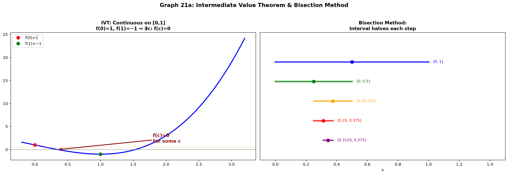
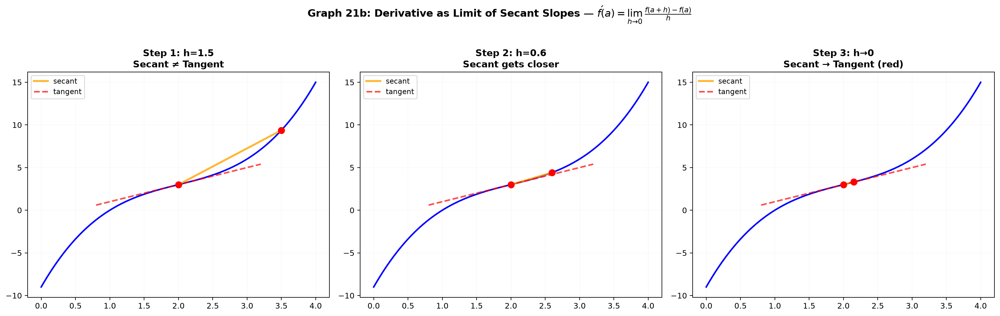

# Session 21: Rigorous Continuity and Derivatives

**Phase 2 — Proof Bridge | 90 min**

*You can compute derivatives in your sleep (Sessions 14A–C). Now prove why the rules work — using ε-δ continuity and the limit definition of the derivative. This is what separates "calculators" from mathematicians on credit exams.*

**Prerequisites**: ε-δ definition from Session 20. Limit laws. Proof by contradiction (Session 03).

---

## Part A: Continuity — The ε-δ Way

---

## Example 1: Continuity at a Point — No Jump, No Hole, No Break

$f$ is **continuous at $x=a$** if $\lim_{x \to a} f(x) = f(a)$.

In ε-δ language: $\forall \varepsilon > 0,\; \exists \delta > 0,\; |x-a| < \delta \Rightarrow |f(x)-f(a)| < \varepsilon$.

**Compare to the limit definition**: Two differences —
1. No $0<$ before $|x-a|$ (the point $a$ IS included).
2. The target $L$ is replaced by $f(a)$ — the function value.

**Prove $f(x)=3x+2$ is continuous at $x=1$**:
$|f(x)-f(1)| = |(3x+2)-5| = 3|x-1|$. Given $\varepsilon > 0$, choose $\delta = \varepsilon/3$.
$|x-1|<\delta \Rightarrow |f(x)-f(1)| < \varepsilon$. Done.

---

## Example 2: Proving $f(x)=x^2$ Is Continuous at Any $a$

$|f(x)-f(a)| = |x^2-a^2| = |x-a| \cdot |x+a|$.

Restrict $\delta \leq 1$: $|x-a|<1 \Rightarrow |x| < |a|+1$, so $|x+a| \leq |x|+|a| < 2|a|+1$.

Then $|x^2-a^2| < |x-a|(2|a|+1) < \delta(2|a|+1)$.

Choose $\delta = \min(1, \frac{\varepsilon}{2|a|+1})$.

Since this works for **any** $a$, $x^2$ is continuous on all of $\mathbb{R}$.

---

## Example 3: Three Ways Continuity Breaks

**Removable discontinuity (hole)**: $f(x)=\frac{x^2-1}{x-1}$ at $x=1$.
$\lim_{x \to 1} f(x) = 2$ exists, but $f(1)$ is undefined. The limit exists — the function value doesn't.

**Jump discontinuity**: $f(x)=\begin{cases} x, & x<0 \\ x+1, & x \geq 0 \end{cases}$ at $x=0$.
Left limit: $0$. Right limit: $1$. Both finite but different. $\lim_{x \to 0} f(x)$ does not exist.

**Essential discontinuity (infinite oscillation)**: $f(x)=\sin(1/x)$ at $x=0$.
No limit exists at all. The function oscillates infinitely often near 0.

**Key distinction**: If $\lim_{x \to a} f(x)$ exists AND equals $f(a)$, the function is continuous. If the limit exists but doesn't equal $f(a)$ (or $f(a)$ is undefined), it's a removable discontinuity — you can "fix" it by redefining $f(a)$.

---

## Example 4: Continuity on an Interval — The Whole Stretch

$f$ is **continuous on $[a,b]$** if it is continuous at every point in $(a,b)$, right-continuous at $a$, and left-continuous at $b$.

**Right-continuous at $a$**: $\lim_{x \to a^+} f(x) = f(a)$.
**Left-continuous at $b$**: $\lim_{x \to b^-} f(x) = f(b)$.

Polynomials, $\sin x$, $\cos x$, $e^x$, $\ln x$ (on $(0,\infty)$) are all continuous on their domains. This is why "plug it in" works for limits (Session 13A).

---

## Part B: The Big Theorems — IVT and EVT

---

## Example 5: Intermediate Value Theorem (IVT) — No Skipping

**Statement**: If $f$ is continuous on $[a,b]$ and $k$ is any number between $f(a)$ and $f(b)$, then there exists $c \in [a,b]$ such that $f(c) = k$.

**What it means**: A continuous function cannot jump over a value. If it starts at height 2 and ends at height 5, it must pass through every height between 2 and 5.

**Bisection proof sketch** (constructive — find $c$ by cutting the interval in half repeatedly):
1. Let $a_1 = a$, $b_1 = b$. Compute midpoint $m_1 = (a_1+b_1)/2$.
2. If $f(m_1) = k$, done. Set $c = m_1$.
3. If $f(m_1) < k$ and $f(b) > k$, the crossing is in $[m_1, b_1]$. Set $a_2 = m_1$, $b_2 = b_1$.
4. Otherwise the crossing is in $[a_1, m_1]$. Set $a_2 = a_1$, $b_2 = m_1$.
5. Repeat. The interval halves each time. The nested intervals shrink to a single point $c$. Continuity forces $f(c)=k$.

> **Completeness note**: "The nested intervals shrink to a single point $c$" is the **Nested Interval Theorem** — a completeness fact about $\mathbb{R}$ (no gaps), proved in Phase 3. Phase 2 takes it as intuitively clear: intervals whose lengths $\to 0$ cannot avoid collapsing onto one point.

**Application — root finding**: Prove $x^3 - x - 1 = 0$ has a solution in $[1, 2]$.
$f(1) = -1 < 0$, $f(2) = 5 > 0$. By IVT, $f(c)=0$ for some $c \in (1,2)$. (This $c \approx 1.3247$ is the plastic constant — it exists even if we can't write it as a simple radical.)



*Graph 21: The Intermediate Value Theorem. A continuous function on [a,b] must hit every value between f(a) and f(b). The bisection method cuts the interval in half repeatedly to locate the crossing point.*

---

## Example 6: Extreme Value Theorem (EVT) — Max and Min Exist

**Statement**: If $f$ is continuous on a closed interval $[a,b]$, then $f$ attains a maximum and minimum value on $[a,b]$. There exist $c, d \in [a,b]$ such that $f(c) \leq f(x) \leq f(d)$ for all $x \in [a,b]$.

**Why "closed interval" matters**:
- $f(x)=x$ on $(0,1)$: no max, no min — the endpoints are excluded.
- $f(x)=1/x$ on $(0,1]$: no max — the function blows up near 0.
- $f(x)=x^2$ on $[-1,2]$: min at $x=0$ ($f=0$), max at $x=2$ ($f=4$). Both attained.

**Proof idea** (not exam-essential but good to know): Uses the Bolzano-Weierstrass theorem — every bounded sequence has a convergent subsequence. Take a sequence approaching the supremum, extract a convergent subsequence, continuity gives the max.

> **Completeness note**: Bolzano-Weierstrass is a *completeness* fact — it says $\mathbb{R}$ has no gaps. Its proof belongs to Phase 3 (real analysis). Here EVT is taken as given; it is the one place in Phase 2 where completeness silently does the heavy lifting (see Session 22, Example 12).

**Practical use**: In optimization (Session 15B), when you check endpoints AND critical points, EVT guarantees you'll find the absolute max/min on a closed interval.

---

## Part C: The Derivative — Definition and First Proofs

---

## Example 7: The Derivative as a Limit

$f'(a) = \lim_{h \to 0} \frac{f(a+h) - f(a)}{h}$, provided this limit exists.

**Prove $f(x)=x^2$ has derivative $f'(a)=2a$**:
$\frac{(a+h)^2 - a^2}{h} = \frac{2ah + h^2}{h} = 2a + h$.
As $h \to 0$, $2a+h \to 2a$. Done. (The limit exists because the simplified expression is continuous at $h=0$.)

**Geometric meaning**: The slope of the secant line through $(a, f(a))$ and $(a+h, f(a+h))$ approaches the slope of the tangent line. The derivative IS the tangent slope.

---

## Example 8: Differentiability Implies Continuity — A One-Line Proof

**Theorem**: If $f$ is differentiable at $a$, then $f$ is continuous at $a$.

**Proof**:
$\lim_{x \to a} [f(x) - f(a)] = \lim_{x \to a} \left[\frac{f(x)-f(a)}{x-a} \cdot (x-a)\right]$.

The first factor $\to f'(a)$ (exists by hypothesis). The second factor $\to 0$.
Product of limits = $f'(a) \cdot 0 = 0$.

Thus $\lim_{x \to a} f(x) = f(a)$. Continuity holds.

**The converse is FALSE**: $f(x)=|x|$ is continuous at $0$ but not differentiable there.
$\lim_{h \to 0^+} \frac{|h|-0}{h} = 1$, $\lim_{h \to 0^-} \frac{|h|-0}{h} = -1$. Left and right difference quotients disagree — no derivative.



*Graph 21: The derivative as a limit of secant slopes. As h→0, the secant line through (a, f(a)) and (a+h, f(a+h)) rotates to become the tangent line. The slope of the red tangent = f'(a).*

---

## Example 9: Proving the Sum Rule — $(f+g)' = f' + g'$

$(f+g)'(a) = \lim_{h \to 0} \frac{(f+g)(a+h) - (f+g)(a)}{h}$
$= \lim_{h \to 0} \frac{f(a+h)+g(a+h) - f(a) - g(a)}{h}$
$= \lim_{h \to 0} \left[\frac{f(a+h)-f(a)}{h} + \frac{g(a+h)-g(a)}{h}\right]$
$= \lim_{h \to 0} \frac{f(a+h)-f(a)}{h} + \lim_{h \to 0} \frac{g(a+h)-g(a)}{h}$ (sum law for limits, Session 20)
$= f'(a) + g'(a)$.

Every derivative rule you memorized in Session 14 is provable from the limit definition and the limit laws.

---

## Example 10: Proving the Product Rule — $(fg)' = f'g + fg'$

$(fg)'(a) = \lim_{h \to 0} \frac{f(a+h)g(a+h) - f(a)g(a)}{h}$.

**The trick — add and subtract $f(a+h)g(a)$ in the numerator**:
$= \lim_{h \to 0} \frac{f(a+h)g(a+h) - f(a+h)g(a) + f(a+h)g(a) - f(a)g(a)}{h}$
$= \lim_{h \to 0} \left[f(a+h)\frac{g(a+h)-g(a)}{h} + g(a)\frac{f(a+h)-f(a)}{h}\right]$.

As $h \to 0$: $f(a+h) \to f(a)$ (continuity from Example 8), $\frac{g(a+h)-g(a)}{h} \to g'(a)$, $\frac{f(a+h)-f(a)}{h} \to f'(a)$.

Result: $f(a)g'(a) + g(a)f'(a) = f'(a)g(a) + f(a)g'(a)$. Done.

**This 4-line proof is frequently asked on credit exams.** The "add and subtract the cross term" trick is the heart of it.

---

## Example 11: Proving the Reciprocal Rule — $(1/g)' = -g'/g^2$

Assume $g(a) \neq 0$. Then:

$\frac{d}{dx}\left.\frac{1}{g(x)}\right|_{x=a} = \lim_{h \to 0} \frac{1/g(a+h) - 1/g(a)}{h}$
$= \lim_{h \to 0} \frac{g(a) - g(a+h)}{h \cdot g(a+h)g(a)}$
$= \lim_{h \to 0} \left[-\frac{g(a+h)-g(a)}{h} \cdot \frac{1}{g(a+h)g(a)}\right]$.

First factor $\to -g'(a)$. Second factor $\to 1/g(a)^2$ (by continuity of $g$).
Result: $-g'(a)/g(a)^2$.

**Together with the product rule, this proves the quotient rule**: $(f/g)' = (f'g - fg')/g^2$ — just write $f/g = f \cdot (1/g)$ and apply product + reciprocal rules.

---

## Example 12: The Chain Rule — Proof Sketch

**Statement**: $(f \circ g)'(a) = f'(g(a)) \cdot g'(a)$.

**Attempted naive proof** (flawed):
$\frac{f(g(a+h)) - f(g(a))}{h} = \frac{f(g(a+h)) - f(g(a))}{g(a+h)-g(a)} \cdot \frac{g(a+h)-g(a)}{h}$.

As $h \to 0$, the second factor $\to g'(a)$. The first factor $\to f'(g(a))$ IF $g(a+h) \neq g(a)$. But $g$ might be constant near $a$, making the denominator zero.

**Rigorous approach (Carathéodory's lemma)**:
$f$ is differentiable at $b = g(a)$ iff there exists a function $\phi$ continuous at $b$ with $\phi(b) = f'(b)$ such that $f(y) - f(b) = \phi(y)(y-b)$.

Similarly, $g(x) - g(a) = \psi(x)(x-a)$ with $\psi$ continuous at $a$, $\psi(a) = g'(a)$.

Then $f(g(x)) - f(g(a)) = \phi(g(x))(g(x)-g(a)) = \phi(g(x))\psi(x)(x-a)$.

Divide by $(x-a)$ and take the limit: $[\phi(g(a))] \cdot [\psi(a)] = f'(g(a)) \cdot g'(a)$.

**For credit exams**: know the statement of the chain rule proof strategy (Carathéodory or linear approximation). The full ε-δ chain rule proof is typically reserved for honors analysis.

---

> **🔗 Bridge to Multivariable**: In 1D, the derivative $f'(a)$ is a single number — the slope of the tangent line. In higher dimensions, the derivative becomes a **matrix**: the Jacobian $J$ (Session 26A). For $\vec{F}: \mathbb{R}^n \to \mathbb{R}^m$, the derivative at $\vec{a}$ is the $m\times n$ matrix of all partial derivatives $J_{ij} = \frac{\partial F_i}{\partial x_j}$. The linear approximation $\vec{F}(\vec{a}+\vec{h}) \approx \vec{F}(\vec{a}) + J\vec{h}$ replaces the 1D tangent line $f(a+h) \approx f(a) + f'(a)h$. Every derivative proof in this session — sum rule, product rule, chain rule — generalizes to the Jacobian. The product rule becomes matrix multiplication; the chain rule becomes $J_{F\circ G} = J_F \cdot J_G$. The limit definition $\lim_{h\to 0}\frac{f(a+h)-f(a)}{h}$ becomes $\lim_{\vec{h}\to\vec{0}}\frac{\|\vec{F}(\vec{a}+\vec{h}) - \vec{F}(\vec{a}) - J\vec{h}\|}{\|\vec{h}\|} = 0$ — the Jacobian is the unique linear map that makes this limit zero.

> **Up to here**: Continuity = limit equals function value (no 0< in definition). IVT: continuous on [a,b] ⇒ hits every intermediate value. EVT: continuous on closed [a,b] ⇒ max and min exist. Derivative = limit of difference quotient. Differentiability ⇒ continuity (converse false: |x| at 0). Sum, product, reciprocal rules proved from limit laws. Chain rule = Carathéodory lemma or linear approximation.

---

## Part D: Sequences and Continuity — The Missing Tools

---

## Example 13: The Sequential Criterion — Limits Through Sequences

**Statement**: $\lim_{x \to a} f(x) = L$ iff for **every** sequence $x_n \to a$ with $x_n \neq a$, we have $f(x_n) \to L$.

**Continuity version**: $f$ is continuous at $a$ iff for every sequence $x_n \to a$, $f(x_n) \to f(a)$.

**Proof (limit version, both directions — Phase 1 templates):**

*($\Rightarrow$, direct)*: Suppose $\lim_{x \to a} f = L$ and $x_n \to a$. Given $\varepsilon > 0$, the ε-δ definition supplies a $\delta > 0$. Since $x_n \to a$, there is $N$ with $n \geq N \Rightarrow |x_n - a| < \delta$. Then (because $x_n \neq a$) $|f(x_n) - L| < \varepsilon$. So $f(x_n) \to L$.

*($\Leftarrow$, contrapositive)*: Suppose the ε-δ limit fails — the negation from Session 20, Example 14: $\exists \varepsilon > 0$ such that for every $\delta = 1/n$ there is an $x_n$ with $0 < |x_n - a| < 1/n$ and $|f(x_n)-L| \geq \varepsilon$. Then $x_n \to a$ but $f(x_n) \not\to L$ — a sequence witness to failure.

**Use 1 — proving a limit with sequences**: $\lim_{x \to 0} x\sin(1/x) = 0$: for any $x_n \to 0$, $|x_n\sin(1/x_n)| \leq |x_n| \to 0$, so $x_n\sin(1/x_n) \to 0$ (squeeze on sequences).

**Use 2 — proving discontinuity with sequences**: $f(x) = \begin{cases} 1, & x \geq 0 \\ 0, & x < 0 \end{cases}$ at $a=0$: take $x_n = 1/n \to 0$ → $f(x_n) = 1 \to 1$; take $y_n = -1/n \to 0$ → $f(y_n) = 0 \to 0$. Two sequences, different limits → no limit → not continuous. (The jump discontinuity of Example 3, proven cleanly.)

> **Insight**: The sequential criterion is the bridge between Session 20's ε-N (sequences) and ε-δ (functions). Discontinuity proofs become "find two sequences with different limits" — often far easier than a direct ε-δ negation.

---

## Example 14: Continuity Closure — New Continuous Functions From Old

**Theorem**: If $f$ and $g$ are continuous at $a$, then so are $f+g$, $fg$, and (if $g(a) \neq 0$) $f/g$. If $g$ is continuous at $a$ and $f$ is continuous at $g(a)$, then $f \circ g$ is continuous at $a$.

**Proofs — one line each via the sequential criterion** (Example 13): for any $x_n \to a$,
- $f(x_n) \to f(a)$ and $g(x_n) \to g(a)$ (continuity of $f$, $g$);
- $(f+g)(x_n) = f(x_n)+g(x_n) \to f(a)+g(a)$ (sum law for sequences, Session 20);
- $(fg)(x_n) \to f(a)g(a)$ (product law for sequences);
- $(f/g)(x_n) \to f(a)/g(a)$ when $g(a) \neq 0$ (quotient law — $g(x_n) \neq 0$ eventually);
- $(f \circ g)(x_n) = f(g(x_n)) \to f(g(a))$ (continuity of $f$ at $g(a)$).

By the sequential criterion, each new function is continuous. ✓

**Payoff — why "plug it in" always worked (Session 13A)**: Every polynomial is a sum of products of the constant function and $f(x)=x$ — so all polynomials are continuous on $\mathbb{R}$. Rational functions $P/Q$ are continuous wherever $Q \neq 0$. Compositions like $e^{\sin x}$ are continuous. This is the rigorous justification behind Example 4's assertion.

> **Up to here**: Sequential criterion — continuity ⟺ every sequence works. Closure — sums, products, quotients ($g(a)\neq0$), and compositions of continuous functions are continuous. These two tools turn "polynomials are continuous" from an assertion into a proved fact.

---

## Common Mistakes

### Mistake 1: Confusing the limit definition with the continuity definition

**Wrong**: Writing $0 < |x-a| < \delta$ in the continuity definition. **Right**: Continuity uses $|x-a| < \delta$ — the point $x=a$ IS included because we care about $f(a)$ this time.

### Mistake 2: Thinking continuity implies differentiability

**Wrong**: "$|x|$ is continuous so it must be differentiable." **Right**: Continuity is necessary but not sufficient for differentiability. $|x|$ has a corner at $x=0$ — the two one-sided difference quotients disagree (1 vs −1).

### Mistake 3: Forgetting to check endpoints for EVT

**Wrong**: "The maximum of $f(x)=x$ on $(0,1)$ is... well, it's almost 1." **Right**: On an open interval, the supremum may not be attained. EVT requires a CLOSED interval $[a,b]$ — the endpoints must be included.

### Mistake 4: Misapplying IVT without verifying continuity

**Wrong**: "$f(x)=1/x$ on $[-1,1]$: $f(-1)=-1$, $f(1)=1$, so $f(c)=0$ for some $c$." **Right**: $f(x)=1/x$ is NOT continuous on $[-1,1]$ (it blows up at 0). IVT does not apply.

---

## What We Just Did

```
(1) Continuity: limit = f(a). ε-δ: ∀ε>0 ∃δ>0 |x-a|<δ ⇒ |f(x)-f(a)|<ε.
    Three discontinuity types: removable, jump, essential.

(2) IVT: continuous on [a,b] → hits every value between f(a) and f(b).
    Bisection proof. Application: existence of roots.

(3) EVT: continuous on closed [a,b] → max and min exist.
    Open intervals or non-continuous functions can fail.

(4) Derivative: f'(a)=lim_{h→0}[f(a+h)-f(a)]/h. Differentiability⇒continuity.
    |x| is continuous but not differentiable at 0.

(5) Derivative rules proved: sum (limit sum law), product (add-subtract trick),
    reciprocal (→quotient rule). Chain rule: Carathéodory linear approximation.

(6) Sequential criterion: f continuous at a ⟺ every sequence x_n→a has
    f(x_n)→f(a). Discontinuity proofs become "find two sequences with
    different limits."

(7) Continuity closure: sums, products, quotients (g(a)≠0), and
    compositions of continuous functions are continuous.
    → polynomials and rational functions are continuous on their domains.
```

---

## Practice 1

Use ε-δ to prove $f(x)=5x-3$ is continuous at $x=2$. State δ in terms of ε.

→ Reference: **Example 1**

> Solutions: [Solutions](solutions/21-solutions.md#practice-1)

---

## Practice 2

Prove $f(x)=\sqrt{x}$ is continuous at $x=4$ using ε-δ. (Hint: $|\sqrt{x}-2| = \frac{|x-4|}{\sqrt{x}+2} \leq \frac{|x-4|}{2}$.)

→ Reference: **Example 2**

> Solutions: [Solutions](solutions/21-solutions.md#practice-2)

---

## Practice 3

Use IVT to prove $x^5 - 3x + 1 = 0$ has at least one real root. (Test $x=0$ and $x=1$.)

→ Reference: **Example 5**

> Solutions: [Solutions](solutions/21-solutions.md#practice-3)

---

## Practice 4

Using the limit definition of the derivative, find $f'(a)$ for $f(x)=\frac{1}{x}$ (for $a \neq 0$).

→ Reference: **Example 7, 11**

> Solutions: [Solutions](solutions/21-solutions.md#practice-4)

---

## Practice 5

Prove the product rule for three functions: $(fgh)' = f'gh + fg'h + fgh'$. (Apply the two-function product rule twice.)

→ Reference: **Example 10**

> Solutions: [Solutions](solutions/21-solutions.md#practice-5)

---

## Practice 6: Real Battle (Constructive)

A function $f$ satisfies $|f(x)-f(y)| \leq (x-y)^2$ for all real $x,y$. Prove: (a) $f$ is continuous everywhere. (b) $f$ is differentiable everywhere AND $f'(x)=0$ for all $x$. (c) Conclude that $f$ is constant. This is a classic "Lipschitz-squared implies constant" problem.

> Solutions: [Solutions](solutions/21-solutions.md#practice-6)

---

## Basic Drills

> ε-δ continuity proofs, derivative by definition, basic rule proofs.

**D1.** Prove $f(x)=2x+7$ is continuous at $x=3$ (ε-δ). Give δ in terms of ε.

**D2.** Prove $f(x)=4-x$ is continuous at any $a$ (ε-δ). Give δ in terms of ε.

**D3.** Classify the discontinuity of $f(x)=\frac{x^2-4}{x-2}$ at $x=2$ (removable, jump, or essential). Justify.

**D4.** Use IVT to show that $x^3-2=0$ has a solution in $[1,2]$.

**D5.** Using the limit definition, find $f'(a)$ for $f(x)=3x+1$. Show all steps.

**D6.** Using the limit definition, find $f'(a)$ for $f(x)=x^2+2x$. Show all steps.

**D7.** Prove: if $f$ and $g$ are differentiable at $a$, then $(f-g)'(a) = f'(a) - g'(a)$. (Use the sum rule and constant multiple rule.)

**D8.** Prove: $\frac{d}{dx}[c \cdot f(x)] = c \cdot f'(x)$ using the limit definition. ($c$ is constant.)

**D9.** Explain why $f(x)=|x-2|$ is continuous but not differentiable at $x=2$. Compute the left and right difference quotients.

**D10.** State the negation of "$f$ is continuous at $a$" in ε-δ symbols. Explain in plain English what it means for a function to be discontinuous.

**D11.** Use the sequential criterion to prove that $f(x)=\sin(1/x)$ (with $f(0)=0$) is NOT continuous at $x=0$. (Choose two sequences $x_n, y_n \to 0$ with different $f$-limits.)

**D12.** Prove that $f(x)=|x|$ is continuous at $x=0$ using the sequential criterion.

> Solutions: [Solutions](solutions/21-solutions.md#basic-drill)

---

## Advanced Drills

> Rigorous proofs, counterexamples, and deeper connections.

**A1.** Prove $f(x)=x^3$ is continuous at any $a$ using ε-δ. (Factor $|x^3-a^3| = |x-a|\cdot|x^2+ax+a^2|$. Bound the quadratic factor.)

**A2.** Prove: if $f$ is continuous at $a$ and $f(a) > 0$, then there exists $\delta > 0$ such that $f(x) > f(a)/2$ for all $x$ with $|x-a| < \delta$. (This is the "sign-preserving property" of continuous functions.)

**A3.** A function $f$ on $[0,1]$ satisfies $f(0)=1$, $f(1)=0$, and $f$ is continuous. Prove there exists $c \in (0,1)$ with $f(c)=c$. (Apply IVT to $g(x)=f(x)-x$.)

**A4.** Prove the quotient rule: if $f$ and $g$ are differentiable at $a$ and $g(a) \neq 0$, then $(f/g)'(a) = \frac{f'(a)g(a) - f(a)g'(a)}{[g(a)]^2}$. (Write $f/g = f \cdot (1/g)$ and use the product + reciprocal rules.)

**A5.** Prove: if $f'(a)$ exists, then $\lim_{h \to 0} \frac{f(a+h)-f(a-h)}{2h} = f'(a)$. (This is the "symmetric difference quotient" — it often gives a better numerical approximation.) Show, however, that this limit can exist even when $f$ is NOT differentiable. (Hint: $f(x)=|x|$ at $a=0$.)

**A6.** Prove the **power rule** for positive integers by induction: $\frac{d}{dx}x^n = nx^{n-1}$ for $n \in \mathbb{N}$. (Base case $n=1$, inductive step uses the product rule: $x^{n} = x \cdot x^{n-1}$.)

**A7.** Prove that $f(x)=\begin{cases} x^2\sin(1/x), & x \neq 0 \\ 0, & x=0 \end{cases}$ is differentiable at $x=0$ and find $f'(0)$. (Use the limit definition directly — the derivative exists even though $f'$ is not continuous at 0.)

**A8.** A function satisfies $|f(x)| \leq x^2$ for all $x$. Prove $f(0)=0$, $f$ is continuous at 0, and $f'(0)=0$. (Use the squeeze theorem for the derivative definition.)

**A9.** Prove the **chain rule** for the special case where $g(x)=mx+b$ (linear inner function): $\frac{d}{dx}f(mx+b) = m \cdot f'(mx+b)$. (Use the limit definition directly — no Carathéodory needed.)

**A10.** (Proof reading) A student writes: "By IVT, since $f(0)=-1$ and $f(2)=3$, there exists $c$ with $f(c)=2$." Critique this reasoning: what unstated assumption is the student making? Write a fully rigorous IVT application for a specific $f$ of your choice.

**A11.** Prove, using the sequential criterion, that if $g$ is continuous at $a$ and $g(a) \neq 0$, then $1/g$ is continuous at $a$. Then conclude $f/g$ is continuous wherever $g \neq 0$.

**A12.** Prove the composition law: if $g$ is continuous at $a$ and $f$ is continuous at $g(a)$, then $f \circ g$ is continuous at $a$. Do it two ways — (i) via the sequential criterion, (ii) via ε-δ directly.

> Solutions: [Solutions](solutions/21-solutions.md#advanced-drill)

---

## Today's Procedure

```
Step 1: Continuity = lim_{x→a} f(x) = f(a). ε-δ: drop the 0<.
        IVT: continuous on [a,b] → hits every intermediate value.
        EVT: continuous on closed [a,b] → max and min exist.

Step 2: Derivative = limit of difference quotient. Prove differentiability
        ⇒ continuity. Counterexample: |x| at 0.

Step 3: Prove derivative rules from the limit definition.
        Sum (limit sum law). Product (add-subtract trick).
        Reciprocal → Quotient. Chain rule (linear approximation).
        Power rule (induction + product rule).

Step 4: Sequential criterion — continuity ⟺ all sequences work.
        Closure — build new continuous functions from old
        (sum / product / quotient / compose).
        Completeness (nested intervals, Bolzano-Weierstrass) is Phase 3;
        Phase 2 assumes it as an axiom.
```

---

## How to Read These Symbols

| Symbol | Reads as | Meaning |
|:---:|:---:|------|
| $f'(a)$ | "f prime of a" | derivative at a — slope of tangent line |
| $\frac{d}{dx}$ | "d d x" / "derivative operator" | take the derivative with respect to x |
| $(f+g)' = f' + g'$ | "f plus g prime equals f prime plus g prime" | sum rule — derivative distributes over addition |
| $(fg)' = f'g + fg'$ | "f g prime equals f prime g plus f g prime" | product rule — NOT simply f'g'! |
| $(1/g)' = -g'/g^2$ | "one over g prime equals negative g prime over g squared" | reciprocal rule — special case of quotient rule |
| $(f \circ g)' = f'(g) \cdot g'$ | "f composed with g prime equals f prime of g times g prime" | chain rule — differentiate outer, multiply by inner derivative |
| IVT | "I V T" / "Intermediate Value Theorem" | continuous f on [a,b] hits every value between f(a) and f(b) |
| EVT | "E V T" / "Extreme Value Theorem" | continuous f on closed [a,b] attains max and min |
| $C^0, C^1, C^2$ | "C zero, C one, C two" | C⁰=continuous, C¹=continuously differentiable, C²=second derivative continuous |
| removable / jump / essential | "removable" / "jump" / "essential" | three discontinuity types: hole, step, infinite oscillation |
| sequential criterion | "sequential criterion" | f continuous at a ⟺ every x_n→a has f(x_n)→f(a) |
| continuity closure | "closure under arithmetic" | sums/products/quotients/compositions of continuous functions are continuous |


---

## Terminology

| What we call it | Math term | Notation |
|:---:|:---:|:---:|
| no break, no jump, no hole | continuous at a point | $\lim_{x \to a} f(x) = f(a)$ |
| hole that can be plugged | removable discontinuity | limit exists $\neq f(a)$ |
| left and right limits differ | jump discontinuity | $\lim_{x\to a^-} \neq \lim_{x\to a^+}$ |
| crosses every intermediate value | Intermediate Value Theorem (IVT) | $f$ continuous, $k$ between $f(a),f(b)$ |
| max and min exist on closed interval | Extreme Value Theorem (EVT) | $f$ continuous on $[a,b]$ |
| slope of tangent line | derivative at a point | $f'(a) = \lim_{h\to 0} \frac{f(a+h)-f(a)}{h}$ |
| differentiability forces continuity | diff'able ⇒ continuous | (converse false) |
| derivative of sum | sum rule | $(f+g)' = f' + g'$ |
| derivative of product | product rule (Leibniz rule) | $(fg)' = f'g + fg'$ |
| derivative of reciprocal | reciprocal rule | $(1/g)' = -g'/g^2$ |
| derivative of composition | chain rule | $(f\circ g)' = (f'\circ g) \cdot g'$ |
| add-and-subtract proof technique | cross-term trick | $f(a+h)g(a+h)-f(a)g(a)$ |
| sequence version of continuity | sequential criterion | $x_n \to a \Rightarrow f(x_n) \to f(a)$ |
| new continuous functions from old | closure theorems | $f+g,\; fg,\; f/g,\; f\circ g$ |
| nested intervals collapse to a point | Nested Interval Theorem | (Phase 3) |
