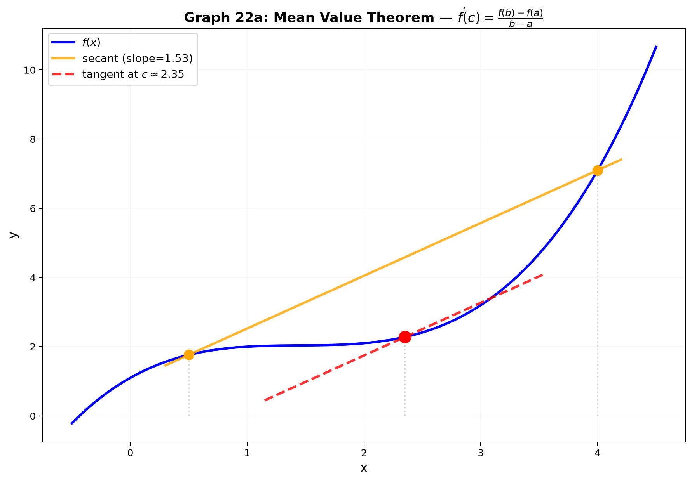
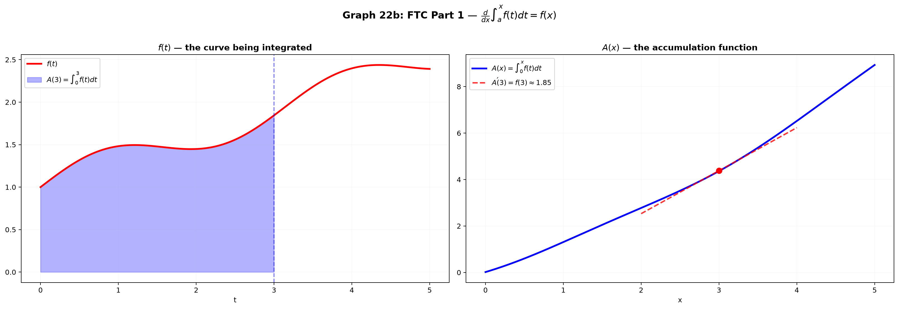

# Session 22: The Crown Jewels — MVT, FTC, and Taylor's Theorem

**Phase 2 — Proof Bridge | 90 min**

*Three theorems hold calculus together. The Mean Value Theorem justifies every "f' > 0 ⇒ increasing" argument. The Fundamental Theorem of Calculus links derivatives to integrals. Taylor's Theorem tells you how good your polynomial approximations are. Prove them, and you own calculus.*

**Prerequisites**: Continuity (Session 21). ε-δ limits (Session 20). Proof by induction (Session 04). Rolle's theorem is proved here from EVT.

---

## Part A: Rolle's Theorem and the Mean Value Theorem

---

## Example 1: Rolle's Theorem — When Two Ends Are Level, Something Flat Happens

**Statement**: If $f$ is continuous on $[a,b]$ and differentiable on $(a,b)$, and $f(a)=f(b)$, then there exists $c \in (a,b)$ such that $f'(c)=0$.

**Proof** (using EVT from Session 21):
Since $f$ is continuous on the closed interval $[a,b]$, EVT says $f$ attains a maximum $M$ and minimum $m$ on $[a,b]$.

**Case 1 — Both extrema at endpoints**: Since $f(a)=f(b)$, $M=m$, so $f$ is constant on $[a,b]$. Then $f'(c)=0$ for EVERY $c \in (a,b)$. Done.

**Case 2 — One extremum inside $(a,b)$**: Say the maximum occurs at $c \in (a,b)$. Since $c$ is interior and $f$ is differentiable there:
$f'(c) = \lim_{h \to 0} \frac{f(c+h)-f(c)}{h}$.

For $h>0$ (right side): $f(c+h) \leq f(c)$ (c is max) → $\frac{f(c+h)-f(c)}{h} \leq 0$ → $f'(c) \leq 0$.
For $h<0$ (left side): $f(c+h) \leq f(c)$ → $\frac{f(c+h)-f(c)}{h} \geq 0$ → $f'(c) \geq 0$.

Both $f'(c) \leq 0$ and $f'(c) \geq 0$ → $f'(c) = 0$. Same argument if the minimum occurs inside.

**Physical intuition**: Throw a ball straight up. At its highest point, the velocity is zero for an instant. Rolle's theorem guarantees that instant exists.

---

## Example 2: MVT — There's Always a Point Where Slope = Average Slope

**Statement**: If $f$ is continuous on $[a,b]$ and differentiable on $(a,b)$, then there exists $c \in (a,b)$ such that $f'(c) = \frac{f(b)-f(a)}{b-a}$.

**Proof** (reduce to Rolle's theorem):
Define $g(x) = f(x) - \left[f(a) + \frac{f(b)-f(a)}{b-a}(x-a)\right]$.

The bracketed term is the equation of the **secant line** from $(a,f(a))$ to $(b,f(b))$. $g(x)$ measures the vertical gap between $f(x)$ and this secant line.

Check: $g(a)=0$, $g(b)=0$. $g$ is continuous on $[a,b]$ and differentiable on $(a,b)$ (sum/difference of such functions).

By Rolle's theorem, $\exists c \in (a,b)$ with $g'(c)=0$.

$g'(x) = f'(x) - \frac{f(b)-f(a)}{b-a}$.

$g'(c)=0 \Rightarrow f'(c) = \frac{f(b)-f(a)}{b-a}$. Done.



*Graph 22: The Mean Value Theorem. The secant through (a,f(a)) and (b,f(b)) has slope [f(b)−f(a)]/(b−a). MVT guarantees at least one point c where the tangent (red) is parallel to this secant.*

---

## Example 3: MVT Corollaries — The Rules You've Been Using

**Corollary 1 — Zero derivative ⇒ constant**: If $f'(x)=0$ for all $x \in (a,b)$, then $f$ is constant on $[a,b]$.

**Proof**: Take any $x_1 < x_2$ in $[a,b]$. Apply MVT on $[x_1, x_2]$:
$f(x_2)-f(x_1) = f'(c)(x_2-x_1)$ for some $c \in (x_1, x_2)$.
But $f'(c)=0$, so $f(x_2)=f(x_1)$. All values equal → $f$ constant.

**Corollary 2 — Positive derivative ⇒ strictly increasing**: If $f'(x) > 0$ on $(a,b)$, then $f$ is strictly increasing on $[a,b]$.

**Proof**: $f(x_2)-f(x_1) = f'(c)(x_2-x_1) > 0$ (positive × positive). So $f(x_2) > f(x_1)$.

**Corollary 3 — Equal derivatives ⇒ differ by constant**: If $f'(x)=g'(x)$ for all $x$, then $f(x)=g(x)+C$ for some constant $C$.

**Proof**: Let $h(x)=f(x)-g(x)$. Then $h'(x)=0$, so by Corollary 1, $h(x)=C$ constant. Thus $f(x)=g(x)+C$.

**These three corollaries justify every "solve f'=0" and "anti-derivative + C" you've ever written.**

---

## Example 4: MVT Error Bounds — Estimating Without Computing

MVT gives: $|f(b)-f(a)| = |f'(c)| \cdot |b-a| \leq (\max_{[a,b]} |f'|) \cdot |b-a|$.

**Application**: Estimate $\sqrt{101}$.

Let $f(x)=\sqrt{x}$ on $[100, 101]$. $f'(x)=\frac{1}{2\sqrt{x}} \leq \frac{1}{20}$ on $[100,101]$.
MVT: $|\sqrt{101}-\sqrt{100}| \leq \frac{1}{20} \cdot 1 = 0.05$.
So $\sqrt{101} = 10 \pm 0.05$. (Actual value: $10.04987...$ — within the bound.)

---

## Part B: The Fundamental Theorem of Calculus

---

## Example 5: FTC Part 1 — Differentiation Undoes Integration

**Statement**: If $f$ is continuous on $[a,b]$ and $F(x) = \int_a^x f(t)\,dt$ for $x \in [a,b]$, then $F$ is differentiable on $(a,b)$ and $F'(x) = f(x)$.

**Proof** (using MVT for integrals):

$F'(x) = \lim_{h \to 0} \frac{F(x+h)-F(x)}{h} = \lim_{h \to 0} \frac{1}{h}\int_x^{x+h} f(t)\,dt$.

For $h>0$: By the Extreme Value Theorem (Session 21), $f$ attains min $m_h$ and max $M_h$ on $[x, x+h]$. Then:
$m_h \cdot h \leq \int_x^{x+h} f(t)\,dt \leq M_h \cdot h$.

Divide by $h$: $m_h \leq \frac{1}{h}\int_x^{x+h} f(t)\,dt \leq M_h$.

As $h \to 0^+$, continuity of $f$ forces $m_h \to f(x)$ and $M_h \to f(x)$. By the squeeze theorem (Session 20), the middle term $\to f(x)$. Same for $h \to 0^-$.

Thus $F'(x) = f(x)$. The derivative of the accumulation function is the original function.

**The physical meaning**: If $f(t)$ is your speed at time $t$, then $F(x)$ is the distance traveled from time $a$ to $x$. FTC Part 1 says: the rate of change of distance IS speed. Obvious in hindsight, profound in proof.

---

## Example 6: FTC Part 2 — The Evaluation Theorem

**Statement**: If $F$ is any antiderivative of $f$ on $[a,b]$ (i.e., $F' = f$), then $\int_a^b f(x)\,dx = F(b) - F(a)$.

**Proof**: Let $G(x) = \int_a^x f(t)\,dt$. By FTC Part 1, $G'(x) = f(x) = F'(x)$.

So $G'(x) = F'(x)$ for all $x$. By MVT Corollary 3, $G(x) = F(x) + C$ for some constant $C$.

Evaluate at $x=a$: $G(a) = \int_a^a f(t)\,dt = 0 = F(a) + C$ → $C = -F(a)$.

Thus $G(x) = F(x) - F(a)$.

Evaluate at $x=b$: $\int_a^b f(t)\,dt = G(b) = F(b) - F(a)$. Done.

**This 6-line proof connects the two halves of calculus. The heavy lifting was FTC Part 1. FTC Part 2 follows almost trivially from MVT.**

---

## Example 7: Using FTC to Prove the Net Change Principle

**Net change**: $\int_a^b f'(x)\,dx = f(b) - f(a)$. This is FTC Part 2 with $F = f$ and $f$ replaced by $f'$.

**Application**: If water flows into a tank at rate $r(t)$ gallons/min, the total water added from $t=0$ to $t=T$ is $\int_0^T r(t)\,dt$. FTC says this equals $V(T)-V(0)$ where $V$ is the volume function. Computing the integral of the rate gives the net change.



*Graph 22: FTC Part 1 visualized. The red curve f(t). The blue area A(x)=∫_a^x f(t)dt. The rate at which area accumulates at x (the slope of the blue curve's tangent) equals f(x) — the height of the red curve at that point.*

---

## Part C: Taylor's Theorem — Approximating with Polynomials

---

## Example 8: Linear Approximation with Error Bound

From Session 15A, you know the tangent line approximation: $f(x) \approx f(a) + f'(a)(x-a)$.

**How good is it?** MVT gives the answer:

$f(x) = f(a) + f'(c)(x-a)$ for some $c$ between $a$ and $x$. This is EXACT for some $c$, but we don't know which $c$. The error is $|f'(c)-f'(a)|\cdot|x-a|$. If $f'$ doesn't vary much, the approximation is good.

**Better version — Taylor's theorem with Lagrange remainder for $n=1$**:
$f(x) = f(a) + f'(a)(x-a) + \frac{f''(\xi)}{2}(x-a)^2$ for some $\xi$ between $a$ and $x$.

Now the error is proportional to $(x-a)^2$ and $f''$ — both are small when $x$ is close to $a$ and curvature is mild.

---

## Example 9: Taylor's Theorem — The Full Statement

**Taylor's Theorem with Lagrange Remainder**: If $f$ is $n+1$ times differentiable on an interval containing $a$, then for any $x$ in that interval:

$$
f(x) = \sum_{k=0}^{n} \frac{f^{(k)}(a)}{k!}(x-a)^k + R_n(x)
$$

where the remainder $R_n(x) = \frac{f^{(n+1)}(\xi)}{(n+1)!}(x-a)^{n+1}$ for some $\xi$ between $a$ and $x$.

**The polynomial part** $P_n(x) = \sum_{k=0}^{n} \frac{f^{(k)}(a)}{k!}(x-a)^k$ is the **Taylor polynomial** — the best degree-$n$ polynomial approximation to $f$ near $a$.

**The remainder** tells you exactly how far off the approximation could be.

---

## Example 10: Bounding Approximations — $\sin(0.1)$ to 5 Decimal Places

$f(x)=\sin x$, $a=0$. Derivatives cycle: $\sin \to \cos \to -\sin \to -\cos \to \sin \to \cdots$.

At $x=0$: $f(0)=0$, $f'(0)=1$, $f''(0)=0$, $f'''(0)=-1$, $f^{(4)}(0)=0$, $f^{(5)}(0)=1$, ...

Taylor polynomial of degree 5: $P_5(x) = x - \frac{x^3}{6} + \frac{x^5}{120}$.

Remainder bound: $|R_5(x)| \leq \frac{|f^{(6)}(\xi)|}{6!}|x|^6 \leq \frac{1}{720}(0.1)^6$ (since $|\sin^{(6)}| \leq 1$).

$(0.1)^6 = 10^{-6}$, so $|R_5(0.1)| \leq 1/720 \times 10^{-6} \approx 1.4 \times 10^{-9}$.

$P_5(0.1) = 0.1 - 0.001666... + 0.0000008333... = 0.0998334166...$

The error is less than $10^{-8}$. $\sin(0.1) = 0.0998334166468...$ — our approximation is correct to 8 decimal places.

---

## Example 11: Taylor Proof Strategy — Generalized MVT (Cauchy MVT)

The proof of Taylor's theorem uses repeated applications of the **Cauchy Mean Value Theorem**:

**Cauchy MVT**: If $f$ and $g$ are continuous on $[a,b]$ and differentiable on $(a,b)$, with $g'(x) \neq 0$, then $\exists c \in (a,b)$ with $\frac{f'(c)}{g'(c)} = \frac{f(b)-f(a)}{g(b)-g(a)}$.

(Proof: Apply Rolle's theorem to $h(x)=[f(b)-f(a)]g(x) - [g(b)-g(a)]f(x)$. Check $h(a)=h(b)$.)

**Taylor proof sketch** (for $n=1$ as a warm-up):
Define $\phi(t) = f(t) + f'(t)(x-t)$. Then $\phi(x)=f(x)$, $\phi(a)=f(a)+f'(a)(x-a)$.
The difference $R_1(x)=f(x)-\phi(a)$ can be expressed via Cauchy MVT applied to $\phi$ and $(x-t)^2$.
The general case uses induction (Session 04) with Cauchy MVT at each step.

**For credit exams**: Know you can bound $|R_n(x)|$ using $\frac{\max |f^{(n+1)}|}{(n+1)!}|x-a|^{n+1}$. The proof itself is typically "state, don't reproduce."

---

## Example 12: The Big Picture — All Theorems Connected

```
EVT (Session 21) → Rolle's Theorem → MVT → FTC Part 1 → FTC Part 2
                                    ↓
                              Cauchy MVT → Taylor's Theorem
```

Every "obvious" calculus fact traces back to the completeness of the real numbers (Session 05 — $\mathbb{R}$ has no gaps). EVT is where completeness enters calculus. From there, everything cascades.

---

> **🔗 Bridge to Multivariable**: In 2D, the second-order Taylor expansion reveals the **Hessian matrix** $H$ (Sessions 23B, 26B):
>
> $$f(\vec{a}+\vec{h}) = f(\vec{a}) + \nabla f(\vec{a})\cdot\vec{h} + \frac{1}{2}\vec{h}^{\mathsf{T}} H(\vec{a}) \vec{h} + \cdots$$
>
> The Hessian $H_{ij} = \frac{\partial^2 f}{\partial x_i \partial x_j}$ is a symmetric matrix of second partials. The quadratic term $\frac{1}{2}\vec{h}^{\mathsf{T}}H\vec{h}$ generalizes $\frac{1}{2}f''(a)h^2$ from 1D. At a critical point ($\nabla f = \vec{0}$), the Hessian determines whether the point is a minimum ($H$ positive definite — all eigenvalues > 0), maximum ($H$ negative definite), or saddle ($H$ indefinite). This is why the second derivative test in 24B uses $D = f_{xx}f_{yy} - f_{xy}^2 = \det H$ — the determinant of the $2\times2$ Hessian. The Lagrange remainder also generalizes: $R_2 = \frac{1}{6}\sum_{i,j,k}\frac{\partial^3 f}{\partial x_i\partial x_j\partial x_k}(\vec{\xi}) h_i h_j h_k$.

> **Up to here**: Rolle: f(a)=f(b) ⇒ ∃c with f'(c)=0 (proof via EVT). MVT: ∃c with f'(c)=[f(b)-f(a)]/(b-a) (proof via Rolle on gap function). MVT corollaries: f'=0⇒constant, f'>0⇒increasing, f'=g'⇒f=g+C. FTC Part 1: d/dx ∫_a^x f = f(x) (proof via EVT + squeeze). FTC Part 2: ∫_a^b f = F(b)-F(a) (proof via FTC Part 1 + MVT). Taylor: f(x)=P_n(x)+R_n(x), Lagrange remainder R_n = f^{(n+1)}(ξ)/(n+1)!·(x-a)^{n+1}. Error bounding via max of |f^{(n+1)}|.

---

## Common Mistakes

### Mistake 1: Applying MVT without checking differentiability on (a,b)

**Wrong**: MVT on $f(x)=|x|$ on $[-1,2]$. **Right**: $f(x)=|x|$ is NOT differentiable at $x=0$, which is inside $(-1,2)$. MVT does not apply. (Though Rolle's theorem failing here is actually how you prove $|x|$ has a corner.)

### Mistake 2: Confusing FTC Part 1 and Part 2

**Wrong**: "FTC says $\frac{d}{dx}\int_a^x f = F(x)-F(a)$." **Right**: Part 1 says $\frac{d}{dx}\int_a^x f = f(x)$. Part 2 says $\int_a^b f = F(b)-F(a)$ where $F'=f$. They're different statements that work together.

### Mistake 3: Forgetting the absolute value in Taylor remainder bounds

**Wrong**: "The error is $\frac{f^{(n+1)}(\xi)}{(n+1)!}(x-a)^{n+1}$ exactly, no absolute value." **Right**: You typically bound $|R_n(x)|$ using $\frac{\max|f^{(n+1)}|}{(n+1)!}|x-a|^{n+1}$. The sign of the error (over vs. under estimate) depends on $f^{(n+1)}(\xi)$.

### Mistake 4: Using Taylor's theorem when derivatives don't exist

**Wrong**: Taylor-expanding $|x|$ around $x=0$. **Right**: $|x|$ is not differentiable at 0, let alone higher-order differentiable. Taylor's theorem requires $f \in C^{n+1}$ (or at least $n+1$ times differentiable).

---

## What We Just Did

```
(1) Rolle's Theorem: equal endpoints ⇒ horizontal tangent somewhere.
    Proof: EVT + interior extremum has zero derivative.

(2) Mean Value Theorem: secant slope = tangent slope at some c.
    Proof: subtract secant line, apply Rolle.
    Corollaries: f'=0⇒constant, f'>0⇒increasing, f'=g'⇒f=g+C.

(3) FTC Part 1: d/dx of accumulation = original function.
    Proof: difference quotient + squeeze theorem + continuity.
    FTC Part 2: definite integral = antiderivative difference.
    Proof: FTC Part 1 + MVT corollary (equal derivatives differ by constant).

(4) Taylor's Theorem: f(x) = Taylor polynomial + remainder.
    Lagrange remainder: R_n = f^{(n+1)}(ξ)/(n+1)!·(x-a)^{n+1}.
    Error bounding: |R_n| ≤ (max|f^{(n+1)}|)/(n+1)!·|x-a|^{n+1}.
```

---

## Practice 1

Verify Rolle's theorem for $f(x)=x^2-4x$ on $[0, 4]$. Find the $c$ where $f'(c)=0$.

→ Reference: **Example 1**

> Solutions: [Solutions](solutions/22-solutions.md#practice-1)

---

## Practice 2

Apply MVT to $f(x)=x^3$ on $[1, 3]$. Find the $c$ guaranteed by the theorem.

→ Reference: **Example 2**

> Solutions: [Solutions](solutions/22-solutions.md#practice-2)

---

## Practice 3

Prove: if $f'(x) < 0$ for all $x \in (a,b)$, then $f$ is strictly decreasing on $[a,b]$. (Mimic the proof of Corollary 2.)

→ Reference: **Example 3**

> Solutions: [Solutions](solutions/22-solutions.md#practice-3)

---

## Practice 4

Use FTC Part 2 to evaluate $\int_0^{\pi} \sin x\,dx$, and FTC Part 1 to find $\frac{d}{dx}\int_0^x \sin t\,dt$.

→ Reference: **Example 5, 6**

> Solutions: [Solutions](solutions/22-solutions.md#practice-4)

---

## Practice 5

Find the degree-3 Taylor polynomial for $f(x)=e^x$ at $a=0$. Bound the error when using this polynomial to estimate $e^{0.5}$.

→ Reference: **Example 9, 10**

> Solutions: [Solutions](solutions/22-solutions.md#practice-5)

---

## Practice 6: Real Battle (Constructive)

Prove that the equation $2^x = x^2$ has exactly three real solutions. (Hint: Let $f(x)=2^x-x^2$. Use IVT to find intervals where roots exist, and Rolle's theorem/MVT to argue there can't be more than three. Check $x=2$, $x=4$, and one negative $x$.)

> Solutions: [Solutions](solutions/22-solutions.md#practice-6)

---

## Basic Algebra Drill — MVT, FTC, Taylor (10 Problems)

> Apply the theorems. Verify conditions, find the guaranteed point, bound errors.

**D1.** Verify that Rolle's theorem applies to $f(x)=x^3-x$ on $[-1, 1]$, and find all $c$ with $f'(c)=0$.

**D2.** Apply MVT to $f(x)=\sqrt{x}$ on $[4, 9]$. Find $c$ where the tangent is parallel to the secant.

**D3.** Prove $f(x)=x^5+2x-1$ has exactly one real root. (Use IVT to show existence and MVT/f'>0 to show uniqueness.)

**D4.** Use FTC Part 2 to evaluate $\int_1^4 3x^2\,dx$.

**D5.** Find $\frac{d}{dx}\int_0^{x^2} \sin(t^2)\,dt$. (Hint: chain rule + FTC Part 1.)

**D6.** Write the degree-2 Taylor polynomial for $f(x)=\ln(1+x)$ at $a=0$.

**D7.** Bound the error when using $P_2(x)=1+x+\frac{x^2}{2}$ to approximate $e^{0.3}$. (Use the Lagrange remainder formula.)

**D8.** State Cauchy's Mean Value Theorem. Show that regular MVT is a special case (take $g(x)=x$).

**D9.** Prove: if $f'(x)=0$ for all $x$, then $f$ is a constant function. (Use MVT.)

**D10.** Use Taylor's theorem to show that $|\sin x - x| \leq \frac{|x|^3}{6}$ for all $x$.

> Solutions: [Solutions](solutions/22-solutions.md#basic-drill)

---

## Advanced Algebra Drill — MVT, FTC, Taylor (10 Problems)

> Prove, extend, and connect the big theorems.

**A1.** Prove the generalized MVT (Cauchy MVT) by applying Rolle's theorem to $h(x)=[f(b)-f(a)]g(x)-[g(b)-g(a)]f(x)$. Verify that $h(a)=h(b)$.

**A2.** Use Cauchy MVT to prove L'Hôpital's rule for the 0/0 case: if $\lim_{x\to a}f(x)=\lim_{x\to a}g(x)=0$ and $\lim_{x\to a}f'(x)/g'(x)=L$, then $\lim_{x\to a}f(x)/g(x)=L$.

**A3.** Prove: if $f$ is twice differentiable and $f''(x)>0$ for all $x$, then $f$ is convex (its graph lies below its secant lines). (Use MVT twice.)

**A4.** Prove the **integral Mean Value Theorem**: if $f$ is continuous on $[a,b]$, then $\exists c \in [a,b]$ such that $\int_a^b f(x)\,dx = f(c)(b-a)$. (Use EVT and IVT.)

**A5.** Prove FTC Part 1 rigorously for the case $h \to 0^-$ (the left-hand limit). The proof in Example 5 handles $h>0$; show the $h<0$ case with a similar squeeze argument.

**A6.** Prove Taylor's theorem for $n=1$ (the linear case with remainder) using integration by parts: $f(x)=f(a)+f'(a)(x-a)+\int_a^x f''(t)(x-t)\,dt$. Then apply the integral MVT (A4) to the remainder integral to get the Lagrange form.

**A7.** Prove the uniqueness of Taylor polynomials: if $P(x)$ and $Q(x)$ are polynomials of degree $\leq n$ such that $\lim_{x\to a}\frac{f(x)-P(x)}{(x-a)^n}=0$ and $\lim_{x\to a}\frac{f(x)-Q(x)}{(x-a)^n}=0$, then $P=Q$. (Their coefficients must match.) This shows the Taylor polynomial is the ONLY polynomial that approximates $f$ to order $n$.

**A8.** Prove: if $f'(x)=f(x)$ for all $x$ and $f(0)=1$, then $f(x)=e^x$. (Hint: consider $g(x)=f(x)e^{-x}$. Show $g'(x)=0$, so $g(x)=g(0)=1$.)

**A9.** Prove the **second derivative test** using Taylor's theorem: if $f'(a)=0$ and $f''(a)>0$, then $f$ has a local minimum at $a$. (Expand to degree 2 and show $f(x)-f(a) \approx \frac{f''(a)}{2}(x-a)^2 > 0$ for $x$ near $a$.)

**A10.** (Proof reading) Here is a "proof" that all functions are constant: "By MVT, for any $x,y$, $f(x)-f(y)=f'(c)(x-y)$. Now let $y$ approach $x$. Then $x-y \to 0$, so $f(x)-f(y) \to 0$. Thus $f(x)=f(y)$ for all $x,y$." Find the flaw. Explain why MVT does NOT say what this proof assumes.

> Solutions: [Solutions](solutions/22-solutions.md#advanced-drill)

---

## Today's Procedure

```
Step 1: Rolle → MVT. Rolle: equal endpoints ⇒ f'(c)=0. Proof via EVT.
        MVT: secant slope = f'(c) for some c. Proof via Rolle on gap function.
        Corollaries: f'=0⇒constant, f'>0⇒inc, f'<0⇒dec, f'=g'⇒f=g+C.

Step 2: FTC Part 1: d/dx ∫_a^x f = f(x) (EVT + squeeze).
        FTC Part 2: ∫_a^b f = F(b)-F(a) (FTC1 + MVT ⇒ F-G constant).
        Net change: ∫ f' = f(b)-f(a).

Step 3: Taylor's theorem: f = P_n + R_n. R_n = f^{(n+1)}(ξ)/(n+1)!·(x-a)^{n+1}.
        Cauchy MVT for proof. Error bounding: |R_n| ≤ max|f^{(n+1)}|/(n+1)!·|x-a|^{n+1}.
```

---

## How to Read These Symbols

| Symbol | Reads as | Meaning |
|:---:|:---:|------|
| $\exists c$ | "there exists c" | theorem guarantees existence of a point c — not necessarily unique |
| $f'(c) = \frac{f(b)-f(a)}{b-a}$ | "f prime of c equals f of b minus f of a over b minus a" | MVT: instantaneous slope equals average slope at some c |
| $\int_a^b f(x)\,dx$ | "integral from a to b of f of x d x" | definite integral — net signed area on [a,b] |
| $F'(x) = f(x)$ | "F prime of x equals f of x" | FTC Part 1: derivative of accumulation function is the integrand |
| $P_n(x)$ | "P n of x" / "Taylor polynomial" | degree-n polynomial matching f and its first n derivatives at a |
| $R_n(x)$ | "R n of x" / "remainder" | error term — the difference f(x) − P_n(x) |
| $f^{(n)}$ | "f superscript n" / "n-th derivative" | f^{(4)} = fourth derivative — parentheses distinguish from power |
| $O((x-a)^{n+1})$ | "big-O of x minus a to the n+1" | remainder decays at least as fast as (x-a)^{n+1} |
| $\equiv$ | "identically equals" | equality holding for all x — stronger than = |
| Rolle's Theorem | "Rolle's theorem" | f(a)=f(b) ⇒ ∃c with f'(c)=0 — special case of MVT |
| Cauchy MVT | "Cauchy Mean Value Theorem" | generalizes MVT to two functions — foundation of L'Hôpital and Taylor proofs |


---

## Terminology

| What we call it | Math term | Notation |
|:---:|:---:|:---:|
| level endpoints ⇒ flat somewhere | Rolle's Theorem | $f(a)=f(b)\Rightarrow\exists c: f'(c)=0$ |
| tangent parallel to secant | Mean Value Theorem (MVT) | $f'(c)=\frac{f(b)-f(a)}{b-a}$ |
| zero derivative everywhere ⇒ constant | MVT Corollary 1 | $f'\equiv 0 \Rightarrow f\equiv C$ |
| positive derivative ⇒ strictly increasing | MVT Corollary 2 | $f'>0 \Rightarrow$ strictly increasing |
| equal derivatives ⇒ differ by constant | MVT Corollary 3 | $f'=g' \Rightarrow f=g+C$ |
| derivative of area function = integrand | FTC Part 1 | $\frac{d}{dx}\int_a^x f(t)dt = f(x)$ |
| definite integral = antiderivative gap | FTC Part 2 | $\int_a^b f = F(b)-F(a)$ |
| generalized MVT for two functions | Cauchy MVT | $\frac{f'(c)}{g'(c)}=\frac{f(b)-f(a)}{g(b)-g(a)}$ |
| polynomial approximation + error | Taylor's Theorem | $f(x)=P_n(x)+R_n(x)$ |
| error term with unknown point | Lagrange remainder | $R_n=\frac{f^{(n+1)}(\xi)}{(n+1)!}(x-a)^{n+1}$ |
| alternating series remainder | Alternating Series Estimation | $\vert R_n\vert \leq \vert a_{n+1}\vert$ |
| integral of rate = net change | Net Change Theorem | $\int_a^b f' = f(b)-f(a)$ |
