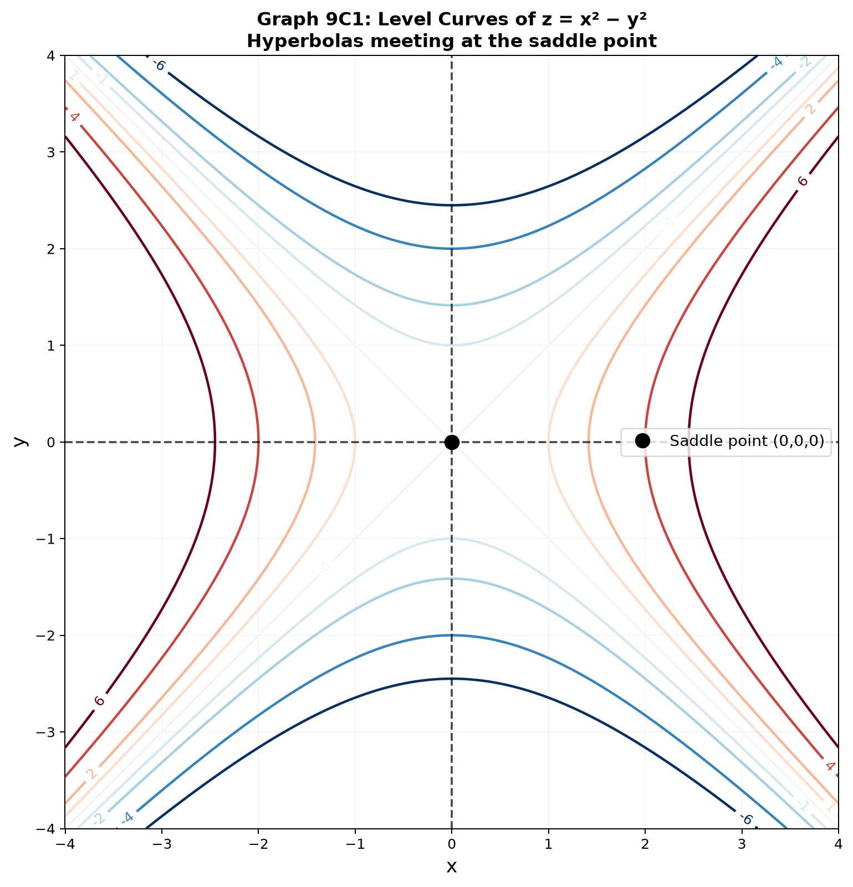
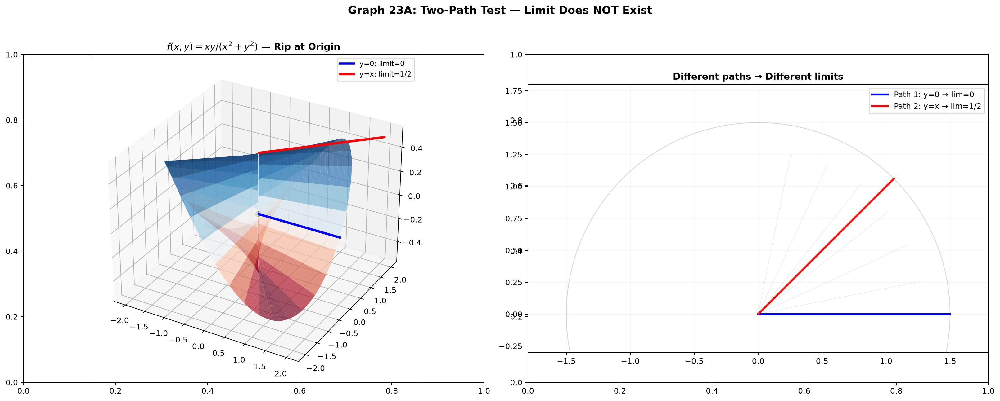
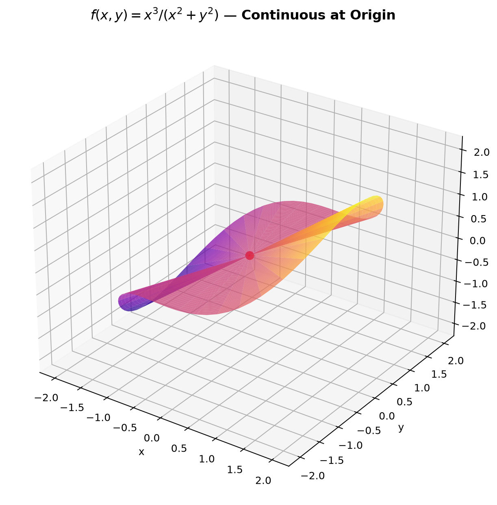

# Session 23A: Limits and Continuity in $\mathbb{R}^2$

**Phase 2 — Proof Bridge | 45 min**

*In 1D, you approach from left or right. In 2D, you can approach along infinitely many curves. This makes limits in the plane both richer and more treacherous. Master the two-path test and the polar squeeze.*

**Prerequisites**: ε-δ limits in 1D (Session 20). Vectors (Session 12A2).

---

## Part A: Functions of Two Variables

---

## Example 1: $z=f(x,y)$ — Height Over Every Point

$z=f(x,y)$ assigns a height to each point in the $xy$-plane. The graph is a **surface**.

$f(x,y)=x^2+y^2$: bowl opening upward (paraboloid). At $(2,1)$ height = 5.
$f(x,y)=\sqrt{1-x^2-y^2}$: upper hemisphere, $x^2+y^2 \leq 1$.

**The domain is a 2D region**, not just an interval. Visualize the shadow cast downward.

---

## Example 2: Level Curves — The 2D Map

Set $f(x,y)=c$ to get a **level curve**. It's a horizontal slice through the surface at height $c$.

$f(x,y)=x^2+y^2$: circles $x^2+y^2=c$ (expanding as $c$ grows).
$f(x,y)=xy$: hyperbolas $xy=c$. $c>0$ in QI/QIII, $c<0$ in QII/QIV.
$f(x,y)=y-x^2$: parabolas $y=x^2+c$ shifting vertically.

**How to read them**: Tight curves = steep. Sparse curves = flat. Topographic maps work exactly this way.



---

## Example 3: Domain Sketches — Curves as Boundaries

$f(x,y)=\sqrt{4-x^2-y^2}$: $x^2+y^2 \leq 4$ → disk radius 2.
$f(x,y)=\ln(x+y)$: $x+y>0$ → half-plane above $y=-x$.
$f(x,y)=\frac{1}{x^2+y^2-1}$: $x^2+y^2 \neq 1$ → plane minus unit circle.

**Domain = region bounded by curves, not just numbers.**

---

## Part B: Limits in $\mathbb{R}^2$

---

## Example 4: The ε-δ Definition (Same Idea, Euclidean Distance)

$\lim_{(x,y)\to(a,b)} f(x,y) = L$: $\forall\varepsilon>0, \exists\delta>0$ such that $0<\sqrt{(x-a)^2+(y-b)^2}<\delta \Rightarrow |f(x,y)-L|<\varepsilon$.

The δ-window is a **punctured disk**. The distance is Euclidean.

**Polynomials are nice**: $\lim_{(x,y)\to(1,2)} (3x^2+2xy+y^3) = 3+4+8 = 15$. Direct substitution works.

---

## Example 5: The Two-Path Test — Proving a Limit Does NOT Exist

**$f(x,y)=\frac{xy}{x^2+y^2}$ at $(0,0)$**.

Path 1 — $x$-axis ($y=0$): $f(x,0)=0 \to 0$.
Path 2 — $y=x$: $f(x,x)=\frac{x^2}{2x^2}=\frac{1}{2}$.

Two different paths → two different limits. **The limit does not exist.**

**The method**: If ANY two paths disagree, the limit DNE. Common paths to test:
1. $y=0$ (x-axis)
2. $x=0$ (y-axis)
3. $y=mx$ (straight lines through origin)
4. $y=x^2$ or $x=y^2$ (curved paths — needed for harder cases)



*Graph 23A: $f(x,y)=xy/(x^2+y^2)$. Along the x-axis (blue path, y=0), the limit is 0. Along y=x (red path), the limit is 1/2. Since they disagree, the two-sided limit does not exist. The surface has a "rip" at the origin.*

---

## Example 6: The Polar Squeeze — Proving a Limit EXISTS

**$f(x,y)=\frac{x^3}{x^2+y^2}$ at $(0,0)$**.

Convert to polar: $x=r\cos\theta$, $y=r\sin\theta$, $r=\sqrt{x^2+y^2}$.

$f(r,\theta) = \frac{r^3\cos^3\theta}{r^2} = r\cos^3\theta$.

As $(x,y)\to(0,0)$, $r\to 0$. $|f| = r|\cos^3\theta| \leq r \to 0$.

Squeeze theorem: the limit = 0, **regardless of direction**. All paths collapse.



*Graph 23A: $f(x,y)=x^3/(x^2+y^2)$ shown as a surface. Converting to polar gives $r\cos^3\theta$. As $r\to 0$, the height approaches zero uniformly from all directions — the surface is continuous at the origin.*

---

## Example 7: When the Polar Limit Depends on $\theta$

**$f(x,y)=\frac{x^2-y^2}{x^2+y^2}$ at $(0,0)$**.

Polar: $f(r,\theta)=\frac{r^2(\cos^2\theta-\sin^2\theta)}{r^2} = \cos^2\theta-\sin^2\theta = \cos 2\theta$.

As $r\to 0$, the result **depends on $\theta$**. No unique limit — DNE.
($\theta=0$ gives $1$, $\theta=\pi/4$ gives $0$, $\theta=\pi/2$ gives $-1$.)

**Rule**: If the polar expression has no $r$ factor, the limit depends on direction and does NOT exist (unless constant in $\theta$).

---

## Example 8: Continuity in $\mathbb{R}^2$

$f$ is **continuous** at $(a,b)$ if $\lim_{(x,y)\to(a,b)} f(x,y) = f(a,b)$.

$g(x,y)=\begin{cases} \frac{x^3}{x^2+y^2}, & (x,y)\neq(0,0) \\ 0, & (0,0) \end{cases}$ **is continuous** — limit = 0 = $g(0,0)$ (Example 6).

$h(x,y)=\begin{cases} \frac{xy}{x^2+y^2}, & (x,y)\neq(0,0) \\ 0, & (0,0) \end{cases}$ **is NOT continuous** — limit DNE (Example 5). Redefining $h(0,0)$ can't fix it.

> **Up to here**: $z=f(x,y)$ = surface. Domain = 2D region. Level curves = slices. Limits: two-path test disproves, polar squeeze proves. Continuity = limit equals function value.

---

## Common Mistakes

### Mistake 1: Two equal paths ≠ limit exists

**Wrong**: "Along $y=0$ and $x=0$ both give 0, so the limit is 0." **Right**: Two paths can only DISPROVE a limit. To prove existence, you need ALL paths (polar squeeze or ε-δ).

### Mistake 2: Assuming if polar form has no $r$, it still might converge

**Wrong**: $\frac{x^2-y^2}{x^2+y^2} = \cos 2\theta$ — "maybe it still has a limit?" **Right**: If the polar expression depends on $\theta$ after canceling $r$, the limit depends on direction and does NOT exist.

---

## What We Just Did

```
(1) z=f(x,y) = surface. Domain = 2D region bounded by curves. Level curves = slices.

(2) Limits in R²: two-path test disproves (different paths→different limits→DNE).
    Polar squeeze proves (convert to r,θ; if expression→0 as r→0 uniformly in θ, limit=0).

(3) Continuity: limit = f(a,b). Piecewise definition at origin — check the limit first.
```

---

## Practice 1

Find and sketch the domain: $f(x,y)=\sqrt{9-x^2-y^2} + \ln(x+y)$. List all conditions.

→ Reference: **Example 3**

---

## Practice 2

Show $\lim_{(x,y)\to(0,0)} \frac{x^2-y^2}{x^2+y^2}$ DNE by testing at least three paths.

→ Reference: **Example 5, 7**

---

## Practice 3

Use polar to prove $\lim_{(x,y)\to(0,0)} \frac{x^2y}{x^2+y^2} = 0$.

→ Reference: **Example 6**

---

## Practice 4: Real Battle

Is $f(x,y)=\begin{cases} \frac{x^4}{x^4+y^2}, & (x,y)\neq(0,0) \\ 0, & (0,0) \end{cases}$ continuous at $(0,0)$? Test $y=mx^2$ paths.

---

## Basic Drill (10)

**D1.** Domain of $f(x,y)=\frac{1}{x-y}$. Sketch.
**D2.** Domain of $f(x,y)=\sqrt{x-2y}$. Sketch.
**D3.** Sketch level curves $z=y-x^2$ for $c=-2,-1,0,1,2$.
**D4.** $\lim_{(x,y)\to(1,2)} (x^2+xy+y^2)$ — direct substitution.
**D5.** Test $\lim_{(x,y)\to(0,0)} \frac{x}{\sqrt{x^2+y^2}}$ via $y=0$ and $x=0$.
**D6.** Test $\lim_{(x,y)\to(0,0)} \frac{xy^2}{x^2+y^2}$ via polar coordinates.
**D7.** Why does $\lim_{(x,y)\to(0,0)} \frac{x}{x+y}$ not exist? (Two paths.)
**D8.** Convert $f(x,y)=\frac{x^2+y^2}{x^2-y^2}$ to polar. Does the limit at $(0,0)$ exist?
**D9.** If $\lim_{(x,y)\to(0,0)} f(x,y)=L$ along $y=mx$ for every $m$, must the limit exist?
**D10.** Define continuity at $(a,b)$ in ε-δ symbols.

---

## Advanced Drill (10)

**A1.** Prove $\lim_{(x,y)\to(0,0)} (2x+3y)=0$ using ε-δ. Give δ in terms of ε.
**A2.** Show $\lim_{(x,y)\to(0,0)} \frac{x^4}{x^4+y^2}$ DNE. (Hint: $y=x^2$ gives $1/2$, $y=0$ gives 1.)
**A3.** Use polar: $\lim_{(x,y)\to(0,0)} \frac{\sin(x^2+y^2)}{x^2+y^2}$. (Let $u=r^2$, then $\sin u/u \to 1$.)
**A4.** Prove: if $|f(x,y)| \leq x^2+y^2$, then $\lim_{(x,y)\to(0,0)} f(x,y)=0$.
**A5.** For $f(x,y)=\frac{x^3-y^3}{x^2+y^2}$ at $(0,0)$, define $f(0,0)$ to make it continuous.
**A6.** Prove: $\lim_{(x,y)\to(0,0)} \frac{x^2\sin y}{x^2+y^2}=0$. (Use $|\sin y| \leq |y|$ and polar.)
**A7.** Show $f(x,y)=\frac{x^2y}{x^4+y^2}$ has limit 0 along every straight line $y=mx$, but DNE along $y=x^2$.
**A8.** Prove: if $\lim f = L_1$ and $\lim f = L_2$ in $\mathbb{R}^2$, then $L_1=L_2$ (uniqueness).
**A9.** The function $f(x,y)=\frac{xy}{\sqrt{x^2+y^2}}$ — does the limit at $(0,0)$ exist? (Polar.)
**A10.** (Proof reading) "Along $y=0$, $f=0$. Along $x=0$, $f=0$. Along $y=x$, $f=1/2$. So limit DNE." Is the conclusion correct? What if the third path ALSO gave 0?

> Solutions: [Solutions](solutions/23A-solutions.md)

---

## Today's Procedure

```
Step 1: Domain = region in xy-plane. Level curves = horizontal slices.
Step 2: Two-path test → disprove limits. Polar squeeze → prove limits.
Step 3: Continuity: limit = f(a,b). Check piecewise definitions at origin.
```

---

## How to Read These Symbols

| Symbol | Reads as | Meaning |
|:---:|:---:|------|
| $\lim_{(x,y)\to(a,b)}$ | "limit as x y approaches a b" | multivariable limit — must be same along ALL paths to exist |
| $\mathbb{R}^2$ | "R two" / "the plane" | two-dimensional real space — all ordered pairs (x,y) |
| $r$ | "r" / "radial distance" | distance from origin: r = √(x²+y²) |
| $\theta$ | "theta" | angle from positive x-axis in polar coordinates |
| $x = r\cos\theta$, $y = r\sin\theta$ | "x equals r cosine theta, y equals r sine theta" | polar-to-rectangular conversion |
| two-path test | "two-path test" | find two paths giving different limits → limit DNE |
| polar squeeze | "polar squeeze" | convert to (r,θ), show expression → 0 as r→0 regardless of θ |
| $f(x,y)$ | "f of x y" | function of two variables — height z over each point (x,y) |
| level curve | "level curve" / "contour" | f(x,y)=c — horizontal slice through the surface |


---

## Terminology

| What we call it | Math term | Notation |
|:---:|:---:|:---:|
| surface over the plane | function of two variables | $z=f(x,y)$ |
| horizontal slice | level curve / contour | $f(x,y)=c$ |
| limit in the plane | limit in $\mathbb{R}^2$ | $\lim_{(x,y)\to(a,b)} f(x,y)$ |
| approach along a curve | path | $y=g(x)$ or polar |
| convert to polar | polar coordinates | $x=r\cos\theta$, $y=r\sin\theta$ |
| limit exists from all directions | limit exists | uniform in $\theta$ |
