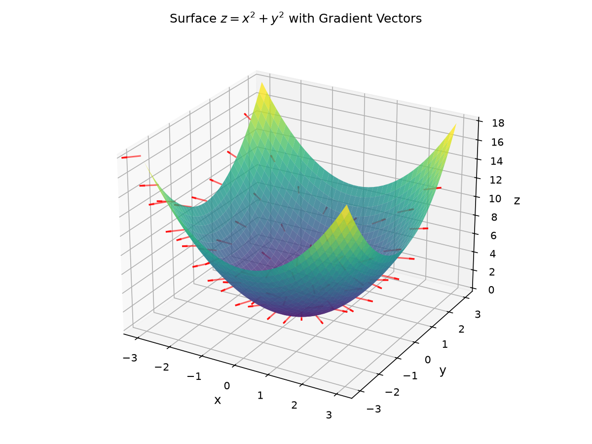
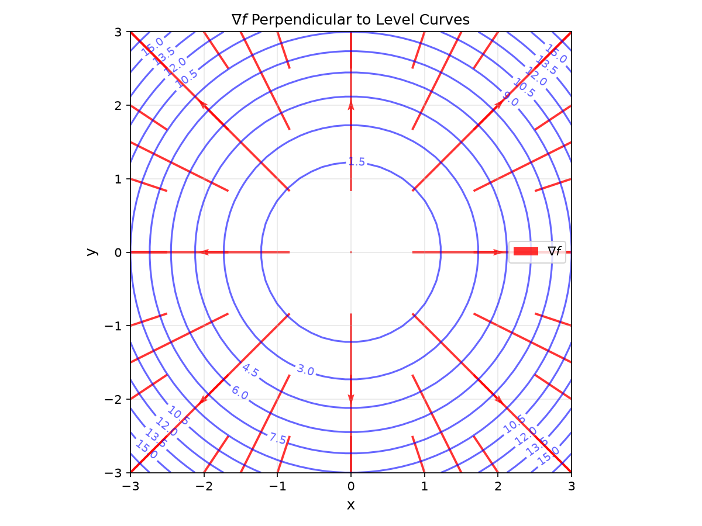
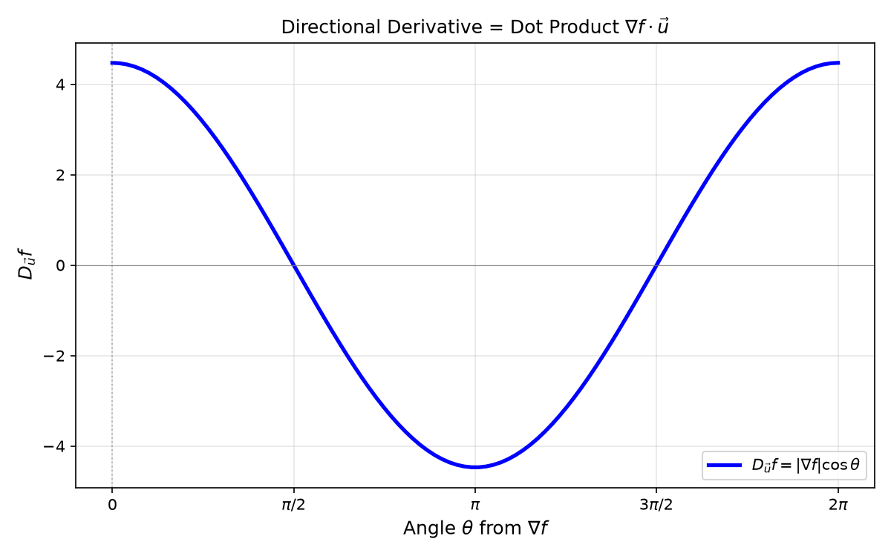
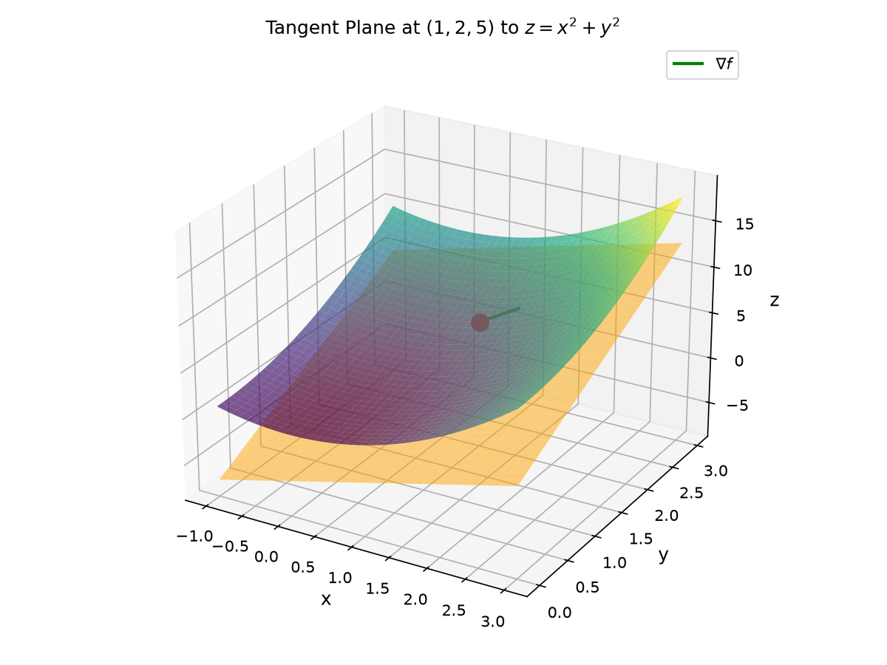
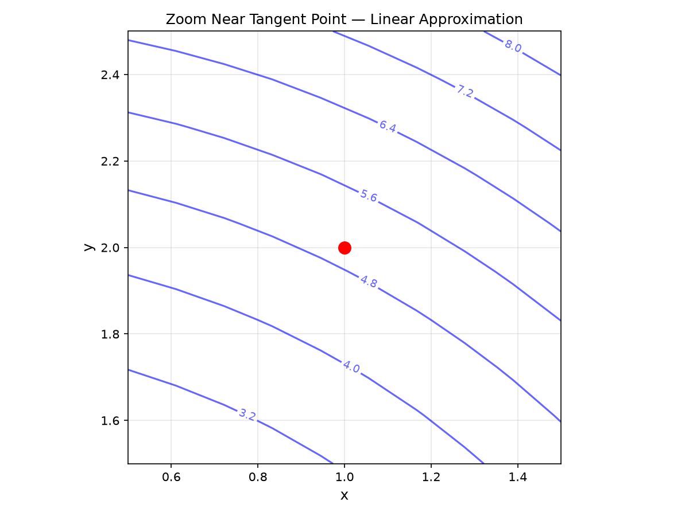

# Session 23B: Partial Derivatives and the Gradient

**Phase 2 — Proof Bridge | 50 min**

*Differentiate one variable at a time. Hold the others fixed. The gradient vector points uphill — always perpendicular to level curves. The tangent plane is the best flat approximation to a surface at a point.*

**Prerequisites**: Session 23A (limits in $\mathbb{R}^2$). Single-variable derivatives (Session 14A).

---

## Part A: Partial Derivatives — One Variable at a Time

---

## Example 1: Definition — Hold $y$, Differentiate $x$

$f_x(a,b) = \lim_{h\to 0} \frac{f(a+h, b) - f(a,b)}{h}$. ($y$ is frozen at $b$.)

$f_y(a,b) = \lim_{h\to 0} \frac{f(a, b+h) - f(a,b)}{h}$. ($x$ is frozen at $a$.)

$f(x,y)=x^3y + y^2$:
$f_x = 3x^2y$ (treat $y$ as constant; $y^2 \to 0$).
$f_y = x^3 + 2y$ (treat $x$ as constant; $x^3y \to x^3$).

**Notation**: $f_x = \frac{\partial f}{\partial x}$, $f_y = \frac{\partial f}{\partial y}$.

---

## Example 2: Geometric Meaning — Slope of a Slice (🔗 12C2)

$f_x(a,b)$ = slope of the curve you get by slicing the surface with the vertical plane $y=b$. Walking east.

$f_y(a,b)$ = slope from slicing with $x=a$. Walking north.

On a mountain: $f_x$ = east-west steepness. $f_y$ = north-south steepness. The **gradient** combines them into the steepest direction.

> **🔗 Bridge to 12C2 (Parametric Curves)**: The slice at $y=b$ is a **parametric curve** $\vec{r}(x) = (x, b, f(x,b))$. Its tangent vector is $\vec{r}\,'(x) = \langle 1, 0, f_x(x,b) \rangle$. The slope $f_x$ is the vertical-to-horizontal ratio of this tangent — exactly the same tangent concept you learned in 12C2. Similarly, $f_{xx}$ measures how this tangent changes (curvature of the parametric curve).

---

## Example 3: Higher-Order Partials and Clairaut's Theorem

$f_{xx} = \frac{\partial}{\partial x}(f_x)$, $f_{yy} = \frac{\partial}{\partial y}(f_y)$.
Mixed: $f_{xy} = \frac{\partial}{\partial y}(f_x)$, $f_{yx} = \frac{\partial}{\partial x}(f_y)$.

**Clairaut's Theorem**: If $f_{xy}$ and $f_{yx}$ are continuous, then $f_{xy}=f_{yx}$. Order doesn't matter.

$f(x,y)=x^3y^2 + e^x\sin y$:
$f_x=3x^2y^2+e^x\sin y$, $f_{xy}=6x^2y+e^x\cos y$.
$f_y=2x^3y+e^x\cos y$, $f_{yx}=6x^2y+e^x\cos y$. ✓

---

## Part B: The Gradient — The Vector That Points Uphill

---

## Example 4: Definition of the Gradient (🔗 12A2)

$\nabla f(a,b) = \langle f_x(a,b), f_y(a,b) \rangle$.

$f(x,y)=x^2+y^2$: $\nabla f = \langle 2x, 2y \rangle$. At $(1,2)$: $\nabla f = \langle 2, 4 \rangle$.

**Three key properties**:
1. $\nabla f$ points in the direction of **steepest ascent**.
2. $-\nabla f$ points in the direction of **steepest descent**.
3. $\nabla f$ is **perpendicular** to level curves of $f$.
4. $|\nabla f|$ = the **maximum rate of change**.

> **🔗 Bridge to 12A2 (Vectors)**: The gradient $\nabla f$ is a **vector** — the same kind of object you studied in 12A2. The directional derivative $D_{\vec{u}}f = \nabla f \cdot \vec{u}$ is the **dot product** (12A2). The magnitude $|\nabla f|$ is the **norm** of a vector. Every vector operation from 12A2 applies: $\nabla f$ can be scaled, added to other gradients, and decomposed into components.







*Graph 23B: Gradient vectors (red arrows) of $f(x,y)=x^2+y^2$ overlaid on level curves (blue circles). Every gradient vector points radially outward — perpendicular to the circular level curves — and its length $|\nabla f|=2r$ increases with distance from the origin.*

---

## Example 5: Directional Derivative — Slope in Any Direction

For a **unit** vector $\vec{u}=\langle u_1,u_2\rangle$:
$D_{\vec{u}}f(a,b) = \nabla f(a,b) \cdot \vec{u} = f_x u_1 + f_y u_2$.

$f(x,y)=x^2+y^2$ at $(1,2)$, direction $\vec{u}=\langle \frac{3}{5}, \frac{4}{5} \rangle$:
$D_{\vec{u}}f = 2(\frac{3}{5}) + 4(\frac{4}{5}) = \frac{6+16}{5} = 4.4$.

**Derivation**: Define $g(t)=f(a+tu_1, b+tu_2)$. Then $g'(0)=D_{\vec{u}}f(a,b)$. By the chain rule (Session 24A), $g'(0)=\nabla f(a,b)\cdot\vec{u}$.

**Maximum rate**: $D_{\vec{u}}f = |\nabla f|\cos\theta$, maximized when $\cos\theta=1$ → $\vec{u} \parallel \nabla f$. The max value = $|\nabla f|$.

---

## Example 6: Tangent Plane — 2D Linear Approximation

In 1D: $y \approx f(a) + f'(a)(x-a)$. In 2D:

$z = f(a,b) + f_x(a,b)(x-a) + f_y(a,b)(y-b)$.

Equivalently: $z - f(a,b) = \nabla f(a,b) \cdot \langle x-a, y-b \rangle$.

$f(x,y)=x^2+y^2$ at $(1,2)$: $f(1,2)=5$, $\nabla f=\langle 2,4\rangle$.
Tangent plane: $z = 5 + 2(x-1) + 4(y-2) = 2x + 4y - 5$.





*Graph 23: The tangent plane (orange) to $z=x^2+y^2$ at $(1,2,5)$. The gradient $\nabla f(1,2)=\langle 2,4\rangle$ (green arrow) points in the steepest direction. The plane touches the surface at exactly one point.*

---

## Example 7: Using the Tangent Plane to Estimate

Estimate $f(1.1, 1.9)$ for $f(x,y)=x^2+y^2$ using the tangent plane at $(1,2)$.

Plane: $z=2x+4y-5$. At $(1.1, 1.9)$: $z=2(1.1)+4(1.9)-5=2.2+7.6-5=4.8$.
Actual: $(1.1)^2+(1.9)^2=1.21+3.61=4.82$. Error = 0.02. Good approximation close to the point.

> **🔗 Bridge to 12A2 (Hessian Matrix)**: The second derivative test uses $D = f_{xx}f_{yy} - (f_{xy})^2$, which is the **determinant of the Hessian matrix** $H = \begin{pmatrix} f_{xx} & f_{xy} \\ f_{xy} & f_{yy} \end{pmatrix}$ (Session 24B). This matrix is a linear transformation (12A2) acting on the tangent plane's slope changes. Its eigenvalues tell you the principal curvatures — just as 12A2 taught you that matrices encode geometric transformations, the Hessian encodes how the surface bends away from the tangent plane.

> **Up to here**: $f_x$, $f_y$ = differentiate one variable, hold others. Clairaut: $f_{xy}=f_{yx}$. $\nabla f=\langle f_x,f_y\rangle$ = steepest ascent, $\perp$ level curves. $D_{\vec{u}}f=\nabla f\cdot\vec{u}$ (unit $\vec{u}$). Tangent plane = $z=f(a,b)+\nabla f(a,b)\cdot\langle x-a,y-b\rangle$.

---

## Common Mistakes

### Mistake 1: Forgetting $\vec{u}$ must be a unit vector

$D_{\langle 3,4\rangle} f \neq \nabla f \cdot \langle 3,4\rangle$. Normalize: $\vec{u}=\langle 3/5, 4/5\rangle$.

### Mistake 2: Thinking $f_{xy}$ always equals $f_{yx}$

Clairaut's theorem requires **continuity** of the mixed partials. Counterexamples exist (not on exams, but know the condition).

### Mistake 3: Confusing tangent plane with level surface

The tangent plane to $z=f(x,y)$ is NOT the same as the tangent plane to $F(x,y,z)=0$ (implicit surfaces — Session 24A).

---

## What We Just Did

```
(1) Partial derivatives: f_x (freeze y), f_y (freeze x). Higher-order: f_{xy}=f_{yx}.

(2) Gradient ∇f = ⟨f_x,f_y⟩: steepest ascent, ⟂ level curves, max rate = |∇f|.

(3) Directional derivative: D_u f = ∇f·u (u unit). Tangent plane: z = f + ∇f·⟨x−a, y−b⟩.
```

---

## Practice 1

Find all first and second partials of $f(x,y)=x^3e^y+y\ln x$. Verify $f_{xy}=f_{yx}$.

---

## Practice 2

For $f(x,y)=x^2+3xy-y^2$ at $(2,-1)$: (a) $\nabla f$ (b) $D_{\vec{u}}f$ with $\vec{u}=\langle 3/5,4/5\rangle$ (c) direction of max increase and its value.

---

## Practice 3

Find the tangent plane to $z=x^2+xy$ at $(1,2,3)$. Use it to estimate $f(1.05, 1.95)$.

---

## Practice 4: Real Battle

A hiker at $(1,2)$ on $z=10-x^2-2y^2$ (hundreds of meters). (a) Walking east — up or down? Rate? (b) Quickest descent direction? (c) Tangent plane equation. (d) Estimate height at $(1.1, 1.9)$.

---

## Basic Drill (12)

**D1.** $f_x$, $f_y$ for $f(x,y)=x^4y-3x^2+y^5$.
**D2.** $f_x$, $f_y$ for $f(x,y)=e^{xy}\sin(x+y)$.
**D3.** $f_{xx}, f_{yy}, f_{xy}$ for $f(x,y)=x^3+3x^2y+y^3$.
**D4.** $\nabla f(2,1)$ for $f(x,y)=x^2y-y^3$.
**D5.** $D_{\vec{u}}f(1,2)$ for $f=x^3+y^2$, $\vec{u}=\langle 1/\sqrt{2},1/\sqrt{2}\rangle$.
**D6.** Tangent plane to $z=x^2+xy$ at $(1,2,3)$.
**D7.** At what $(x,y)$ is $\nabla f=\langle 0,0\rangle$ for $f=x^2+y^2-2x-4y$?
**D8.** Does $f(x,y)=|x|+|y|$ have partial derivatives at $(0,0)$?
**D9.** Compute $f_{xy}$ and $f_{yx}$ for $f(x,y)=x^2\sin y$. Are they equal?
**D10.** If $\nabla f(3,4)=\langle 6,8\rangle$, in which direction is $f$ decreasing fastest?
**D11.** Write the parametric curve for the slice $y=2$ of $f(x,y)=x^2+y^2$. Find its tangent vector at $x=1$. (🔗 12C2)
**D12.** Compute $\nabla f \cdot \vec{u}$ for $f(x,y)=x^2y$, $\vec{u}=\langle 3/5,4/5\rangle$ — identify this as a dot product (🔗 12A2).

---

## Advanced Drill (12)

**A1.** Use limit definition to compute $f_x(0,0)$ for $f(x,y)=\begin{cases} \frac{x^3}{x^2+y^2}, & (x,y)\neq(0,0) \\ 0, & (0,0) \end{cases}$.
**A2.** Prove $\nabla(fg) = f\nabla g + g\nabla f$ (componentwise product rule).
**A3.** Show $\nabla f$ always points radially outward for $f(x,y)=x^2+y^2$.
**A4.** Prove $D_{\vec{u}}f = |\nabla f|\cos\theta$ where $\theta$ = angle between $\nabla f$ and $\vec{u}$.
**A5.** The **Laplacian**: $\nabla^2 f = f_{xx}+f_{yy}$. Show $f(x,y)=\ln(x^2+y^2)$ satisfies $\nabla^2 f=0$.
**A6.** Find all points on $z=x^2+xy+y^2$ where the tangent plane is horizontal.
**A7.** Prove differentiability implies continuity in $\mathbb{R}^2$. (Use tangent plane as linear approximation.)
**A8.** Show $f(x,y)=x^2+y^2$ satisfies $|\nabla f(1,2)|=2\sqrt{5}$. Verify this equals the max directional derivative.
**A9.** If $f_x=f_y=0$ everywhere, prove $f$ is constant. (Use MVT along paths.)
**A10.** (Proof reading) "$\nabla f(a,b)=\langle 0,0\rangle$ means $f$ has a local max or min." Critique — what about saddles?
**A11.** Write the Hessian matrix $H$ for $f(x,y)=x^3-3xy+y^3$ at $(1,1)$. Compute $\det H$ and verify $D = \det H$. (🔗 12A2)
**A12.** The parametric curve $\vec{r}(t) = (t, 2t, f(t,2t))$ lies on $z=f(x,y)$. Find its tangent vector at $t=1$ in terms of $f_x,f_y$. (🔗 12C2)

> Solutions: [Solutions](solutions/23B-solutions.md)

---

## Today's Procedure

```
Step 1: f_x = lim_{h→0}[f(x+h,y)−f(x,y)]/h. Freeze the other variable.
Step 2: ∇f = ⟨f_x,f_y⟩. D_u f = ∇f·u. Tangent plane = 2D linear approx.
Step 3: Clairaut: f_{xy}=f_{yx} when continuous.
```

---

## How to Read These Symbols

| Symbol | Reads as | Meaning |
|:---:|:---:|------|
| $\frac{\partial f}{\partial x}$ | "partial f partial x" / "del f del x" | derivative with respect to x, treating y as constant |
| $f_x$ | "f sub x" | shorthand for ∂f/∂x |
| $\nabla f$ | "grad f" / "del f" / "gradient" | vector of all partial derivatives: ∇f = ⟨f_x, f_y⟩ |
| $D_{\vec{u}}f$ | "d sub u f" / "directional derivative" | rate of change in direction of unit vector u — D_u f = ∇f·u |
| $f_{xy}$ | "f sub x y" / "mixed partial" | differentiate first with respect to x, then y |
| $f_{xx}$ | "f sub x x" | second partial with respect to x — differentiate twice |
| $\nabla^2 f$ | "del squared f" / "Laplacian" | f_{xx} + f_{yy} — sum of all second partials |
| $|\nabla f|$ | "magnitude of grad f" | maximum rate of change — steepness of the steepest path |
| Clairaut's Theorem | "Clairaut's theorem" / "Clair-OH" | f_{xy} = f_{yx} when mixed partials are continuous — order doesn't matter |
| tangent plane | "tangent plane" | z = f(a,b) + ∇f(a,b)·⟨x−a, y−b⟩ — best flat approximation to surface |


---

## Terminology

| What we call it | Math term | Notation |
|:---:|:---:|:---:|
| differentiate x, freeze y | partial derivative w.r.t. $x$ | $f_x = \partial f/\partial x$ |
| mixed partials commute | Clairaut's theorem | $f_{xy}=f_{yx}$ |
| vector of partials | gradient | $\nabla f = \langle f_x, f_y \rangle$ (🔗 12A2: vector, dot product) |
| slope in direction $\vec{u}$ | directional derivative | $D_{\vec{u}}f = \nabla f \cdot \vec{u}$ (🔗 12A2: dot product) |
| best flat approximation | tangent plane | $z = f(a,b) + \nabla f(a,b)\cdot\langle x-a,y-b\rangle$ |
| steepest ascent direction | $\nabla f$ direction | max rate = $\vert\nabla f\vert$ |
