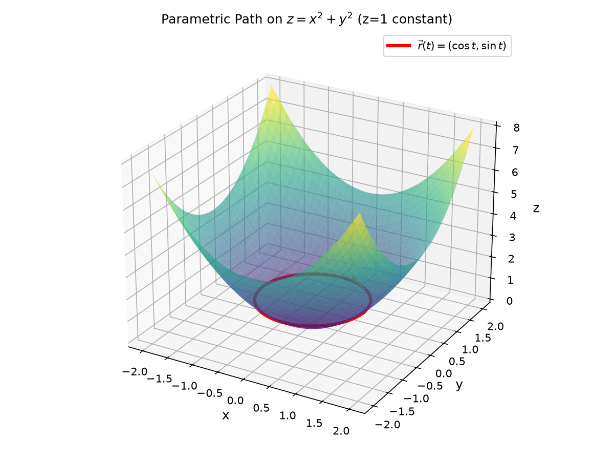
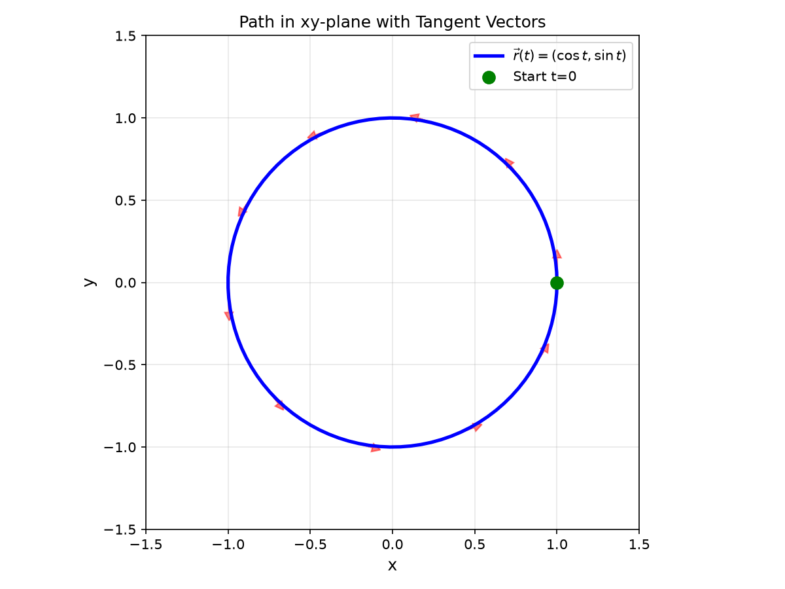
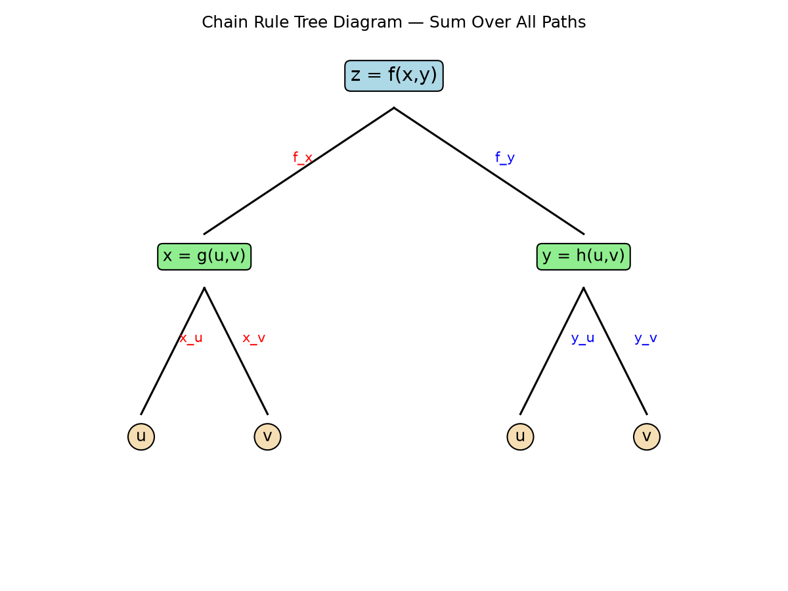
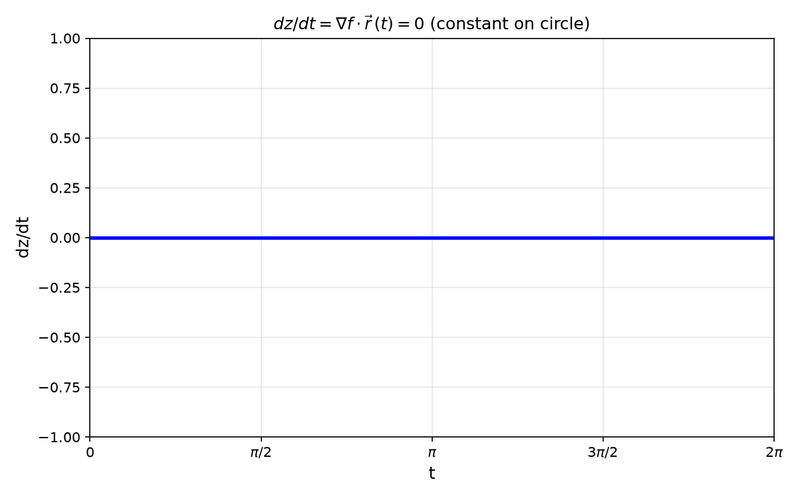
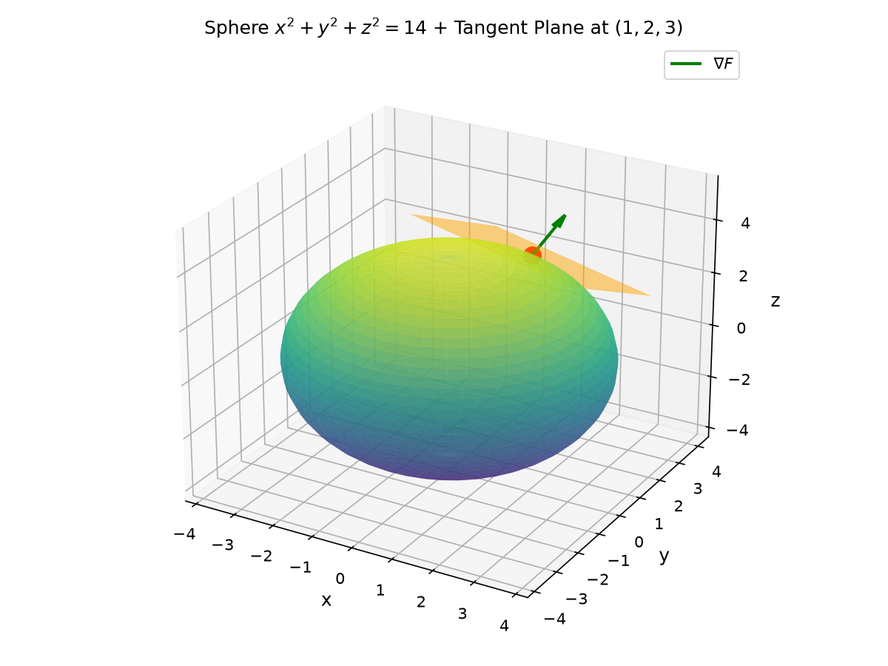
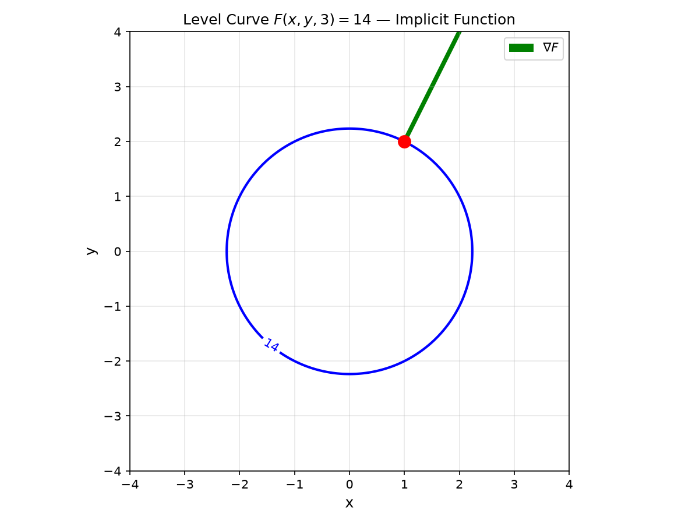
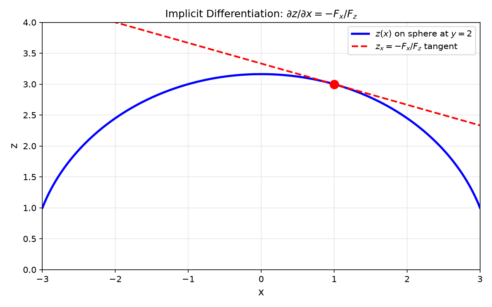

# Session 24A: The Multivariable Chain Rule and Implicit Differentiation

**Phase 2 — Proof Bridge | 50 min**

*Rates of change propagate through connected variables like current through wires. The multivariable chain rule traces every path from input to output. Implicit differentiation generalizes: $\frac{dy}{dx} = -\frac{F_x}{F_y}$ is just the start.*

**Prerequisites**: Partial derivatives, gradient (Session 23B). Single-variable chain rule (Session 14A).

---

## Part A: The Chain Rule Along a Path

---

## Example 1: $z$ Changes Through $x(t)$ and $y(t)$ (🔗 12C2)

If $z=f(x,y)$ and $(x,y)$ moves along $(x(t), y(t))$, then:

$\frac{dz}{dt} = \frac{\partial f}{\partial x}\frac{dx}{dt} + \frac{\partial f}{\partial y}\frac{dy}{dt} = \nabla f \cdot \langle x'(t), y'(t) \rangle$.

**Why**: A small $\Delta t$ changes $x$ by $x'\Delta t$ (contributing $f_x \cdot x'\Delta t$ to $\Delta z$) and $y$ by $y'\Delta t$ (contributing $f_y \cdot y'\Delta t$). Sum both contributions.

$z=x^2+y^2$, $x=\cos t$, $y=\sin t$ (unit circle).
$\frac{dz}{dt} = 2x(-\sin t) + 2y(\cos t) = -2\cos t\sin t + 2\sin t\cos t = 0$.

$z=x^2+y^2=1$ constant on this path — derivative confirms.

> **🔗 Bridge to 12C2 (Parametric Curves)**: The path $\vec{r}(t) = (x(t), y(t))$ is a **parametric curve** from 12C2. Its velocity $\vec{r}\,'(t) = \langle x'(t), y'(t) \rangle$ is the tangent vector. The chain rule says $\frac{dz}{dt} = \nabla f \cdot \vec{r}\,'(t)$ — the rate of change of $z$ along the path is the dot product of the gradient with the tangent vector. This is exactly the directional derivative formula $D_{\vec{u}}f = \nabla f \cdot \vec{u}$ from 23B, where $\vec{u}$ is the direction of motion at each instant.

---

## Example 2: Rate of Temperature Change Along a Path

Temperature $T(x,y)=20+3x^2-2y^2$. A bug crawls along $x=\sqrt{t}$, $y=t$. Find $\frac{dT}{dt}$ at $t=4$.

$T_x=6x$, $T_y=-4y$. $x'(t)=\frac{1}{2\sqrt{t}}$, $y'(t)=1$.

At $t=4$: $x=2$, $y=4$. $\frac{dT}{dt} = 6(2)(\frac{1}{4}) + (-4)(4)(1) = 3 - 16 = -13$. Cooling at 13°/sec.

---

## Part B: Multiple Intermediate Variables

---

## Example 3: The Tree Diagram Method

If $z=f(x,y)$, $x=g(u,v)$, $y=h(u,v)$:

$\frac{\partial z}{\partial u} = \frac{\partial f}{\partial x}\frac{\partial x}{\partial u} + \frac{\partial f}{\partial y}\frac{\partial y}{\partial u}$.
$\frac{\partial z}{\partial v} = \frac{\partial f}{\partial x}\frac{\partial x}{\partial v} + \frac{\partial f}{\partial y}\frac{\partial y}{\partial v}$.

**Tree diagram**: $z$ branches to $x,y$; each of $x,y$ branches to $u,v$. For each path from $z$ to $u$ (or $v$), multiply derivatives along the path. Sum over all paths.

$z=x^2y$, $x=u+v$, $y=uv$.
$\frac{\partial z}{\partial u} = 2xy \cdot 1 + x^2 \cdot v = 2uv(u+v) + (u+v)^2v$.
$\frac{\partial z}{\partial v} = 2xy \cdot 1 + x^2 \cdot u = 2uv(u+v) + (u+v)^2u$.









*Graph 24A: The tree diagram for $z=f(x,y)$ with $x=g(u,v)$, $y=h(u,v)$. Each path from $z$ to a leaf variable contributes one product term. Sum all paths to get the partial derivative. Red path = $\partial z/\partial u$ via $x$. Blue path = via $y$.*

---

## Example 4: Polar Laplacian — A Classic Chain Rule Application (🔗 12C3)

$f(x,y) \to f(r,\theta)$ via $x=r\cos\theta$, $y=r\sin\theta$. Express $f_{xx}+f_{yy}$ in polar.

$\frac{\partial f}{\partial r} = f_x\cos\theta + f_y\sin\theta$.
$\frac{\partial f}{\partial \theta} = f_x(-r\sin\theta) + f_y(r\cos\theta)$.

After a second differentiation and algebra (not shown — but classic exercise):
$f_{xx}+f_{yy} = f_{rr} + \frac{1}{r}f_r + \frac{1}{r^2}f_{\theta\theta}$.

This is how you solve Laplace's equation on a disk.

> **🔗 Bridge to 12C3 (Coordinate Systems)**: Converting the Laplacian from Cartesian to polar is a **coordinate transformation** — the core idea of 12C3. The expression $f_{xx}+f_{yy}$ in Cartesian becomes $f_{rr} + \frac{1}{r}f_r + \frac{1}{r^2}f_{\theta\theta}$ in polar. This is exactly the same principle as 12C3 Example 3A: the same physical quantity looks different in different coordinate systems. The chain rule is the machinery that converts between them.

---

## Part C: Implicit Differentiation Revisited

---

## Example 5: $\frac{dy}{dx} = -\frac{F_x}{F_y}$

$F(x,y)=0$ defines $y$ implicitly. Differentiate both sides w.r.t. $x$:
$\frac{\partial F}{\partial x}\cdot 1 + \frac{\partial F}{\partial y}\cdot\frac{dy}{dx} = 0$ → $\frac{dy}{dx} = -\frac{F_x}{F_y}$.

$x^2+y^2=25$ → $F=x^2+y^2-25=0$. $\frac{dy}{dx} = -\frac{2x}{2y} = -\frac{x}{y}$.
At $(3,4)$: slope = $-3/4$.

---

## Example 6: Implicit Surfaces — $F(x,y,z)=0$

$F(x,y,z)=0$ defines $z$ implicitly as $z=f(x,y)$. The chain rule gives:

$\frac{\partial z}{\partial x} = -\frac{F_x}{F_z}$, $\frac{\partial z}{\partial y} = -\frac{F_y}{F_z}$ (when $F_z \neq 0$).

$xyz - x - y - z = 0$. $F_x=yz-1$, $F_y=xz-1$, $F_z=xy-1$.

$\frac{\partial z}{\partial x} = -\frac{yz-1}{xy-1}$, $\frac{\partial z}{\partial y} = -\frac{xz-1}{xy-1}$.

**The tangent plane to an implicit surface** $F(x,y,z)=0$ at $(x_0,y_0,z_0)$:
$\nabla F \cdot \langle x-x_0, y-y_0, z-z_0 \rangle = 0$, where $\nabla F = \langle F_x, F_y, F_z \rangle$.

For the sphere $x^2+y^2+z^2=14$ at $(1,2,3)$: $\nabla F = \langle 2,4,6 \rangle$.
Tangent plane: $2(x-1)+4(y-2)+6(z-3)=0$ → $x+2y+3z=14$.







*Graph 24A: The sphere $x^2+y^2+z^2=14$ with tangent plane at $(1,2,3)$. The normal vector $\nabla F(1,2,3)=\langle 2,4,6\rangle$ is perpendicular to the tangent plane. This generalizes the 2D implicit formula: gradient of the defining function gives the normal.*

---

> **🔗 Bridge to Linear Algebra**: The multivariable chain rule is secretly **matrix multiplication**. For $\vec{z} = \vec{F}(\vec{G}(\vec{x}))$, the derivative (Jacobian matrix) satisfies:
>
> $$J_{\vec{F}\circ\vec{G}}(\vec{x}) = J_{\vec{F}}(\vec{G}(\vec{x})) \cdot J_{\vec{G}}(\vec{x})$$
>
> The tree diagram method you just learned IS the row-column multiplication of Jacobians. Each path from an output variable to an input variable corresponds to multiplying one row of $J_F$ with one column of $J_G$. For the scalar path $z = f(x(t), y(t))$: $J_f = \langle f_x, f_y \rangle$ ($1\times2$ row), $J_{\vec{r}} = \begin{pmatrix} x' \\ y' \end{pmatrix}$ ($2\times1$ column), and $\frac{dz}{dt} = J_f \cdot J_{\vec{r}} = f_x x' + f_y y'$. For multiple intermediates: the full Jacobian product $J_F \cdot J_G$ gives ALL partial derivatives $\partial z_i/\partial x_j$ at once. When you study Session 26A, you'll recognize this as the universal chain rule — no tree diagrams needed for $n$ variables, just multiply the Jacobian matrices in the correct order.

> **Up to here**: Chain rule path: $dz/dt = \nabla f \cdot \vec{r}\,'(t)$. Tree diagram: sum over all variable-dependency paths. Implicit: $dy/dx = -F_x/F_y$, surfaces: $\partial z/\partial x = -F_x/F_z$, tangent plane via $\nabla F \cdot \langle x-x_0, y-y_0, z-z_0\rangle = 0$.

---

## Common Mistakes

### Mistake 1: Missing terms in the chain rule

**Wrong**: $\partial z/\partial u = f_x \cdot x_u$ (forgetting $y$). **Right**: Sum over ALL paths from $z$ to $u$ — every intermediate variable contributes.

### Mistake 2: Forgetting the minus sign in implicit differentiation

**Wrong**: $dy/dx = F_x/F_y$. **Right**: $dy/dx = -F_x/F_y$. Derive it: $F_x + F_y(dy/dx)=0$, solve for $dy/dx$.

### Mistake 3: Using $\partial$ instead of $d$ for single-variable paths

**Wrong**: $\frac{\partial z}{\partial t}$ when $z=f(x(t),y(t))$. **Right**: $\frac{dz}{dt}$ — $z$ ultimately depends on only ONE variable $t$. Use $d$, not $\partial$.

---

## What We Just Did

```
(1) Chain rule — path: dz/dt = f_x·x' + f_y·y' = ∇f · r'(t).
    Multiple intermediates: ∂z/∂u = f_x·x_u + f_y·y_u (sum over all paths).

(2) Implicit — 2D: dy/dx = −F_x/F_y. 3D: ∂z/∂x = −F_x/F_z.
    Tangent plane to F(x,y,z)=0: ∇F·⟨x−x₀,y−y₀,z−z₀⟩ = 0.
```

---

## Practice 1

$z=x^2y$, $x=t^2$, $y=\sin t$. Find $dz/dt$ at $t=\pi$ using the chain rule.

---

## Practice 2

$z=f(x,y)$, $x=u^2-v^2$, $y=2uv$. Express $\partial z/\partial u$ and $\partial z/\partial v$.

---

## Practice 3

Find $dy/dx$ for $x^3+y^3=6xy$ via implicit differentiation with partials.

---

## Practice 4: Real Battle

The ideal gas law: $PV=nRT$ ($n,R$ constant). Find $\partial V/\partial T$ (pressure constant) and $\partial V/\partial P$ (temperature constant) via implicit differentiation of $F(P,V,T)=PV-nRT=0$.

---

## Basic Drill (12)

**D1.** $z=x^2+y^2$, $x=e^t$, $y=e^{-t}$. Find $dz/dt$.
**D2.** $w=xy+yz$, $x=t$, $y=t^2$, $z=t^3$. Find $dw/dt$ at $t=1$.
**D3.** Write the chain rule for $\partial w/\partial u$ when $w=f(x,y)$, $x=g(u,v)$, $y=h(u,v)$.
**D4.** Find $dy/dx$ for $x^2+xy+y^2=7$ at $(1,2)$.
**D5.** Find $\partial z/\partial x$ for $x^2+y^2+z^2=1$ via implicit differentiation.
**D6.** Tangent plane to $x^2+y^2+z^2=9$ at $(2,2,1)$.
**D7.** If $z=f(x,y)$ and $x=r\cos\theta$, $y=r\sin\theta$, write $\partial z/\partial r$ and $\partial z/\partial\theta$.
**D8.** $z=x^y$, $x=e^t$, $y=t$. Find $dz/dt$ at $t=1$.
**D9.** Why is $\frac{dz}{dt}$ written with $d$ not $\partial$ when $x,y$ depend only on $t$?
**D10.** $x^2z+yz^2=5$. Find $\partial z/\partial x$ at $(1,1,2)$.
**D11.** Parameterize the chain rule path: if $\vec{r}(t) = (t^2, \sin t)$, find $\vec{r}\,'(t)$ and $dz/dt$ for $z=x^2+y^2$. (🔗 12C2)
**D12.** Write the polar Laplacian $f_{rr} + \frac{1}{r}f_r + \frac{1}{r^2}f_{\theta\theta}$ for $f(r,\theta)=r^2$. Simplify and compare to $f_{xx}+f_{yy}$ for $f(x,y)=x^2+y^2$. (🔗 12C3)

---

## Advanced Drill (12)

**A1.** Prove the single-path chain rule from the definition of the derivative: $dz = f_x dx + f_y dy$, divide by $dt$.
**A2.** $u=f(x,y)$, $x=r\cos\theta$, $y=r\sin\theta$. Show $u_x^2+u_y^2 = u_r^2 + \frac{1}{r^2}u_\theta^2$.
**A3.** $z=f(x,y)$ where $x=s+t$, $y=s-t$. Express $z_{ss}-z_{tt}$ in terms of $z_{xy}$.
**A4.** Implicit: $F(x,y,z)=xy^2+yz^2+zx^2-1=0$. Find $\partial z/\partial x$ at $(1,1,?)$.
**A5.** Prove $\frac{\partial(z,x)}{\partial(u,v)} + \frac{\partial(x,y)}{\partial(u,v)} + \frac{\partial(y,z)}{\partial(u,v)} = 0$ for $x=x(u,v)$, $y=y(u,v)$, $z=z(u,v)$. (A Jacobian identity.)
**A6.** Show if $z=f(x-ct)+g(x+ct)$, then $z_{tt}=c^2 z_{xx}$ (wave equation).
**A7.** Derive the formula for $\partial z/\partial x$ when $F(x,y,z)=0$ from the chain rule: apply $\partial/\partial x$ to $F(x,y,z(x,y))=0$.
**A8.** For $z=f(x,y)$, $x=u\cos v$, $y=u\sin v$, express the Laplacian $z_{xx}+z_{yy}$ in terms of $u,v$.
**A9.** (Proof reading) "$dz/dt = f_x dx/dt + f_y dy/dt$ always works." Critique: what conditions on $f$ are needed?
**A10.** Chain rule for $n$ variables: state the general formula for $\partial w/\partial t_i$ when $w=f(x_1,\ldots,x_m)$ and each $x_j=g_j(t_1,\ldots,t_n)$. Draw the tree for $m=3$, $n=2$.
**A11.** Interpret $dz/dt = \nabla f \cdot \vec{r}\,'(t)$ geometrically: if $\vec{r}\,'(t)$ is the tangent to a parametric curve (🔗 12C2), what does the sign of $dz/dt$ tell you about motion relative to level curves of $f$?
**A12.** Derive $f_{xx}+f_{yy}$ in polar coordinates step-by-step for $f(r,\theta)=r^n\cos(n\theta)$. Show it satisfies Laplace's equation. (🔗 12C3)

> Solutions: [Solutions](solutions/24A-solutions.md)

---

## Today's Procedure

```
Step 1: Chain rule — path: dz/dt = ∇f·r'(t). Multiple vars: tree diagram.
Step 2: Implicit — 2D curve: dy/dx = −F_x/F_y.
        Surface: z_x = −F_x/F_z, tangent plane: ∇F·⟨x−x₀,…⟩ = 0.
```

---

## How to Read These Symbols

| Symbol | Reads as | Meaning |
|:---:|:---:|------|
| $\frac{dz}{dt}$ | "d z d t" / "total derivative" | z ultimately depends only on t — use d, not ∂ |
| $\frac{\partial z}{\partial u}$ | "partial z partial u" | partial derivative when z depends on multiple variables |
| $\nabla F$ | "grad F" / "del F" | gradient of F(x,y,z) — normal vector to level surface |
| $\frac{dy}{dx} = -\frac{F_x}{F_y}$ | "d y d x equals negative F sub x over F sub y" | implicit differentiation formula for F(x,y)=0 |
| $\frac{\partial z}{\partial x} = -\frac{F_x}{F_z}$ | "partial z partial x equals negative F_x over F_z" | implicit partial for surface F(x,y,z)=0 |
| $J$ | "J" / "Jacobian" | matrix of all first-order partial derivatives — chain rule = matrix multiplication (🔗 12A2) |
| tree diagram | "tree diagram" | visual dependency graph — sum over all paths from output to input |
| $\nabla F \cdot \langle x-x_0, y-y_0, z-z_0 \rangle = 0$ | "grad F dot displacement vector equals zero" | tangent plane to implicit surface — gradient is normal vector |
| $\vec{r}(t)$ | "r of t" / "parametric path" | parametric curve (🔗 12C2) — chain rule gives dz/dt along it |


---

## Terminology

| What we call it | Math term | Notation |
|:---:|:---:|:---:|
| total rate along path | chain rule (single path) | $\frac{dz}{dt} = f_x x' + f_y y'$ |
| partial rate w.r.t. one input | chain rule (multiple) | $\frac{\partial z}{\partial u} = f_x x_u + f_y y_u$ |
| dependency diagram | tree diagram | $z \to (x,y) \to (u,v)$ |
| find slope of implicit curve | implicit differentiation | $\frac{dy}{dx} = -\frac{F_x}{F_y}$ |
| find partial of implicit surface | implicit partial | $\frac{\partial z}{\partial x} = -\frac{F_x}{F_z}$ |
| coordinate change via chain rule | coordinate transformation (🔗 12C3) | e.g., polar Laplacian conversion |
