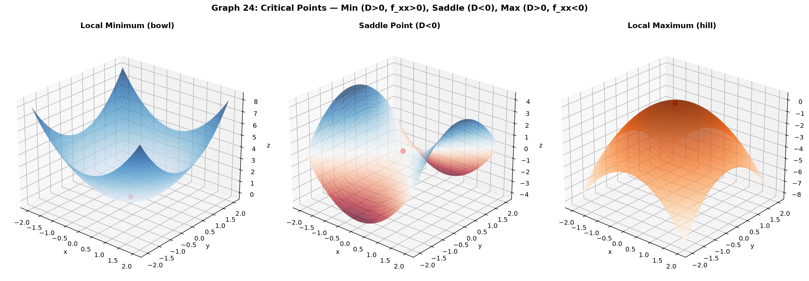
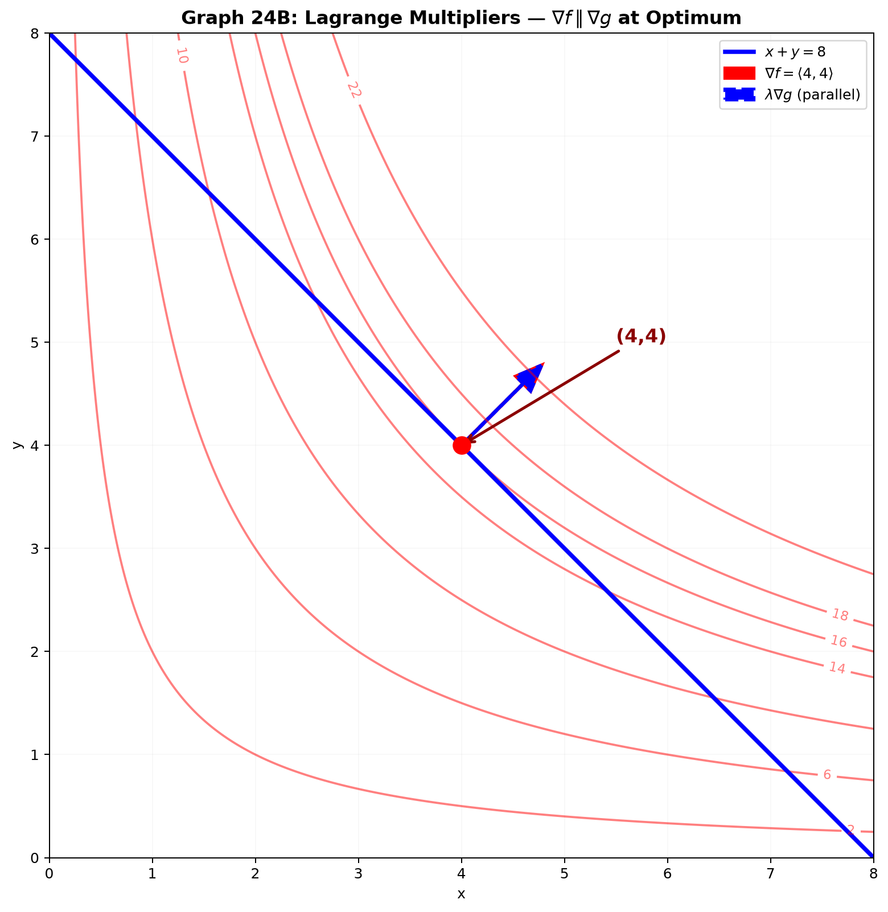

# Session 24B: Optimization and Lagrange Multipliers

**Phase 2 — Proof Bridge | 45 min**

*Find peaks, valleys, and saddle points on surfaces. Then add a constraint — a fence the optimum must lie on. Lagrange multipliers solve this elegantly: at the optimum, the gradient of the objective is parallel to the gradient of the constraint.*

**Prerequisites**: Partial derivatives, gradient (Session 23B). Single-variable optimization (Session 15B).

---

## Part A: Unconstrained Optimization — $\nabla f = \vec{0}$

---

## Example 1: Critical Points — Both Partials Vanish

In 1D: $f'(x)=0$. In 2D: $\nabla f = \langle 0, 0 \rangle$ → $f_x=0$ AND $f_y=0$.

$f(x,y)=x^2+y^2-2x-4y+5$.
$f_x=2x-2=0$ → $x=1$. $f_y=2y-4=0$ → $y=2$. Critical point: $(1,2)$.

Clearly a minimum — it's a sum of non-negative squares shifted.

---

## Example 2: Finding ALL Critical Points

$f(x,y)=x^3-3xy+y^3$.
$f_x=3x^2-3y=0$ → $y=x^2$.
$f_y=-3x+3y^2=0$ → $x=y^2$.

Substitute: $x=(x^2)^2=x^4$ → $x(x^3-1)=0$ → $x=0$ or $x=1$.
Critical points: $(0,0)$ and $(1,1)$. Need a test to classify them.

---

## Example 3: The Second Derivative Test in 2D

Compute $D(a,b) = f_{xx}(a,b) \cdot f_{yy}(a,b) - [f_{xy}(a,b)]^2$.

| $D$ | $f_{xx}$ | Result |
|:---:|:---:|:---:|
| $D>0$ | $f_{xx}>0$ | **Local minimum** (bowl) |
| $D>0$ | $f_{xx}<0$ | **Local maximum** (hill) |
| $D<0$ | any | **Saddle point** |
| $D=0$ | any | **Inconclusive** |

For $f(x,y)=x^3-3xy+y^3$: $f_{xx}=6x$, $f_{yy}=6y$, $f_{xy}=-3$.

At $(0,0)$: $D=0-9=-9<0$ → **Saddle**.
At $(1,1)$: $D=36-9=27>0$, $f_{xx}=6>0$ → **Local minimum**.



*Graph 24: Three critical point types. Min (D>0, f_xx>0): bowl. Saddle (D<0): curves up one way, down the other. Max (D>0, f_xx<0): hill.*

---

## Example 4: Global Extrema on a Closed Region

$f(x,y)=x^2+y^2$ on the disk $x^2+y^2 \leq 4$.

**Interior**: $\nabla f=\langle 2x,2y\rangle=\vec{0}$ → $(0,0)$. $f(0,0)=0$.

**Boundary**: $x^2+y^2=4$, so $f=4$ everywhere on boundary.

Minimum = 0 (interior). Maximum = 4 (boundary). **Always check both.**

---

## Part B: Lagrange Multipliers — Constrained Optimization

---

## Example 5: The Key Idea — $\nabla f \parallel \nabla g$

**Problem**: Maximize/minimize $f(x,y)$ subject to $g(x,y)=c$.

At the optimum, you cannot move along the constraint curve and increase $f$. This means $\nabla f$ has no component tangent to the constraint → $\nabla f$ is parallel to $\nabla g$ (which is perpendicular to the constraint):

$\nabla f = \lambda \nabla g$.

Together with $g(x,y)=c$, you have **3 equations for 3 unknowns** $(x,y,\lambda)$.

---

## Example 6: Classic — Maximum Area Given Fixed Perimeter

Maximize area $f(x,y)=xy$ subject to perimeter $2x+2y=16$ → $g(x,y)=x+y=8$.

$\nabla f = \langle y, x \rangle$, $\nabla g = \langle 1, 1 \rangle$.

$\langle y, x \rangle = \lambda \langle 1, 1 \rangle$ → $y=\lambda$, $x=\lambda$ → $x=y$.

With $x+y=8$: $x=y=4$. Max area = 16. **The square is optimal.**



*Graph 24B: Maximizing $f(x,y)=xy$ (red level curves) subject to $x+y=8$ (blue constraint line). The optimum occurs where a level curve of $f$ is tangent to the constraint — equivalently, where $\nabla f$ (red arrow) is parallel to $\nabla g$ (blue arrow). At $(4,4)$, $\nabla f=\langle 4,4\rangle = 4\langle 1,1\rangle = \lambda\nabla g$.*

---

## Example 7: Distance from Origin to a Curve

Find the point on $xy=4$ closest to the origin. Minimize $f(x,y)=x^2+y^2$ subject to $g(x,y)=xy=4$.

$\nabla f = \langle 2x, 2y \rangle$, $\nabla g = \langle y, x \rangle$.

$\langle 2x, 2y \rangle = \lambda \langle y, x \rangle$.
$(1)\; 2x=\lambda y$. $(2)\; 2y=\lambda x$.

Divide $(1)$ by $(2)$: $x/y = y/x$ → $x^2=y^2$ → $x=\pm y$.

With $xy=4$: if $x=y$, $x^2=4$ → $x=y=\pm 2$. If $x=-y$, $-x^2=4$ impossible.
Closest points: $(2,2)$ and $(-2,-2)$. Distance = $\sqrt{8}=2\sqrt{2}$.

---

## Example 8: The Meaning of $\lambda$ — Shadow Price

$\lambda \approx \frac{\Delta(\text{optimum value})}{\Delta(\text{constraint})}$.

**Example 6**: $\lambda = x = 4$. If perimeter increases to 17 ($x+y=8.5$):
New max area $\approx 16 + 4 \times 0.5 = 18$. (Exact: $4.25^2=18.0625$.)

$\lambda$ answers: "How much more could I get with 1 more unit of the constrained resource?"

> **Up to here**: Critical points: $\nabla f=\vec{0}$. Second derivative test: $D=f_{xx}f_{yy}-f_{xy}^2$. Global extrema: interior + boundary. Lagrange: $\nabla f = \lambda \nabla g$, $g=c$. $\lambda$ = marginal value of constraint.

---

## Common Mistakes

### Mistake 1: Forgetting to check the boundary

The global max on a closed region might be on the boundary, not at an interior critical point.

### Mistake 2: $D>0$ alone doesn't tell min vs. max

You must ALSO check $f_{xx}$. $D>0, f_{xx}>0$ = min. $D>0, f_{xx}<0$ = max.

### Mistake 3: Lagrange without the constraint equation

$\nabla f=\lambda\nabla g$ alone has infinitely many solutions. You MUST include $g(x,y)=c$.

---

## What We Just Did

```
(1) Critical points: ∇f=⟨0,0⟩. Classify: D = f_xx·f_yy − (f_xy)².
    D>0,f_xx>0: min. D>0,f_xx<0: max. D<0: saddle. D=0: inconclusive.

(2) Lagrange: ∇f = λ∇g, g=c. 3 equations → (x,y,λ). λ = shadow price.
```

---

## Practice 1

Find and classify all critical points of $f(x,y)=x^3+y^3-3x-3y$.

---

## Practice 2

Find absolute max/min of $f(x,y)=x^2+2y^2$ on $x^2+y^2 \leq 1$.

---

## Practice 3

Use Lagrange to find the point on $3x+2y=12$ closest to the origin.

---

## Practice 4: Real Battle

Profit: $P(x,y)=30x+40y-2x^2-y^2-xy$. Constraint: $x+2y \leq 10$. (a) Unconstrained optimum. (b) If it violates constraint, use Lagrange on boundary. (c) Interpret $\lambda$.

---

## Basic Drill (10)

**D1.** Find critical points: $f(x,y)=x^2+xy+y^2$.
**D2.** Find critical points: $f(x,y)=xy-2x-3y$.
**D3.** Second derivative test on $f(x,y)=x^2-y^2$ at $(0,0)$.
**D4.** $f(x,y)=x^4+y^4$ at $(0,0)$. $D=0$ — what can you conclude by inspection?
**D5.** Set up Lagrange: maximize $x^2y$ subject to $x^2+y^2=3$.
**D6.** Use Lagrange: minimize $x^2+y^2$ subject to $x+y=10$.
**D7.** If $\lambda=3$ in a Lagrange problem, what does this mean economically?
**D8.** Does $f(x,y)=x^2+y^2$ have a saddle point? Why/why not?
**D9.** Find all points where $\nabla f = \vec{0}$ for $f(x,y)=x^3-3xy^2$.
**D10.** Write the three Lagrange equations for max $xyz$ subject to $x^2+y^2+z^2=1$.

---

## Advanced Drill (10)

**A1.** Find and classify ALL critical points of $f(x,y)=x^4+y^4-4xy+1$.
**A2.** Prove the second derivative test for $f(x,y)=ax^2+2bxy+cy^2$. (Complete the square.)
**A3.** Maximize $x+2y+3z$ subject to $x^2+y^2+z^2=1$. (Symmetry gives a clean answer.)
**A4.** Find dimensions of the largest rectangular box (volume) with surface area 24.
**A5.** Derive least-squares: minimize $E(a,b)=\sum (ax_i+b-y_i)^2$. Set partials to zero.
**A6.** Prove: if $(x_0,y_0)$ is a local extremum and $\nabla f$ exists, then $\nabla f(x_0,y_0)=\vec{0}$.
**A7.** Lagrange with two constraints: $\nabla f = \lambda\nabla g_1 + \mu\nabla g_2$. Maximize $xyz$ subject to $x+y+z=6$, $x^2+y^2+z^2=12$.
**A8.** Show that for a linear function $f(x,y)=ax+by$ with linear constraint $cx+dy=e$, the Lagrange multiplier $\lambda$ is constant regardless of the constraint value.
**A9.** (Proof reading) "Setting $\nabla f=\lambda\nabla g$ always finds the maximum." Critique: what about minima? How do you tell max vs min?
**A10.** Cobb-Douglas: maximize $P(L,K)=L^{1/3}K^{2/3}$ subject to $2L+3K=18$. Solve and interpret $\lambda$.

> Solutions: [Solutions](solutions/24B-solutions.md)

---

## Today's Procedure

```
Step 1: Critical points: ∇f=⟨0,0⟩. Classify with D = f_xx·f_yy − f_xy².
Step 2: Lagrange: ∇f = λ∇g, g(x,y)=c. λ = shadow price.
Step 3: Global extrema on closed region = interior pts + boundary.
```

---

## How to Read These Symbols

| Symbol | Reads as | Meaning |
|:---:|:---:|------|
| $\nabla f = \vec{0}$ | "grad f equals the zero vector" | critical point condition — both partial derivatives vanish |
| $D = f_{xx}f_{yy} - f_{xy}^2$ | "D equals f x x times f y y minus f x y squared" | second derivative discriminant — D>0 extremum, D<0 saddle |
| $D>0, f_{xx}>0$ | "D greater than zero, f x x greater than zero" | local minimum — bowl shape opening upward |
| $D>0, f_{xx}<0$ | "D greater than zero, f x x less than zero" | local maximum — hill shape |
| $D<0$ | "D less than zero" | saddle point — curves up in one direction, down in another |
| $\nabla f = \lambda \nabla g$ | "grad f equals lambda grad g" | Lagrange multiplier condition — gradients are parallel |
| $\lambda$ | "lambda" / "Lagrange multiplier" | shadow price — rate of change of optimum per unit relaxation of constraint |
| $g(x,y) = c$ | "g of x y equals c" | constraint equation — the curve the optimum must lie on |
| Hessian | "Hessian" | matrix of second partials — eigenvalues determine min/max/saddle |
| saddle point | "saddle point" | critical point that is neither min nor max — Hessian has both positive and negative eigenvalues |


---

## Terminology

| What we call it | Math term | Notation |
|:---:|:---:|:---:|
| both partials vanish | critical point | $\nabla f = \vec{0}$ |
| test for min/max/saddle | second derivative test | $D = f_{xx}f_{yy} - f_{xy}^2$ |
| matrix of second partials | Hessian | $\begin{bmatrix} f_{xx}&f_{xy}\\ f_{yx}&f_{yy} \end{bmatrix}$ |
| constrained optimization | Lagrange multiplier method | $\nabla f = \lambda \nabla g$ |
| value of relaxing constraint | shadow price | $\lambda$ |
