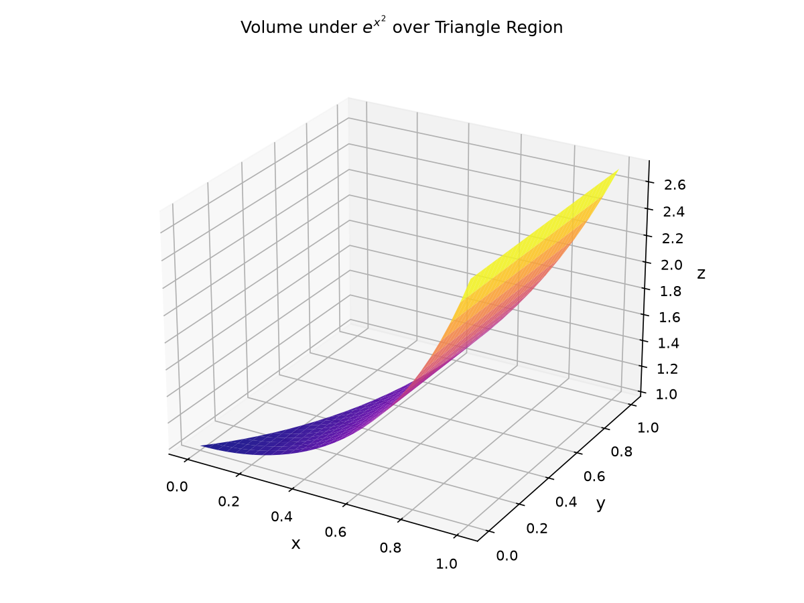
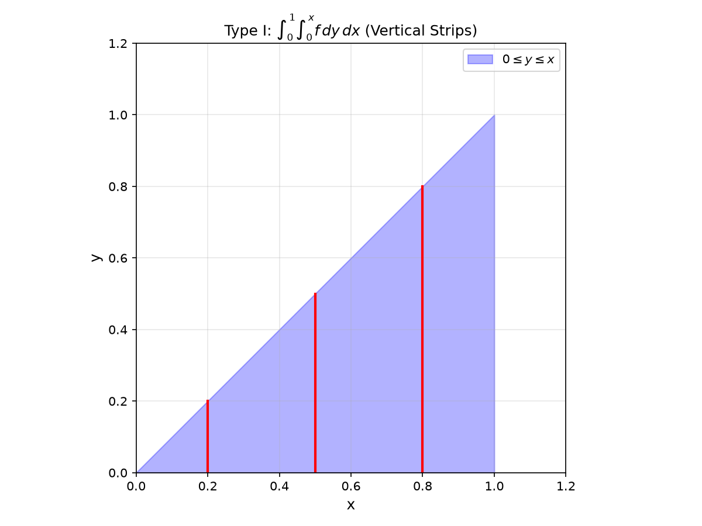
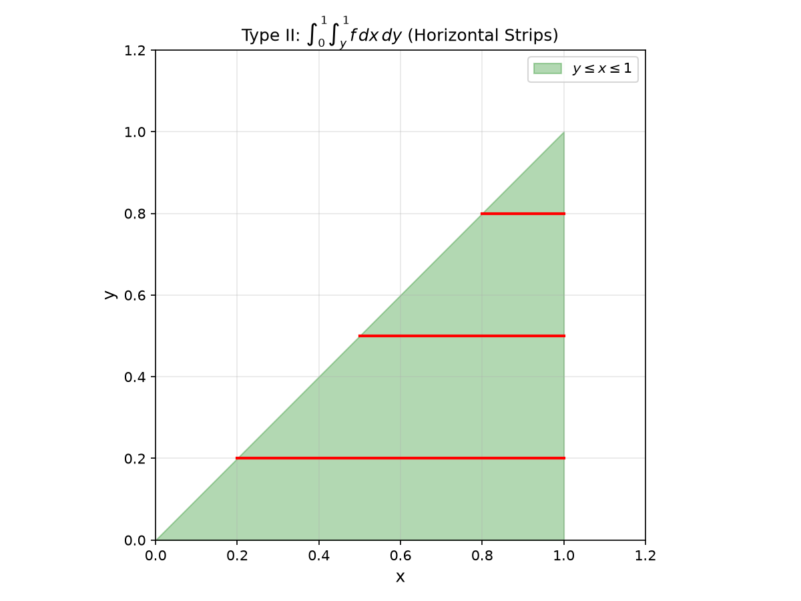
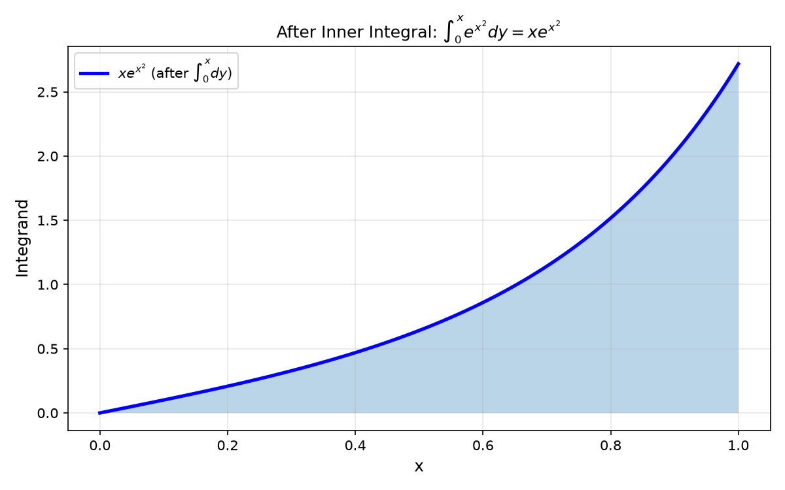

# Session 25A: Double Integrals — Volume Under a Surface

**Phase 2 — Proof Bridge | 50 min**

*Integrate over a 2D region to get volume. Fubini's theorem lets you compute it as two nested single integrals. When one order looks impossible, sketch the region and swap.*

**Prerequisites**: Single-variable integration (Session 16A). Functions of two variables (Session 23A).

---

## Part A: The Double Integral

---

## Example 1: $\iint_D f(x,y)\,dA$ = Volume

Chop region $D$ into tiny rectangles $\Delta A = \Delta x \Delta y$. At each, the volume of the column is $f(x_i,y_j)\Delta A$. Sum all columns. Limit as $\Delta A \to 0$ = the double integral.

If $f(x,y)=1$, the integral gives the **area** of $D$.

---

## Example 2: Fubini's Theorem — Iterated Integrals

$\iint_D f(x,y)\,dA = \int_{x=a}^{x=b} \left( \int_{y=g_1(x)}^{y=g_2(x)} f(x,y)\,dy \right) dx$.

**Inner first, outer last.** The inner limits may depend on the outer variable. The outer limits are constants.

$\iint_D (x^2+y)\,dA$ over the triangle $D$: $0 \leq x \leq 2$, $0 \leq y \leq x$.

$\int_0^2 \int_0^x (x^2+y)\,dy\,dx = \int_0^2 \left[x^2y + \frac{y^2}{2}\right]_{y=0}^{y=x} dx$
$= \int_0^2 (x^3 + \frac{x^2}{2})\,dx = \left[\frac{x^4}{4} + \frac{x^3}{6}\right]_0^2 = 4 + \frac{8}{6} = \frac{16}{3}$.

---

## Example 3: Swapping the Order — When One Direction Is Impossible (🔗 12C2, 12C3)

$\int_0^1 \int_y^1 e^{x^2}\,dx\,dy$. The inner integral $\int_y^1 e^{x^2}\,dx$ has no elementary antiderivative.

**Sketch the region**: $0 \leq y \leq 1$, $y \leq x \leq 1$. This is the triangle above $y=x$.

**Redescribe**: $0 \leq x \leq 1$, $0 \leq y \leq x$.

$\int_0^1 \int_0^x e^{x^2}\,dy\,dx = \int_0^1 [y e^{x^2}]_{y=0}^{y=x}\,dx = \int_0^1 x e^{x^2}\,dx$.

Substitute $u=x^2$, $du=2x\,dx$: $\frac{1}{2}\int_0^1 e^u\,du = \frac{e-1}{2}$.

**ALWAYS sketch the region before swapping.** The limits are the tricky part.

> **🔗 Bridge to 12C2 (Parametric Curves)**: The region boundaries — lines $y=0$, $x=1$, $y=x$ — are all **parametric curves** (12C2). The line $y=x$ is $\vec{r}(t)=(t,t)$; the vertical line $x=1$ is $\vec{r}(t)=(1,t)$. Describing a region means identifying which parametric curves bound it.
>
> **🔗 Bridge to 12C3 (Coordinate Perspectives)**: Swapping integration order from $dy\,dx$ to $dx\,dy$ is like changing your **coordinate perspective** (12C3). Type I (vertical strips) is one coordinate view; Type II (horizontal strips) is another. Both describe the same region, just as polar and Cartesian describe the same points. The art is choosing the view that makes the integral solvable.









*Graph 25A: The triangular region described two ways. Left — dy dx: for each x, y runs from 0 to x. Right — dx dy: for each y, x runs from y to 1. Both describe the same set of points. Swapping the order turned an impossible integral into an easy one.*

---

## Example 4: Type I vs Type II Regions

**Type I** (vertical strips): $a \leq x \leq b$, $g_1(x) \leq y \leq g_2(x)$. Integrate $dy\,dx$.

**Type II** (horizontal strips): $c \leq y \leq d$, $h_1(y) \leq x \leq h_2(y)$. Integrate $dx\,dy$.

$\iint_D xy\,dA$ over the region bounded by $y=x^2$ and $y=2x$.

**Type I**: Intersection: $x^2=2x$ → $x=0,2$. For each $x\in[0,2]$, $y$ runs from $x^2$ to $2x$.
$\int_0^2 \int_{x^2}^{2x} xy\,dy\,dx = \int_0^2 x\left[\frac{y^2}{2}\right]_{x^2}^{2x} dx = \int_0^2 x(2x^2 - \frac{x^4}{2})\,dx = \int_0^2 (2x^3 - \frac{x^5}{2})\,dx = [\frac{x^4}{2} - \frac{x^6}{12}]_0^2 = 8 - \frac{64}{12} = \frac{8}{3}$.

---

## Example 5: Average Value Over a Region

Average of $f$ over $D$ = $\frac{1}{\text{Area}(D)}\iint_D f\,dA$.

Average height of $z=x+y$ on the rectangle $[0,2]\times[0,1]$:
$\frac{1}{2}\int_0^2\int_0^1 (x+y)\,dy\,dx = \frac{1}{2}\int_0^2 [xy+\frac{y^2}{2}]_0^1 dx = \frac{1}{2}\int_0^2 (x+\frac{1}{2})\,dx = \frac{1}{2}[ \frac{x^2}{2}+\frac{x}{2}]_0^2 = \frac{1}{2}(2+1) = 1.5$.

> **Up to here**: $\iint_D f\,dA$ = volume. Fubini = iterated integrals. Sketch region to set limits. Swap order to simplify. Type I: $dy\,dx$. Type II: $dx\,dy$.

---

## Common Mistakes

### Mistake 1: Outer limits depend on the inner variable

**Wrong**: $\int_{y=0}^{y=x} \int_{x=0}^{x=2} f\,dx\,dy$. **Right**: Outer limits MUST be constants. The variable of integration for the outer integral cannot appear in the outer limits.

### Mistake 2: Swapping without redrawing

**Wrong**: Just swapping $dx$ and $dy$ while keeping the same limits. **Right**: Sketch the region. Rewrite the bounds completely from the other perspective.

---

## What We Just Did

```
(1) Double integral = volume under surface. Fubini = two nested 1D integrals.
(2) To swap order: sketch region, redescribe, rewrite limits.
(3) Type I (dy dx): vertical strips. Type II (dx dy): horizontal strips.
```

---

## Practice 1

Evaluate $\iint_D (2x+y)\,dA$, $D$ = triangle with vertices $(0,0),(2,0),(0,1)$.

---

## Practice 2

Swap order and evaluate: $\int_0^1 \int_{\sqrt{y}}^1 \sin(x^3)\,dx\,dy$.

---

## Practice 3

Find volume under $z=4-x^2-y^2$ over the square $[0,1]\times[0,1]$.

---

## Practice 4: Real Battle

A pond's region $D$: bounded by $y=x^2$ and $y=4$. Depth $d(x,y)=4-y$ meters. Find water volume. (a) Set up $dy\,dx$. (b) Evaluate. (c) Set up $dx\,dy$, verify same answer.

---

## Basic Drill (12)

**D1.** $\int_0^1\int_0^2 (xy+1)\,dy\,dx$.
**D2.** $\int_0^2\int_0^x (x+y)\,dy\,dx$.
**D3.** Set up $\iint_D (x^2+y^2)\,dA$, $D$: rectangle $[0,1]\times[0,2]$.
**D4.** Sketch region for $\int_0^1\int_0^{1-x} f\,dy\,dx$.
**D5.** Swap order: $\int_0^1\int_0^y f(x,y)\,dx\,dy$.
**D6.** Find area of $D$ bounded by $y=x$, $y=0$, $x=2$ via double integral of 1.
**D7.** Type I or II? Region $x^2+y^2\leq 1$, $x\geq 0$.
**D8.** $\iint_D x\,dA$, $D$: $0\leq x\leq 1$, $0\leq y\leq x^2$.
**D9.** Why can't you directly integrate $\int_0^1\int_0^1 e^{y^2}\,dy\,dx$? What order should you use?
**D10.** Average value of $f(x,y)=xy$ on $[0,1]\times[0,1]$.
**D11.** Parameterize the boundary of the triangle with vertices $(0,0),(2,0),(0,1)$ as three parametric curves. (🔗 12C2)
**D12.** The region bounded by $y=x^2$ and $y=2x$: describe as Type I ($dy\,dx$) and Type II ($dx\,dy$). Which perspective (🔗 12C3) gives simpler limits?

---

## Advanced Drill (12)

**A1.** $\iint_D e^{y/x}\,dA$, $D$: triangle bounded by $y=0$, $x=1$, $y=x$. (One order is much easier.)
**A2.** $\iint_D \sin(y^2)\,dA$, $D$: triangle $(0,0),(1,0),(1,1)$. Swap to evaluate.
**A3.** Volume bounded by $z=x^2+y^2$ and $z=4$. (Use polar — preview of 25B.)
**A4.** $\iint_D \frac{1}{(x+y)^2}\,dA$, $D$: square $[1,2]\times[1,2]$.
**A5.** Prove Fubini for a rectangle: if $f$ is continuous on $[a,b]\times[c,d]$, then $\int_a^b\int_c^d f\,dy\,dx = \int_c^d\int_a^b f\,dx\,dy$.
**A6.** Find the volume of the solid bounded by $z=0$, $z=x+y$, $x=0$, $y=0$, $x+y=2$.
**A7.** $\iint_D xy\,dA$, $D$ bounded by $y=x^2$ and $y=x+2$. (Find intersections first.)
**A8.** Set up the double integral for the volume of a tetrahedron with vertices $(0,0,0),(a,0,0),(0,b,0),(0,0,c)$.
**A9.** (Proof reading) "$\int_0^1\int_0^1 \frac{x-y}{(x+y)^3}\,dy\,dx = 0$ by symmetry." Is it? Evaluate both iterated orders — they differ! (Fubini requires absolute integrability.)
**A10.** Prove: $\iint_D f(x)g(y)\,dA = (\int_a^b f(x)\,dx)(\int_c^d g(y)\,dy)$ when $D=[a,b]\times[c,d]$.
**A11.** The region $D$ is bounded by the parametric curve $\vec{r}(t) = (t^2, t^3)$, $t\in[0,1]$, and the $x$-axis. Set up the double integral of $f(x,y)=x$ over $D$. (🔗 12C2)
**A12.** Describe the disk $x^2+y^2\leq 1$ in both Type I and Type II forms. Which coordinate perspective (🔗 12C3) would make integration easier, and why?

> Solutions: [Solutions](solutions/25A-solutions.md)

---

## Today's Procedure

```
Step 1: Double integral = ∫∫ f dA. Fubini = iterate. Inner first, outer last.
Step 2: Sketch region. Set limits. Type I: dy dx. Type II: dx dy.
Step 3: When stuck, swap order. Redescribe the bounding curves.
```

---

## How to Read These Symbols

| Symbol | Reads as | Meaning |
|:---:|:---:|------|
| $\iint_D f\,dA$ | "double integral over D of f d A" | integral over 2D region — volume under surface |
| $dA$ | "d A" / "area element" | dA = dx dy = dy dx — infinitesimal area piece |
| $\int_a^b\int_{g_1(x)}^{g_2(x)} f\,dy\,dx$ | "integral a to b, integral g1 to g2, f dy dx" | iterated integral — inner first (y), then outer (x) |
| $dy\,dx$ | "dy dx" / "integrate y first, then x" | Type I: vertical strips — outer limits are constants |
| $dx\,dy$ | "dx dy" / "integrate x first, then y" | Type II: horizontal strips — outer limits are constants |
| Fubini | "Fubini" / "foo-BEE-nee" | theorem: order of integration can be swapped for continuous functions |
| Type I region | "type one region" | vertical strips: a≤x≤b, g₁(x)≤y≤g₂(x) |
| Type II region | "type two region" | horizontal strips: c≤y≤d, h₁(y)≤x≤h₂(y) |


---

## Terminology

| What we call it | Math term | Notation |
|:---:|:---:|:---:|
| integral over a 2D region | double integral | $\iint_D f\,dA$ |
| compute as two 1D integrals | iterated integral / Fubini | $\int\int f\,dy\,dx$ |
| vertical strip description | Type I region | $g_1(x)\leq y\leq g_2(x)$ (🔗 12C2: bounded by parametric curves) |
| horizontal strip description | Type II region | $h_1(y)\leq x\leq h_2(y)$ (🔗 12C3: different coordinate perspective) |
