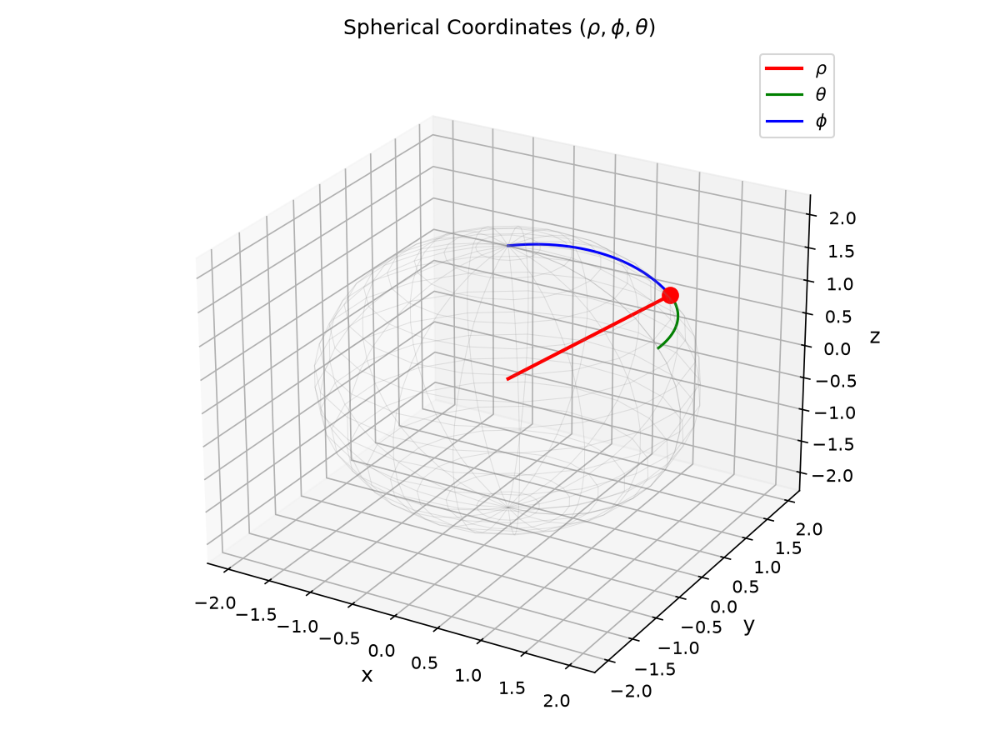
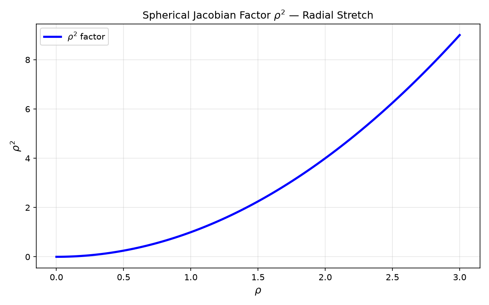
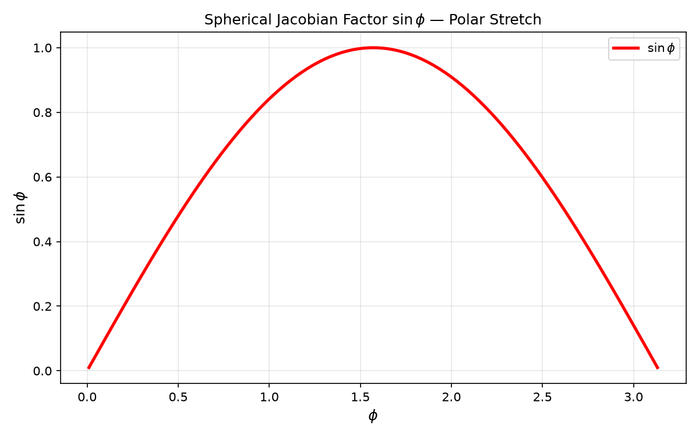
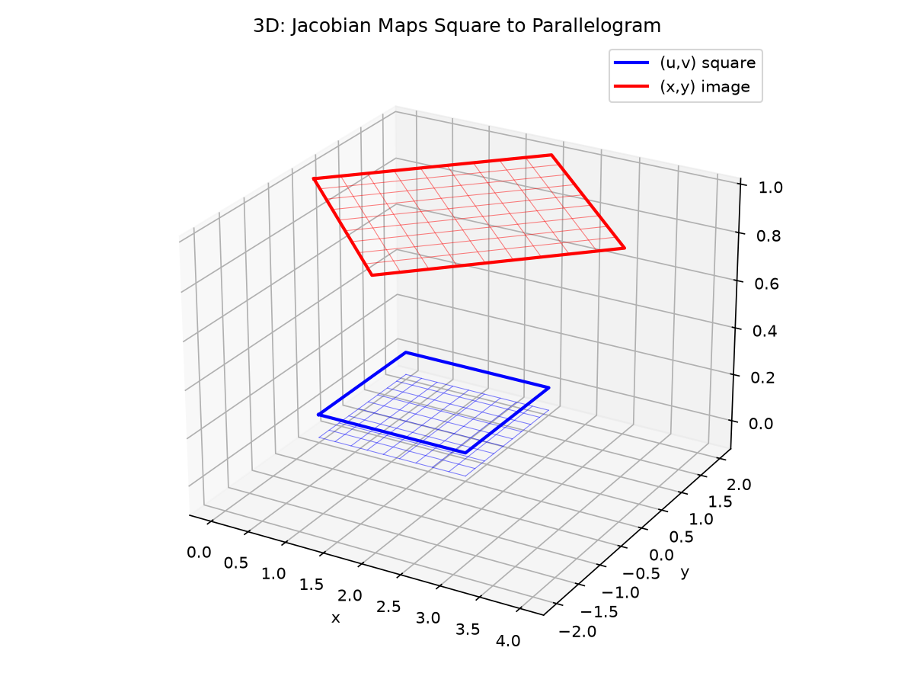
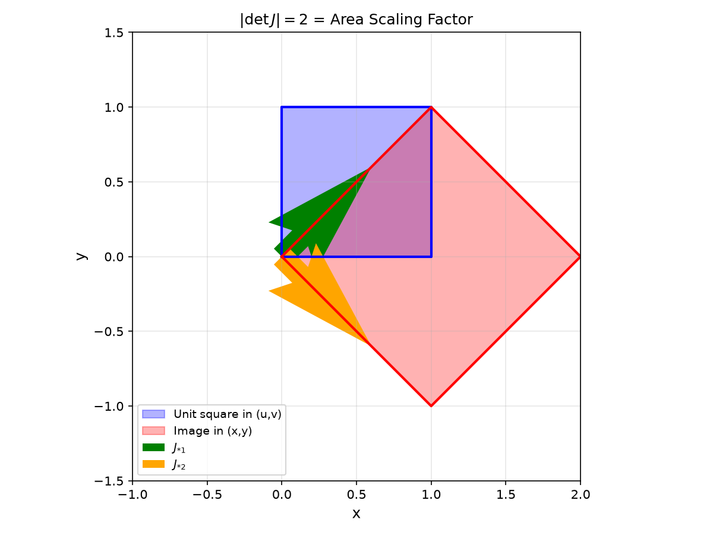
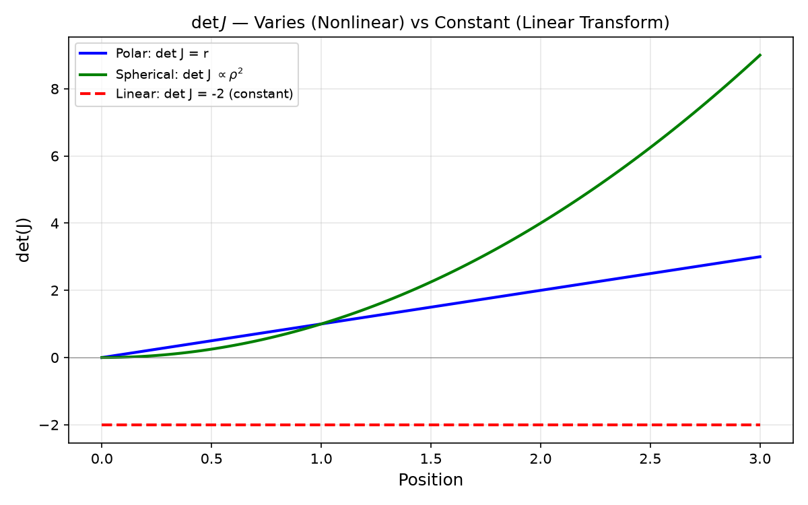

# Session 25B: Triple Integrals and Coordinate Systems

**Phase 2 — Proof Bridge | 55 min**

*Polar, cylindrical, spherical — the right coordinate system turns an impossible integral into a trivial one. Each system has a Jacobian: the "stretch factor" for area or volume elements. Master these three and you can integrate over any symmetric shape.*

**Prerequisites**: Double integrals, Fubini (Session 25A). Trigonometry (Session 11A).

---

## Part A: Polar Coordinates — Circular Symmetry in 2D

---

## Example 1: $dA = r\,dr\,d\theta$ — The Polar Jacobian

$x=r\cos\theta$, $y=r\sin\theta$, $r \geq 0$, $\theta \in [0,2\pi]$.

$\iint_D f(x,y)\,dA = \int_{\theta=\alpha}^{\theta=\beta} \int_{r=r_1(\theta)}^{r=r_2(\theta)} f(r\cos\theta, r\sin\theta) \cdot r\,dr\,d\theta$.

**The extra $r$ is the Jacobian** — it accounts for the fact that a sector at larger $r$ sweeps more area. Thin strip at radius $r$: width $dr$, arc length $r\,d\theta$, area $r\,dr\,d\theta$.

---

## Example 2: The Gaussian Integral — Polar Magic

$\iint_{\mathbb{R}^2} e^{-(x^2+y^2)}\,dA = \int_0^{2\pi} \int_0^\infty e^{-r^2} \cdot r\,dr\,d\theta$.

Inner: $\int_0^\infty r e^{-r^2}\,dr = [-\frac{1}{2}e^{-r^2}]_0^\infty = \frac{1}{2}$.
Outer: $\int_0^{2\pi} \frac{1}{2}\,d\theta = \pi$.

**This proves**: $\int_{-\infty}^\infty e^{-x^2}\,dx = \sqrt{\pi}$. (Square the 1D integral, convert to 2D polar.)

---

## Example 3: Area of a Leaf — Polar Regions

Area inside one petal of $r=\sin(2\theta)$: $0 \leq \theta \leq \pi/2$, $0 \leq r \leq \sin(2\theta)$.

$A = \int_0^{\pi/2} \int_0^{\sin 2\theta} r\,dr\,d\theta = \int_0^{\pi/2} \frac{\sin^2 2\theta}{2}\,d\theta = \frac{1}{2}\int_0^{\pi/2} \frac{1-\cos 4\theta}{2}\,d\theta = \frac{1}{4}[\theta - \frac{\sin 4\theta}{4}]_0^{\pi/2} = \frac{\pi}{8}$.

---

## Part B: Cylindrical Coordinates — $r, \theta, z$ (🔗 12C3)

---

## Example 4: $dV = r\,dr\,d\theta\,dz$

Cylindrical = polar in $xy$ + unchanged $z$.
$x=r\cos\theta$, $y=r\sin\theta$, $z=z$.

**Use when**: Circular symmetry in $xy$, but $z$ varies independently.

Volume bounded by $x^2+y^2=1$, $z=0$, and $z=4-x^2-y^2$:
$V = \int_0^{2\pi} \int_0^1 \int_0^{4-r^2} r\,dz\,dr\,d\theta = 2\pi \int_0^1 r(4-r^2)\,dr = 2\pi[2r^2-\frac{r^4}{4}]_0^1 = 2\pi(2-\frac{1}{4}) = \frac{7\pi}{2}$.

> **🔗 Bridge to 12C3 (Cylindrical Coordinates)**: Cylindrical coordinates $(r,\theta,z)$ are exactly the polar coordinates from 12C3 with a $z$ axis added. In 12C3 Example 3, you saw that a cylinder is $r=R$ in cylindrical — the simplest possible description. The triple integral $\iiint f\,dV = \iiint f\cdot r\,dr\,d\theta\,dz$ is the 3D version of the same idea: use the coordinate system that matches the symmetry.

---

## Example 5: Mass of a Cylinder with Variable Density

Cylinder $x^2+y^2 \leq 4$, $0 \leq z \leq 3$, density $\delta(x,y,z) = z(x^2+y^2)$.

Mass $= \iiint \delta\,dV = \int_0^{2\pi} \int_0^2 \int_0^3 z \cdot r^2 \cdot r\,dz\,dr\,d\theta$.

Inner ($z$): $\int_0^3 z r^3\,dz = r^3[\frac{z^2}{2}]_0^3 = \frac{9}{2}r^3$.
Middle ($r$): $\frac{9}{2}\int_0^2 r^3\,dr = \frac{9}{2} \cdot 4 = 18$.
Outer ($\theta$): $18 \cdot 2\pi = 36\pi$.

---

## Part C: Spherical Coordinates — $\rho, \phi, \theta$ (🔗 12C3)

---

## Example 6: $dV = \rho^2\sin\phi\,d\rho\,d\phi\,d\theta$

$x = \rho\sin\phi\cos\theta$, $y = \rho\sin\phi\sin\theta$, $z = \rho\cos\phi$.

$\rho \geq 0$ (distance from origin). $\phi \in [0,\pi]$ (angle from positive $z$-axis). $\theta \in [0,2\pi]$ (angle in $xy$-plane).

**Use when**: The region is a sphere, cone, or radial. **The Jacobian** $\rho^2\sin\phi$ is the key.

Volume of sphere radius $R$:
$V = \int_0^{2\pi} \int_0^\pi \int_0^R \rho^2\sin\phi\,d\rho\,d\phi\,d\theta = 2\pi \cdot [-\cos\phi]_0^\pi \cdot [\frac{\rho^3}{3}]_0^R = 2\pi \cdot 2 \cdot \frac{R^3}{3} = \frac{4}{3}\pi R^3$.

> **🔗 Bridge to 12C3 (Spherical Coordinates)**: Spherical coordinates $(\rho,\phi,\theta)$ are the third coordinate system from 12C3 Example 3. In 12C3, you saw that a sphere is $\rho=R$ — the simplest description. Here you're integrating over that sphere. The Jacobian $\rho^2\sin\phi$ is the **volume scaling factor** of the coordinate transformation — the 3D analogue of the area scaling $r$ in polar. The 12C3 lesson holds: match the coordinate system to the symmetry of the problem.

---

## Example 7: Volume Inside a Sphere and Above a Cone

Volume inside $x^2+y^2+z^2=9$ and above $z=\sqrt{x^2+y^2}$.

In spherical: sphere is $\rho=3$. Cone $z=\sqrt{x^2+y^2}$ → $\rho\cos\phi = \rho\sin\phi$ → $\tan\phi=1$ → $\phi=\pi/4$.

$V = \int_0^{2\pi} \int_0^{\pi/4} \int_0^3 \rho^2\sin\phi\,d\rho\,d\phi\,d\theta = 2\pi \cdot [-\cos\phi]_0^{\pi/4} \cdot 9 = 18\pi(1-\frac{\sqrt{2}}{2}) = 9\pi(2-\sqrt{2})$.







*Graph 25B: Spherical coordinates $(\rho,\phi,\theta)$. The volume element $dV=\rho^2\sin\phi\,d\rho\,d\phi\,d\theta$ is the product of: radial thickness $d\rho$, polar arc $\rho\,d\phi$, and azimuthal arc $\rho\sin\phi\,d\theta$. Multiplying all three gives $\rho^2\sin\phi\,d\rho\,d\phi\,d\theta$.*

---

## Part D: The General Jacobian (🔗 12C1)

---

## Example 8: Change of Variables Formula

For $(x,y) \leftrightarrow (u,v)$: $dA = \left|\frac{\partial(x,y)}{\partial(u,v)}\right|\,du\,dv$, where $\frac{\partial(x,y)}{\partial(u,v)} = \begin{vmatrix} x_u & x_v \\ y_u & y_v \end{vmatrix}$.

**Polar revisited**: $x=r\cos\theta$, $y=r\sin\theta$. Jacobian = $\cos\theta(r\cos\theta) - (-r\sin\theta)(\sin\theta) = r$. ✓

**Spherical revisited**: $x=\rho\sin\phi\cos\theta$, $y=\rho\sin\phi\sin\theta$, $z=\rho\cos\phi$. Jacobian $= \rho^2\sin\phi$. ✓

> **🔗 Bridge to 12C1 (Geometric Transformations)**: The Jacobian matrix $J$ is a **linear transformation** (12C1). Its columns are the images of the basis vectors: $\langle x_u, y_u \rangle$ shows how a step in $u$ moves the point; $\langle x_v, y_v \rangle$ shows how a step in $v$ moves the point. These two vectors span a parallelogram whose area is $|\det J|$ — exactly the determinant's geometric meaning from 12A2. The Jacobian determinant IS the local area scaling factor of the coordinate transformation, just as the determinant of a $2\times2$ matrix in 12A2 gave the area scaling of a linear transformation. The only difference: the Jacobian varies from point to point (for nonlinear transformations like polar), while a linear transformation has a constant determinant.

---

## Example 9: Simplifying a Tilted Region

$\iint_D (x+y)^2(x-y)\,dA$ over the square bounded by $x+y=0,2$ and $x-y=0,2$.

Let $u=x+y$, $v=x-y$. Region becomes $0\leq u,v \leq 2$.

$x=\frac{u+v}{2}$, $y=\frac{u-v}{2}$. Jacobian = $|\begin{vmatrix} 1/2 & 1/2 \\ 1/2 & -1/2 \end{vmatrix}| = |-\frac{1}{4}-\frac{1}{4}| = \frac{1}{2}$.

Integral = $\int_0^2\int_0^2 u^2 \cdot v \cdot \frac{1}{2}\,du\,dv = \frac{1}{2} \cdot \frac{8}{3} \cdot 2 = \frac{8}{3}$. Trivial after the transform.

---

> **🔗 Bridge to Linear Algebra**: The notation $\frac{\partial(x,y)}{\partial(u,v)}$ is the **determinant of the Jacobian matrix** — the same construct from Session 26A. The Jacobian matrix $J$ packs all partial derivatives:
>
> $$J = \begin{pmatrix} \frac{\partial x}{\partial u} & \frac{\partial x}{\partial v} \\[4pt] \frac{\partial y}{\partial u} & \frac{\partial y}{\partial v} \end{pmatrix}$$
>
> Its columns tell you how a small step in $u$ or $v$ moves the $(x,y)$ point: $J_{*,1} = \langle x_u, y_u \rangle$ (how $\Delta u$ changes output), $J_{*,2} = \langle x_v, y_v \rangle$ (how $\Delta v$ changes output). These two column vectors span a **parallelogram** whose area is $|\det J|$. That's why $dA = |\det J|\,du\,dv$ — the determinant IS the area scaling factor.
>
> For polar: $J = \begin{pmatrix} \cos\theta & -r\sin\theta \\ \sin\theta & r\cos\theta \end{pmatrix}$, $\det J = r$. For the tilted square above: $J = \begin{pmatrix} 1/2 & 1/2 \\ 1/2 & -1/2 \end{pmatrix}$, $\det J = -1/2$, $|\det J| = 1/2$.
>
> In 3D, the same logic applies: $dV = |\det J|\,du\,dv\,dw$ where $J$ is now $3\times3$ and $|\det J|$ is the volume of the parallelepiped spanned by its three columns.







*Graph 25B-2: 3D — a regular grid in $(u,v)$ space maps to a deformed grid in $(x,y)$ space via $(x,y) = (u+v, u-v)$. A small square in $(u,v)$ (red, bottom plane) becomes a parallelogram in $(x,y)$ (red, top plane). 2D — the two column vectors of $J = \begin{pmatrix}1&1\\1&-1\end{pmatrix}$ span a parallelogram whose area $|\det J| = 2$ is exactly the scaling factor. 1D — $\det J$ as a function of position: for polar, $\det J = r$ grows linearly (purple); for the linear mapping above, $\det J = -2$ is constant (red dashed); for spherical at fixed $\phi$, $\det J \propto \rho^2$ (green).*

> **Up to here**: Polar: $dA=r\,dr\,d\theta$. Cylindrical: $dV=r\,dr\,d\theta\,dz$. Spherical: $dV=\rho^2\sin\phi\,d\rho\,d\phi\,d\theta$. General Jacobian: $|\partial(x,y)/\partial(u,v)| = |\det J|$.

---

## Common Mistakes

### Mistake 1: Forgetting the Jacobian $r$ (or $\rho^2\sin\phi$)

Without it, areas and volumes are wrong. **Always multiply by the Jacobian.**

### Mistake 2: Confusing $\rho$ (spherical radius) with $r$ (cylindrical radius)

In spherical: $x^2+y^2+z^2=\rho^2$. In cylindrical: $x^2+y^2=r^2$. They're different.

### Mistake 3: Wrong $\phi$ limits

$\phi \in [0,\pi]$, NOT $[0,2\pi]$. $\phi$ is the polar angle from the $z$-axis. $\theta$ is the azimuth.

---

## What We Just Did

```
(1) Polar: dA = r·dr·dθ. Cylindrical: dV = r·dr·dθ·dz. Spherical: dV = ρ²sinφ·dρ·dφ·dθ.
(2) Jacobian = determinant of partial derivatives. Measures local area/volume stretch.
```

---

## Practice 1

Use polar to compute $\iint_D \sqrt{x^2+y^2}\,dA$ over $x^2+y^2 \leq 4$.

---

## Practice 2

Find the volume of the solid bounded by the paraboloid $z=x^2+y^2$ and the plane $z=4$ (cylindrical).

---

## Practice 3

Use spherical to find volume inside $x^2+y^2+z^2=9$, above cone $z=\sqrt{x^2+y^2}$.

---

## Practice 4: Real Battle

Compute $\iint_D e^{(x+y)/(x-y)}\,dA$ over the trapezoid bounded by $x+y=1$, $x+y=2$, $x-y=0$, $x-y=1$. Use $u=x+y$, $v=x-y$.

---

## Basic Drill (12)

**D1.** Convert $\int_0^1\int_0^{\sqrt{1-x^2}} (x^2+y^2)\,dy\,dx$ to polar (write limits, don't evaluate).
**D2.** $\int_0^{2\pi}\int_0^1 r^2\cdot r\,dr\,d\theta$ in polar. Evaluate.
**D3.** Set up in cylindrical: volume inside $x^2+y^2=4$, between $z=0$ and $z=x^2+y^2$.
**D4.** Convert $(x,y,z)=(1,1,\sqrt{2})$ to spherical $(\rho,\phi,\theta)$.
**D5.** Jacobian for $x=2u-v$, $y=u+3v$.
**D6.** Volume of sphere radius $R$ using spherical — what's the $\phi$ integral?
**D7.** When should you use cylindrical vs spherical coordinates?
**D8.** $\int_0^{2\pi}\int_0^\pi \sin\phi\,d\phi\,d\theta$ — evaluate.
**D9.** Convert $z=\sqrt{x^2+y^2}$ to spherical. What is $\phi$ on this cone?
**D10.** What is the polar Jacobian? Explain in words why it's $r$, not 1.
**D11.** In cylindrical coordinates, a cylinder is $r=R$. What is it in Cartesian? Which description is simpler? (🔗 12C3)
**D12.** The Jacobian matrix for polar is $J = \begin{pmatrix} \cos\theta & -r\sin\theta \\ \sin\theta & r\cos\theta \end{pmatrix}$. Compute $\det J$. This is a linear transformation (🔗 12C1) at each point $(r,\theta)$.

---

## Advanced Drill (12)

**A1.** Use polar to compute $\iint_D \frac{1}{x^2+y^2}\,dA$ over the annulus $1 \leq x^2+y^2 \leq 4$.
**A2.** Volume of the "ice cream cone": sphere $\rho=2\cos\phi$ inside. Set up in spherical.
**A3.** Prove the Gaussian integral $\int_{-\infty}^\infty e^{-x^2}dx=\sqrt{\pi}$ in full detail.
**A4.** Derive the spherical Jacobian $\rho^2\sin\phi$ from the 3×3 determinant.
**A5.** $\iiint_E (x^2+y^2)\,dV$, $E$: region above $z=0$, below $z=\sqrt{4-x^2-y^2}$. Use spherical.
**A6.** Use $u=xy$, $v=y/x$ to compute $\iint_D y^2\,dA$ over the region bounded by $xy=1,2$ and $y=x,2x$.
**A7.** Prove that $\iiint_E \frac{1}{\sqrt{x^2+y^2+z^2}}\,dV$ over the unit ball converges.
**A8.** Find the mass of a sphere $x^2+y^2+z^2 \leq R^2$ with density $\delta(x,y,z)=\sqrt{x^2+y^2+z^2}$.
**A9.** (Proof reading) "$\int_0^{2\pi}\int_0^\pi\int_0^R \rho^2\,d\rho\,d\phi\,d\theta = \frac{4}{3}\pi R^3$." What's missing?
**A10.** Derive the volume of an $n$-dimensional ball of radius $R$ for $n=3$ (spherical), and state the formula for general $n$. (The general formula involves the Gamma function.)
**A11.** The transformation $u=x+y$, $v=x-y$ (from Example 9) is a **linear transformation** (🔗 12C1). Write its Jacobian matrix $J$ and compute $\det J$. Explain geometrically why $|\det J| = 1/2$ means area is halved.
**A12.** A cone $z=\sqrt{x^2+y^2}$ in Cartesian becomes $\phi=\pi/4$ in spherical (🔗 12C3). Set up the volume integral inside the sphere $\rho=3$ and above this cone. Which coordinate system made this problem solvable?

> Solutions: [Solutions](solutions/25B-solutions.md)

---

## Today's Procedure

```
Step 1: Polar (2D): dA = r·dr·dθ. Cylindrical (3D): dV = r·dr·dθ·dz.
Step 2: Spherical: dV = ρ²sinφ·dρ·dφ·dθ. φ∈[0,π], θ∈[0,2π].
Step 3: General Jacobian = |∂(x,y)/∂(u,v)|. Transform region + integrand + area element.
```

---

## How to Read These Symbols

| Symbol | Reads as | Meaning |
|:---:|:---:|------|
| $\iiint_E f\,dV$ | "triple integral over E of f d V" | integral over 3D region — hypervolume under a 3D graph, or mass with density f |
| $dV$ | "d V" / "volume element" | depends on coordinate system — must include Jacobian |
| $r\,dr\,d\theta$ | "r d r d theta" | polar area element — Jacobian = r |
| $r\,dr\,d\theta\,dz$ | "r d r d theta d z" | cylindrical volume element — Jacobian = r |
| $\rho^2\sin\phi\,d\rho\,d\phi\,d\theta$ | "rho squared sine phi d rho d phi d theta" | spherical volume element — Jacobian = ρ² sin φ |
| $\rho$ | "rho" | distance from origin (spherical) — not the same as polar/cylindrical r |
| $\phi$ | "phi" | angle from positive z-axis: 0=north pole, π/2=equator, π=south pole |
| $\theta$ | "theta" | azimuthal angle in xy-plane: 0 to 2π |
| $\left|\frac{\partial(x,y)}{\partial(u,v)}\right|$ | "absolute Jacobian" / "absolute value of partial x y over partial u v" | area scaling factor for coordinate transformation — determinant of Jacobian matrix |
| $\det J$ | "determinant of J" | determinant of Jacobian matrix — gives local volume/area stretch factor |


---

## Terminology

| What we call it | Math term | Notation |
|:---:|:---:|:---:|
| polar area stretch factor | polar Jacobian | $dA = r\,dr\,d\theta$ (🔗 12C3: coordinate transformation) |
| cylindrical volume element | cylindrical Jacobian | $dV = r\,dr\,d\theta\,dz$ (🔗 12C3) |
| spherical volume element | spherical Jacobian | $dV = \rho^2\sin\phi\,d\rho\,d\phi\,d\theta$ (🔗 12C3) |
| general transformation determinant | Jacobian determinant | $\left\vert\frac{\partial(x,y)}{\partial(u,v)}\right\vert$ (🔗 12C1: det = area scaling) |
