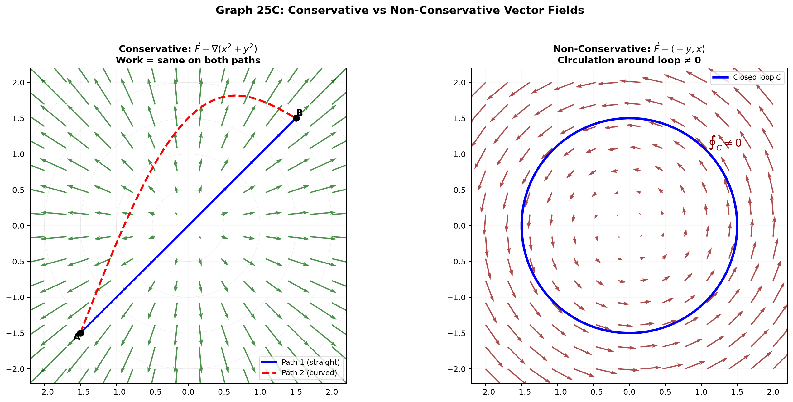
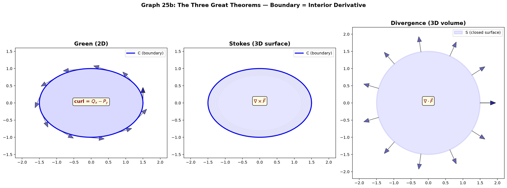

# Session 25C: Vector Calculus — Line Integrals and the Big Three Theorems

**Phase 2 — Proof Bridge | 45 min**

*Green, Stokes, and the Divergence Theorem. Three names, one idea: the integral of a derivative over a region equals the integral of the original quantity over the boundary. This is the Fundamental Theorem of Calculus generalized to 2D and 3D.*

**Prerequisites**: Partial derivatives, gradient (Session 23B). Double and triple integrals (Sessions 25A, 25B). Parametric curves (Session 12C2).

---

## Part A: Line Integrals — Work Along a Path

---

## Example 1: Line Integral of a Vector Field

A **vector field** $\vec{F}(x,y)=\langle P(x,y), Q(x,y)\rangle$ assigns a vector to each point.

The **line integral** along curve $C$ parameterized by $\vec{r}(t)$, $t\in[a,b]$:

$\int_C \vec{F}\cdot d\vec{r} = \int_a^b \vec{F}(\vec{r}(t)) \cdot \vec{r}\,'(t)\,dt$.

**Physical meaning**: Work done by force $\vec{F}$ along path $C$.

$\vec{F}=\langle -y, x\rangle$, $C$ = unit circle CCW: $\vec{r}(t)=\langle\cos t,\sin t\rangle$, $0\leq t\leq 2\pi$.
$\vec{F}(\vec{r}(t))=\langle -\sin t,\cos t\rangle$, $\vec{r}\,'(t)=\langle -\sin t,\cos t\rangle$. Dot product = 1.
$\int_0^{2\pi}1\,dt = 2\pi$. Work = $2\pi$.

---

## Example 2: Conservative Fields — Path Independence

If $\vec{F}=\nabla f$ for some scalar function $f$ (called a **potential**), then $\vec{F}$ is **conservative**.

For a conservative field, $\int_C \vec{F}\cdot d\vec{r} = f(\text{end}) - f(\text{start})$. **The path doesn't matter — only endpoints.**

$\vec{F}=\langle 2x, 2y\rangle = \nabla(x^2+y^2)$. From $(0,0)$ to $(1,1)$ along any path:
$f(1,1)-f(0,0) = 2-0 = 2$.

**Test**: In 2D, $\vec{F}=\langle P,Q\rangle$ is conservative if $\frac{\partial Q}{\partial x} = \frac{\partial P}{\partial y}$ (on a simply connected region).



*Graph 25C: Left — A conservative (gradient) field $\vec{F}=\nabla f$. Line integrals are path-independent; circulation around any closed loop is zero. Right — A non-conservative field (with curl). The line integral depends on the path taken. Green's theorem quantifies this: circulation = total curl inside.*

---

## Part B: Green's Theorem — Circulation = Curl Over Area

---

## Example 3: Green's Theorem Statement

For a positively oriented (CCW), simple closed curve $C$ bounding region $D$:

$\oint_C P\,dx + Q\,dy = \iint_D \left(\frac{\partial Q}{\partial x} - \frac{\partial P}{\partial y}\right) dA$.

**Example 1 revisited**: $P=-y$, $Q=x$. $\frac{\partial Q}{\partial x} - \frac{\partial P}{\partial y} = 1 - (-1) = 2$.
$\iint_D 2\,dA = 2\cdot\pi\cdot1^2 = 2\pi$. ✓ Matches line integral.

---

## Example 4: Verifying Green's Theorem on a Square

$\vec{F}=\langle y^2, x^2\rangle$, $C$ = square with vertices $(0,0),(1,0),(1,1),(0,1)$ CCW.

**Left side (line integral)** — 4 edges:
Bottom ($y=0$): $\int_0^1 0\,dx + x^2\cdot 0 = 0$.
Right ($x=1$): $\int_0^1 y^2\cdot 0 + 1\cdot dy = 1$.
Top ($y=1$): $\int_1^0 1\,dx + x^2\cdot 0 = -1$.
Left ($x=0$): $\int_1^0 y^2\cdot 0 + 0\cdot dy = 0$.
Total = 0.

**Right side (area integral)**: $Q_x=2x$, $P_y=2y$. $Q_x-P_y=2x-2y$.
$\iint_D (2x-2y)\,dA = \int_0^1\int_0^1 (2x-2y)\,dy\,dx = \int_0^1 [2xy-y^2]_0^1 dx = \int_0^1 (2x-1)\,dx = [x^2-x]_0^1 = 0$. ✓

---

## Example 5: Area via Line Integral — A Surveyor's Trick

Choose $P=0, Q=x$ (or $P=-y, Q=0$). Then $Q_x-P_y=1$.

$\text{Area}(D) = \iint_D 1\,dA = \oint_C x\,dy = -\oint_C y\,dx = \frac{1}{2}\oint_C (x\,dy - y\,dx)$.

Ellipse $x=a\cos t$, $y=b\sin t$: Area = $\frac{1}{2}\int_0^{2\pi} (a\cos t \cdot b\cos t - b\sin t \cdot (-a\sin t))\,dt = \frac{1}{2}\int_0^{2\pi} ab\,dt = \pi ab$.

---

## Part C: Stokes' Theorem — Green in 3D

---

## Example 6: Stokes' Theorem Statement

$\oint_C \vec{F}\cdot d\vec{r} = \iint_S (\nabla \times \vec{F})\cdot d\vec{S}$.

The circulation around $C$ = flux of curl through any surface $S$ bounded by $C$.

$\nabla \times \vec{F} = \begin{vmatrix} \hat{i} & \hat{j} & \hat{k} \\ \frac{\partial}{\partial x} & \frac{\partial}{\partial y} & \frac{\partial}{\partial z} \\ P & Q & R \end{vmatrix} = \langle R_y-Q_z,\; P_z-R_x,\; Q_x-P_y \rangle$.

**When $S$ is flat in the $xy$-plane**: $d\vec{S}=\langle 0,0,1\rangle\,dA$, Stokes reduces to Green.

---

## Example 7: Verifying Stokes — Flat Surface

$\vec{F}=\langle z, x, y\rangle$, $C$ = boundary of triangle $(1,0,0),(0,1,0),(0,0,1)$ (CCW from above).

**Direct line integral** (3 edges): laborious but doable. **Stokes**: $\nabla\times\vec{F}=\langle 1,1,1\rangle$ (constant!).

Plane of triangle: $x+y+z=1$, normal $\vec{n}=\langle 1,1,1\rangle/\sqrt{3}$.
$d\vec{S} = \vec{n}\,dS = \langle 1,1,1\rangle/\sqrt{3} \cdot dS$. But in the $xy$-projection, $dS = \sqrt{3}\,dA$.

$(\nabla\times\vec{F})\cdot d\vec{S} = \langle 1,1,1\rangle \cdot \langle 1,1,1\rangle/\sqrt{3} \cdot \sqrt{3}\,dA = 3\,dA$.

$\iint_D 3\,dA = 3 \cdot \text{Area(triangle)} = 3 \cdot \frac{1}{2} = \frac{3}{2}$. (Triangle in $xy$: $0\leq x\leq 1$, $0\leq y\leq 1-x$.)

---

## Part D: The Divergence Theorem — Flux = Total Divergence

---

## Example 8: Divergence Theorem Statement

$\iint_S \vec{F}\cdot d\vec{S} = \iiint_E (\nabla \cdot \vec{F})\,dV$.

Flux through closed surface $S$ = integral of divergence over enclosed volume $E$.

$\nabla \cdot \vec{F} = \frac{\partial P}{\partial x} + \frac{\partial Q}{\partial y} + \frac{\partial R}{\partial z}$. Divergence measures "spreading out."

---

## Example 9: Flux Through a Sphere

$\vec{F}=\langle x^3, y^3, z^3\rangle$, $S$ = unit sphere.

$\nabla\cdot\vec{F}=3(x^2+y^2+z^2)=3\rho^2$ (in spherical).

By divergence theorem: Flux = $\iiint_E 3\rho^2\,dV = \int_0^{2\pi}\int_0^\pi\int_0^1 3\rho^2\cdot\rho^2\sin\phi\,d\rho\,d\phi\,d\theta$.

$= 3 \cdot 2\pi \cdot 2 \cdot \int_0^1 \rho^4\,d\rho = 12\pi \cdot \frac{1}{5} = \frac{12\pi}{5}$.

---

## Example 10: The Unified Idea — FTC Generalized

| Dim | Boundary | Interior | Theorem |
|:---:|:---:|:---:|:---:|
| 1D | $\{a,b\}$ | $[a,b]$ | $\int_a^b f' = f(b)-f(a)$ (FTC) |
| 2D | Closed curve $C$ | Region $D$ | $\oint_C \vec{F}\cdot d\vec{r} = \iint_D (Q_x-P_y)\,dA$ (Green) |
| 3D | Closed surface $S$ | Volume $E$ | $\iint_S \vec{F}\cdot d\vec{S} = \iiint_E (\nabla\cdot\vec{F})\,dV$ (Divergence) |
| 2D surface | Boundary $C$ | Surface $S$ | $\oint_C \vec{F}\cdot d\vec{r} = \iint_S (\nabla\times\vec{F})\cdot d\vec{S}$ (Stokes) |

**All say**: total derivative inside = net flow across boundary.



---

> **Up to here**: Line integral = $\int_C \vec{F}\cdot d\vec{r}$ = work. Conservative: $\vec{F}=\nabla f$ → path independent. Green: $\oint_C = \iint_D (Q_x-P_y)$. Stokes: $\oint_C = \iint_S (\nabla\times\vec{F})\cdot d\vec{S}$. Divergence: $\iint_S \vec{F}\cdot d\vec{S} = \iiint_E (\nabla\cdot\vec{F})\,dV$. All = FTC generalized.

---

## Common Mistakes

### Mistake 1: Using Green's theorem on a non-closed curve

Green requires a CLOSED curve. For open curves, compute the line integral directly.

### Mistake 2: Wrong orientation in Green/Stokes

Positive orientation = CCW (region on your left as you walk). If reversed, the sign flips.

### Mistake 3: Applying the divergence theorem to an open surface

The divergence theorem requires a CLOSED surface (enclosing a volume). A hemisphere alone is not enough — you need the base disk too.

---

## What We Just Did

```
(1) Line integrals: work = ∫_C F·dr. Conservative if F=∇f → path independent.

(2) Green: ∮_C P dx+Q dy = ∬_D (Q_x−P_y) dA. Stokes: ∮_C F·dr = ∬_S (curl F)·dS.
    Divergence: ∬_S F·dS = ∭_E (div F) dV.

(3) All three = FTC for higher dimensions: boundary integral = interior integral of a derivative.
```

---

## Practice 1

Compute $\int_C (x+y)\,dx + (x-y)\,dy$ along the line segment from $(0,0)$ to $(1,2)$.

---

## Practice 2

Verify Green's theorem for $\vec{F}=\langle y^2, x^2\rangle$ on the square $[0,1]\times[0,1]$.

---

## Practice 3

Use Stokes' theorem: $\vec{F}=\langle z,x,y\rangle$, $C$ = boundary of triangle $(1,0,0),(0,1,0),(0,0,1)$.

---

## Practice 4: Real Battle

Use the divergence theorem to compute flux of $\vec{F}=\langle x^2, y^2, z^2\rangle$ through the cube $[0,1]\times[0,1]\times[0,1]$. Compare with direct computation through the 6 faces.

---

## Basic Drill (10)

**D1.** $\int_C (x+y)\,dx + (x-y)\,dy$, $C$: segment $(0,0)$ to $(1,2)$.
**D2.** Is $\vec{F}=\langle y, x\rangle$ conservative? Find a potential if so.
**D3.** Compute $\nabla\times\vec{F}$ for $\vec{F}=\langle yz, xz, xy\rangle$.
**D4.** Compute $\nabla\cdot\vec{F}$ for $\vec{F}=\langle x^2, y^2, z^2\rangle$.
**D5.** State Green's theorem. What must be true about $C$?
**D6.** Use area formula: find area of ellipse $x=2\cos t$, $y=3\sin t$ via $\frac{1}{2}\oint (x\,dy-y\,dx)$.
**D7.** Does Green apply to $\oint_C \frac{-y}{x^2+y^2}dx + \frac{x}{x^2+y^2}dy$ around the unit circle? (Check if $P_y=Q_x$.)
**D8.** What does the divergence theorem reduce to in 2D? (It's Green's theorem in flux form.)
**D9.** If $\nabla\times\vec{F}=\vec{0}$ everywhere on a simply connected region, what can you conclude?
**D10.** Set up Stokes: $\vec{F}=\langle y, z, x\rangle$, $C$ = unit circle in $xy$-plane. What surface is simplest?

---

## Advanced Drill (10)

**A1.** Prove Green's theorem for a rectangle directly from FTC (integrate $\iint Q_x\,dA$ and $\iint P_y\,dA$).
**A2.** Show that $\vec{F}=\langle yz, xz, xy\rangle$ is conservative by finding $f$ with $\nabla f=\vec{F}$.
**A3.** Use Stokes to evaluate $\oint_C \vec{F}\cdot d\vec{r}$, $\vec{F}=\langle z,x,y\rangle$, $C$: boundary of paraboloid $z=1-x^2-y^2$, $z\geq 0$.
**A4.** Compute flux of $\vec{F}=\langle x, y, z\rangle$ through sphere $x^2+y^2+z^2=R^2$ using divergence theorem. (Result = $4\pi R^3/3 \times 3 = 4\pi R^3$.)
**A5.** Prove: if $S$ is a closed surface, then $\iint_S (\nabla\times\vec{F})\cdot d\vec{S}=0$. (Apply divergence theorem to $\nabla\cdot(\nabla\times\vec{F})=0$.)
**A6.** Derive the continuity equation: if $\rho$ is density and $\vec{v}$ is velocity, then $\frac{\partial\rho}{\partial t} + \nabla\cdot(\rho\vec{v}) = 0$. (Conservation of mass.)
**A7.** Show Green's theorem implies: $\oint_C f\nabla g\cdot d\vec{r} = \iint_D (\nabla f\times\nabla g)\cdot\hat{k}\,dA$.
**A8.** Use the divergence theorem to prove Archimedes' principle: buoyant force = weight of displaced fluid.
**A9.** (Proof reading) "Stokes' theorem says $\oint_C \vec{F}\cdot d\vec{r}=0$ if $\nabla\times\vec{F}=\vec{0}$." Is this always true? What topological condition on the domain is needed? (Hint: think of $\vec{F}=\langle -y/(x^2+y^2), x/(x^2+y^2)\rangle$ on a circle around the origin.)
**A10.** Unify: Show that $\int_{\partial M} \omega = \int_M d\omega$ (generalized Stokes) contains FTC, Green, Stokes, and divergence as special cases by choosing appropriate $\omega$ and $M$.

> Solutions: [Solutions](solutions/25C-solutions.md)

---

## Today's Procedure

```
Step 1: Line integrals: ∫_C F·dr = work. Conservative: F=∇f → endpoints only.
Step 2: Green (2D): ∮_C = ∬_D (Q_x−P_y). Stokes (3D surface): ∮_C = ∬_S curl F·dS.
Step 3: Divergence (3D volume): ∬_S F·dS = ∭_E div F dV.
        All = FTC: ∫_∂M = ∫_M (derivative).
```

---

## Terminology

| What we call it | Math term | Notation |
|:---:|:---:|:---:|
| work along a path | line integral | $\int_C \vec{F}\cdot d\vec{r}$ |
| path-independent field | conservative / gradient field | $\vec{F}=\nabla f$ |
| circulation around boundary = curl inside | Green's theorem | $\oint_C = \iint_D (Q_x-P_y)\,dA$ |
| circulation = curl flux | Stokes' theorem | $\oint_C = \iint_S (\nabla\times\vec{F})\cdot d\vec{S}$ |
| flux = divergence inside | divergence theorem (Gauss) | $\iint_S = \iiint_E (\nabla\cdot\vec{F})\,dV$ |
| local rotation | curl | $\nabla\times\vec{F}$ |
| local spreading | divergence | $\nabla\cdot\vec{F}$ |
| unified FTC | generalized Stokes theorem | $\int_{\partial M}\omega = \int_M d\omega$ |
