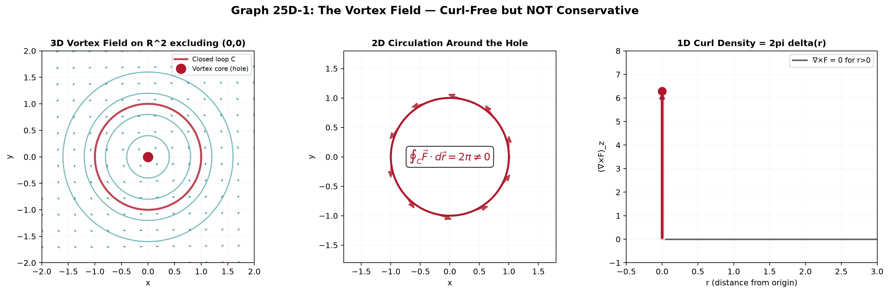
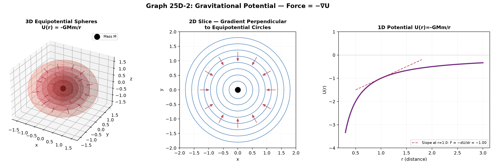
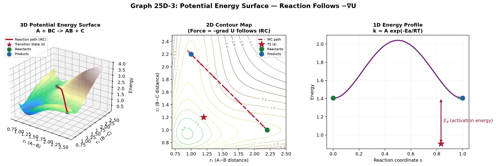

# Session 25D: Conservative Fields and the Art of Finding Potentials

**Phase 2 — Physics·Chemistry Bridge | 45 min**

*A force field that conserves energy. An electric field derived from voltage. A velocity field with no vorticity. These are all **conservative fields** — vector fields that are the gradient of some scalar function. This session teaches you to test whether a field is conservative, to reconstruct the potential from the field, and to understand why this matters in every corner of physics and chemistry.*

**Prerequisites**: Gradient, curl (Sessions 23B, 25C). Line integrals (Session 25C). Exact ODEs (Session 19C — helpful but not required).

---

## Part A: What Is a Conservative Field?

---

## Example 1: Two Forces — One Drains Your Battery, One Doesn't

Push a box around a closed loop on a rough floor. Friction opposes motion at every point — you do work around the entire loop. **Friction is non-conservative**. $\oint \vec{F}_{\text{fric}} \cdot d\vec{r} \neq 0$.

Now lift a mass in a gravitational field, move it sideways, lower it back. The work lifting up is $+mgh$. The work lowering is $-mgh$. Net work around the closed loop = **zero**. **Gravity is conservative**. $\oint \vec{F}_g \cdot d\vec{r} = 0$.

**Definition**: $\vec{F}$ is **conservative** if $\oint_C \vec{F}\cdot d\vec{r} = 0$ for EVERY closed curve $C$.

**Equivalent definitions** (all three mean the same thing):
1. $\oint_C \vec{F}\cdot d\vec{r} = 0$ for all closed loops (work around any closed path is zero)
2. $\int_{A}^{B} \vec{F}\cdot d\vec{r}$ depends only on endpoints $A, B$, not the path taken
3. $\vec{F} = \nabla\phi$ for some scalar function $\phi$ (the field is a gradient)
4. $\nabla \times \vec{F} = \vec{0}$ everywhere (zero curl — in simply connected regions)

---

## Example 2: The Curl Test — $\nabla \times \vec{F} = \vec{0}$

The quickest test for a conservative field in 3D:

$\vec{F} = \langle yz, xz, xy \rangle$. Compute $\nabla \times \vec{F}$:

$\nabla \times \vec{F} = \begin{vmatrix} \hat{i} & \hat{j} & \hat{k} \\ \partial_x & \partial_y & \partial_z \\ yz & xz & xy \end{vmatrix} = \langle x - x, y - y, z - z \rangle = \langle 0,0,0 \rangle$.

Zero curl → conservative. The potential is $\phi(x,y,z) = xyz$ (check: $\nabla\phi = \langle yz, xz, xy \rangle = \vec{F}$).

**In 2D**: A field $\vec{F} = \langle P(x,y), Q(x,y) \rangle$ is conservative if $\frac{\partial Q}{\partial x} = \frac{\partial P}{\partial y}$.

$\vec{F} = \langle 2xy, x^2 + 2y \rangle$. $\frac{\partial Q}{\partial x} = 2x$, $\frac{\partial P}{\partial y} = 2x$. Equal → conservative.

**This is the EXACT same condition as the exact ODE test from Session 19C**: $M_y = N_x \iff \nabla\times\langle M,N\rangle = 0$.

---

## Example 3: The Vortex — A Field with Zero Curl Almost Everywhere

$\vec{F} = \langle \frac{-y}{x^2+y^2}, \frac{x}{x^2+y^2} \rangle$ (the vortex field).

Check curl at any point except the origin: $\frac{\partial Q}{\partial x} - \frac{\partial P}{\partial y} = \frac{y^2-x^2}{(x^2+y^2)^2} - \frac{y^2-x^2}{(x^2+y^2)^2} = 0$. ✓

But compute $\oint_{C} \vec{F}\cdot d\vec{r}$ around the unit circle $C$ (CCW):
Parameterize: $x=\cos t, y=\sin t$, $d\vec{r} = \langle -\sin t, \cos t\rangle dt$.
$\vec{F} = \langle -\sin t, \cos t\rangle$. $\vec{F}\cdot d\vec{r} = \sin^2 t + \cos^2 t = 1$.
$\oint_C \vec{F}\cdot d\vec{r} = \int_0^{2\pi} 1\,dt = 2\pi \neq 0$!

**Why the contradiction?** The origin $(0,0)$ is a hole in the domain — the field is undefined there. $\nabla\times\vec{F} = \vec{0}$ **only guarantees conservative behavior on simply connected regions** (no holes). The vortex field wraps around the hole — the circulation is trapped.

**Physics**: This is the magnetic field around a current-carrying wire. $\oint\vec{B}\cdot d\vec{r} = \mu_0 I$ (Ampère's law). $\vec{B}$ is NOT conservative globally, though $\nabla\times\vec{B} = \vec{0}$ outside the wire (in magnetostatics without displacement current).



*Graph 25D-1: ⬢ 3D view of the vortex field $\vec{F} = \langle -y, x\rangle/(x^2+y^2)$ on the plane. ⬡ 2D vector field with a closed loop encircling the origin. Circulation around the red loop is $2\pi$ despite $\nabla\times\vec{F}=\vec{0}$ everywhere except the origin. ⬝ 1D circulation density — the curl is a delta function at the origin (the "vortex core"). A hole in the domain traps circulation.*

---

## Part B: Finding the Potential — The Reconstruction Algorithm

---

## Example 4: 2D Potential from Partial Integration

$\vec{F} = \langle 2xy + y^3, x^2 + 3xy^2 \rangle$. First, check: $\partial Q/\partial x = 2x + 3y^2$, $\partial P/\partial y = 2x + 3y^2$ ✓. Conservative.

**Step 1**: Integrate the first component with respect to $x$ (treat $y$ as constant):
$\phi(x,y) = \int P\,dx = \int (2xy + y^3)\,dx = x^2y + xy^3 + h(y)$.
$h(y)$ is an unknown function of $y$ only — the "constant of partial integration."

**Step 2**: Differentiate with respect to $y$ and match to $Q$:
$\frac{\partial\phi}{\partial y} = x^2 + 3xy^2 + h'(y)$.
This must equal $Q = x^2 + 3xy^2$. So $h'(y) = 0$ → $h(y) = C$ (constant).

**Step 3**: $\phi(x,y) = x^2y + xy^3 + C$. The potential is found up to an additive constant — **gauge freedom**.

---

## Example 5: 3D Potential — The Systematic Algorithm

$\vec{F} = \langle yz + 2x, xz + 2y, xy + 2z \rangle$. First: $\nabla\times\vec{F} = \langle x-x, y-y, z-z \rangle = \vec{0}$ ✓.

**Step 1**: $\phi = \int P\,dx = \int (yz + 2x)\,dx = xyz + x^2 + g(y,z)$.

**Step 2**: $\frac{\partial\phi}{\partial y} = xz + \frac{\partial g}{\partial y}$. Must equal $Q = xz + 2y$. So $\frac{\partial g}{\partial y} = 2y$ → $g(y,z) = y^2 + k(z)$.

Now $\phi = xyz + x^2 + y^2 + k(z)$.

**Step 3**: $\frac{\partial\phi}{\partial z} = xy + k'(z)$. Must equal $R = xy + 2z$. So $k'(z) = 2z$ → $k(z) = z^2 + C$.

**Result**: $\phi(x,y,z) = xyz + x^2 + y^2 + z^2 + C$.

Check by gradient: $\nabla\phi = \langle yz+2x, xz+2y, xy+2z \rangle = \vec{F}$. ✓

**The algorithm**: Integrate first component → differentiate w.r.t. second variable to find unknown function → integrate → differentiate w.r.t. third → done. Three steps, one for each dimension.

---

## Example 6: When the Curl Test Fails — Non-Conservative Fields with Zero Curl

We saw the vortex field has $\nabla\times\vec{F} = \vec{0}$ everywhere it's defined but is NOT conservative. The issue: the domain $\mathbb{R}^2\setminus\{(0,0)\}$ is not simply connected.

**Simply connected region**: Any closed loop can be continuously shrunk to a point without leaving the region. A disk is simply connected. A disk with a hole is NOT.

**The complete theorem**: On a **simply connected** region, $\nabla\times\vec{F} = \vec{0}$ ⇔ $\vec{F}$ is conservative.

All of $\mathbb{R}^3$ is simply connected. $\mathbb{R}^3$ minus a line (like the $z$-axis) is NOT — this is where the vortex field lives.

**Physics**: The magnetic field $\vec{B}$ of a straight wire has $\nabla\times\vec{B} = \vec{0}$ outside the wire, but $\oint\vec{B}\cdot d\vec{r} \neq 0$ for loops encircling the wire. The wire creates a "hole" in the simply connected region.

---

## Part C: Gauge Freedom — The Potential Is Not Unique

---

## Example 7: Adding a Constant Does Nothing

If $\vec{F} = -\nabla U$, then $\vec{F} = -\nabla(U + C)$ for any constant $C$. The force is unchanged.

**Physics**: Only potential DIFFERENCES matter. $U_{\text{grav}} = mgy$ or $mgy + 1000$ — the physics is identical. You choose the zero of potential at a convenient reference point (ground level, infinity).

---

## Example 8: Vector Potential Gauge — $\vec{A} \to \vec{A} + \nabla\chi$

In electromagnetism, the magnetic field satisfies $\nabla\cdot\vec{B} = 0$ always. This means $\vec{B} = \nabla\times\vec{A}$ for some **vector potential** $\vec{A}$.

But $\vec{A}$ is not unique: if $\vec{A}' = \vec{A} + \nabla\chi$ where $\chi$ is any scalar function, then $\nabla\times\vec{A}' = \nabla\times\vec{A} + \nabla\times(\nabla\chi) = \nabla\times\vec{A} + \vec{0} = \vec{B}$.

The gradient of any scalar has zero curl — so adding a gradient to $\vec{A}$ doesn't change $\vec{B}$.

**The Coulomb gauge** ($\nabla\cdot\vec{A} = 0$) and **Lorenz gauge** ($\nabla\cdot\vec{A} + \frac{1}{c^2}\partial\phi/\partial t = 0$) are choices of $\chi$ that simplify Maxwell's equations. Gauge freedom is not a bug — it's a feature that lets you choose the most convenient $\vec{A}$ for the problem.

---

## Part D: Physics Bridges

---

## Example 9: Gravitational Potential — From $\vec{F}$ to $U$

Newton's law: $\vec{F}_g = -\frac{GMm}{r^2}\hat{r}$ (force on $m$ by $M$ at origin).

In spherical coordinates, $\hat{r} = \langle x/r, y/r, z/r \rangle$ where $r = \sqrt{x^2+y^2+z^2}$.

Check if conservative: $\nabla\times\vec{F}_g = \vec{0}$ (any central force $\vec{F} = f(r)\hat{r}$ has zero curl).

Find potential: $U(\vec{r}) = -\int_{\infty}^{\vec{r}} \vec{F}_g \cdot d\vec{r}\,$ (reference: zero at infinity).

Along a radial path: $U(r) = -\int_{\infty}^{r} \left(-\frac{GMm}{r'^2}\right)dr' = GMm\left[\frac{1}{r'}\right]_{\infty}^{r} = -\frac{GMm}{r}$.

**The gravitational potential energy**: $U(r) = -\frac{GMm}{r}$. Force = $-\nabla U$:
$\nabla U = \frac{\partial}{\partial r}\left(-\frac{GMm}{r}\right)\hat{r} = \frac{GMm}{r^2}\hat{r} = -\vec{F}_g$. ✓



*Graph 25D-2: ⬢ 3D equipotential surfaces of $U(r) = -GMm/r$ — concentric spheres, tighter spacing near the mass = stronger field. ⬡ 2D slice through the origin — radial gradient vectors (red) point perpendicular to equipotential circles and toward the mass (steepest descent of $U$). ⬝ 1D potential $U(r)$ with $-dU/dr = -GMm/r^2 = F$ — gravity gets weaker with distance.*

---

## Example 10: Electrostatic Potential — From Charge to Voltage

Coulomb's law: $\vec{E} = \frac{1}{4\pi\epsilon_0}\frac{q}{r^2}\hat{r}$. This is a central force field → conservative.

$V(\vec{r}) = -\int_{\infty}^{\vec{r}} \vec{E}\cdot d\vec{r} = \frac{1}{4\pi\epsilon_0}\frac{q}{r}$. So $\vec{E} = -\nabla V$.

**Poisson's equation**: $\nabla\cdot\vec{E} = \rho/\epsilon_0$ and $\vec{E} = -\nabla V$ imply $\nabla^2 V = -\rho/\epsilon_0$.

For a point charge at the origin ($\rho = q\delta(\vec{r})$), $V = q/(4\pi\epsilon_0 r)$ satisfies $\nabla^2(1/r) = -4\pi\delta(\vec{r})$.

**The entire subject of electrostatics** is: given $\rho$, solve $\nabla^2 V = -\rho/\epsilon_0$, then $\vec{E} = -\nabla V$. Conservative field theory reduces a vector problem ($\vec{E}$ has 3 components) to a scalar problem ($V$ has 1 component).

---

## Example 11: Work and Potential Difference

For a conservative force $\vec{F} = -\nabla U$:

$W_{A\to B} = \int_{A}^{B} \vec{F}\cdot d\vec{r} = -\int_{A}^{B} \nabla U\cdot d\vec{r} = -(U(B) - U(A)) = U(A) - U(B)$.

**Work done by the field = loss of potential energy.** The path doesn't matter — only the endpoints.

Lift a 2 kg mass from floor ($y=0$) to shelf ($y=2$): $W = U(0) - U(2) = 0 - (2)(9.8)(2) = -39.2\text{ J}$. Negative work by gravity means YOU did positive work ($+39.2\text{ J}$) against gravity.

Electron accelerated through 100 V: $W = q\Delta V = (-e)(-100) = 100\text{ eV}$ of kinetic energy gained. The electron "fell" through the electric potential.

---

## Part E: Chemistry Bridges

---

## Example 12: Molecular Electrostatic Potential (MEP)

In computational chemistry, once you have the electron density $\rho(\vec{r})$ and nuclear charges $Z_A$ at $\vec{R}_A$, the electrostatic potential at any point $\vec{r}$ is:

$V(\vec{r}) = \sum_A \frac{Z_A}{|\vec{r} - \vec{R}_A|} - \int \frac{\rho(\vec{r}\,')}{|\vec{r} - \vec{r}\,'|}\,d^3r'$.

The electric field is $\vec{E}(\vec{r}) = -\nabla V(\vec{r})$.

MEP maps are color-coded on the molecular surface: **red** = negative potential (electron-rich, attracts positive charge — site of electrophilic attack), **blue** = positive potential (electron-poor — site of nucleophilic attack).

This determines: hydrogen bonding patterns, drug-receptor docking, reaction regioselectivity. The underlying math: $V$ as a sum of $1/r$ potentials, $\vec{E}$ as its negative gradient. The same conservative field theory from physics, applied to a molecule.

---

## Example 13: Reaction Path and the Potential Energy Surface

A chemical reaction traces a path on a **potential energy surface** $U(q_1, q_2, \ldots, q_n)$ where $q_i$ are internal coordinates (bond lengths, angles).

The force driving the reaction is $\vec{F} = -\nabla U$. The reaction follows the **steepest descent path** from the transition state (saddle point) down to products.

**Transition state**: $\nabla U = \vec{0}$, Hessian has exactly ONE negative eigenvalue (saddle — Session 24B). This is the mountain pass between reactant and product valleys.

**Intrinsic reaction coordinate (IRC)**: the path following $-\nabla U$ from the saddle. Every step is the direction of steepest descent. This is conservative field theory applied to molecular geometry — the potential gradient IS the chemical force.



*Graph 25D-3: ⬢ 3D potential energy surface $U(r_1, r_2)$ for a collinear reaction $A + BC \to AB + C$. ⬡ 2D contour map — the reaction path (dashed red) follows $-\nabla U$ from the saddle point (transition state, †) down to product and reactant valleys. ⬝ 1D energy profile along the reaction coordinate — the barrier height $E_a$ determines the reaction rate via Arrhenius $k = A e^{-E_a/RT}$.*

> **Up to here**: Conservative field $\iff \oint\vec{F}\cdot d\vec{r}=0 \iff \vec{F}=\nabla\phi \iff \nabla\times\vec{F}=\vec{0}$ (on simply connected region). Find potential by partial integration: $\phi = \int P\,dx + g(y,z)$, differentiate to determine $g$, repeat. Gauge freedom: $U\to U+C$, $\vec{A}\to\vec{A}+\nabla\chi$. Physics: gravitational potential $U=-GMm/r$, electrostatic $V=q/(4\pi\epsilon_0 r)$, $\vec{F}=-\nabla U$. Chemistry: MEP maps from $V(r)$, reaction paths follow $-\nabla U$ on potential energy surfaces.

---

## Common Mistakes

### Mistake 1: Assuming zero curl alone guarantees conservative

**Wrong**: "$\nabla\times\vec{F}=\vec{0}$, therefore the field is conservative." **Right**: ALSO check that the domain is simply connected. The vortex field $\langle -y, x\rangle/(x^2+y^2)$ has zero curl on $\mathbb{R}^2\setminus\{(0,0)\}$ but is NOT conservative — $\oint\vec{F}\cdot d\vec{r} = 2\pi \neq 0$.

### Mistake 2: Forgetting the unknown function $h(y)$ in partial integration

**Wrong**: $\phi = \int P\,dx$ and stopping there. **Right**: $\phi = \int P\,dx + h(y,z)$. The "constant of integration" when integrating w.r.t. $x$ is actually a function of the remaining variables. You MUST determine it by differentiating and matching to $Q$ and $R$.

### Mistake 3: The sign of the potential

**Wrong**: $\vec{F} = \nabla U$ (without minus sign). **Right**: In physics, $\vec{F} = -\nabla U$ (force points downhill in potential). In math, $\vec{F} = \nabla\phi$ (no minus sign). Know which convention you're using. Physics convention: $U$ increases when you do work AGAINST the force.

### Mistake 4: Mixing up vector and scalar potentials in E&M

$\vec{E} = -\nabla V$ (scalar potential). $\vec{B} = \nabla\times\vec{A}$ (vector potential). $\vec{E}$ is the gradient of a scalar because electrostatics has zero curl. $\vec{B}$ is the curl of a vector because magnetostatics has zero divergence.

---

## What We Just Did

```
(1) Conservative field: ∮F·dr = 0 ⇔ ∇×F = 0 ⇔ F = ∇φ.
    Curl test: 2D: ∂Q/∂x = ∂P/∂y. 3D: all components of ∇×F = 0.
    Must be on simply connected region — holes in domain can trap circulation.

(2) Finding potential: Partial integration.
    φ = ∫P dx + g(y,z). ∂φ/∂y matches Q → g_y known → integrate → g(y,z) = ... + k(z).
    Repeat for z. φ is determined up to constant C.

(3) Gauge freedom: U → U+C (scalar). A → A+∇χ (vector potential).
    Choice of gauge simplifies equations without changing physics.

(4) Physics: Gravity U = −GMm/r. Electrostatics V = q/(4πε₀r), E = −∇V, ∇²V = −ρ/ε₀.
    Work = potential difference = U(A)−U(B). Path independent.

(5) Chemistry: MEP = V(r) from nuclei + electron density. E = −∇V determines reactivity.
    PES = U(q₁,...,qₙ). Reaction follows −∇U from saddle (TS) to minimum (product).
```

---

## Practice 1

Determine if each field is conservative. If yes, find the potential.
(a) $\vec{F} = \langle 3x^2 y, x^3 + 2y \rangle$
(b) $\vec{F} = \langle y\cos(xy), x\cos(xy) + 2y \rangle$
(c) $\vec{F} = \langle y, -x \rangle$

---

## Practice 2

Find the potential $\phi$ for $\vec{F} = \langle 2xy + z^2, x^2 + 2yz, 2xz + y^2 + 1 \rangle$ in 3D. Verify by computing $\nabla\phi$.

---

## Practice 3: Central Force Fields

A vector field of the form $\vec{F} = f(r)\hat{r}$ where $r = \sqrt{x^2+y^2+z^2}$ and $\hat{r} = \langle x/r, y/r, z/r \rangle$ is called a central field.
(a) Prove that ANY central field has zero curl: $\nabla\times(f(r)\hat{r}) = \vec{0}$. (Hint: use the product rule for curl.)
(b) Show that the potential is $\phi(r) = \int f(r)\,dr$ (up to a constant).
(c) For $f(r) = r^n$, find $\phi(r)$. For which values of $n$ does $\phi(r) \to 0$ as $r \to \infty$?

---

## Practice 4: Gradient of a Radial Function

Consider the scalar function $V(x,y,z) = \frac{z}{(x^2+y^2+z^2)^{3/2}}$ defined everywhere except the origin.
(a) Compute $\vec{F} = -\nabla V$. Show that $\vec{F}$ is NOT a central field (it depends on direction, not just distance $r$).
(b) Verify that $\nabla\times\vec{F} = \vec{0}$ everywhere except the origin.
(c) Compute $\nabla\cdot\vec{F}$. Is $\vec{F}$ also solenoidal (divergence-free)?

---

## Practice 5: Real Battle — Line Integral vs. Potential

The vector field $\vec{F} = \langle 2x+y, x+2y, 0 \rangle$ is conservative (verify this).
(a) Find the potential $\phi(x,y,z)$ such that $\vec{F} = \nabla\phi$.
(b) Compute $\int_C \vec{F}\cdot d\vec{r}$ along the straight line from $(0,0,0)$ to $(2,3,0)$.
(c) Compute the same integral along the parabolic path $y = \frac{3}{4}x^2$, $z=0$ from $(0,0,0)$ to $(2,3,0)$.
(d) Verify that both answers equal $\phi(2,3,0) - \phi(0,0,0)$.

---

## Basic Drill (10)

**D1.** Test for conservative: $\vec{F} = \langle y, x \rangle$. Find potential if yes.
**D2.** Test for conservative: $\vec{F} = \langle y, -x \rangle$. Find potential if yes.
**D3.** Find potential for $\vec{F} = \langle 2x, 2y, 2z \rangle$. (This is a radial field — what shape are the equipotential surfaces?)
**D4.** $\vec{F} = \langle e^x\sin y, e^x\cos y \rangle$. Conservative? If yes, potential?
**D5.** Compute $\nabla\times\vec{F}$ for $\vec{F} = \langle x^2, y^2, z^2 \rangle$. Conservative?
**D6.** If $\phi = x^2y + y^2z + z^2x$, what is $\vec{F} = \nabla\phi$? Verify $\nabla\times\vec{F} = \vec{0}$.
**D7.** A field has $\nabla\times\vec{F} = \vec{0}$ on a donut-shaped region. Is $\oint\vec{F}\cdot d\vec{r} = 0$ guaranteed? Why or why not?
**D8.** Find the gauge transformation: given $\vec{A} = \langle 0, x, 0 \rangle$ and $\vec{B} = \nabla\times\vec{A}$, compute $\vec{B}$. Now try $\vec{A}' = \langle -y, x, 0 \rangle/2$. Compute $\nabla\times\vec{A}'$. Same $\vec{B}$?
**D9.** For $\vec{F} = \langle 2x, 2y, 2z \rangle$ and potential $\phi = x^2+y^2+z^2$, compute $\phi(\infty) - \phi(0)$. Is this finite? What does this tell you about the work to move from the origin "to infinity" in this field?
**D10.** For $\vec{F} = \langle yz, xz, xy \rangle$, compute $\int_{(0,0,0)}^{(1,1,1)} \vec{F}\cdot d\vec{r}$ along the straight line path. Compare to $\phi(1,1,1) - \phi(0,0,0)$ where $\phi = xyz$.

---

## Advanced Drill (10)

**A1.** Prove that $\nabla\times(\nabla\phi) = \vec{0}$ for any $C^2$ scalar field $\phi$. Use index notation: $\epsilon_{ijk}\partial_j\partial_k\phi = 0$ because $\epsilon_{ijk}$ is antisymmetric in $j,k$ while $\partial_j\partial_k\phi$ is symmetric.
**A2.** The scalar function $V(r) = \frac{e^{-r}}{r}$ (defined for $r > 0$, where $r = \sqrt{x^2+y^2+z^2}$) satisfies a modified Laplace equation. Compute $\vec{F} = -\nabla V$ and verify $\nabla\times\vec{F} = \vec{0}$.
**A3.** In electromagnetism, the scalar potential of a point charge is $V(r) = \frac{1}{4\pi\epsilon_0}\frac{q}{r}$. It satisfies Poisson's equation $\nabla^2 V = -\rho/\epsilon_0$. Show that $\nabla^2(1/r) = 0$ for $r>0$. What happens at $r=0$? (Use the divergence theorem on a small sphere to find that $\nabla^2(1/r) = -4\pi\delta(\vec{r})$.)
**A4.** Given two vector potentials $\vec{A}_1 = \langle 0, x, 0 \rangle$ and $\vec{A}_2 = \frac{1}{2}\langle -y, x, 0 \rangle$, show that $\nabla\times\vec{A}_1 = \nabla\times\vec{A}_2 = \langle 0, 0, 1 \rangle$. Find a scalar function $\chi(x,y,z)$ such that $\vec{A}_1 = \vec{A}_2 + \nabla\chi$.
**A5.** De Rham cohomology preview: On $\mathbb{R}^2\setminus\{(0,0)\}$, the 1-form $\omega = \frac{-y}{x^2+y^2}dx + \frac{x}{x^2+y^2}dy$ is closed ($d\omega=0$) but not exact (not the differential of any function). Verify that $\oint_C\omega = 2\pi$ for a counterclockwise unit circle $C$. Why does this single example destroy the equivalence "closed $\Rightarrow$ exact"?
**A6.** A vector field $\vec{F}$ satisfies $\nabla\times\vec{F} = \vec{0}$ everywhere in a simply connected region $D$. Construct the potential explicitly: define $\phi(x,y,z) = \int_{\vec{r}_0}^{\vec{r}}\vec{F}\cdot d\vec{r}$ along any path, and prove that $\nabla\phi = \vec{F}$. (Hint: differentiate under the integral sign.)
**A7.** A central field $\vec{F} = f(r)\hat{r}$ has potential $\phi(r) = \int f(r)\,dr$. For $f(r) = -\frac{1}{r^2} + \frac{1}{r^3}$, find $\phi(r)$. Determine where $\phi$ has a local minimum (stable equilibrium) or maximum (unstable equilibrium).
**A8.** Prove this equivalent condition for $C^2$ vector fields on $\mathbb{R}^3$: $\vec{F}$ is conservative if and only if its Jacobian matrix $J$ (where $J_{ij} = \partial F_i/\partial x_j$) is symmetric. (Hint: $\nabla\times\vec{F} = \vec{0}$ is equivalent to $J = J^\mathsf{T}$.)
**A9.** A vector field $\vec{F}$ satisfies $\nabla\cdot\vec{F} = 0$ everywhere. Show that $\vec{F} = \nabla\times\vec{A}$ for some vector potential $\vec{A}$ on $\mathbb{R}^3$. (Construct $\vec{A}$ explicitly: try $A_x = 0$, $A_y = \int F_z\,dx$, $A_z = -\int F_y\,dx + \int (\partial A_y/\partial y)\,dz$.)
**A10.** On a potential energy surface $\phi(x,y) = x^3 - 3xy^2$ (a \"monkey saddle\"): (a) Find all critical points where $\nabla\phi = \vec{0}$. (b) Compute the Hessian at each critical point. (c) Classify each critical point as a local minimum, local maximum, or saddle. (d) A \"mountain pass\" between two minima is a saddle with exactly 1 negative Hessian eigenvalue — is there one here?

> Solutions: [Solutions](solutions/25D-solutions.md)

---

## Today's Procedure

```
Step 1: Curl test. ∇×F = 0? (2D: ∂Q/∂x = ∂P/∂y).
        Is domain simply connected? If not, test a closed loop around the hole.

Step 2: Find potential by partial integration.
        φ = ∫P dx + g(y,z). ∂φ/∂y = Q → g_y known → integrate → g = ... + h(z).
        ∂φ/∂z = R → h_z known → integrate → h = ... + C.

Step 3: Gauge check. Add any constant C (scalar) or ∇χ (vector).
        Physics sign convention: F = −∇U (force = downhill).
        Math sign convention: F = ∇φ (no minus sign).

Step 4: Applications.
        Work = potential difference = U(start) − U(end) (physics convention).
        Poisson: ∇²V = −ρ/ε₀ → E = −∇V.
        PES: reaction follows −∇U from saddle to minimum.
```

---

## How to Read These Symbols

| Symbol | Reads as | Meaning |
|:---:|:---:|------|
| $\oint\vec{F}\cdot d\vec{r} = 0$ | "closed line integral of F dot d r equals zero" | definition of conservative field — zero work around any closed loop |
| $\vec{F} = \nabla\phi$ | "F equals grad phi" | field is gradient of a scalar potential — conservative (on simply connected region) |
| $\nabla\times\vec{F} = \vec{0}$ | "curl of F equals zero vector" | curl test — zero curl ⇔ conservative (on simply connected domain) |
| $\phi$ | "phi" / "scalar potential" | potential function — gravity: U, electrostatics: V |
| $\vec{A}$ | "A" / "vector potential" | B = ∇×A — used in electromagnetism since ∇·B=0 always |
| $\nabla\cdot\vec{F}$ | "divergence of F" | div E = ρ/ε₀ — Gauss's law in differential form |
| $\nabla^2$ | "del squared" / "Laplacian" | ∇² = ∇·∇ — ∇²V = −ρ/ε₀ is Poisson's equation |
| $\vec{F} = -\nabla U$ | "F equals negative grad U" | physics convention: force points downhill in potential — minus sign essential |
| gauge freedom | "gauge freedom" | U→U+C, A→A+∇χ — physics unchanged, choose convenient form |
| simply connected | "simply connected" | no holes — any loop can shrink to a point. Required for curl=0 ⇒ conservative |
| $\delta(\vec{r})$ | "delta of r" / "Dirac delta" | point source distribution — represents point charge or point mass |


---

## Terminology

| What we call it | Math term | Physics term |
|:---:|:---:|:---:|
| $\oint\vec{F}\cdot d\vec{r} = 0$ for all loops | conservative field | work around closed path = 0 |
| $\nabla\times\vec{F} = \vec{0}$ | irrotational / curl-free | zero vorticity |
| $\vec{F} = \nabla\phi$ | gradient field / exact | force from potential |
| $\phi$ such that $\nabla\phi = \vec{F}$ | scalar potential | potential energy / voltage |
| $\vec{A}$ such that $\nabla\times\vec{A} = \vec{B}$ | vector potential | (electromagnetism) |
| $\phi \to \phi + C$, $\vec{A} \to \vec{A} + \nabla\chi$ | gauge freedom | choice of zero / gauge choice |
| region with no holes | simply connected | (topology condition) |
