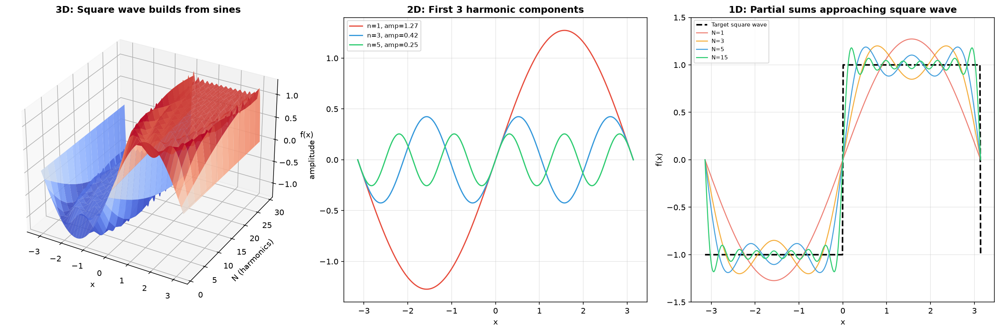
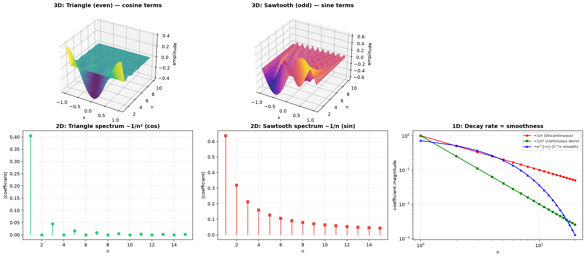
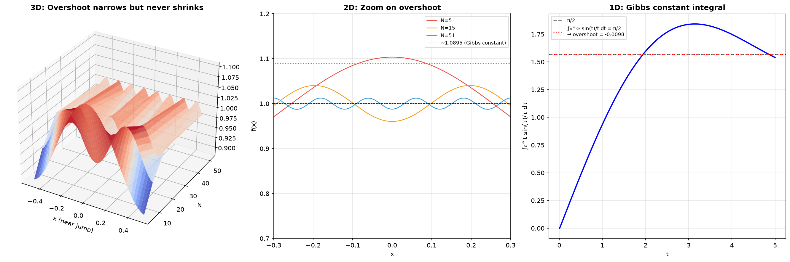
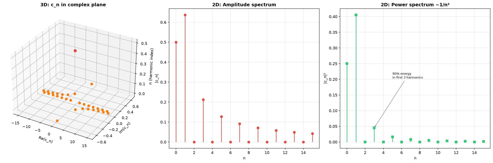
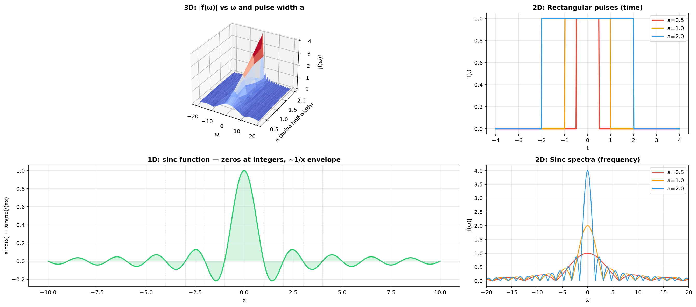
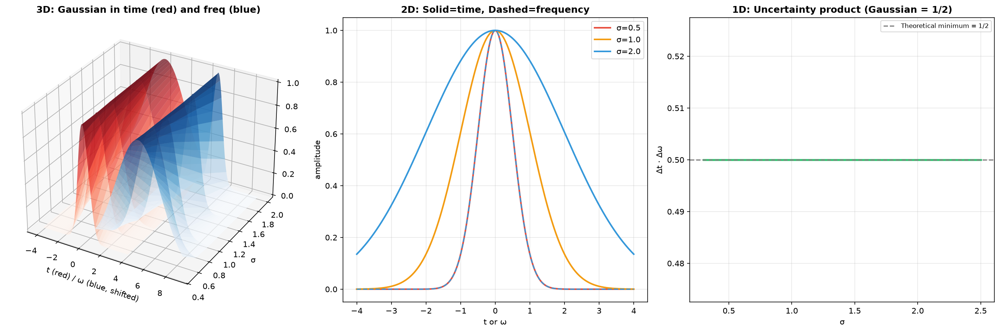
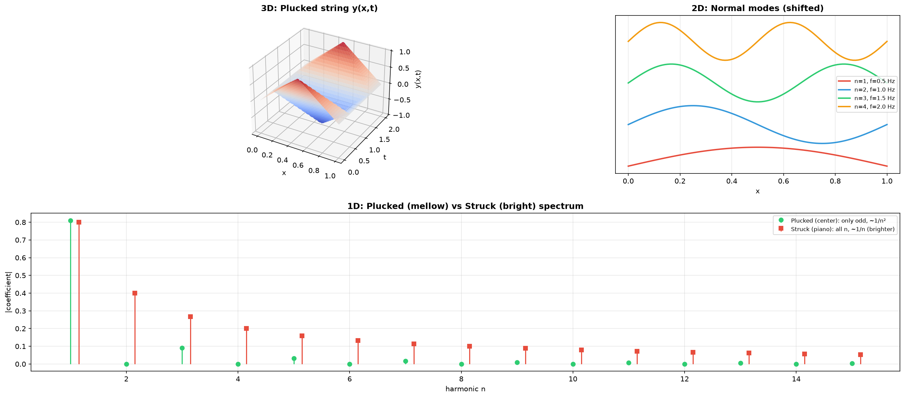
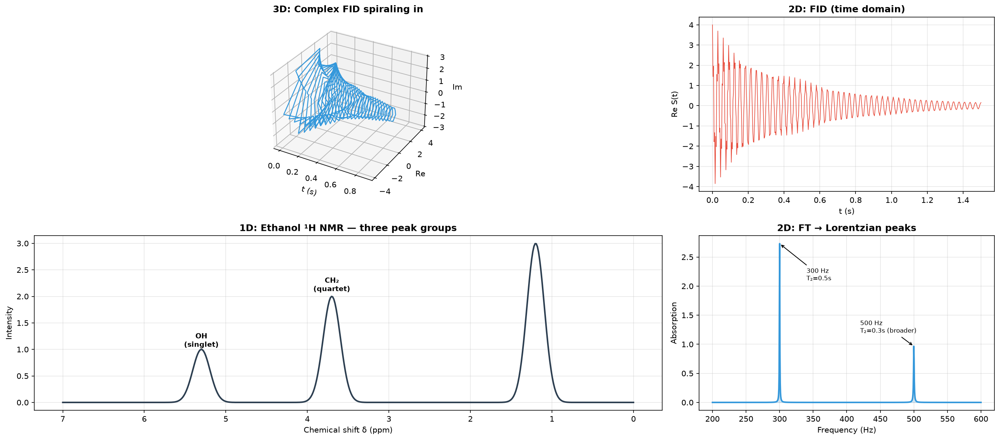

# Session 25E: Fourier Series and Transform — Decomposing the World into Waves

**Phase 2 — Physics·Chemistry Bridge | 60 min**

*Every sound you hear, every radio signal, every NMR spectrum, every heat distribution — they all tell the same story: a complex pattern is just a sum of simple waves. Fourier analysis is the tool that decomposes any function into sines and cosines. Master it, and you can read the hidden frequencies in any signal, solve the wave equation, and understand why a molecule's infrared spectrum looks the way it does.*

**Prerequisites**: Trigonometry (Session 11A). Integrals (Session 16A). Series (Session 18A). Complex numbers (Session 12A1 — helpful for the complex form).

---

## Part A: Fourier Series — Every Periodic Signal Is a Sum of Waves

---

## Example 1: The Idea — One Note vs. a Chord

Strike a single tuning fork: you hear a pure sine wave — one frequency. Strike a piano key: you hear the fundamental pitch PLUS harmonics at integer multiples. The waveform looks jagged, but your ear decomposes it effortlessly into a chord.

**Fourier's insight (1807)**: ANY periodic function $f(t)$ with period $T$ can be written as:

$$
f(t) = \frac{a_0}{2} + \sum_{n=1}^{\infty} \left[ a_n \cos\!\left(\frac{2\pi n t}{T}\right) + b_n \sin\!\left(\frac{2\pi n t}{T}\right) \right]
$$

The numbers $a_n, b_n$ are the **Fourier coefficients** — they tell you "how much" of each frequency is in the signal. The fundamental frequency is $f_0 = 1/T$. The $n$-th harmonic has frequency $n f_0$.



*Graph 25E-1: ⬢ 3D view — the surface $z = \frac{4}{\pi}\sum_{n\text{ odd}}^{N} \frac{1}{n}\sin(nx)$ as $N$ grows from 1 to 15. The flat plateau of the square wave emerges from the accumulated sine waves. ⬡ 2D — the individual sine components shown separately: $n=1$ (red, amplitude $4/\pi$), $n=3$ (blue, amplitude $4/3\pi$), $n=5$ (green, amplitude $4/5\pi$). Each higher harmonic adds a faster wiggle but with smaller amplitude. ⬝ 1D — the partial sums $N=1,3,5,15$ overlaid on the target square wave (dashed). At $N=1$, only a smooth hump. At $N=15$, the approximation is nearly square except for the overshoot at the jump (Gibbs phenomenon).*

---

## Example 2: Computing Fourier Coefficients — The Recipe

Given $f(t)$ with period $T = 2L$ (so the function repeats every $2L$):

$$
a_0 = \frac{1}{L}\int_{-L}^{L} f(t)\,dt \qquad \text{(average value × 2)}
$$

$$
a_n = \frac{1}{L}\int_{-L}^{L} f(t)\cos\!\left(\frac{n\pi t}{L}\right)dt
$$

$$
b_n = \frac{1}{L}\int_{-L}^{L} f(t)\sin\!\left(\frac{n\pi t}{L}\right)dt
$$

**Why cosine and sine?** They are **orthogonal** on $[-L, L]$:
$\int_{-L}^{L} \cos\!\left(\frac{m\pi t}{L}\right)\sin\!\left(\frac{n\pi t}{L}\right)dt = 0$ (always)
$\int_{-L}^{L} \cos\!\left(\frac{m\pi t}{L}\right)\cos\!\left(\frac{n\pi t}{L}\right)dt = \begin{cases} L & m=n\neq 0 \\ 0 & m\neq n \end{cases}$
Same for sine. This orthogonality is what lets us extract each coefficient independently — like separating individual voices from a choir.

---

## Example 3: Square Wave — The Classic First Example

$f(t) = \begin{cases} 0, & -2 \leq t < 0 \\ 1, & 0 \leq t < 2 \end{cases}$, period $T=4$ (so $L=2$).

$a_0 = \frac{1}{2}\int_{-2}^{2} f(t)\,dt = \frac{1}{2}\int_{0}^{2} 1\,dt = 1$.

$a_n = \frac{1}{2}\int_{0}^{2} \cos\!\left(\frac{n\pi t}{2}\right)dt = \frac{1}{2}\left[\frac{2}{n\pi}\sin\!\left(\frac{n\pi t}{2}\right)\right]_0^2 = 0$ (all cosine coefficients vanish — the square wave is an *odd* function after shifting).

$b_n = \frac{1}{2}\int_{0}^{2} \sin\!\left(\frac{n\pi t}{2}\right)dt = \frac{1}{2}\left[-\frac{2}{n\pi}\cos\!\left(\frac{n\pi t}{2}\right)\right]_0^2 = \frac{1}{n\pi}\left[1 - \cos(n\pi)\right]$.

When $n$ is even: $\cos(n\pi)=1$ → $b_n=0$. When $n$ is odd: $\cos(n\pi)=-1$ → $b_n = \frac{2}{n\pi}$.

**Result**: $f(t) = \frac{1}{2} + \frac{2}{\pi}\left(\sin\frac{\pi t}{2} + \frac{1}{3}\sin\frac{3\pi t}{2} + \frac{1}{5}\sin\frac{5\pi t}{2} + \cdots\right)$.

**The amplitudes are $\frac{2}{n\pi}$** — they decay like $1/n$. Odd harmonics only.

---

## Example 4: Even and Odd Shortcuts — Save Half the Work

If $f(t)$ is **even** ($f(-t)=f(t)$): all $b_n=0$. Only cosine series. Compute $a_n = \frac{2}{L}\int_0^L f(t)\cos\frac{n\pi t}{L}dt$.

If $f(t)$ is **odd** ($f(-t)=-f(t)$): all $a_n=0$. Only sine series. Compute $b_n = \frac{2}{L}\int_0^L f(t)\sin\frac{n\pi t}{L}dt$.

**Triangle wave** (even): $f(t) = |t|$ on $[-1,1]$, period 2.
$a_n = \frac{2}{1}\int_0^1 t\cos(n\pi t)\,dt$. Integration by parts gives $a_n = \frac{2}{n^2\pi^2}(\cos(n\pi)-1)$.
$n$ even → $a_n=0$. $n$ odd → $a_n = -\frac{4}{n^2\pi^2}$.
**Amplitudes decay like $1/n^2$** — much faster than the square wave! The triangle wave is smoother, so fewer harmonics are needed.



*Graph 25E-2: ⬢ 3D — the even triangle wave surface (left) and the odd sawtooth surface (right) with their harmonic building blocks. ⬡ 2D frequency spectra: triangle wave (top) has only cosine coefficients decaying as $1/n^2$; sawtooth (bottom) has only sine coefficients decaying as $1/n$. ⬝ 1D — partial sum approximations for each. The smoother the function, the faster the coefficients decay: square (discontinuous) → $1/n$, triangle (continuous, kinked derivative) → $1/n^2$, Gaussian (infinitely smooth) → exponential decay.*

---

## Example 5: The Gibbs Phenomenon — 9% Overshoot That Never Disappears

At a jump discontinuity (like the square wave's edge), the Fourier series overshoots by about **9%** of the jump height — and this overshoot NEVER goes away, no matter how many terms you add. It just gets *narrower*.

For the square wave of height 1: the first maximum of the $N$-term partial sum reaches about $1.0895$. As $N \to \infty$, the overshoot stays at $\approx 8.95\%$.

**Physics consequence**: In a square wave generator circuit, the "ringing" after each transition is the Gibbs phenomenon. In MRI imaging, sharp tissue boundaries can show Gibbs ringing artifacts.



*Graph 25E-3: ⬢ 3D — the partial sum surface near a jump, showing the overshoot peak that narrows but never shrinks in height as $N$ increases. ⬡ 2D — zoomed view of the overshoot for $N=5,15,51$. The peak moves closer to the jump but stays at $\sim1.09$. ⬝ 1D — the universal Gibbs constant: $\frac{1}{\pi}\int_0^\pi \frac{\sin t}{t}dt - \frac{1}{2} \approx 0.0895$. This integral appears in every jump, regardless of the function.*

---

## Example 6: Complex Fourier Series — The Elegant Form

Using Euler's formula $e^{i\theta} = \cos\theta + i\sin\theta$:

$$
f(t) = \sum_{n=-\infty}^{\infty} c_n\, e^{i n \omega_0 t}, \quad \omega_0 = \frac{2\pi}{T}
$$

$$
c_n = \frac{1}{T}\int_{-T/2}^{T/2} f(t)\, e^{-i n \omega_0 t}\,dt
$$

The $c_n$ are complex numbers. $|c_n|$ = amplitude of the $n$-th harmonic. $\arg(c_n)$ = phase shift.

For the square wave: $c_n = \frac{1}{4}\int_0^2 e^{-i n\pi t/2}dt = \frac{i}{2n\pi}(e^{-i n\pi} - 1)$.
$|c_n| = \frac{1}{n\pi}$ for odd $n$, $0$ for even $n$. Matches the real form (with $|c_n| = \frac{1}{2}\sqrt{a_n^2 + b_n^2}$).

**The complex form is the standard in physics, signal processing, and quantum mechanics.** It treats positive and negative frequencies symmetrically.



*Graph 25E-4: ⬢ 3D — the complex Fourier coefficients $c_n$ as points in the complex plane for the square wave. Odd $n$ lie on the imaginary axis with magnitude $1/n\pi$. ⬡ 2D — amplitude spectrum $|c_n|$ (top) and phase spectrum $\arg(c_n)$ (bottom). The amplitude plot is symmetric: $|c_{-n}| = |c_n|$. The phase jumps by $\pi$ at each zero crossing. ⬝ 1D — power spectrum $|c_n|^2 \propto 1/n^2$: the energy in each harmonic decreases quadratically. 90% of the signal energy is in the first 3 odd harmonics.*

---

## Part B: Fourier Transform — From Discrete to Continuous

---

## Example 7: The Limit $T \to \infty$ — From Sum to Integral

When the period $T \to \infty$, the function is no longer periodic — it's a single pulse. The frequency spacing $\Delta\omega = 2\pi/T \to 0$: the discrete spectrum becomes **continuous**.

The Fourier series sum $\sum c_n e^{i n\omega_0 t}$ morphs into the **Fourier integral**:

$$
\hat{f}(\omega) = \mathcal{F}\{f(t)\} = \int_{-\infty}^{\infty} f(t)\, e^{-i\omega t}\,dt \qquad \text{(forward transform)}
$$

$$
f(t) = \mathcal{F}^{-1}\{\hat{f}(\omega)\} = \frac{1}{2\pi}\int_{-\infty}^{\infty} \hat{f}(\omega)\, e^{i\omega t}\,d\omega \qquad \text{(inverse transform)}
$$

**Interpretation**: $\hat{f}(\omega)$ is the **continuous density** of the frequency $\omega$ in the signal $f(t)$. Instead of discrete harmonics at $n\omega_0$, every real frequency $\omega$ contributes with weight $\hat{f}(\omega)\,d\omega$.

---

## Example 8: Rectangular Pulse → Sinc Function

$f(t) = \begin{cases} 1, & |t| \leq a \\ 0, & |t| > a \end{cases}$ (a pulse of width $2a$, height 1).

$\hat{f}(\omega) = \int_{-a}^{a} e^{-i\omega t}\,dt = \left[\frac{e^{-i\omega t}}{-i\omega}\right]_{-a}^{a} = \frac{e^{i\omega a} - e^{-i\omega a}}{i\omega} = \frac{2\sin(\omega a)}{\omega} = 2a\,\text{sinc}\!\left(\frac{\omega a}{\pi}\right)$.

**A narrow pulse in time → broad spectrum in frequency. A broad pulse in time → narrow spectrum in frequency.** This is the **uncertainty principle** of signal processing: $\Delta t \cdot \Delta\omega \geq \frac{1}{2}$.

$2a=1$ ms → main lobe width $\Delta f \approx 1$ kHz. $2a=1$ µs → $\Delta f \approx 1$ MHz. Short pulses need wide bandwidth.



*Graph 25E-5: ⬢ 3D — the time-frequency surface: $z = |\int_{-a}^{a} e^{-i\omega t}dt|$ as both $a$ and $\omega$ vary. The ridge along $\omega=0$ broadens as $a$ shrinks. ⬡ 2D — three pulse widths (a=0.5, 1, 2) in time domain (top) and their corresponding sinc spectra $|2\sin(\omega a)/\omega|$ (bottom). Narrow pulse = wide main lobe; wide pulse = narrow main lobe. ⬝ 1D — the sinc function $\text{sinc}(x) = \sin(\pi x)/(\pi x)$: central peak at 0, zeros at integers, $1/x$ envelope decay.*

---

## Example 9: Gaussian → Gaussian — The Only Self-Fourier Function

$f(t) = e^{-t^2/2\sigma^2}$ (a Gaussian bell curve with standard deviation $\sigma$).

$\hat{f}(\omega) = \int_{-\infty}^{\infty} e^{-t^2/2\sigma^2} e^{-i\omega t}dt = \sqrt{2\pi}\,\sigma\,e^{-\sigma^2\omega^2/2}$.

**The Fourier transform of a Gaussian is another Gaussian!** This is unique — no other shape is its own Fourier transform (up to scaling).

For $\sigma=1$: $\hat{f}(\omega) = \sqrt{2\pi}\,e^{-\omega^2/2}$. The product of time-width and frequency-width: $\sigma_t \cdot \sigma_\omega = 1$. The Gaussian saturates the uncertainty principle — it has the minimum possible time-frequency product.

**Physics**: The ground state wavefunction of a quantum harmonic oscillator is a Gaussian. Its momentum-space wavefunction (Fourier transform) is also a Gaussian.



*Graph 25E-6: ⬢ 3D — the Gaussian in time (red, $t$-axis) and its Fourier transform in frequency (blue, $\omega$-axis). Both are Gaussians. As the time Gaussian narrows (smaller $\sigma$), the frequency Gaussian widens, and vice versa. ⬡ 2D — three $\sigma$ values (0.5, 1, 2): time domain (top row), frequency domain (bottom row). The areas under all curves are conserved. ⬝ 1D — the uncertainty product $\Delta t \cdot \Delta\omega$ for each $\sigma$. The Gaussian achieves the theoretical minimum of $1/2$. All other pulse shapes (square, triangle, exponential) have larger products.*

---

## Example 10: Key Fourier Transform Properties

| Property | Time Domain $f(t)$ | Frequency Domain $\hat{f}(\omega)$ |
|:---|:---|:---|
| Linearity | $af(t) + bg(t)$ | $a\hat{f}(\omega) + b\hat{g}(\omega)$ |
| Time scaling | $f(at)$ | $\frac{1}{|a|}\hat{f}(\omega/a)$ |
| Time shift | $f(t - t_0)$ | $e^{-i\omega t_0}\hat{f}(\omega)$ |
| Frequency shift | $e^{i\omega_0 t}f(t)$ | $\hat{f}(\omega - \omega_0)$ |
| Derivative | $f'(t)$ | $i\omega\,\hat{f}(\omega)$ |
| Convolution | $(f * g)(t)$ | $\hat{f}(\omega)\,\hat{g}(\omega)$ |
| Parseval | $\int |f(t)|^2 dt$ | $\frac{1}{2\pi}\int |\hat{f}(\omega)|^2 d\omega$ |

The **derivative property** is the killer app: differentiation in time becomes **multiplication by $i\omega$** in frequency. This turns differential equations into algebraic equations.

The **convolution property**: blurring in time = multiplying spectra. Filtering in frequency = convolving in time.

---

## Part C: Physics and Chemistry Bridges

---

## Example 11: The Wave Equation Solved by Fourier

The wave equation for a vibrating string of length $L$ fixed at both ends:

$\frac{\partial^2 y}{\partial t^2} = c^2 \frac{\partial^2 y}{\partial x^2}$, with $y(0,t)=y(L,t)=0$.

Fourier's method (1807 — this is why he invented the series!):

**Step 1 — Separate**: Assume $y(x,t) = X(x)T(t)$. Get $\frac{X''}{X} = \frac{T''}{c^2 T} = -\lambda$.

**Step 2 — Spatial problem**: $X'' + \lambda X = 0$, $X(0)=X(L)=0$. Solutions: $\lambda_n = \left(\frac{n\pi}{L}\right)^2$, $X_n(x) = \sin\!\left(\frac{n\pi x}{L}\right)$.

**Step 3 — Temporal problem**: $T_n'' + c^2\lambda_n T_n = 0$. $T_n(t) = A_n\cos(\omega_n t) + B_n\sin(\omega_n t)$, where $\omega_n = \frac{n\pi c}{L}$.

**Step 4 — General solution**: $y(x,t) = \sum_{n=1}^{\infty} \sin\!\left(\frac{n\pi x}{L}\right)\left[A_n\cos(\omega_n t) + B_n\sin(\omega_n t)\right]$.

The coefficients $A_n, B_n$ come from the **Fourier sine series** of the initial shape $y(x,0)$ and initial velocity $y_t(x,0)$.

**Physical meaning**: The string vibrates as a sum of **normal modes**. Mode $n$ has $n$ half-wavelengths. The $n$-th harmonic frequency is $f_n = n \cdot \frac{c}{2L}$. This is why a guitar string sounds the way it does — the Fourier coefficients are the timbre.



*Graph 25E-7: ⬢ 3D — a plucked string evolving in time: $y(x,t)$ as a surface over the $(x,t)$ plane. The initial triangular shape (a pluck) is a sum of sine modes. ⬡ 2D — the first four normal modes $n=1,2,3,4$ (sine shapes) with their frequencies $f_n = n f_1$. Mode 1 = fundamental (the pitch you hear), mode 2 = octave, mode 3 = octave + fifth. ⬝ 1D — Fourier sine coefficients $b_n$ for a plucked string (plucked at center: only odd $n$, $b_n \propto 1/n^2$) vs. struck string (piano hammer: all $n$ present, richer sound).*

---

## Example 12: NMR Spectroscopy — Free Induction Decay → Spectrum

In NMR (nuclear magnetic resonance), a sample is hit with a radio-frequency pulse. The nuclei precess at their characteristic Larmor frequencies and emit a decaying signal called the **Free Induction Decay (FID)**:

$S(t) = \sum_j A_j e^{-t/T_{2j}} e^{i\omega_j t}$ (sum of decaying complex exponentials).

The chemist's question: "What frequencies $\omega_j$ are present, and with what amplitudes $A_j$?"

**The answer is the Fourier transform**: $\hat{S}(\omega) = \int_0^\infty S(t)\,e^{-i\omega t}dt$.

Each nucleus contributes a **Lorentzian peak** at $\omega_j$ with width $1/T_{2j}$:
$\hat{S}(\omega) \approx \sum_j \frac{A_j}{1/T_{2j} + i(\omega - \omega_j)}$.

The real part is an **absorption lineshape**: $A_j \frac{1/T_{2j}}{(1/T_{2j})^2 + (\omega - \omega_j)^2}$ — a peak centered at $\omega_j$ with half-width $1/T_{2j}$.

**The NMR spectrometer literally performs a Fourier transform** (via FFT algorithm) to convert the time-domain FID into the frequency-domain spectrum that chemists interpret. Every peak's position = chemical environment. Every peak's area = number of equivalent nuclei. Every peak's width = molecular dynamics.



*Graph 25E-8: ⬢ 3D — the complex FID signal spiraling in (real part, imaginary part, time). The envelope decays as $e^{-t/T_2}$. ⬡ 2D — FID signal (top, time domain) and its Fourier transform (bottom, frequency domain). A single decaying exponential in time becomes a Lorentzian peak in frequency. Two close frequencies produce a beat pattern in the FID and two resolved (or overlapping) peaks in the spectrum. ⬝ 1D — ethanol's $^1$H NMR spectrum: three peak groups (CH$_3$ triplet, CH$_2$ quartet, OH singlet) at different chemical shifts. The splitting patterns come from $J$-coupling — another Fourier phenomenon.*

---

## Example 13: X-ray Crystallography — From Diffraction Pattern to Electron Density

X-rays scattered by a crystal form a diffraction pattern — bright spots at specific angles. The intensity of each spot $(h,k,l)$ is proportional to $|F_{hkl}|^2$, where the **structure factor** is:

$F_{hkl} = \sum_j f_j\, e^{2\pi i(hx_j + ky_j + lz_j)}$.

This is a **3D discrete Fourier transform** of the electron density! The inverse transform reconstructs the electron density map:

$\rho(x,y,z) = \frac{1}{V}\sum_h\sum_k\sum_l F_{hkl}\, e^{-2\pi i(hx + ky + lz)}$.

The "phase problem": we measure $|F_{hkl}|$ (intensity) but lose the phase of $F_{hkl}$. Recovering the phase is the central challenge of crystallography — and it's a Fourier problem.

> **Up to here**: Fourier series decomposes periodic functions into discrete harmonics. Coefficients from orthogonality integrals. Square wave → $1/n$ decay. Triangle wave → $1/n^2$ decay. Gibbs overshoot → 9%. Complex form: $c_n = \frac{1}{T}\int f e^{-i n\omega_0 t}$. Fourier transform generalizes to non-periodic: $\hat{f}(\omega) = \int f(t)e^{-i\omega t}dt$. Pulse → sinc. Gaussian → Gaussian. Derivative → $i\omega\hat{f}$. Physics: vibrating string normal modes = Fourier sine series. Chemistry: NMR FID → spectrum, X-ray diffraction → electron density map.

---

## Common Mistakes

### Mistake 1: Wrong integration limits for the period

**Wrong**: Integrating from $0$ to $T$ when the function definition uses $[-L, L]$. **Right**: The period must match. If $f$ is defined on $[-L, L]$ with period $2L$, integrate over $[-L, L]$. If defined on $[0, T]$, integrate over $[0, T]$.

### Mistake 2: Forgetting to halve $a_0$ in the series

**Wrong**: Writing $f(t) = a_0 + \sum(a_n\cos + b_n\sin)$. **Right**: The constant term is $\frac{a_0}{2}$, where $a_0 = \frac{1}{L}\int_{-L}^{L} f(t)dt$. The formula with $a_0/2$ makes the coefficient formula for $a_0$ match the pattern for $a_n$ (with $n=0$ in the cosine formula).

### Mistake 3: Confusing Fourier series (periodic, discrete frequencies) with Fourier transform (non-periodic, continuous frequencies)

Periodic $f$ → Fourier SERIES (discrete $n\omega_0$). Aperiodic $f$ → Fourier TRANSFORM (continuous $\omega$). The period $T \to \infty$ connects them.

### Mistake 4: Mixing up the forward and inverse transform normalization

$\hat{f}(\omega) = \int f(t)e^{-i\omega t}dt$ (no $1/2\pi$). $f(t) = \frac{1}{2\pi}\int \hat{f}(\omega)e^{i\omega t}d\omega$ (has $1/2\pi$). Some textbooks put $1/\sqrt{2\pi}$ on both. Know your convention.

---

## What We Just Did

```
(1) Fourier Series: f(t) = a₀/2 + Σ[a_n cos(nω₀t) + b_n sin(nω₀t)].
    Coefficients via orthogonality integrals. Even f → cosine only. Odd f → sine only.
    Square wave: a_n=0, b_n=2/(nπ) for odd n. Coefficients decay as 1/n (discontinuous).
    Triangle wave: a_n=4/(n²π²) for odd n. Coefficients decay as 1/n² (continuous derivative).
    Gibbs phenomenon: ~9% overshoot at jumps, never disappears.

(2) Complex form: f(t) = Σ c_n e^{i n ω₀ t}, c_n = (1/T)∫ f e^{-i n ω₀ t} dt.
    Amplitude spectrum |c_n|. Phase spectrum arg(c_n). Power spectrum |c_n|².

(3) Fourier Transform: \hat{f}(ω) = ∫ f(t) e^{-iωt} dt (non-periodic → continuous spectrum).
    Pulse → sinc: narrow in time = broad in frequency.
    Gaussian → Gaussian: the only self-Fourier function. Minimizes Δt·Δω.
    Derivative: f'(t) → iω \hat{f}(ω). Convolution: f*g → \hat{f}·\hat{g}.

(4) Physics/Chemistry Bridges:
    Vibrating string: Fourier sine series = normal modes. Each mode n has frequency n·c/(2L).
    NMR: FID S(t) = Σ A_j e^{-t/T₂} e^{iω_j t} → FT → Lorentzian peaks at ω_j.
    X-ray crystallography: structure factors F_{hkl} = 3D FT of electron density.
```

---

## Practice 1

Compute the Fourier sine series for $f(t) = t$ on $[0, 1]$ with period $T=2$ (odd extension to $[-1, 1]$). Find the first three nonzero coefficients.

→ Reference: **Example 2, 3**

> Solutions: [Solutions](solutions/25E-solutions.md#practice-1)

---

## Practice 2

$f(t) = |t|$ on $[-1, 1]$, period $T=2$. This is an even function — use the cosine series shortcut. Compute $a_0, a_1, a_2, a_3$.

→ Reference: **Example 4**

> Solutions: [Solutions](solutions/25E-solutions.md#practice-2)

---

## Practice 3

Find the Fourier transform of the one-sided exponential decay: $f(t) = \begin{cases} e^{-at}, & t \geq 0 \\ 0, & t < 0 \end{cases}$, with $a > 0$. Sketch $|\hat{f}(\omega)|$.

→ Reference: **Example 8**

> Solutions: [Solutions](solutions/25E-solutions.md#practice-3)

---

## Practice 4

A piano string of length $L=0.65$ m, wave speed $c=330$ m/s, is struck at $t=0$ with initial shape $y(x,0) = 0.01\sin(\pi x/L)$ (pure fundamental) and zero initial velocity. Find $y(x,t)$ for all $t$. What is the fundamental frequency in Hz?

→ Reference: **Example 11**

> Solutions: [Solutions](solutions/25E-solutions.md#practice-4)

---

## Practice 5: Real Battle — NMR Identification

An NMR FID signal is measured: $S(t) = 3e^{-t/0.5}e^{i\cdot 2\pi\cdot 300\,t} + 1e^{-t/0.3}e^{i\cdot 2\pi\cdot 500\,t}$ (t in seconds, frequencies in Hz). (a) Write the Fourier transform $\hat{S}(\omega)$ in terms of Lorentzians. (b) Sketch the real-part spectrum. Label peak positions, heights, and widths. (c) Which nucleus has the longer $T_2$ relaxation time? (d) Bonus: if the two peaks were at 300 Hz and 305 Hz instead, would the FID show beats? At what beat frequency?

> Solutions: [Solutions](solutions/25E-solutions.md#practice-5)

---

## Basic Drill (10)

**D1.** Write the Fourier series formula for period $2L$. Define $a_0, a_n, b_n$.
**D2.** Is $f(t)=t^2$ on $[-1,1]$ even, odd, or neither? Which coefficients are zero?
**D3.** Compute $b_1$ for $f(t)=1$ on $[0,\pi]$, period $2\pi$.
**D4.** Square wave, period $2\pi$: $f(t)=1$ on $[0,\pi]$, $0$ on $[-\pi,0]$. Find $a_0$.
**D5.** Verify orthogonality: $\int_{-\pi}^{\pi} \cos(2t)\sin(3t)\,dt = 0$.
**D6.** Write the complex exponential $e^{i3t}$ as a cosine/sine combination.
**D7.** Compute $\hat{f}(\omega)$ for $f(t)=\delta(t)$ (Dirac delta). Hint: $\int \delta(t)g(t)dt = g(0)$.
**D8.** If $f(t)$ has Fourier transform $\hat{f}(\omega)$, what is the FT of $f(t-2)$?
**D9.** Parseval: The energy of a square wave (height 1, period $2\pi$) in one period is $\pi$. Verify that $\sum_{n\text{ odd}} \frac{4}{n^2\pi} = \pi$ (this is $\pi^2/8 = 1.2337\ldots$ times a factor).
**D10.** A function is band-limited to $|\omega| \leq B$. What is the minimum sampling rate to reconstruct it?

> Solutions: [Solutions](solutions/25E-solutions.md#basic-drill)

---

## Advanced Drill (10)

**A1.** Compute the full complex Fourier series ($c_n$ for all integer $n$) of the sawtooth wave $f(t)=t$ on $[-\pi,\pi]$, period $2\pi$. Plot $|c_n|$ vs $n$.
**A2.** Prove Parseval's theorem for Fourier series: $\frac{1}{T}\int_{-T/2}^{T/2}|f(t)|^2dt = \sum_{n=-\infty}^{\infty}|c_n|^2$. Apply to the square wave to find $\sum_{n\text{ odd}} 1/n^2 = \pi^2/8$.
**A3.** A function $f(t)$ has Fourier transform $\hat{f}(\omega)$. Show that the FT of its derivative $f'(t)$ is $i\omega\hat{f}(\omega)$. Use integration by parts, assuming $f(\pm\infty)=0$.
**A4.** Compute the Fourier transform of the two-sided exponential $f(t)=e^{-a|t|}$ ($a>0$). This is a **Lorentzian** in frequency — verify.
**A5.** The **Dirac comb** is $\text{Ш}_T(t) = \sum_{n=-\infty}^{\infty} \delta(t - nT)$. Show that its Fourier series (yes, it's periodic!) has all $c_n = 1/T$. Its Fourier transform is another Dirac comb with spacing $2\pi/T$. This is the math behind aliasing and sampling.
**A6.** Prove the convolution theorem: $\mathcal{F}\{f * g\} = \hat{f} \cdot \hat{g}$, where $(f*g)(t) = \int_{-\infty}^{\infty} f(\tau)g(t-\tau)d\tau$. Swap the integration order.
**A7.** An NMR peak is a Lorentzian $L(\omega) = \frac{A}{1/T_2 + i(\omega - \omega_0)}$. Show that its magnitude $|L(\omega)|$ has half-maximum at $|\omega - \omega_0| = 1/T_2$. The full width at half maximum (FWHM) is $2/T_2$.
**A8.** Solve the heat equation $\frac{\partial u}{\partial t} = \alpha \frac{\partial^2 u}{\partial x^2}$ on $[0, L]$ with $u(0,t)=u(L,t)=0$ and initial condition $u(x,0) = f(x)$. Use Fourier sine series: write $u(x,t) = \sum b_n(t)\sin(n\pi x/L)$ and find ODEs for $b_n(t)$.
**A9.** (Proof reading) "The Fourier transform of a real function is always real." Critique: when is $\hat{f}(\omega)$ real? When is it purely imaginary? State the symmetry condition.
**A10.** The **uncertainty principle**: Define $\Delta t^2 = \frac{\int t^2|f(t)|^2 dt}{\int |f(t)|^2 dt}$ and similarly for $\Delta\omega$. Prove the **Heisenberg inequality** for Fourier transforms: $\Delta t \cdot \Delta\omega \geq \frac{1}{2}$. Show the Gaussian saturates it.

> Solutions: [Solutions](solutions/25E-solutions.md#advanced-drill)

---

## Today's Procedure

```
Step 1: For PERIODIC f with period 2L: Fourier SERIES.
        a_n = (1/L)∫f(t)cos(nπt/L)dt, b_n = (1/L)∫f(t)sin(nπt/L)dt.
        Even f → b_n=0. Odd f → a_n=0. Decay rate → smoothness.
        Complex: c_n = (1/T)∫f(t)e^{-i n ω₀ t}dt, f(t) = Σc_n e^{i n ω₀ t}.

Step 2: For APERIODIC f: Fourier TRANSFORM.
        \hat{f}(ω) = ∫f(t)e^{-iωt}dt,  f(t) = (1/2π)∫\hat{f}(ω)e^{iωt}dω.
        Properties: derivative→iω, shift→phase, convolution→product.
        Pulse shapes: rect→sinc, Gaussian→Gaussian, exponential→Lorentzian.

Step 3: Applications.
        Wave equation → Fourier sine series → normal modes.
        NMR FID → FT → chemical shift spectrum.
        X-ray diffraction → inverse 3D FT → electron density map.
```

---

## How to Read These Symbols

| Symbol | Reads as | Meaning |
|:---:|:---:|------|
| $a_n, b_n$ | "a n, b n" / "Fourier coefficients" | amplitudes of cosine (a_n) and sine (b_n) harmonics |
| $\sum_{n=1}^{\infty}$ | "sum from n equals 1 to infinity" | infinite series — add contributions from all harmonics |
| $\omega$ | "omega" / "angular frequency" | ω = 2πf — radians per second |
| $\omega_0$ | "omega zero" / "fundamental frequency" | ω₀ = 2π/T — fundamental angular frequency |
| $\hat{f}(\omega)$ | "f hat of omega" | Fourier transform — frequency-domain representation |
| $\mathcal{F}\{f(t)\}$ | "script F of f of t" / "Fourier transform of f" | Fourier transform operator |
| $c_n$ | "c n" / "complex Fourier coefficient" | c_n = (1/T)∫ f e^{-i n ω₀ t} dt — complex form |
| $\operatorname{sinc}(x)$ | "sinc of x" / "sink of x" | sin(πx)/(πx) — Fourier transform of a rectangular pulse |
| $\delta(t)$ | "delta of t" / "Dirac delta" | unit impulse — zero everywhere except t=0, integral = 1 |
| $f * g$ | "f convolved with g" / "convolution" | (f∗g)(t) = ∫ f(τ)g(t−τ)dτ — FT converts convolution to multiplication |
| Parseval | "Parseval's theorem" | total energy in time domain = total energy in frequency domain |
| FWHM | "F W H M" / "full width at half maximum" | peak width measured at half its maximum height |
| $\Delta t \cdot \Delta\omega \geq \frac{1}{2}$ | "delta t times delta omega greater than or equal to one-half" | time-frequency uncertainty principle — Gaussian saturates this bound |


---

## Terminology

| What we call it | Math term | Physics/Chemistry term |
|:---:|:---:|:---:|
| sum of sine/cosine harmonics | Fourier series | harmonic decomposition |
| $a_n, b_n$ | Fourier coefficients | amplitudes of cosine/sine components |
| $c_n = \frac{1}{T}\int f e^{-i n\omega_0 t}dt$ | complex Fourier coefficient | complex amplitude (magnitude + phase) |
| orthogonality of sines/cosines | $\int \cos(mx)\sin(nx)dx = 0$ | basis functions are independent |
| $1/n$ decay of coefficients | slow convergence | discontinuous function (square wave) |
| $1/n^2$ decay | fast convergence | continuous function (triangle wave) |
| $\sim9\%$ overshoot at jumps | Gibbs phenomenon | ringing artifact |
| $\hat{f}(\omega) = \int f(t)e^{-i\omega t}dt$ | Fourier transform | frequency spectrum |
| $\text{sinc}(x) = \sin(\pi x)/(\pi x)$ | sinc function | diffraction pattern of a slit |
| $\Delta t \cdot \Delta\omega \geq 1/2$ | uncertainty principle | time-bandwidth product |
| $f' \leftrightarrow i\omega\hat{f}$ | derivative property | — |
| $f*g \leftrightarrow \hat{f}\cdot\hat{g}$ | convolution theorem | filtering = spectral multiplication |
| Lorentzian $1/(a^2+(\omega-\omega_0)^2)$ | Cauchy distribution | NMR/IR absorption lineshape |
