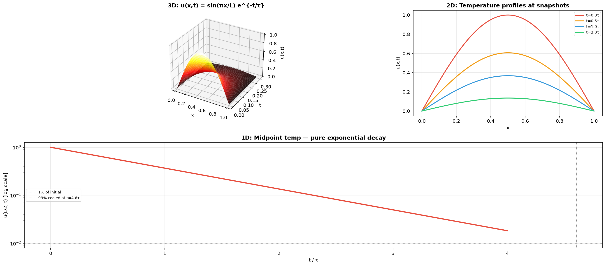
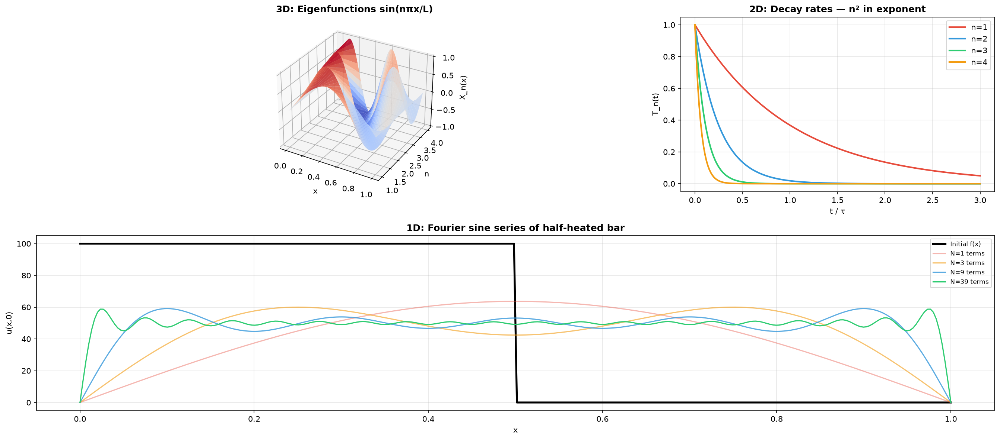
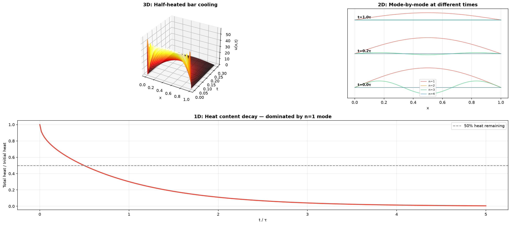
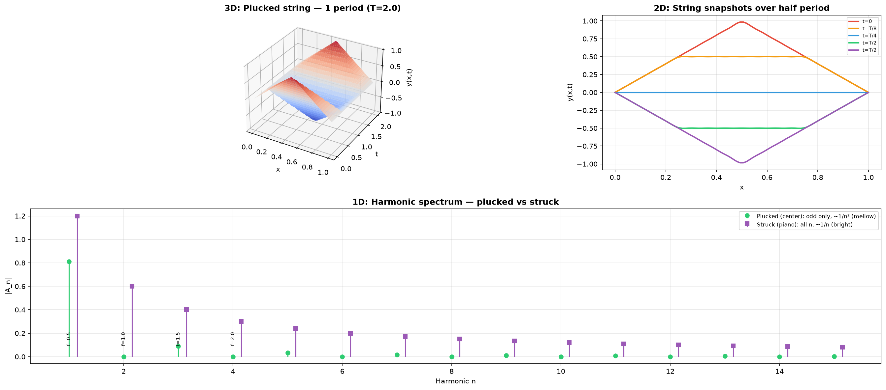
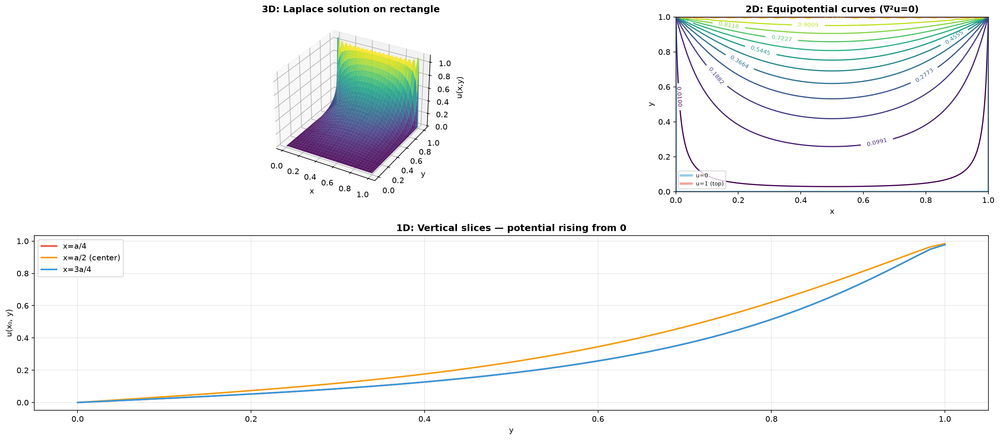
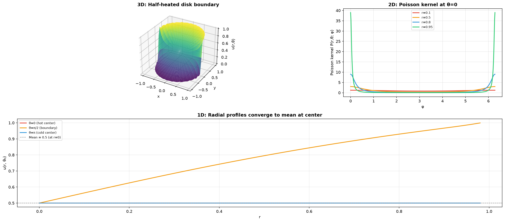

# Session 25F: PDE Separation of Variables — The Heat, Wave, and Laplace Equations

**Phase 2 — Physics·Chemistry Bridge | 45 min**

*A metal bar cooling from a flame. A guitar string plucked and released. The steady electric potential around a charged sphere. These three phenomena — heat diffusion, wave propagation, and static equilibrium — are governed by three partial differential equations (PDEs) that share a single solution method: **separation of variables**. Assume the solution splits into a product $u(x,t)=X(x)T(t)$, and the PDE shatters into ordinary differential equations you already know how to solve. This session teaches you the pattern. Once you've seen it, you'll recognize it in every corner of physics and chemistry.*

**Prerequisites**: ODEs — 2nd order homogeneous (Session 19D). Fourier series (Session 25E — can be read concurrently). Partial derivatives (Session 23B).

---

## Part A: The Heat Equation — Diffusion Smooths Everything

---

## Example 1: The Three Great PDEs — A Preview

| Equation | Form | What it describes | The "separation constant" |
|:---|:---:|------|:---:|
| **Heat** | $\frac{\partial u}{\partial t} = \alpha\frac{\partial^2 u}{\partial x^2}$ | Temperature, diffusion, random walks | $-\lambda$ (decay) |
| **Wave** | $\frac{\partial^2 u}{\partial t^2} = c^2\frac{\partial^2 u}{\partial x^2}$ | Strings, sound, light, water waves | $-\lambda$ (oscillation) |
| **Laplace** | $\frac{\partial^2 u}{\partial x^2} + \frac{\partial^2 u}{\partial y^2} = 0$ | Steady-state heat, electrostatics, fluid flow | $+\lambda$ or $-\lambda$ |

All three are **linear** and **homogeneous**. The boundary conditions determine whether the separation constant produces sines, cosines, exponentials, or hyperbolic functions.

---

## Example 2: The Hot Bar — Set Up the Problem

A metal bar of length $L$ has its ends held at $0^\circ$C (ice water). At $t=0$, the temperature profile is some known function $u(x,0) = f(x)$.

**The PDE**: $\frac{\partial u}{\partial t} = \alpha \frac{\partial^2 u}{\partial x^2}$, where $\alpha$ = thermal diffusivity.

**Boundary conditions**: $u(0,t) = 0$, $u(L,t) = 0$ (ends at zero temperature, for all $t > 0$).

**Initial condition**: $u(x,0) = f(x)$ (the starting temperature profile — a single snapshot).



*Graph 25F-1: ⬢ 3D — the surface $u(x,t)$ for a bar initially at $f(x) = \sin(\pi x/L)$ (a single hot spot in the middle). The temperature decays exponentially while keeping the sine shape: $u(x,t) = e^{-\alpha\pi^2 t/L^2}\sin(\pi x/L)$. ⬡ 2D — snapshots of the temperature profile at $t = 0, 0.5\tau, \tau, 2\tau$ (where $\tau = L^2/\alpha\pi^2$ is the decay time constant). The shape stays the same — only the amplitude shrinks. ⬝ 1D — temperature at the midpoint $x = L/2$ vs. time. Pure exponential decay: $u(L/2, t) = e^{-t/\tau}$. The bar "forgets" its initial heat with characteristic time $\tau \propto L^2/\alpha$. Thicker bars ($L$ large) cool MUCH slower (quadratic dependence).*

---

## Example 3: Separation of Variables — The Engine That Solves Everything

**Step 1 — Assume product form**: $u(x,t) = X(x) \cdot T(t)$. Plug into the heat equation:

$X(x)T'(t) = \alpha X''(x)T(t)$.

**Step 2 — Separate the variables** (divide both sides by $\alpha XT$):

$\frac{T'(t)}{\alpha T(t)} = \frac{X''(x)}{X(x)}$.

**The key insight**: The left side depends ONLY on $t$. The right side depends ONLY on $x$. The only way they can be equal for ALL $x$ and ALL $t$ is if both equal the same **constant**. Call it $-\lambda$ (negative because we expect decay in time):

$\frac{T'}{\alpha T} = \frac{X''}{X} = -\lambda$.

**Step 3 — Two ODEs appear**:

Spatial ODE: $X''(x) + \lambda X(x) = 0$, with boundary conditions $X(0)=0$, $X(L)=0$.

Temporal ODE: $T'(t) + \alpha\lambda T(t) = 0$.

**Step 4 — Solve the spatial problem** (this is the eigenvalue problem):

$X'' + \lambda X = 0$, $X(0)=X(L)=0$. This is a **boundary value problem**.

- If $\lambda < 0$: $X = A\cosh(\sqrt{-\lambda}\,x) + B\sinh(\sqrt{-\lambda}\,x)$. $X(0)=0 \Rightarrow A=0$. $X(L)=0 \Rightarrow B=0$. **Trivial only.**

- If $\lambda = 0$: $X = Ax + B$. $X(0)=0 \Rightarrow B=0$. $X(L)=0 \Rightarrow A=0$. **Trivial only.**

- If $\lambda > 0$: $X = A\cos(\sqrt{\lambda}\,x) + B\sin(\sqrt{\lambda}\,x)$. $X(0)=0 \Rightarrow A=0$. $X(L)=0 \Rightarrow \sin(\sqrt{\lambda}L)=0$.

$\sqrt{\lambda_n}L = n\pi \Rightarrow \lambda_n = \left(\frac{n\pi}{L}\right)^2$, $n = 1, 2, 3, \ldots$

The **eigenfunctions** are $X_n(x) = \sin\!\left(\frac{n\pi x}{L}\right)$. The **eigenvalues** are $\lambda_n = (n\pi/L)^2$.

**Step 5 — Solve the temporal ODE** for each $n$:

$T_n'(t) + \alpha\lambda_n T_n(t) = 0 \Rightarrow T_n(t) = C_n e^{-\alpha\lambda_n t}$.

**Step 6 — Build the general solution** (superposition of all modes):

$u(x,t) = \sum_{n=1}^{\infty} B_n \sin\!\left(\frac{n\pi x}{L}\right) e^{-\alpha (n\pi/L)^2 t}$.

The higher the mode number $n$, the faster it decays ($n^2$ in the exponent!). The fundamental mode ($n=1$) lasts the longest — eventually, any initial shape decays into a pure sine.



*Graph 25F-2: ⬢ 3D — the first four eigenfunctions $X_n(x) = \sin(n\pi x/L)$ extended into a surface over $(x, n)$. Each mode has $n$ half-sine arches. ⬡ 2D — the decay rates of each mode: $T_n(t) = e^{-\alpha n^2\pi^2 t/L^2}$ for $n=1,2,3,4$. Mode 1 (red, slowest decay) dominates at late times; mode 4 (yellow) vanishes quickly. ⬝ 1D — an arbitrary initial shape $f(x)$ (top, black) decomposed into its Fourier sine modes (colored components). The heat equation applies a different exponential decay factor to each mode. The "rough" high-$n$ components vanish first — diffusion is a low-pass filter that smooths everything.*

---

## Example 4: Putting It All Together — From Initial Shape to Solution

$f(x) = 100^\circ$C for $0 < x < L/2$, $0^\circ$C for $L/2 < x < L$. (Bar heated on left half, cold on right half, ends in ice.)

The coefficient $B_n$ is the Fourier sine coefficient of $f(x)$:

$B_n = \frac{2}{L}\int_0^L f(x)\sin\!\left(\frac{n\pi x}{L}\right)dx = \frac{2}{L}\int_0^{L/2} 100\sin\!\left(\frac{n\pi x}{L}\right)dx$.

$B_n = \frac{200}{n\pi}\left[1 - \cos\!\left(\frac{n\pi}{2}\right)\right]$.

$n=1$: $B_1 = 200/\pi \approx 63.7$. $n=2$: $B_2 = 400/2\pi = 63.7$. $n=3$: $B_3 = 200/3\pi \approx 21.2$.

The full solution: $u(x,t) = \sum_{n=1}^{\infty} \frac{200}{n\pi}\left[1 - \cos\!\left(\frac{n\pi}{2}\right)\right] \sin\!\left(\frac{n\pi x}{L}\right) e^{-\alpha (n\pi/L)^2 t}$.

At late times ($t \gg L^2/\alpha\pi^2$): only the $n=1$ term survives: $u(x,t) \approx \frac{200}{\pi}\sin\!\left(\frac{\pi x}{L}\right)e^{-\alpha\pi^2 t/L^2}$.

---

## Example 5: Temperature Evolution — Visualizing the Solution

At $t=0$: a step function at $L/2$. At $t=0.1\tau$: the step is already blurring. At $t=\tau$: nearly a pure sine. At $t=3\tau$: barely warm.

**Physical insight**: The decay time for mode $n$ is $\tau_n = \frac{L^2}{\alpha n^2\pi^2}$. The fundamental mode ($n=1$) has $\tau_1 = L^2/(\alpha\pi^2)$. The $n=2$ mode decays 4× faster; $n=3$ decays 9× faster. **Diffusion is a rapid destroyer of detail** — rough features vanish almost instantly, leaving only the smoothest possible shape.



*Graph 25F-3: ⬢ 3D — the solution surface $u(x,t)$ for the half-heated bar. The initial sharp step at $x=L/2$ instantly rounds off as high-$n$ modes die. ⬡ 2D — contribution of each mode $n=1,2,3,4$ at three different times: $t=0$ (all modes present), $t=0.2\tau$ (higher modes already weak), $t=\tau$ (mode 1 dominates). ⬝ 1D — total heat content $\int_0^L u(x,t)dx$ vs. time. Energy decays exponentially as heat flows out both ends. The rate is set by the fundamental mode — you cannot cool a bar faster than $e^{-\alpha\pi^2 t/L^2}$.*

---

## Part B: The Wave Equation — Oscillation Without Diffusion

---

## Example 6: The Plucked String

$\frac{\partial^2 y}{\partial t^2} = c^2 \frac{\partial^2 y}{\partial x^2}$. Fixed ends: $y(0,t)=y(L,t)=0$. Initial shape $y(x,0)=f(x)$, initial velocity $y_t(x,0)=g(x)$.

Separate: $y(x,t) = X(x)T(t)$.

$\frac{T''}{c^2 T} = \frac{X''}{X} = -\lambda$.

Spatial problem: SAME as the heat equation — $X_n(x) = \sin(n\pi x/L)$, $\lambda_n = (n\pi/L)^2$.

**The difference is the temporal ODE**: $T_n'' + c^2\lambda_n T_n = 0$, which is $T_n'' + \omega_n^2 T_n = 0$ with $\omega_n = \frac{n\pi c}{L}$.

This is the **harmonic oscillator equation** (Session 19D)! Solutions are sines and cosines — NOT decaying exponentials:

$T_n(t) = A_n\cos(\omega_n t) + B_n\sin(\omega_n t)$.

**General solution**: $y(x,t) = \sum_{n=1}^{\infty} \sin\!\left(\frac{n\pi x}{L}\right)\left[A_n\cos(\omega_n t) + B_n\sin(\omega_n t)\right]$.

$A_n$ = Fourier sine coefficient of the initial shape $f(x)$. $B_n = \frac{2}{\omega_n L}\int_0^L g(x)\sin\!\left(\frac{n\pi x}{L}\right)dx$ = Fourier coefficient of initial velocity divided by frequency.

**Physical meaning**: The string vibrations are a **superposition of standing waves** (normal modes). Mode $n$ vibrates at frequency $f_n = \omega_n/2\pi = n\cdot c/(2L)$. The fundamental is $f_1 = c/(2L)$ — this is the pitch you hear. The coefficients $A_n, B_n$ determine the **timbre** — why a piano and a guitar playing the same note sound different.



*Graph 25F-4: ⬢ 3D — the surface $y(x,t)$ for a string plucked at its center. The initial triangular shape decomposes into standing wave modes that oscillate at frequencies $f_n = n\cdot c/(2L)$, each with constant amplitude (no decay in the ideal case). ⬡ 2D — snapshots of the string at $t = 0, T/8, T/4, 3T/8, T/2$ for one fundamental period $T = 2L/c$. The shape is NOT a traveling wave — points move up and down in place (standing wave). ⬝ 1D — the Fourier sine spectrum: a string plucked at the center has only odd harmonics ($n=1,3,5,\ldots$) with amplitudes $A_n \propto 1/n^2\sin(n\pi/2)$. A string struck near the bridge (piano) has all harmonics with a different envelope — brighter, more metallic sound.*

---

## Example 7: Wave vs. Heat — Two Roads from the Same Separation

| Property | Heat Equation | Wave Equation |
|:---|:---|:---|
| Temporal ODE | $T' = -\alpha\lambda T$ → exponential decay | $T'' = -\omega^2 T$ → oscillation |
| Long-term behavior | All modes decay; only $n=1$ survives | All modes oscillate forever (no damping) |
| Smoothing? | Yes — high modes die fastest | No — all modes persist |
| Information speed | Infinite (parabolic) | Finite, speed $c$ (hyperbolic) |
| Time reversal? | No — entropy increases | Yes — wave equation is time-reversible |
| Initial conditions | $u(x,0)$ only | $y(x,0)$ AND $y_t(x,0)$ (need both!) |

**The deep reason**: The heat equation is **first-order in time** ($\partial/\partial t$) → irreversible. The wave equation is **second-order in time** ($\partial^2/\partial t^2$) → reversible, needs two initial conditions, and can store information in oscillations.

---

## Part C: Laplace's Equation — Steady State and Electrostatics

---

## Example 8: Laplace's Equation on a Rectangle

$\frac{\partial^2 u}{\partial x^2} + \frac{\partial^2 u}{\partial y^2} = 0$ on $[0,a]\times[0,b]$.

Boundary conditions: $u(0,y)=u(a,y)=0$ (zero on left and right edges), $u(x,0)=0$ (zero on bottom), $u(x,b)=f(x)$ (some prescribed function on top edge — like a heated lid).

Separate: $u(x,y) = X(x)Y(y)$.

$\frac{X''}{X} = -\frac{Y''}{Y} = -\lambda$.

Spatial ($x$): $X'' + \lambda X = 0$, $X(0)=X(a)=0$ → $X_n(x) = \sin(n\pi x/a)$, $\lambda_n = (n\pi/a)^2$.

The $y$-equation: $Y'' - \lambda Y = 0$ (note: $+\lambda$ moved to the other side, giving $-\lambda$ here — this is the **hyperbolic** case).

$Y_n(y) = C_n\sinh(\sqrt{\lambda_n}\,y) + D_n\cosh(\sqrt{\lambda_n}\,y)$. But $u(x,0)=0 \Rightarrow Y(0)=0 \Rightarrow D_n=0$.

So $Y_n(y) = C_n\sinh(n\pi y/a)$. (Hyperbolic sine, not trigonometric!)

**General solution**: $u(x,y) = \sum_{n=1}^{\infty} C_n \sin\!\left(\frac{n\pi x}{a}\right) \sinh\!\left(\frac{n\pi y}{a}\right)$.

Apply the top condition: $u(x,b) = f(x) = \sum_{n=1}^{\infty} C_n \sinh\!\left(\frac{n\pi b}{a}\right) \sin\!\left(\frac{n\pi x}{a}\right)$.

$C_n = \frac{1}{\sinh(n\pi b/a)} \cdot \frac{2}{a}\int_0^a f(x)\sin\!\left(\frac{n\pi x}{a}\right)dx$.

**The $\sinh$ factor is crucial**: $\sinh(n\pi b/a)$ grows exponentially with $n$. So $C_n$ must shrink accordingly — the Fourier coefficients of $f(x)$ must decay at least exponentially for the series to converge. This means $f(x)$ must be infinitely smooth at the corners — a hard constraint in practice.



*Graph 25F-5: ⬢ 3D — the solution surface $u(x,y)$ for a rectangle with $u=0$ on three sides and $u=1$ on the top edge. The surface rises smoothly from the zero edges to meet the top — no bumps, no dips (Laplace's equation means "as flat as possible" given the boundary). ⬡ 2D — equipotential curves (level sets) of $u(x,y)$. Near the heated top edge, they crowd together (steep gradient). Near the bottom, they spread apart. The curves always meet the boundaries at right angles. ⬝ 1D — vertical slices at $x = a/4, a/2, 3a/4$ showing how the potential rises from $0$ at $y=0$ to various values at $y=b$. The centerline ($x=a/2$) rises to the highest value — heat/potential penetrates deepest at the center.*

---

## Example 9: Laplace in a Disk — Poisson's Integral Formula

On a disk of radius $R$, use **polar coordinates**: $u_{rr} + \frac{1}{r}u_r + \frac{1}{r^2}u_{\theta\theta} = 0$.

Separate: $u(r,\theta) = R(r)\Theta(\theta)$.

$\frac{r^2 R'' + r R'}{R} = -\frac{\Theta''}{\Theta} = \lambda$.

The angular part: $\Theta'' + \lambda\Theta = 0$. Periodicity ($\Theta(\theta+2\pi)=\Theta(\theta)$) forces $\lambda_n = n^2$ for $n=0,1,2,\ldots$.

$\Theta_n(\theta) = A_n\cos(n\theta) + B_n\sin(n\theta)$.

The radial part: $r^2 R'' + r R' - n^2 R = 0$. This is a **Cauchy-Euler equation**. Try $R(r) = r^k$:

$k(k-1) + k - n^2 = k^2 - n^2 = 0 \Rightarrow k = \pm n$.

For $n>0$: $R_n(r) = C_n r^n + D_n r^{-n}$. But the solution must be finite at $r=0$ → $D_n=0$. So $R_n(r) = r^n$.

For $n=0$: $R_0(r) = C_0 + D_0\ln r$. Finite at $r=0$ → $D_0=0$. So $R_0(r) = 1$ (constant).

**General solution on the disk**: $u(r,\theta) = \frac{a_0}{2} + \sum_{n=1}^{\infty} r^n\left[a_n\cos(n\theta) + b_n\sin(n\theta)\right]$.

At the boundary $r=R$: $u(R,\theta) = f(\theta)$. The coefficients are just the **Fourier coefficients** of $f(\theta)$, scaled by $R^{-n}$:

$a_n = \frac{1}{\pi R^n}\int_0^{2\pi} f(\theta)\cos(n\theta)\,d\theta$, $b_n = \frac{1}{\pi R^n}\int_0^{2\pi} f(\theta)\sin(n\theta)\,d\theta$.

**Poisson's integral formula** (the closed form): $u(r,\theta) = \frac{1}{2\pi}\int_0^{2\pi} \frac{R^2 - r^2}{R^2 - 2Rr\cos(\theta-\phi) + r^2}\,f(\phi)\,d\phi$.

The factor $(R^2-r^2)/(R^2-2Rr\cos(\theta-\phi)+r^2)$ is the **Poisson kernel** — it acts like a smoothing filter on the boundary data.



*Graph 25F-6: ⬢ 3D — the solution surface $u(r,\theta)$ for a disk with $f(\theta) = 1$ on $[0,\pi]$ and $0$ on $[\pi,2\pi]$ (half-heated boundary). The surface rises from the hot half and falls toward the cold half. At the center ($r=0$), $u = 1/2$ — the average of the boundary values (mean value property of harmonic functions). ⬡ 2D — the Poisson kernel plotted as a function of $\phi$ for fixed $(r,\theta)$ values: near the boundary ($r\approx R$), the kernel is sharply peaked at $\phi=\theta$ (local influence). Near the center ($r\approx 0$), the kernel is nearly flat — the center feels an equal-weighted average of the whole boundary. ⬝ 1D — radial profiles $u(r,\theta_0)$ for three angles $\theta_0 = 0$ (center of hot zone), $\pi/2$ (boundary between hot and cold), $\pi$ (center of cold zone). All converge to $1/2$ at $r=0$.*

---

## Example 10: The Dirichlet Problem in Chemistry — Molecular Electrostatics

Poisson's equation for electrostatics: $\nabla^2 V = -\rho/\epsilon_0$. In a region with no charge ($\rho=0$), this reduces to Laplace's equation $\nabla^2 V = 0$.

Around a molecule in a solvent: the electrostatic potential $V(\vec{r})$ satisfies Laplace's equation in the solvent region (outside the molecular surface). The boundary condition is the molecular electrostatic potential (MEP) on the molecular surface (from Session 25D, Example 12).

A common computational method: solve Laplace's equation numerically on a 3D grid, then use the potential gradient $\vec{E} = -\nabla V$ to calculate:
- Solvation free energy (Born model)
- Binding affinity of a drug to a receptor (electrostatic complementarity)
- pKa shifts of ionizable residues in proteins

The mathematical machinery: separation of variables in spherical coordinates (for approximately spherical molecules) or numerical boundary element methods (for realistic shapes). The separation-of-variables solution for a sphere is the basis for the Born solvation model: $\Delta G_{\text{solv}} = -\frac{q^2}{8\pi\epsilon_0 R}\left(1 - \frac{1}{\epsilon_r}\right)$.

---

## Part D: The Universal Pattern — Three Equations, One Method

---

## Example 11: The Separation-of-Variables Flowchart

```
[PDE] → u(x,t) = X(x)T(t) → T'/T = αX''/X = −λ
                              T''/c²T = X''/X = −λ    (wave)
                              Y''/Y = −X''/X = ±λ     (Laplace)
                                    ↓
[Spatial ODE + BCs] → eigenvalue problem → λ_n, X_n(x)
                                    ↓
[Temporal ODE] → T_n(t) solution (exp decay / sin+cos / sinh+cosh)
                                    ↓
[General solution] → u = Σ c_n X_n(x) T_n(t)
                                    ↓
[Initial/Boundary data] → c_n via Fourier coefficients (orthogonality!)
```

The same pattern appears in:
- **Quantum mechanics**: Schrödinger equation $i\hbar\partial\psi/\partial t = -\frac{\hbar^2}{2m}\nabla^2\psi + V\psi$ → separate time → $T(t)=e^{-iEt/\hbar}$, spatial → eigenvalue problem $H\psi = E\psi$
- **Vibrating membrane** (drum head): 2D wave equation → Bessel functions in radial direction
- **Reaction-diffusion** (Turing patterns): $\partial u/\partial t = D\nabla^2 u + f(u,v)$ → linearize → Fourier modes predict pattern wavelength

> **Up to here**: All three great PDEs solve by separation $u=XT$. Spatial eigenvalue problem $X''+\lambda X=0$ + BCs gives $\lambda_n$ and eigenfunctions $\sin(n\pi x/L)$. Heat: $T_n = e^{-\alpha\lambda_n t}$ → exponential decay, high modes die fastest. Wave: $T_n = A_n\cos(\omega_n t) + B_n\sin(\omega_n t)$ → perpetual oscillation, no smoothing. Laplace: $Y_n = \sinh$ or $r^n$ depending on geometry → steady state is "as smooth as possible." Fourier coefficients of initial/boundary data determine the full solution.

---

## Common Mistakes

### Mistake 1: Using the wrong sign for the separation constant

**Wrong**: Setting $\frac{X''}{X} = +\lambda$ for the heat equation with zero boundary conditions. **Right**: With $X(0)=X(L)=0$, you need $\frac{X''}{X} = -\lambda$ (negative constant) to get sines. If you pick the wrong sign, you'll get hyperbolic functions that cannot satisfy $X(0)=X(L)=0$ (except trivially).

### Mistake 2: Forgetting that the wave equation needs TWO initial conditions

**Wrong**: Solving the wave equation with only $y(x,0) = f(x)$. **Right**: You also need $y_t(x,0) = g(x)$ — the initial velocity. The wave equation is second-order in time, so it needs two time conditions, just like $y'' + \omega^2 y = 0$ needs $y(0)$ and $y'(0)$.

### Mistake 3: Misapplying the zero eigenvalue ($\lambda=0$) case

**Wrong**: Skipping the $\lambda=0$ check. **Right**: Always test $\lambda=0$ separately. Sometimes it gives a nontrivial solution (e.g., Laplace on a disk: $n=0$ gives the constant mode $r^0=1$). Sometimes it doesn't (heat with zero BCs). Missing $\lambda=0$ when it exists loses the constant term.

### Mistake 4: Confusing Laplace with Poisson

**Wrong**: Using separation of variables on $\nabla^2 u = f(x,y)$ (non-homogeneous). **Right**: Separation works for **homogeneous** PDEs. For Poisson's equation with a source term, you need a particular solution plus the homogeneous solution, or use eigenfunction expansion of the source.

---

## What We Just Did

```
(1) Three PDEs — one method:
    Heat: u_t = α u_xx → separation → X''+λX=0, T'+αλT=0.
    Wave: u_tt = c² u_xx → separation → X''+λX=0, T''+c²λT=0.
    Laplace: u_xx + u_yy = 0 → separation → X''+λX=0, Y''−λY=0.

(2) Spatial eigenvalue problem: X''+λX=0 with boundary conditions.
    X(0)=X(L)=0 → λ_n = (nπ/L)², X_n = sin(nπx/L).
    The boundary conditions SELECT the eigenvalues and eigenfunctions.

(3) Temporal solutions:
    Heat: T_n = e^{−αλ_n t} (exponential decay, n² in exponent).
    Wave: T_n = A_n cos(ω_n t) + B_n sin(ω_n t) (perpetual oscillation).
    Laplace: Y_n = sinh(√λ_n y) or r^n (hyperbolic/power-law in space).

(4) Fourier synthesis: u = Σ c_n X_n T_n.
    c_n from initial/boundary data using orthogonality of {X_n}.
    Heat: c_n = Fourier sine coefficient of initial temperature.
    Wave: A_n from initial shape, B_n from initial velocity.
    Laplace: c_n from boundary data, scaled by 1/sinh(√λ_n b) or 1/R^n.
```

---

## Practice 1

Solve the heat equation $u_t = u_{xx}$ on $[0, \pi]$ with $u(0,t)=u(\pi,t)=0$ and $u(x,0) = \sin(2x)$. (Hint: the initial condition is ALREADY an eigenfunction — only one term survives.)

→ Reference: **Example 3, 4**

> Solutions: [Solutions](solutions/25F-solutions.md#practice-1)

---

## Practice 2

Solve the wave equation $y_{tt} = 4y_{xx}$ on $[0, 1]$ with $y(0,t)=y(1,t)=0$, $y(x,0) = \sin(\pi x)$, $y_t(x,0)=0$. Find the fundamental frequency and period.

→ Reference: **Example 6**

> Solutions: [Solutions](solutions/25F-solutions.md#practice-2)

---

## Practice 3

Solve Laplace's equation $u_{xx} + u_{yy} = 0$ on the square $[0,1]\times[0,1]$ with $u=0$ on three sides and $u(x,1) = \sin(\pi x)$ on the top. Find $u(x, 0.5)$.

→ Reference: **Example 8**

> Solutions: [Solutions](solutions/25F-solutions.md#practice-3)

---

## Practice 4

A copper bar ($\alpha = 1.14$ cm²/s) of length $L=10$ cm has ends in ice water ($0^\circ$C). Initial temperature: uniform $100^\circ$C. (a) Write the Fourier sine series for $f(x)=100$. (b) How long until the center temperature drops below $10^\circ$C? (Use only the $n=1$ term — it dominates at late times.)

→ Reference: **Example 4, 5**

> Solutions: [Solutions](solutions/25F-solutions.md#practice-4)

---

## Practice 5: Real Battle — Drum Head (2D Wave Equation Preview)

A circular drum head of radius $R=1$ has zero displacement at the edge. The wave equation in polar coordinates separates into $u(r,\theta,t) = R(r)\Theta(\theta)T(t)$. (a) The angular part gives $\Theta(\theta) = \cos(m\theta)$ or $\sin(m\theta)$. What values of $m$ are allowed and why? (b) The radial part satisfies Bessel's equation: $r^2R'' + rR' + (\lambda r^2 - m^2)R = 0$. The solutions finite at $r=0$ are Bessel functions $J_m(\sqrt{\lambda}r)$. The boundary condition $R(1)=0$ means $J_m(\sqrt{\lambda})=0$. For $m=0$, the first zero of $J_0$ is at $\sqrt{\lambda} \approx 2.405$. Find the fundamental frequency of the drum in terms of wave speed $c$. (c) Explain qualitatively why the fundamental mode of a drum is NOT a harmonic of higher modes (unlike a 1D string).

> Solutions: [Solutions](solutions/25F-solutions.md#practice-5)

---

## Basic Drill (10)

**D1.** Separate variables: assume $u(x,t)=X(x)T(t)$ for $u_t = 4u_{xx}$. Write the two ODEs.
**D2.** Solve $X'' + \lambda X = 0$, $X(0)=0$, $X(\pi)=0$. Give first three $\lambda_n$ and $X_n$.
**D3.** For the heat equation, which decays faster: the $n=1$ mode or $n=5$ mode? By what factor?
**D4.** For the wave equation, a string has $L=2$ m, $c=100$ m/s. What are the first three resonant frequencies?
**D5.** Laplace equation: if $u_{xx}+u_{yy}=0$, separate $u=XY$ and choose $\lambda$ so that $X''+\lambda X=0$. What ODE does $Y$ satisfy?
**D6.** Verify that $u(x,t) = \sin(3x)e^{-9t}$ satisfies $u_t = u_{xx}$.
**D7.** Verify that $y(x,t) = \sin(2x)\cos(6t)$ satisfies $y_{tt} = 9y_{xx}$.
**D8.** In the Laplace disk solution, $u(r,\theta) = r^n\cos(n\theta)$. Verify $\nabla^2 u = 0$ in polar: $u_{rr} + \frac{1}{r}u_r + \frac{1}{r^2}u_{\theta\theta} = 0$.
**D9.** Why does the heat equation solution approach a single sine at late times?
**D10.** State the Poisson integral formula for the disk. What is $u(0,\theta)$ in terms of $f$?

> Solutions: [Solutions](solutions/25F-solutions.md#basic-drill)

---

## Advanced Drill (10)

**A1.** Solve the heat equation with **insulated ends**: $u_x(0,t)=u_x(L,t)=0$ (no heat flow). What changes in the eigenvalue problem? Show that $\lambda_0=0$ is now an eigenvalue with eigenfunction $X_0=1$. Interpret physically: what is the long-term steady state?
**A2.** Solve the wave equation with a **free end**: $y(0,t)=0$, $y_x(L,t)=0$ (fixed left, free right). The eigenvalues are $\lambda_n = [(2n-1)\pi/(2L)]^2$. What are the resonant frequencies? A clarinet is approximately this — how do its harmonics differ from a flute (both ends open)?
**A3.** Prove the orthogonality of the heat equation eigenfunctions: $\int_0^L \sin(n\pi x/L)\sin(m\pi x/L)dx = 0$ for $n\neq m$. Use the trig identity $2\sin A\sin B = \cos(A-B) - \cos(A+B)$.
**A4.** Solve Laplace's equation on a **half-disk** ($0 \leq r \leq R$, $0 \leq \theta \leq \pi$) with $u=0$ on the diameter ($\theta=0,\pi$) and $u(R,\theta)=f(\theta)$ on the curved boundary. (Hint: the angular eigenfunctions are $\sin(n\theta)$, not $\cos$.)
**A5.** **Duhamel's principle**: Solve the heat equation with a time-dependent boundary condition $u(0,t)=g(t)$, $u(L,t)=0$, zero initial condition. (Hint: first solve with $u(0,t)=1$, then use convolution with $g'(t)$.)
**A6.** The **maximum principle** for the heat equation: Prove that the maximum temperature on $[0,L]\times[0,T]$ must occur either at $t=0$ or on the boundaries $x=0$ or $x=L$. (Hint: at an interior maximum, $u_t=0$, $u_{xx}\leq 0$, but the PDE says $u_t = \alpha u_{xx}$.)
**A7.** The wave equation with **damping**: $y_{tt} + 2\beta y_t = c^2 y_{xx}$. Separate variables. Show that the temporal ODE is $T'' + 2\beta T' + \omega_n^2 T = 0$, which is a damped harmonic oscillator (Session 19D). Under what condition on $\beta$ does mode $n$ oscillate vs. decay monotonically?
**A8.** Solve Laplace's equation **outside a disk** ($r > R$) with $u(R,\theta)=f(\theta)$ and $u \to 0$ as $r\to\infty$. Show that the radial solutions are $r^{-n}$ instead of $r^n$. This is the 2D electrostatic potential outside a charged cylinder.
**A9.** (Proof reading) A student writes: "$u(x,t) = \sum \sin(n\pi x/L) e^{-\alpha n^2\pi^2 t/L^2}$ solves the heat equation for ANY initial condition." Critique: what determines the coefficients? What if the initial condition is $\sin(2\pi x/L)$ but $L$ is defined differently?
**A10.** Derive the 1D heat equation kernel (fundamental solution): $\Phi(x,t) = \frac{1}{\sqrt{4\pi\alpha t}} e^{-x^2/(4\alpha t)}$. Verify that it satisfies $u_t = \alpha u_{xx}$ for $t>0$. Show that as $t\to 0^+$, $\Phi(x,t) \to \delta(x)$ (the Dirac delta). The general solution on the infinite line is $u(x,t) = \int_{-\infty}^{\infty} \Phi(x-\xi, t) f(\xi)\,d\xi$ — convolution with the heat kernel.

> Solutions: [Solutions](solutions/25F-solutions.md#advanced-drill)

---

## Today's Procedure

```
Step 1: Identify the PDE type.
    Heat: u_t = α u_xx (parabolic, 1st order in t, irreversible).
    Wave: u_tt = c² u_xx (hyperbolic, 2nd order in t, reversible).
    Laplace: u_xx + u_yy = 0 (elliptic, steady state).

Step 2: Separate u(x,t) = X(x)T(t) [or u(x,y) = X(x)Y(y)].
    Divide by XT → function(t) = function(x) = constant −λ.
    This yields two ODEs. The spatial ODE + BCs = eigenvalue problem.

Step 3: Solve the spatial eigenvalue problem.
    X'' + λX = 0 with given BCs → λ_n, X_n(x).
    Most common: zero BCs → λ_n = (nπ/L)², X_n = sin(nπx/L).

Step 4: Solve the temporal/second-spatial ODE for each n.
    Heat: T_n = e^{−αλ_n t}.  Wave: T_n = A_n cos(ω_n t) + B_n sin(ω_n t).
    Laplace (in y): Y_n = sinh(√λ_n y) [or r^n for polar].

Step 5: General solution = Σ c_n X_n T_n.
    c_n = Fourier coefficients of initial/boundary data via orthogonality.
    Heat: c_n = (2/L)∫ f(x) sin(nπx/L) dx (Fourier sine series).
    Wave: A_n from f(x), B_n from g(x)/ω_n.
```

---

## How to Read These Symbols

| Symbol | Reads as | Meaning |
|:---:|:---:|------|
| $\frac{\partial u}{\partial t}$ | "partial u partial t" | time derivative — x is held constant |
| $\nabla^2 u$ | "del squared u" / "Laplacian of u" | u_{xx}+u_{yy} (2D) or u_{xx}+u_{yy}+u_{zz} (3D) — diffusion/equilibrium operator |
| $u(x,t) = X(x)T(t)$ | "u equals X of x times T of t" | separation of variables ansatz — product form assumption |
| $\lambda$ | "lambda" / "separation constant" / "eigenvalue" | connects spatial and temporal ODEs — determined by boundary conditions |
| $X'' + \lambda X = 0$ | "X double prime plus lambda X equals zero" | spatial eigenvalue problem — solutions are sines, cosines, or exponentials |
| $X_n(x) = \sin(n\pi x/L)$ | "X n of x equals sine of n pi x over L" | eigenfunction — standing wave shape for mode n |
| $\sinh$ | "hyperbolic sine" / "sinch" | sinh x = (e^x−e^{−x})/2 — appears in Laplace equation solutions |
| $\cosh$ | "hyperbolic cosine" / "cosh" | cosh x = (e^x+e^{−x})/2 — appears in Laplace equation solutions |
| $J_m$ | "J sub m" / "Bessel function of order m" | radial solution in cylindrical/spherical coordinates — vibration of drum head |
| Sturm-Liouville | "Sturm-Liouville" / "S L problem" | general theory of eigenvalue problems — guarantees orthogonal eigenfunctions |
| $\delta(x)$ | "delta of x" / "Dirac delta" | point source — represents concentrated initial heat or charge |
| Dirichlet / Neumann | "Dirichlet" / "Neumann" | boundary condition types: specify function value / specify derivative value |


---

## Terminology

| What we call it | Math term | Physics term |
|:---:|:---:|:---:|
| $u_t = \alpha u_{xx}$ | heat/diffusion equation | Fick's 2nd law / Fourier's law |
| $y_{tt} = c^2 y_{xx}$ | wave equation | d'Alembert's equation |
| $\nabla^2 u = 0$ | Laplace's equation | potential theory / steady state |
| $u(x,t) = X(x)T(t)$ | separation of variables | product ansatz |
| $X'' + \lambda X = 0$ + BCs | Sturm-Liouville eigenvalue problem | normal mode equation |
| $\lambda_n = (n\pi/L)^2$ | eigenvalues | squared wavenumbers |
| $X_n = \sin(n\pi x/L)$ | eigenfunctions | normal modes / standing waves |
| $T_n = e^{-\alpha\lambda_n t}$ | exponential decay | diffusive relaxation |
| $T_n = \cos(\omega_n t)$ | harmonic oscillation | normal mode vibration |
| $\omega_n = n\pi c/L$ | eigenfrequencies | resonant frequencies / harmonics |
| $c_n = \frac{2}{L}\int f X_n dx$ | Fourier coefficients | spectral decomposition |
| $\nabla^2 u = 0 \to$ level sets are smooth | harmonic function | potential/stream function |
