# Session 9A: Graph Drawing Toolkit — How to Draw Any Function

**Phase 2 — Classical Techniques | 75 min**

*No calculus required. Just pencil, paper, and a systematic mind.*

---

## Part A: The 7-Step Drawing Sequence

> Every graph can be drawn by answering seven questions in order. Memorize this sequence.

```
Step 1 ─ Domain: Which x-values can I draw?
Step 2 ─ Symmetry: Can I draw only half?
Step 3 ─ Intercepts: Where does it cross the axes?
Step 4 ─ Asymptotes: What lines does it approach but never touch?
Step 5 ─ Sign: Above or below the x-axis?
Step 6 ─ Connect: Smooth curve through the dots.
Step 7 ─ Special: Holes? Steps? Sawteeth? Handle separately.
```

---

## Example 1: Domain — The Four Rules of Entry

**Rule 1 — Square Root**: $\sqrt{x-2}$.
Inside must be $\geq 0$. $x-2 \geq 0 \to x \geq 2$.

**Rule 2 — Denominator**: $\frac{1}{x^2-4}$.
Denominator $\neq 0$. $x^2-4=0 \to x \neq 2, -2$.

**Rule 3 — Both Mixed**: $\frac{\sqrt{x+1}}{x-2}$.
$\sqrt{\cdot} \to x \geq -1$. Denominator $\to x \neq 2$. Domain: $[-1,2) \cup (2,\infty)$.

**Rule 4 — Logarithm**: $\log_3(2x-5)$.
Argument $> 0$. $2x-5 > 0 \to x > \frac{5}{2}$.

---

## Example 2: Polynomial — Symmetry, Sign Chart, End Behavior

$f(x) = x^3 - 4x$.

**Step 1 — Domain**: All real numbers.

**Step 2 — Symmetry**: $f(-x) = -x^3+4x = -(x^3-4x) = -f(x)$. → **Odd**, origin symmetry. Draw right side, spin 180°.

**Step 3 — Intercepts**: $x^3-4x = x(x-2)(x+2) = 0$. Roots: $-2, 0, 2$.

**Step 5 — Sign chart**: Roots split into four intervals.
$x<-2$: all factors negative → **below**.
$-2<x<0$: two negatives → **above**.
$0<x<2$: one negative → **below**.
$x>2$: all positive → **above**.

**End behavior**: $x\to\infty$, $x^3$ dominates → $+\infty$. $x\to-\infty$ → $-\infty$.

**Step 6 — Connect**: From bottom left, cross up at $-2$, down at $0$, up at $2$, to top right.

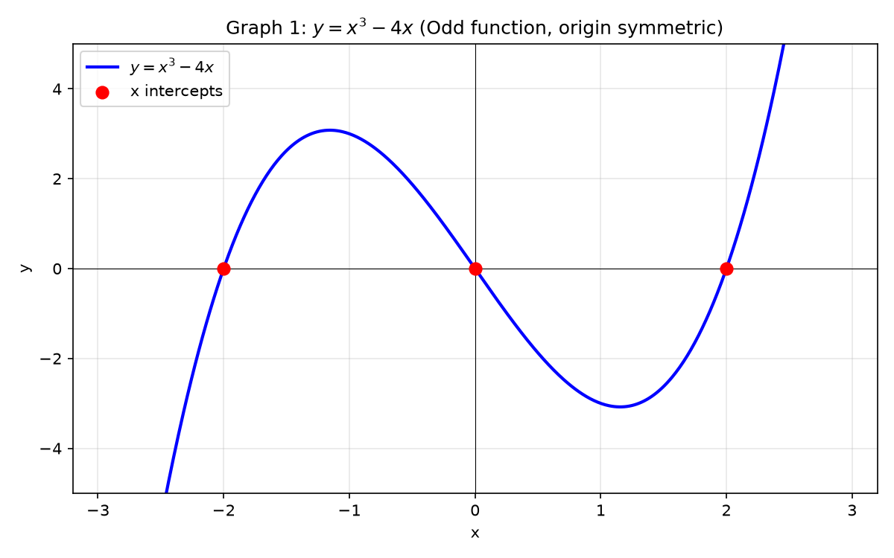

---

## Example 3: Rational Function — Tear, Cancel, Punch a Hole

$f(x) = \frac{x^2 - x - 2}{x^2 - 4}$.

**Step 0 — Factor**: Numerator $(x-2)(x+1)$. Denominator $(x-2)(x+2)$.
Cancel $(x-2)$. → $f(x) = \frac{x+1}{x+2}$, **but $x \neq 2$**.

$x=2$ made the denominator 0. It canceled but is forever banned.
→ **Empty circle (hole)** at $(2, \frac{3}{4})$.

**Step 1 — Domain**: $x \neq -2$ (zero denominator), $x \neq 2$ (hole).

**Step 4 — Asymptotes**: Vertical $x=-2$. Horizontal as $x\to\infty$: ratio of leading coefficients → $y=1$.

**Step 3 — Intercepts**: $y$-int: $f(0)=\frac{1}{2}$. $x$-int: numerator $=0$ at $x=-1$.

**Step 5 — Sign near $x=-2$**:
$x\to -2^+$: numerator $(-1)$, denominator $(+)$ → $-\infty$.
$x\to -2^-$: numerator $(-1)$, denominator $(-)$ → $+\infty$.

**Step 6 — Connect**: Two branches, hole at $x=2$.

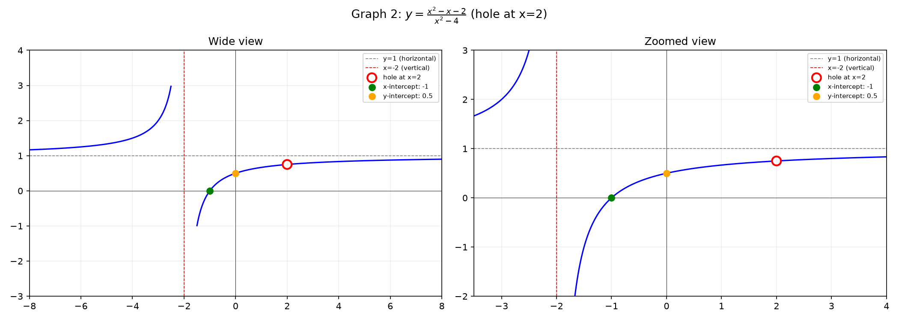

---

## Example 4: Slant Asymptote — Divide First

$f(x) = \frac{x^2 + 2x}{x - 1}$.

**Divide**: $x^2+2x \div (x-1) = x+3$ with remainder $3$.
→ $f(x) = x + 3 + \frac{3}{x-1}$.

**Vertical**: $x=1$. **Slant**: as $x\to\pm\infty$, $\frac{3}{x-1}\to 0$ → hugs $y=x+3$.

**Intercepts**: $x=0 \to f(0)=0$. $f(x)=0 \to x(x+2)=0 \to x=0,-2$.

**Drawing order**: ① Dashed slant line $y=x+3$. ② Dashed vertical $x=1$. ③ Mark intercepts. ④ Curve hugging asymptotes.

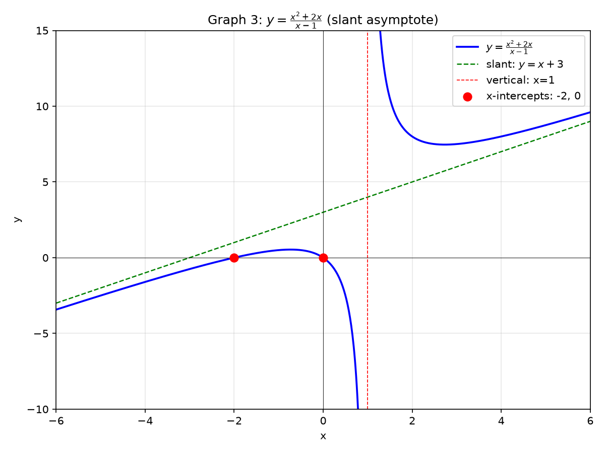

---

## Example 5: The $\frac{ax+b}{cx+d}$ Hyperbola Form

$f(x) = \frac{2x+1}{x-1}$.

**Vertical**: $x=1$. **Horizontal**: $y=2$ (ratio of $x$-coefficients).

**Intercepts**: $y$-int $(0,-1)$. $x$-int $(-\frac{1}{2},0)$.

**Center**: intersection of asymptotes $(1,2)$ — the graph is symmetric around this point.

**Approach**: $x\to1^+$ → $+\infty$, $x\to1^-$ → $-\infty$.

---

## Example 6: Radical Function — The Half-Graph

$f(x) = \sqrt{x-1} + 2$.

**Starting point**: $x=1$ gives $f(1)=2$. Mark $(1,2)$.
For $x<1$: nothing — the root is imaginary.

**Growth**: Slow. At $x=5$: $\sqrt{4}+2=4$. At $x=17$: $\sqrt{16}+2=6$.

**Shape**: $y=\sqrt{x}$ shifted right 1, up 2 — always creeping upward.

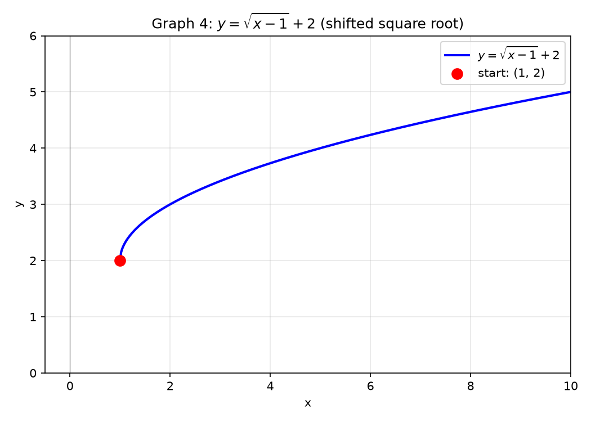

> **Up to here**: 7-step sequence. Domain: 4 rules. Polynomial: symmetry + sign chart. Rational: cancel, hole, asymptotes. Slant: divide. Hyperbola: $\frac{ax+b}{cx+d}$. Radical: half-graph.

---

## Part B: Transformations — Move, Flip, Fold, Stretch

---

## Example 7: Move the Whole Graph

Base: $f(x) = |x|$ (V-shape, vertex at origin).

| Operation | Formula | Vertex moves to |
|:---------:|:-------:|:---------------:|
| Right 3 | $f(x-3) = \vert x-3\vert$ | $(3,0)$ |
| Up 2 | $f(x)+2 = \vert x\vert+2$ | $(0,2)$ |
| Left 1, down 4 | $f(x+1)-4$ | $(-1,-4)$ |

**Method**: draw the original, move the vertex, redraw the V.

---

## Example 8: Flip Over an Axis

Base: $f(x)=\sqrt{x}$ (only $x\geq0$, top-right quadrant).

**Flip over $x$-axis**: $y=-\sqrt{x}$. Every $y$ becomes its negative. Points downward.
**Flip over $y$-axis**: $y=\sqrt{-x}$. Only $x\leq0$. Mirror of the right side.
**Flip over origin**: $y=-\sqrt{-x}$. Quadrant 3 only. Both flips at once.

---

## Example 9: Fold — Absolute Value Wraps Everything Upward

**$y = |f(x)|$**: Any part below the $x$-axis gets folded upward.

$f(x)=x^2-1$ dips to $-1$ between $-1<x<1$.
$|x^2-1|$: the dip becomes an upward bump. Everything is $\geq 0$.

**$y = f(|x|)$**: Copy the right side ($x\geq0$) onto the left.

$f(x)=x^2-2x$. For $x\geq0$: original. For $x<0$: reflect right side across $y$-axis.
Result: W-shape symmetric about $y$-axis.

---

## Example 10: Stretch and Shrink

Base: $f(x)=\sin x$ (height 1, period $2\pi$).

| Operation | Effect |
|:---------:|:------:|
| $2\sin x$ | Height ×2 (vertical stretch) |
| $\frac{1}{2}\sin x$ | Height ÷2 (vertical shrink) |
| $\sin(2x)$ | Period ÷2 → $\pi$ (horizontal squeeze) |
| $\sin(\frac{x}{2})$ | Period ×2 → $4\pi$ (horizontal stretch) |

**Rule**: $a\cdot f(bx)$. $a$ = vertical scale. $b$ = horizontal speed ($b>1$ squeezes, $b<1$ stretches).

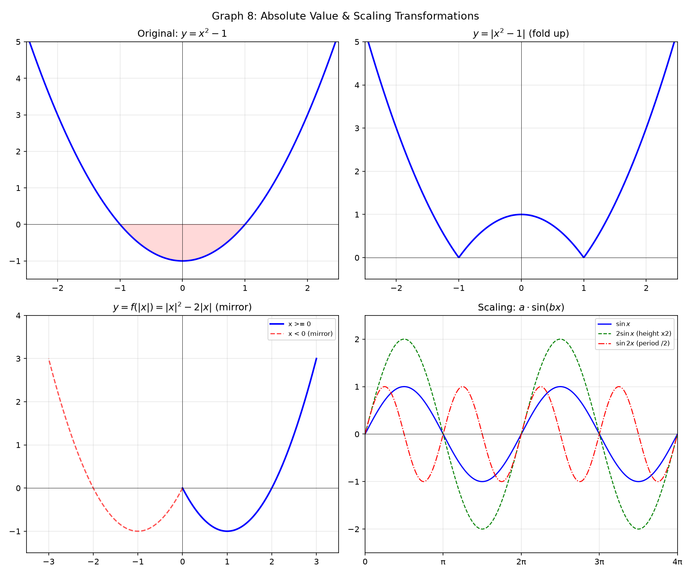

---

## Part C: Special Functions — Stairs, Sawteeth, and Signs

---

## Example 11: Floor Function $\lfloor x\rfloor$ — Building Stairs

$\lfloor x\rfloor$ = greatest integer $\leq x$.

Values: $\lfloor 0.3\rfloor = 0$, $\lfloor 0.999\rfloor = 0$, $\lfloor 1.7\rfloor = 1$, $\lfloor -0.3\rfloor = -1$.

**How to draw**: On $[0,1)$: horizontal at $y=0$, right endpoint empty. On $[1,2)$: horizontal at $y=1$, left endpoint filled, right empty. Repeat left and right forever.

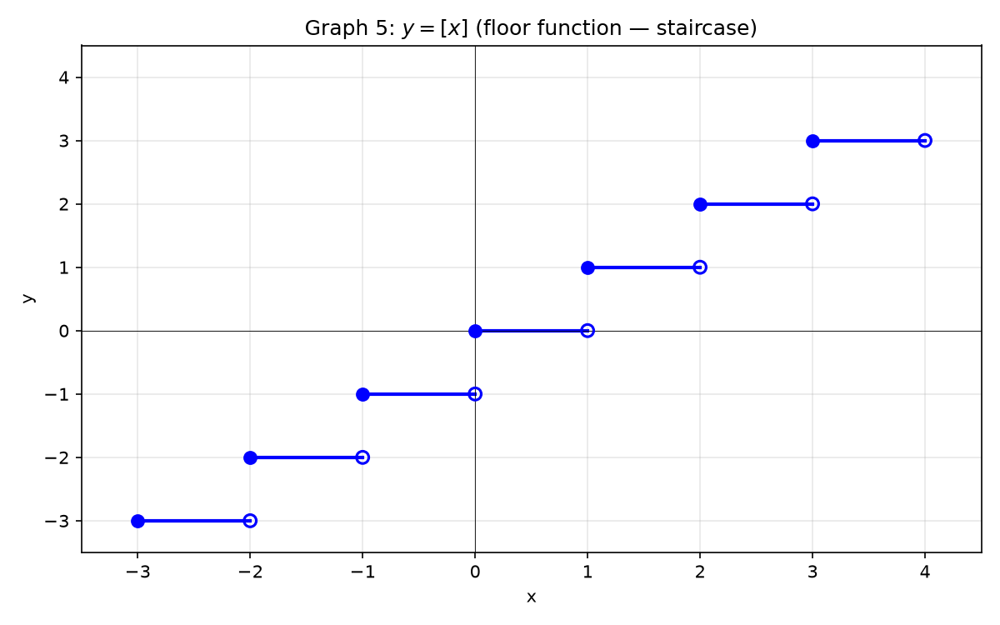

---

## Example 12: Fractional Part $\{x\}$ — Repeating Sawteeth

$\{x\} = x - \lfloor x\rfloor$ = the decimal part only.

$\{3.7\}=0.7$, $\{5.0\}=0$, $\{-1.2\} = -1.2 - (-2) = 0.8$.

**How to draw**: On $[0,1)$: $\{x\}=x$, diagonal from $(0,0)$ to just before $(1,1)$. On each $[n,n+1)$: same diagonal shifted. Height always in $[0,1)$.

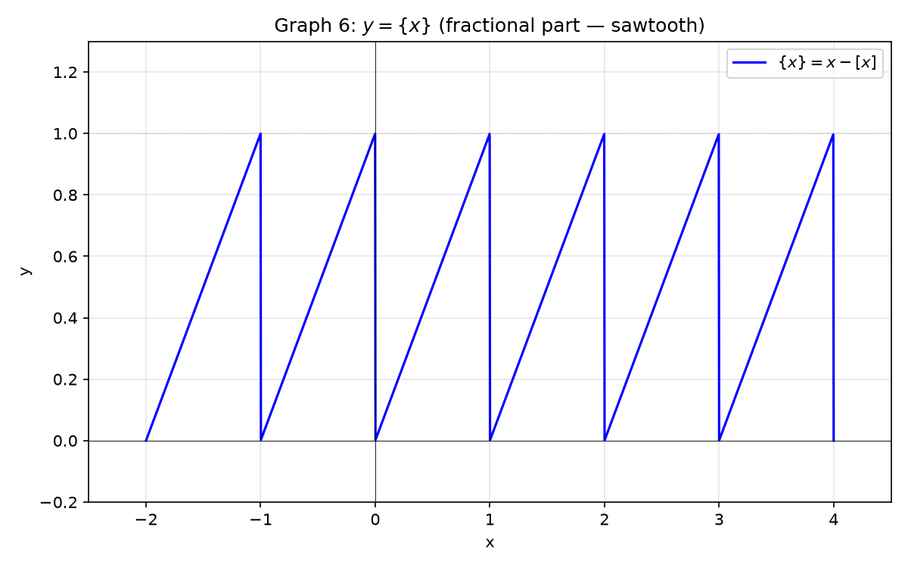

---

## Example 13: Ceiling and Sign Functions

**$\lceil x\rceil$**: smallest integer $\geq x$. $\lceil 3.2\rceil=4$, $\lceil -1.2\rceil=-1$.
Like floor but shifted right: $(0,1]$ → $1$, $(1,2]$ → $2$.

**$\operatorname{sgn}(x)$**: $x<0 \to -1$, $x=0 \to 0$, $x>0 \to 1$. Three horizontal segments.

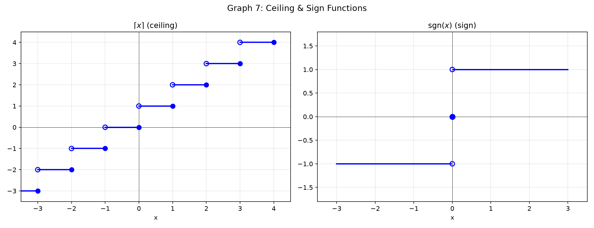

---

## Example 14: Piecewise — Draw Each Interval Separately

$$
f(x) = \begin{cases}
x+2, & x \leq 0 \\
4-x^2, & 0 < x \leq 2 \\
\frac{1}{x-2}, & x > 2
\end{cases}
$$

**Check boundaries first**:
$x=0$: piece 1 gives 2. Piece 2 gives 4. → **Jump!** Filled dot $(0,2)$, empty $(0,4)$.
$x=2$: piece 2 ends at 0. Piece 3 denominator → 0. → Vertical asymptote at $x=2$.

**Draw**: Piece 1: line ending at $(0,2)$. Piece 2: parabola from $(0,4)$ to $(2,0)$. Piece 3: hyperbola with wall at $x=2$, approaching $y=0$.

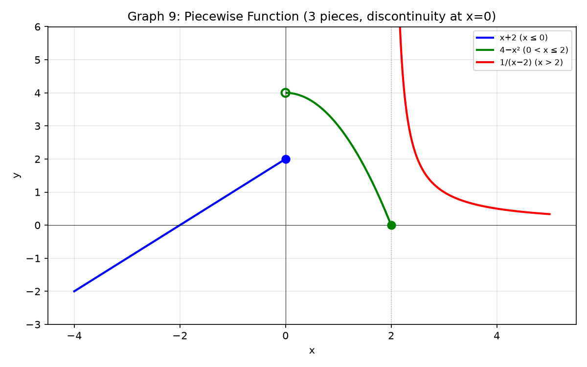

---

## Example 15: Mixed — Floor × Fractional Part

**$f(x) = x + \lfloor x\rfloor$**. Write $x = n + \delta$ ($n$ integer, $0\leq\delta<1$).
$f(x) = n+\delta + n = 2n + \delta$. On $[0,1)$: $y=\delta$ (diagonal 0→1). On $[1,2)$: $y=2+\delta$ (diagonal 2→3). Jumps by 1 at integers.

**$f(x) = x\{x\} = x(x-\lfloor x\rfloor)$**. On $[0,1)$: $x^2$ (parabola piece). On $[1,2)$: $x(x-1)$ (another parabola piece). Drops to 0 at every integer.

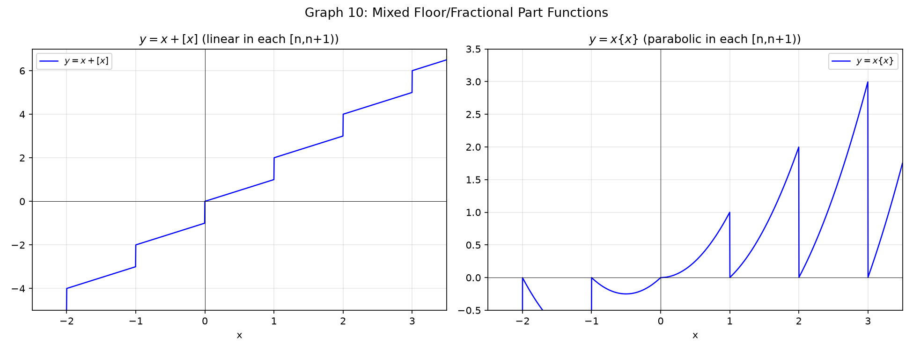

---

## Example 16: Absolute Value + Rational

$f(x) = \frac{|x-1|}{x^2-1}$.

**Strip abs**: $x\geq1$: $|x-1|=x-1$, $f(x)=\frac{1}{x+1}$ ($x\neq1$).
$x<1$: $|x-1|=-(x-1)$, $f(x)=\frac{-1}{x+1}$ ($x\neq-1$).

**Hole**: at $x=1$, value would be $\frac{1}{2}$ → empty circle $(1,\frac{1}{2})$.

**Asymptotes**: vertical $x=-1$, horizontal $y=0$.

**Draw**: Two branches: $x<-1$ (upper right quadrant), $-1<x<1$ (lower), $x>1$ (upper right approaching 0).

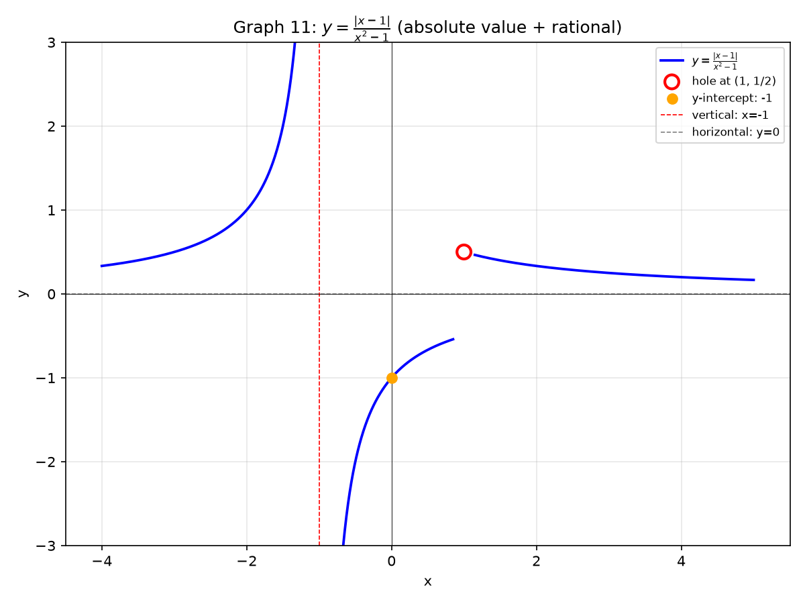

> **Up to here**: Transform = move/flip/fold/stretch. Floor = stairs. Frac = sawteeth. Piecewise = interval-by-interval. Mixed = combine patterns.

---

## Common Mistakes

### Mistake 1: Forgetting the hole after canceling

**Wrong**: "$\frac{(x-1)(x+2)}{x-1}=x+2$, so it's a line." **Right**: Punch an empty circle at $x=1$. The original denominator forbids it forever.

### Mistake 2: Filling the right endpoint of a floor step

**Wrong**: On $[1,2]$ the value is 1. **Right**: $\lfloor 2.0\rfloor = 2$. The interval is $[1,2)$ — right endpoint empty.

### Mistake 3: Assuming a graph never crosses its horizontal asymptote

**Wrong**: "Asymptote means forbidden." **Right**: Asymptote only describes $x\to\pm\infty$ behavior. The graph can cross it at finite $x$. Example: $y=\frac{x}{x^2+1}$ has $y=0$ asymptote but passes through $(0,0)$.

### Mistake 4: $f(|x|)$ vs $|f(x)|$ confusion

**Wrong**: They're the same. **Right**: $|f(x)|$ folds below-axis parts upward. $f(|x|)$ copies right side to left, making an even function.

---

## What We Just Did

```
(1) 7-step drawing sequence: domain → symmetry → intercepts → asymptotes
    → sign → connect → special handling.

(2) Transformations: move (±h,±k), flip (-f, f(-x)),
    fold (|f|, f(|x|)), stretch (a·f(bx)).

(3) Special functions: [x] (stairs), {x} (sawteeth), ⌈x⌉ (ceiling), sgn(x).
    Piecewise: check boundaries, draw interval by interval.
```

---

## Practice 1

Find the domain of $f(x) = \frac{\sqrt{9-x^2}}{\ln(x-1)}$. State all conditions.

→ Reference: **Example 1**

> Solutions: [Solutions](solutions/9A-solutions.md#practice-1)

---

## Practice 2

Draw $f(x) = \frac{x^2-4}{x^2-1}$ using the 7 steps. Show asymptotes, intercepts, sign, and any holes.

→ Reference: **Example 3**

> Solutions: [Solutions](solutions/9A-solutions.md#practice-2)

---

## Practice 3

Draw $f(x) = \frac{x^2+1}{x-2}$. Find the slant asymptote by dividing.

→ Reference: **Example 4**

> Solutions: [Solutions](solutions/9A-solutions.md#practice-3)

---

## Practice 4

The graph of $f(x) = \sqrt{x}$ is shifted left 3 and down 1. Write the equation and state the domain.

→ Reference: **Example 6, 7**

> Solutions: [Solutions](solutions/9A-solutions.md#practice-4)

---

## Practice 5

Draw $f(x) = |x^2-4|$. Identify which part was folded upward.

→ Reference: **Example 9**

> Solutions: [Solutions](solutions/9A-solutions.md#practice-5)

---

## Practice 6: Real Battle

$$
f(x) = \begin{cases}
-x-2, & x < -1 \\
x^2, & -1 \leq x < 2 \\
\frac{4}{x-1}, & x \geq 2
\end{cases}
$$
Draw the graph. Mark all boundary dots as filled or empty. Check continuity at each boundary.

→ Reference: **Example 14**

> Solutions: [Solutions](solutions/9A-solutions.md#practice-6)

---

## Basic Algebra Drill — Graph Drawing (10 Problems)

> Pure computation. Domain, asymptotes, intercepts.

**D1.** Find the domain of $f(x) = \sqrt{2x+6}$.

**D2.** Find the domain of $f(x) = \frac{1}{x^2-9}$.

**D3.** Find all $x$- and $y$-intercepts of $f(x) = x^3 - 9x$.

**D4.** Find all vertical and horizontal asymptotes of $f(x) = \frac{3x}{x-2}$.

**D5.** Find the slant asymptote of $f(x) = \frac{x^2+3x}{x+1}$.

**D6.** Write the equation after shifting $y = |x|$ right 4 and up 2.

**D7.** Write the equation after reflecting $y = \sqrt{x}$ across the $y$-axis and shifting up 3.

**D8.** Compute $\lfloor 3.7\rfloor$, $\lfloor -2.3\rfloor$, $\lceil 1.2\rceil$, $\lceil -0.8\rceil$.

**D9.** For $f(x) = \frac{x^2-1}{x^2-4}$, find where the graph crosses its horizontal asymptote.

**D10.** A rational function has vertical asymptotes at $x=-1$ and $x=2$, and a horizontal asymptote at $y=0$. Propose a possible formula.

> Solutions: [Solutions](solutions/9A-solutions.md#basic-drill)

---

## Advanced Algebra Drill — Graph Drawing (10 Problems)

> Multi-step. Draw, then reason.

**A1.** $f(x) = \frac{x^3-8}{x-2}$. Cancel, find the hole, and draw the graph. What simple function does it resemble?

**A2.** $f(x) = \frac{|x-2|}{x-2}$. Determine the formula on $x>2$ and $x<2$. Draw. What is the range?

**A3.** Draw $f(x) = \lfloor 2x\rfloor$ on $[-2, 2]$. How does the stair width compare to $\lfloor x\rfloor$?

**A4.** $f(x) = \frac{x^2-5x+6}{x^2-x-6}$. Factor numerator and denominator. Find holes (if any) and asymptotes.

**A5.** $f(x) = \frac{1}{(x-1)^2}$. State domain, asymptotes, sign, and range. Draw.

**A6.** $f(x) = x + \frac{1}{x}$. Find the slant asymptote. Show there are no vertical asymptotes at $x=0$ — what happens instead?

**A7.** Draw $f(x) = \{x\} - \frac{1}{2}$ on $[-2, 3]$. Describe how the sawtooth is shifted.

**A8.** $f(x) = \sqrt{x^2-4}$. Find the domain. Show that as $x\to\infty$, the graph approaches the line $y=x$. Draw.

**A9.** Draw $f(x) = ||x|-2|$. Build from the inside out: $|x| \to |x|-2 \to ||x|-2|$. How many V-shaped folds?

**A10.** Propose a piecewise formula whose graph has: a parabola on $(-\infty, 0]$, a constant from $(0, 2]$, and an exponential decay for $x>2$, with a hole at $x=0$ and a jump at $x=2$.

> Solutions: [Solutions](solutions/9A-solutions.md#advanced-drill)

---

## Today's Procedure

```
Step 1: 7-step sequence — master it. Domain (4 rules), symmetry test,
         intercepts (set x=0, set y=0), asymptotes (vertical/horizontal/slant),
         sign chart, connect dots, handle holes/jumps.

Step 2: Transformations — any graph = base shape + move + flip + fold + stretch.
         Piecewise = interval-by-interval with boundary checks.

Step 3: Special functions — [x] staircase, {x} sawtooth. They repeat.
         Mix them with algebra to create new patterns.
```

---

## Terminology

| What we call it | Math term | Notation |
|:---------------:|:---------:|:--------:|
| numbers you can push in | domain | $\{x \mid \text{conditions}\}$ |
| numbers that come out | range | $\{f(x) \mid x \in \text{domain}\}$ |
| moving the graph | translation | $f(x-h)+k$ |
| flipping over axis | reflection | $-f(x)$, $f(-x)$ |
| folding upward | absolute value of function | $\vert f(x)\vert$ |
| stretching/shrinking | scaling | $a\cdot f(bx)$ |
| stair function | floor / greatest integer | $\lfloor x\rfloor$ |
| ceiling function | ceiling | $\lceil x\rceil$ |
| sawtooth function | fractional part | $\{x\} = x - \lfloor x\rfloor$ |
| sign function | signum | $\operatorname{sgn}(x)$ |
| piece-by-piece | piecewise function | different formulas per interval |
| hole | removable discontinuity | canceled factor |
| line it hugs | asymptote | vertical, horizontal, slant |
