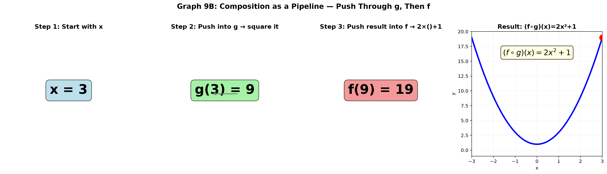
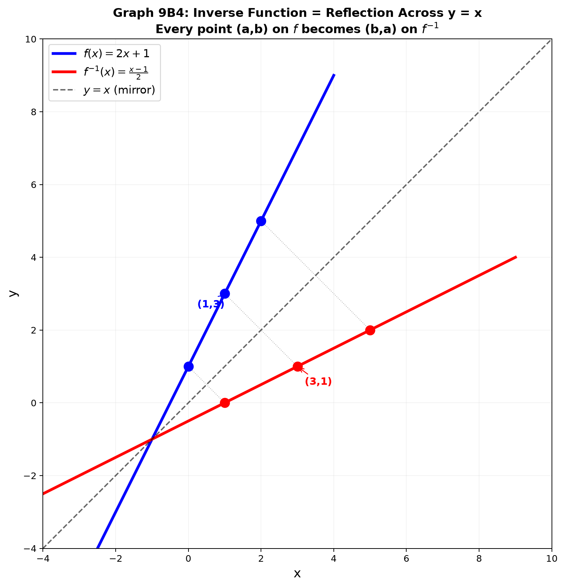
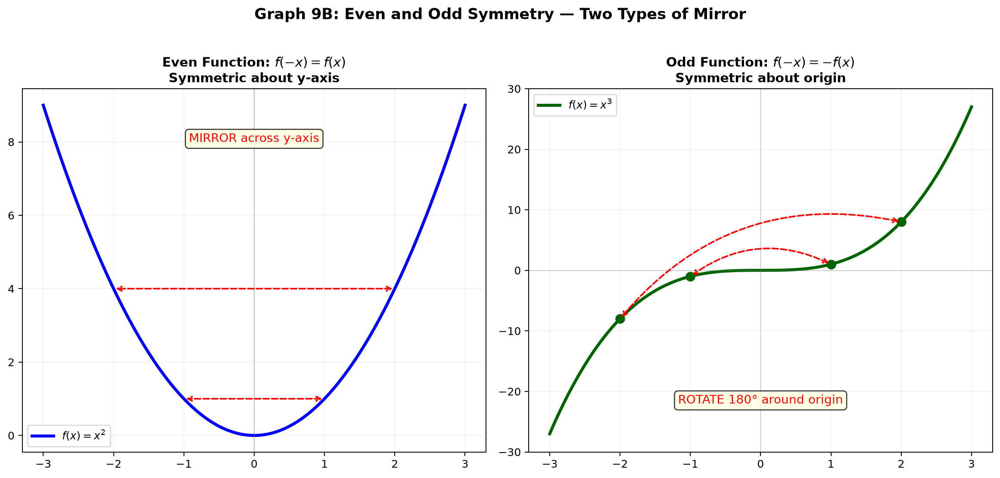
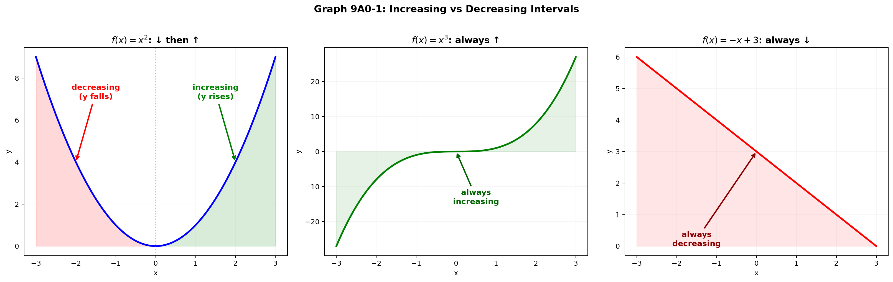
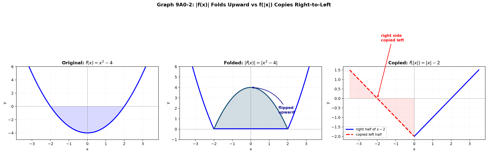

# Session 9A1: Function Fundamentals — The Complete Toolkit

**Phase 2 — Classical Techniques | 90 min**

*A function is a machine: you feed it a number, it follows a rule, and a result pops out. Learn to feed it, reverse it, read its symmetry, and move it around the plane. This is the foundation for all graphing to come.*

---

## Part A: What Is a Function — Feed, Process, Output

---

## Example 1: A Function Is a Vending Machine

Put a coin in a vending machine, a drink comes out. A function works the same way: you push a number in, the rule processes it, a result comes out.

$f(x) = 2x + 3$.

- Push in $x=0$ → $2(0)+3 = 3$ comes out. $f(0)=3$.
- Push in $x=1$ → $2(1)+3 = 5$ comes out. $f(1)=5$.
- Push in $x=-2$ → $2(-2)+3 = -1$ comes out. $f(-2)=-1$.

**What is $f(4)$?** Shove $4$ into the $x$ slot. $f(4) = 2(4)+3 = 11$.

**What is $f(a)$?** Letters work too. $f(a) = 2a+3$.

**What is $f(t+1)$?** Shove the entire expression $t+1$ into the $x$ slot. $f(t+1) = 2(t+1)+3 = 2t+5$.

> **The key idea**: $f(\square)$ means "shove $\square$ into every spot that held $x$." $x$ is just a placeholder.

---

## Example 2: Different Rules, Same Machine Principle

The rule changes, but the feed→process→output principle never changes.

| Function | Rule | Feed $x=3$ | Feed $x=-1$ |
|:---:|:---:|:---:|:---:|
| $f(x)=x^2$ | Square it | 9 | 1 |
| $g(x)=\sqrt{x}$ | Take the square root | $\sqrt{3}$ | undefined |
| $h(x)=\frac{1}{x}$ | Take the reciprocal | $\frac{1}{3}$ | $-1$ |
| $p(x)=\vert x\vert$ | Strip the sign | 3 | 1 |
| $q(x)=\lfloor x\rfloor$ | Take the integer part | 3 | $-1$ |

**Multi-step rules are fine**: $f(x)=x^2+2x-1$. Feed $x=-3$:
$(-3)^2 + 2(-3) - 1 = 9 - 6 - 1 = 2$.

> **Watch out**: some inputs break the machine. $\sqrt{-2}$ is not a real number. $\frac{1}{0}$ is undefined. The set of inputs that work is called the **domain**.

---

## Example 3: Building a Table of Values

For $f(x) = x^2 - 2x$, feed in several $x$ values and record the outputs:

| $x$ | $-2$ | $-1$ | $0$ | $1$ | $2$ | $3$ | $4$ |
|:---:|:---:|:---:|:---:|:---:|:---:|:---:|:---:|
| $f(x)$ | 8 | 3 | 0 | $-1$ | 0 | 3 | 8 |

**What the table reveals**:
- Output hits $0$ at $x=0$ and $x=2$ → the graph crosses the $x$-axis twice.
- Output is $-1$ at $x=1$ → the lowest point so far.
- Left-right symmetry: $f(-1)=f(3)=3$, $f(-2)=f(4)=8$.

A well-built table already tells you half the story of the function.

---

## Part B: Domain — The Four Entry Rules

---

## Example 4: The Four Rules for What You Can Feed In

Some numbers break the machine. Four rules cover every case in precalculus.

**Rule 1 — Denominator present**: A denominator can never be zero.

$f(x)=\frac{1}{x-2}$ → $x=2$ makes the denominator $0$. Ban $x=2$. Domain: $x \neq 2$.

**Rule 2 — Square root present**: The inside must be $\geq 0$.

$g(x)=\sqrt{x+3}$ → $x+3 \geq 0$ → $x \geq -3$. Domain: $[-3, \infty)$.

**Rule 3 — Logarithm present**: The inside must be $> 0$.

$h(x)=\ln(x-1)$ → $x-1 > 0$ → $x > 1$. Domain: $(1, \infty)$.

**Rule 4 — Multiple restrictions**: Satisfy every rule simultaneously.

$f(x)=\frac{\sqrt{x+2}}{x-1}$.
Square root: $x+2 \geq 0$ → $x \geq -2$.
Denominator: $x-1 \neq 0$ → $x \neq 1$.
Both together: $[-2, 1) \cup (1, \infty)$.

---

## Example 5: Domain Traps — Hidden Restrictions

**Trap 1 — $\sqrt{x^2}$ is NOT the same as $x$**:
$\sqrt{x^2} = |x|$, which is defined for all real $x$. No restriction. But $\sqrt{x}^2$ needs $x \geq 0$. Pay attention to where the square actually sits.

**Trap 2 — Canceling does not erase the restriction**:
$f(x)=\frac{x^2-1}{x-1} = \frac{(x-1)(x+1)}{x-1}$. You can cancel $(x-1)$ to get $x+1$, but $x=1$ is **still banned** from the original denominator. The simplified formula is $f(x)=x+1$ with a hole at $x=1$.

**Trap 3 — Even roots in any form**:
$\sqrt[4]{x}$, $\sqrt[6]{x}$, and any even-indexed root requires the inside $\geq 0$. Odd-indexed roots ($\sqrt[3]{x}$, $\sqrt[5]{x}$) accept any real number.

---

## Part C: Range — What Actually Comes Out

---

## Example 6: Finding the Range — What Values Can You Get?

The domain is what you **can** feed in. The range is what actually **comes out**.

$f(x)=x^2$: you can feed in any real number, but the output is always $\geq 0$. Range: $[0, \infty)$.

$f(x)=\sqrt{x}$: feed $x \geq 0$, output $\sqrt{x} \geq 0$. Range: $[0, \infty)$.

$f(x)=\frac{1}{x}$: feed $x \neq 0$, output can never be $0$ (numerator is always $1$). Range: $(-\infty, 0) \cup (0, \infty)$.

$f(x)=x^2-4x+3$: complete the square → $(x-2)^2-1$. The square term is always $\geq 0$, so the minimum is $-1$ (at $x=2$). Range: $[-1, \infty)$.

**Strategy for finding range**:
1. Sketch the graph in your head.
2. Ask: from how low to how high does $y$ reach?
3. Check for gaps — values that never appear.

---

## Part D: Piecewise Functions — Different Rules for Different Intervals

---

## Example 7: Reading a Piecewise Function

One function, but the rule changes depending on which $x$ you feed in.

$$
f(x) = \begin{cases}
x+2, & x < 0 \\
x^2, & x \geq 0
\end{cases}
$$

**How to read it**: If $x<0$, use the rule $x+2$. If $x \geq 0$, use the rule $x^2$.

- $f(-3)$: $-3 < 0$ → use $x+2$ → $-3+2 = -1$.
- $f(-0.5)$: $-0.5 < 0$ → use $x+2$ → $1.5$.
- $f(0)$: $0 \geq 0$ → use $x^2$ → $0$.
- $f(4)$: $4 \geq 0$ → use $x^2$ → $16$.

**Always check the boundary first**: At $x=0$, the left rule gives $0+2=2$, the right rule gives $0^2=0$. The value **jumps** from $2$ to $0$.

---

## Example 8: Building a Piecewise from a Story

A parking garage charges:
- \$5 for up to 1 hour.
- \$5 + \$3 per additional hour for 1–6 hours.
- Flat \$25 for 6+ hours (daily max).

Let $t$ be hours. The cost function:

$$
C(t) = \begin{cases}
5, & 0 < t \leq 1 \\
5 + 3\lceil t-1 \rceil, & 1 < t \leq 6 \\
25, & t > 6
\end{cases}
$$

$C(0.5)=5$, $C(2)=5+3(1)=8$, $C(5.1)=5+3(5)=20$, $C(8)=25$.

Piecewise functions model real-world rate changes — tax brackets, shipping costs, bulk discounts.

---

## Part E: Operations on Functions — Add, Subtract, Multiply, Divide

---

## Example 9: Arithmetic on Two Functions

Given $f(x)=x+2$ and $g(x)=x^2$. Compute at the same $x$-position.

| Operation | Notation | Formula | At $x=3$ |
|:---:|:---:|:---:|:---:|
| Add | $(f+g)(x)=f(x)+g(x)$ | $(x+2)+x^2=x^2+x+2$ | $9+3+2=14$ |
| Subtract | $(f-g)(x)=f(x)-g(x)$ | $(x+2)-x^2=-x^2+x+2$ | $-9+3+2=-4$ |
| Multiply | $(fg)(x)=f(x)\cdot g(x)$ | $(x+2)x^2=x^3+2x^2$ | $27+18=45$ |
| Divide | $(\frac{f}{g})(x)=\frac{f(x)}{g(x)}$ | $\frac{x+2}{x^2}$ | $\frac{5}{9}$ |

**Watch the division**: Any $x$ where $g(x)=0$ must be removed from the domain. Here, $x=0$ is banned for $f/g$.

---

## Example 10: Building New Functions from Old Ones

If $f(x)=\sqrt{x}$ and $g(x)=x-4$, then:
- $(f+g)(x)=\sqrt{x}+x-4$, domain: $x \geq 0$.
- $(fg)(x)=\sqrt{x}(x-4)$, domain: $x \geq 0$.
- $(f/g)(x)=\frac{\sqrt{x}}{x-4}$, domain: $x \geq 0$ AND $x \neq 4$.

**The domain of a combined function** = the intersection of the individual domains, minus division-by-zero points.

---

## Part F: Composition — Feed One Function Into Another

---

## Example 11: The Pipeline — $f(g(x))$

**$(f \circ g)(x) = f(g(x))$**: First feed $x$ into $g$, get a result. Then feed that result into $f$.

$f(x)=2x+1$, $g(x)=x^2$.

**$f \circ g$** (square first, then double-and-add-1):
① Feed $x=3$ into $g$ → $g(3)=9$.
② Feed $9$ into $f$ → $f(9)=2(9)+1=19$.
③ As a formula: $(f \circ g)(x)=2x^2+1$.

**$g \circ f$** (double-and-add-1 first, then square):
① Feed $x=3$ into $f$ → $f(3)=7$.
② Feed $7$ into $g$ → $g(7)=49$.
③ As a formula: $(g \circ f)(x)=(2x+1)^2=4x^2+4x+1$.

**Order matters!** $f \circ g \neq g \circ f$. Putting on socks then shoes is not the same as shoes then socks.



*Graph: Composition as a pipeline — x=3 enters, g squares it to 9, f doubles+1 to get 19. Each box is one transformation stage.*

---

## Example 12: Domain of a Composition — The Two-Gate Check

To feed a number into $(f \circ g)(x)=f(g(x))$, it must pass two gates:
1. $x$ must be in the domain of $g$ (the inner function).
2. $g(x)$ must be in the domain of $f$ (the outer function).

$f(x)=\sqrt{x}$, $g(x)=x-3$.

**$f \circ g$**: $\sqrt{x-3}$.
- Gate 1 ($g$): any $x$ is fine.
- Gate 2 ($f$): the inside must be $\geq 0$ → $x-3 \geq 0$ → $x \geq 3$.
- Domain: $[3, \infty)$.

**$g \circ f$**: $\sqrt{x} - 3$.
- Gate 1 ($f$): $x \geq 0$.
- Gate 2 ($g$): any input is fine.
- Domain: $[0, \infty)$.

**The inner function's output must fit inside the outer function's input slot.**

---

## Example 13: Composition Chain — Three Functions

$f(x)=\sqrt{x}$, $g(x)=x^2$, $h(x)=x+1$.

**$(f \circ g \circ h)(x) = f(g(h(x)))$**: work from the innermost function outward.

① $h(x)=x+1$.
② $g(h(x)) = g(x+1) = (x+1)^2$.
③ $f(g(h(x))) = f((x+1)^2) = \sqrt{(x+1)^2} = |x+1|$.

So $(f \circ g \circ h)(x) = |x+1|$. Three machines chained into one.

---

## Part G: Inverse Functions — The Undo Button

---

## Example 14: Going Backward Through the Machine

$f(x)=2x+3$: feed $x$, double it, add 3. To undo: subtract 3, then divide by 2.

**Procedure for finding an inverse**:
① Write $y=2x+3$.
② Solve for $x$: $y-3=2x$ → $x=\frac{y-3}{2}$.
③ Swap $x$ and $y$: $f^{-1}(x)=\frac{x-3}{2}$.

**Verify**: $f(5)=13$. $f^{-1}(13)=\frac{13-3}{2}=5$. The original input comes right back!

$f^{-1}(f(x)) = x$ and $f(f^{-1}(x)) = x$. The inverse is the **undo button**.

---

## Example 15: When the Inverse Formula Requires Algebra

$f(x) = \frac{2x+1}{x-3}$.

① $y(x-3) = 2x+1$.
② $yx - 3y = 2x + 1$.
③ $yx - 2x = 3y + 1$.
④ $x(y-2) = 3y+1$.
⑤ $x = \frac{3y+1}{y-2}$.
⑥ Swap: $f^{-1}(x) = \frac{3x+1}{x-2}$.

**The inverse of a rational function is also rational**. The asymptotes swap roles — the vertical asymptote of $f$ ($x=3$) becomes the horizontal asymptote of $f^{-1}$ ($y=3$), and vice versa.

---

## Example 16: When the Inverse Doesn't Exist — The Horizontal Line Test

$f(x)=x^2$: $f(2)=4$, $f(-2)=4$. Given output $4$, you cannot tell whether the input was $2$ or $-2$. → No inverse exists for the full function.

**Horizontal line test**: Draw a horizontal line across the graph. If it ever hits the graph more than once, the function is **not one-to-one** and has no inverse (unless you restrict the domain).

**The fix — snip the domain**:
- Restrict to $x \geq 0$ → $f^{-1}(x)=\sqrt{x}$.
- Restrict to $x \leq 0$ → $f^{-1}(x)=-\sqrt{x}$.

You choose which half to keep. The inverse works on whichever half you keep.

---

## Example 17: The Geometry of Inverses — Reflection Across $y=x$

$f(x)=3x-6$. Points on $f$: $(0,-6)$, $(2,0)$, $(3,3)$.
Points on $f^{-1}$: $(-6,0)$, $(0,2)$, $(3,3)$.

Every point $(a,b)$ on $f$ becomes $(b,a)$ on $f^{-1}$. The graphs are mirror images across the line $y=x$.

**Special case**: When a point lies on $y=x$, swapping does nothing. $(3,3)$ stays $(3,3)$. These are the **fixed points** — where $f(x)=x$.



*Graph: f(x)=2x+1 (blue) and its inverse f⁻¹(x)=(x−1)/2 (red). Every point (a,b) on f becomes (b,a) on f⁻¹, reflected across the dashed line y=x.*

---

## Part H: Even and Odd Functions — The Two Symmetries

---

## Example 18: Even Functions — Mirror Across the $y$-Axis

$f(-x) = f(x)$ for all $x$ in the domain. The right half determines the left half — just mirror it.

$f(x)=x^2$: $f(-3)=9$, $f(3)=9$. Same. → Even.
$f(x)=|x|$: $f(-5)=5$, $f(5)=5$. → Even.
$f(x)=\cos x$: $\cos(-\theta)=\cos\theta$. → Even.
$f(x)=\frac{1}{x^2+1}$: only $x^2$ appears, no odd powers of $x$. → Even.

**Quick test**: Replace $x$ with $-x$. If the formula stays exactly the same, it's even.

---

## Example 19: Odd Functions — 180° Rotation Around the Origin

$f(-x) = -f(x)$ for all $x$. Rotate the right half 180° around the origin and it lands exactly on the left half.

$f(x)=x^3$: $f(-2)=-8$, $-f(2)=-8$. Same. → Odd.
$f(x)=\frac{1}{x}$: $f(-3)=-\frac{1}{3}$, $-f(3)=-\frac{1}{3}$. → Odd.
$f(x)=\sin x$: $\sin(-\theta)=-\sin\theta$. → Odd.

**Quick test**: Replace $x$ with $-x$. If you get exactly $-f(x)$ (the whole expression negated), it's odd.

---

## Example 20: Every Function Splits Into Even + Odd

Any function $f(x)$ can be torn into two pieces:

$$
f(x) = \underbrace{\frac{f(x)+f(-x)}{2}}_{\text{even part}} + \underbrace{\frac{f(x)-f(-x)}{2}}_{\text{odd part}}
$$

**Example**: $f(x)=x^3+x^2+x+1$.
- Even part: $\frac{(x^3+x^2+x+1) + (-x^3+x^2-x+1)}{2} = \frac{2x^2+2}{2} = x^2+1$.
- Odd part: $\frac{(x^3+x^2+x+1) - (-x^3+x^2-x+1)}{2} = \frac{2x^3+2x}{2} = x^3+x$.

So $x^3+x^2+x+1 = (x^2+1) + (x^3+x)$. The even-odd decomposition always exists and is unique.



*Graph: Left — Even function (x²) mirrors across the y-axis. Right — Odd function (x³) rotates 180° around the origin.*

---

## Part I: Increasing and Decreasing — Reading the Graph Left to Right

---

## Example 21: Rise, Fall, and Flat

Read the graph from left to right, like reading a sentence:

- **Increasing**: As $x$ moves right, $y$ moves up. The graph climbs.
- **Decreasing**: As $x$ moves right, $y$ moves down. The graph descends.
- **Constant**: As $x$ moves right, $y$ stays the same. The graph is flat.

$f(x)=2x+1$: always increasing. Steady climb upward.
$f(x)=-x+3$: always decreasing. Steady descent.
$f(x)=x^2$: decreasing on $(-\infty, 0)$, increasing on $(0, \infty)$. Switches direction at $x=0$.
$f(x)=x^3$: increasing everywhere — never stops, never flattens.
$f(x)=c$ (constant): neither increasing nor decreasing — horizontal line.



*Graph 9A1: Left — f(x)=x² decreases then increases. Middle — f(x)=x³ increases everywhere. Right — f(x)=−x+3 decreases everywhere.*

---

## Example 22: Describing Behavior Without a Graph

For $f(x)=x^3-3x$, without drawing:
- $f(-2)=-8+6=-2$
- $f(-1)=-1+3=2$ → went up from $x=-2$ to $x=-1$.
- $f(0)=0$ → went down from $x=-1$ to $x=0$.
- $f(1)=1-3=-2$ → went down further.
- $f(2)=8-6=2$ → went up from $x=1$ to $x=2$.

The function rises, falls, falls more, then rises — it has two "turning points" hidden inside.

---

## Part J: Transformations — Move, Flip, and Stretch

---

## Example 23: Shifting — Pick It Up and Put It Down

Starting from a base graph $y=f(x)$:

| Change | Formula | What happens to the graph |
|:---:|:---:|:---:|
| Replace $x$ with $x-h$ | $f(x-h)$ | Shift right by $h$ |
| Replace $x$ with $x+h$ | $f(x+h)$ | Shift left by $h$ |
| Add $k$ to the whole thing | $f(x)+k$ | Shift up by $k$ |
| Subtract $k$ | $f(x)-k$ | Shift down by $k$ |

$f(x)=|x|$ (V-shape, vertex at origin).
- $f(x-3)=|x-3|$: vertex moves to $(3,0)$, right by 3.
- $f(x)+2=|x|+2$: vertex moves to $(0,2)$, up by 2.
- $f(x+1)-4=|x+1|-4$: vertex moves to $(-1,-4)$, left by 1, down by 4.

**Why is the horizontal shift backwards?** In $f(x-3)$, at $x=3$ the inside becomes $0$ — the same as $f(0)$. The graph "thinks" $x=3$ is the new origin. So $x-h$ means: "add $h$ to $x$ to get the old behavior."

---

## Example 24: Reflecting — Flip Over an Axis

| Change | Formula | What happens |
|:---:|:---:|:---:|
| Negate the whole thing | $-f(x)$ | Flip over the $x$-axis |
| Negate $x$ inside | $f(-x)$ | Flip over the $y$-axis |
| Negate both | $-f(-x)$ | 180° rotation around origin |

$f(x)=\sqrt{x}$ (exists only in the top-right quadrant).
- $-\sqrt{x}$: now in the bottom-right quadrant (flipped down).
- $\sqrt{-x}$: now in the top-left quadrant ($x \leq 0$ required).
- $-\sqrt{-x}$: now in the bottom-left quadrant (both flips at once).

---

## Example 25: Stretching and Squeezing

$a \cdot f(bx)$.

- $a$: vertical scale. $a>1$ stretches taller, $0<a<1$ squishes shorter. $a<0$ also flips.
- $b$: horizontal speed. $b>1$ squeezes narrower, $0<b<1$ stretches wider. $b<0$ also flips.

$f(x)=\sin x$ (height 1, period $2\pi$).
- $2\sin x$: height becomes 2. Period unchanged at $2\pi$.
- $\sin(2x)$: height unchanged at 1. Period becomes $\pi$ — twice as fast.
- $\frac{1}{2}\sin(3x)$: height 0.5, period $2\pi/3$ — shorter and faster.

$f(x)=x^2$:
- $3x^2$: sharper, narrower parabola.
- $(\frac{x}{2})^2 = \frac{x^2}{4}$: wider, flatter parabola.

---

## Example 26: The General Transformation Form

$g(x) = a \cdot f(b(x-h)) + k$.

Read from the **inside out**, from $x$ toward the outside:

| Position | Symbol | Effect |
|:---:|:---:|:---:|
| Innermost | $h$ in $(x-h)$ | Horizontal shift (right if $h>0$) |
| Next | $b$ in $b(x-h)$ | Horizontal scale + horizontal flip if $b<0$ |
| Next | $a$ multiplied outside | Vertical scale + vertical flip if $a<0$ |
| Outermost | $+k$ at the end | Vertical shift (up if $k>0$) |

**Example**: $g(x) = -2f(3(x+1))-4$ applied to $f(x)=x^2$.
① $h=-1$: shift left by 1.
② $b=3$: squeeze horizontally by factor 3.
③ $a=-2$: stretch vertically by 2 and flip over $x$-axis.
④ $k=-4$: shift down by 4.

---

## Part K: The Absolute Value — Fold and Copy

---

## Example 27: $|f(x)|$ — Fold the Negative Parts Upward

Take the graph of $f(x)$. Any part below the $x$-axis gets folded upward like a sheet of paper. Everything becomes $\geq 0$.

$f(x)=x^2-4$: dips below the axis between $x=-2$ and $x=2$, reaching $-4$ at $x=0$.
$|x^2-4|$: the dip between $-2$ and $2$ gets flipped upward, creating a W-shape. The minimum is now $0$ (at $x=\pm 2$).

$f(x)=x-1$ (a line crossing the axis at $x=1$).
$|x-1|$: the part where $x<1$ (negative outputs) flips up → the classic V-shape.

**Rule**: $|f(x)|$ preserves all $y \geq 0$ parts exactly. It replaces all $y < 0$ parts with $-f(x)$.

---

## Example 28: $f(|x|)$ — Copy the Right Half to the Left

Take the right half ($x \geq 0$) of $f(x)$. Copy it to the left side. The result is always an even function.

$f(x)=x-2$ (straight line, crosses $x$-axis at $x=2$).
- Right half ($x \geq 0$): the line from $(0,-2)$ sloping upward.
- $f(|x|)=|x|-2$: the right-half line gets mirrored to the left. Result: a V-shape with vertex at $(0,-2)$.

$f(x)=x^2-2x$ (parabola, not even).
- Right half ($x \geq 0$): a parabola from $(0,0)$ to $(1,-1)$ to $(2,0)$ and upward.
- $f(|x|)=|x|^2-2|x| = x^2-2|x|$: the right-half parabola is mirrored left. Result: a W-symmetric shape.

**How to tell them apart**:
- $|f(x)|$: no part of the graph is ever below the $x$-axis. The bottom half is gone.
- $f(|x|)$: the graph is always symmetric about the $y$-axis. The right side is cloned left.



*Graph 9A1: Left — f(x)=x²−4 dips below the axis. Middle — |f(x)| folds the dip upward into a W. Right — f(|x|)=|x|−2 copies the right half to the left, creating a V-shape.*

---

## Example 29: Combining Transformations — The Build Order

Transform $f(x)=\sqrt{x}$ step by step:
① Shift right by 2 → $\sqrt{x-2}$.
② Shift up by 3 → $\sqrt{x-2}+3$.
③ Flip over the $y$-axis → $\sqrt{-(x-2)}+3 = \sqrt{2-x}+3$.

**Order matters!** If you flip before shifting, the shift direction reverses:
$\sqrt{-x}$ shifted right 2 → $\sqrt{-(x-2)} = \sqrt{2-x}$. Same result here, but not always.

**Safe order — always work from inside out**:
1. Horizontal shift ($h$)
2. Horizontal scale/flip ($b$)
3. Vertical scale/flip ($a$)
4. Vertical shift ($k$)

> **Up to here**: Function = machine (feed→process→output). Domain = 4 rules. Range = what comes out. Piecewise = interval-dependent. Operations = f+g, f−g, f·g, f/g. Composition = pipeline f∘g, order matters, two-gate domain. Inverse = undo button, y=x reflection, horizontal line test. Even/odd = y-axis mirror/origin rotation. Every function = even part + odd part. Increasing/decreasing = reading left to right. Transformations = g(x)=a·f(b(x−h))+k. |f(x)| folds up. f(|x|) copies right→left.

---

## Common Mistakes

### Mistake 1: Thinking $f(x+2)$ shifts right

**Wrong**: "$f(x+2)$ has $+2$, so the graph moves right." **Right**: $f(x+2)$ shifts **left** by 2. At $x=-2$, the inside becomes $0$, reproducing the original's behavior at $x=0$. The sign inside the argument is reversed.

### Mistake 2: Canceling erases domain restrictions

**Wrong**: "$\frac{(x-1)(x+2)}{x-1} = x+2$, so it's just a line." **Right**: $x=1$ is still banned — the original denominator forbids it forever. There is a hole at $x=1$.

### Mistake 3: Reversing the composition order

**Wrong**: "$f \circ g$ and $g \circ f$ are the same thing." **Right**: The inner function runs first. $(f \circ g)(x)=f(g(x))$ means $g$ then $f$. They almost always give different results.

### Mistake 4: Forgetting to swap $x$ and $y$ in the last inverse step

**Wrong**: Solve $y=2x+3$ for $x$ → $x=\frac{y-3}{2}$ and stop. **Right**: You must swap $x$ and $y$ → $f^{-1}(x)=\frac{x-3}{2}$. Without the swap, your formula uses $y$ as the independent variable.

### Mistake 5: Mixing up $|f(x)|$ and $f(|x|)$

**Wrong**: They're both "absolute value," so they do the same thing. **Right**: $|f(x)|$ folds the graph upward (bottom → top). $f(|x|)$ copies the right side leftward. Completely different transformations.

### Mistake 6: Applying the stretch before the shift

**Wrong**: $f(2x-6)$ — "shift right 6, then squeeze by 2." **Right**: Factor first: $f(2(x-3))$. The horizontal shift is $3$, not $6$. Always factor out $b$ before reading $h$.

---

## What We Just Did

```
(1) Function = machine: f(□) = shove □ into the formula.
    Domain: 4 rules — /0, √(−), log(≤0), multiple→intersect.
    Range: what comes out. Complete the square for quadratics.

(2) Piecewise: different rules per interval. Check boundaries first.
    Operations: f+g, f−g, f·g, f/g at same x. Domain = intersection.

(3) Composition f∘g: pipeline g→f. Order matters. Two-gate domain check.
    Inverse f⁻¹: solve y=f(x) for x, swap x↔y. Horizontal line test.
    Restrict domain to force invertibility. Graph = y=x reflection.

(4) Even (y-axis mirror, f(−x)=f(x)), Odd (origin rotation, f(−x)=−f(x)).
    Every function splits into even + odd parts.

(5) Increasing/decreasing: read left→right. Up=increasing, down=decreasing.

(6) Transformations: g(x)=a·f(b(x−h))+k. Read inside out.
    |f(x)| folds negative parts up. f(|x|) copies right half left.
```

---

## Practice 1

$f(x)=x^2-3x+2$. Compute:
(a) $f(0)$, $f(-2)$, $f(5)$
(b) $f(a+1)$ — expand the result.
(c) Build a table for $x=-1,0,1,2,3,4$. For which $x$ does $f(x)=0$?

→ Reference: **Example 1, 3**

> Solutions: [Solutions](solutions/9A1-solutions.md#practice-1)

---

## Practice 2

Find the domain of each function:
(a) $f(x)=\sqrt{2x-8}$
(b) $g(x)=\frac{1}{x^2-16}$
(c) $h(x)=\frac{\sqrt{x+5}}{x}$

→ Reference: **Example 4**

> Solutions: [Solutions](solutions/9A1-solutions.md#practice-2)

---

## Practice 3

Find the range of $f(x)=x^2-6x+5$ by completing the square. State the minimum value and where it occurs.

→ Reference: **Example 6**

> Solutions: [Solutions](solutions/9A1-solutions.md#practice-3)

---

## Practice 4

Write a piecewise formula for a parking fee: first 2 hours cost \$8, each additional hour costs \$2, and the daily maximum is \$30. Compute $t=1$, $t=3$, $t=7$.

→ Reference: **Example 7, 8**

> Solutions: [Solutions](solutions/9A1-solutions.md#practice-4)

---

## Practice 5

$f(x)=\frac{1}{x}$, $g(x)=x-2$. Find $(f+g)(x)$ and $(f/g)(x)$ with their domains.

→ Reference: **Example 9, 10**

> Solutions: [Solutions](solutions/9A1-solutions.md#practice-5)

---

## Practice 6

$f(x)=\sqrt{x+1}$, $g(x)=x^2-4$. Find $(f \circ g)(x)$ and $(g \circ f)(x)$. For each, state the domain using the two-gate check.

→ Reference: **Example 11, 12**

> Solutions: [Solutions](solutions/9A1-solutions.md#practice-6)

---

## Practice 7

Find the inverse of $f(x)=\frac{3x-1}{x+4}$. State the domain of $f^{-1}$.

→ Reference: **Example 14, 15**

> Solutions: [Solutions](solutions/9A1-solutions.md#practice-7)

---

## Practice 8

$f(x)=x^2-4x+5$ with domain restricted to $[2, \infty)$. Find the inverse. Why is the restriction necessary?

→ Reference: **Example 16**

> Solutions: [Solutions](solutions/9A1-solutions.md#practice-8)

---

## Practice 9

Classify as even, odd, or neither: (a) $f(x)=x^4-3x^2$ (b) $g(x)=x^3-2x$ (c) $h(x)=x^3+x^2$ (d) $p(x)=\frac{x}{|x|}$.

→ Reference: **Example 18, 19**

> Solutions: [Solutions](solutions/9A1-solutions.md#practice-9)

---

## Practice 10

Decompose $f(x)=x^4+2x^3-x^2-2x$ into even and odd parts.

→ Reference: **Example 20**

> Solutions: [Solutions](solutions/9A1-solutions.md#practice-10)

---

## Practice 11

Starting from $f(x)=|x|$, apply transformations and write the final equation:
(a) Shift right 3, then down 2, then flip over the $x$-axis.
(b) Flip over the $y$-axis, then shift up 4.

→ Reference: **Example 23, 24, 26**

> Solutions: [Solutions](solutions/9A1-solutions.md#practice-11)

---

## Practice 12

The graph of $f(x)=x^2-2x-3$ is given. Describe the graphs of:
(a) $y=|f(x)|$
(b) $y=f(|x|)$
(c) $y=-2f(x+1)+3$

→ Reference: **Example 27, 28, 29**

> Solutions: [Solutions](solutions/9A1-solutions.md#practice-12)

---

## Practice 13: Real Battle (Constructive)

Design a function with domain $[-3, \infty)$, range $[0, \infty)$, that is NOT one-to-one. Write the formula and verify. Then create a second function with the same domain and range that IS one-to-one.

→ Reference: **Example 4, 6, 16**

> Solutions: [Solutions](solutions/9A1-solutions.md#practice-13)

---

## Practice 14: Real Battle (Constructive)

A function $f$ is odd, increasing on $(-\infty, 0)$, and decreasing on $(0, \infty)$, with $f(1)=1$ and $f(2)=0$.
(a) Sketch the shape on $[-2, 2]$ using only these properties — no formula.
(b) Create a specific piecewise formula that satisfies all properties. Verify each one.

> Solutions: [Solutions](solutions/9A1-solutions.md#practice-14)

---

## Basic Algebra Drill — Function Fundamentals (10 Problems)

> Pure computation. Evaluate, domain, composition, inverse, symmetry, transformations.

**D1.** $f(x)=2x^2-3x+4$. Compute $f(-2)$ and $f(0)$.

**D2.** $g(x)=\frac{x+3}{x-1}$. Compute $g(4)$ and $g(-2)$.

**D3.** Find the domain of $f(x)=\sqrt{6-x}$.

**D4.** Find the domain of $h(x)=\frac{1}{x^2+x-6}$. (Factor the denominator first.)

**D5.** $f(x)=x^2$, $g(x)=x+4$. Compute $(f+g)(x)$ and $(fg)(x)$.

**D6.** Find the inverse of $f(x)=5x-2$.

**D7.** Determine if $f(x)=x^4-2x^2+1$ is even, odd, or neither. Show the test.

**D8.** $y=\sqrt{x}$ is shifted left 3 and down 1. Write the new equation and state its domain.

**D9.** $f(x)=|x|$ is transformed to $g(x)=2|x+1|-3$. Describe the shifts, stretches, and flips in order.

**D10.** For $f(x)=x-3$, write formulas for $|f(x)|$ and $f(|x|)$. How do the graphs differ?

> Solutions: [Solutions](solutions/9A1-solutions.md#basic-drill)

---

## Advanced Algebra Drill — Function Fundamentals (10 Problems)

> Multi-step reasoning. Build, analyze, prove.

**A1.** $f(x)=\frac{\sqrt{x+2}}{x^2-1}$. Find the domain. List every restriction before combining.

**A2.** $f(x)=\frac{1}{x}$, $g(x)=\sqrt{x-1}$. Find $(f \circ g)(x)$ and its domain. Then find $(g \circ f)(x)$ and explain why its domain is harder to state.

**A3.** $f(x)=x^2-4x+7$. Complete the square to find the range. Then find the range of $g(x)=\frac{1}{f(x)}$.

**A4.** $f(x)=\frac{2x-1}{x+3}$. Find $f^{-1}(x)$ and verify that $f(f^{-1}(5))=5$.

**A5.** Show that if $f$ is odd and invertible (on its restricted domain), then $f^{-1}$ is also odd.

**A6.** Prove: the product of two even functions is even. The product of two odd functions is even. The product of an even and an odd function is odd.

**A7.** $f(x)=||x|-2|$. Build the graph from the inside out: $x \rightarrow |x| \rightarrow |x|-2 \rightarrow ||x|-2|$. At each stage, describe what changed. How many V-shaped folds does the final graph have?

**A8.** $g(x)=a \cdot f(b(x-h))+k$. If $f$ is odd, under what conditions on $a$, $b$, $h$, $k$ is $g$ also odd? Under what conditions is $g$ even?

**A9.** A function is its own inverse: $f(f(x))=x$ (an **involution**). Show that $f(x)=\frac{a}{x}$ (for $x \neq 0$) is an involution. Find another involution not of the form $f(x)=x$ or $f(x)=a/x$.

**A10.** Design a piecewise function with at least 3 pieces, exactly one jump, and exactly one hole. Write the formula clearly with boundary annotations (filled dot vs. empty circle). Compute values on each side of the jump and the hole's coordinates.

> Solutions: [Solutions](solutions/9A1-solutions.md#advanced-drill)

---

## Today's Procedure

```
Step 1: Function machine — f(□) = shove □ into the formula.
        Domain 4 rules: /0, √(−), log(≤0), multiple→intersect.
        Range: what comes out. Piecewise: check boundaries.

Step 2: Combine — arithmetic (f+g, f−g, f·g, f/g) and composition (f∘g).
        Composition: inner→outer pipeline, two-gate domain, order matters.
        Inverse: solve y=f(x) for x, swap x↔y, horizontal line test.

Step 3: Properties — even (y-axis mirror), odd (origin rotation),
        increasing/decreasing (read left→right).

Step 4: Transformations — g(x)=a·f(b(x−h))+k. Read inside out.
        |f(x)| folds up. f(|x|) copies right→left.
```

---

## How to Read These Symbols

| Symbol | Reads as | Meaning |
|:---:|:---:|------|
| $f(x)$ | "f of x" / "the value of f at x" | function notation — input x, output f(x) |
| domain | "domain" | set of all valid inputs x |
| range | "range" / "image" | set of all possible outputs f(x) |
| $f: A \to B$ | "f maps A to B" / "f from A to B" | function with domain A, codomain B |
| $f \circ g$ | "f composed with g" / "f circle g" | composition: $(f \circ g)(x) = f(g(x))$ — apply g first, then f |
| $f^{-1}$ | "f inverse" / "the inverse of f" | undoes f: $f^{-1}(f(x)) = x$ |
| one-to-one / injective | "one-to-one" / "injective" | each output comes from exactly one input — passes horizontal line test |
| onto / surjective | "onto" / "surjective" | every element of codomain is hit |
| $f(x-h)$ | "f of x minus h" | shift RIGHT by h (counterintuitive!) |
| $f(x)+k$ | "f of x plus k" | shift UP by k |
| $-f(x)$ | "negative f of x" | reflect across x-axis |
| $f(-x)$ | "f of negative x" | reflect across y-axis |
| $a \cdot f(x)$ | "a times f of x" | vertical stretch ($|a|>1$) or compression ($|a|<1$) |

---

## Terminology

| What we call it | Math term | Notation |
|:---:|:---:|:---:|
| input number | independent variable | $x$ |
| output number | function value / dependent variable | $f(x)$, $y$ |
| set of allowed inputs | domain | $\{x \mid \text{conditions}\}$ |
| set of possible outputs | range | $\{f(x) \mid x \in \text{domain}\}$ |
| different rules per interval | piecewise function | $\begin{cases} \cdots \end{cases}$ |
| function arithmetic | operations on functions | $f+g$, $f-g$, $fg$, $f/g$ |
| function inside a function | composition | $(f \circ g)(x) = f(g(x))$ |
| canceled factor that still bans $x$ | hole / removable discontinuity | empty circle on graph |
| undo function | inverse function | $f^{-1}(x)$ |
| one-to-one test | horizontal line test | — |
| snipped domain | restricted domain | e.g. $x \geq 0$ |
| symmetry across $y$-axis | even function | $f(-x)=f(x)$ |
| 180° rotation symmetry | odd function | $f(-x)=-f(x)$ |
| split into even+odd | even-odd decomposition | $\frac{f(x)\pm f(-x)}{2}$ |
| graph climbs left to right | increasing | $x_1 < x_2 \Rightarrow f(x_1) < f(x_2)$ |
| graph descends left to right | decreasing | $x_1 < x_2 \Rightarrow f(x_1) > f(x_2)$ |
| pick up and move | translation / shift | $f(x-h)+k$ |
| flip over axis | reflection | $-f(x)$, $f(-x)$ |
| stretch or squeeze | scaling / dilation | $a \cdot f(bx)$ |
| fold negative parts up | absolute value of function | $\vert f(x) \vert$ |
| copy right to left | absolute value on $x$ | $f(\vert x \vert)$ |
| its own inverse | involution | $f(f(x))=x$ |
