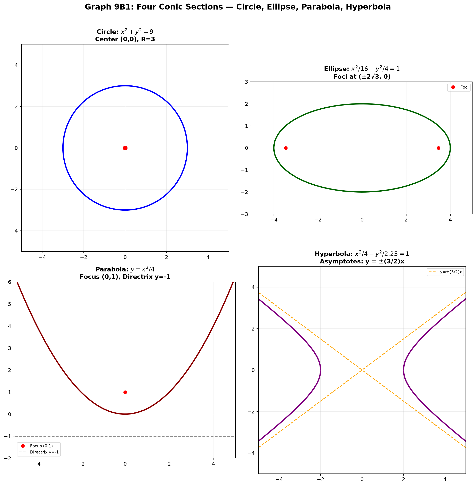
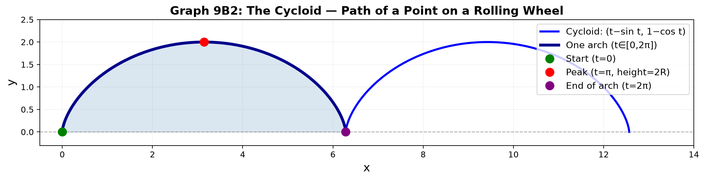
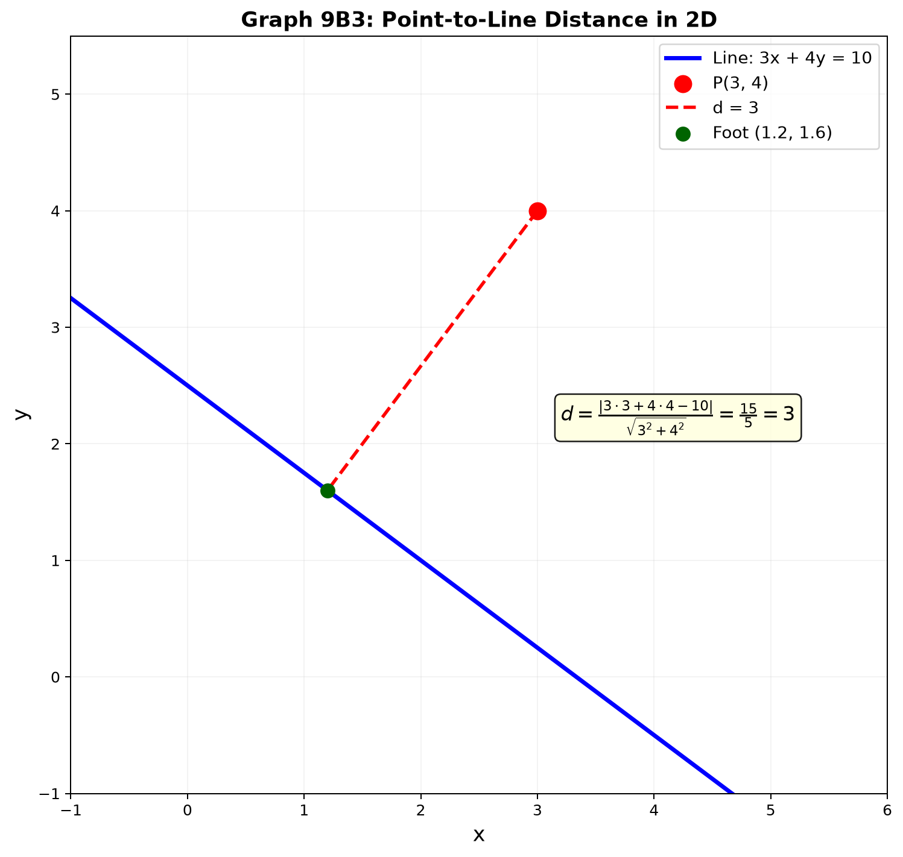

# Session 9B: 2D Geometry — Shapes, Symmetry, and Space

**Phase 2 — Classical Techniques | 75 min**

*How functions create shapes. No calculus — pure algebra and geometric reasoning.*

---

## Part A: Composition and Inverse — The Geometry of Reversing

---

## Example 1: Composition as a Two-Stage Pipeline

$f(x)=2x+1$, $g(x)=x^2$.

**$(f \circ g)(x) = f(g(x))$**: ① Square it → $x^2$. ② Double and add 1 → $2x^2+1$.

**$(g \circ f)(x) = g(f(x))$**: ① Double and add 1 → $2x+1$. ② Square → $(2x+1)^2 = 4x^2+4x+1$.

Different results! Composition is not commutative: $f\circ g \neq g\circ f$ in general.

**Geometric view**: $g$ warps the $x$-values, then $f$ warps the output. Each function is a transformation of the number line.

---

## Example 2: Composition Shrinks the Domain

$f(x)=\sqrt{x}$, $g(x)=x-3$.

**$f \circ g$**: $\sqrt{x-3}$. Inner $g$ needs no restriction, but $f$ only accepts $\geq 0$.
$x-3 \geq 0 \to x \geq 3$. Domain shrinks to $[3,\infty)$.

**$g \circ f$**: $\sqrt{x} - 3$. $f$ first: needs $x \geq 0$. $g$ accepts anything. Domain stays $[0,\infty)$.

**Rule**: The inner function's range must fit inside the outer function's domain.

---

## Example 3: Inverse — Swap Input and Output, Reflect Across $y=x$

$f(x) = 3x-6$.

① Write $y=3x-6$. ② Solve for $x$: $x = \frac{y+6}{3}$. ③ Swap $x$ and $y$: $f^{-1}(x) = \frac{x+6}{3}$.

**Geometric meaning**: Every point $(a,b)$ on $f$ becomes $(b,a)$ on $f^{-1}$. The graph of $f^{-1}$ is the reflection of $f$ across the line $y=x$.

---

## Example 4: Rational Inverse

$f(x) = \frac{2x+1}{x-3}$.

① $y(x-3) = 2x+1$. ② $yx - 3y = 2x + 1$. ③ $yx - 2x = 3y + 1$. ④ $x(y-2) = 3y+1$. ⑤ $x = \frac{3y+1}{y-2}$. ⑥ $f^{-1}(x) = \frac{3x+1}{x-2}$.

---

## Example 5: When You Must Snip the Domain

$f(x)=x^2$. Push in $2 \to 4$. Push in $-2 \to 4$. Two inputs → one output. No inverse unless we restrict.

**Snip to right half**: domain $[0,\infty)$ → inverse $f^{-1}(x)=\sqrt{x}$.
**Snip to left half**: domain $(-\infty,0]$ → inverse $f^{-1}(x)=-\sqrt{x}$.

**One-to-one test (horizontal line test)**: If any horizontal line crosses the graph more than once, the function is not invertible until you restrict the domain.


*Graph 9B4: f(x)=2x+1 (blue) and its inverse f⁻¹(x)=(x-1)/2 (red). Every point (a,b) on f becomes (b,a) on f⁻¹, reflected across the dashed line y=x.*

---

## Part B: Symmetry — The Two Mirror Types

---

## Example 6: Even Functions — $y$-Axis Mirror

$f(-x) = f(x)$ for all $x$ in the domain. The right half determines the left half.

$f(x) = x^2$, $f(x) = \cos x$, $f(x) = |x|$, $f(x) = \frac{1}{x^2+1}$.

**Test**: Replace $x$ with $-x$. If the formula doesn't change, it's even.
**Drawing trick**: Draw only $x \geq 0$, then mirror across the $y$-axis.

---

## Example 7: Odd Functions — Origin Rotation

$f(-x) = -f(x)$ for all $x$. The graph spins 180° around the origin onto itself.

$f(x) = x^3$, $f(x) = \sin x$, $f(x) = \frac{1}{x}$, $f(x) = x|x|$.

**Test**: Replace $x$ with $-x$. If you get $-f(x)$, it's odd.
**Drawing trick**: Draw only $x \geq 0$, then rotate 180° around the origin for $x<0$.

**Key fact**: Every function decomposes into even + odd:
$f(x) = \underbrace{\frac{f(x)+f(-x)}{2}}_{\text{even}} + \underbrace{\frac{f(x)-f(-x)}{2}}_{\text{odd}}$.

---

## Part C: Conic Sections — The Four Classic Shapes

> Cut a double cone with a plane at different angles. Four shapes emerge.

---

## Example 8: The Circle — Constant Distance from a Center

**Equation**: $(x-h)^2 + (y-k)^2 = R^2$. Center $(h,k)$, radius $R$.

$x^2 + y^2 = 25$: center $(0,0)$, radius $5$.

**Not a function** (fails vertical line test). But we understand it geometrically: all points exactly 5 units from the origin.

**General form**: $x^2 + y^2 + Dx + Ey + F = 0$. Complete the square in both $x$ and $y$ to find center and radius.

---

## Example 9: The Ellipse — Stretched Circle

**Equation**: $\frac{(x-h)^2}{a^2} + \frac{(y-k)^2}{b^2} = 1$.

$a$ = semi-major axis (horizontal radius). $b$ = semi-minor axis (vertical radius).

$\frac{x^2}{16} + \frac{y^2}{9} = 1$: extends $\pm4$ horizontally, $\pm3$ vertically.

**Geometric definition**: All points where the sum of distances to two fixed foci is constant.

**Eccentricity**: $e = \sqrt{1 - \frac{b^2}{a^2}}$ ($a \geq b$). $e=0$ = circle, $e \to 1$ = very flat.

---

## Example 10: The Parabola — Focus and Directrix

**Equation (vertical)**: $y = \frac{1}{4p}(x-h)^2 + k$. Vertex $(h,k)$. Focus at $(h, k+p)$. Directrix $y = k-p$.

$y = \frac{1}{2}x^2$: $4p = 2 \to p = \frac{1}{2}$. Vertex $(0,0)$, focus $(0,\frac{1}{2})$, directrix $y = -\frac{1}{2}$.

**Geometric definition**: Every point on the parabola is equidistant from the focus and the directrix.

---

## Example 11: The Hyperbola — Two Mirrored Branches

**Equation**: $\frac{(x-h)^2}{a^2} - \frac{(y-k)^2}{b^2} = 1$ (horizontal opening).

**Asymptotes**: $y-k = \pm\frac{b}{a}(x-h)$. The branches hug these lines as $x \to \pm\infty$.

$\frac{x^2}{4} - \frac{y^2}{9} = 1$: opens left/right. Asymptotes $y = \pm\frac{3}{2}x$.

**Geometric definition**: All points where the absolute difference of distances to two foci is constant.

---

## Example 12: Identifying Conics from General Form

$Ax^2 + Bxy + Cy^2 + Dx + Ey + F = 0$.

| Discriminant $B^2-4AC$ | Type |
|:----------------------:|:----:|
| $< 0$ | Ellipse (or circle if $A=C$) |
| $= 0$ | Parabola |
| $> 0$ | Hyperbola |

**Example**: $x^2 + 4y^2 - 6x + 8y + 9 = 0$. $B=0$, $A=1$, $C=4$. $B^2-4AC = -16 < 0$ → Ellipse.
Complete squares: $(x-3)^2 + 4(y+1)^2 = 4$ → $\frac{(x-3)^2}{4} + \frac{(y+1)^2}{1} = 1$.



*Graph 9B1: The four conic sections with their key features labeled — foci, directrix, asymptotes. All arise from cutting a double cone at different angles.*

---

## Part D: Parametric Curves — Describing Motion

---

## Example 13: Parametric Circle and Ellipse

**Circle**: $(x(t), y(t)) = (R\cos t,\; R\sin t)$, $t \in [0, 2\pi]$.

**Ellipse**: $(x(t), y(t)) = (a\cos t,\; b\sin t)$, $t \in [0, 2\pi]$.

As $t$ runs from $0$ to $2\pi$, the point traces the curve counterclockwise. The parameter $t$ is not the angle of the point — it's the angle in the "unwrapped" circle.

---

## Example 14: The Cycloid — A Wheel's Path

A point on a rolling wheel of radius $R$ traces:
$(x(t), y(t)) = (R(t - \sin t),\; R(1 - \cos t))$, $t \geq 0$.

One arch: $t \in [0, 2\pi]$. The point starts at $(0,0)$, rises to height $2R$, and returns to the $x$-axis at $(2\pi R, 0)$.



*Graph 9B2: Two arches of the cycloid. The blue arch (t∈[0,2π]) shows one full rotation. The peak reaches height 2R. The base spans 2πR.*

---

## Part E: Distance in 2D — Point, Line, Curve

---

## Example 15: Point-to-Line Distance

Point $(x_0, y_0)$ to line $ax + by + c = 0$:

$d = \frac{|ax_0 + by_0 + c|}{\sqrt{a^2 + b^2}}$.

$(3,4)$ to $3x + 4y - 10 = 0$: $d = \frac{|9+16-10|}{5} = \frac{15}{5} = 3$.



*Graph 9B3: The shortest distance from P(3,4) to the line 3x+4y=10 is the perpendicular segment (red dashed). The foot is at (1.2, 1.6). Distance = 3.*

**Why it works**: The numerator is how "wrong" the line equation is at that point. The denominator normalizes for the line's steepness.

---

## Example 16: Distance Between Two Curves — Shortest Gap

The shortest distance between $y = f(x)$ and $y = g(x)$ is the minimum of $\sqrt{(x_1-x_2)^2 + (f(x_1)-g(x_2))^2}$.

For simple cases, the shortest segment is perpendicular to both curves.

**Example**: Distance between $y = x^2$ and $y = x-1$. The line connecting closest points is perpendicular to $y=x-1$. But without calculus, we can estimate by trying values: at $x=0.5$, curves at $(0.5,0.25)$ and $(0.5,-0.5)$, distance $0.75$.

---

## Example 17: Point-to-Circle Distance

Point $(x_0, y_0)$ to circle center $(h,k)$, radius $R$:
Distance = $|\sqrt{(x_0-h)^2 + (y_0-k)^2} - R|$.

$(5,0)$ to circle $x^2+y^2=9$: distance to center is $5$, subtract radius $3$ → $2$.

If the point is inside: subtract the distance from $R$ instead.

> **Up to here**: Composition = pipeline. Inverse = $y=x$ reflection. Even/odd symmetry.
> Conics: circle (constant radius), ellipse (sum to foci), parabola (focus=directrix), hyperbola (difference to foci).
> Parametric curves describe motion. Distance formulas in 2D.

---

## Common Mistakes

### Mistake 1: $(f\circ g)^{-1} = f^{-1}\circ g^{-1}$

**Wrong**. The inverse reverses the order: $(f\circ g)^{-1} = g^{-1} \circ f^{-1}$. Socks then shoes → shoes off then socks off.

### Mistake 2: Treating a circle as a function

**Wrong**: "Let $f(x) = \pm\sqrt{25-x^2}$." **Right**: A circle is not a function of $x$. Solve implicitly or use parametric form.

### Mistake 3: Confusing $a$ and $b$ in ellipse

**Wrong**: Always $a > b$. **Right**: $a$ is the denominator under $(x-h)^2$ regardless of size. The major axis is the longer one — it could be vertical if $b > a$. Check which denominator is bigger.

---

## What We Just Did

```
(1) Composition: inside→outside pipeline. Inverse: reflect across y=x.
    Snip domain if not one-to-one.

(2) Conic sections: circle, ellipse, parabola, hyperbola.
    Each has a geometric definition beyond its equation.

(3) Parametric curves: (x(t), y(t)) describes motion.
    Circle, ellipse, cycloid.

(4) Distance: point-to-line, point-to-circle, between curves.
    Perpendicular = shortest.
```

---

## Practice 1

Find $(f \circ g)(x)$ and $(g \circ f)(x)$ for $f(x)=\frac{1}{x}$, $g(x)=x^2+1$. State the domain of each composition.

→ Reference: **Example 1, 2**

> Solutions: [Solutions](solutions/9B-solutions.md#practice-1)

---

## Practice 2

Find the inverse of $f(x) = \frac{3x-1}{x+4}$.

→ Reference: **Example 4**

> Solutions: [Solutions](solutions/9B-solutions.md#practice-2)

---

## Practice 3

Classify each conic and find its key features:
(a) $x^2 + y^2 - 4x + 6y - 3 = 0$
(b) $4x^2 + 9y^2 = 36$
(c) $y^2 - x^2 = 4$

→ Reference: **Examples 8-12**

> Solutions: [Solutions](solutions/9B-solutions.md#practice-3)

---

## Practice 4

Find the distance from $(3, 1)$ to the line $4x + 3y = 10$.

→ Reference: **Example 15**

> Solutions: [Solutions](solutions/9B-solutions.md#practice-4)

---

## Practice 5

A point moves as $(x(t), y(t)) = (3\cos t,\; 2\sin t)$ for $t \in [0, 2\pi]$. What shape does it trace? Where is the point at $t = \pi/3$?

→ Reference: **Example 13**

> Solutions: [Solutions](solutions/9B-solutions.md#practice-5)

---

## Practice 6: Real Battle

Find the shortest distance from the origin to the line that is tangent to the circle $(x-3)^2 + (y-4)^2 = 1$ at its closest point to the origin. (Hint: the closest point on the circle lies on the line from origin to center.)

→ Reference: **Example 8, 15, 17**

> Solutions: [Solutions](solutions/9B-solutions.md#practice-6)

---

## Basic Algebra Drill — 2D Geometry (10 Problems)

> Pure computation.

**D1.** If $f(x)=3x-2$ and $g(x)=\sqrt{x}$, find $(f \circ g)(4)$.

**D2.** Find the inverse of $f(x)=5x+2$. Verify that $f(f^{-1}(x)) = x$.

**D3.** Is $f(x) = x^4 - 3x^2$ even, odd, or neither? Show your test.

**D4.** Find the center and radius of $x^2 + y^2 + 6x - 10y + 18 = 0$.

**D5.** Find the vertices and foci of $\frac{x^2}{25} + \frac{y^2}{16} = 1$.

**D6.** Find the vertex and focus of $y = \frac{1}{8}x^2$.

**D7.** Find the asymptotes of $\frac{x^2}{9} - \frac{y^2}{4} = 1$.

**D8.** Parametrize a circle of radius 5 centered at $(2,-3)$.

**D9.** Find the distance from $(-1, 5)$ to the line $2x - y + 3 = 0$.

**D10.** A point moves as $(x(t), y(t)) = (2\cos t,\; 2\sin t)$. At what $t$ values is $y = \sqrt{2}$?

> Solutions: [Solutions](solutions/9B-solutions.md#basic-drill)

---

## Advanced Algebra Drill — 2D Geometry (10 Problems)

> Multi-step geometric reasoning.

**A1.** Show that $(f \circ g)^{-1}(x) = (g^{-1} \circ f^{-1})(x)$ for $f(x)=2x+1$, $g(x)=x^3$.

**A2.** Decompose $f(x) = e^x + e^{-x}$ into its even and odd parts.

**A3.** Find the equation of the parabola with focus $(2, 3)$ and directrix $y = -1$.

**A4.** A hyperbola has asymptotes $y = \pm\frac{2}{3}x$ and passes through $(3, 0)$. Find its equation.

**A5.** Find the distance between the two parallel lines $3x + 4y - 5 = 0$ and $3x + 4y + 15 = 0$.

**A6.** Find the point on the circle $x^2 + y^2 = 25$ that is closest to $(7, 1)$.

**A7.** The parametric curve $(x(t), y(t)) = (t^2, t^3)$ is called a semicubical parabola. At what $t$ does it pass through $(4, 8)$? Eliminate $t$ to find the Cartesian equation.

**A8.** A line through $(1, 2)$ with slope $m$ intersects the circle $x^2 + y^2 = 5$ at two points. For what values of $m$ is the line tangent (only one intersection)?

**A9.** Find the equation of the ellipse with foci at $(\pm3, 0)$ that passes through $(0, 4)$.

**A10.** Four points form a quadrilateral: $(0,0)$, $(6,0)$, $(4,4)$, $(0,3)$. Is $(2,2)$ inside it? Use distance/area reasoning.

> Solutions: [Solutions](solutions/9B-solutions.md#advanced-drill)

---

## Today's Procedure

```
Step 1: Composition = two-stage transformation. Inverse = swap + reflect across y=x.
         Snip domain if not one-to-one.

Step 2: Conic sections — four shapes from one double cone.
         Circle (R constant), ellipse (sum to foci), parabola (focus=directrix),
         hyperbola (difference to foci). Identify by discriminant B²-4AC.

Step 3: Distance — point-to-line formula. Point-to-circle = |distance to center - R|.
         Parametric curves: (x(t), y(t)) = motion in the plane.
```

---

## Terminology

| What we call it | Math term | Notation |
|:---------------:|:---------:|:--------:|
| connecting functions | composition | $(f\circ g)(x)$ |
| swapping input/output | inverse function | $f^{-1}(x)$ |
| $y$-axis mirror | even function | $f(-x)=f(x)$ |
| origin rotation | odd function | $f(-x)=-f(x)$ |
| one-to-one | injective | horizontal line test |
| circle/ellipse/parabola/hyperbola | conic sections | from $Ax^2+Bxy+Cy^2+\cdots=0$ |
| focus, directrix | focus, directrix | geometric definition |
| eccentricity | eccentricity | $e$ (0=circle, 0<e<1=ellipse, e=1=parabola, e>1=hyperbola) |
| parametric curve | parametric equations | $(x(t), y(t))$ |
| shortest distance | distance formula | $d = \frac{\vert ax_0+by_0+c\vert}{\sqrt{a^2+b^2}}$ |
