# Session 9B: 2D Geometry — Lines, Conics, Distance, and Shape

**Phase 2 — Classical Techniques | 90 min**

*Lines form the alphabet, conics form the words, and distance binds them all. Pure algebra, systematic geometric reasoning — no calculus required.*

> **Prerequisite**: 9A1 (function fundamentals), 9A2 (graph drawing toolkit). Composition, inverse, even/odd symmetry, and transformations are assumed. If you need review, see 9A1 Parts E–J.

---

## Part A: The Line — All Five Forms, All Properties

> A line is the simplest geometric object. Master every way to write it and every way to measure it.

---

## Example 1: The Five Forms of a Line — When to Use Each

A line through $(x_1,y_1)$ with slope $m$. Five ways to write it — each suited to a different task.

| # | Form | Equation | Best used for |
|:--:|:-----:|:--------:|:-------------|
| ① | **Slope-intercept** | $y = mx + b$ | Quick graphing, reading slope and $y$-intercept |
| ② | **Point-slope** | $y - y_1 = m(x - x_1)$ | Building from one point + slope |
| ③ | **Two-point** | $\frac{y-y_1}{x-x_1} = \frac{y_2-y_1}{x_2-x_1}$ | Building from two known points |
| ④ | **Intercept** | $\frac{x}{a} + \frac{y}{b} = 1$ | When $x$- and $y$-intercepts are known |
| ⑤ | **General** | $Ax + By + C = 0$ | Distance formulas, intersection, systems |

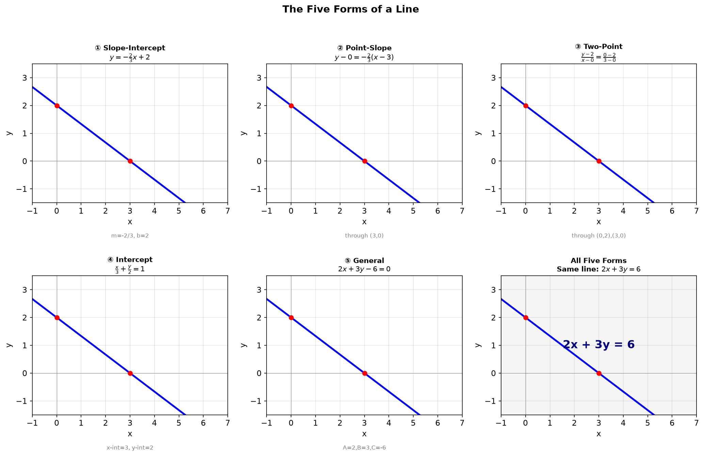

*Graph 9B-A1: The same line $2x+3y=6$ expressed in all five forms. Each form highlights a different feature — slope, intercepts, points, or the normal vector.*

---

## Example 2: Converting Between Forms — A Single Line, Many Faces

Line through $(2, 1)$ with slope $m = \frac{3}{4}$.

**① Point-slope** (start here): $y - 1 = \frac{3}{4}(x - 2)$.

**② Slope-intercept** (solve for $y$): $y = \frac{3}{4}x - \frac{3}{2} + 1 = \frac{3}{4}x - \frac{1}{2}$.
→ $m = \frac{3}{4}$, $b = -\frac{1}{2}$.

**③ General** (multiply by 4, move all to one side): $4y = 3x - 2$ → $3x - 4y - 2 = 0$.
→ $A=3$, $B=-4$, $C=-2$. Normal vector: $(3, -4)$.

**④ Intercept** (find where $x=0$ and $y=0$):
$x=0$: $y = -\frac{1}{2}$ → $b = -\frac{1}{2}$.
$y=0$: $0 = \frac{3}{4}x - \frac{1}{2}$ → $x = \frac{2}{3}$ → $a = \frac{2}{3}$.
Form: $\frac{x}{2/3} + \frac{y}{-1/2} = 1$, or $\frac{3x}{2} - 2y = 1$.

**⑤ Two-point** (pick any two points):
At $x=2$: $y=1$ → $(2,1)$. At $x=6$: $y=4$ → $(6,4)$.
$\frac{y-1}{x-2} = \frac{4-1}{6-2} = \frac{3}{4}$.

> **Every form contains the same line.** Converting between them is a core skill — each form solves a different type of problem.

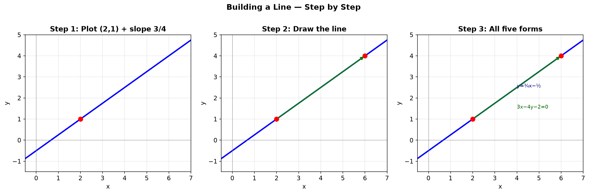

*Graph 9B-S1: Building a line in three steps. Step 1 — Plot point (2,1) and use slope 3/4 to find a second point. Step 2 — Draw the line. Step 3 — Label all five forms on the same line.*

---

## Example 3: Slope as a Rate — Rise Over Run, Angle, and Parallelism

**Slope definition**: $m = \frac{\Delta y}{\Delta x} = \frac{y_2 - y_1}{x_2 - x_1}$.

**Slope from angle**: $m = \tan\theta$, where $\theta$ is the angle the line makes with the positive $x$-axis.
- $m > 0$: line rises left to right ($0° < \theta < 90°$).
- $m < 0$: line falls left to right ($90° < \theta < 180°$).
- $m = 0$: horizontal ($\theta = 0°$).
- $m$ undefined: vertical ($\theta = 90°$).

**Parallel lines**: $m_1 = m_2$ (same slope, same steepness).
$y = 2x + 1$ and $y = 2x - 5$ are parallel — same slope $2$, different intercepts.

**Perpendicular lines**: $m_1 \cdot m_2 = -1$ (slopes are negative reciprocals).
$y = \frac{2}{3}x$ is perpendicular to $y = -\frac{3}{2}x$, since $\frac{2}{3} \cdot (-\frac{3}{2}) = -1$.

**Why $m_1 m_2 = -1$?** Rotating a line by $90°$ sends $\Delta x \to -\Delta y$ and $\Delta y \to \Delta x$, so the new slope is $-\frac{1}{m}$.

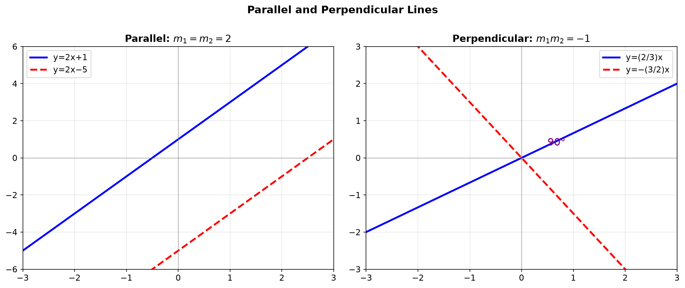

*Graph 9B-A2: Left — Two parallel lines ($m=2$), same steepness, different heights. Right — Two perpendicular lines ($m=2/3$ and $m=-3/2$), the product of slopes equals $-1$.*

---

## Example 4: Angle Between Two Lines

Given two lines with slopes $m_1$ and $m_2$, the acute angle $\phi$ between them:

$$\tan\phi = \left|\frac{m_2 - m_1}{1 + m_1 m_2}\right|$$

**Why this works**: $\tan(\alpha - \beta) = \frac{\tan\alpha - \tan\beta}{1 + \tan\alpha \tan\beta}$. Set $\alpha = \tan^{-1}(m_2)$, $\beta = \tan^{-1}(m_1)$.

**Example**: Between $y = 2x$ ($m_1=2$) and $y = -\frac{1}{3}x$ ($m_2=-\frac{1}{3}$):
$\tan\phi = \left|\frac{-1/3 - 2}{1 + 2(-1/3)}\right| = \left|\frac{-7/3}{1 - 2/3}\right| = \left|\frac{-7/3}{1/3}\right| = 7$.
$\phi = \tan^{-1}(7) \approx 81.9°$.

**Special cases**:
- If $1 + m_1 m_2 = 0$ (denominator zero), the lines are **perpendicular** ($\phi = 90°$).
- If $m_1 = m_2$ (numerator zero), the lines are **parallel** ($\phi = 0°$).

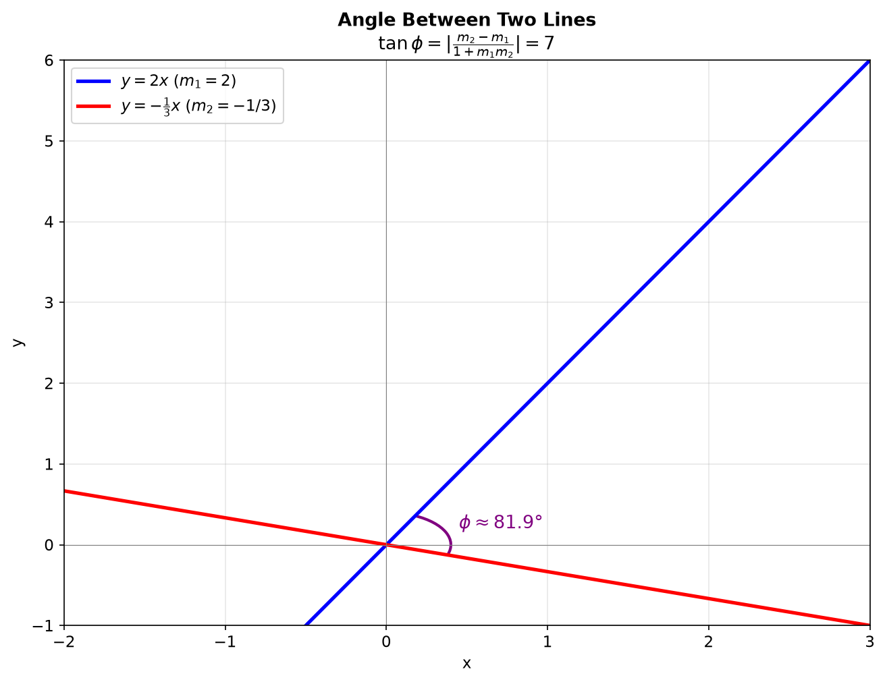

*Graph 9B-A3: The angle $\phi$ between lines $y=2x$ and $y=-x/3$ is $\tan^{-1}(7) \approx 81.9°$. The formula comes from the tangent subtraction identity.*

---

## Example 5: Midpoint and Section Formula — Dividing a Segment

**Midpoint** of $(x_1, y_1)$ and $(x_2, y_2)$:
$$M = \left(\frac{x_1 + x_2}{2},\; \frac{y_1 + y_2}{2}\right)$$

$(2, 5)$ and $(8, -1)$ → midpoint $(5, 2)$.

**Section formula** — point that divides the segment in ratio $m:n$ (from $(x_1,y_1)$ to $(x_2,y_2)$):
$$P = \left(\frac{mx_2 + nx_1}{m+n},\; \frac{my_2 + ny_1}{m+n}\right)$$

$(1, 2)$ to $(7, 8)$, ratio $2:1$ from the first point:
$P = \left(\frac{2(7)+1(1)}{3},\; \frac{2(8)+1(2)}{3}\right) = (5, 6)$.

**Centroid of a triangle** (average of vertices): $G = \left(\frac{x_1+x_2+x_3}{3},\; \frac{y_1+y_2+y_3}{3}\right)$.

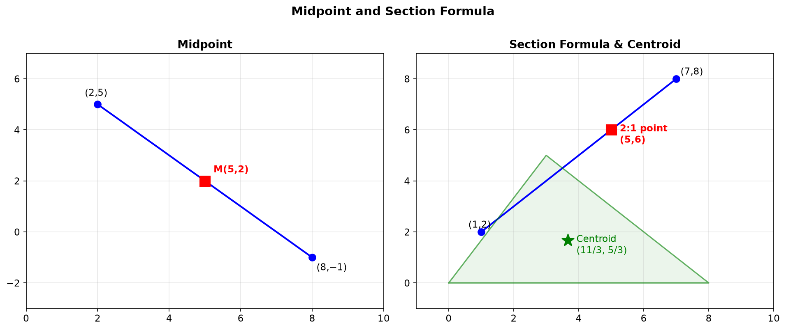

*Graph 9B-A4: Left — Midpoint bisects the segment. Right — Section formula divides the segment in ratio 2:1. The centroid of the triangle is the average of its three vertices.*

---

> **Up to here (Part A)** : Five line forms — slope-intercept, point-slope, two-point, intercept, general. Parallel ($m_1=m_2$), perpendicular ($m_1 m_2=-1$). Angle between lines. Midpoint and section formula.

---

## Part B: Distance in 2D — Systematic Methods

> Distance is geometry's fundamental measure. Two points, point-to-line, line-to-line, point-to-curve — each has a formula derived from a single principle: the shortest path is perpendicular.

---

## Example 6: Point-to-Point — The Pythagorean Foundation

$d = \sqrt{(x_2-x_1)^2 + (y_2-y_1)^2}$.

$(3, 1)$ to $(7, 4)$: $d = \sqrt{4^2 + 3^2} = \sqrt{16+9} = 5$.

This is a 3-4-5 right triangle — the distance formula **is** the Pythagorean theorem.

---

## Example 7: Point-to-Line — Deriving the Formula

Point $(x_0, y_0)$ to line $Ax + By + C = 0$:

$$d = \frac{|Ax_0 + By_0 + C|}{\sqrt{A^2 + B^2}}$$

**Where does this come from?**
① The shortest segment from the point to the line is **perpendicular** to the line.
② The normal vector $\vec{n} = (A, B)$ points perpendicular to the line.
③ Project the vector from any point on the line to $(x_0, y_0)$ onto the normal direction.
④ The length of this projection is $\frac{|Ax_0 + By_0 + C|}{\sqrt{A^2 + B^2}}$.

**Example**: $(3, 4)$ to $3x + 4y - 10 = 0$.
$d = \frac{|3(3) + 4(4) - 10|}{\sqrt{3^2 + 4^2}} = \frac{|9 + 16 - 10|}{5} = \frac{15}{5} = 3$.

**Numerator intuition**: $Ax_0 + By_0 + C$ measures how "wrong" the point is — plug it into the line equation. If the point lies on the line, the expression equals $0$ and $d = 0$.

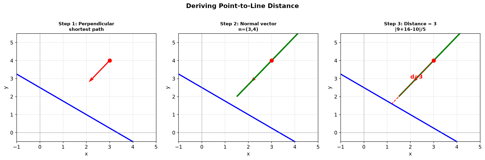

*Graph 9B-B1: Deriving the point-to-line distance formula. Step 1 — The shortest path is perpendicular (red dashed). Step 2 — The normal vector (A,B) points perpendicular to the line. Step 3 — The distance is the projection length.*

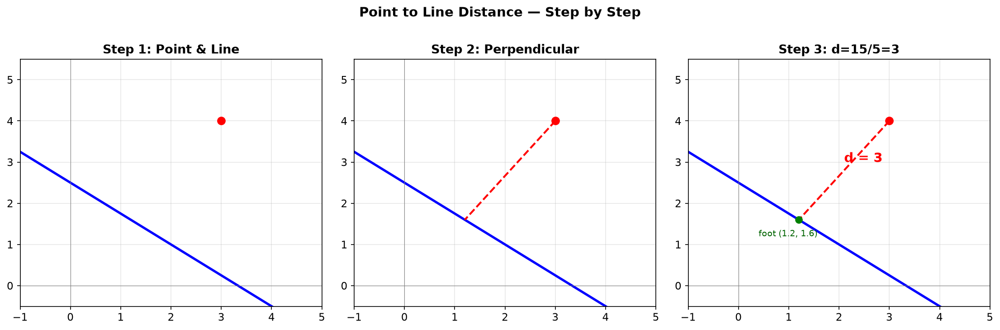

*Graph 9B-S2: Computing distance from (3,4) to 3x+4y=10 in three steps. Step 1 — Plot point and line. Step 2 — Draw perpendicular segment. Step 3 — Apply formula: |9+16−10|/5 = 3. The foot of the perpendicular is at (1.2, 1.6).*

---

## Example 8: Distance Between Two Parallel Lines

For parallel lines $Ax + By + C_1 = 0$ and $Ax + By + C_2 = 0$ (same $A, B$ — same normal, thus parallel):

$$d = \frac{|C_2 - C_1|}{\sqrt{A^2 + B^2}}$$

$3x + 4y - 5 = 0$ and $3x + 4y + 15 = 0$:
$d = \frac{|15 - (-5)|}{\sqrt{9 + 16}} = \frac{20}{5} = 4$.

**Why this works**: Pick any point on the first line, compute its distance to the second. The result is independent of which point you pick — hence the clean formula.

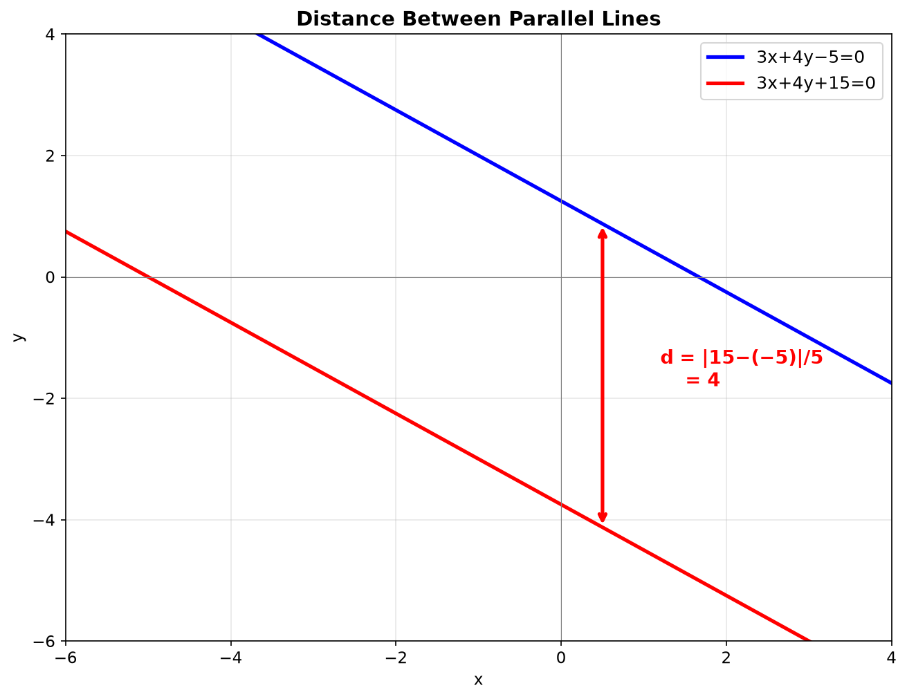

*Graph 9B-B2: Two parallel lines $3x+4y-5=0$ and $3x+4y+15=0$ are 4 units apart. The perpendicular segment (red dashed) has length $|15-(-5)|/5 = 4$.*

---

## Example 9: Point-to-Circle Distance

Point $P(x_0, y_0)$ to circle center $C(h,k)$, radius $R$:

$$d = \bigl|\;\text{dist}(P, C) - R\;\bigr|$$

**Case 1 — Point outside**: $d = \text{dist}(P, C) - R$. The closest point lies on the line $PC$.
$(5, 0)$ to circle $x^2 + y^2 = 9$: $\text{dist}(P, C) = 5$, $R = 3$. $d = 5 - 3 = 2$.

**Case 2 — Point inside**: $d = R - \text{dist}(P, C)$.
$(1, 0)$ to circle $x^2 + y^2 = 9$: $\text{dist}(P, C) = 1$, $R = 3$. $d = 3 - 1 = 2$.

**Case 3 — Point on the circle**: $d = 0$.

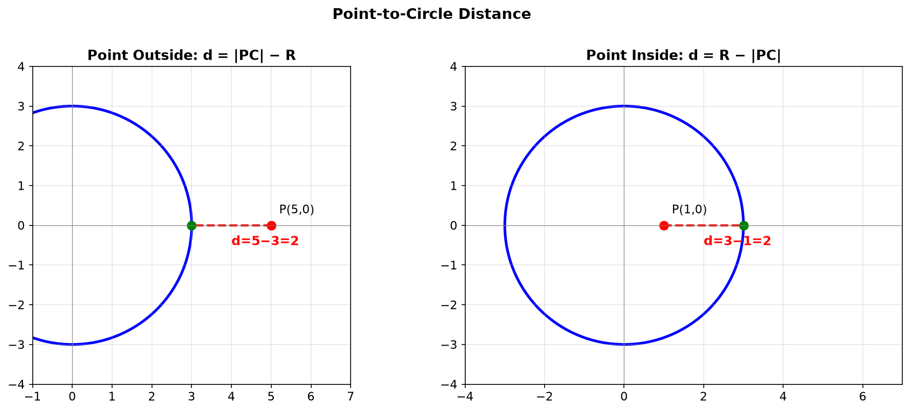

*Graph 9B-B3: Left — P(5,0) outside the circle, distance = 5−3 = 2. Right — P(1,0) inside, distance = 3−1 = 2. The shortest path always passes through the center.*

---

## Example 10: Tangent Lines to a Circle from an External Point

From point $P(x_0, y_0)$ outside circle $(x-h)^2 + (y-k)^2 = R^2$, two tangent lines can be drawn.

**Method**:
① The tangent point $T$ satisfies: $PT \perp CT$ (radius to tangent point is perpendicular to tangent).
② So $\triangle PTC$ is right-angled at $T$, with $PC$ as hypotenuse.
③ $PT = \sqrt{PC^2 - R^2}$ (length of tangent segment).
④ Find $T$ by solving $(x-h)^2 + (y-k)^2 = R^2$ and the perpendicular condition simultaneously.

**Example**: From $P(5, 0)$ to $x^2 + y^2 = 4$ (center $(0,0)$, $R=2$):
$PC = 5$, $PT = \sqrt{25 - 4} = \sqrt{21}$.
The tangent points satisfy $x^2 + y^2 = 4$ and the line from $(0,0)$ to $(x,y)$ being perpendicular to the line from $(5,0)$ to $(x,y)$.
Solving: $T = \left(\frac{4}{5}, \pm\frac{2\sqrt{21}}{5}\right)$.

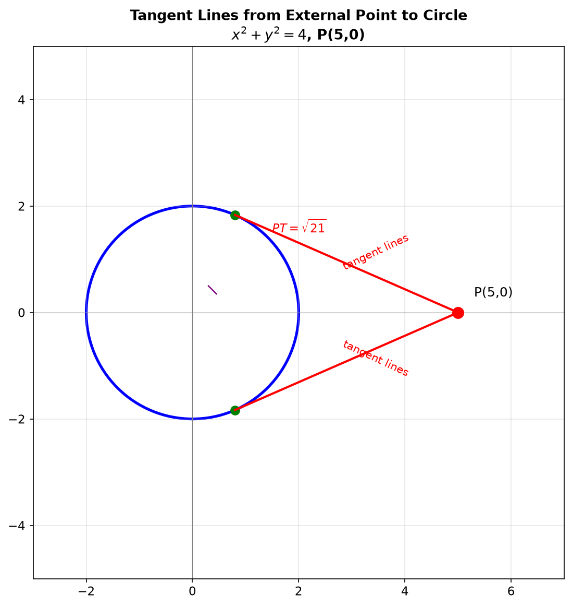

*Graph 9B-B4: From P(5,0), two tangent lines touch the circle $x^2+y^2=4$ at symmetric points. The tangent length is $\sqrt{21} \approx 4.58$. Right triangles at each tangent point.*

---

> **Up to here (Part B)** : Point-to-point (Pythagoras). Point-to-line (perpendicular projection). Parallel lines distance. Point-to-circle. Tangent lines from external point.

---

## Part C: Conic Sections — Deep Derivation

> Cut a double cone with a plane at different angles. Four shapes emerge. Each has both an algebraic equation AND a geometric definition. Understanding both is the key.

---

## Example 11: The Circle — Constant Distance from Center

**Equation**: $(x-h)^2 + (y-k)^2 = R^2$.
**Geometric definition**: All points exactly $R$ units from center $(h,k)$.

**General form**: $x^2 + y^2 + Dx + Ey + F = 0$.
Complete the square in both $x$ and $y$ to recover center and radius.

**Example**: $x^2 + y^2 - 6x + 4y - 3 = 0$.
$(x^2 - 6x) + (y^2 + 4y) = 3$.
$(x^2 - 6x + 9) + (y^2 + 4y + 4) = 3 + 9 + 4$.
$(x-3)^2 + (y+2)^2 = 16$. Center $(3, -2)$, radius $4$.

**Circle through three points**: Solve a $3 \times 3$ system. If the points are $(x_1,y_1)$, $(x_2,y_2)$, $(x_3,y_3)$, plug each into $x^2+y^2+Dx+Ey+F=0$ and solve for $D, E, F$.

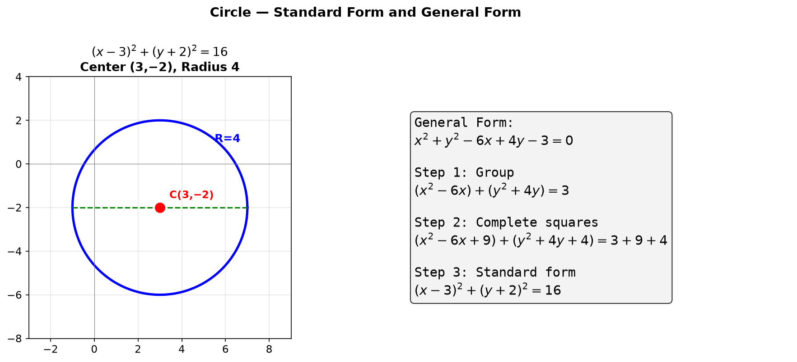

*Graph 9B-C1: Circle $(x-3)^2+(y+2)^2=16$ with center (3,−2) and radius 4. The general form $x^2+y^2-6x+4y-3=0$ converts to standard form by completing the square in both x and y.*

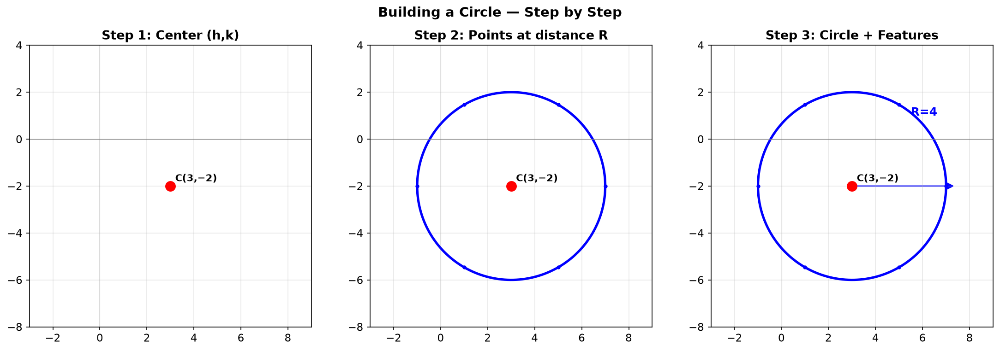

*Graph 9B-S3: Building a circle in three steps. Step 1 — Mark center (h,k). Step 2 — Draw all points at distance R. Step 3 — The circle with key features: center, radius, diameter, and the fact that $x^2$ and $y^2$ have equal coefficients.*

---

## Example 12: The Ellipse — Sum of Distances to Two Foci Is Constant

**Equation**: $\frac{(x-h)^2}{a^2} + \frac{(y-k)^2}{b^2} = 1$, with $a \geq b > 0$.

**Geometric definition**: All points where $\text{dist}(P, F_1) + \text{dist}(P, F_2) = 2a$ (constant).

**Key relationships** (assuming $a \geq b$, major axis horizontal):
- Center: $(h, k)$
- Vertices: $(h \pm a, k)$ — endpoints of major axis
- Co-vertices: $(h, k \pm b)$ — endpoints of minor axis
- Foci: $(h \pm c, k)$ where $c^2 = a^2 - b^2$
- Eccentricity: $e = \frac{c}{a} = \sqrt{1 - \frac{b^2}{a^2}}$, $0 \leq e < 1$

**Why $c^2 = a^2 - b^2$?** For the rightmost vertex $(h+a, k)$:
Distance to right focus = $a-c$, to left focus = $a+c$. Sum = $(a-c) + (a+c) = 2a$. ✓
For the top co-vertex $(h, k+b)$:
Distance to right focus = $\sqrt{c^2 + b^2}$, same to left. Sum = $2\sqrt{c^2+b^2}$.
Set equal to $2a$: $\sqrt{c^2+b^2} = a$ → $c^2 + b^2 = a^2$ → $c^2 = a^2 - b^2$.

**Example**: $\frac{x^2}{25} + \frac{y^2}{9} = 1$.
$a=5$, $b=3$, $c = \sqrt{25-9} = 4$.
Center $(0,0)$, vertices $(\pm5,0)$, co-vertices $(0,\pm3)$, foci $(\pm4,0)$.
Eccentricity $e = \frac{4}{5} = 0.8$.

**What if $b > a$?** Then the major axis is vertical. Swap roles: $c^2 = b^2 - a^2$, foci at $(h, k \pm c)$.

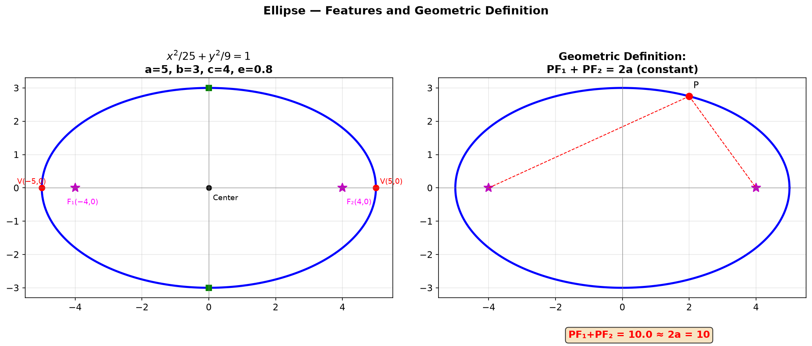

*Graph 9B-C2: Ellipse $x^2/25 + y^2/9 = 1$. Left — All features labeled: center, vertices (±5,0), co-vertices (0,±3), foci (±4,0). Right — The constant-sum property: distance to F₁ + distance to F₂ = 2a = 10 for any point on the ellipse.*

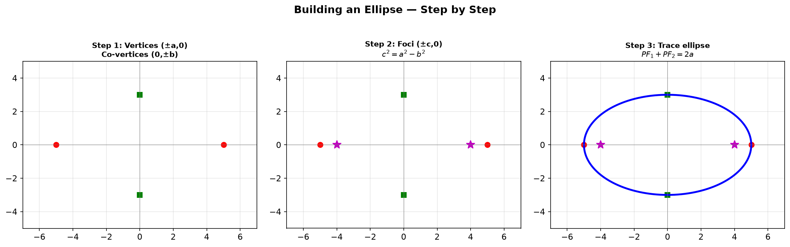

*Graph 9B-S4: Building an ellipse in three steps. Step 1 — Mark center, vertices ($\pm a$), co-vertices ($\pm b$). Step 2 — Mark foci at $(\pm c, 0)$ where $c^2=a^2-b^2$. Step 3 — Trace the ellipse: every point satisfies $PF_1+PF_2=2a$.*

---

## Example 13: The Parabola — Equidistant from Focus and Directrix

**Equation (vertical opening)**: $(x-h)^2 = 4p(y-k)$, or $y = \frac{1}{4p}(x-h)^2 + k$.

**Geometric definition**: Every point is equidistant from the **focus** and the **directrix**.

**Key features** (vertical parabola):
- Vertex: $(h, k)$
- Focus: $(h, k + p)$ — inside the "bowl"
- Directrix: $y = k - p$ — horizontal line behind the vertex
- $p > 0$: opens upward. $p < 0$: opens downward.
- **$|4p|$** is the **focal width** (latus rectum) — the width at the focus.

**Deriving $p$ from $y = ax^2 + bx + c$**:
Complete the square to vertex form $y = a(x-h)^2 + k$.
Then $a = \frac{1}{4p}$, so $p = \frac{1}{4a}$.

**Example**: $y = \frac{1}{2}x^2 - 2x + 3$.
① $y = \frac{1}{2}(x^2 - 4x) + 3 = \frac{1}{2}(x-2)^2 - 2 + 3 = \frac{1}{2}(x-2)^2 + 1$.
② $a = \frac{1}{2}$, so $p = \frac{1}{4(1/2)} = \frac{1}{2}$.
③ Vertex $(2, 1)$, focus $(2, 1.5)$, directrix $y = 0.5$.

**Horizontal parabola**: $(y-k)^2 = 4p(x-h)$. Opens right if $p>0$, left if $p<0$.
Focus $(h+p, k)$, directrix $x = h-p$.

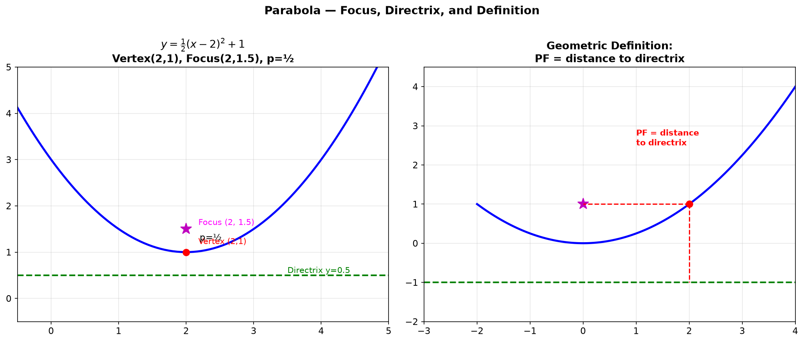

*Graph 9B-C3: Parabola $y = (x-2)^2/2 + 1$. Left — All features: vertex (2,1), focus (2, 1.5), directrix y=0.5, focal width |4p|=2. Right — The equidistance property: for any point on the parabola, distance to focus = distance to directrix.*

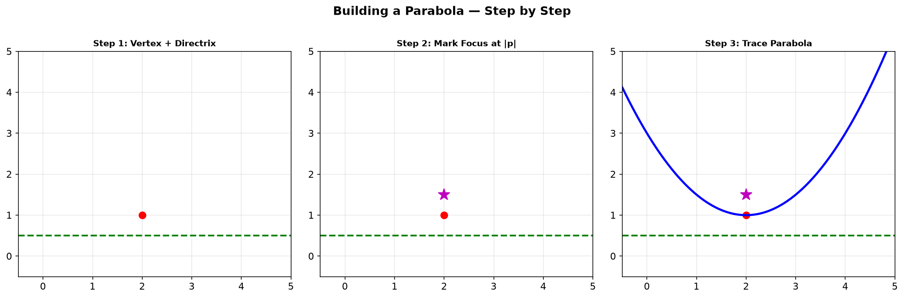

*Graph 9B-S5: Building a parabola in three steps. Step 1 — Mark vertex (h,k) and directrix. Step 2 — Mark focus at distance |p| from vertex. Step 3 — Trace the parabola: every point is equidistant from focus and directrix.*

---

## Example 14: The Hyperbola — Absolute Difference of Distances to Two Foci Is Constant

**Equation (horizontal opening)**: $\frac{(x-h)^2}{a^2} - \frac{(y-k)^2}{b^2} = 1$.

**Geometric definition**: All points where $|\,\text{dist}(P, F_1) - \text{dist}(P, F_2)\,| = 2a$ (constant).

**Key features** (horizontal hyperbola):
- Center: $(h, k)$
- Vertices: $(h \pm a, k)$ — where the curve crosses the transverse axis
- Foci: $(h \pm c, k)$ where $c^2 = a^2 + b^2$
- Asymptotes: $y - k = \pm\frac{b}{a}(x - h)$ — the lines the branches hug at infinity
- Eccentricity: $e = \frac{c}{a} = \sqrt{1 + \frac{b^2}{a^2}}$, $e > 1$

**Why $c^2 = a^2 + b^2$?** For the right vertex $(h+a, k)$:
Distance to right focus = $|a - c|$, to left focus = $a + c$.
Difference = $(a+c) - |a-c|$. Since $c > a$: $|a-c| = c-a$, so difference = $(a+c) - (c-a) = 2a$. ✓

**Asymptote derivation**: As $x, y \to \infty$, the $1$ on the RHS becomes negligible:
$\frac{x^2}{a^2} - \frac{y^2}{b^2} \approx 0$ → $\frac{y^2}{b^2} \approx \frac{x^2}{a^2}$ → $y \approx \pm\frac{b}{a}x$.

**Example**: $\frac{x^2}{9} - \frac{y^2}{4} = 1$.
$a=3$, $b=2$, $c = \sqrt{9+4} = \sqrt{13} \approx 3.61$.
Center $(0,0)$, vertices $(\pm3,0)$, foci $(\pm\sqrt{13},0)$.
Asymptotes: $y = \pm\frac{2}{3}x$.

**Vertical opening**: $\frac{(y-k)^2}{a^2} - \frac{(x-h)^2}{b^2} = 1$. Vertices at $(h, k \pm a)$, asymptotes $y-k = \pm\frac{a}{b}(x-h)$.

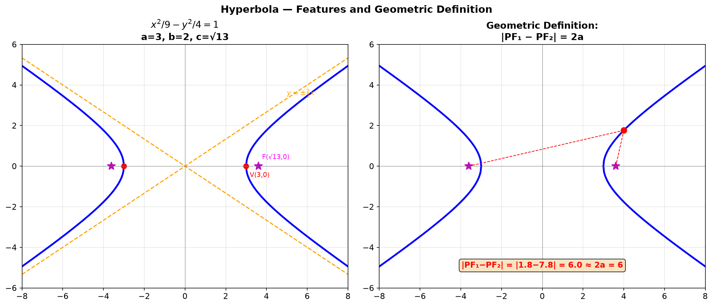

*Graph 9B-C4: Hyperbola $x^2/9 - y^2/4 = 1$. Left — All features: center, vertices (±3,0), foci (±√13,0), asymptotes y=±(2/3)x. Right — The constant-difference property: |PF₁ − PF₂| = 2a = 6.*

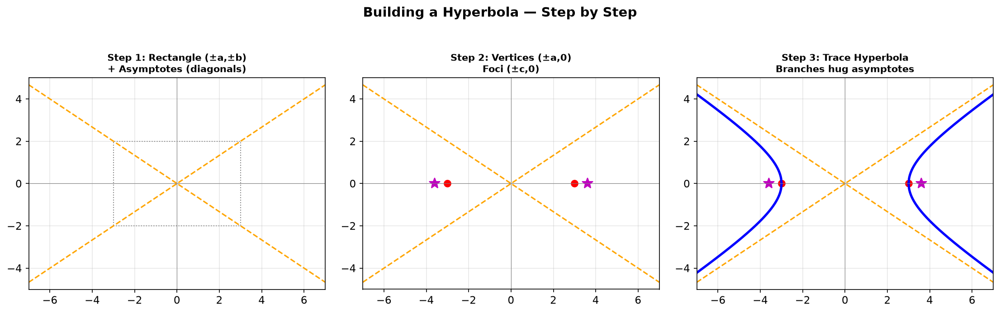

*Graph 9B-S6: Building a hyperbola in three steps. Step 1 — Draw the fundamental rectangle (±a, ±b) and its diagonals (asymptotes). Step 2 — Mark vertices (±a,0) and foci (±c,0). Step 3 — Trace both branches hugging the asymptotes.*

---

## Example 15: Identifying Conics — The Discriminant Method

General second-degree equation: $Ax^2 + Bxy + Cy^2 + Dx + Ey + F = 0$.

**Discriminant**: $\Delta = B^2 - 4AC$.

| $\Delta$ | Type | Special case |
|:--------:|:----:|:------------:|
| $\Delta < 0$ | **Ellipse** | $A = C$ and $B = 0$ → Circle |
| $\Delta = 0$ | **Parabola** | |
| $\Delta > 0$ | **Hyperbola** | |

**How to remember**: Same sign pattern as the discriminant of a quadratic ($b^2-4ac$). Ellipse = no $xy$ crossing (negative), parabola = tangent (zero), hyperbola = crossing (positive).

**Examples**:
- $x^2 + 4y^2 - 6x + 8y + 9 = 0$: $B=0$, $A=1$, $C=4$. $\Delta = 0 - 16 = -16 < 0$ → **Ellipse**.
- $x^2 - y^2 = 4$: $B=0$, $A=1$, $C=-1$. $\Delta = 0 - 4(-1) = 4 > 0$ → **Hyperbola**.
- $y = x^2$: Rewrite as $x^2 - y = 0$. $B=0$, $A=1$, $C=0$. $\Delta = 0$ → **Parabola**.

**Degenerate cases**: If the equation can't be satisfied by real points.
- $x^2 + y^2 = -1$ → no real points (empty set).
- $x^2 - y^2 = 0$ → $(x-y)(x+y)=0$ → two intersecting lines.
- $x^2 = 0$ → a single line ($y$-axis, counted twice).

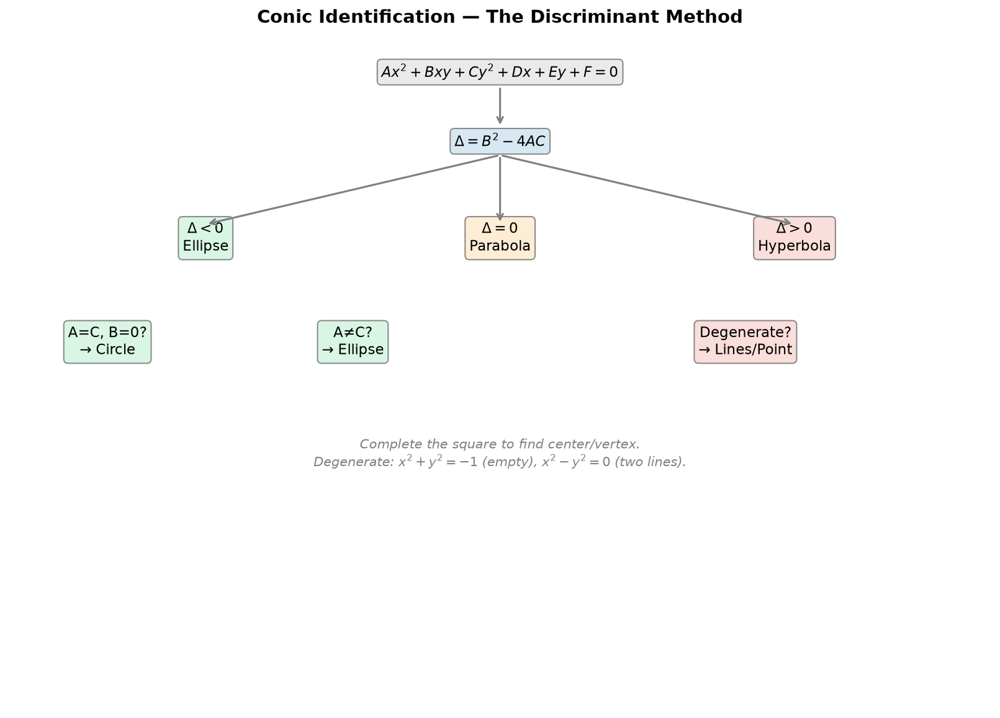

*Graph 9B-C5: Identifying conics by discriminant $B^2-4AC$. Negative → ellipse (or circle). Zero → parabola. Positive → hyperbola. Complete the square to find the center/vertex and specific features.*

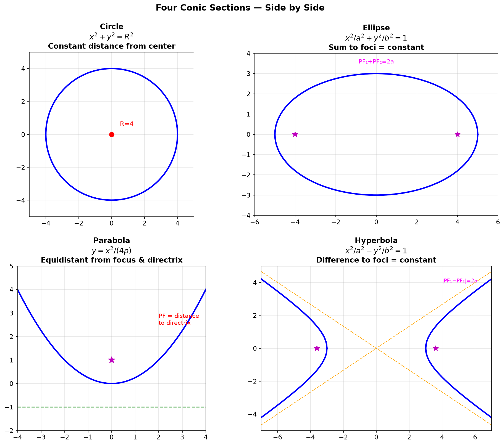

*Graph 9B-C6: All four conic sections compared — Circle ($x^2+y^2=R^2$), Ellipse ($x^2/a^2+y^2/b^2=1$), Parabola ($y=x^2/(4p)$), Hyperbola ($x^2/a^2-y^2/b^2=1$). Each with its geometric definition labeled.*

---

> **Up to here (Part C)** : Circle ($R$ constant). Ellipse (sum to foci = $2a$, $c^2=a^2-b^2$). Parabola (focus = directrix, $p = 1/(4a)$). Hyperbola (difference to foci = $2a$, $c^2=a^2+b^2$). Identify by discriminant $B^2-4AC$.

---

## Part D: Parametric Curves — Motion Described by a Parameter

> A parametric curve is $(x(t), y(t))$ — position as a function of time. The parameter $t$ animates the shape.

---

## Example 16: Parametric Line and Line Segment

**Line through $(x_1, y_1)$ with direction $(a,b)$**:
$(x(t), y(t)) = (x_1 + at,\; y_1 + bt)$, $t \in \mathbb{R}$.

**Line segment** from $(x_1, y_1)$ to $(x_2, y_2)$:
$(x(t), y(t)) = (x_1 + (x_2-x_1)t,\; y_1 + (y_2-y_1)t)$, $t \in [0, 1]$.

At $t=0$: starting point. At $t=0.5$: midpoint. At $t=1$: ending point.

**Eliminating the parameter**: Solve for $t$ from one equation, substitute into the other.
From $x = x_1 + at$, $t = \frac{x-x_1}{a}$, then $y = y_1 + b\frac{x-x_1}{a} = y_1 + \frac{b}{a}(x-x_1)$.
This is point-slope form — slope $m = b/a$.

---

## Example 17: Parametric Circle and Ellipse

**Circle of radius $R$ centered at $(h,k)$**:
$(x(t), y(t)) = (h + R\cos t,\; k + R\sin t)$, $t \in [0, 2\pi]$.

**Ellipse centered at $(h,k)$**:
$(x(t), y(t)) = (h + a\cos t,\; k + b\sin t)$, $t \in [0, 2\pi]$.

**Eliminating the parameter**: $\cos^2 t + \sin^2 t = 1$.
$\left(\frac{x-h}{a}\right)^2 + \left(\frac{y-k}{b}\right)^2 = 1$ — the ellipse equation.

**Direction**: As $t$ increases from $0$, the point moves **counterclockwise** starting from the rightmost point $(h+a, k)$.

---

## Example 18: The Cycloid — A Wheel's Trail

A point on the rim of a wheel of radius $R$ rolling along the $x$-axis:

$(x(t), y(t)) = (R(t - \sin t),\; R(1 - \cos t))$, $t \geq 0$.

At $t=0$: $(0, 0)$ — the point touches the ground.
At $t=\pi$: $(\pi R, 2R)$ — the highest point.
At $t=2\pi$: $(2\pi R, 0)$ — back to the ground, one full arch.

**Arch length** (one full rotation): $t \in [0, 2\pi]$, horizontal displacement = $2\pi R$.

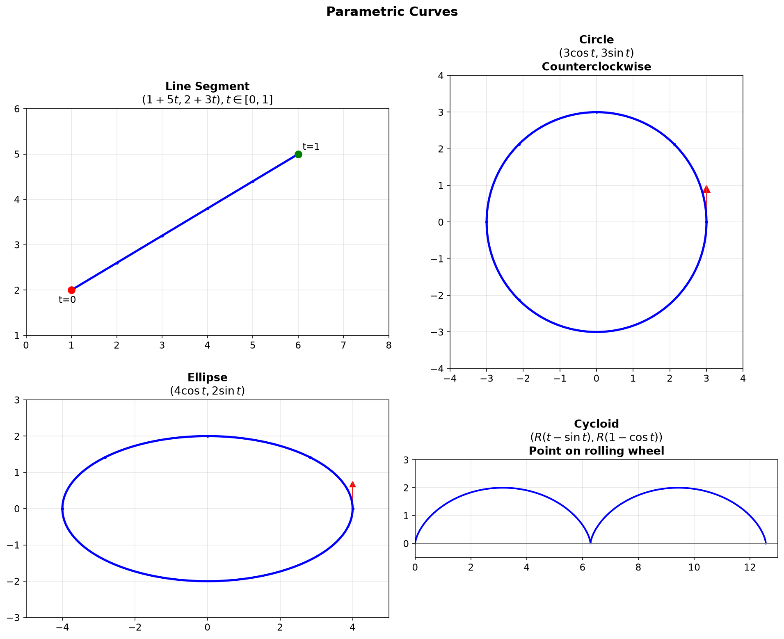

*Graph 9B-D1: Four parametric curves. Top-left — Line segment: uniform motion from A to B. Top-right — Circle: constant speed counterclockwise. Bottom-left — Ellipse: stretched circle. Bottom-right — Cycloid: a point on a rolling wheel traces arches.*

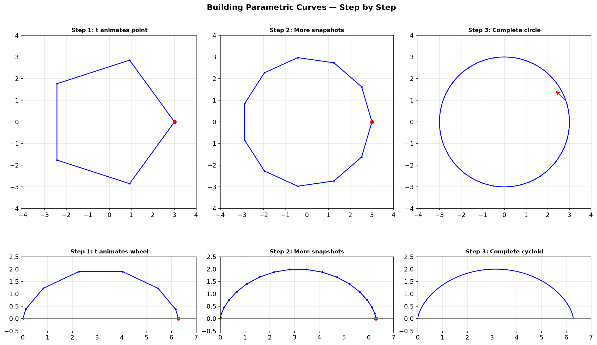

*Graph 9B-S7: Parametric curves built in three stages each. Left column — The parameter t animates a point along the curve. Middle — Multiple snapshots show the motion. Right — The complete curve with direction arrows.*

---

> **Up to here (Part D)** : Parametric line/segment, circle, ellipse, cycloid. Eliminate $t$ to recover Cartesian form. Parameter direction indicates motion.

---

## Part E: Area and Polygon Geometry

> Closed shapes have area. Triangles from coordinates, polygons by decomposition — pure algebra.

---

## Example 19: Triangle Area from Coordinates

Given vertices $(x_1, y_1)$, $(x_2, y_2)$, $(x_3, y_3)$:

$$\text{Area} = \frac{1}{2}\bigl|\,x_1(y_2-y_3) + x_2(y_3-y_1) + x_3(y_1-y_2)\,\bigr|$$

This is the **shoelace formula** (or surveyor's formula) for a triangle.

$(0,0)$, $(4,0)$, $(1,3)$:
Area = $\frac{1}{2}|0(0-3) + 4(3-0) + 1(0-0)| = \frac{1}{2}|12| = 6$.

**Geometric interpretation**: Arrange coordinates in a column, repeat the first, multiply diagonally (down then up), take half the absolute difference.

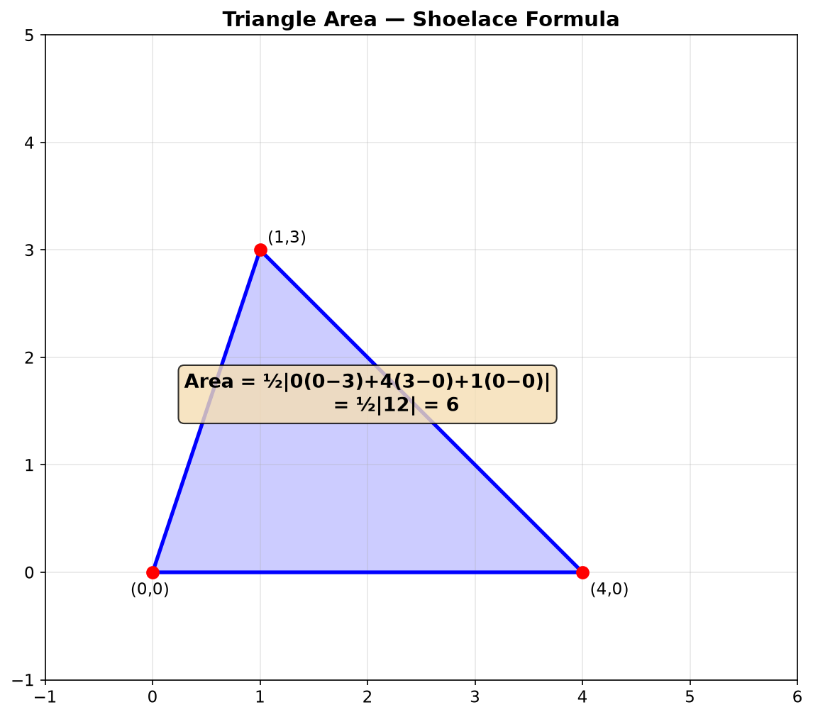

*Graph 9B-E1: Triangle with vertices (0,0), (4,0), (1,3). Area = 6 by the shoelace formula. The same result comes from $\frac{1}{2}\cdot\text{base}\cdot\text{height} = \frac{1}{2}\cdot4\cdot3 = 6$.*

---

## Example 20: Polygon Area — The Shoelace Formula

For any simple polygon with vertices $(x_1,y_1), (x_2,y_2), \ldots, (x_n,y_n)$ in order:

$$\text{Area} = \frac{1}{2}\left|\sum_{i=1}^{n} x_i y_{i+1} - \sum_{i=1}^{n} x_{i+1} y_i\right|$$

where $(x_{n+1}, y_{n+1}) = (x_1, y_1)$ (close the loop).

**Example**: Quadrilateral $(0,0)$, $(5,0)$, $(4,3)$, $(1,4)$.
Arrange vertically:
$(0,0)$ → $0\cdot0 - 0\cdot5 = 0$
$(5,0)$ → $5\cdot3 - 4\cdot0 = 15$
$(4,3)$ → $4\cdot4 - 1\cdot3 = 13$
$(1,4)$ → $1\cdot0 - 0\cdot4 = 0$
Sum = $28$. Area = $\frac{1}{2}|28| = 14$.

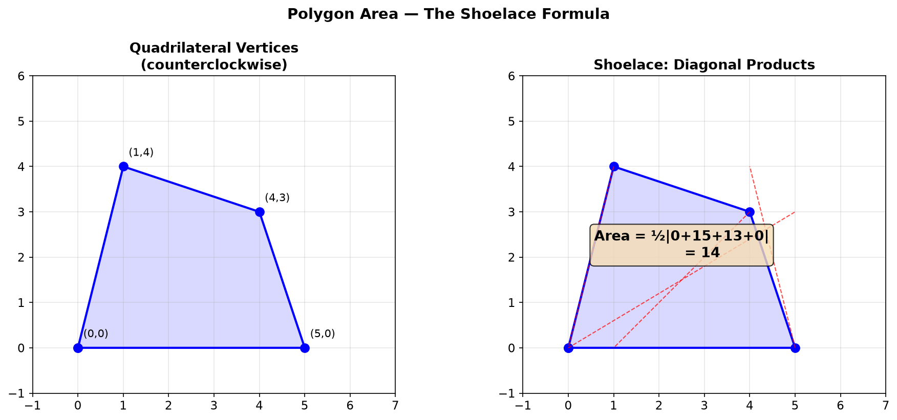

*Graph 9B-E2: The shoelace formula applied to a quadrilateral. Left — Vertices in counterclockwise order. Middle — The diagonal products. Right — Area = 14. This works for any simple polygon.*

---

## Example 21: Point Reflection — Mirroring Across a Line

Given point $P(x_0, y_0)$ and line $Ax + By + C = 0$, the reflected point $P'(x', y')$:

① The midpoint of $PP'$ lies on the line.
② $PP'$ is perpendicular to the line (direction $(A, B)$).
③ $P' = P - 2\cdot\frac{Ax_0+By_0+C}{A^2+B^2}\cdot(A, B)$.

**Example**: Reflect $(1, 5)$ across $x + y = 0$ (the line $y = -x$).
$A=1$, $B=1$, $C=0$.
$Ax_0+By_0+C = 1+5 = 6$, $A^2+B^2 = 2$.
$P' = (1,5) - 2\cdot\frac{6}{2}\cdot(1,1) = (1,5) - (6,6) = (-5,-1)$.
Check: midpoint $(-2, 2)$ lies on $y=-x$. ✓

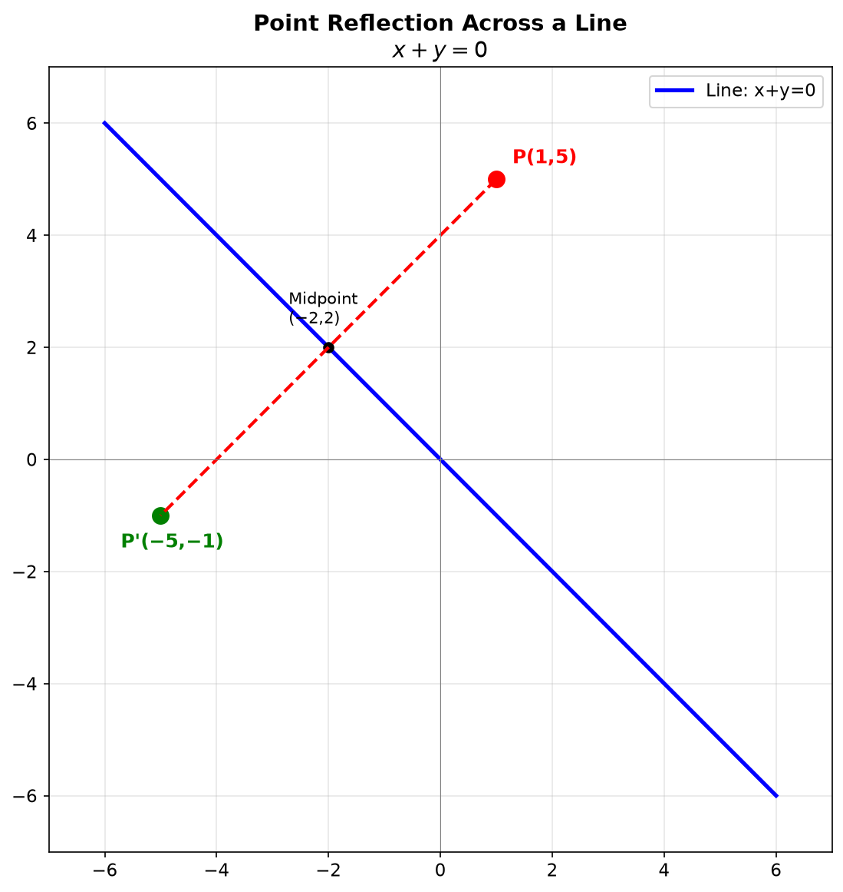

*Graph 9B-E3: Reflecting point (1,5) across the line x+y=0 gives (−5,−1). The line is the perpendicular bisector of the segment connecting point and its reflection. Midpoint (−2,2) lies on the line.*

---

## Common Mistakes

### Mistake 1: Forgetting to take absolute value in distance formulas

**Wrong**: $d = \frac{Ax_0+By_0+C}{\sqrt{A^2+B^2}}$. **Right**: $d = \frac{|Ax_0+By_0+C|}{\sqrt{A^2+B^2}}$. Distance is always non-negative.

### Mistake 2: Confusing $a$ and $b$ roles in ellipse

**Wrong**: "$a$ is always the $x$-denominator." **Right**: $a$ is the semi-major axis (larger denominator). If $b > a$, the major axis is vertical, and $c^2 = b^2 - a^2$.

### Mistake 3: Forgetting the minus sign in hyperbola asymptotes

**Wrong**: Asymptotes of $\frac{x^2}{a^2} - \frac{y^2}{b^2} = 1$ are $y = \pm\frac{a}{b}x$.
**Right**: $y = \pm\frac{b}{a}x$. The slope is the ratio of the $y$-coefficient's square root to the $x$-coefficient's square root.

### Mistake 4: Using $c^2 = a^2 - b^2$ for hyperbola

**Wrong**: Same $c$ formula for both ellipse and hyperbola. **Right**: Ellipse: $c^2 = a^2 - b^2$. Hyperbola: $c^2 = a^2 + b^2$. The sign flips because the equation changes from $+$ to $-$.

### Mistake 5: Treating discriminant $\Delta = 0$ as "no conic"

**Wrong**: "If $\Delta = 0$, there's no conic." **Right**: $\Delta = 0$ means **parabola** — the plane is parallel to the side of the cone.

---

## What We Just Did

```
(1) The Line: 5 forms. Slope = tan(θ). Parallel (m₁=m₂), perpendicular (m₁m₂=−1).
    Angle between lines: tan(φ) = |(m₂−m₁)/(1+m₁m₂)|.
    Midpoint and section formula.

(2) Distance: point-to-point (Pythagoras), point-to-line (perpendicular projection),
    parallel lines, point-to-circle, tangent lines from external point.

(3) Conic Sections — geometric definitions + algebraic equations:
    Circle: (x−h)²+(y−k)² = R². R constant.
    Ellipse: PF₁+PF₂ = 2a. c² = a²−b². 0 ≤ e < 1.
    Parabola: PF = distance to directrix. p = 1/(4a). e = 1.
    Hyperbola: |PF₁−PF₂| = 2a. c² = a²+b². e > 1.
    Identify by Δ = B²−4AC.

(4) Parametric curves: (x(t), y(t)) — line, circle, ellipse, cycloid.

(5) Area: triangle (shoelace), polygon (extended shoelace). Point reflection.
```

---

## Practice 1

A line passes through $(1, 4)$ and $(5, -2)$. Write it in all five forms. What is its $x$-intercept?

→ Reference: **Examples 1, 2**

> Solutions: [Solutions](solutions/9B-solutions.md#practice-1)

---

## Practice 2

Find the acute angle between the lines $y = 3x + 1$ and $2x + y = 5$.

→ Reference: **Example 4**

> Solutions: [Solutions](solutions/9B-solutions.md#practice-2)

---

## Practice 3

Find the distance from $(2, -1)$ to the line $4x - 3y + 5 = 0$, and find the foot of the perpendicular.

→ Reference: **Example 7**

> Solutions: [Solutions](solutions/9B-solutions.md#practice-3)

---

## Practice 4

Find the center, vertices, foci, and eccentricity of $9x^2 + 25y^2 = 225$. Then draw the ellipse.

→ Reference: **Example 12**

> Solutions: [Solutions](solutions/9B-solutions.md#practice-4)

---

## Practice 5

A parabola has focus $(2, 1)$ and directrix $y = -3$. Find its equation in standard form and vertex form.

→ Reference: **Example 13**

> Solutions: [Solutions](solutions/9B-solutions.md#practice-5)

---

## Practice 6: Real Battle

A hyperbola has asymptotes $y = \pm\frac{4}{3}x$ and passes through $(5, 0)$. Find its equation, foci, and eccentricity. Then find the distance from the origin to either asymptote (they are the same).

→ Reference: **Examples 7, 14**

> Solutions: [Solutions](solutions/9B-solutions.md#practice-6)

---

## Basic Algebra Drill — 2D Geometry (15 Problems)

> Pure computation + 5 geometry-insight problems (marked ◆).

**D1.** Write the equation of the line through $(3, -1)$ with slope $\frac{2}{5}$ in point-slope, slope-intercept, and general form.

**D2.** Find the midpoint of the segment joining $(-3, 7)$ and $(9, -5)$.

**D3.** Determine whether the lines $6x - 3y + 1 = 0$ and $y = 2x - 4$ are parallel, perpendicular, or neither.

**D4.** Find the distance from $(-2, 8)$ to the line $5x + 12y - 10 = 0$.

**D5.** Find the center and radius of $x^2 + y^2 + 8x - 6y + 21 = 0$.

**D6.** Identify the conic: $4x^2 + 9y^2 - 16x + 18y - 11 = 0$. Find its center and vertices.

**D7.** Identify the conic: $y^2 - 4x^2 = 16$. Find its asymptotes and foci.

**D8.** Find the equation of the parabola with vertex $(3, -2)$ and focus $(3, 1)$.

**D9.** A line segment from $(2, 3)$ to $(8, 9)$ is divided by a point that is twice as far from the first endpoint as from the second. Find the coordinates of the dividing point.

**D10.** Find the tangent length from $(13, 0)$ to the circle $x^2 + y^2 = 25$. Find the equation of one tangent line.

**◆ D11.** Without computing the distance formula explicitly, explain geometrically why $(3, 4)$ to the line $3x + 4y = 0$ is exactly 5 units away. (Hint: draw the right triangle.)

**◆ D12.** Two points $A(0, 0)$ and $B(6, 0)$ form the base of a triangle. The third vertex $C$ moves such that the area is always 12. What curve does $C$ trace? Describe it.

**◆ D13.** A line with slope $m$ passes through $(0, 0)$. For what values of $m$ does the line intersect the circle $x^2 + y^2 - 4x - 4y + 4 = 0$ at exactly one point? (Geometric interpretation: these are the tangent lines from the origin.)

**◆ D14.** The parametric curve $(x(t), y(t)) = (t^2, t)$ for $t \in \mathbb{R}$ describes a parabola. Find its Cartesian equation and identify the vertex and focus. (Hint: $x = t^2 = (y)^2$.)

**◆ D15.** Consider the family of lines $y = mx + (1-m)$ for all real $m$. Show that ALL these lines pass through a single fixed point. Find that point.

> Solutions: [Solutions](solutions/9B-solutions.md#basic-drill)

---

## Advanced Algebra Drill — 2D Geometry (15 Problems)

> Multi-step geometric reasoning + 5 geometry-insight problems (marked ◆).

**A1.** Find the equation of the circle passing through the three points $(1, 2)$, $(4, 1)$, and $(2, -3)$.

**A2.** Find the distance between the parallel lines $3x - 4y + 7 = 0$ and $6x - 8y - 15 = 0$.

**A3.** A line through $(2, 3)$ has slope $m$. It intersects the circle $x^2 + y^2 = 20$ at two points. For what values of $m$ is the line tangent (only one intersection point)?

**A4.** The ellipse $\frac{x^2}{a^2} + \frac{y^2}{b^2} = 1$ has eccentricity $\frac{3}{5}$ and passes through $(4, \frac{12}{5})$. Find $a$ and $b$.

**A5.** Find the equation of the hyperbola with foci $(\pm 5, 0)$ that passes through $(4, 0)$.

**A6.** Reflect the point $(3, -2)$ across the line $y = 2x + 1$. Find the coordinates of the reflected point.

**A7.** The parametric curve $(x(t), y(t)) = (\sec t,\; \tan t)$ for $t \in (-\pi/2, \pi/2)$ describes part of a hyperbola. Eliminate $t$ to find the Cartesian equation (hint: $\sec^2 t - \tan^2 t = 1$).

**A8.** Find the area of the quadrilateral with vertices $(1, 1)$, $(6, 2)$, $(5, 7)$, $(2, 5)$.

**A9.** A line passes through $(3, 0)$ and intersects the parabola $y = x^2$ at two points $P$ and $Q$. Find the equation of the line if the midpoint of $PQ$ lies on the line $x = 1$.

**A10.** Two circles: $x^2 + y^2 = 4$ and $(x-3)^2 + (y-4)^2 = 1$. Find the shortest distance between them. Do they intersect?

**◆ A11.** A point moves such that its distance from $(1, 0)$ is always twice its distance from the line $x = 4$. Find the equation of its path and identify the conic. What is its eccentricity?

**◆ A12.** The line $y = mx + c$ is tangent to the ellipse $\frac{x^2}{a^2} + \frac{y^2}{b^2} = 1$. Derive the condition on $m$ and $c$. Use this to show that $c^2 = a^2 m^2 + b^2$.

**◆ A13.** Four points $A, B, C, D$ have coordinates $(0, 0)$, $(a, 0)$, $(a, b)$, $(0, b)$ — a rectangle. Now rotate the rectangle by angle $\theta$ about the origin. Find the area of the rotated rectangle using the shoelace formula, and verify that area is invariant under rotation.

**◆ A14.** Two perpendicular lines through the origin intersect the ellipse $\frac{x^2}{a^2} + \frac{y^2}{b^2} = 1$ at four points. Show that the sum $\frac{1}{OP_1^2} + \frac{1}{OP_2^2}$ is constant for any choice of perpendicular lines, where $OP_1$ and $OP_2$ are distances from the origin to the intersection points.

**◆ A15.** Consider all chords of the parabola $y = x^2$ that pass through the point $(0, 1)$. Prove that the midpoints of these chords all lie on another parabola. Find its equation.

> Solutions: [Solutions](solutions/9B-solutions.md#advanced-drill)

---

## Today's Procedure

```
Step 1: Lines — Know all 5 forms and convert fluently.
         Parallel/perpendicular by slope. Midpoint and section formula.

Step 2: Distance — Point-to-line formula (derive it once, use it forever).
         Point-to-circle = |distance to center − R|.

Step 3: Conic Sections — For each one, know BOTH the algebraic equation
         AND the geometric definition (sum/difference/distance relationships).
         Identify by discriminant Δ = B²−4AC.

Step 4: Parametric curves — (x(t), y(t)) describes motion.
         Eliminate t to get back to Cartesian form.

Step 5: Area — Shoelace formula for any polygon.
         Point reflection = perpendicular bisector method.
```

---

## How to Read These Symbols

| Symbol | Reads as | Meaning |
|:---:|:---:|------|
| $d = \sqrt{(x_2-x_1)^2 + (y_2-y_1)^2}$ | "distance equals square root of delta-x squared plus delta-y squared" | 2D distance (Pythagorean theorem) |
| $m = \frac{y_2-y_1}{x_2-x_1}$ | "m equals delta y over delta x" / "slope" | slope = rise over run |
| $y = mx + b$ | "y equals m x plus b" / "slope-intercept form" | line: m = slope, b = y-intercept |
| $y-y_1 = m(x-x_1)$ | "y minus y1 equals m times x minus x1" | point-slope form |
| $Ax+By+C=0$ | "A x plus B y plus C equals zero" | general form, normal vector (A,B) |
| $m_1 m_2 = -1$ | "m1 times m2 equals negative one" | perpendicular lines condition |
| $\tan\phi = \left\|\frac{m_2-m_1}{1+m_1 m_2}\right\|$ | "tan phi equals absolute value of..." | angle between two lines |
| $(x-h)^2 + (y-k)^2 = R^2$ | "x minus h squared plus y minus k squared equals R squared" | circle: center (h,k), radius R |
| $\frac{(x-h)^2}{a^2} + \frac{(y-k)^2}{b^2} = 1$ | "ellipse equation" | ellipse: a = semi-major, b = semi-minor |
| $(x-h)^2 = 4p(y-k)$ | "x minus h squared equals 4p times y minus k" | parabola: vertex (h,k), focal length p |
| $\frac{(x-h)^2}{a^2} - \frac{(y-k)^2}{b^2} = 1$ | "hyperbola equation" | hyperbola: opens left-right |
| $e = \frac{c}{a}$ | "e equals c over a" | eccentricity |
| $(x(t), y(t))$ | "x of t, y of t" | parametric curve with parameter t |
| $\frac{1}{2}\|x_1(y_2-y_3) + x_2(y_3-y_1) + x_3(y_1-y_2)\|$ | "one half times absolute value of..." | triangle area by coordinates (shoelace) |

---

## Terminology

| What we call it | Math term | Notation |
|:---------------:|:---------:|:--------:|
| slope | slope / gradient | $m$ |
| y-intercept | y-intercept | $b$ |
| rise over run | slope | $\Delta y / \Delta x$ |
| normal vector | normal vector | $(A, B)$ perpendicular to $Ax+By+C=0$ |
| midpoint | midpoint | $M = (\frac{x_1+x_2}{2}, \frac{y_1+y_2}{2})$ |
| section formula | internal division | divides segment in ratio $m:n$ |
| perpendicular bisector | perpendicular bisector | line perpendicular to segment through its midpoint |
| circle/ellipse/parabola/hyperbola | conic sections | from $Ax^2+Bxy+Cy^2+\cdots=0$ |
| focus, directrix | focus, directrix | geometric definition of parabola |
| foci (plural of focus) | foci | geometric definition of ellipse, hyperbola |
| eccentricity | eccentricity | $e$ — measures "flatness": 0=circle, <1=ellipse, =1=parabola, >1=hyperbola |
| latus rectum | latus rectum / focal width | chord through focus perpendicular to axis, length $\|4p\|$ |
| parametric curve | parametric equations | $(x(t), y(t))$ |
| shoelace formula | surveyor's formula | polygon area from vertex coordinates |
| degenerate conic | degenerate conic | equation reduces to point, line(s), or empty set |
