# Session 9C: 3D Geometry — Surfaces, Distance, and Space

**Phase 2 — Classical Techniques | 90 min**

*From 2D to 3D: add a dimension, and every concept from 9B gains a new layer. Lines become planes, circles become spheres, conics become quadrics. Pure algebra, systematic spatial reasoning — no calculus required.*

> **Prerequisite**: 9B (2D Geometry). The distance formula, conic sections, and parametric curves all extend naturally to 3D. Vectors are introduced here as the essential tool for 3D reasoning.

---

## Part A: 3D Coordinates and Vectors — The Third Dimension

> In 2D, we have $(x, y)$. In 3D, we add $z$. Points become $(x, y, z)$, and the tools for measuring and navigating space become vectors.

---

## Example 1: The 3D Coordinate System — Axes, Octants, and Plotting

Three mutually perpendicular axes: $x$ (forward/back), $y$ (left/right), $z$ (up/down).

**The right-hand rule**: Point index finger along $+x$, middle finger along $+y$, thumb points along $+z$.

The coordinate planes divide space into 8 **octants** (like quadrants in 2D):
- Octant I: $x>0, y>0, z>0$ (the "front-right-top" octant)
- Signs follow a binary pattern: $(+,+,+), (-,+,+), (-,-,+), (+,-,+)$ for the upper four, then flip $z$ to negative for the lower four.

**Plotting $(3, 2, 4)$**: From origin, go 3 units along $+x$, then 2 along $+y$, then 4 up along $+z$. The point floats in space.

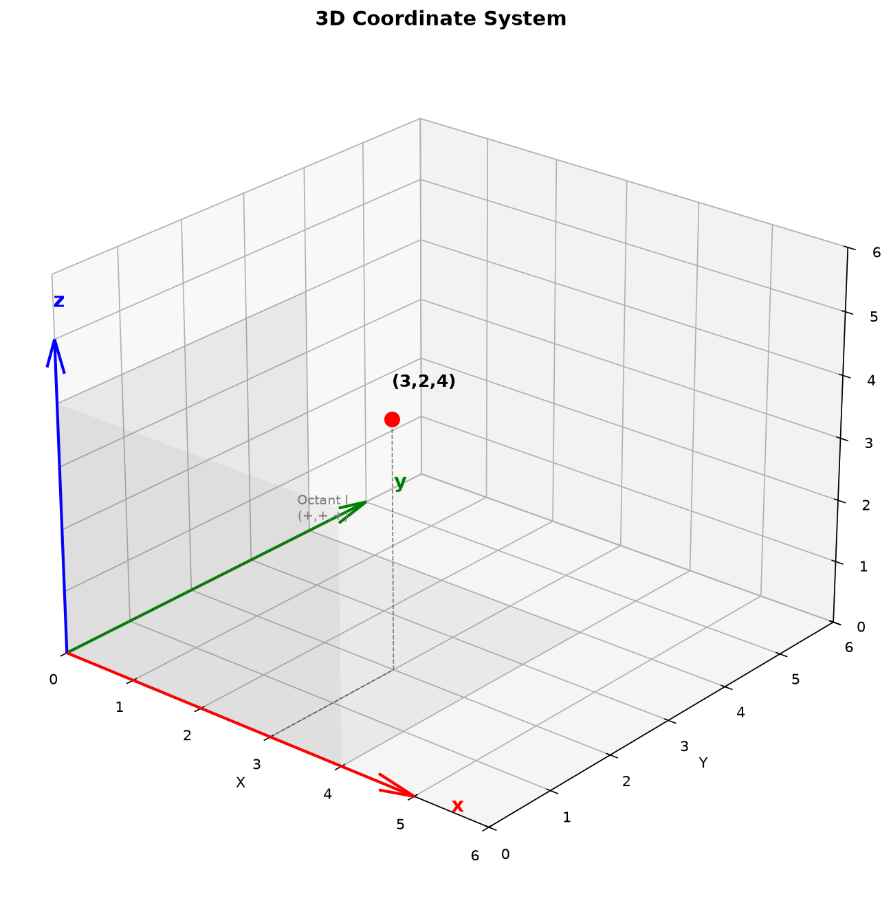

*Graph 9C-A1: The 3D coordinate system with the three axes (x red, y green, z blue), the three coordinate planes (xy, xz, yz), and a point (3,2,4) plotted in Octant I. The dashed lines show the perpendicular projections onto each coordinate plane.*

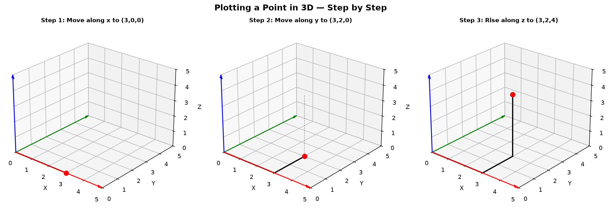

*Graph 9C-S1: Plotting a point in 3D — three stages. Step 1 — Move along the x-axis to (3,0,0). Step 2 — Move parallel to y-axis to (3,2,0) on the xy-plane. Step 3 — Rise parallel to z-axis to the final point (3,2,4). The dashed box helps visualize the point's position in space.*

---

## Example 2: Vectors in 3D — Direction, Magnitude, and Arithmetic

A vector $\vec{v} = (v_x, v_y, v_z)$ represents a direction and magnitude in 3D space.

**Magnitude** (length): $|\vec{v}| = \sqrt{v_x^2 + v_y^2 + v_z^2}$.

$\vec{v} = (3, 4, 12)$: $|\vec{v}| = \sqrt{9 + 16 + 144} = 13$.

**Vector between two points**: $\vec{PQ} = (x_2-x_1,\; y_2-y_1,\; z_2-z_1)$.
From $P(1,2,3)$ to $Q(4,6,15)$: $\vec{PQ} = (3, 4, 12)$, magnitude $13$ — this IS the distance formula.

**Vector addition**: $\vec{u} + \vec{v} = (u_x+v_x,\; u_y+v_y,\; u_z+v_z)$. Tip-to-tail geometrically.
**Scalar multiplication**: $c\vec{v} = (cv_x, cv_y, cv_z)$. Stretches or shrinks the vector.

**Unit vector** (direction only, length 1): $\hat{v} = \frac{\vec{v}}{|\vec{v}|}$.
For $\vec{v} = (3, 4, 12)$: $\hat{v} = \left(\frac{3}{13}, \frac{4}{13}, \frac{12}{13}\right)$.

---

## Example 3: Dot Product — Measuring Alignment

$\vec{u} \cdot \vec{v} = u_x v_x + u_y v_y + u_z v_z$.

**Geometric meaning**: $\vec{u} \cdot \vec{v} = |\vec{u}||\vec{v}|\cos\theta$, where $\theta$ is the angle between them.
- $\vec{u} \cdot \vec{v} > 0$: angle $< 90°$ (vectors point roughly the same way).
- $\vec{u} \cdot \vec{v} = 0$: vectors are **perpendicular** ($\theta = 90°$).
- $\vec{u} \cdot \vec{v} < 0$: angle $> 90°$ (vectors point roughly opposite).

**Example**: $\vec{u}=(1,2,2)$, $\vec{v}=(3,0,-4)$.
$\vec{u}\cdot\vec{v} = 3+0-8 = -5$.
$|\vec{u}| = \sqrt{1+4+4} = 3$, $|\vec{v}| = \sqrt{9+0+16} = 5$.
$\cos\theta = \frac{-5}{15} = -\frac{1}{3}$, $\theta \approx 109.5°$.

**Projection**: The projection of $\vec{u}$ onto $\vec{v}$ has length $\frac{|\vec{u}\cdot\vec{v}|}{|\vec{v}|}$.

---

## Example 4: Cross Product — Creating a Perpendicular Vector

$\vec{u} \times \vec{v} = (u_y v_z - u_z v_y,\; u_z v_x - u_x v_z,\; u_x v_y - u_y v_x)$.

**Geometric meaning**: $\vec{u} \times \vec{v}$ is perpendicular to BOTH $\vec{u}$ and $\vec{v}$.
Its magnitude $|\vec{u} \times \vec{v}| = |\vec{u}||\vec{v}|\sin\theta$ = area of the parallelogram spanned by $\vec{u}$ and $\vec{v}$.
Direction follows the **right-hand rule**: fingers curl from $\vec{u}$ to $\vec{v}$, thumb points along $\vec{u}\times\vec{v}$.

**Example**: $\vec{u} = (1, 0, 0)$ (along $x$-axis), $\vec{v} = (0, 1, 0)$ (along $y$-axis).
$\vec{u} \times \vec{v} = (0\cdot0 - 0\cdot1,\; 0\cdot0 - 1\cdot0,\; 1\cdot1 - 0\cdot0) = (0, 0, 1)$.
Result is along $+z$-axis — precisely the right-hand rule. ✓

**Why cross product matters**: Finding normals to planes, computing areas, and describing rotations all use the cross product.

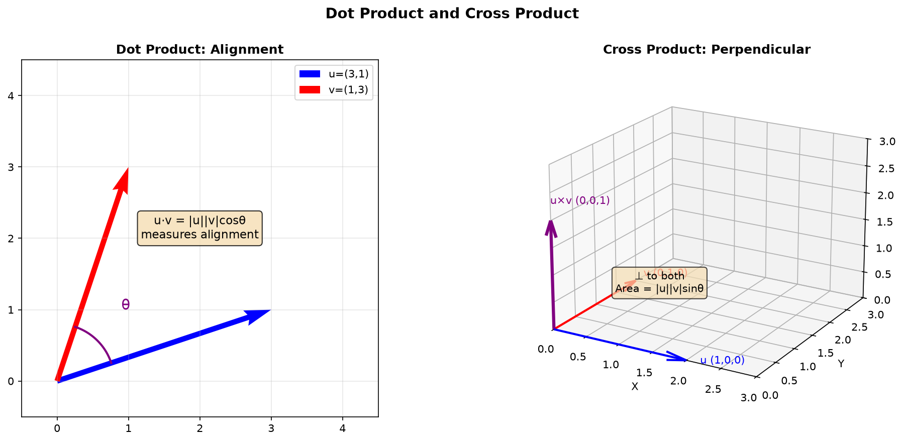

*Graph 9C-A2: Left — Dot product: $\vec{u}\cdot\vec{v} = |\vec{u}||\vec{v}|\cos\theta$, measuring alignment. Right — Cross product: $\vec{u}\times\vec{v}$ is perpendicular to both, magnitude = area of parallelogram.*

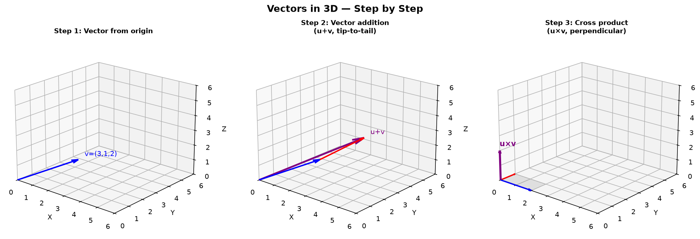

*Graph 9C-S2: Vectors in 3D — three stages. Step 1 — A vector as a directed segment from origin. Step 2 — Vector addition: tip-to-tail $\vec{u}+\vec{v}$. Step 3 — Cross product $\vec{u}\times\vec{v}$ is perpendicular to the plane containing $\vec{u}$ and $\vec{v}$.*

---

> **Up to here (Part A)** : 3D coordinate system, 8 octants. Vectors: magnitude, addition, scalar multiplication, unit vectors. Dot product = alignment ($\cos\theta$). Cross product = perpendicular vector ($\sin\theta$, area).

---

## Part B: Planes in 3D — The Analog of Lines in 2D

> In 2D, $ax+by=c$ is a line. In 3D, $ax+by+cz=d$ is a plane. The vector $(a,b,c)$ plays the same role — it's perpendicular to the plane.

---

## Example 5: The Equation of a Plane — Three Ways to Build One

**① General form**: $ax + by + cz = d$. Normal vector $\vec{n} = (a, b, c)$ is perpendicular to the plane.

**② From point and normal**: Plane through $P(x_0, y_0, z_0)$ with normal $\vec{n} = (a, b, c)$:
$\vec{n} \cdot (\vec{x} - \vec{P}) = 0$ → $a(x-x_0) + b(y-y_0) + c(z-z_0) = 0$.

Through $(1, 2, 3)$ with normal $(2, -1, 1)$:
$2(x-1) - (y-2) + (z-3) = 0$ → $2x - y + z = 3$.

**③ From three points**: Points $A, B, C$ determine a plane.
① Form vectors $\vec{AB}$ and $\vec{AC}$.
② Compute normal $\vec{n} = \vec{AB} \times \vec{AC}$.
③ Use point-normal form with any of the three points.

**Example**: $A(1,0,0)$, $B(0,2,0)$, $C(0,0,3)$.
$\vec{AB} = (-1, 2, 0)$, $\vec{AC} = (-1, 0, 3)$.
$\vec{n} = \vec{AB} \times \vec{AC} = (2\cdot3 - 0\cdot0,\; 0\cdot(-1) - (-1)\cdot3,\; (-1)\cdot0 - 2\cdot(-1)) = (6, 3, 2)$.
Using $A(1,0,0)$: $6(x-1) + 3(y-0) + 2(z-0) = 0$ → $6x + 3y + 2z = 6$.

**Intercept form**: Divide by 6: $\frac{x}{1} + \frac{y}{2} + \frac{z}{3} = 1$. The plane cuts the axes at $x=1$, $y=2$, $z=3$.

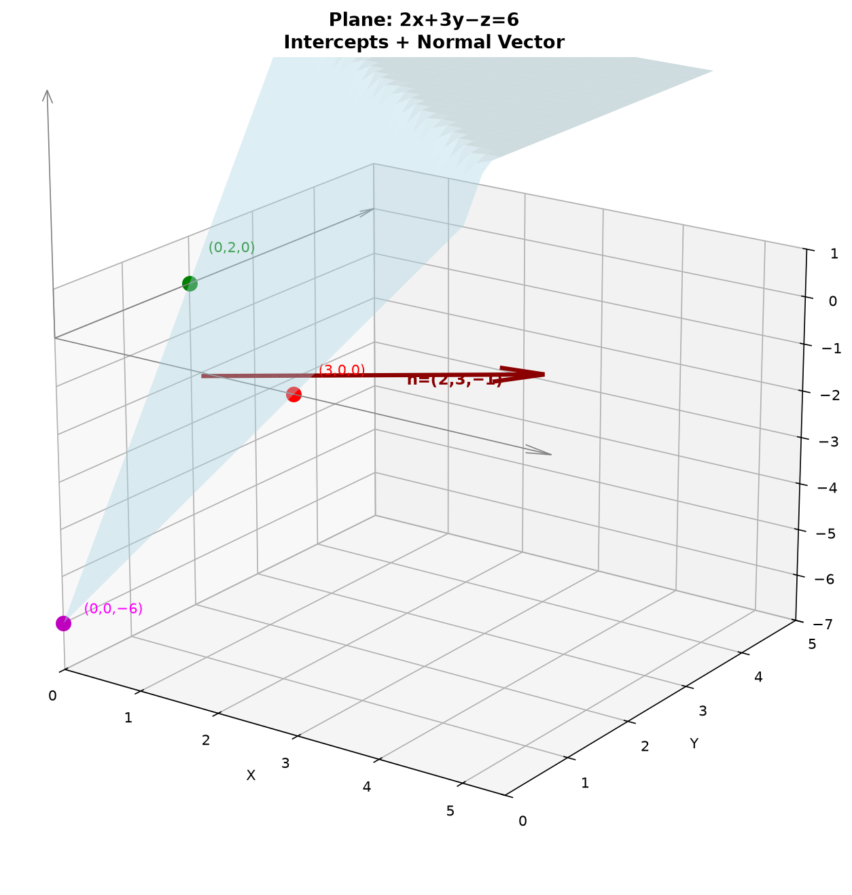

*Graph 9C-B1: The plane $2x+3y-z=6$ with its three intercepts (3,0,0), (0,2,0), (0,0,−6) and the normal vector $\vec{n}=(2,3,-1)$ perpendicular to every direction in the plane.*

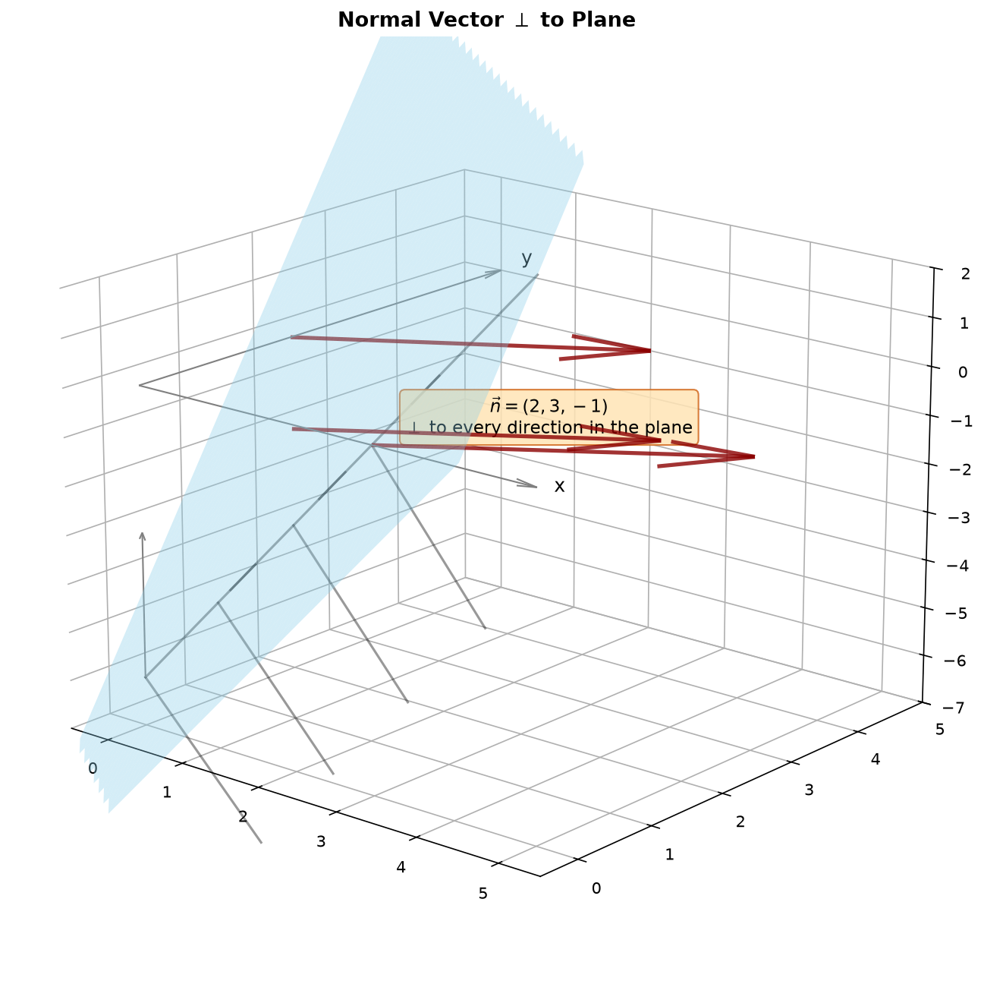

*Graph 9C-B2: The normal vector $\vec{n}=(a,b,c)$ is perpendicular to every line lying in the plane $ax+by+cz=d$. This is the defining property — analogous to how slope is perpendicular to the normal in 2D.*

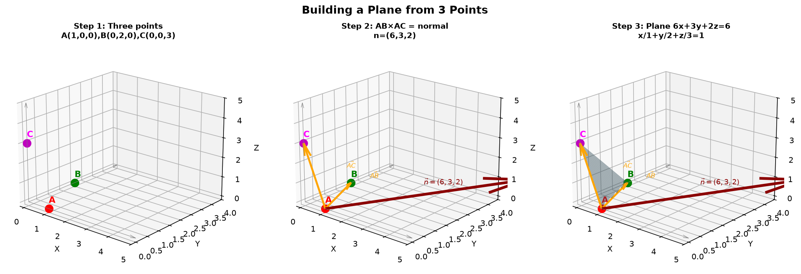

*Graph 9C-S3: Building a plane in three steps. Step 1 — Three points A(1,0,0), B(0,2,0), C(0,0,3). Step 2 — Vectors $\vec{AB}$ and $\vec{AC}$, cross product gives normal (6,3,2). Step 3 — The plane $6x+3y+2z=6$ with intercept form $\frac{x}{1}+\frac{y}{2}+\frac{z}{3}=1$.*

---

## Example 6: Distance from a Point to a Plane

Point $(x_0, y_0, z_0)$ to plane $ax + by + cz = d$:

$$D = \frac{|ax_0 + by_0 + cz_0 - d|}{\sqrt{a^2 + b^2 + c^2}}$$

**Compare to 2D**: $d = \frac{|Ax_0+By_0+C|}{\sqrt{A^2+B^2}}$. The 3D version just adds the $z$-term to both numerator and denominator.

**Example**: $(1, 2, 3)$ to $2x + 3y + z = 6$.
$D = \frac{|2+6+3-6|}{\sqrt{4+9+1}} = \frac{5}{\sqrt{14}} \approx 1.336$.

**Geometric meaning**: The numerator is how "wrong" the point is — plug it into the plane equation. The denominator is the length of the normal vector, normalizing for the plane's orientation.

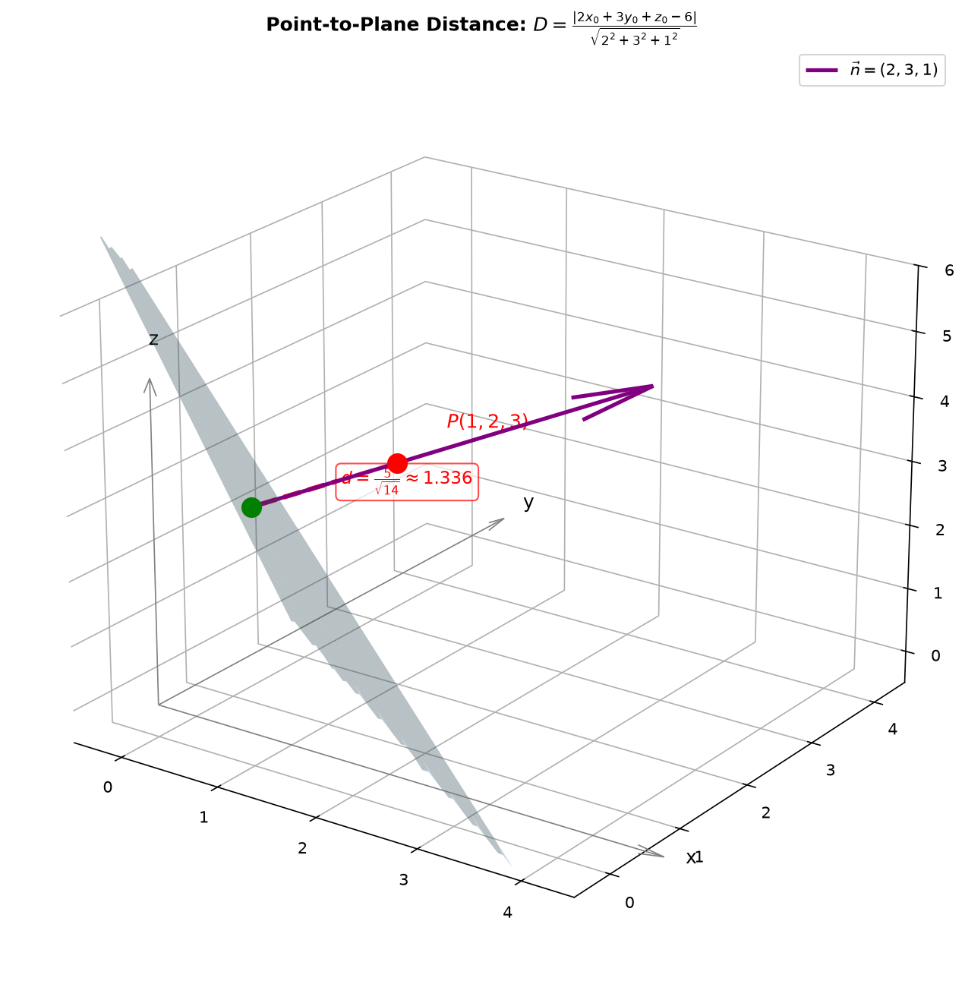

*Graph 9C-B3: Distance from (1,2,3) to plane $2x+3y+z=6$ is $5/\sqrt{14}\approx 1.336$. The shortest segment (red dashed) is perpendicular to the plane — parallel to the normal vector (2,3,1).*

---

## Example 7: Angle Between Two Planes

The angle between two planes equals the angle between their normal vectors.

Planes $a_1x+b_1y+c_1z=d_1$ and $a_2x+b_2y+c_2z=d_2$:

$$\cos\theta = \frac{|\vec{n}_1 \cdot \vec{n}_2|}{|\vec{n}_1||\vec{n}_2|} = \frac{|a_1a_2 + b_1b_2 + c_1c_2|}{\sqrt{a_1^2+b_1^2+c_1^2}\,\sqrt{a_2^2+b_2^2+c_2^2}}$$

**Parallel planes**: $\vec{n}_1 \parallel \vec{n}_2$ → $\vec{n}_1 \times \vec{n}_2 = \vec{0}$.
**Perpendicular planes**: $\vec{n}_1 \cdot \vec{n}_2 = 0$.

**Example**: Angle between $x+y+z=1$ and $x-y=0$.
$\vec{n}_1=(1,1,1)$, $\vec{n}_2=(1,-1,0)$.
$\cos\theta = \frac{|1-1+0|}{\sqrt{3}\cdot\sqrt{2}} = \frac{0}{\sqrt{6}} = 0$ → $\theta = 90°$. The planes are perpendicular.

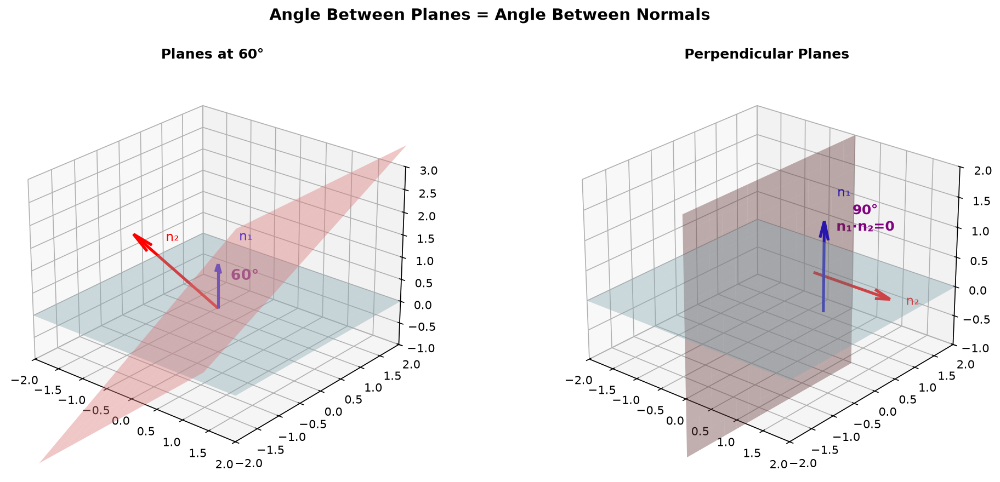

*Graph 9C-B4: The angle between two planes equals the angle between their normals. Left — Planes at 60°. Right — Perpendicular planes ($\vec{n}_1\cdot\vec{n}_2=0$).*

---

## Example 8: Distance Between Parallel Planes

For parallel planes $ax+by+cz = d_1$ and $ax+by+cz = d_2$ (same normal):

$$D = \frac{|d_2 - d_1|}{\sqrt{a^2 + b^2 + c^2}}$$

$2x - y + 2z = 5$ and $2x - y + 2z = -7$:
$D = \frac{|-7 - 5|}{\sqrt{4+1+4}} = \frac{12}{3} = 4$.

**Compare to 2D**: $d = \frac{|C_2-C_1|}{\sqrt{A^2+B^2}}$ for parallel lines. Same pattern — one dimension up.

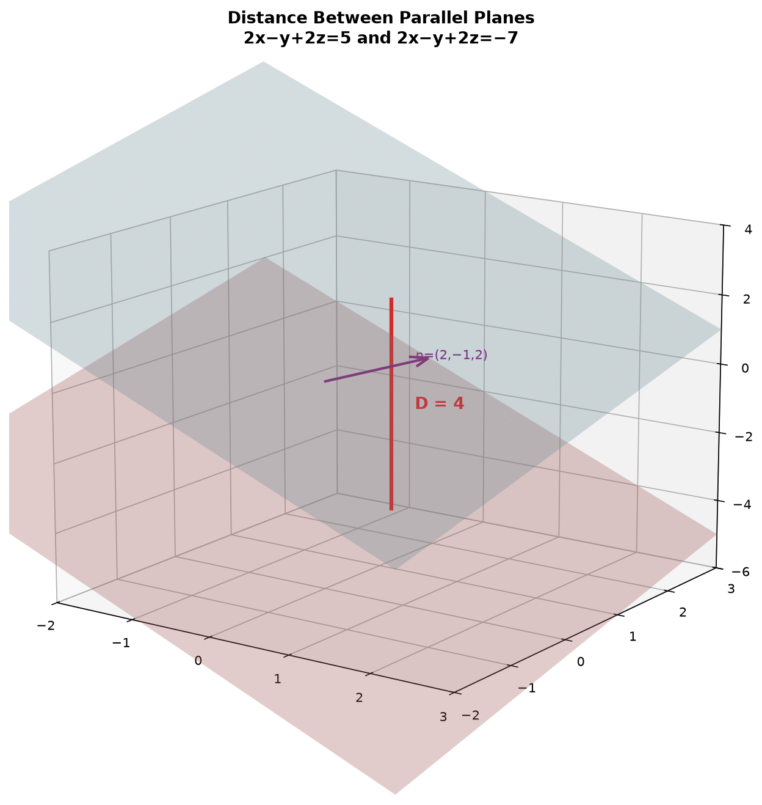

*Graph 9C-B5: Two parallel planes $2x-y+2z=5$ and $2x-y+2z=-7$ are 4 units apart. The perpendicular segment (red dashed) has length $|−7−5|/3 = 4$.*

---

> **Up to here (Part B)** : Plane from normal+point or 3 points (cross product). Point-to-plane distance. Angle between planes (via normals). Distance between parallel planes.

---

## Part C: Spheres and Distance in 3D

> A sphere is the 3D analog of a circle. Distance generalizes cleanly — just add the $z$-term.

---

## Example 9: The Sphere — Fixed Distance from Center

**Equation**: $(x-h)^2 + (y-k)^2 + (z-\ell)^2 = R^2$. Center $(h,k,\ell)$, radius $R$.

$(x-1)^2 + (y+2)^2 + (z-3)^2 = 25$: center $(1,-2,3)$, radius $5$.

**General form to standard**: $x^2+y^2+z^2+Dx+Ey+Fz+G=0$. Complete the square in all three variables.

**Example**: $x^2+y^2+z^2-4x+6y-2z-11=0$.
$(x^2-4x) + (y^2+6y) + (z^2-2z) = 11$.
$(x-2)^2 + (y+3)^2 + (z-1)^2 = 11+4+9+1 = 25$.
Center $(2,-3,1)$, radius $5$.

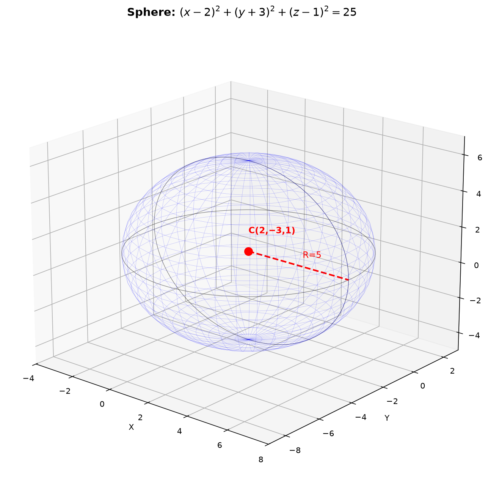

*Graph 9C-C1: Sphere $(x-2)^2+(y+3)^2+(z-1)^2=25$ with center (2,−3,1) and radius 5. The wireframe shows the spherical surface. Three orthogonal great circles are highlighted.*

---

## Example 10: Distance from a Point to a Sphere

Point $P$ to sphere center $C$, radius $R$:

$$d = \bigl|\,|PC| - R\,\bigr|$$

**Case 1 — Point outside** ($|PC| > R$): $d = |PC| - R$. Closest point on sphere lies on line $PC$.
$(10, 0, 0)$ to $x^2+y^2+z^2=25$: $|PC|=10$, $R=5$, $d=5$.

**Case 2 — Point inside** ($|PC| < R$): $d = R - |PC|$.
$(2, 0, 0)$ to $x^2+y^2+z^2=25$: $|PC|=2$, $R=5$, $d=3$.

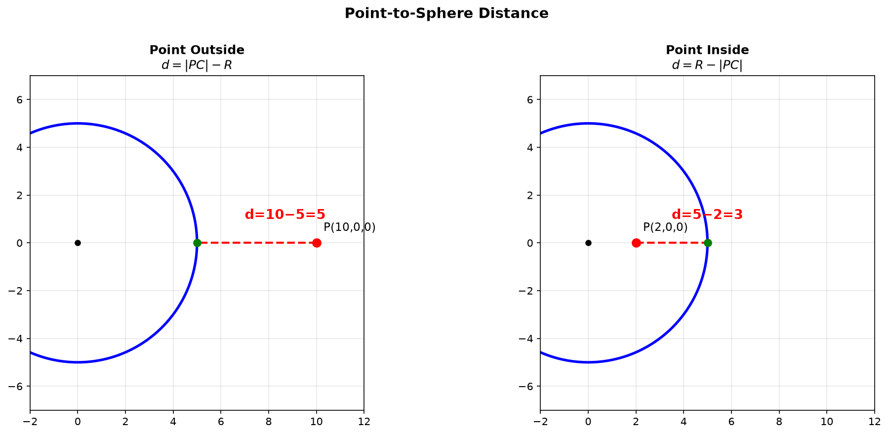

*Graph 9C-C2: Left — P(10,0,0) outside, distance = 10−5 = 5. Right — P(2,0,0) inside, distance = 5−2 = 3. The shortest path always passes through the sphere's center.*

---

> **Up to here (Part C)** : Sphere equation (complete the square). Point-to-sphere distance.

---

## Part D: Functions of Two Variables — $z = f(x,y)$

> This is where 9A1 function concepts extend to 3D. $z=f(x,y)$: for every point $(x,y)$ in a 2D domain, there is one height $z$. A surface is a function's graph hovering over the $xy$-plane.

---

## Example 11: $z = f(x,y)$ as a Height Map — Connecting to 9A1

Recall from 9A1: $f(x)$ = one input → one output. $f(x,y)$ = two inputs → one output.

$f(x,y) = x^2 + y^2$: a rule. Feed $(1, 2)$ → $1^2+2^2=5$. Feed $(0,0)$ → $0$. Feed $(3,-1)$ → $10$.

**Every 9A1 concept extends**:
- **Function evaluation**: $f(a,b)$ means shove $a$ into $x$, $b$ into $y$.
- **Domain**: The set of $(x,y)$ pairs where the rule works.
- **Range**: The set of $z$-values that actually come out.
- **Graph**: A surface in 3D — for each $(x,y)$ in the domain, plot the point $(x, y, f(x,y))$.

$z = x^2 + y^2$: The graph is a bowl opening upward. Minimum $z=0$ at $(0,0)$. Range: $[0, \infty)$.

$z = \sqrt{1 - x^2 - y^2}$: The graph is the upper hemisphere. Range: $[0, 1]$.

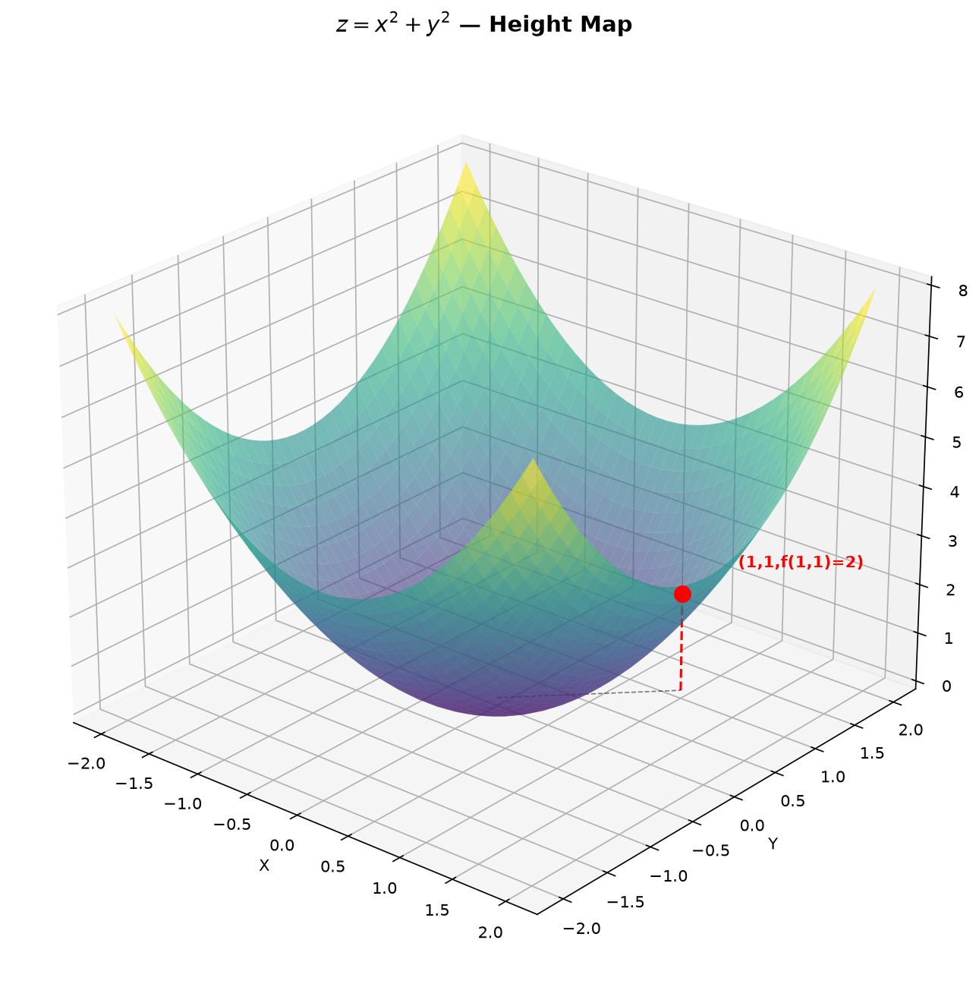

*Graph 9C-D1: $z=x^2+y^2$ as a height map. Each point (x,y) in the domain has a height z. The red point at (1, 1, 2) shows: feed (1,1) into the rule, get height 2. The surface is the collection of all such points.*

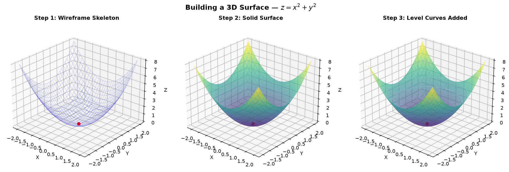

*Graph 9C-S4: Building $z=x^2+y^2$ in three stages. Step 1 — Wireframe skeleton reveals the bowl shape's underlying grid. Step 2 — Fill in the faces to see the solid paraboloid. Step 3 — Add level curves (white rings at z=1,2,3,4) to visualize how the bowl expands. The red dot marks the minimum at (0,0,0).*

---

## Example 12: Domain in 3D — Regions in the $xy$-Plane

For $z=f(x,y)$, the domain is a 2D region in the $xy$-plane. The same four rules from 9A1 apply, but now they describe regions, not intervals.

| Restriction | Condition | Domain shape |
|:-----------:|:---------:|:------------:|
| $\sqrt{\;\;}$ | Inside $\geq 0$ | Disk or half-plane |
| Denominator | $\neq 0$ | Plane with a curve removed |
| $\ln(\;\;)$ | Inside $> 0$ | Half-plane (open boundary) |
| Combined | All rules at once | Intersection of regions |

**Example 1**: $z = \sqrt{4 - x^2 - y^2}$.
Needs $x^2 + y^2 \leq 4$ → **closed disk** of radius 2, center $(0,0)$.

**Example 2**: $z = \ln(x + y)$.
Needs $x + y > 0$ → **open half-plane** above the line $y = -x$.

**Example 3**: $z = \frac{1}{x^2 + y^2 - 1}$.
Needs $x^2 + y^2 \neq 1$ → entire plane **except the unit circle**.

**Example 4**: $z = \frac{\sqrt{x}}{y-1}$.
Square root: $x \geq 0$ (right half-plane). Denominator: $y \neq 1$.
Domain: right half-plane minus the horizontal line $y=1$.

**How to sketch a 2D domain**:
① Draw the boundary curve (equality).
② Solid line if included ($\leq, \geq$), dashed if excluded ($<, >, \neq$).
③ Shade the region that satisfies the inequality.
④ If multiple conditions, shade the intersection.

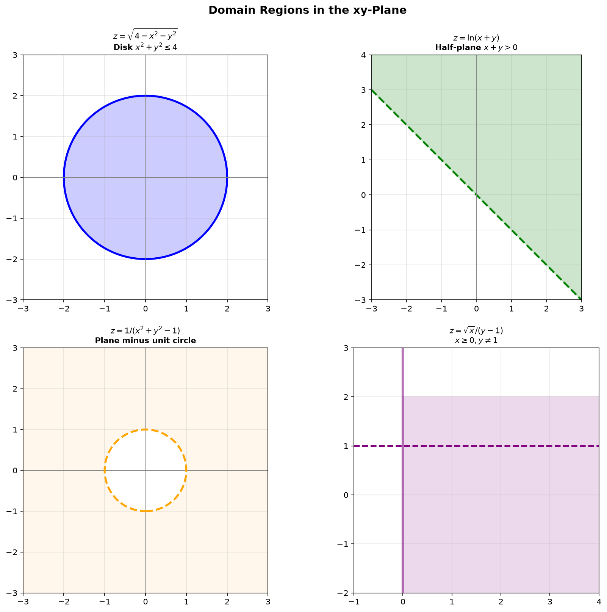

*Graph 9C-D2: Four domain regions. Top-left — Closed disk $x^2+y^2 \leq 4$ (solid boundary). Top-right — Open half-plane $x+y>0$ (dashed boundary). Bottom-left — Plane minus unit circle. Bottom-right — Intersection of $x \geq 0$ and $y \neq 1$.*

---

> **Up to here (Part D)** : $z=f(x,y)$ extends 9A1 concepts. Domain = 2D region in $xy$-plane. Sketch boundaries (solid/dashed), shade the satisfying region.

---

## Part E: Level Curves — The 2D Map of a 3D Landscape

> A level curve is $f(x,y) = c$ — all points at a constant height. Level curves are to 3D surfaces what contour lines are to topographic maps. Reading them is a systematic skill.

---

## Example 13: What Level Curves Reveal — The Systematic Method

**Definition**: The level curve at height $c$ is the set $\{(x,y) \mid f(x,y) = c\}$.
It's a horizontal slice through the surface at elevation $c$, projected down onto the $xy$-plane.

**The systematic method for analyzing level curves**:

| Step | Action | What you learn |
|:----:|:------:|:--------------|
| ① | Set $f(x,y) = c$ and identify the curve type | Circle, line, hyperbola, parabola, ellipse |
| ② | Determine if the curve exists for this $c$ | Some $c$ values produce no real curve |
| ③ | Find how the curve changes as $c$ varies | Growth pattern of the surface |
| ④ | Check spacing between curves at evenly-spaced $c$ | Steepness: close curves = steep, far apart = flat |
| ⑤ | Mark where $c=0$ (if it exists) | Shows where surface crosses $xy$-plane |

---

## Example 14: Level Curves of Key Surfaces

**$z = x^2 + y^2$ (paraboloid bowl)**:
$f(x,y)=c$ → $x^2+y^2=c$.
- $c<0$: no real curve (surface never goes below $z=0$).
- $c=0$: single point $(0,0)$ — the minimum.
- $c>0$: circles of radius $\sqrt{c}$, growing as $c$ increases.
- Spacing: circles get closer together as $c$ grows (surface steepens).

**$z = x^2 - y^2$ (hyperbolic paraboloid / saddle)**:
$f(x,y)=c$ → $x^2-y^2=c$.
- $c=0$: $x^2=y^2$ → $y=\pm x$ — two crossing lines.
- $c>0$: hyperbolas $x^2-y^2=c$, opening left-right.
- $c<0$: hyperbolas $y^2-x^2=|c|$, opening up-down.
- The crossing at $c=0$ reveals the saddle point.

**$z = \sqrt{x^2 + y^2}$ (cone)**:
$f(x,y)=c$ → $\sqrt{x^2+y^2}=c$ → $x^2+y^2=c^2$.
- $c=0$: single point at origin (cone tip).
- $c>0$: circles of radius $c$ — radius grows linearly with height.
- Evenly spaced $c$ values → evenly spaced circles (constant slope).

**$z = y - x^2$ (parabolic cylinder / ramp with trough)**:
$f(x,y)=c$ → $y = x^2 + c$.
- For any $c$: a parabola $y=x^2$ shifted up by $c$.
- All level curves have the same shape — the surface is a translation of one curve.

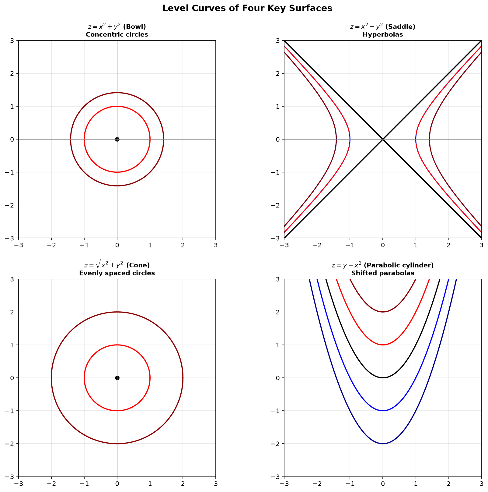

*Graph 9C-E1: Level curves of four surfaces. Top-left — $z=x^2+y^2$: concentric circles, spacing reveals bowl steepness. Top-right — $z=x^2-y^2$: hyperbolas reveal saddle. Bottom-left — $z=\sqrt{x^2+y^2}$: evenly spaced circles = cone. Bottom-right — $z=y-x^2$: identical parabolas shifted = cylinder.*

---

## Example 15: From Level Curves Back to the Surface — Reading Contour Maps

**How to "read" a contour map and visualize the 3D shape**:

① **Spacing**: Tightly packed curves = steep cliff. Widely spaced = gentle slope.
② **Shape**: Concentric closed loops = hill or bowl. Determine hill vs. bowl by checking if $z$ increases or decreases toward the center.
③ **V-shapes**: Contour lines that form V's pointing uphill indicate a valley (stream). V's pointing downhill indicate a ridge.
④ **Crossing curves**: Level curves of different heights NEVER cross (a point can't have two heights). If your algebra gives crossing curves, you made an error — or $c=0$ is special (saddle).
⑤ **Maximum/Minimum**: A point surrounded by closed loops is a local peak (if $z$ increases inward) or pit (if $z$ decreases inward).

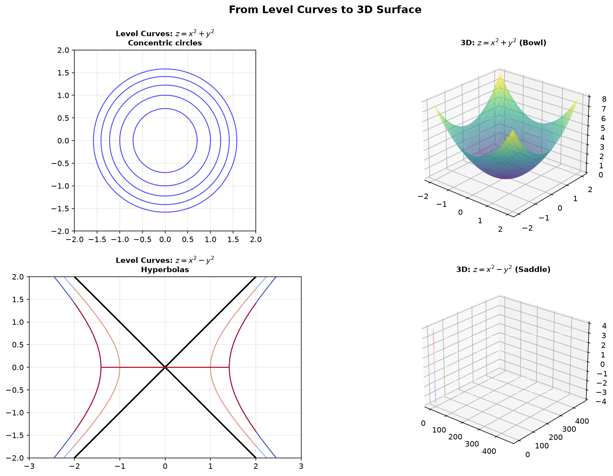

*Graph 9C-E2: Building a surface from its level curves. Left column — Level curves $f(x,y)=c$ for evenly spaced c values. Right column — The corresponding 3D surface. Top: $z=x^2+y^2$ (bowl). Bottom: $z=x^2-y^2$ (saddle).*

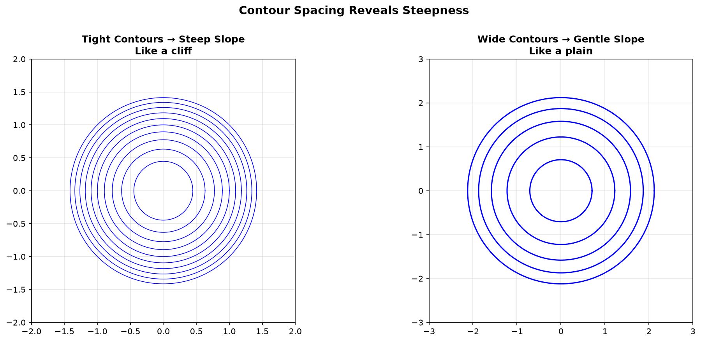

*Graph 9C-E3: How contour spacing reveals steepness. Left — Tightly packed level curves → steep slope. Right — Widely spaced level curves → gentle slope. The 3D view confirms: same height change over less horizontal distance = steeper.*

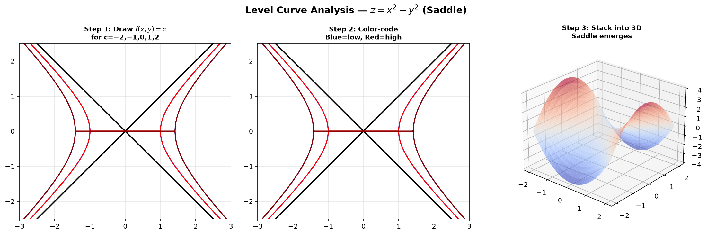

*Graph 9C-S5: Systematic level curve analysis in three stages. Step 1 — Draw level curves for $c=-2,-1,0,1,2$. Step 2 — Color-code by height (blue=low, red=high). Step 3 — Reconstruct the 3D surface by stacking. The saddle $z=x^2-y^2$ emerges from hyperbolas.*

---

> **Up to here (Part E)** : Level curve = $f(x,y)=c$, horizontal slice at height $c$. Systematic method: identify curve type, check existence, analyze spacing, find $c=0$. Contour reading: tight = steep, wide = flat, concentric = hill/bowl, V = valley/ridge.

---

## Part F: Quadric Surfaces — The Six Classic 3D Shapes

> In 2D, second-degree equations give conic sections. In 3D, second-degree equations in $x,y,z$ give quadric surfaces — the six fundamental 3D shapes. Each has a signature sign pattern.

---

## Example 16: The Sign-Pattern Method — Identifying Quadric Surfaces

General quadric: $Ax^2 + By^2 + Cz^2 + Dx + Ey + Fz + G = 0$ (no cross-terms for now).

**The six types, identified by the signs of $A, B, C$**:

| Signs of $x^2, y^2, z^2$ | RHS | Type | Real-world analog |
|:------------------------:|:---:|:----:|:-----------------:|
| $+, +, +$ | $=1$ | **Ellipsoid** | Egg, rugby ball |
| $+, +, +$ | $=0$ | Point (degenerate) | — |
| $+, +, -$ | $=1$ | **Hyperboloid of 1 sheet** | Cooling tower |
| $+, -, -$ | $=1$ | **Hyperboloid of 2 sheets** | Two bowls |
| $+, +, 0$ | $z=$ | **Elliptic paraboloid** | Satellite dish, bowl |
| $+, -, 0$ | $z=$ | **Hyperbolic paraboloid** | Saddle, Pringle chip |
| $+, +, 0$ | $=1$ | **Cylinder** (extruded) | Pipe, tube |
| $+, -, 0$ | $=0$ | **Cone** | Traffic cone (double) |

**Key insight**: Count the number of minus signs (in standard form, RHS = 1).
- 0 minus signs: ellipsoid.
- 1 minus sign: hyperboloid of one sheet (if $=1$) or cone (if $=0$).
- 2 minus signs: hyperboloid of two sheets.
- Missing variable: cylinder (extruded along that variable's axis).
- Linear term on one side: paraboloid.

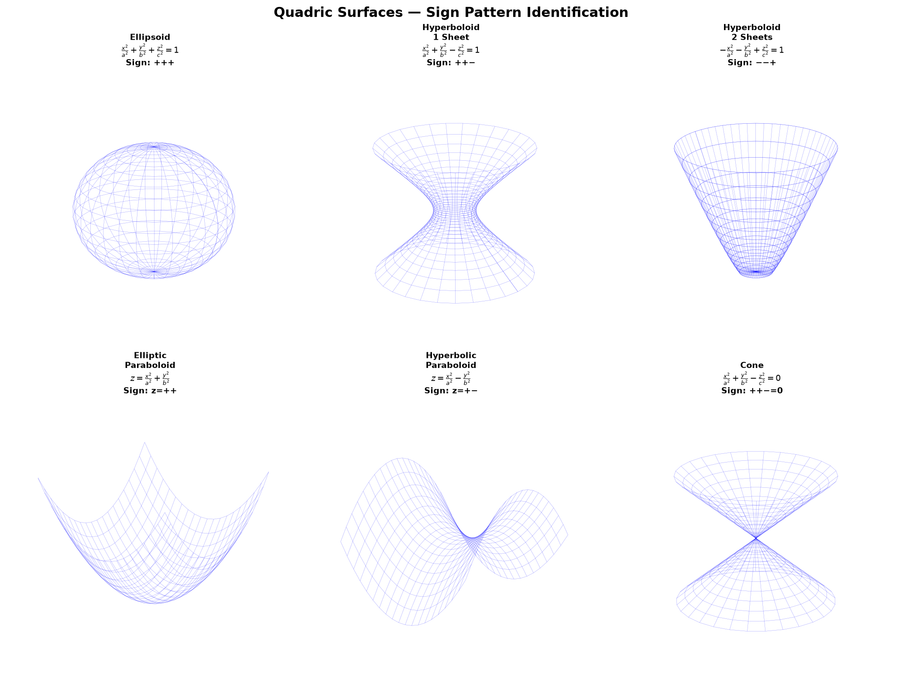

*Graph 9C-F1: The six quadric surfaces identified by sign patterns. Each row shows: the equation form, the sign pattern, the surface, and a key cross-section. Use this as your reference for classification.*

---

## Example 17: Ellipsoid — The 3D Ellipse

$$\frac{x^2}{a^2} + \frac{y^2}{b^2} + \frac{z^2}{c^2} = 1$$

All three cross-sections (set $x=0$, $y=0$, or $z=0$) are ellipses.
- Semi-axes: $a$ (along $x$), $b$ (along $y$), $c$ (along $z$).
- $a=b=c$ → sphere.
- $a=b \neq c$ → spheroid (squashed or stretched sphere).

**Example**: $\frac{x^2}{4} + \frac{y^2}{9} + \frac{z^2}{1} = 1$.
Extends $\pm 2$ in $x$, $\pm 3$ in $y$, $\pm 1$ in $z$.

**Trace method**: Set $z=0$: $\frac{x^2}{4}+\frac{y^2}{9}=1$ — ellipse in $xy$-plane.
Set $x=0$: $\frac{y^2}{9}+\frac{z^2}{1}=1$ — ellipse in $yz$-plane.
Set $y=0$: $\frac{x^2}{4}+\frac{z^2}{1}=1$ — ellipse in $xz$-plane.

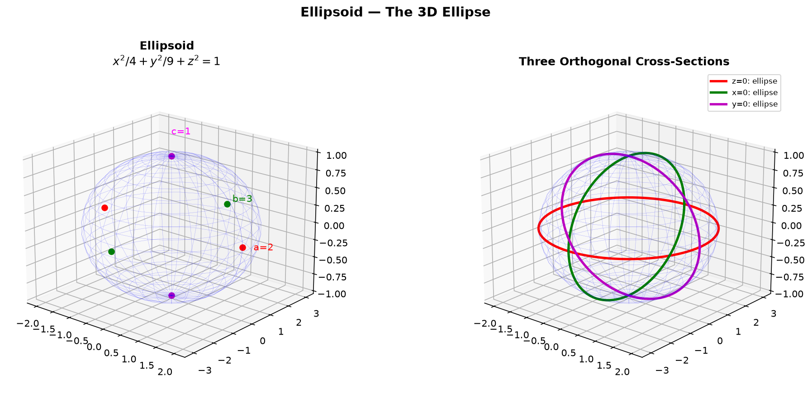

*Graph 9C-F2: Ellipsoid $\frac{x^2}{4}+\frac{y^2}{9}+\frac{z^2}{1}=1$. Left — The full surface with semi-axes labeled. Right — Three orthogonal cross-sections, each an ellipse. The trace method reveals the shape from any viewing angle.*

---

## Example 18: Elliptic Paraboloid — The 3D Bowl

$$z = \frac{x^2}{a^2} + \frac{y^2}{b^2}$$

Opens upward. Vertex at $(0,0,0)$. All vertical cross-sections are parabolas. Horizontal cross-sections are ellipses.
- Circular paraboloid: $a=b$ (all horizontal cross-sections are circles).
- Elliptical paraboloid: $a \neq b$ (horizontal cross-sections are ellipses).

**Example**: $z = x^2 + 2y^2$.
Vertex $(0,0,0)$. Cross-section at $z=4$: $x^2+2y^2=4$ → ellipse.
Cross-section at $x=0$: $z=2y^2$ → parabola in $yz$-plane.
Cross-section at $y=0$: $z=x^2$ → parabola in $xz$-plane.

**Downward opening**: $z = -\frac{x^2}{a^2} - \frac{y^2}{b^2}$. Same shape, flipped over.

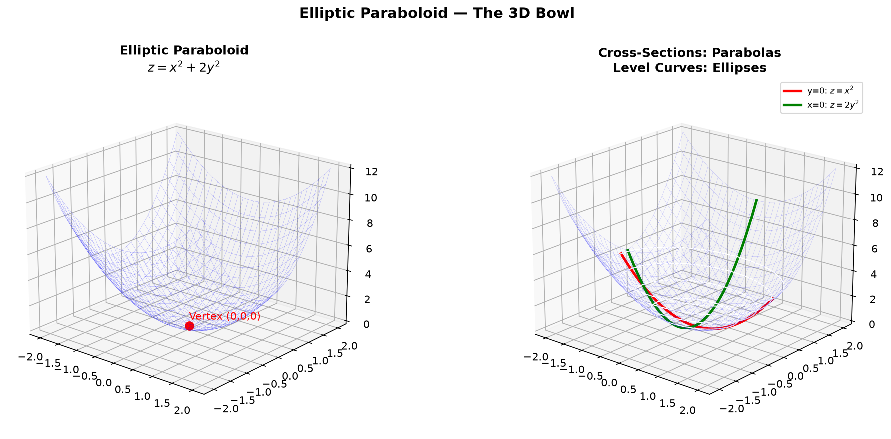

*Graph 9C-F3: Elliptic paraboloid $z=x^2+2y^2$. Left — The bowl with vertex at origin. Right — Two cross-sections: at $x=0$ (steeper parabola, $z=2y^2$) and at $y=0$ (gentler parabola, $z=x^2$). Level curves (rings) show elliptical contours.*

---

## Example 19: Hyperbolic Paraboloid — The Saddle

$$z = \frac{x^2}{a^2} - \frac{y^2}{b^2}$$

Curves upward in the $x$-direction (parabola opening up), downward in the $y$-direction (parabola opening down). The origin is a **saddle point** — a minimum along one direction and a maximum along the other.

**Key features**:
- Cross-section $y=0$: $z = x^2/a^2$ — upward parabola.
- Cross-section $x=0$: $z = -y^2/b^2$ — downward parabola.
- Level curves: hyperbolas for $c \neq 0$, two crossing lines for $c=0$.

**Example**: $z = x^2 - y^2$ ($a=b=1$).
At $y=0$: $z=x^2$ (smile). At $x=0$: $z=-y^2$ (frown). At $(0,0)$: saddle point.
This surface cannot be "flattened" without tearing — it has negative Gaussian curvature.

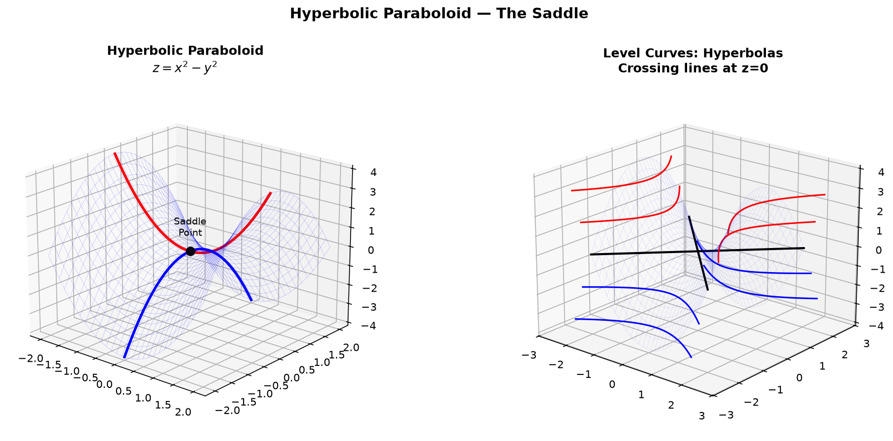

*Graph 9C-F4: Hyperbolic paraboloid $z=x^2-y^2$. Left — The saddle shape with key cross-sections. The red parabola opens upward (x-direction), the blue parabola opens downward (y-direction). Right — Level curves are hyperbolas, with the crossing lines at z=0 showing the saddle point.*

---

## Example 20: Cylinders — Extruding a 2D Curve

A cylinder has **one variable missing** from the equation. The surface is the 2D curve extruded infinitely along the missing variable's axis.

| Equation | The 2D curve | Extruded along | Surface |
|:--------:|:------------:|:--------------:|:-------:|
| $x^2 + y^2 = 9$ | Circle radius 3 in $xy$-plane | $z$-axis | Circular cylinder |
| $z = \sin x$ | Sine wave in $xz$-plane | $y$-axis | Wavy sheet |
| $\frac{x^2}{4} + \frac{z^2}{9} = 1$ | Ellipse in $xz$-plane | $y$-axis | Elliptical cylinder |
| $y = x^2$ | Parabola in $xy$-plane | $z$-axis | Parabolic cylinder |

**How to recognize**: The equation uses only two variables → the third variable is free → extrusion along that axis.

**Example**: $x^2 + y^2 = 1$ in 3D.
In 2D it's a circle. In 3D it's an infinitely tall pipe. Every horizontal slice gives the same circle. $z$ can be ANY value.

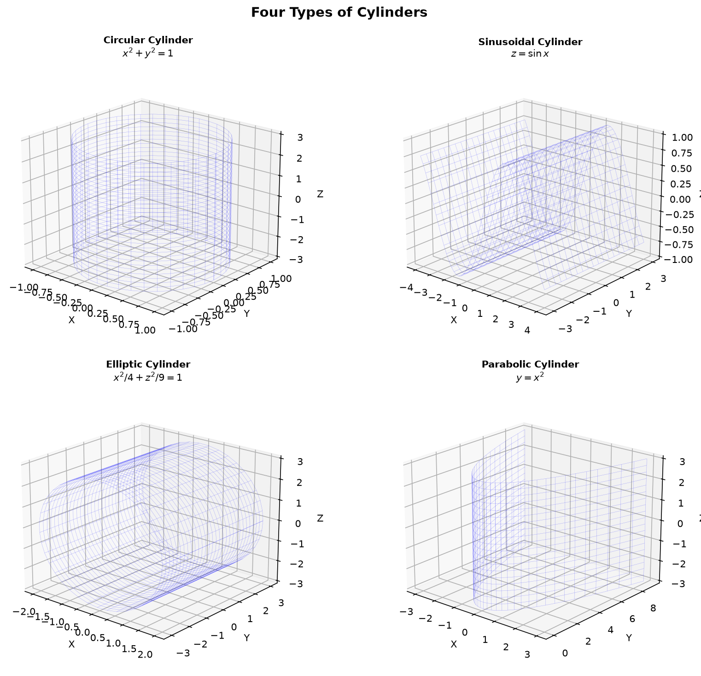

*Graph 9C-F5: Four types of cylinders. Top-left — Circular cylinder $x^2+y^2=1$ (extruded along z). Top-right — Sinusoidal cylinder $z=\sin x$ (extruded along y). Bottom-left — Elliptic cylinder $x^2/4+z^2/9=1$ (extruded along y). Bottom-right — Parabolic cylinder $y=x^2$ (extruded along z).*

---

## Example 21: Hyperboloids — One Sheet vs. Two Sheets

**Hyperboloid of one sheet** (connected, cooling tower):
$$\frac{x^2}{a^2} + \frac{y^2}{b^2} - \frac{z^2}{c^2} = 1$$

Two plus signs, one minus sign. The surface is a single connected piece, narrowest at $z=0$ (the "waist" is an ellipse of radii $a$ and $b$).

Cross-section $z=0$: $\frac{x^2}{a^2}+\frac{y^2}{b^2}=1$ — ellipse (the waist).
Cross-section $z=k$: $\frac{x^2}{a^2}+\frac{y^2}{b^2}=1+\frac{k^2}{c^2}$ — larger ellipse.
As $|z| \to \infty$, the cross-section grows without bound.

**Hyperboloid of two sheets** (disconnected, two bowls):
$$-\frac{x^2}{a^2} - \frac{y^2}{b^2} + \frac{z^2}{c^2} = 1$$

Two minus signs, one plus sign. Two separate pieces, one for $z \geq c$, one for $z \leq -c$.
The gap between them: $|z| < c$ has no real points — the equation gives a negative LHS.

**Identifying trick**:
- One sheet: exactly ONE minus sign → connected.
- Two sheets: exactly TWO minus signs → disconnected.

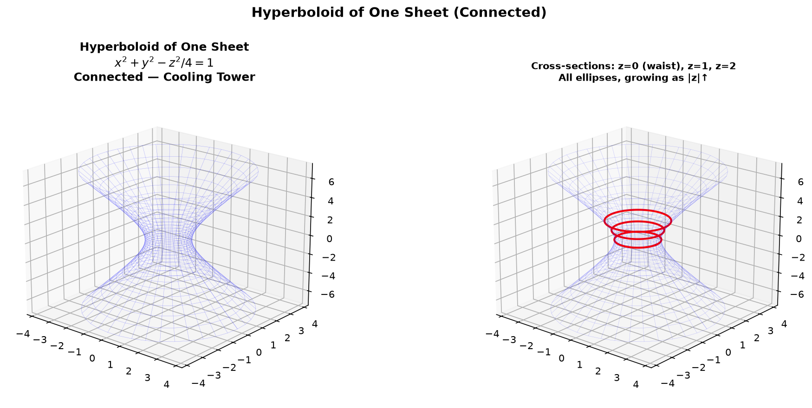

*Graph 9C-F6: Hyperboloid of one sheet $x^2+y^2-z^2/4=1$. Left — The full cooling-tower shape with the elliptical waist at z=0. Right — Cross-sections: at z=0 (smallest ellipse), z=2 (larger ellipse), z=4 (even larger). The surface is connected.*

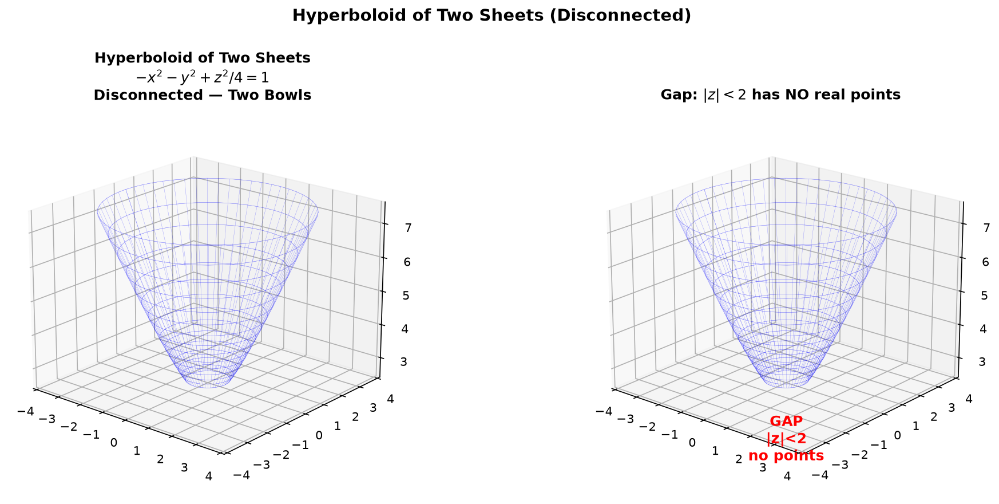

*Graph 9C-F7: Hyperboloid of two sheets $-x^2-y^2+z^2/4=1$. Left — Two separate bowl-shaped pieces, opening along z-axis. Right — Cross-sections: no real points for |z|<2, ellipses for |z|>2, single points at z=±2. Note the gap between the two sheets.*

---

## Example 22: The Cone — Double Nappe

$$z^2 = x^2 + y^2 \quad \text{or} \quad \frac{x^2}{a^2} + \frac{y^2}{b^2} - \frac{z^2}{c^2} = 0$$

Two cones meeting at the origin (the **vertex**): one opening upward, one downward.

**Key features**:
- Cross-section $z=k$: $x^2+y^2=k^2$ — circle of radius $|k|$. Radius grows linearly with height.
- Cross-section $z=0$: a single point $(0,0,0)$ — the vertex.
- The slope is constant — unlike the paraboloid, which curves.

**Elliptic cone**: $\frac{x^2}{a^2} + \frac{y^2}{b^2} = \frac{z^2}{c^2}$. Cross-sections are ellipses, not circles.

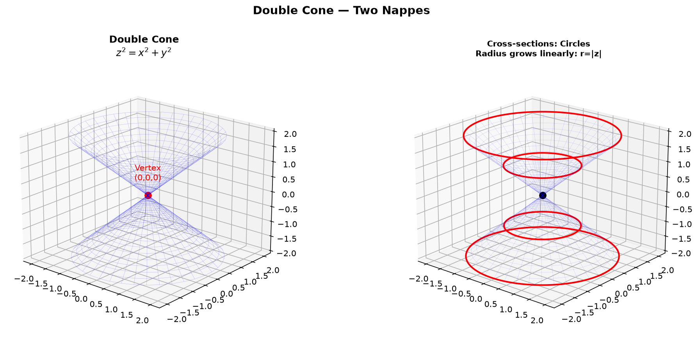

*Graph 9C-F8: Double cone $z^2=x^2+y^2$. Left — Two nappes meeting at the vertex (origin). Right — Cross-sections at z=−2, −1, 0, 1, 2. At z=0, a single point. Radius grows linearly: r=|z|.*

---

## Example 23: Quadric Surface Gallery — Side-by-Side Comparison

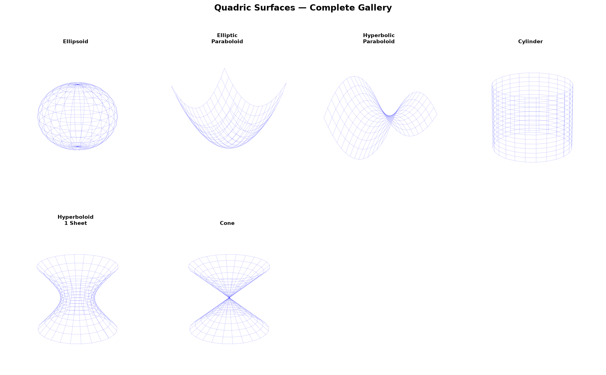

*Graph 9C-F9: All six quadric surfaces side by side with their equations and key cross-sections. Top row — Ellipsoid, Elliptic Paraboloid, Hyperbolic Paraboloid. Bottom row — Cylinder, Hyperboloid of 1 sheet, Double Cone. Each labeled with its sign pattern.*

---

## Example 24: Degenerate Quadrics — When the Equation Collapses

Not all second-degree equations produce a "full" surface. Some degenerate into lower-dimensional objects.

| Equation | What it actually is | Dimension |
|:--------:|:-------------------:|:---------:|
| $x^2 + y^2 + z^2 = 0$ | Single point $(0,0,0)$ | 0 |
| $x^2 + y^2 = 0$ | The $z$-axis (a line) | 1 |
| $x^2 = 1$ | Two parallel planes $x=\pm 1$ | 2 |
| $x^2 - y^2 = 0$ | Two intersecting planes $y=\pm x$ | 2 |
| $x^2 + y^2 + z^2 = -1$ | Empty set (no real points) | — |

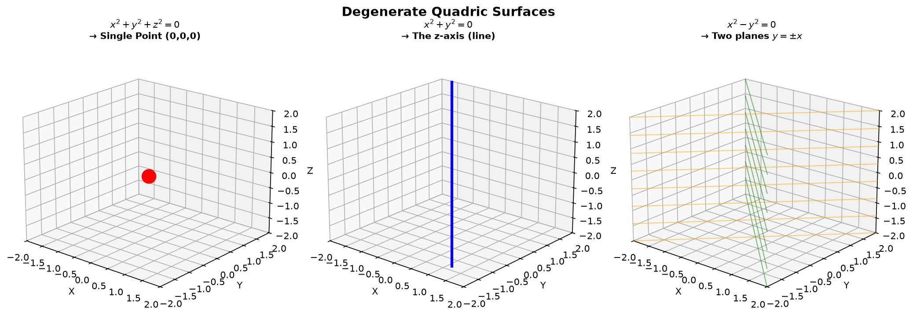

*Graph 9C-F10: Degenerate quadrics. Left — $x^2+y^2+z^2=0$ is just the origin. Middle — $x^2+y^2=0$ is the z-axis. Right — $x^2-y^2=0$ is two intersecting planes. These remind us that algebra and geometry must be checked together.*

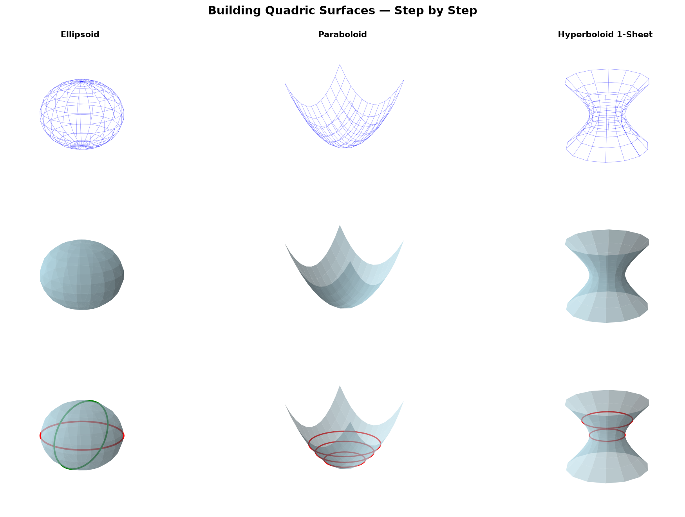

*Graph 9C-S6: Building quadric surfaces in three stages. Stage 1 — Wireframe skeleton shows the underlying grid. Stage 2 — Fill in faces to see the solid surface. Stage 3 — Add cross-sections (horizontal slices) to reveal internal structure. Shown: ellipsoid, paraboloid, and hyperboloid of one sheet.*

---

> **Up to here (Part F)** : Six quadric surfaces identified by sign patterns. Ellipsoid (+++). Elliptic paraboloid (z=++). Hyperbolic paraboloid (z=+−). Cylinder (missing variable). Hyperboloid of 1 sheet (+ + − =1). Hyperboloid of 2 sheets (− − + =1). Cone (+ + − =0). Degenerate cases. Trace method for cross-sections.

---

## Part G: Intersection of Surfaces — Curves in 3D Space

> Two surfaces intersecting produce a curve. The intersection of a surface and a plane is called a **trace**. Finding these intersections is the 3D analog of solving simultaneous equations.

---

## Example 25: Sphere–Plane Intersection — A Circle in Space

Intersect sphere $x^2+y^2+z^2 = R^2$ with plane $ax+by+cz = d$.

**Result**: A circle (if the plane cuts through), a point (if tangent), or empty (if the plane misses).

**Finding the intersection circle**:
① Distance from sphere center to plane: $D = \frac{|d|}{\sqrt{a^2+b^2+c^2}}$ (center at origin).
② Radius of intersection circle: $r = \sqrt{R^2 - D^2}$.
③ Center of intersection circle: the foot of the perpendicular from sphere center to plane.

**Example**: Sphere $x^2+y^2+z^2=20$, plane $x+y+z=6$.
$D = \frac{|6|}{\sqrt{3}} = 2\sqrt{3} \approx 3.46$.
$r = \sqrt{20 - 12} = \sqrt{8} = 2\sqrt{2} \approx 2.83$.
Center: $(2, 2, 2)$ (since the normal direction is $(1,1,1)$, scaled by $D/|\vec{n}| = 2$).

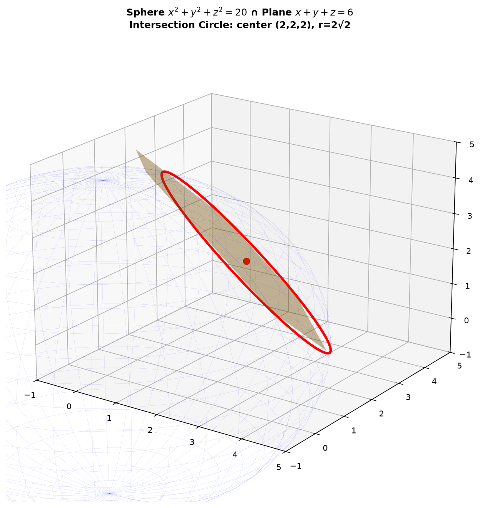

*Graph 9C-G1: Sphere $x^2+y^2+z^2=20$ intersected by plane $x+y+z=6$. The intersection is a circle (red) with center (2,2,2) and radius $2\sqrt{2}$. Distance from origin to plane determines the circle's size.*

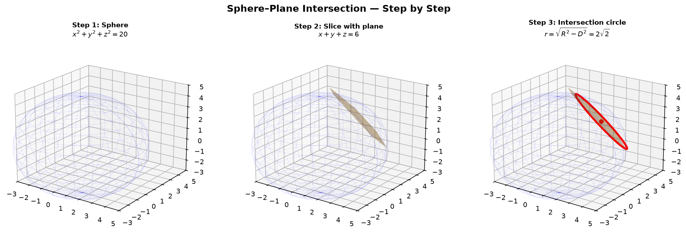

*Graph 9C-S7: Finding the intersection circle in three stages. Step 1 — The sphere alone. Step 2 — The plane slices through (orange). Step 3 — The intersection circle emerges (red). Key formula: $r = \sqrt{R^2 - D^2}$.*

---

## Example 26: Intersection of Two Cylinders — The Bicylindrical Curve

$x^2 + y^2 = 1$ (circular cylinder along $z$) and $x^2 + z^2 = 1$ (circular cylinder along $y$).

**Finding the intersection**:
From the first: $y^2 = 1 - x^2$. From the second: $z^2 = 1 - x^2$.
So $y^2 = z^2$ → $y = \pm z$.
The intersection is two curves, each an ellipse-like space curve.

**Parametrization**: Let $x = \cos t$. Then $y = \sin t$, $z = \pm\sin t$.
$(x(t), y(t), z(t)) = (\cos t,\; \sin t,\; \pm\sin t)$, $t \in [0, 2\pi]$.
These are two ellipses at 45° to the axes, crossing at $(\pm1, 0, 0)$.

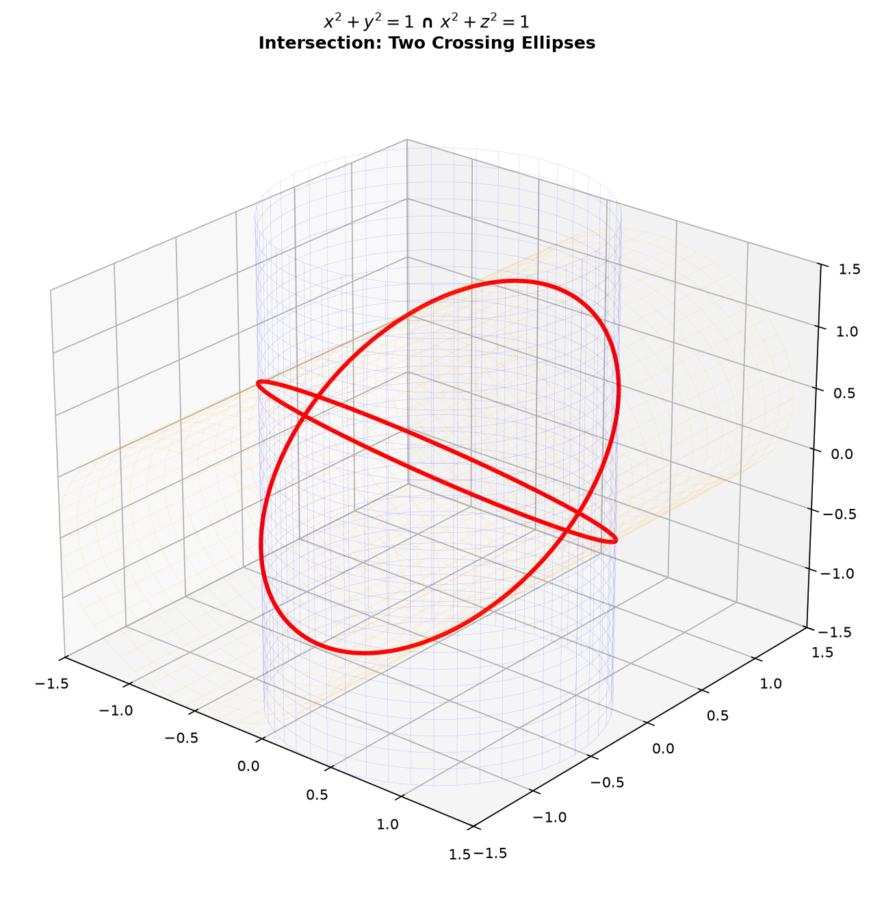

*Graph 9C-G2: Two perpendicular cylinders $x^2+y^2=1$ (blue) and $x^2+z^2=1$ (orange). Their intersection (red) is a 3D curve — two crossing ellipses. This is a classic architectural form (groin vault).*

---

## Example 27: Line–Surface Intersection — Finding Entry and Exit Points

A line in parametric form: $(x, y, z) = (x_0 + at,\; y_0 + bt,\; z_0 + ct)$.
To find where it pierces a surface: substitute into the surface equation and solve for $t$.

**Example**: Line through $(0, 0, 5)$ with direction $(1, 1, -1)$ intersects sphere $x^2+y^2+z^2=25$.
Parametric: $(t, t, 5-t)$.
Substitute: $t^2 + t^2 + (5-t)^2 = 25$ → $2t^2 + 25 - 10t + t^2 = 25$ → $3t^2 - 10t = 0$ → $t(3t-10)=0$.
$t=0$: point $(0,0,5)$ — the starting point (on the sphere!).
$t=\frac{10}{3}$: point $(\frac{10}{3}, \frac{10}{3}, \frac{5}{3})$ — the exit point.

The line enters at $(0,0,5)$ (tangent or piercing depends on direction) and exits at $(\frac{10}{3}, \frac{10}{3}, \frac{5}{3})$.

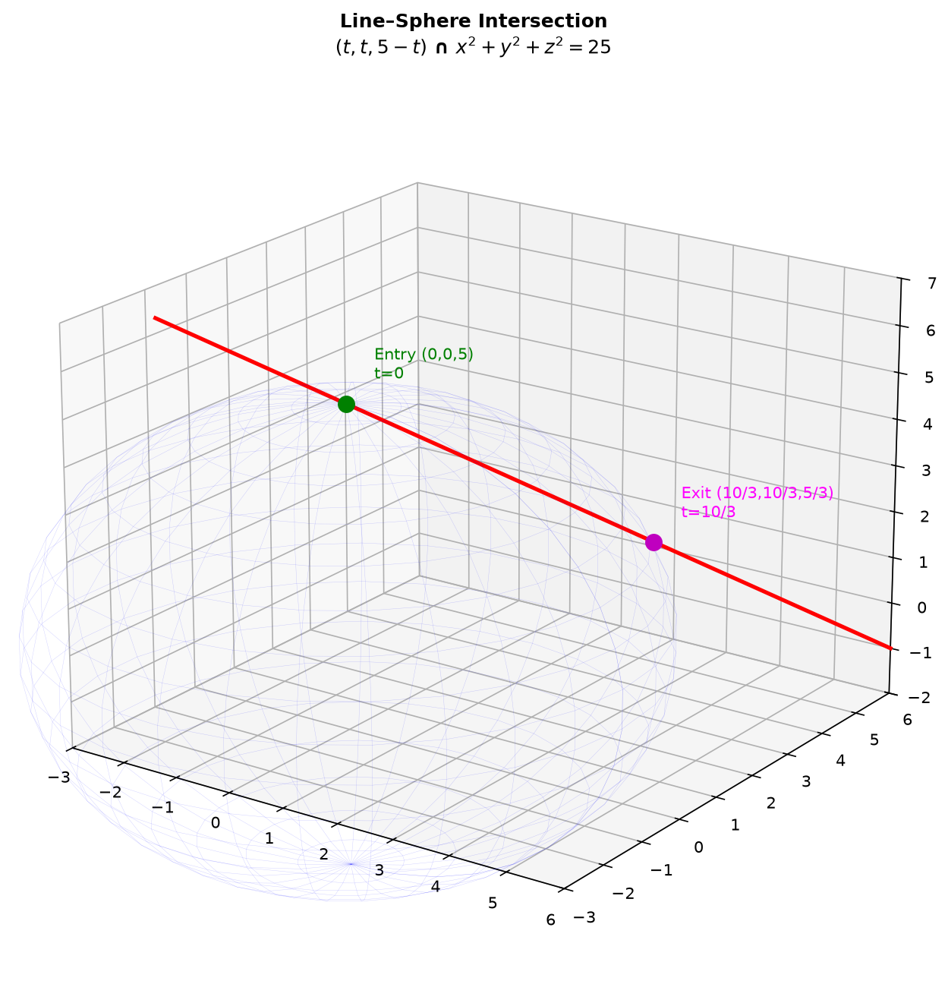

*Graph 9C-G3: A line intersecting a sphere. The parametric line passes through the sphere, entering at one point and exiting at another. The two intersection points are found by solving the quadratic in t.*

---

> **Up to here (Part G)** : Sphere–plane intersection (circle). Two cylinders (bicylindrical curve). Line–surface (solve for parameter $t$).

---

## Part H: Symmetry in 3D

> Just as functions in 2D have even/odd symmetry, surfaces in 3D have symmetries across planes, axes, and the origin.

---

## Example 28: Testing a Surface for Symmetry

A surface defined by $F(x,y,z)=0$ (or $z=f(x,y)$) has:

| Symmetry type | Test | What stays unchanged |
|:------------:|:----:|:--------------------|
| $xy$-plane | Replace $z \to -z$ | Mirror across $z=0$ |
| $xz$-plane | Replace $y \to -y$ | Mirror across $y=0$ |
| $yz$-plane | Replace $x \to -x$ | Mirror across $x=0$ |
| Origin | $(x,y,z) \to (-x,-y,-z)$ | 180° rotation around origin |
| $z$-axis (rotational) | $x^2+y^2$ appears as a block | Rotational symmetry around $z$ |

**Example — $x^2 + y^2 + z^2 = 1$ (sphere)**:
- $x \to -x$: unchanged. $y \to -y$: unchanged. $z \to -z$: unchanged.
- Origin symmetry: unchanged.
- Rotational symmetry about any axis through origin.
→ A sphere has **maximum symmetry**.

**Example — $z = x^2 + y^2$ (paraboloid)**:
- $x \to -x$: $(-x)^2 = x^2$ → unchanged → $xz$-plane symmetry.
- $y \to -y$: unchanged → $yz$-plane symmetry.
- $z \to -z$: $-z \neq z$ → NO $xy$-plane symmetry.
- Rotational symmetry about $z$-axis (only $x^2+y^2$ appears).

**Example — $z = xy$ (hyperbolic paraboloid)**:
- $x \to -x$: $z = -xy$ → changed. $y \to -y$: changed.
- $(x,y) \to (-x,-y)$: $z = (-x)(-y) = xy$ → unchanged → origin symmetry!

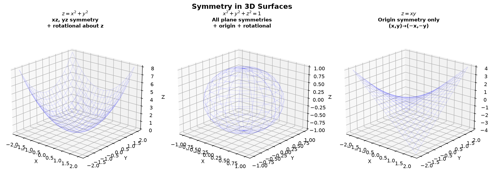

*Graph 9C-H1: Symmetry types for 3D surfaces. Left — $z=x^2+y^2$ has $xz$ and $yz$ plane symmetry + rotational symmetry about z-axis. Middle — $x^2+y^2+z^2=1$ has all symmetries. Right — $z=xy$ has origin symmetry (180° rotation).*

---

## Common Mistakes

### Mistake 1: Treating $x^2+y^2=1$ as a circle in 3D

**Wrong**: "$x^2+y^2=1$ is a circle in space." **Right**: In 3D, it's an infinitely tall cylinder. The $z$-coordinate is unrestricted. Every horizontal cross-section is the same circle — the surface is all those circles stacked.

### Mistake 2: Forgetting the square root in the denominator for distance

**Wrong**: $D = \frac{|ax_0+by_0+cz_0-d|}{a^2+b^2+c^2}$.
**Right**: $D = \frac{|ax_0+by_0+cz_0-d|}{\sqrt{a^2+b^2+c^2}}$. The denominator normalizes by the length of the normal vector.

### Mistake 3: Confusing one-sheet and two-sheet hyperboloids

**Wrong**: They look similar. **Right**: One sheet = exactly one minus sign (connected, cooling tower). Two sheets = exactly two minus signs (disconnected, two bowls). Test by trying $z=0$: one-sheet gives an ellipse, two-sheet gives no real points.

### Mistake 4: Assuming $f(x,y)=c$ always gives a curve

**Wrong**: "Every $c$ gives a level curve." **Right**: For $z=x^2+y^2$, $c=-1$ gives $x^2+y^2=-1$ — no real points. Always check if the level curve EXISTS for the given $c$.

### Mistake 5: Treating cross product as commutative

**Wrong**: $\vec{u} \times \vec{v} = \vec{v} \times \vec{u}$. **Right**: $\vec{u} \times \vec{v} = -(\vec{v} \times \vec{u})$. The cross product is **anti-commutative** — reversing the order flips the direction.

---

## What We Just Did

```
(1) 3D Coordinate System: axes (x,y,z), 8 octants, right-hand rule. Vectors:
    magnitude, addition, scalar multiplication, unit vectors.
    Dot product = alignment (cos θ). Cross product = perpendicular (sin θ, area).

(2) Planes: ax+by+cz=d, normal vector (a,b,c). From point+normal or 3 points
    (cross product). Point-to-plane distance. Angle between planes (via normals).
    Distance between parallel planes.

(3) Spheres: (x−h)²+(y−k)²+(z−ℓ)²=R². Point-to-sphere = ||PC|−R|.

(4) z = f(x,y): height map over xy-plane. Domain = 2D region.
    Four domain rules extended from 9A1. Sketch boundaries, shade regions.

(5) Level Curves: f(x,y)=c, horizontal slice at height c. Systematic method:
    identify curve type → check existence → analyze variation → read spacing.
    Tight = steep, wide = flat, concentric = hill/bowl, V = valley/ridge.

(6) Quadric Surfaces — six types by sign pattern:
    Ellipsoid (+++), Paraboloid (z=++ or z=+−), Cylinder (missing variable),
    Hyperboloid 1-sheet (+ + − =1), Hyperboloid 2-sheet (− − + =1), Cone (+ + − =0).
    Degenerate cases (point, line, planes, empty). Trace method for cross-sections.

(7) Intersections: Sphere–plane = circle. Two cylinders = 3D curve.
    Line–surface = substitute parametric line, solve for t.

(8) Symmetry: Test by sign changes. Sphere = maximum symmetry.
    Paraboloid = rotational + two plane symmetries. Saddle = origin symmetry.
```

---

## Practice 1

Find the distance from $(2, -1, 4)$ to the plane $x + 2y + 2z = 6$. Then find the foot of the perpendicular.

→ Reference: **Example 6**

> Solutions: [Solutions](solutions/9C-solutions.md#practice-1)

---

## Practice 2

Find the center and radius of the sphere $x^2 + y^2 + z^2 - 4x + 2y - 6z + 5 = 0$.

→ Reference: **Example 9**

> Solutions: [Solutions](solutions/9C-solutions.md#practice-2)

---

## Practice 3

Describe and sketch the level curves of $z = x^2 - y^2$ at $c = -2, -1, 0, 1, 2$. What quadric surface is this? What happens at $c=0$?

→ Reference: **Examples 14, 19**

> Solutions: [Solutions](solutions/9C-solutions.md#practice-3)

---

## Practice 4

Classify each quadric surface and sketch its key cross-sections:
(a) $x^2 + y^2 - z^2 = 1$
(b) $z = 4 - x^2 - y^2$
(c) $x^2 + 2y^2 + 3z^2 = 12$

→ Reference: **Examples 16-22**

> Solutions: [Solutions](solutions/9C-solutions.md#practice-4)

---

## Practice 5

Find the center and radius of the circle formed by intersecting the sphere $x^2+y^2+z^2=20$ with the plane $x+y+z=6$.

→ Reference: **Example 25**

> Solutions: [Solutions](solutions/9C-solutions.md#practice-5)

---

## Practice 6: Real Battle

A plane passes through the three points $(1,0,0)$, $(0,2,0)$, $(0,0,3)$. Find its equation in both general and intercept form. Then find the distance from the origin to this plane. What is the volume of the tetrahedron formed by this plane and the three coordinate planes?

→ Reference: **Examples 5, 6**

> Solutions: [Solutions](solutions/9C-solutions.md#practice-6)

---

## Basic Algebra Drill — 3D Geometry (15 Problems)

> Pure computation + 5 geometry-insight problems (marked ◆).

**D1.** Find the distance between $(1, -2, 3)$ and $(5, 2, 15)$.

**D2.** Write the equation of a plane through $(2, 1, -3)$ with normal vector $(1, 4, -2)$.

**D3.** Find the center and radius of $x^2 + y^2 + z^2 + 8x - 2y + 10z + 8 = 0$.

**D4.** Find the distance from $(3, 1, -2)$ to the plane $2x - y + 2z = 4$.

**D5.** Compute $\vec{u} \cdot \vec{v}$ and $\vec{u} \times \vec{v}$ for $\vec{u}=(2,1,-1)$ and $\vec{v}=(1,-1,2)$. Are they perpendicular?

**D6.** Identify the surface: $x^2 + y^2 = 16$ (in 3D). Sketch two cross-sections.

**D7.** Identify the surface: $z = 5 - x^2 - y^2$. Find its vertex and the shape of its level curves.

**D8.** Identify the surface: $\frac{x^2}{4} + \frac{y^2}{9} + \frac{z^2}{16} = 1$. State the lengths of its semi-axes.

**D9.** Identify the surface: $x^2 - y^2 + z^2 = 0$. (Hint: is it a cone? Check the signs carefully.)

**D10.** Find the distance from $(7, 0, 0)$ to the sphere $x^2+y^2+z^2=16$.

**◆ D11.** Without using the formula, explain geometrically why the distance from the origin to the plane $x+y+z=3$ is exactly $\sqrt{3}$. (Hint: what point on the plane is closest to the origin?)

**◆ D12.** The domain of $z = \sqrt{9 - x^2 - y^2}$ is a disk. But the domain of $z = \frac{1}{\sqrt{9 - x^2 - y^2}}$ is an OPEN disk. Explain geometrically what happens to the surface at the boundary in each case.

**◆ D13.** Level curves of $z = x^2 + 4y^2$ at evenly spaced heights get closer together as $z$ increases. What does this tell you about the steepness of the paraboloid as you go up? Contrast with the cone $z = \sqrt{x^2+y^2}$.

**◆ D14.** A plane $z = c$ (horizontal) intersects the cone $z^2 = x^2 + y^2$. For which value of $c$ is the intersection a single point? For $c>0$, what shape is the intersection? How does its size grow with $c$?

**◆ D15.** The equation $x^2 + y^2 - z^2 = 0$ defines a cone. The equation $x^2 + y^2 - z^2 = -1$ defines a hyperboloid of two sheets. What happens to the surface as the RHS goes from 0 to −1? Describe the geometric transition.

> Solutions: [Solutions](solutions/9C-solutions.md#basic-drill)

---

## Advanced Algebra Drill — 3D Geometry (15 Problems)

> Multi-step geometric reasoning + 5 geometry-insight problems (marked ◆).

**A1.** Find the distance between the parallel planes $2x - y + 2z = 5$ and $2x - y + 2z = -7$.

**A2.** Find the equation of the sphere that has $(2, -1, 3)$ and $(6, 5, -1)$ as endpoints of a diameter.

**A3.** Find the angle between the planes $x + y + z = 1$ and $x - y + z = 2$.

**A4.** The surface $z = xy$ is a hyperbolic paraboloid. Describe its level curves at $z = -2, -1, 0, 1, 2$ and explain why the saddle shape emerges from hyperbolas.

**A5.** Find the intersection of the line through $(1,2,3)$ with direction $(1,-1,1)$ and the plane $2x + y - z = 4$.

**A6.** A plane passes through $(1,1,1)$ and is perpendicular to both $x+y+z=1$ and $x-y+2z=0$. Find its equation. (Hint: normal is cross product of the two normals.)

**A7.** Find the equation of the cylinder whose base is the ellipse $\frac{x^2}{4}+\frac{y^2}{9}=1$ and whose rulings are parallel to the $z$-axis.

**A8.** Two spheres: $x^2+y^2+z^2=25$ and $(x-8)^2+y^2+z^2=9$. Do they intersect? If so, find the equation of the plane containing their circle of intersection.

**A9.** Find the point on the plane $x + 2y + 3z = 13$ closest to the origin. (Hint: the closest point lies along the normal direction from the origin.)

**A10.** The surface $x^2 + 4y^2 - z^2 = 0$ is an elliptic cone. Describe the cross-section at $z=2$ and at $y=1$.

**◆ A11.** Find the volume of the tetrahedron formed by the coordinate planes and the plane $\frac{x}{a} + \frac{y}{b} + \frac{z}{c} = 1$. Then show that the sum of the reciprocals of the squares of the distances from the origin to the four faces is constant. What is it?

**◆ A12.** Consider the family of planes $x + y + z = k$ for varying $k$. As $k$ increases from $0$ to $\infty$, describe how the intersection of each plane with the ellipsoid $\frac{x^2}{4} + \frac{y^2}{4} + \frac{z^2}{9} = 1$ changes shape and size. For what $k$ does the intersection degenerate to a point?

**◆ A13.** The surface $\frac{x^2}{a^2} + \frac{y^2}{b^2} - \frac{z^2}{c^2} = 0$ is an elliptic cone. Now replace $0$ with $\varepsilon$ (a small number). Show that for $\varepsilon > 0$, you get a hyperboloid of one sheet, and for $\varepsilon < 0$, a hyperboloid of two sheets. The cone is the "transition" between these two fundamentally different shapes. Explain geometrically.

**◆ A14.** A line through the origin with direction $(a,b,c)$ intersects the unit sphere $x^2+y^2+z^2=1$ at two antipodal points. Show that these two intersection points are always $(a,b,c)/\sqrt{a^2+b^2+c^2}$ and its negative — regardless of which line you pick. What does this tell you about the sphere's symmetry?

**◆ A15.** Level surfaces of $w = f(x,y,z)$ (a function of THREE variables) are surfaces in 3D, not curves. Consider $w = x^2 + y^2 + z^2$. Its level surfaces are spheres. Now consider $w = x^2 + y^2 - z^2$. Describe the family of level surfaces as $w$ varies from $-\infty$ to $+\infty$. At what value of $w$ does the topology change?

> Solutions: [Solutions](solutions/9C-solutions.md#advanced-drill)

---

## Today's Procedure

```
Step 1: 3D coordinates + vectors. Dot product (alignment, perpendicular test).
         Cross product (normal to two vectors, area).

Step 2: Planes — ax+by+cz=d, normal (a,b,c). From 3 points: AB×AC = normal.
         Point-to-plane distance: |ax₀+by₀+cz₀−d|/√(a²+b²+c²).

Step 3: z = f(x,y) — height map. Domain = 2D region. Sketch boundaries,
         shade the satisfying region.

Step 4: Level curves — f(x,y)=c. Systematic method: identify, check existence,
         analyze variation, read spacing → reconstruct 3D shape.

Step 5: Quadric surfaces — 6 types by sign pattern. Trace method:
         set x=0, y=0, z=0 to find cross-sections. Build the surface
         slice by slice.

Step 6: Intersections — sphere+plane=circle. Two surfaces = 3D curve.
         Line+surface: substitute parametric form, solve for t.
```

---

## How to Read These Symbols

| Symbol | Reads as | Meaning |
|:---:|:---:|------|
| $\vec{v} = (v_x, v_y, v_z)$ | "vector v equals vx vy vz" | vector in 3D with components |
| $\|\vec{v}\| = \sqrt{v_x^2+v_y^2+v_z^2}$ | "magnitude of v" / "length of v" | vector length |
| $\vec{u} \cdot \vec{v}$ | "u dot v" | dot product = $\|\vec{u}\|\|\vec{v}\|\cos\theta$ |
| $\vec{u} \times \vec{v}$ | "u cross v" | cross product = perpendicular vector |
| $ax+by+cz=d$ | "a x plus b y plus c z equals d" | plane with normal $(a,b,c)$ |
| $z = f(x,y)$ | "z equals f of x y" | surface — height over xy-plane |
| $f(x,y) = c$ | "f of x y equals c" | level curve at height c |
| $x^2+y^2+z^2 = R^2$ | "x squared plus y squared plus z squared equals R squared" | sphere radius R |
| $z = x^2 + y^2$ | "z equals x squared plus y squared" | elliptic paraboloid (bowl) |
| $z = x^2 - y^2$ | "z equals x squared minus y squared" | hyperbolic paraboloid (saddle) |
| $z^2 = x^2 + y^2$ | "z squared equals x squared plus y squared" | double cone |
| $\frac{x^2}{a^2}+\frac{y^2}{b^2}-\frac{z^2}{c^2} = 1$ | "hyperboloid of one sheet" | cooling tower shape |
| $-\frac{x^2}{a^2}-\frac{y^2}{b^2}+\frac{z^2}{c^2} = 1$ | "hyperboloid of two sheets" | two disconnected bowls |
| trace | "trace" / "cross-section" | intersection with coordinate plane |
| octant | "octant" | 1 of 8 regions in 3D (like quadrants) |
| quadric surface | "quadric surface" | second-degree equation in x,y,z |

---

## Terminology

| What we call it | Math term | Notation |
|:---------------:|:---------:|:--------:|
| vector | vector in $\mathbb{R}^3$ | $\vec{v} = (v_x, v_y, v_z)$ |
| magnitude / length | norm | $\|\vec{v}\|$ |
| dot product | scalar product | $\vec{u} \cdot \vec{v}$ |
| cross product | vector product | $\vec{u} \times \vec{v}$ |
| plane | plane | $ax+by+cz=d$ |
| normal vector | normal vector | $\vec{n}=(a,b,c)$ perpendicular to plane |
| sphere | sphere | $(x-h)^2+(y-k)^2+(z-\ell)^2=R^2$ |
| height map / landscape | function of two variables | $z=f(x,y)$ |
| domain in 3D | domain (region in $\mathbb{R}^2$) | set of $(x,y)$ where $f(x,y)$ is defined |
| level curve | level curve / contour line | $f(x,y)=c$ |
| trace | trace / cross-section | intersection of surface with coordinate plane |
| ellipsoid | ellipsoid | $\frac{x^2}{a^2}+\frac{y^2}{b^2}+\frac{z^2}{c^2}=1$ |
| elliptic paraboloid | elliptic paraboloid (bowl) | $z=\frac{x^2}{a^2}+\frac{y^2}{b^2}$ |
| hyperbolic paraboloid | hyperbolic paraboloid (saddle) | $z=\frac{x^2}{a^2}-\frac{y^2}{b^2}$ |
| cylinder | cylinder | one variable missing, curve extruded |
| hyperboloid (1 sheet) | hyperboloid of one sheet | $\frac{x^2}{a^2}+\frac{y^2}{b^2}-\frac{z^2}{c^2}=1$ |
| hyperboloid (2 sheets) | hyperboloid of two sheets | $-\frac{x^2}{a^2}-\frac{y^2}{b^2}+\frac{z^2}{c^2}=1$ |
| elliptic cone | elliptic cone | $\frac{x^2}{a^2}+\frac{y^2}{b^2}-\frac{z^2}{c^2}=0$ |
| degenerate quadric | degenerate quadric | reduces to point, line, plane(s), or empty |
| saddle point | saddle point | min in one direction, max in another |
| octant | octant | 1 of 8 regions divided by coordinate planes |
| right-hand rule | right-hand rule | orientation convention for cross product and axes |
