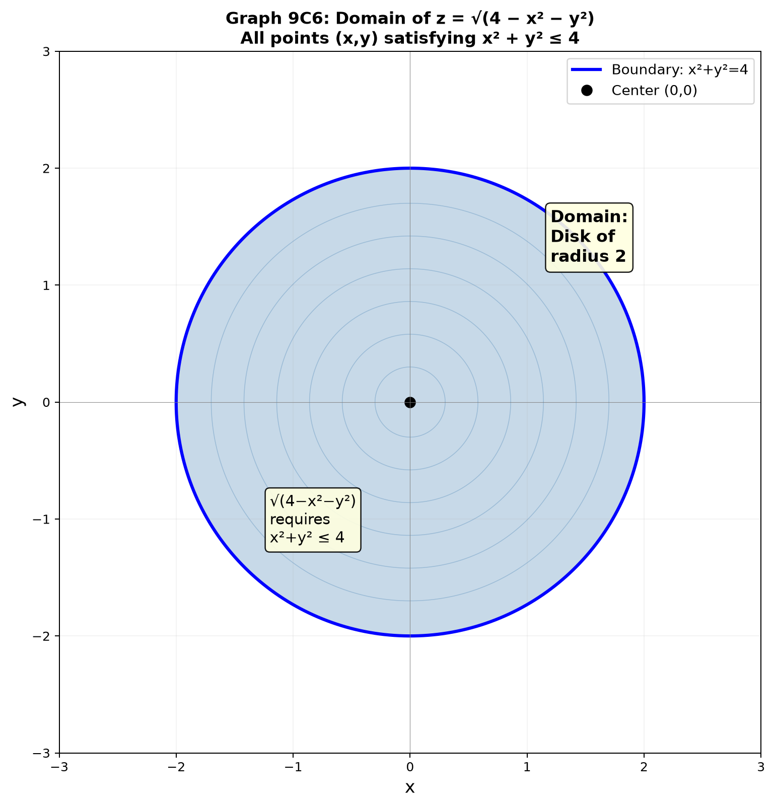
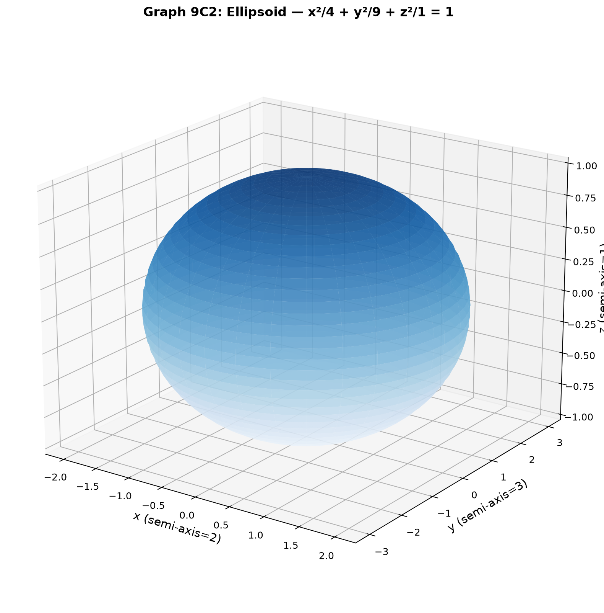
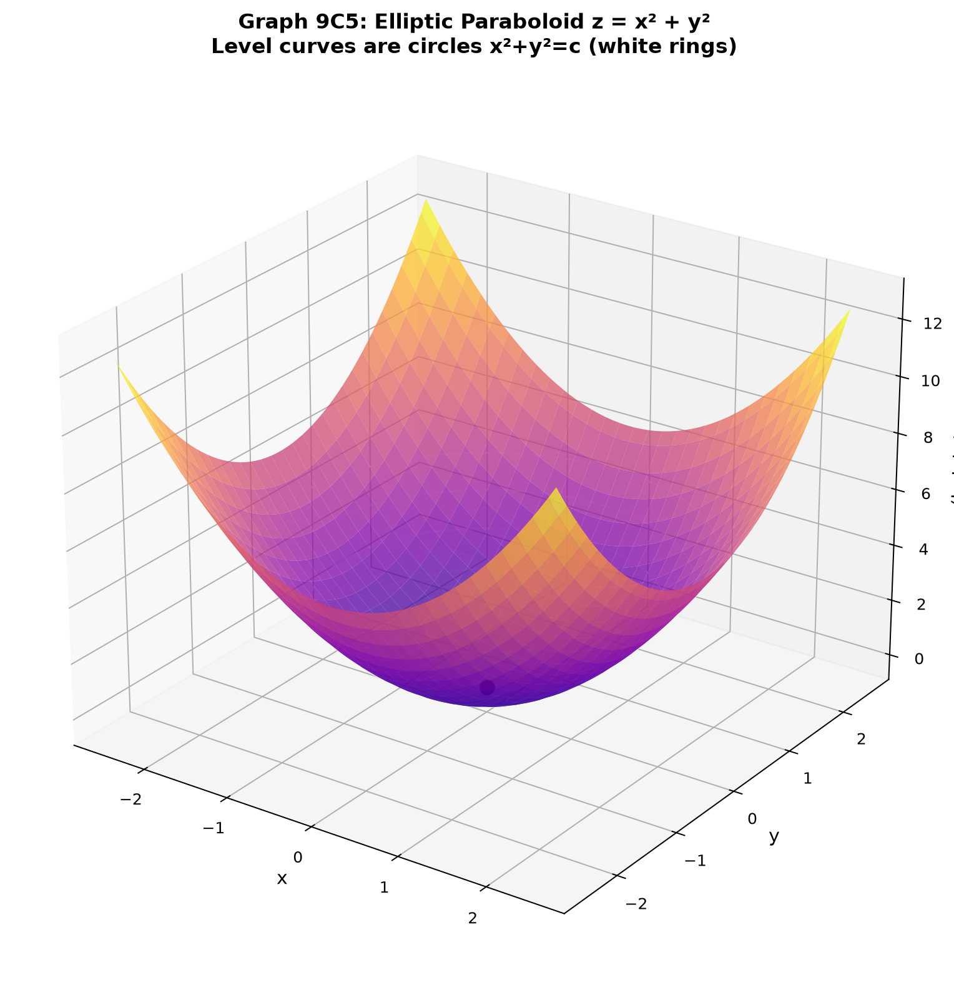
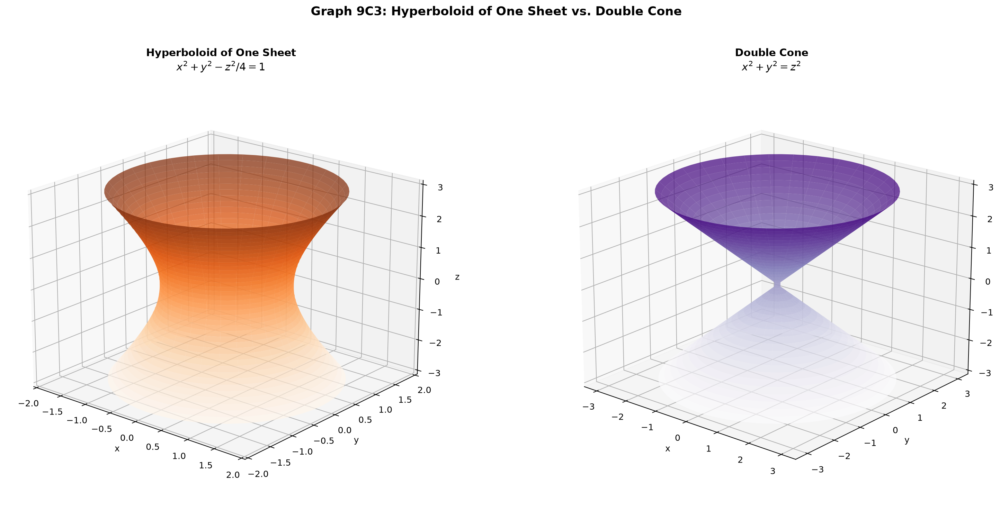
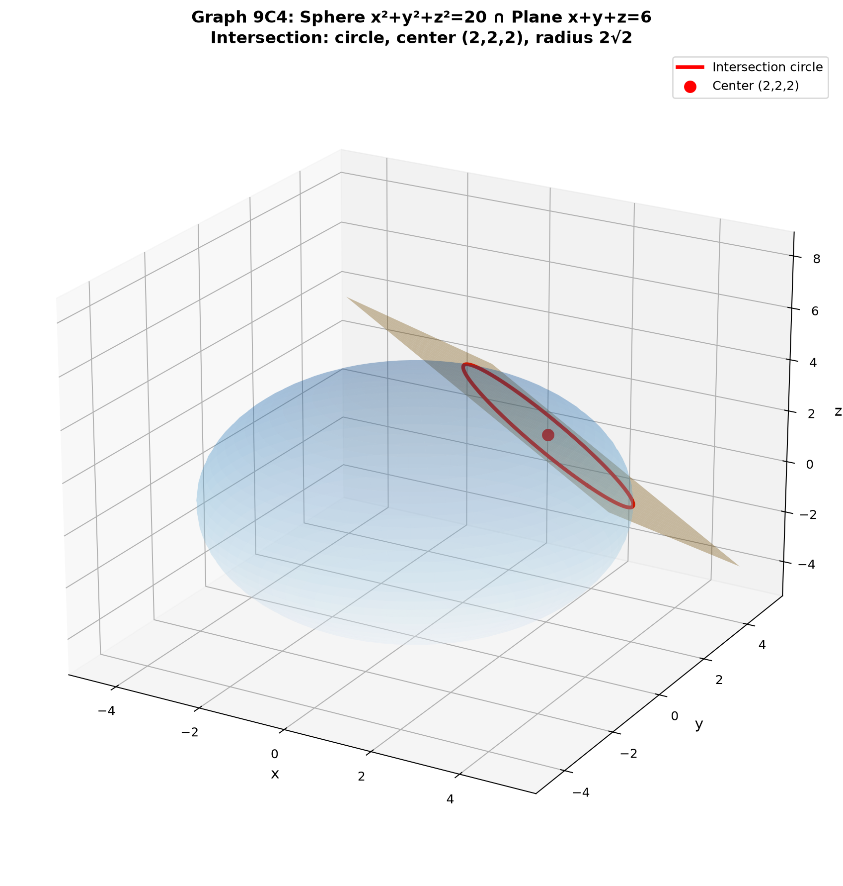

# Session 9C: 3D Geometry — Surfaces, Distance, and Space

**Phase 2 — Classical Techniques | 75 min**

*Extending 2D intuition into three dimensions. No calculus required.*

---

## Part A: Points, Planes, and Distance in 3D

---

## Example 1: Distance Between Two Points in 3D

In 2D: $d = \sqrt{(x_2-x_1)^2 + (y_2-y_1)^2}$.
In 3D, add the $z$-dimension:

$d = \sqrt{(x_2-x_1)^2 + (y_2-y_1)^2 + (z_2-z_1)^2}$.

$(1, 2, 3)$ to $(4, 6, 15)$: $d = \sqrt{3^2 + 4^2 + 12^2} = \sqrt{9+16+144} = 13$.

**This generalizes to any dimension**: in $\mathbb{R}^n$, $d = \sqrt{\sum_{i=1}^n (x_i - y_i)^2}$.

---

## Example 2: The Equation of a Plane

A plane in 3D is the analog of a line in 2D. A line is $ax+by=c$. A plane is $ax+by+cz = d$.

$2x + 3y - z = 6$: at $x=0,y=0$ → $z=-6$. At $y=0,z=0$ → $x=3$. At $x=0,z=0$ → $y=2$.
The plane passes through $(3,0,0)$, $(0,2,0)$, $(0,0,-6)$.

**Normal vector**: $\vec{n} = (a, b, c) = (2, 3, -1)$. The normal is perpendicular to every direction lying in the plane.

**Plane from point and normal**: $\vec{n} \cdot (\vec{x} - \vec{p}) = 0$.
Through $(1,2,3)$ with normal $(2,-1,1)$: $2(x-1) - (y-2) + (z-3) = 0$ → $2x - y + z = 3$.

---

## Example 3: Distance from a Point to a Plane

Point $(x_0, y_0, z_0)$ to plane $ax+by+cz = d$:

$D = \frac{|ax_0 + by_0 + cz_0 - d|}{\sqrt{a^2 + b^2 + c^2}}$.

$(1, 2, 3)$ to $2x + 3y + z = 6$:
$D = \frac{|2+6+3-6|}{\sqrt{4+9+1}} = \frac{5}{\sqrt{14}} \approx 1.336$.

**Geometric meaning**: The numerator measures how far the point "misses" the plane equation. The denominator normalizes by the length of the normal vector.

---

## Example 4: The Sphere — All Points at a Fixed Distance

$(x-h)^2 + (y-k)^2 + (z-\ell)^2 = R^2$. Center $(h,k,\ell)$, radius $R$.

$x^2 + y^2 + z^2 = 9$: center $(0,0,0)$, radius $3$. All points exactly 3 units from the origin.

**Complete the square** for $x^2+y^2+z^2-4x+6y-2z-11=0$:
$(x-2)^2 + (y+3)^2 + (z-1)^2 = 11+4+9+1 = 25$. Center $(2,-3,1)$, radius $5$.

---

## Example 5: Distance from a Point to a Sphere

Point $P$ to sphere center $C$, radius $R$:
Distance = $|\,|PC| - R\,|$.

$(10, 0, 0)$ to sphere $x^2+y^2+z^2=25$: $|PC| = 10$, $R = 5$. Distance = $5$.
The closest point on the sphere is $(5,0,0)$ — along the line from center to $P$.

If the point is inside the sphere, distance = $R - |PC|$.

---

## Part B: Functions of Two Variables — $z = f(x,y)$

---

## Example 6: A Surface as a Height Map

$z = f(x,y)$ assigns a height to every point $(x,y)$ in the plane.

$z = x^2 + y^2$: at $(0,0)$ → $z=0$. At $(1,0)$ → $z=1$. At $(2,1)$ → $z=5$.
The surface is a bowl opening upward — a **paraboloid**.

$z = \sqrt{1 - x^2 - y^2}$: only defined when $x^2+y^2 \leq 1$. The surface is the **upper hemisphere** of radius 1.

---

## Example 7: Domain in 3D — Regions in the $xy$-Plane

For $z = f(x,y)$, the domain is a region in the $xy$-plane.

$z = \sqrt{4 - x^2 - y^2}$: needs $x^2 + y^2 \leq 4$ → disk of radius 2.

$z = \ln(x + y)$: needs $x + y > 0$ → half-plane above the line $y = -x$.

$z = \frac{1}{x^2 + y^2 - 1}$: needs $x^2 + y^2 \neq 1$ → entire plane except the unit circle.



*Graph 9C6: The domain of a 3D surface is a 2D region. Here the disk x²+y² ≤ 4 — the set of all (x,y) where z = √(4−x²−y²) is real.*

---

## Example 8: Level Curves — A 2D Map of a 3D Surface

A **level curve** is the set of $(x,y)$ where $f(x,y)$ equals a constant $c$:
$f(x,y) = c$. Think of it as a horizontal slice through the surface at height $c$.

$z = x^2 + y^2$: level curves are circles $x^2+y^2=c$. As $c$ increases, circles grow — the bowl expands.

$z = y - x^2$: level curves are parabolas $y = x^2 + c$. Shifting up/down.

$z = xy$: level curves are hyperbolas $xy = c$. For $c>0$, Q1/Q3. For $c<0$, Q2/Q4.

**How to read**: If level curves are close together, the surface is steep. If far apart, the surface is flat.


*Graph 9C1: Level curves of z=x²−y² — hyperbolas for z≠0, crossing lines for z=0. The red/blue colors indicate positive/negative heights. The saddle point at (0,0,0) is where the crossing lines meet.*

---

## Part C: Quadric Surfaces — The Six Classic 3D Shapes

> In 2D, conic sections give circle, ellipse, parabola, hyperbola. In 3D, quadric surfaces are the analogous family.

---

## Example 9: Ellipsoid — The 3D Ellipse

$\frac{x^2}{a^2} + \frac{y^2}{b^2} + \frac{z^2}{c^2} = 1$.

All three cross-sections are ellipses. If $a=b=c$, it's a sphere. If $a=b\neq c$, it's a squashed sphere (spheroid).

$\frac{x^2}{4} + \frac{y^2}{9} + \frac{z^2}{1} = 1$: extends $\pm 2$ in $x$, $\pm 3$ in $y$, $\pm 1$ in $z$.



*Graph 9C2: An ellipsoid with semi-axes a=2, b=3, c=1. All three cross-sections perpendicular to the axes are ellipses. When a=b=c, it becomes a sphere.*

---

## Example 10: Paraboloid — The 3D Parabola

**Elliptic paraboloid**: $z = \frac{x^2}{a^2} + \frac{y^2}{b^2}$. Bowl shape. All vertical cross-sections are parabolas.

$z = x^2 + y^2$: circular paraboloid. $z = x^2 + 2y^2$: elliptical paraboloid (stretched in $y$).

**Hyperbolic paraboloid (saddle)**: $z = \frac{x^2}{a^2} - \frac{y^2}{b^2}$. Curves up in one direction, down in the other. Shaped like a Pringle chip.



*Graph 9C5: The bowl-shaped elliptic paraboloid z=x²+y². White rings show level curves (circles). The vertex is at the origin. Every vertical cross-section is a parabola.*

---

## Example 11: Cylinder — Extruding a 2D Curve

A cylinder has one variable missing from the equation.

$x^2 + y^2 = 9$: in 3D, this is a circular cylinder — a circle of radius 3 extruded infinitely along the $z$-axis. $z$ can be anything.

$z = \sin x$: in 3D, a wavy sheet extruded along the $y$-axis. Every vertical slice parallel to the $xz$-plane shows the same sine wave.

---

## Example 12: Hyperboloid — One Sheet or Two

**One sheet**: $\frac{x^2}{a^2} + \frac{y^2}{b^2} - \frac{z^2}{c^2} = 1$. Shaped like a cooling tower. Connected.

**Two sheets**: $-\frac{x^2}{a^2} - \frac{y^2}{b^2} + \frac{z^2}{c^2} = 1$. Two separate bowls opening away from each other along the $z$-axis.

**Identifying**: One sheet = two plus signs, one minus. Two sheets = two minus signs, one plus.

---

## Example 13: Cone — The Double Nappe

$z^2 = x^2 + y^2$. Two cones meeting at the origin: one opening upward, one downward.

At $z = k$, the cross-section is a circle $x^2+y^2 = k^2$. The radius grows linearly with height.

**Elliptic cone**: $\frac{z^2}{c^2} = \frac{x^2}{a^2} + \frac{y^2}{b^2}$. The cross-section is an ellipse instead of a circle.



*Graph 9C3: Left — Hyperboloid of one sheet (x²+y²−z²/4=1), shaped like a cooling tower. Right — Double cone (x²+y²=z²), two nappes meeting at the origin.*

---

## Part D: Intersection and Symmetry in 3D

---

## Example 14: Intersection of Two Surfaces — A Curve in Space

Intersect the sphere $x^2+y^2+z^2=25$ with the plane $x+y+z=3$:
The result is a circle in the plane.

**How to find center and radius of the intersection circle**:
(1) Distance from origin to plane: $d = \frac{|3|}{\sqrt{3}} = \sqrt{3}$.
(2) Radius of intersection: $r = \sqrt{R^2 - d^2} = \sqrt{25 - 3} = \sqrt{22}$.
(3) Center is the foot of the perpendicular: $(1, 1, 1)$.



*Graph 9C4: The sphere x²+y²+z²=20 and plane x+y+z=6 intersect in a circle (red). The center (2,2,2) lies along the normal direction from the origin to the plane.*

---

## Example 15: Intersection of Two Cylinders

$x^2 + y^2 = 1$ and $x^2 + z^2 = 1$. Two cylinders intersecting at right angles. The intersection curve is a "bicylindrical curve" — it looks like an ellipse when viewed from certain angles.

---

## Example 16: Symmetry in 3D

A surface $F(x,y,z) = 0$ has:
- **$xy$-plane symmetry**: if replacing $z \to -z$ leaves the equation unchanged.
- **$xz$-plane symmetry**: if $y \to -y$ unchanged.
- **Origin symmetry**: if $(x,y,z) \to (-x,-y,-z)$ unchanged.
- **Rotational symmetry about $z$-axis**: if $x^2+y^2$ appears as a block.

$x^2 + y^2 + z^2 = 1$: all three coordinate plane symmetries + origin symmetry + rotational symmetry about any axis through origin (a sphere has maximum symmetry).

$z = x^2 + y^2$: rotational symmetry about $z$-axis, $xz$ and $yz$ plane symmetries.

> **Up to here**: 3D distance and planes. $z=f(x,y)$ as height maps. Level curves = 2D slices.
> Quadric surfaces: ellipsoid, paraboloid, cylinder, hyperboloid (1/2 sheets), cone.
> Intersection of surfaces = space curves. Symmetry in 3D.

---

## Common Mistakes

### Mistake 1: Treating $x^2+y^2=1$ as a circle only

**In 2D**: it's a circle. **In 3D**: it's a cylinder (infinitely tall). Always check the dimension you're working in.

### Mistake 2: Forgetting the square root in the denominator

**Wrong**: Distance to plane = $\frac{|ax_0+by_0+cz_0-d|}{a^2+b^2+c^2}$.
**Right**: Divide by $\sqrt{a^2+b^2+c^2}$, the length of the normal vector.

### Mistake 3: Confusing one-sheet and two-sheet hyperboloids

**One sheet**: exactly one minus sign in the standard form. **Two sheets**: exactly two minus signs. The one-sheet hyperboloid is connected; the two-sheet one is disconnected.

---

## What We Just Did

```
(1) 3D distance: add the z² term. Plane: ax+by+cz=d, normal vector (a,b,c).
    Point-to-plane distance formula.

(2) z = f(x,y): a height map over the xy-plane. Domain is a 2D region.
    Level curves: horizontal slices — the 2D map of a 3D landscape.

(3) Quadric surfaces: ellipsoid (3D ellipse), paraboloid (bowl/saddle),
    cylinder (extruded curve), hyperboloid (1 or 2 sheets), cone (double).
    Each has a signature equation pattern.

(4) Intersection of surfaces gives a curve in 3D space.
    Symmetry: test by sign changes on each coordinate.
```

---

## Practice 1

Find the distance from $(2, -1, 4)$ to the plane $x + 2y + 2z = 6$.

→ Reference: **Example 3**

> Solutions: [Solutions](solutions/9C-solutions.md#practice-1)

---

## Practice 2

Find the center and radius of the sphere $x^2 + y^2 + z^2 - 4x + 2y - 6z + 5 = 0$.

→ Reference: **Example 4**

> Solutions: [Solutions](solutions/9C-solutions.md#practice-2)

---

## Practice 3

Describe and sketch the level curves of $z = x^2 - y^2$ at $c = -2, -1, 0, 1, 2$. What quadric surface is this?

→ Reference: **Example 8, 10**

> Solutions: [Solutions](solutions/9C-solutions.md#practice-3)

---

## Practice 4

Classify each quadric surface:
(a) $x^2 + y^2 - z^2 = 1$
(b) $z = 4 - x^2 - y^2$
(c) $x^2 + 2y^2 + 3z^2 = 12$

→ Reference: **Examples 9-13**

> Solutions: [Solutions](solutions/9C-solutions.md#practice-4)

---

## Practice 5

Find the center and radius of the circle formed by intersecting the sphere $x^2+y^2+z^2=20$ with the plane $x+y+z=6$.

→ Reference: **Example 14**

> Solutions: [Solutions](solutions/9C-solutions.md#practice-5)

---

## Practice 6: Real Battle

A plane passes through the three points $(1,0,0)$, $(0,2,0)$, $(0,0,3)$. Find its equation and the distance from the origin to this plane.

→ Reference: **Example 2, 3**

> Solutions: [Solutions](solutions/9C-solutions.md#practice-6)

---

## Basic Algebra Drill — 3D Geometry (10 Problems)

> Pure computation.

**D1.** Find the distance between $(1, -2, 3)$ and $(5, 2, 15)$.

**D2.** Write the equation of a plane through $(2, 1, -3)$ with normal vector $(1, 4, -2)$.

**D3.** Find the center and radius of $x^2 + y^2 + z^2 + 8x - 2y + 10z + 8 = 0$.

**D4.** Identify the surface: $x^2 + y^2 = 16$ (in 3D).

**D5.** Identify the surface: $z = 5 - x^2 - y^2$.

**D6.** Identify the surface: $\frac{x^2}{4} + \frac{y^2}{9} + \frac{z^2}{16} = 1$.

**D7.** Identify the surface: $x^2 - y^2 + z^2 = 0$.

**D8.** Find the distance from $(3, 0, 0)$ to the sphere $x^2+y^2+z^2=4$.

**D9.** Write the equation of the level curve of $z = x^2 + 4y^2$ at height $z=4$.

**D10.** Does $z = \sqrt{9 - x^2 - y^2}$ have $xy$-plane symmetry? $xz$-plane? Justify.

> Solutions: [Solutions](solutions/9C-solutions.md#basic-drill)

---

## Advanced Algebra Drill — 3D Geometry (10 Problems)

> Multi-step geometric reasoning.

**A1.** Find the distance between the parallel planes $2x - y + 2z = 5$ and $2x - y + 2z = -7$.

**A2.** Find the equation of the sphere that has $(2, -1, 3)$ and $(6, 5, -1)$ as endpoints of a diameter.

**A3.** The surface $z = xy$ is a hyperbolic paraboloid. Describe its level curves at $z = -2, -1, 0, 1, 2$ and explain the saddle shape.

**A4.** Find the intersection of the line through $(1,2,3)$ with direction $(1,-1,1)$ and the plane $2x + y - z = 4$.

**A5.** A plane passes through $(1,1,1)$ and is perpendicular to both $x+y+z=1$ and $x-y+2z=0$. Find its equation. (Hint: normal is cross product of the two normals.)

**A6.** Find the equation of the cylinder whose base is the ellipse $\frac{x^2}{4}+\frac{y^2}{9}=1$ and whose rulings are parallel to the $z$-axis.

**A7.** Two spheres: $x^2+y^2+z^2=25$ and $(x-8)^2+y^2+z^2=9$. Do they intersect? If so, find the equation of the plane containing their circle of intersection.

**A8.** Find the point on the plane $x + 2y + 3z = 13$ closest to the origin. (Hint: the closest point lies along the normal direction.)

**A9.** The surface $x^2 + 4y^2 - z^2 = 0$ is an elliptic cone. Describe the cross-section at $z=2$ and at $y=1$.

**A10.** Find the volume of the tetrahedron formed by the coordinate planes and the plane $\frac{x}{2} + \frac{y}{3} + \frac{z}{4} = 1$.

> Solutions: [Solutions](solutions/9C-solutions.md#advanced-drill)

---

## Today's Procedure

```
Step 1: 3D distance = one more squared term. Plane = ax+by+cz=d.
         The vector (a,b,c) is perpendicular to the plane (the normal).
         Point-to-plane distance: |ax₀+by₀+cz₀-d| / √(a²+b²+c²).

Step 2: z = f(x,y) describes a landscape. Domain is a 2D region.
         Level curves (f(x,y)=c) show the shape in 2D — close curves = steep.

Step 3: Quadric surfaces = 3D analogs of conic sections. Learn the six:
         ellipsoid, paraboloid (elliptic/hyperbolic), cylinder,
         hyperboloid (1 sheet/2 sheets), cone.
         Each has a signature pattern of x², y², z² signs.
```

---

## Terminology

| What we call it | Math term | Notation |
|:---------------:|:---------:|:--------:|
| plane | plane | $ax+by+cz=d$ |
| normal vector | normal vector | $\vec{n}=(a,b,c)$ |
| sphere | sphere | $(x-h)^2+(y-k)^2+(z-\ell)^2=R^2$ |
| height map / landscape | function of two variables | $z=f(x,y)$ |
| level curve | level curve / contour | $f(x,y)=c$ |
| ellipsoid | ellipsoid | $\frac{x^2}{a^2}+\frac{y^2}{b^2}+\frac{z^2}{c^2}=1$ |
| paraboloid (bowl) | elliptic paraboloid | $z=\frac{x^2}{a^2}+\frac{y^2}{b^2}$ |
| saddle | hyperbolic paraboloid | $z=\frac{x^2}{a^2}-\frac{y^2}{b^2}$ |
| cylinder | cylinder | one variable missing |
| hyperboloid (1 sheet) | hyperboloid of one sheet | $\frac{x^2}{a^2}+\frac{y^2}{b^2}-\frac{z^2}{c^2}=1$ |
| hyperboloid (2 sheets) | hyperboloid of two sheets | $-\frac{x^2}{a^2}-\frac{y^2}{b^2}+\frac{z^2}{c^2}=1$ |
| cone | elliptic cone | $\frac{x^2}{a^2}+\frac{y^2}{b^2}-\frac{z^2}{c^2}=0$ |
