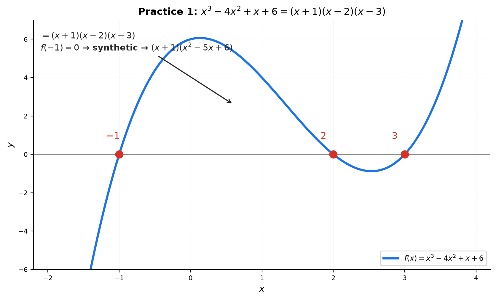

# Solutions — 07A: Factoring and Polynomial Equations

---

## Practice 1

**Factor completely: $x^3-4x^2+x+6$. Rational root test + synthetic division.**

① Rational root candidates: $\pm1,\pm2,\pm3,\pm6$.

② Test $x=-1$: $-1-4-1+6=0$ ✓. Synthetic divide by $(x+1)$:
coefficients $1,-4,1,6$ → quotient $x^2-5x+6$, remainder $0$.

③ Factor the quadratic: $x^2-5x+6=(x-2)(x-3)$.

$x^3-4x^2+x+6 = (x+1)(x-2)(x-3)$.

> **Answer**: $(x+1)(x-2)(x-3)$; roots $-1,2,3$

---

## Practice 2

**Solve $x^4-13x^2+36=0$ by substitution $t=x^2$.**

① $t=x^2$: $t^2-13t+36=0$ → $(t-4)(t-9)=0$ → $t=4,9$.

② $x^2=4$ → $x=\pm2$; $x^2=9$ → $x=\pm3$.

> **Answer**: $x=\pm2,\ \pm3$

---

## Practice 3

**If $x=2$ is a root of $x^3-3x^2+kx+4=0$, find $k$ and all roots. Verify with Vieta.**

① Plug in $x=2$: $8-12+2k+4=0$ → $2k=0$ → $k=0$.

② Synthetic divide $x^3-3x^2+0x+4$ by $(x-2)$: quotient $x^2-x-2=(x-2)(x+1)$.

③ So $x^3-3x^2+4=(x-2)^2(x+1)$. Roots: $2$ (double), $-1$.

④ **Vieta check**: sum $=2+2-1=3$ ✓; pairwise $=4-2-2=0=k$ ✓; product $=2\cdot2\cdot(-1)=-4$ ✓

> **Answer**: $k=0$; roots $2,2,-1$ (2 is a double root)

---

## Practice 4: Real Battle

**Solve $2x^4-5x^3+5x-2=0$.**

① Test $x=1$: $2-5+5-2=0$ ✓. Synthetic divide by $(x-1)$: quotient $2x^3-3x^2-3x+2$.

② On the cubic, test $x=2$: $16-12-6+2=0$ ✓. Synthetic divide by $(x-2)$: quotient $2x^2+x-1$.

③ $2x^2+x-1=(2x-1)(x+1)$.

$2x^4-5x^3+5x-2=(x-1)(x-2)(2x-1)(x+1)$.

> **Answer**: roots $1,\ 2,\ \frac12,\ -1$ (note: the coefficients $2,-5,0,5,-2$ are anti-palindromic — that's why $x=1$ and $x=-1$ are natural tests)

---

## Practice 5: Composition

**Create a cubic whose roots are $2,-3,5$. Verify with Vieta.**

① $f(x)=(x-2)(x+3)(x-5)$.

② Expand: $(x-2)(x+3)=x^2+x-6$; $(x^2+x-6)(x-5)=x^3-4x^2-11x+30$.

③ **Vieta**: sum $=2-3+5=4=-(-4)$ ✓; pairwise $=2(-3)+2(5)+(-3)(5)=-6+10-15=-11$ ✓; product $=2(-3)(5)=-30=-30$ ✓

> **Answer**: $x^3-4x^2-11x+30=0$

---

## Basic Drills

### D1. $x^2+8x+15$.

Sum 8, product 15 → $3,5$: $(x+3)(x+5)$.

> **Answer**: $(x+3)(x+5)$

---

### D2. $2x^2+5x-3$ (ac method).

$ac=-6$, sum 5, product $-6$ → $6,-1$: $2x^2+6x-x-3=2x(x+3)-(x+3)=(2x-1)(x+3)$.

> **Answer**: $(2x-1)(x+3)$

---

### D3. $x^2-36$.

$(x-6)(x+6)$.

> **Answer**: $(x-6)(x+6)$

---

### D4. $x^3-27$.

$x^3-3^3=(x-3)(x^2+3x+9)$.

> **Answer**: $(x-3)(x^2+3x+9)$

---

### D5. $4x^3-16x$ completely.

GCF: $4x(x^2-4)=4x(x-2)(x+2)$.

> **Answer**: $4x(x-2)(x+2)$

---

### D6. Solve $x^2-7x+10=0$.

$(x-2)(x-5)=0$ → $x=2,5$.

> **Answer**: $x=2,5$

---

### D7. Solve $x^3-3x^2-4x+12=0$, using $x=3$ as a first root.

$x=3$: $27-27-12+12=0$ ✓. Synthetic: quotient $x^2-4=(x-2)(x+2)$.

> **Answer**: $x=3,2,-2$

---

### D8. Factor $x^4-16$ as far as possible.

$x^4-16=(x^2-4)(x^2+4)=(x-2)(x+2)(x^2+4)$.

> **Answer**: $(x-2)(x+2)(x^2+4)$

---

### D9. Solve $2x^3-x^2-7x+6=0$, testing $x=1$.

$x=1$: $2-1-7+6=0$ ✓. Synthetic: quotient $2x^2+x-6=(2x-3)(x+2)$.

> **Answer**: $x=1,\ \frac32,\ -2$

---

### D10. If $x=2$ and $x=-3$ are roots of $x^3+ax^2+bx-6$, find $a,b$.

① Product of roots $=-\text{(constant)}=6$: $2(-3)r=6$ → $r=-1$.

② Sum: $2-3-1=-2=-a$ → $a=2$.

③ Pairwise: $2(-3)+2(-1)+(-3)(-1)=-6-2+3=-5=b$.

**Check**: $x^3+2x^2-5x-6=(x-2)(x+3)(x+1)$ ✓

> **Answer**: $a=2,\ b=-5$

---

## Advanced Drills

### A1. Factor $x^4+x^2+1$.

Add and subtract $x^2$: $x^4+2x^2+1-x^2=(x^2+1)^2-x^2=(x^2+x+1)(x^2-x+1)$.

> **Answer**: $(x^2+x+1)(x^2-x+1)$

---

### A2. Solve $x^4-4x^3+2x^2+4x+1=0$ (symmetric).

Divide by $x^2$: $x^2-4x+2+\frac4x+\frac1{x^2}=\left(x^2+\frac1{x^2}\right)-4\left(x-\frac1x\right)+2$.

Let $u=x-\frac1x$ (so $x^2+\frac1{x^2}=u^2+2$): $u^2+2-4u+2=0$ → $u^2-4u+4=0$ → $(u-2)^2=0$ → $u=2$.

$x-\frac1x=2$ → $x^2-2x-1=0$ → $x=1\pm\sqrt2$.

> **Answer**: $x=1\pm\sqrt2$ (each with multiplicity 2)

---

### A3. Find all roots of $x^3-3x^2-6x+8=0$.

Candidates $\pm1,\pm2,\pm4,\pm8$. $x=1$: $1-3-6+8=0$ ✓. Synthetic: quotient $x^2-2x-8=(x-4)(x+2)$.

> **Answer**: $x=1,4,-2$

---

### A4. Prove $x^n-y^n$ is divisible by $x-y$ for all $n$.

Factor: $x^n-y^n=(x-y)(x^{n-1}+x^{n-2}y+\cdots+xy^{n-2}+y^{n-1})$.

**Check by multiplying**: $(x-y)\sum_{k=0}^{n-1}x^{n-1-k}y^k = \sum x^{n-k}y^k - \sum x^{n-1-k}y^{k+1}$ — the inner terms cancel (telescoping), leaving $x^n-y^n$ ✓

> **Answer**: $x^n-y^n=(x-y)(x^{n-1}+x^{n-2}y+\cdots+y^{n-1})$

---

### A5. Show $x^3-3x+1=0$ has a root in $(0,1)$ and approximate it.

$f(0)=1>0$, $f(1)=-1<0$. $f$ is continuous → by the IVT a root exists in $(0,1)$.

Bisection: $f(0.5)=-0.375$, $f(0.3)=0.127$ → root in $(0.3,0.5)$; $f(0.4)=-0.136$ → in $(0.3,0.4)$; $f(0.35)\approx-0.007$ → in $(0.3,0.35)$; $f(0.34)\approx0.019$ → root $\approx 0.347$.

> **Answer**: root $\approx 0.347$ in $(0,1)$ (IVT + bisection)

---

### A6. Factor $x^4+4$ (Sophie Germain).

$x^4+4 = x^4+4x^2+4-4x^2 = (x^2+2)^2-(2x)^2 = (x^2+2x+2)(x^2-2x+2)$.

> **Answer**: $(x^2+2x+2)(x^2-2x+2)$

---

### A7. Find $a$ so $x^3-3x^2+a=0$ has a double root.

A double root satisfies $f(x)=f'(x)=0$. $f'(x)=3x^2-6x=3x(x-2)$ → $x=0$ or $x=2$.

- $x=0$: $f(0)=a=0$ → $a=0$ (double root at 0).
- $x=2$: $f(2)=8-12+a=a-4=0$ → $a=4$ (double root at 2).

> **Answer**: $a=0$ (root 0 double) or $a=4$ (root 2 double)

---

### A8. Solve $(x^2-x)^2-8(x^2-x)+12=0$.

Let $t=x^2-x$: $t^2-8t+12=0$ → $(t-2)(t-6)=0$ → $t=2,6$.

- $x^2-x-2=0$ → $(x-2)(x+1)=0$ → $x=2,-1$.
- $x^2-x-6=0$ → $(x-3)(x+2)=0$ → $x=3,-2$.

> **Answer**: $x=2,-1,3,-2$

---

### A9. If $x+\frac1x=3$, find $x^3+\frac1{x^3}$ without solving for $x$.

$x^3+\frac1{x^3}=\left(x+\frac1x\right)^3-3\left(x+\frac1x\right)=27-9=18$.

> **Answer**: $18$

---

### A10. Find all complex roots of $x^4+x^3+x^2+x+1=0$.

Multiply by $(x-1)$: $(x-1)(x^4+x^3+x^2+x+1)=x^5-1=0$.

So the roots are the fifth roots of unity except $x=1$: $x=e^{2\pi i k/5}$ for $k=1,2,3,4$, i.e. $\cos\frac{2\pi k}{5}+i\sin\frac{2\pi k}{5}$.

> **Answer**: $e^{2\pi i k/5}$, $k=1,2,3,4$ (the non-real fifth roots of unity)
