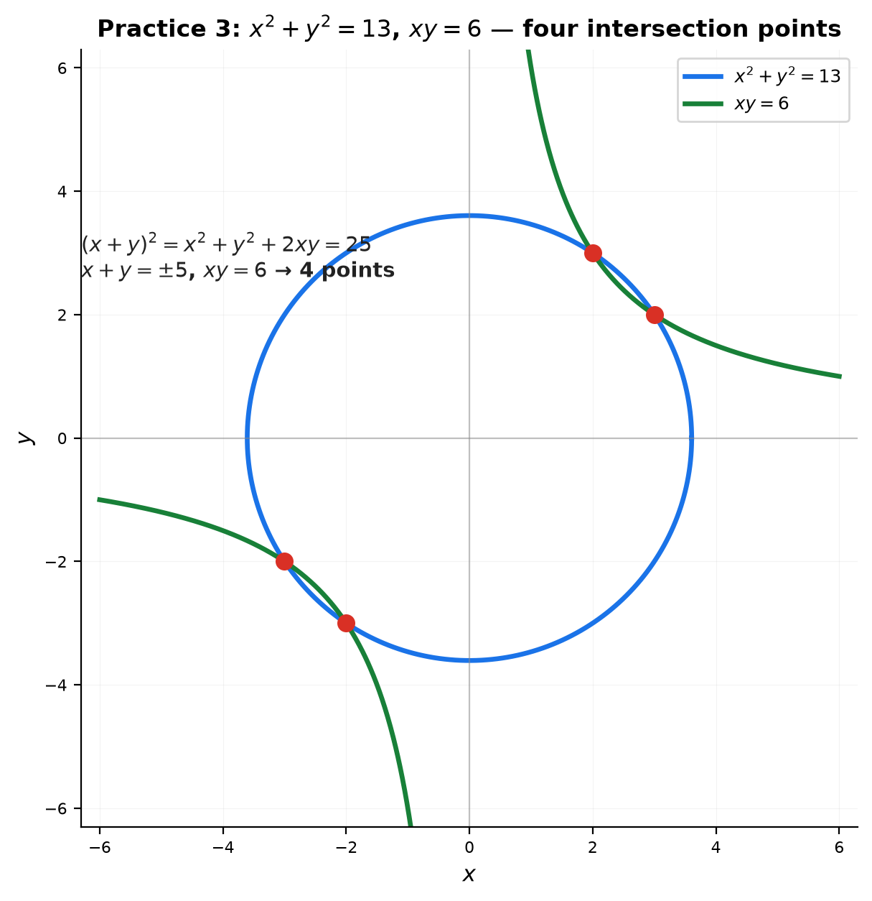

# Solutions — 07B: Partial Fractions, Systems, and Advanced Equation Solving

---

## Practice 1

**Decompose $\frac{5x-1}{(x+1)(x-2)}$.**

$\frac{5x-1}{(x+1)(x-2)} = \frac{A}{x+1}+\frac{B}{x-2}$.

$5x-1 = A(x-2)+B(x+1)$.

- $x=2$: $9=3B$ → $B=3$.
- $x=-1$: $-6=-3A$ → $A=2$.

> **Answer**: $\frac{2}{x+1}+\frac{3}{x-2}$

---

## Practice 2

**Decompose $\frac{x^2+3x}{(x-1)^2(x+2)}$.**

$\frac{x^2+3x}{(x-1)^2(x+2)} = \frac{A}{x-1}+\frac{B}{(x-1)^2}+\frac{C}{x+2}$.

$x^2+3x = A(x-1)(x+2)+B(x+2)+C(x-1)^2$.

- $x=1$: $4=3B$ → $B=\frac43$.
- $x=-2$: $-2=9C$ → $C=-\frac29$.
- $x=0$: $0=-2A+2B+C$ → $-2A+\frac83-\frac29=0$ → $A=\frac{11}{9}$.

> **Answer**: $\frac{11/9}{x-1}+\frac{4/3}{(x-1)^2}-\frac{2/9}{x+2}$

---

## Practice 3

**Solve $\begin{cases} x^2+y^2=13 \\ xy=6 \end{cases}$.**

$(x+y)^2=x^2+y^2+2xy=13+12=25$ → $x+y=\pm5$.

- $x+y=5$, $xy=6$: roots of $t^2-5t+6$ → $2,3$ → $(2,3),(3,2)$.
- $x+y=-5$, $xy=6$: roots of $t^2+5t+6$ → $-2,-3$ → $(-2,-3),(-3,-2)$.

> **Answer**: $(2,3),\ (3,2),\ (-2,-3),\ (-3,-2)$ — four solutions

---

## Practice 4: Real Battle

**(a) Decompose $\frac{x^3+2x^2+1}{x(x^2+1)}$.**

① Improper (degree 3 = degree 3) — divide first: $x^3+2x^2+1 = 1\cdot x(x^2+1) + (2x^2-x+1)$.

$\frac{x^3+2x^2+1}{x(x^2+1)} = 1+\frac{2x^2-x+1}{x(x^2+1)}$.

② Decompose: $\frac{2x^2-x+1}{x(x^2+1)} = \frac{A}{x}+\frac{Bx+C}{x^2+1}$.

$2x^2-x+1 = A(x^2+1)+(Bx+C)x$. Compare: $A=1$, $C=-1$, $A+B=2$ → $B=1$.

> (a) **Answer**: $1+\frac{1}{x}+\frac{x-1}{x^2+1}$

**(b) Solve $\begin{cases} xy+x+y=11 \\ x^2y+xy^2=30 \end{cases}$.**

Let $S=x+y$, $P=xy$: $S+P=11$, $SP=30$. So $S,P$ are roots of $t^2-11t+30=0$ → $5,6$.

- $(S,P)=(5,6)$: $x,y$ roots of $t^2-5t+6$ → $2,3$ → $(2,3),(3,2)$.
- $(S,P)=(6,5)$: roots of $t^2-6t+5$ → $1,5$ → $(1,5),(5,1)$.

> (b) **Answer**: $(2,3),\ (3,2),\ (1,5),\ (5,1)$

---

## Practice 5: Composition

**Create a system whose only solutions are $(1,2)$ and $(3,-1)$.**

① A **line** through both points: slope $\frac{-1-2}{3-1}=-\frac32$, so $y-2=-\frac32(x-1)$ → $3x+2y=7$.

② A **circle** through both points: center at the midpoint $\left(2,\frac12\right)$, radius$^2=(1-2)^2+(2-\frac12)^2=\frac{13}{4}$:
$(x-2)^2+\left(y-\frac12\right)^2=\frac{13}{4}$.

A line meets a circle in at most 2 points — and both given points lie on both curves, so these are the only solutions.

> **Answer**: $\begin{cases} 3x+2y=7 \\ (x-2)^2+(y-\frac12)^2=\frac{13}{4} \end{cases}$

---

## Basic Drills

### D1. $\frac{4}{(x-1)(x+3)}$.

$4=A(x+3)+B(x-1)$. $x=1$: $4=4A$→$A=1$. $x=-3$: $4=-4B$→$B=-1$.

> **Answer**: $\frac{1}{x-1}-\frac{1}{x+3}$

---

### D2. $\frac{x+2}{x(x-1)}$.

$x+2=A(x-1)+Bx$. $x=0$: $2=-A$→$A=-2$. $x=1$: $3=B$.

> **Answer**: $-\frac{2}{x}+\frac{3}{x-1}$

---

### D3. $\frac{2x}{(x+1)^2}$.

$2x=A(x+1)+B$. Compare: $A=2$, $A+B=0$→$B=-2$.

> **Answer**: $\frac{2}{x+1}-\frac{2}{(x+1)^2}$

---

### D4. $\begin{cases} x+y=4 \\ x-y=2 \end{cases}$.

Add: $2x=6$→$x=3$, $y=1$.

> **Answer**: $(3,1)$

---

### D5. $\begin{cases} 2x+3y=7 \\ 5x-2y=8 \end{cases}$.

Multiply first by 2, second by 3: $4x+6y=14$, $15x-6y=24$. Add: $19x=38$→$x=2$, $y=1$.

> **Answer**: $(2,1)$

---

### D6. $\frac{x^2}{x^2-1}$ (improper).

Divide: $\frac{x^2}{x^2-1}=1+\frac{1}{x^2-1}$. And $\frac{1}{(x-1)(x+1)}=\frac{1/2}{x-1}-\frac{1/2}{x+1}$.

> **Answer**: $1+\frac{1/2}{x-1}-\frac{1/2}{x+1}$

---

### D7. $\begin{cases} x+y+z=4 \\ x-y+z=2 \\ x+y-z=0 \end{cases}$.

Add first+second: $2x+2z=6$→$x+z=3$. First+third: $2x+2y=4$→$x+y=2$. Second+third: $2x=2$→$x=1$. Then $z=2$, $y=1$.

> **Answer**: $(1,1,2)$

---

### D8. $\frac{3}{x^2+x-2}$.

Factor: $x^2+x-2=(x-1)(x+2)$. $3=A(x+2)+B(x-1)$. $x=1$: $3=3A$→$A=1$. $x=-2$: $3=-3B$→$B=-1$.

> **Answer**: $\frac{1}{x-1}-\frac{1}{x+2}$

---

### D9. $\begin{cases} x+y=7 \\ x^2-y^2=21 \end{cases}$.

$x^2-y^2=(x-y)(x+y)=7(x-y)=21$ → $x-y=3$. With $x+y=7$: $x=5,y=2$.

> **Answer**: $(5,2)$

---

### D10. Partial fractions of $\frac{1}{x(x+1)}$, then $\sum_{n=1}^{10}\frac{1}{n(n+1)}$.

$\frac{1}{x(x+1)}=\frac{1}{x}-\frac{1}{x+1}$.

$\sum_{n=1}^{10}\frac{1}{n(n+1)}=\sum_{n=1}^{10}\left(\frac1n-\frac1{n+1}\right)=1-\frac{1}{11}=\frac{10}{11}$ (telescoping).

> **Answer**: $\frac{1}{x}-\frac{1}{x+1}$; the sum is $\frac{10}{11}$

---

## Advanced Drills

### A1. Decompose $\frac{x^3+1}{x(x-1)^2}$.

Improper — divide: $x^3+1=(x-1)^2x+(2x^2-x+1)$, so $=1+\frac{2x^2-x+1}{x(x-1)^2}$.

$\frac{2x^2-x+1}{x(x-1)^2}=\frac{A}{x}+\frac{B}{x-1}+\frac{C}{(x-1)^2}$: $x=0$→$A=1$; $x=1$→$C=2$; $x=2$→$7=1+2B+4$→$B=1$.

> **Answer**: $1+\frac{1}{x}+\frac{1}{x-1}+\frac{2}{(x-1)^2}$

---

### A2. Decompose $\frac{2x^2+3x+4}{(x+1)(x^2+1)}$ (quadratic factor).

$\frac{2x^2+3x+4}{(x+1)(x^2+1)}=\frac{A}{x+1}+\frac{Bx+C}{x^2+1}$.

$x=-1$: $3=2A$→$A=\frac32$. Compare: $A+B=2$→$B=\frac12$; $B+C=3$→$C=\frac52$; check $A+C=4$ ✓.

> **Answer**: $\frac{3}{2(x+1)}+\frac{x+5}{2(x^2+1)}$

---

### A3. Solve $\begin{cases} x^2+y^2=25 \\ x+y=1 \end{cases}$.

$(x+y)^2=1=x^2+y^2+2xy=25+2xy$ → $xy=-12$. $x,y$ roots of $t^2-t-12$ → $4,-3$.

> **Answer**: $(4,-3),\ (-3,4)$

---

### A4. Solve $\begin{cases} \frac1x+\frac1y=5 \\ \frac1{x^2}+\frac1{y^2}=13 \end{cases}$.

Let $u=\frac1x$, $v=\frac1y$: $u+v=5$, $u^2+v^2=13$. Then $uv=\frac{(u+v)^2-(u^2+v^2)}{2}=6$. $u,v$ roots of $t^2-5t+6$ → $2,3$.

> **Answer**: $(x,y)=\left(\frac12,\frac13\right)$ or $\left(\frac13,\frac12\right)$

---

### A5. Decompose $\frac{1}{x^3-1}$.

$x^3-1=(x-1)(x^2+x+1)$: $\frac{1}{(x-1)(x^2+x+1)}=\frac{A}{x-1}+\frac{Bx+C}{x^2+x+1}$.

$x=1$: $1=3A$→$A=\frac13$. Compare: $A+B=0$→$B=-\frac13$; $A-C=1$→$C=-\frac23$; check $x$-coeff $A-B+C=0$ ✓.

> **Answer**: $\frac{1}{3(x-1)}-\frac{x+2}{3(x^2+x+1)}$

---

### A6. Solve $\begin{cases} xy=12 \\ yz=20 \\ zx=15 \end{cases}$.

Multiply all three: $(xyz)^2=3600$ → $xyz=\pm60$. Then $z=\frac{xyz}{xy}=\pm5$, $x=\pm3$, $y=\pm4$ (all same sign).

> **Answer**: $(3,4,5)$ or $(-3,-4,-5)$

---

### A7. Find $A,B,C$ for $\frac{1}{x(x+1)(x+2)}$.

$1=A(x+1)(x+2)+Bx(x+2)+Cx(x+1)$. $x=0$: $1=2A$→$A=\frac12$. $x=-1$: $1=-B$→$B=-1$. $x=-2$: $1=2C$→$C=\frac12$.

> **Answer**: $\frac{1/2}{x}-\frac{1}{x+1}+\frac{1/2}{x+2}$

---

### A8. Solve $\begin{cases} x^3+y^3=35 \\ x+y=5 \end{cases}$.

$x^3+y^3=(x+y)(x^2-xy+y^2)=5(x^2-xy+y^2)=35$ → $x^2-xy+y^2=7$.

Also $x^2+y^2=25-2xy$ → $25-3xy=7$ → $xy=6$. With $x+y=5$: roots of $t^2-5t+6$ → $2,3$.

> **Answer**: $(2,3),\ (3,2)$

---

### A9. Decompose $\frac{x^4}{(x^2+1)^2}$.

Divide: $x^4=(x^2+1)^2-(2x^2+1)$, so $\frac{x^4}{(x^2+1)^2}=1-\frac{2x^2+1}{(x^2+1)^2}$.

$\frac{2x^2+1}{(x^2+1)^2}=\frac{Ax+B}{x^2+1}+\frac{Cx+D}{(x^2+1)^2}$: compare → $A=0$, $B=2$, $C=0$, $D=-1$. So $=\frac{2}{x^2+1}-\frac{1}{(x^2+1)^2}$.

> **Answer**: $1-\frac{2}{x^2+1}+\frac{1}{(x^2+1)^2}$

---

### A10. A system with exactly the 8 solutions $(\pm2,\pm3),(\pm3,\pm2)$.

We want $x^2,y^2$ to be $4,9$ in either order, for all four sign combinations:

$x^2+y^2=13$ forces $\{x^2,y^2\}=\{4,9\}$ (sum 13), and $x^2y^2=36$ forces the product. Together they give exactly those 8 points.

> **Answer**: $\begin{cases} x^2+y^2=13 \\ x^2y^2=36 \end{cases}$
