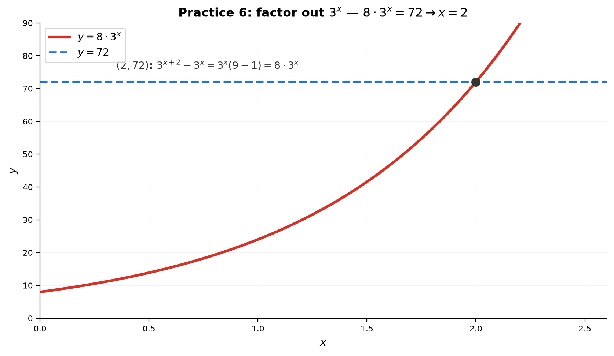
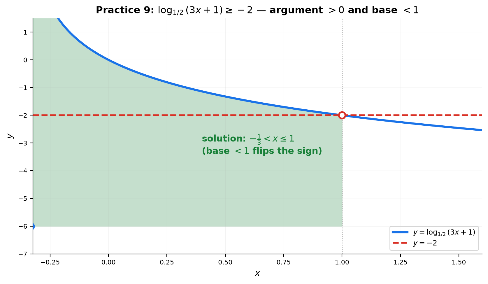
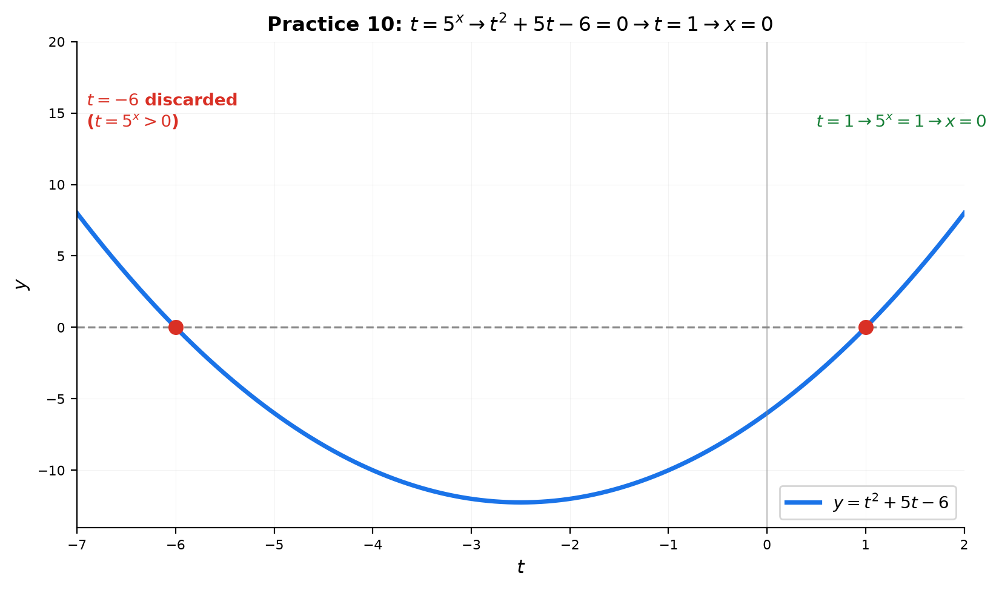

# Solutions — 10A: Exponents and Logarithms — Core Rules and Equations

---

## Practice 1

**Solve $2^{x+1} = 8^{x-2}$. Unify to base 2.**

① Write everything in base 2: $8^{x-2} = (2^3)^{x-2} = 2^{3x-6}$.

② Equate exponents: $x+1 = 3x-6$.

③ $2x = 7$ → $x = \frac{7}{2}$.

> **Answer**: $x = \frac{7}{2}$

---

## Practice 2

**Solve $\log_3(2x-1) - \log_3(x+1) = 1$. Check arguments!**

① Combine (subtraction = division): $\log_3\frac{2x-1}{x+1} = 1$.

② Remove the log: $\frac{2x-1}{x+1} = 3^1 = 3$.

③ $2x-1 = 3x+3$ → $-x = 4$ → $x = -4$.

④ **Check arguments**: $2x-1 = -9 < 0$ — invalid!

> **Answer**: no solution (the algebra gives $x=-4$, which violates $2x-1>0$)

---

## Practice 3

**Solve $4^x - 2^{x+2} - 32 = 0$. Substitute $t = 2^x$.**

① $4^x = (2^x)^2 = t^2$ and $2^{x+2} = 4\cdot 2^x = 4t$.

② $t^2 - 4t - 32 = 0$ → $(t-8)(t+4) = 0$ → $t=8$ or $t=-4$.

③ $t = 2^x > 0$, so discard $t=-4$. $2^x = 8$ → $x=3$.

> **Answer**: $x = 3$

---

## Practice 4: Composition

**$2^a = 3$ and $3^b = 2$. Show $ab = 1$. Then check $5^c = 7$ and $7^d = 5$. State the general rule.**

① From $2^a = 3$, take $\log_2$: $a = \log_2 3$.

② From $3^b = 2$, take $\log_2$: $b\log_2 3 = 1$ → $b = \frac{1}{\log_2 3}$.

③ So $ab = \log_2 3 \cdot \frac{1}{\log_2 3} = 1$ ✓.

**Check**: $5^c=7$ → $c=\log_5 7$. $7^d=5$ → $d=\log_7 5$. $cd = \log_5 7\cdot\log_7 5 = 1$ ✓ (change of base: $\log_a b \cdot \log_b a = 1$).

**General rule**: if $a^m = b$ and $b^n = a$, then $mn = 1$ — the two exponents are **reciprocals**, because $\log_a b \cdot \log_b a = 1$.

> **Answer**: $ab=1$; $cd=1$; general rule: $\log_a b \cdot \log_b a = 1$

---

## Practice 5

**Solve $x^{\log_2 x} = 8x$. Take $\log_2$ of both sides.**

① $\log_2(x^{\log_2 x}) = \log_2(8x)$ → $(\log_2 x)^2 = 3 + \log_2 x$.

② Let $t = \log_2 x$: $t^2 - t - 3 = 0$.

③ $t = \frac{1 \pm \sqrt{13}}{2}$ (both valid — each gives $x > 0$).

④ $x = 2^t$.

> **Answer**: $x = 2^{\frac{1+\sqrt{13}}{2}}$ or $2^{\frac{1-\sqrt{13}}{2}}$

---

## Practice 6

**Solve $3^{x+2} - 3^x = 72$. Factor out $3^x$.**

① $3^{x+2} - 3^x = 3^x(3^2 - 1) = 8\cdot 3^x$.

② $8\cdot 3^x = 72$ → $3^x = 9$ → $x = 2$.

> **Answer**: $x = 2$

---

## Practice 7

**Solve $\log_2(x^2 - 3x) = 2$. Remove the log and check arguments.**

① Remove the log: $x^2 - 3x = 2^2 = 4$.

② $x^2 - 3x - 4 = 0$ → $(x-4)(x+1) = 0$ → $x=4$ or $x=-1$.

③ **Check arguments**: $x^2-3x>0$.
- $x=4$: $16-12=4>0$ ✓
- $x=-1$: $1+3=4>0$ ✓

> **Answer**: $x = 4$ and $x = -1$

---

## Practice 8: Composition

**Invent two different exponential equations where $t=2^x$ leads to $t^2 - 6t + 8 = 0$. Solve both.**

① $t^2-6t+8=(t-2)(t-4)=0$ → $t=2,4$ → $x=1,2$.

**Equation 1**: $4^x - 6\cdot 2^x + 8 = 0$. Substitute $t=2^x$: $t^2 - 6t + 8 = 0$ → $x=1,2$.

**Equation 2**: $2\cdot 4^x - 12\cdot 2^x + 16 = 0$. Substitute: $2t^2 - 12t + 16 = 0$. Divide by 2: $t^2 - 6t + 8 = 0$ → $x=1,2$.

**Why the same quadratic?** Any equation of the form $A\cdot 4^x + B\cdot 2^x + C = 0$ becomes $At^2 + Bt + C = 0$ under $t=2^x$ (because $4^x = t^2$). Equation 2 is just Equation 1 multiplied by 2, so dividing by 2 restores the same quadratic — and the same roots $x=1,2$.

> **Answer**: e.g. $4^x - 6\cdot 2^x + 8 = 0$ and $2\cdot 4^x - 12\cdot 2^x + 16 = 0$; both give $x=1,2$

---

## Practice 9

**Solve $\log_{\frac{1}{2}}(3x+1) \geq -2$. Handle base < 1 and argument > 0.**

① Base $\frac12 < 1$ → **flip** the inequality when removing the log:
$3x+1 \leq \left(\frac12\right)^{-2} = 4$.

② $3x \leq 3$ → $x \leq 1$.

③ Argument $> 0$: $3x+1 > 0$ → $x > -\frac13$.

④ Intersect: $-\frac13 < x \leq 1$.

> **Answer**: $-\frac{1}{3} < x \leq 1$

---

## Practice 10: Real Battle

**Solve $25^x + 5^{x+1} - 6 = 0$. Unify to base 5, then use $t = 5^x$.**

① $25^x = (5^2)^x = 5^{2x} = t^2$; $5^{x+1} = 5\cdot 5^x = 5t$.

② $t^2 + 5t - 6 = 0$ → $(t+6)(t-1) = 0$ → $t=-6$ or $t=1$.

③ $t = 5^x > 0$, so discard $t=-6$. $5^x = 1$ → $x=0$.

> **Answer**: $x = 0$

---

## Basic Drills

### D1. $3^4 \cdot 3^{-2}$ — same base, add exponents.

$3^{4+(-2)} = 3^2 = 9$.

> **Answer**: $9$

---

### D2. $\frac{5^6}{5^2}$ — same base, subtract exponents.

$5^{6-2} = 5^4 = 625$.

> **Answer**: $625$

---

### D3. $(2^3)^2$ — power of a power, multiply.

$2^{3\cdot 2} = 2^6 = 64$.

> **Answer**: $64$

---

### D4. $16^{-\frac12}$ — negative and fractional.

$16^{-1/2} = \frac{1}{\sqrt{16}} = \frac14$.

> **Answer**: $\frac14$

---

### D5. $27^{\frac23}$ — root then power.

$(\sqrt[3]{27})^2 = 3^2 = 9$.

> **Answer**: $9$

---

### D6. $\frac{10^4 \cdot 10^{-1}}{10^2}$ — combine exponents.

$10^{4-1-2} = 10^1 = 10$.

> **Answer**: $10$

---

### D7. $\left(\frac{8}{27}\right)^{-\frac23}$ — flip, root, power.

$\left(\frac{27}{8}\right)^{2/3} = \left(\frac{3}{2}\right)^2 = \frac94$.

> **Answer**: $\frac94$

---

### D8. $\log_5 125 + \log_5 \frac15$ — evaluate each.

$3 + (-1) = 2$.

> **Answer**: $2$

---

### D9. $\log_3 27 - \log_3 \frac19$ — evaluate each.

$3 - (-2) = 5$.

> **Answer**: $5$

---

### D10. $\ln e^5 + \ln 1 - \ln e^{-2}$ — simplify.

$5 + 0 - (-2) = 7$.

> **Answer**: $7$

---

## Advanced Drills

### A1. Convert each into the form $e^{kx+b}$.

(a) $2^x = e^{x\ln 2}$

(b) $3^{2x+1} = e^{(2x+1)\ln 3}$

(c) $10^{x-1} = e^{(x-1)\ln 10}$

(d) $\left(\frac12\right)^x = 2^{-x} = e^{-x\ln 2}$

> **Answer**: (a) $e^{x\ln2}$ (b) $e^{(2x+1)\ln3}$ (c) $e^{(x-1)\ln10}$ (d) $e^{-x\ln2}$

---

### A2. Double-check with two methods.

(a) Method 1: $8^x\cdot 2^{1-3x} = 2^{3x}\cdot 2^{1-3x} = 2$. Method 2: $e^{3x\ln2}\cdot e^{(1-3x)\ln2} = e^{\ln2} = 2$. ✓

(b) Method 1: $3^x\cdot5^x = 15^x$. Method 2: $e^{x\ln3}\cdot e^{x\ln5} = e^{x(\ln3+\ln5)} = e^{x\ln15} = 15^x$. ✓

(c) Method 1: $\frac{4^{x+1}}{2^{2x-3}} = \frac{2^{2x+2}}{2^{2x-3}} = 2^5 = 32$. Method 2: $\frac{e^{(2x+2)\ln2}}{e^{(2x-3)\ln2}} = e^{5\ln2} = 32$. ✓

> **Answer**: (a) $2$ (b) $15^x$ (c) $32$

---

### A3. Cancellation identities.

(a) $e^{\ln(x^2+1)} = x^2+1$ (argument $x^2+1>0$ always).

(b) $\ln(e^{3x+1}) = 3x+1$.

(c) $e^{2\ln x} = e^{\ln(x^2)} = x^2$ ($x>0$).

(d) $e^{x\ln 2} = 2^x$.

Equations: $e^{x\ln2}=8$ → $2^x = 8$ → $x=3$. $e^{x\ln3}=\frac19$ → $3^x = 3^{-2}$ → $x=-2$.

> **Answer**: (a) $x^2+1$ (b) $3x+1$ (c) $x^2$ (d) $2^x$; then $x=3$ and $x=-2$

---

### A4. Log expansion.

(a) $\ln\frac{x^2+1}{x-1} = \ln(x^2+1) - \ln(x-1)$

(b) $\ln(x^3\sqrt{x+2}) = 3\ln x + \frac12\ln(x+2)$

(c) $\ln(x^x) = x\ln x$

(d) $\ln\frac{(x+1)^2}{e^x} = 2\ln(x+1) - x$

Reverse: $\ln(x^2-1) = \ln(x-1) + \ln(x+1)$; $\ln(e^x\cdot 2^x) = x + x\ln 2 = x(1+\ln2)$.

> **Answer**: (a) $\ln(x^2+1)-\ln(x-1)$ (b) $3\ln x+\frac12\ln(x+2)$ (c) $x\ln x$ (d) $2\ln(x+1)-x$; reverse: $\ln(x-1)+\ln(x+1)$, $x(1+\ln2)$

---

### A5. Solve $2^{2x+1} - 3\cdot2^{x+1} + 4 = 0$.

$2\cdot 2^{2x} - 6\cdot 2^x + 4 = 0$. Divide by 2, let $t=2^x$: $t^2 - 3t + 2 = 0$ → $(t-1)(t-2)=0$ → $t=1,2$ (both $>0$ ✓) → $x=0,1$.

> **Answer**: $x=0$ or $x=1$

---

### A6. Solve $\log_2(x+1) - \log_4(x+3) = 1$.

① Convert: $\log_4(x+3) = \frac12\log_2(x+3)$.

② $\log_2(x+1) - \frac12\log_2(x+3) = 1$ → ×2: $\log_2\frac{(x+1)^2}{x+3} = 2$.

③ $\frac{(x+1)^2}{x+3} = 4$ → $(x+1)^2 = 4(x+3)$ → $x^2 - 2x - 11 = 0$ → $x = 1\pm 2\sqrt3$.

④ Arguments: $x>-1$. $1+2\sqrt3\approx4.46$ ✓; $1-2\sqrt3\approx-2.46$ ✗.

> **Answer**: $x = 1+2\sqrt3$

---

### A7. Solve $\log_{\frac12}(x^2-3x) > -2$.

① Base $\frac12<1$ → flip: $x^2-3x < (\frac12)^{-2} = 4$ → $x^2-3x-4<0$ → $(x-4)(x+1)<0$ → $-1<x<4$.

② Arguments: $x^2-3x>0$ → $x(x-3)>0$ → $x<0$ or $x>3$.

③ Intersect: $(-1,0)\cup(3,4)$.

> **Answer**: $(-1,0)\cup(3,4)$

---

### A8. Solve $x^{\log_2 x} = 8x^2$.

Take $\log_2$: $(\log_2 x)^2 = 3 + 2\log_2 x$. Let $t=\log_2 x$: $t^2-2t-3=0$ → $(t-3)(t+1)=0$ → $t=3,-1$ → $x=8,\frac12$.

> **Answer**: $x=8$ or $x=\frac12$

---

### A9. Solve $2^x\cdot3^x = 24$.

$6^x = 24$ → $x = \log_6 24 = \frac{\ln24}{\ln6}$. Also $\log_6 24 = \log_6(6\cdot4) = 1 + \log_6 4$.

> **Answer**: $x = \log_6 24 = 1 + \log_6 4$

---

### A10. Solve $3^{2x+1} - 4\cdot3^x + 1 = 0$.

$3\cdot3^{2x} - 4\cdot3^x + 1 = 0$. Let $t=3^x$: $3t^2 - 4t + 1 = 0$ → $(3t-1)(t-1)=0$ → $t=\frac13,1$ (both $>0$ ✓) → $x=-1,0$.

> **Answer**: $x=-1$ or $x=0$
