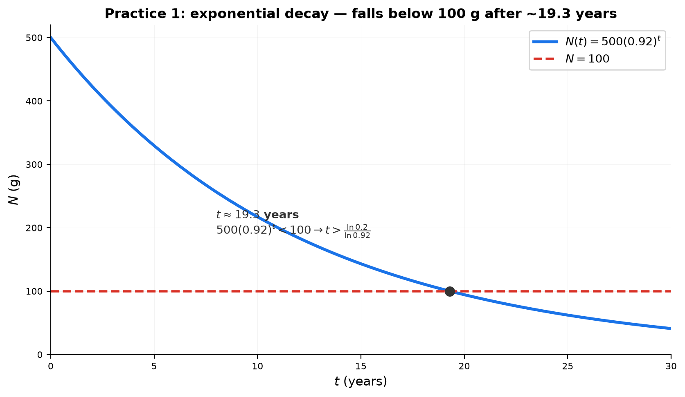
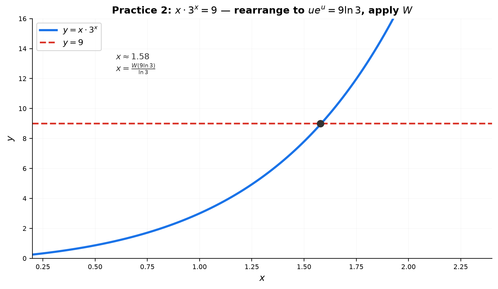

# Solutions — 10B: Exponents and Logarithms — Applications and Advanced Techniques

---

## Practice 1

**A radioactive substance decays 8% per year. Starting with 500g, find when it falls below 100g. $500(0.92)^t < 100$.**

① Divide: $(0.92)^t < 0.2$.

② Take $\ln$ of both sides (base $<1$, so the inequality flips):
$t\ln(0.92) < \ln(0.2)$ → $t > \frac{\ln 0.2}{\ln 0.92}$.

③ $t > \frac{-1.6094}{-0.08338} \approx 19.30$ years.

> **Answer**: after about **19.3 years** (i.e., during the 20th year)

---

## Practice 2

**$x \cdot 3^x = 9$. Use the Lambert $W$ technique.**

① Rewrite $3^x = e^{x\ln 3}$: $x e^{x\ln 3} = 9$.

② Multiply both sides by $\ln 3$: $(x\ln 3)\,e^{x\ln 3} = 9\ln 3$.

③ This is $u e^u = 9\ln 3$ with $u = x\ln 3$.

④ $u = W(9\ln 3)$ → $x = \frac{W(9\ln 3)}{\ln 3}$.

**Numerically**: $9\ln 3 \approx 9.8875$, $W(9.8875) \approx 1.735$, so $x \approx 1.58$.

> **Answer**: $x = \frac{W(9\ln 3)}{\ln 3} \approx 1.58$

---

## Practice 3: Real Battle

**Show the infinite power tower converges only for $e^{-e} \leq x \leq e^{1/e}$. Then solve $x^{x^{x^{\cdot^{\cdot^{\cdot}}}}} = y$ for $x$ in terms of $y$, and evaluate for $y = e$.**

① If the tower converges to a limit $L$, then the whole tower equals $x$ raised to (the tower), so $x^L = L$ → $x = L^{1/L}$.

② The function $f(L) = L^{1/L}$ attains its **maximum** at $L = e$: $f(e) = e^{1/e}$. (Check: $f'(L)=0$ at $L=e$.)

③ As the limit $L$ ranges over its valid values, $x = L^{1/L}$ ranges over $[e^{-e}, e^{1/e}]$ — the convergence interval (Euler, 1783).

④ **Solving $x^{\text{tower}} = y$**: the limit is $y$, so $x^y = y$ → $\boxed{x = y^{1/y}}$.

⑤ **For $y = e$**: $x = e^{1/e} \approx 1.4447$ — exactly the upper bound of the convergence interval.

> **Answer**: $x = y^{1/y}$; for $y=e$, $x = e^{1/e}$

---

## Practice 4

**Use logarithmic differentiation to find $dy/dx$ for $y = (\sin x)^{\cos x}$.**

① $\ln y = \cos x \ln(\sin x)$.

② Differentiate (product rule on the right):
$\frac{y'}{y} = -\sin x\ln(\sin x) + \cos x\cdot\frac{\cos x}{\sin x} = \cos x\cot x - \sin x\ln(\sin x)$.

③ Multiply by $y$:

> **Answer**: $y' = (\sin x)^{\cos x}\left[\cos x\cot x - \sin x\ln(\sin x)\right]$

---

## Practice 5

**The pH of a solution is 4.5. Find $[\text{H}^+]$.**

$\text{pH} = -\log[\text{H}^+] = 4.5$ → $[\text{H}^+] = 10^{-4.5} \approx 3.16 \times 10^{-5}$ M.

> **Answer**: $[\text{H}^+] = 10^{-4.5} \approx 3.2\times 10^{-5}$ M

---

## Practice 6: Real Battle

**How many digits does $50!$ have? Use Stirling's approximation.**

① $\log_{10}(50!) \approx \frac{1}{\ln 10}\left(50\ln 50 - 50 + \frac12\ln(2\pi\cdot 50)\right)$.

② $50\ln 50 \approx 195.60$, minus $50$ → $145.60$; $\frac12\ln(100\pi) \approx 2.876$ → sum $\approx 148.48$.

③ Divide by $\ln 10 \approx 2.3026$: $\log_{10}(50!) \approx 64.48$.

④ Number of digits $= \lfloor \log_{10}(50!) \rfloor + 1 = 64 + 1 = 65$.

> **Answer**: $50!$ has **65 digits**

---

## Basic Drills

### D1. \$1000 at 6% compounded quarterly for 2 years.

$A = 1000\left(1+\frac{0.06}{4}\right)^{4\cdot 2} = 1000(1.015)^8 \approx 1000(1.12649) = 1126.49$.

> **Answer**: $\$1126.49$

---

### D2. Half-life 10 hours: find $k$, then the fraction after 25 hours.

$k = \frac{\ln 2}{t_{1/2}} = \frac{\ln 2}{10} \approx 0.0693$ /hour.

Fraction after 25 h: $e^{-k\cdot 25} = e^{-1.7329} \approx 0.177$ (equivalently $(\frac12)^{2.5}$).

> **Answer**: $k \approx 0.0693$; about **17.7%** remains

---

### D3. pH of $[\text{H}^+] = 2.5 \times 10^{-6}$.

$\text{pH} = -\log(2.5\times 10^{-6}) = -\log(2.5) + 6 \approx -0.398 + 6 = 5.60$.

> **Answer**: $\text{pH} \approx 5.6$

---

### D4. Decibel level of $I = 10^{-5}$ W/m².

$\beta = 10\log\frac{10^{-5}}{10^{-12}} = 10\log 10^7 = 70$ dB.

> **Answer**: $70$ dB

---

### D5. Midpoint between $10^2$ and $10^6$ on a log scale.

Geometric mean: $\sqrt{10^2\cdot 10^6} = 10^4 = 10000$.

> **Answer**: $10^4 = 10000$

---

### D6. Rewrite $x\cdot 5^x = 10$ as $u e^u = k$.

$5^x = e^{x\ln 5}$ → $x e^{x\ln 5} = 10$ → multiply by $\ln 5$:
$(x\ln 5)e^{x\ln 5} = 10\ln 5$, so $u = x\ln 5$, $k = 10\ln 5$.

> **Answer**: $u e^u = 10\ln 5$ with $u = x\ln 5$

---

### D7. Set up log-differentiation for $y = x^{\sin x}$.

$\ln y = \sin x\ln x$; differentiating: $\frac{y'}{y} = \cos x\ln x + \frac{\sin x}{x}$.

> **Answer**: $\ln y = \sin x\ln x$, $\frac{y'}{y} = \cos x\ln x + \frac{\sin x}{x}$

---

### D8. Estimate $\log_{10}(20!)$ with Stirling.

$\log_{10}(20!) \approx \frac{20\ln 20 - 20}{\ln 10} = \frac{20(2.9957)-20}{2.3026} \approx \frac{39.914}{2.3026} \approx 17.33$ → about 18 digits.

> **Answer**: $\approx 17.3$ (so $20!$ has about 18 digits)

---

### D9. Probability the first digit is 1 (Benford).

$P(1) = \log_{10}(2) \approx 0.3010$.

> **Answer**: about **30.1%**

---

### D10. Verify $2^4 = 4^2$, then find another pair with $t=3$.

$2^4 = 16 = 4^2$ ✓.

Parametric form with $t=3$: $x = 3^{1/(3-1)} = 3^{1/2} = \sqrt3$, $y = 3^{3/2} = 3\sqrt3$.

Check: $(\sqrt3)^{3\sqrt3} = (3\sqrt3)^{\sqrt3}$ (both equal $3^{3\sqrt3/2}$) ✓.

> **Answer**: $(\sqrt3,\ 3\sqrt3)$

---

## Advanced Drills

### A1. Differentiate via e-form.

$2^x = e^{x\ln2}$ → $f'(x) = e^{x\ln2}\cdot\ln2 = 2^x\ln2$.

$3^{2x+1} = e^{(2x+1)\ln3}$ → $f'(x) = 3^{2x+1}\cdot 2\ln3$.

$10^x = e^{x\ln10}$ → $f'(x) = 10^x\ln10$.

General: $\frac{d}{dx}a^x = a^x\ln a$ (chain rule on $e^{x\ln a}$).

> **Answer**: (a) $2^x\ln2$ (b) $2\cdot3^{2x+1}\ln3$ (c) $10^x\ln10$

---

### A2. Log derivatives.

$\log_2 x = \frac{\ln x}{\ln2}$ → $g'(x) = \frac1{x\ln2}$.

$\ln(x^2+1)$ → $g'(x) = \frac{2x}{x^2+1}$.

$\log_3(2x+1) = \frac{\ln(2x+1)}{\ln3}$ → $g'(x) = \frac{2}{(2x+1)\ln3}$.

> **Answer**: (a) $\frac1{x\ln2}$ (b) $\frac{2x}{x^2+1}$ (c) $\frac2{(2x+1)\ln3}$

---

### A3. Logarithmic differentiation.

(a) $\ln y = \sin x\ln x$ → $\frac{y'}{y} = \cos x\ln x + \frac{\sin x}{x}$ → $y' = x^{\sin x}\left(\cos x\ln x + \frac{\sin x}{x}\right)$.

(b) $\ln y = (\ln x)^2$ → $\frac{y'}{y} = \frac{2\ln x}{x}$ → $y' = x^{\ln x}\cdot\frac{2\ln x}{x}$.

> **Answer**: (a) $x^{\sin x}(\cos x\ln x + \frac{\sin x}{x})$ (b) $\frac{2x^{\ln x}\ln x}{x}$

---

### A4. Integration preview.

(a) $\int 2^x\,dx = \frac{2^x}{\ln2} + C$ (since $2^x = e^{x\ln2}$).

(b) $\int 3^{2x}\,dx = \frac{3^{2x}}{2\ln3} + C$.

(c) $\int \frac1x\,dx = \ln x + C$ ($x>0$).

(d) $\int e^{3x}\,dx = \frac{e^{3x}}3 + C$.

> **Answer**: (a) $\frac{2^x}{\ln2}+C$ (b) $\frac{3^{2x}}{2\ln3}+C$ (c) $\ln x+C$ (d) $\frac{e^{3x}}3+C$

---

### A5. Lambert W, real solves.

(a) $x\cdot2^x = 5$: $2^x = e^{x\ln2}$ → $x e^{x\ln2} = 5$ → $(x\ln2)e^{x\ln2} = 5\ln2$. Set $u=x\ln2$: $u e^u = 5\ln2$ → $u = W(5\ln2)$ → $x = \frac{W(5\ln2)}{\ln2}$. $5\ln2\approx3.466$, $W(3.466)\approx1.125$ → $x\approx1.623$.

(b) $x^x = 7$: $\ln x\,e^{\ln x} = \ln7$ → $\ln x = W(\ln7)$ → $x = e^{W(\ln7)}$. $\ln7\approx1.946$, $W(1.946)\approx0.840$ → $x\approx2.316$.

> **Answer**: (a) $x=\frac{W(5\ln2)}{\ln2}\approx1.623$ (b) $x=e^{W(\ln7)}\approx2.316$

---

### A6. Power tower.

If the limit is $L$, then $x^L = L$, so $x = L^{1/L}$.

(a) $L=3$: $x^3 = 3$ → $x = 3^{1/3}$.

(b) $L=2$: $x^2 = 2$ → $x = \sqrt2$. Check: $(\sqrt2)^2 = 2$ ✓.

(c) $x=\sqrt2 = 4^{1/4}$ is an algebraic root of $x^4=4$, but the infinite tower converges only for $x\in[e^{-e}, e^{1/e}]\approx[0.0659,1.4447]$, and its maximum limit is $e\approx2.718$. Since $4>e$, the tower cannot converge to 4.

> **Answer**: (a) $3^{1/3}$ (b) $\sqrt2$ (c) $4>e$ = maximum convergent limit

---

### A7. $\ln(1+x) \leq x$.

(a) $\ln\left(1+\frac1n\right)^n = n\ln(1+\frac1n) \leq n\cdot\frac1n = 1$ → exponentiate: $\left(1+\frac1n\right)^n \leq e$.

(b) $\ln(n+1) = \sum_{k=1}^n\ln\left(1+\frac1k\right) \leq \sum_{k=1}^n\frac1k = 1+\frac12+\cdots+\frac1n$.

> **Answer**: (a) as above (b) as above

---

### A8. Stirling, 30!.

$\log_{10}(30!) \approx \frac{30\ln30 - 30 + \frac12\ln(2\pi\cdot30)}{\ln10} = \frac{102.04 - 30 + 2.62}{2.3026} = \frac{74.66}{2.3026}\approx32.42$. Since $\log_{10}(30!)\in[32,33)$, $30!$ has **33 digits**.

> **Answer**: 33 digits

---

### A9. Richter scale.

$M = \log_{10}(A/A_0)$. If $A\to100A$: $M\to\log_{10}(100A/A_0) = M + \log_{10}100 = M+2$. Magnitude increases by **2**.

$E\propto A^{3/2}$ → $\log_{10}E = \frac32\log_{10}A + \text{const}$. A magnitude increase of 1 means $\log_{10}A$ increases by 1 → $\log_{10}E$ increases by $\frac32$ → $E$ multiplies by $10^{3/2}\approx31.6$.

> **Answer**: magnitude +2; energy × about 31.6

---

### A10. Growth rate.

$N(t) = 200\cdot3^{t/5}$. Set $N=100{,}000$: $3^{t/5}=500$ → $t = 5\log_3 500 = 5\cdot\frac{\ln500}{\ln3} = 5\cdot\frac{6.2146}{1.0986}\approx28.3$ hours.

e-form: $N(t) = 200e^{(t/5)\ln3}$ → $N'(t) = N(t)\cdot\frac{\ln3}{5}$. At $N=100{,}000$: $N' = 100{,}000\cdot\frac{1.0986}{5}\approx21{,}972$ cells/hour.

> **Answer**: about 28.3 hours; growth rate ≈ 21,972 cells/hour
