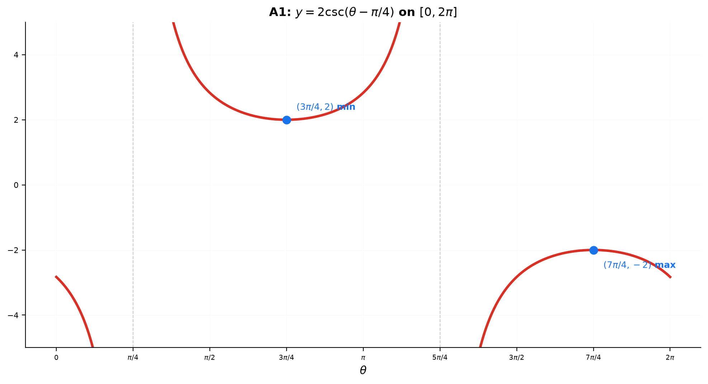
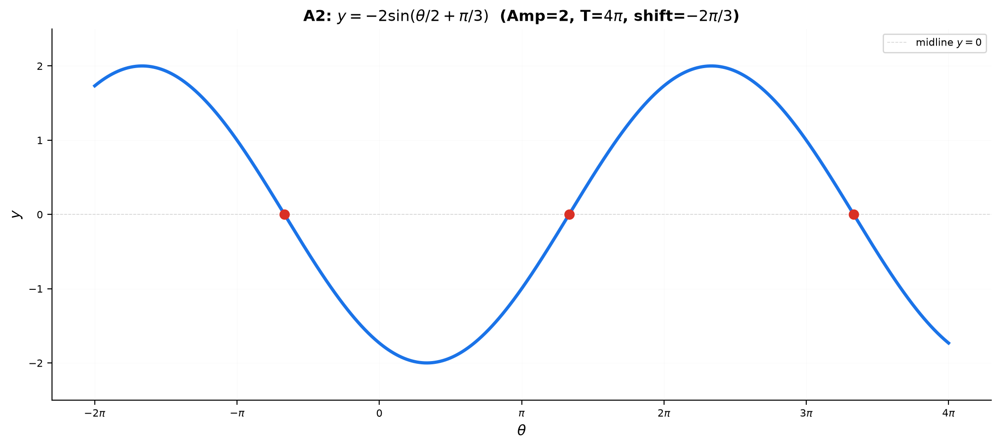
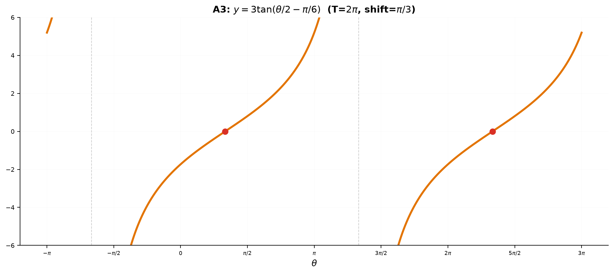
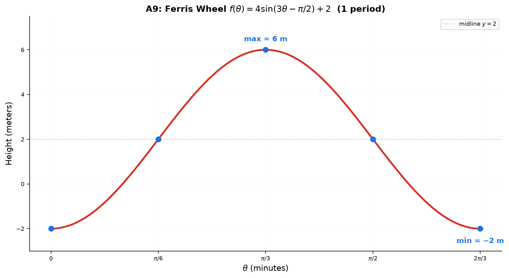

# Solutions — 11A: Trigonometric Foundations

> Back to [11A — Trigonometric Foundations](../11A-trig-foundations.md)
## Basic Drills

**D1.** $210^\circ \times \frac{\pi}{180^\circ} = \frac{210\pi}{180} = \frac{7\pi}{6}$.

**D2.** $\frac{11\pi}{6} \times \frac{180^\circ}{\pi} = \frac{11 \times 180^\circ}{6} = 330^\circ$.

**D3.** $\frac{5\pi}{4} = 225^\circ$, QIII. Reference angle = $\frac{5\pi}{4} - \pi = \frac{\pi}{4}$.

**D4.** $\sin\frac{2\pi}{3}$: QII, reference $\frac{\pi}{3}$, sin positive → $\frac{\sqrt{3}}{2}$.

**D5.** $\cos\frac{5\pi}{6}$: QII, reference $\frac{\pi}{6}$, cos negative → $-\frac{\sqrt{3}}{2}$.

**D6.** $\tan\frac{4\pi}{3}$: QIII, reference $\frac{\pi}{3}$, tan positive (both negative) → $\sqrt{3}$.

**D7.** $\sec\frac{\pi}{3} = \frac{1}{\cos\frac{\pi}{3}} = \frac{1}{1/2} = 2$.

**D8.** $\csc\frac{7\pi}{6}$: QIII, $\sin\frac{7\pi}{6} = -\frac{1}{2}$, so $\csc\frac{7\pi}{6} = -2$.

**D9.** $\cot\frac{3\pi}{4}$: QII, $\tan\frac{3\pi}{4} = \frac{\sin}{\cos} = \frac{\sqrt{2}/2}{-\sqrt{2}/2} = -1$, so $\cot\frac{3\pi}{4} = -1$.

**D10.** $\sin\frac{7\pi}{4} = -\frac{\sqrt{2}}{2}$. $\arcsin(-\frac{\sqrt{2}}{2}) = -\frac{\pi}{4}$.
(Note: $\frac{7\pi}{4}$ is in $[-\frac{\pi}{2}, \frac{\pi}{2}]$? No — it's not. $\arcsin$ returns the angle in $[-\frac{\pi}{2}, \frac{\pi}{2}]$ with the same sine: $-\frac{\pi}{4}$.)

---

## Advanced Drills

### A1 — Graph $y = 2\csc(\theta - \frac{\pi}{4})$ on $[0, 2\pi]$

- Parent: $\csc\theta$ has asymptotes at $\theta = n\pi$.
- Shift right by $\frac{\pi}{4}$: asymptotes at $\theta = \frac{\pi}{4} + n\pi$.
- On $[0, 2\pi]$: asymptotes at $\theta = \frac{\pi}{4}, \frac{5\pi}{4}$.
- Vertical stretch by 2: local minimum at $\theta = \frac{\pi}{4} + \frac{\pi}{2} = \frac{3\pi}{4}$ with value $2(1) = 2$.
- Local maximum at $\theta = \frac{5\pi}{4} + \frac{\pi}{2} = \frac{7\pi}{4}$ with value $2(-1) = -2$.

**Local extrema**: Minimum at $(\frac{3\pi}{4}, 2)$. Maximum at $(\frac{7\pi}{4}, -2)$.

### A2 — Graph $y = -2\sin(\frac{1}{2}\theta + \frac{\pi}{3})$ on $[-2\pi, 4\pi]$

Rewrite: $y = -2\sin(\frac{1}{2}(\theta + \frac{2\pi}{3}))$.

- **Amplitude**: $|-2| = 2$.
- **Period**: $\frac{2\pi}{1/2} = 4\pi$.
- **Phase shift**: $-\frac{2\pi}{3}$ (left).
- **Midline**: $y = 0$.
- **Reflection**: $A = -2$ flips the wave vertically.

**$x$-intercepts**: The unshifted sine has zeros at $n\pi$. After the shift: $\frac{1}{2}\theta + \frac{\pi}{3} = n\pi$ → $\theta = 2n\pi - \frac{2\pi}{3}$.
On $[-2\pi, 4\pi]$: $n=0$ → $\theta = -\frac{2\pi}{3}$. $n=1$ → $\theta = \frac{4\pi}{3}$. $n=2$ → $\theta = \frac{10\pi}{3}$.

Also zeros occur at the half-period offsets: $\theta = -\frac{2\pi}{3} + 2\pi = \frac{4\pi}{3}$, $\theta = \frac{4\pi}{3} + 2\pi = \frac{10\pi}{3}$.

### A3 — Graph $y = 3\tan(\frac{\theta}{2} - \frac{\pi}{6})$ on $[-\pi, 3\pi]$

Rewrite: $y = 3\tan(\frac{1}{2}(\theta - \frac{\pi}{3}))$.

- **Period**: $\frac{\pi}{1/2} = 2\pi$.
- **Phase shift**: $\frac{\pi}{3}$ (right).
- **Asymptotes**: unshifted $\tan$ has asymptotes at $\frac{\pi}{2} + n\pi$. For $\frac{\theta}{2} - \frac{\pi}{6}$:
$\frac{\theta}{2} - \frac{\pi}{6} = \frac{\pi}{2} + n\pi$ → $\frac{\theta}{2} = \frac{2\pi}{3} + n\pi$ → $\theta = \frac{4\pi}{3} + 2n\pi$.
On $[-\pi, 3\pi]$: $n=0$ → $\theta = \frac{4\pi}{3}$. $n=1$ → $\theta = \frac{10\pi}{3}$ (outside). $n=-1$ → $\theta = -\frac{2\pi}{3}$.

- **Midline crossings** ($y=0$, where $\tan = 0$): $\frac{\theta}{2} - \frac{\pi}{6} = n\pi$ → $\theta = \frac{\pi}{3} + 2n\pi$.
On $[-\pi, 3\pi]$: $n=0$ → $\theta = \frac{\pi}{3}$. $n=1$ → $\theta = \frac{7\pi}{3}$.

The vertical stretch by 3 makes the curve steeper, but doesn't change asymptote positions or zero crossings.

### A4

Let $\alpha = \arccos\frac{12}{13}$: adjacent = $12$, hypotenuse = $13$, opposite = $\sqrt{169-144} = 5$.
$\alpha \in [0, \pi]$, $\cos\alpha > 0$ → $\alpha \in$ QI → $\sin\alpha = \frac{5}{13}$.

Let $\beta = \arcsin\frac{3}{5}$: opposite = $3$, hypotenuse = $5$, adjacent = $\sqrt{25-9} = 4$.
$\beta \in [-\frac{\pi}{2}, \frac{\pi}{2}]$, $\sin\beta > 0$ → $\beta \in$ QI → $\cos\beta = \frac{4}{5}$.

$\sin(\arccos\frac{12}{13}) + \cos(\arcsin\frac{3}{5}) = \frac{5}{13} + \frac{4}{5} = \frac{25}{65} + \frac{52}{65} = \frac{77}{65}$.

### A5

Let $\theta = \arctan x$, so $\tan\theta = x = \frac{x}{1}$.
Right triangle: opposite = $x$, adjacent = $1$, hypotenuse = $\sqrt{x^2+1}$.
$\sec\theta = \frac{1}{\cos\theta} = \frac{\text{hypotenuse}}{\text{adjacent}} = \sqrt{x^2+1}$.

→ $\sec(\arctan x) = \sqrt{x^2+1}$.

### A6

$\cos\frac{5\pi}{6} = -\frac{\sqrt{3}}{2}$ (QII, reference $\frac{\pi}{6}$, cos negative).

Now $\arcsin(-\frac{\sqrt{3}}{2})$. The angle in $[-\frac{\pi}{2}, \frac{\pi}{2}]$ whose sine is $-\frac{\sqrt{3}}{2}$ is $-\frac{\pi}{3}$.

→ $\arcsin(\cos\frac{5\pi}{6}) = -\frac{\pi}{3}$.

### A7

$\arcsin x = \arccos 2x$, $x > 0$. Take sine of both sides:

$\sin(\arcsin x) = \sin(\arccos 2x)$ → $x = \sqrt{1 - (2x)^2}$ (since $\arccos 2x \in [0, \pi]$, $\sin(\arccos 2x) = \sqrt{1-4x^2} \geq 0$).

$x^2 = 1 - 4x^2$ → $5x^2 = 1$ → $x = \frac{1}{\sqrt{5}}$ (positive root since $x > 0$).

Check: $\arcsin\frac{1}{\sqrt{5}}$ vs $\arccos\frac{2}{\sqrt{5}}$. Since $\sin^2 + \cos^2 = 1$, $\frac{1}{5} + \frac{4}{5} = 1$ ✓. And $x > 0$ verified.

### A8

$P = (\frac{5}{13}, -\frac{12}{13})$ on the unit circle.

**(a)** $\cos\theta = x = \frac{5}{13}$. $\sin\theta = y = -\frac{12}{13}$.

**(b)** $\cos\theta > 0$, $\sin\theta < 0$ → QIV.

**(c)**
$\tan\theta = \frac{\sin\theta}{\cos\theta} = \frac{-12/13}{5/13} = -\frac{12}{5}$.
$\csc\theta = \frac{1}{\sin\theta} = -\frac{13}{12}$.
$\sec\theta = \frac{1}{\cos\theta} = \frac{13}{5}$.
$\cot\theta = \frac{1}{\tan\theta} = -\frac{5}{12}$.

**(d)** Reference angle $\alpha$: $|\sin\alpha| = \frac{12}{13}$, so $\alpha = \arcsin\frac{12}{13} \approx 67.38^\circ$.

**(e)** In QIV, $\theta = 2\pi - \arcsin\frac{12}{13}$.
Or using $\cos$: $\theta = \arccos\frac{5}{13}$? No — $\arccos\frac{5}{13}$ is in QI (≈ 67.38°). For QIV: $\theta = 2\pi - \arccos\frac{5}{13}$.
Alternatively: $\theta = -\arcsin\frac{12}{13}$ (negative angle, since in $[-\frac{\pi}{2}, \frac{\pi}{2}]$ this is the correct arcsin range).

### A9

$f(\theta) = 4\sin(3\theta - \frac{\pi}{2}) + 2$.

**(a)** Maximum: $\sin$ reaches $1$, so $f_{\max} = 4(1) + 2 = 6$ meters.

**(b)** First maximum occurs when $\sin(3\theta - \frac{\pi}{2}) = 1$.
$3\theta - \frac{\pi}{2} = \frac{\pi}{2} + 2n\pi$ → $3\theta = \pi + 2n\pi$ → $\theta = \frac{\pi}{3} + \frac{2n\pi}{3}$.
For $\theta \in [0, 2\pi]$: first is $\theta = \frac{\pi}{3}$.

**(c)** Period: $\frac{2\pi}{3}$ minutes. Physically: the Ferris wheel completes one full revolution every $\frac{2\pi}{3} \approx 2.09$ minutes.

**(d)** Key points of one period starting at $\theta = 0$:

| $\theta$ | $3\theta - \frac{\pi}{2}$ | $\sin$ | $f(\theta)$ |
|:---:|:---:|:---:|:---:|
| $0$ | $-\frac{\pi}{2}$ | $-1$ | $-2$ |
| $\frac{\pi}{6}$ | $0$ | $0$ | $2$ |
| $\frac{\pi}{3}$ | $\frac{\pi}{2}$ | $1$ | $6$ (max) |
| $\frac{\pi}{2}$ | $\pi$ | $0$ | $2$ |
| $\frac{2\pi}{3}$ | $\frac{3\pi}{2}$ | $-1$ | $-2$ (min) |

### A10

**Part 1 — $\arcsin x = \arccos x$ for $x \in [-1, 1]$:**

Take sine: $x = \sin(\arccos x) = \sqrt{1 - x^2}$.
Square: $x^2 = 1 - x^2$ → $2x^2 = 1$ → $x = \pm\frac{1}{\sqrt{2}}$.
Check $x = \frac{1}{\sqrt{2}}$: $\arcsin\frac{1}{\sqrt{2}} = \frac{\pi}{4}$, $\arccos\frac{1}{\sqrt{2}} = \frac{\pi}{4}$. ✓
Check $x = -\frac{1}{\sqrt{2}}$: $\arcsin(-\frac{1}{\sqrt{2}}) = -\frac{\pi}{4}$, $\arccos(-\frac{1}{\sqrt{2}}) = \frac{3\pi}{4}$. Not equal. ✗.

Answer: $x = \frac{\sqrt{2}}{2}$.

**Part 2 — $\arctan x = \arccos x$ for $x > 0$:**

Take cosine: $\cos(\arctan x) = x$.
From A5: $\cos(\arctan x) = \frac{1}{\sqrt{x^2+1}}$.
So $\frac{1}{\sqrt{x^2+1}} = x$ → $1 = x\sqrt{x^2+1}$ → $1 = x^2(x^2+1)$ → $x^4 + x^2 - 1 = 0$.

Let $u = x^2$: $u^2 + u - 1 = 0$ → $u = \frac{-1 + \sqrt{5}}{2}$ (positive root).
$x = \sqrt{\frac{\sqrt{5}-1}{2}} = \sqrt{\phi - 1} = \frac{1}{\sqrt{\phi}}$ where $\phi = \frac{1+\sqrt{5}}{2}$.

Since $\phi - 1 = \frac{1}{\phi}$: $x = \sqrt{\frac{1}{\phi}} = \phi^{-1/2} \approx 0.786$.

Check: $\arctan(0.786) \approx 0.666$ rad. $\arccos(0.786) \approx 0.666$ rad. ✓
