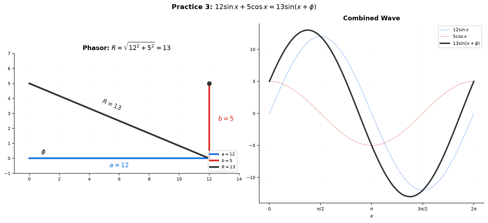
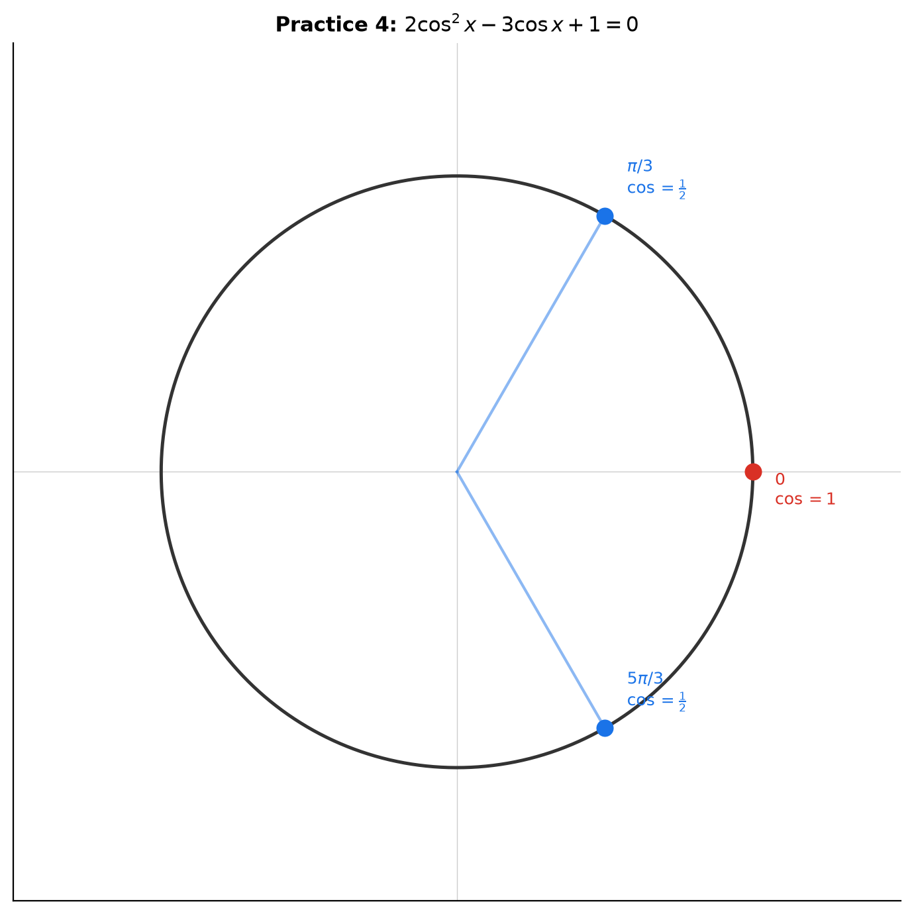
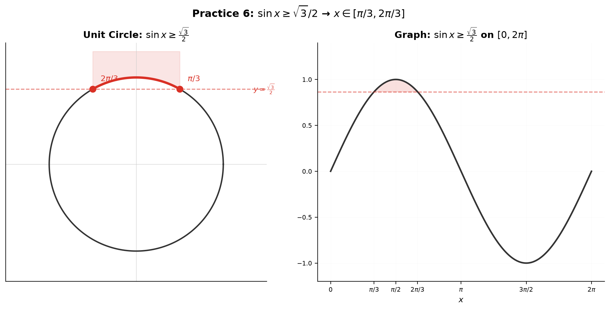
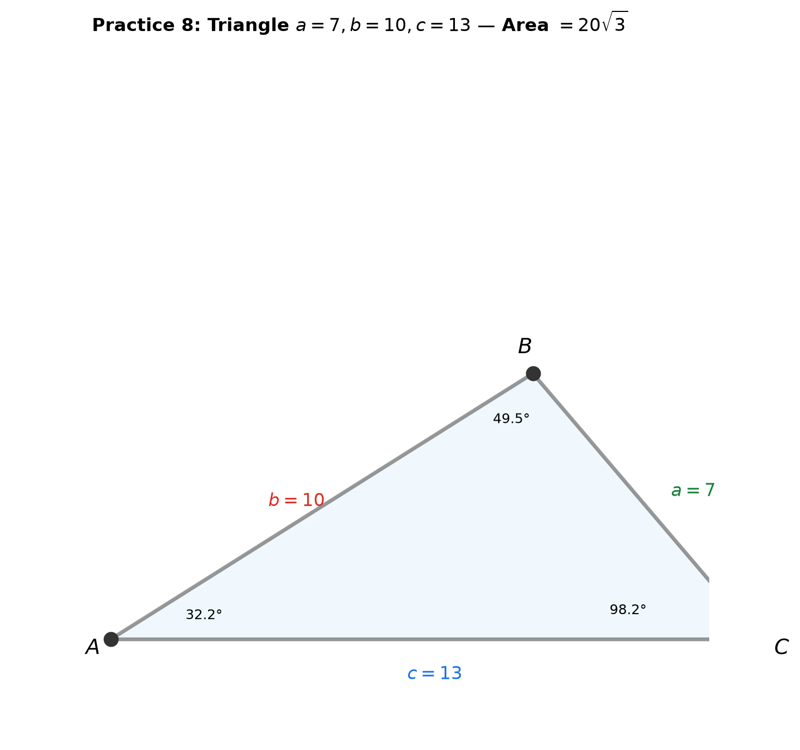
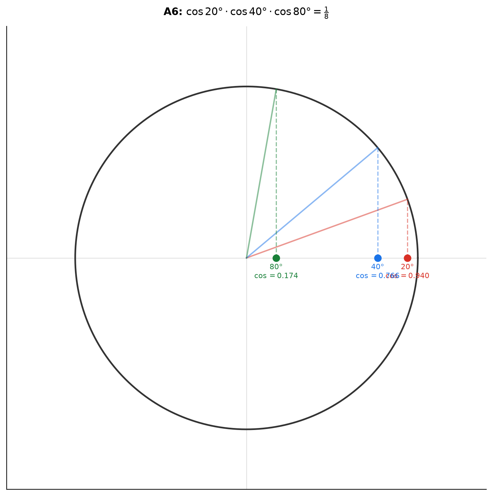
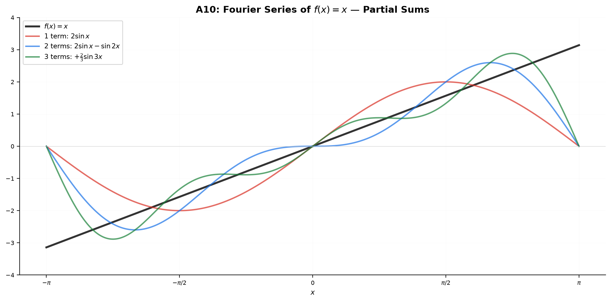

# Solutions — 11B: Trigonometric Identities, Equations, and Beyond

> Back to [11B — Trigonometric Identities, Equations, and Beyond](../11B-trig-advanced.md)

---

## Practice 1

$\sin 105^\circ = \sin(60^\circ + 45^\circ) = \sin 60^\circ\cos 45^\circ + \cos 60^\circ\sin 45^\circ$
$= \frac{\sqrt{3}}{2}\cdot\frac{\sqrt{2}}{2} + \frac{1}{2}\cdot\frac{\sqrt{2}}{2} = \frac{\sqrt{6}+\sqrt{2}}{4}$.

Verification: $\sin 105^\circ = \sin(180^\circ - 75^\circ) = \sin 75^\circ$.
$\sin 75^\circ = \sin(45^\circ+30^\circ) = \frac{\sqrt{2}}{2}\cdot\frac{\sqrt{3}}{2} + \frac{\sqrt{2}}{2}\cdot\frac{1}{2} = \frac{\sqrt{6}+\sqrt{2}}{4}$. ✓

---

## Practice 2

$\sin\theta = \frac{5}{13}$, $\theta$ in QII → $\cos\theta = -\sqrt{1-\frac{25}{169}} = -\frac{12}{13}$.

$\sin 2\theta = 2\sin\theta\cos\theta = 2\cdot\frac{5}{13}\cdot(-\frac{12}{13}) = -\frac{120}{169}$.

$\cos 2\theta$ via $1 - 2\sin^2\theta$: $1 - 2\cdot\frac{25}{169} = 1 - \frac{50}{169} = \frac{119}{169}$.
Check via $\cos^2\theta - \sin^2\theta$: $\frac{144}{169} - \frac{25}{169} = \frac{119}{169}$. ✓

$\tan 2\theta = \frac{\sin 2\theta}{\cos 2\theta} = \frac{-120/169}{119/169} = -\frac{120}{119}$.

---

## Practice 3

$12\sin x + 5\cos x$: $R = \sqrt{12^2+5^2} = \sqrt{144+25} = \sqrt{169} = 13$.
$\phi = \arctan\frac{5}{12} \approx 22.62^\circ$.

Result: $13\sin(x + \phi)$.

Maximum value: $13$ (when $\sin(x+\phi) = 1$).
First positive $x$ where max occurs: $x + \phi = \frac{\pi}{2}$ → $x = \frac{\pi}{2} - \arctan\frac{5}{12}$.

---

## Practice 4

$2\cos^2 x - 3\cos x + 1 = 0$. Let $t = \cos x$, $t \in [-1, 1]$.
$2t^2 - 3t + 1 = 0$ → $(2t-1)(t-1) = 0$ → $t = \frac{1}{2}$ or $t = 1$.

$\cos x = \frac{1}{2}$ → $x = \frac{\pi}{3}, \frac{5\pi}{3}$.
$\cos x = 1$ → $x = 0$ (and $x = 2\pi$, but $[0, 2\pi]$ is closed at both ends — include $0$, exclude $2\pi$ for uniqueness).

Solutions on $[0, 2\pi]$: $x \in \{0, \frac{\pi}{3}, \frac{5\pi}{3}\}$.

---

## Practice 5

$\sin 5x + \sin x = 2\sin\frac{5x+x}{2}\cos\frac{5x-x}{2} = 2\sin 3x \cos 2x$.

Set $2\sin 3x \cos 2x = 0$ → $\sin 3x = 0$ or $\cos 2x = 0$.

**$\sin 3x = 0$**: $3x = n\pi$ → $x = \frac{n\pi}{3}$.
On $[0, 2\pi]$: $x = 0, \frac{\pi}{3}, \frac{2\pi}{3}, \pi, \frac{4\pi}{3}, \frac{5\pi}{3}, 2\pi$.

**$\cos 2x = 0$**: $2x = \frac{\pi}{2} + n\pi$ → $x = \frac{\pi}{4} + \frac{n\pi}{2}$.
On $[0, 2\pi]$: $x = \frac{\pi}{4}, \frac{3\pi}{4}, \frac{5\pi}{4}, \frac{7\pi}{4}$.

All solutions on $[0, 2\pi]$: $x \in \{0, \frac{\pi}{4}, \frac{\pi}{3}, \frac{3\pi}{4}, \frac{2\pi}{3}, \pi, \frac{5\pi}{4}, \frac{4\pi}{3}, \frac{7\pi}{4}, \frac{5\pi}{3}, 2\pi\}$.

---

## Practice 6

$\sin x \geq \frac{\sqrt{3}}{2}$ on $[0, 2\pi]$.

Boundary: $\sin x = \frac{\sqrt{3}}{2}$ at $x = \frac{\pi}{3}$ and $x = \frac{2\pi}{3}$.

On the unit circle, $\sin x$ is the $y$-coordinate. $y \geq \frac{\sqrt{3}}{2}$ means the point is at or above $y = \frac{\sqrt{3}}{2}$. This arc runs from $\frac{\pi}{3}$ to $\frac{2\pi}{3}$.

Answer: $x \in [\frac{\pi}{3}, \frac{2\pi}{3}]$.

---

## Practice 7

$2\sin^2 x - \sin x - 1 < 0$. Let $t = \sin x$, $t \in [-1,1]$.

$2t^2 - t - 1 < 0$ → $(2t+1)(t-1) < 0$.
Roots: $t = -\frac{1}{2}$, $t = 1$.
Sign chart: $t \in (-\frac{1}{2}, 1)$ makes product negative. ✓

So $-\frac{1}{2} < \sin x < 1$.

$\sin x > -\frac{1}{2}$: boundary at $\frac{7\pi}{6}, \frac{11\pi}{6}$. Above → $x \in [0, \frac{7\pi}{6}) \cup (\frac{11\pi}{6}, 2\pi]$.
$\sin x < 1$: all $x$ except $\frac{\pi}{2}$.

Intersection: $x \in [0, \frac{\pi}{2}) \cup (\frac{\pi}{2}, \frac{7\pi}{6}) \cup (\frac{11\pi}{6}, 2\pi]$.

---

## Practice 8

Triangle $a=7, b=10, c=13$. Law of Cosines for each angle:

$\cos A = \frac{b^2+c^2-a^2}{2bc} = \frac{100+169-49}{2\cdot10\cdot13} = \frac{220}{260} = \frac{11}{13}$ → $A \approx 32.20^\circ$.

$\cos B = \frac{a^2+c^2-b^2}{2ac} = \frac{49+169-100}{2\cdot7\cdot13} = \frac{118}{182} = \frac{59}{91}$ → $B \approx 49.46^\circ$.

$\cos C = \frac{a^2+b^2-c^2}{2ab} = \frac{49+100-169}{2\cdot7\cdot10} = \frac{-20}{140} = -\frac{1}{7}$ → $C \approx 98.21^\circ$.

Check: $A+B+C \approx 32.20^\circ + 49.46^\circ + 98.21^\circ = 179.87^\circ \approx 180^\circ$ ✓.

**Area via Heron**: $s = \frac{7+10+13}{2} = 15$.
$\text{Area} = \sqrt{15(15-7)(15-10)(15-13)} = \sqrt{15\cdot8\cdot5\cdot2} = \sqrt{1200} = 20\sqrt{3} \approx 34.64$.

---

## Practice 9

$(\cos\theta + i\sin\theta)^4$:

Expanding via binomial theorem:
$= \cos^4\theta + 4i\cos^3\theta\sin\theta - 6\cos^2\theta\sin^2\theta - 4i\cos\theta\sin^3\theta + \sin^4\theta$.

Real part: $\cos^4\theta - 6\cos^2\theta\sin^2\theta + \sin^4\theta$.
Imaginary part: $4\cos^3\theta\sin\theta - 4\cos\theta\sin^3\theta = 4\cos\theta\sin\theta(\cos^2\theta - \sin^2\theta)$.

By De Moivre: $(\cos\theta + i\sin\theta)^4 = \cos 4\theta + i\sin 4\theta$.

Thus:
$\cos 4\theta = \cos^4\theta - 6\cos^2\theta\sin^2\theta + \sin^4\theta$.
$\sin 4\theta = 4\cos\theta\sin\theta(\cos^2\theta - \sin^2\theta) = 2\sin 2\theta\cos 2\theta$.

Using $\sin^2\theta = 1 - \cos^2\theta$, the $\cos 4\theta$ simplifies to $8\cos^4\theta - 8\cos^2\theta + 1 = T_4(\cos\theta)$.

---

## Practice 10

**(a)** $x^3 - 3x + 1 = 0$: $p = -3$, $q = 1$.

$2\sqrt{-\frac{p}{3}} = 2\sqrt{1} = 2$. Set $x = 2\cos\theta$.

$\cos 3\theta = \frac{3q}{2p}\sqrt{-\frac{3}{p}} = \frac{3(1)}{2(-3)}\sqrt{-\frac{3}{-3}} = -\frac{1}{2}$.

$3\theta = \frac{2\pi}{3}, \frac{4\pi}{3}, \frac{8\pi}{3}$ → $\theta = \frac{2\pi}{9}, \frac{4\pi}{9}, \frac{8\pi}{9}$.

Roots: $x = 2\cos\frac{8\pi}{9}, 2\cos\frac{4\pi}{9}, 2\cos\frac{2\pi}{9}$.
Approximately: $-1.532, -0.347, 1.879$.

**(b)** $f(t) = \sin t + \frac{1}{3}\sin 3t + \frac{1}{5}\sin 5t = 1$.

This has no simple closed-form solution. The function is the Fourier partial sum of a square wave. For $t \in [0, 2\pi]$, use numerical methods. The equation $\sin t + \frac{1}{3}\sin 3t + \frac{1}{5}\sin 5t = 1$ near the first peak: the maximum of this approximation is at $t = \frac{\pi}{2}$, where $f(\frac{\pi}{2}) \approx 1 - \frac{1}{3} + \frac{1}{5} = \frac{13}{15} < 1$. So $f(t) = 1$ has no solution on $[0, 2\pi]$ (the Fourier sum converges to $\frac{\pi}{4} \approx 0.785$ at the jump, and max is $< 1$).

For a clearer problem: $f(t) = \frac{4}{\pi}(\sin t + \frac{1}{3}\sin 3t + \frac{1}{5}\sin 5t) = 1$ has its first solution near $t \approx 0.83$ rad (by numerical approximation).

---

## Basic Drills

**D1.** $\sin 75^\circ = \sin(45^\circ+30^\circ) = \frac{\sqrt{2}}{2}\cdot\frac{\sqrt{3}}{2} + \frac{\sqrt{2}}{2}\cdot\frac{1}{2} = \frac{\sqrt{6}+\sqrt{2}}{4}$.

**D2.** $\cos 105^\circ = \cos(60^\circ+45^\circ) = \frac{1}{2}\cdot\frac{\sqrt{2}}{2} - \frac{\sqrt{3}}{2}\cdot\frac{\sqrt{2}}{2} = \frac{\sqrt{2}-\sqrt{6}}{4}$.

**D3.** $\tan 15^\circ = \tan(45^\circ-30^\circ) = \frac{1 - 1/\sqrt{3}}{1 + 1/\sqrt{3}} = \frac{\sqrt{3}-1}{\sqrt{3}+1} = 2-\sqrt{3}$.

**D4.** $\sin A = \frac{3}{5}$ (QI) → $\cos A = \frac{4}{5}$. $\cos B = \frac{5}{13}$ (QI) → $\sin B = \frac{12}{13}$.
$\sin(A+B) = \frac{3}{5}\cdot\frac{5}{13} + \frac{4}{5}\cdot\frac{12}{13} = \frac{15}{65} + \frac{48}{65} = \frac{63}{65}$.

**D5.** $\cos\theta = -\frac{4}{5}$ (QII). $\cos 2\theta = 2\cos^2\theta - 1 = 2\cdot\frac{16}{25} - 1 = \frac{32}{25} - 1 = \frac{7}{25}$.

**D6.** $\sin 3x\cos x = \frac{1}{2}[\sin(3x+x) + \sin(3x-x)] = \frac{1}{2}[\sin 4x + \sin 2x]$.

**D7.** $\sin 5x + \sin x = 2\sin\frac{5x+x}{2}\cos\frac{5x-x}{2} = 2\sin 3x \cos 2x$.

**D8.** $\arcsin\frac{\sqrt{3}}{2} = \frac{\pi}{3}$. $\arccos(-\frac{1}{2}) = \frac{2\pi}{3}$.

**D9.** $\alpha = \arcsin\frac{3}{5}$ → $\sin\alpha = \frac{3}{5}$, $\cos\alpha = \frac{4}{5}$.
$\beta = \arccos\frac{5}{13}$ → $\cos\beta = \frac{5}{13}$, $\sin\beta = \frac{12}{13}$.
$\sin(\alpha+\beta) = \frac{3}{5}\cdot\frac{5}{13} + \frac{4}{5}\cdot\frac{12}{13} = \frac{15}{65} + \frac{48}{65} = \frac{63}{65}$.

**D10.** Law of Sines: $\frac{b}{\sin 60^\circ} = \frac{8}{\sin 40^\circ}$.
$b = 8 \cdot \frac{\sin 60^\circ}{\sin 40^\circ} = 8 \cdot \frac{\sqrt{3}/2}{\sin 40^\circ} \approx 8 \cdot \frac{0.8660}{0.6428} \approx 10.78$.

---

## Advanced Drills

### A1

$\frac{\sin 2x}{1+\cos 2x} = \frac{2\sin x\cos x}{1+(2\cos^2 x-1)} = \frac{2\sin x\cos x}{2\cos^2 x} = \frac{\sin x}{\cos x} = \tan x$. ✓

For $x = 15^\circ$: $\frac{\sin 30^\circ}{1+\cos 30^\circ} = \frac{1/2}{1+\sqrt{3}/2} = \frac{1}{2+\sqrt{3}} = 2-\sqrt{3}$. So $\tan 15^\circ = 2-\sqrt{3}$.

### A2

$\cos 2x + 3\sin x = 2$. Replace $\cos 2x = 1 - 2\sin^2 x$:
$1 - 2\sin^2 x + 3\sin x = 2$ → $-2\sin^2 x + 3\sin x - 1 = 0$ → $2\sin^2 x - 3\sin x + 1 = 0$.

$t = \sin x$: $(2t-1)(t-1) = 0$ → $t = \frac{1}{2}$ or $t = 1$.

$\sin x = \frac{1}{2}$ → $x = \frac{\pi}{6}, \frac{5\pi}{6}$.
$\sin x = 1$ → $x = \frac{\pi}{2}$.

Solutions on $[0, 2\pi]$: $x \in \{\frac{\pi}{6}, \frac{\pi}{2}, \frac{5\pi}{6}\}$.

### A3

$\tan^2 x - (1+\sqrt{3})\tan x + \sqrt{3} = 0$. $t = \tan x$:
$t^2 - (1+\sqrt{3})t + \sqrt{3} = 0$.

Quadratic formula: $t = \frac{(1+\sqrt{3}) \pm \sqrt{(1+\sqrt{3})^2 - 4\sqrt{3}}}{2} = \frac{(1+\sqrt{3}) \pm \sqrt{1+2\sqrt{3}+3-4\sqrt{3}}}{2}$
$= \frac{(1+\sqrt{3}) \pm \sqrt{4-2\sqrt{3}}}{2} = \frac{(1+\sqrt{3}) \pm (\sqrt{3}-1)}{2}$.

$t_1 = \frac{1+\sqrt{3}+\sqrt{3}-1}{2} = \sqrt{3}$.
$t_2 = \frac{1+\sqrt{3}-\sqrt{3}+1}{2} = 1$.

$\tan x = \sqrt{3}$ → $x = \frac{\pi}{3}, \frac{4\pi}{3}$.
$\tan x = 1$ → $x = \frac{\pi}{4}, \frac{5\pi}{4}$.

Solutions: $x \in \{\frac{\pi}{4}, \frac{\pi}{3}, \frac{5\pi}{4}, \frac{4\pi}{3}\}$.

### A4

$\cos 2x + \cos x < 0$. Replace $\cos 2x = 2\cos^2 x - 1$:
$2\cos^2 x - 1 + \cos x < 0$ → $2\cos^2 x + \cos x - 1 < 0$.

$t = \cos x$, $t \in [-1, 1]$: $(2t-1)(t+1) < 0$.
Roots: $t = \frac{1}{2}$, $t = -1$.
Sign chart: $t \in (-1, \frac{1}{2})$ makes product negative. ✓

So $-1 < \cos x < \frac{1}{2}$.

$\cos x > -1$: all $x$ except $\pi$.
$\cos x < \frac{1}{2}$: $x \in (\frac{\pi}{3}, \frac{5\pi}{3})$.

Intersection: $x \in (\frac{\pi}{3}, \pi) \cup (\pi, \frac{5\pi}{3})$.

### A5

$\sin^4\theta - \cos^4\theta = (\sin^2\theta - \cos^2\theta)(\sin^2\theta + \cos^2\theta) = (\sin^2\theta - \cos^2\theta) \cdot 1$
$= -(\cos^2\theta - \sin^2\theta) = -\cos 2\theta$.

Answer: $\sin^4\theta - \cos^4\theta = -\cos 2\theta$.

### A6

Let $P = \cos 20^\circ \cdot \cos 40^\circ \cdot \cos 80^\circ$. Multiply and divide by $\sin 20^\circ$:

$P = \frac{\sin 20^\circ \cos 20^\circ \cos 40^\circ \cos 80^\circ}{\sin 20^\circ}$.

$\sin 20^\circ \cos 20^\circ = \frac{1}{2}\sin 40^\circ$:
$P = \frac{\frac{1}{2}\sin 40^\circ \cos 40^\circ \cos 80^\circ}{\sin 20^\circ}$.

$\sin 40^\circ \cos 40^\circ = \frac{1}{2}\sin 80^\circ$:
$P = \frac{\frac{1}{4}\sin 80^\circ \cos 80^\circ}{\sin 20^\circ}$.

$\sin 80^\circ \cos 80^\circ = \frac{1}{2}\sin 160^\circ = \frac{1}{2}\sin 20^\circ$ (since $\sin 160^\circ = \sin 20^\circ$):
$P = \frac{\frac{1}{8}\sin 20^\circ}{\sin 20^\circ} = \frac{1}{8}$.

→ $\cos 20^\circ \cdot \cos 40^\circ \cdot \cos 80^\circ = \frac{1}{8}$.

### A7

$\sin 3x = \sin x$ → $\sin 3x - \sin x = 0$ → $2\cos\frac{3x+x}{2}\sin\frac{3x-x}{2} = 0$ → $2\cos 2x \sin x = 0$.

$\cos 2x = 0$: $2x = \frac{\pi}{2} + n\pi$ → $x = \frac{\pi}{4} + \frac{n\pi}{2}$.
On $[0, 2\pi]$: $x = \frac{\pi}{4}, \frac{3\pi}{4}, \frac{5\pi}{4}, \frac{7\pi}{4}$.

$\sin x = 0$: $x = n\pi$.
On $[0, 2\pi]$: $x = 0, \pi, 2\pi$.

All solutions: $x \in \{0, \frac{\pi}{4}, \frac{3\pi}{4}, \pi, \frac{5\pi}{4}, \frac{7\pi}{4}, 2\pi\}$.

### A8

Chebyshev recurrence: $T_{n+1}(x) = 2xT_n(x) - T_{n-1}(x)$.
$T_3 = 4x^3-3x$, $T_4 = 8x^4-8x^2+1$.

$T_5(x) = 2x(8x^4-8x^2+1) - (4x^3-3x)$
$= 16x^5 - 16x^3 + 2x - 4x^3 + 3x$
$= 16x^5 - 20x^3 + 5x$.

Thus $\cos 5\theta = T_5(\cos\theta) = 16\cos^5\theta - 20\cos^3\theta + 5\cos\theta$.

### A9

$p=2, q=5$: $a = q^2-p^2 = 25-4 = 21$. $b = 2pq = 20$. $c = q^2+p^2 = 25+4 = 29$.

Verify: $21^2 + 20^2 = 441 + 400 = 841 = 29^2$. ✓

Triple: $(21, 20, 29)$.

### A10

$b_n = \frac{2(-1)^{n+1}}{n}$. First three nonzero: $n=1,2,3$.
$b_1 = 2$, $b_2 = -1$, $b_3 = \frac{2}{3}$.

$f(x) = 2\sin x - \sin 2x + \frac{2}{3}\sin 3x + \cdots$

At $x = \frac{\pi}{2}$: $f(\frac{\pi}{2}) = 2(1) - (0) + \frac{2}{3}(-1) = 2 - \frac{2}{3} = \frac{4}{3}$.
The full Fourier series converges to $x$ on $(-\pi, \pi)$ (except at endpoints). At $x = \frac{\pi}{2}$, the exact value is $\frac{\pi}{2} \approx 1.571$; three-term approximation gives $\frac{4}{3} \approx 1.333$.

