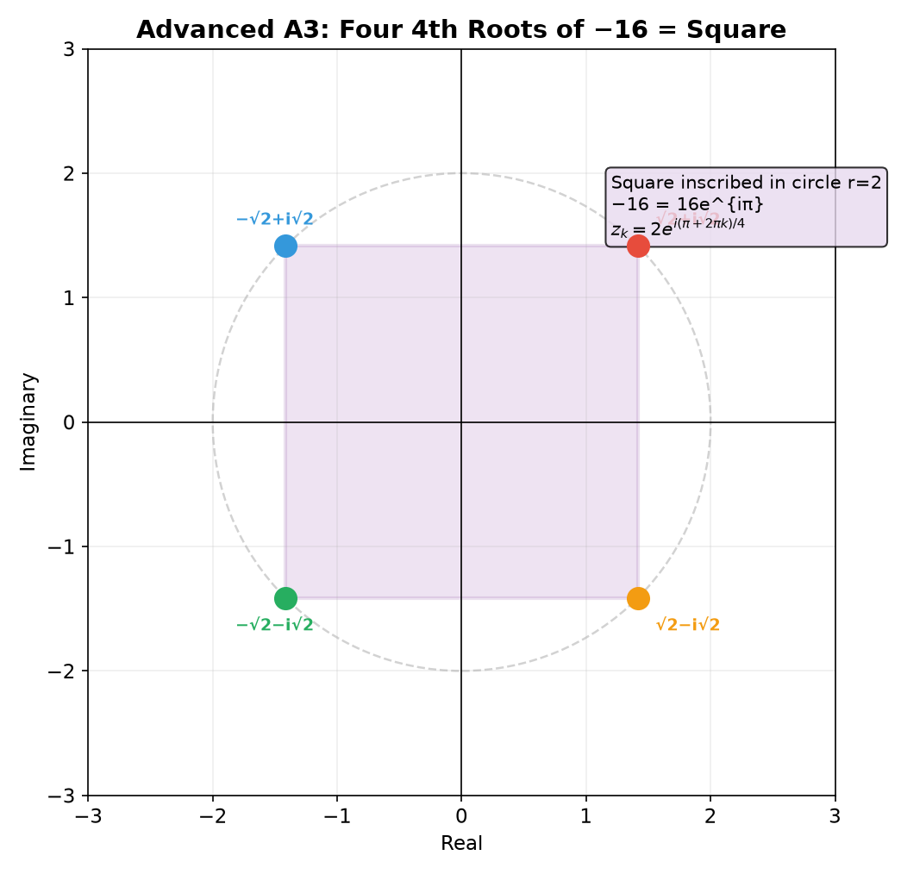
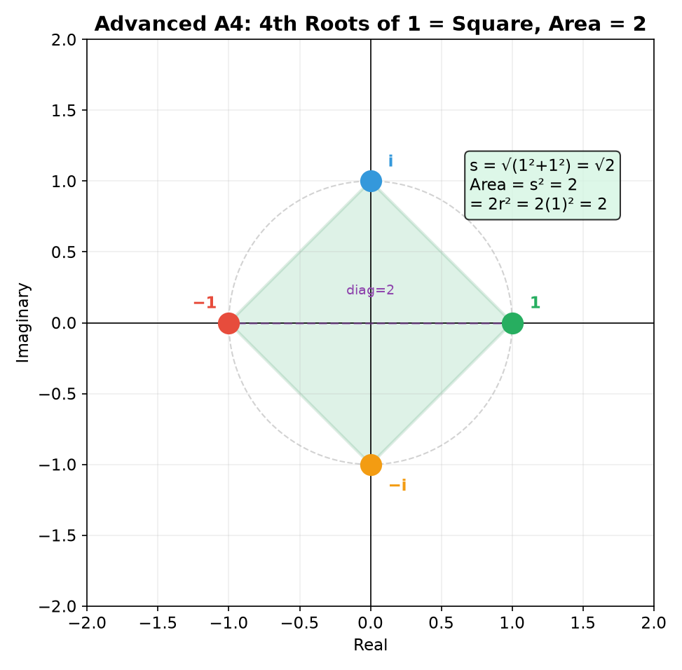
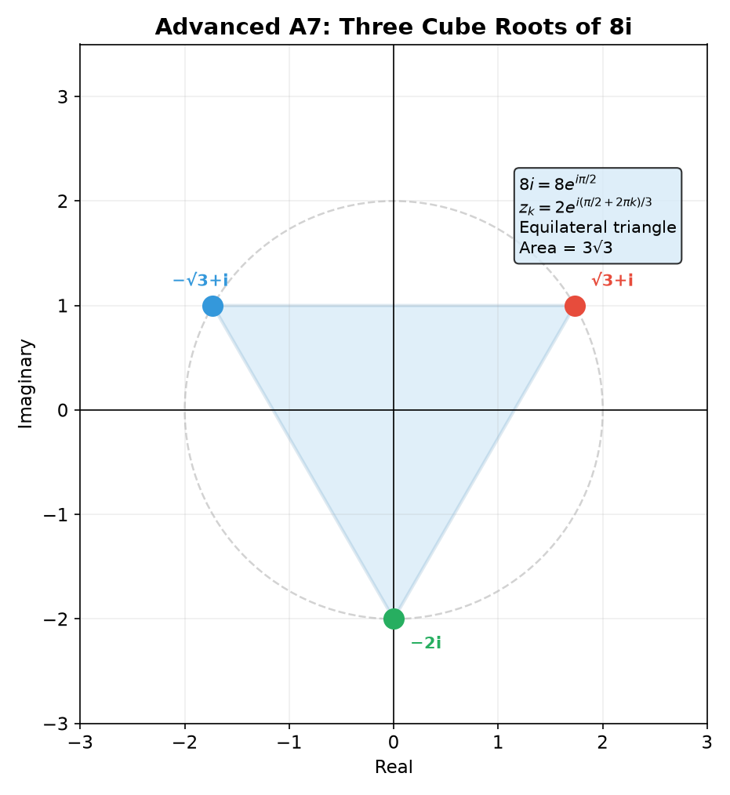
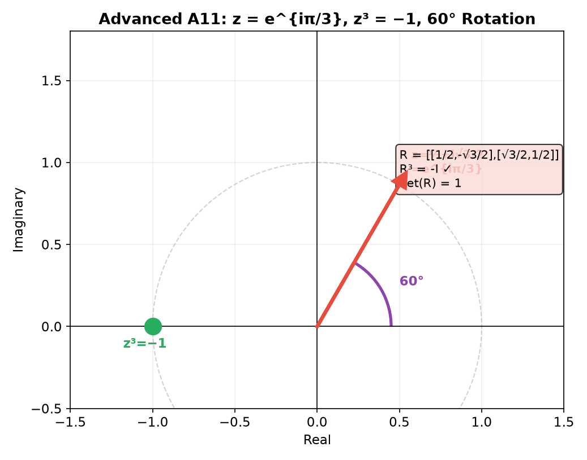
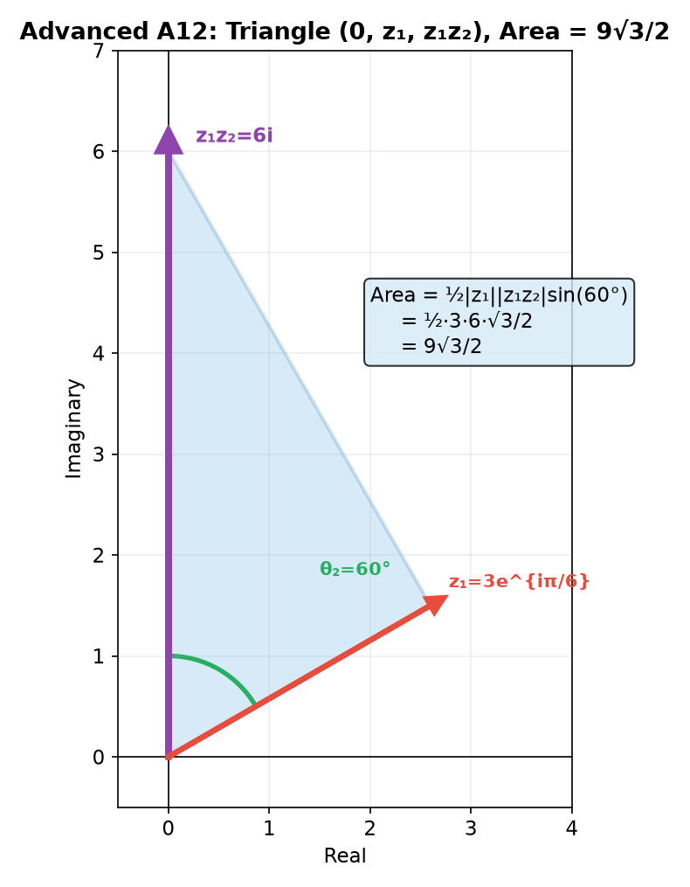
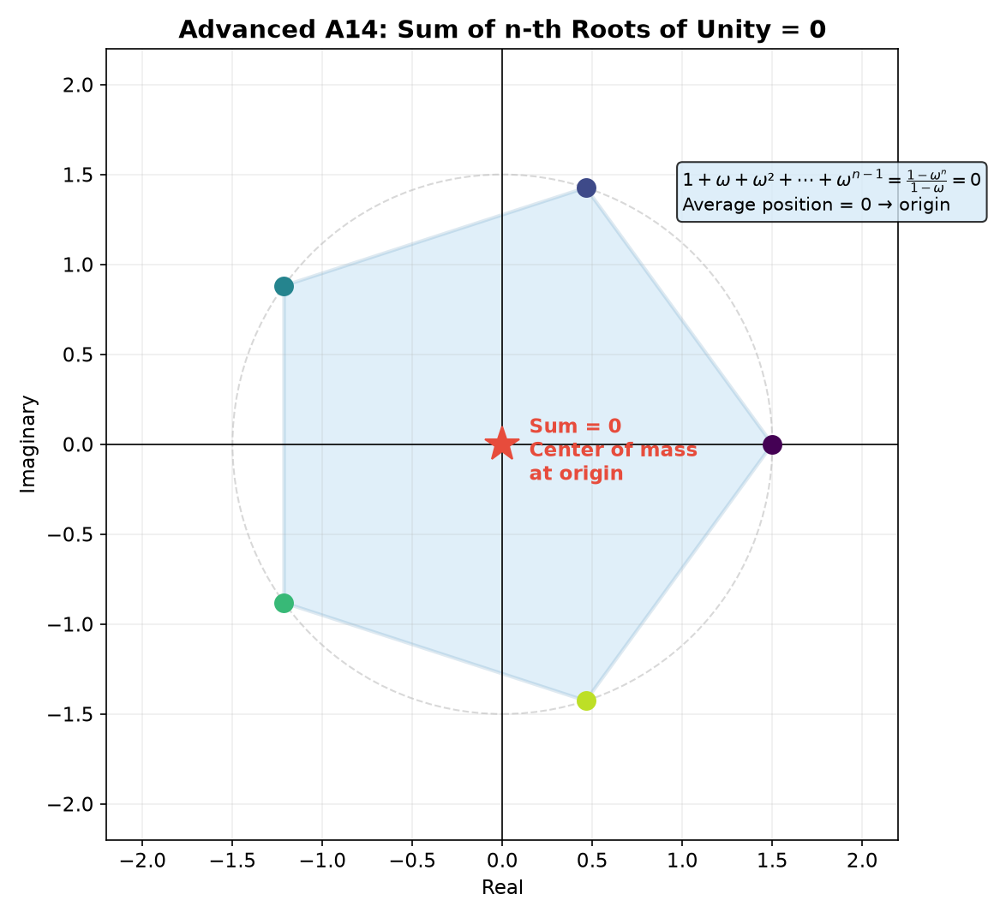
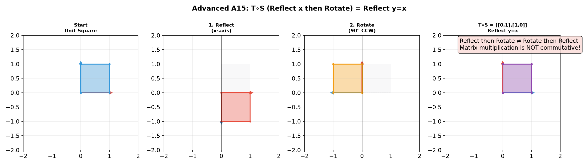
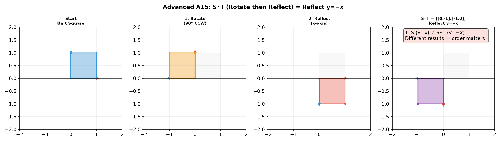

# Solutions — 12A1: Complex Numbers
## Basic Drill

### D1. Simplify $i^{27}$

$27 \div 4 = 6$ remainder $3$. So $i^{27} = i^3 = -i$.

> **Answer**: $-i$

---

### D2. Compute $(2-3i)(1+4i)$

$(2-3i)(1+4i) = 2(1) + 2(4i) + (-3i)(1) + (-3i)(4i) = 2 + 8i - 3i - 12i^2 = 2 + 5i + 12 = 14 + 5i$.

> **Answer**: $14 + 5i$

---

### D3. Conjugate and modulus of $z = 5 - 12i$

$\bar{z} = 5 + 12i$.
$|z| = \sqrt{5^2 + (-12)^2} = \sqrt{25 + 144} = \sqrt{169} = 13$.

> **Answer**: $\bar{z} = 5+12i$, $|z| = 13$

---

### D4. Find $i^{4k+3}$ for any integer $k$

$i^{4k+3} = (i^4)^k \cdot i^3 = 1^k \cdot (-i) = -i$.

> **Answer**: $-i$

---

### D5. Simplify $\frac{1}{i}$

$\frac{1}{i} \cdot \frac{-i}{-i} = \frac{-i}{-i^2} = \frac{-i}{1} = -i$.
Alternatively: $\frac{1}{i} = i^{-1} = i^3 = -i$ (since $i^4 = 1$, $i^{-1} = i^3$).

> **Answer**: $-i$ (or $0 - i$)

---

### D6. Compute $(3+2i) + (5-7i) - (1+4i)$

Reals: $3 + 5 - 1 = 7$.
Imaginary: $2i - 7i - 4i = -9i$.

> **Answer**: $7 - 9i$

---

### D7. Find the modulus of $z = -6 + 8i$

$|z| = \sqrt{(-6)^2 + 8^2} = \sqrt{36 + 64} = \sqrt{100} = 10$.

> **Answer**: $10$

---

### D8. Write $e^{i\pi/2}$ in $a+bi$ form

$e^{i\pi/2} = \cos\frac{\pi}{2} + i\sin\frac{\pi}{2} = 0 + i \cdot 1 = i$.

> **Answer**: $i$ (or $0 + i$)

---

### D9. Find $\bar{z}$ and $|z|$ for $z = -3i$

$\bar{z} = 3i$ (flip sign of imaginary part: $-3i \to 3i$).
$|z| = \sqrt{0^2 + (-3)^2} = 3$.

> **Answer**: $\bar{z} = 3i$, $|z| = 3$

---

### D10. Simplify $i^{15} + i^{16} + i^{17} + i^{18}$

$15 \div 4 = 3$ rem $3$: $i^{15} = -i$.
$16 \div 4 = 4$ rem $0$: $i^{16} = 1$.
$17 \div 4 = 4$ rem $1$: $i^{17} = i$.
$18 \div 4 = 4$ rem $2$: $i^{18} = -1$.

Sum: $(-i) + 1 + i + (-1) = 0$.

The 4-cycle sums to zero over any complete block: $i^k + i^{k+1} + i^{k+2} + i^{k+3} = 0$.

> **Answer**: $0$

---

### D11. ◆ Geometry — $z=2+2i$, its conjugate, $z\bar{z}$, $z+\bar{z}$

$z = 2+2i$, $\bar{z} = 2-2i$.

**Geometric relationship**: $\bar{z}$ is the reflection of $z$ across the real axis. Same $x$-coordinate (2), opposite $y$-coordinate ($+2$ vs $-2$).

$z \cdot \bar{z} = (2+2i)(2-2i) = 4+4 = 8 = |z|^2$. ($|z| = \sqrt{8} = 2\sqrt{2}$).
$z + \bar{z} = (2+2i) + (2-2i) = 4 = 2\cdot\operatorname{Re}(z)$.

> **Answer**: $\bar{z}=2-2i$ (reflection), $z\bar{z}=8$, $z+\bar{z}=4$

---

### D12. ◆ Matrix Connection — Matrix for $z=1+i$, $\det(M)$, $|z|$

$M = \begin{pmatrix} 1 & -1 \\ 1 & 1 \end{pmatrix}$.

$\det(M) = 1\cdot 1 - (-1)\cdot 1 = 1+1 = 2$.

$|z| = \sqrt{1^2+1^2} = \sqrt{2}$.

Relationship: $|z|^2 = \det(M)$. Check: $(\sqrt{2})^2 = 2 = \det(M)$ ✓.

> **Answer**: $M=\begin{pmatrix}1&-1\\1&1\end{pmatrix}$, $\det(M)=2$, $|z|=\sqrt{2}$, $|z|^2=\det(M)$

---

### D13. ◆ Geometry — $z_1=1+i$ multiplied by $z_2=i$

$z_1 \cdot i = (1+i)i = i + i^2 = -1 + i$.

Geometrically: $z_1 = 1+i$ is at $(1,1)$, angle $45^\circ$, modulus $\sqrt{2}$.
Multiplying by $i$ adds $90^\circ$: new angle $135^\circ$, modulus stays $\sqrt{2}$.
New point: $(-1, 1)$. This is exactly a $90^\circ$ CCW rotation of $(1,1)$.

> **Answer**: $z_1 \cdot i = -1+i$; $90^\circ$ CCW rotation

---

### D14. ◆ Matrix Connection — $J=\begin{pmatrix}0&-1\\1&0\end{pmatrix}$, powers

$J^2 = \begin{pmatrix} -1 & 0 \\ 0 & -1 \end{pmatrix} = -I$ ↔ $-1$.
$J^3 = J^2 \cdot J = \begin{pmatrix} 0 & 1 \\ -1 & 0 \end{pmatrix}$ ↔ $-i$.
$J^4 = J^2 \cdot J^2 = I$ ↔ $1$.

These correspond to $i^2=-1$, $i^3=-i$, $i^4=1$. The 4-cycle in matrix form.

> **Answer**: $J^2=-I$ ($-1$), $J^3=\begin{pmatrix}0&1\\-1&0\end{pmatrix}$ ($-i$), $J^4=I$ ($1$)

---

### D15. ◆ Geometry — $1/z$ for $z=2i$

$z = 2i$ has $|z| = 2 > 1$ (outside the unit circle).

$1/z = 1/(2i) = -i/2 = 0 - 0.5i$.

$|1/z| = 0.5 < 1$ (inside the unit circle).

Product: $|z| \cdot |1/z| = 2 \cdot 0.5 = 1$. Always true: $|z| \cdot |1/z| = 1$.

> **Answer**: $1/z = -0.5i$, $|z|=2$ (outside), $|1/z|=0.5$ (inside), product = 1

---

## Advanced Drill

### A1. Solve $(1+i)z + 3 = 2i - z$

$(1+i)z + z = 2i - 3$
$(1+i+1)z = 2i - 3$
$(2+i)z = -3 + 2i$

$z = \frac{-3+2i}{2+i} \cdot \frac{2-i}{2-i} = \frac{(-3+2i)(2-i)}{4+1} = \frac{-6 + 3i + 4i - 2i^2}{5} = \frac{-6 + 7i + 2}{5} = \frac{-4 + 7i}{5} = -\frac{4}{5} + \frac{7}{5}i$.

> **Answer**: $z = -\frac{4}{5} + \frac{7}{5}i$

---

### A2. Compute $(1+i\sqrt{3})^9$ using De Moivre

$r = \sqrt{1^2 + (\sqrt{3})^2} = 2$. $\theta = \arctan(\sqrt{3}/1) = \pi/3$.
$1+i\sqrt{3} = 2e^{i\pi/3}$.

$(1+i\sqrt{3})^9 = 2^9 \cdot e^{i\cdot 9\pi/3} = 512 \cdot e^{i\cdot 3\pi} = 512(\cos 3\pi + i\sin 3\pi) = 512(-1 + 0) = -512$.

> **Answer**: $-512$

---

### A3. All four 4th roots of $-16$

$-16 = 16e^{i\pi}$. Fourth roots: $z_k = 16^{1/4} \cdot e^{i(\pi + 2\pi k)/4} = 2 \cdot e^{i(\pi + 2\pi k)/4}$ for $k = 0,1,2,3$.

- $k=0$: $2e^{i\pi/4} = 2(\frac{\sqrt{2}}{2} + i\frac{\sqrt{2}}{2}) = \sqrt{2} + i\sqrt{2}$
- $k=1$: $2e^{i\cdot 3\pi/4} = 2(-\frac{\sqrt{2}}{2} + i\frac{\sqrt{2}}{2}) = -\sqrt{2} + i\sqrt{2}$
- $k=2$: $2e^{i\cdot 5\pi/4} = 2(-\frac{\sqrt{2}}{2} - i\frac{\sqrt{2}}{2}) = -\sqrt{2} - i\sqrt{2}$
- $k=3$: $2e^{i\cdot 7\pi/4} = 2(\frac{\sqrt{2}}{2} - i\frac{\sqrt{2}}{2}) = \sqrt{2} - i\sqrt{2}$

> **Answer**: $\sqrt{2}+i\sqrt{2},\; -\sqrt{2}+i\sqrt{2},\; -\sqrt{2}-i\sqrt{2},\; \sqrt{2}-i\sqrt{2}$

---

### A4. Area of the square formed by 4th roots of 1

The 4th roots of 1 are $1, i, -1, -i$. These are vertices of a square with diagonal length 2.

Side length: $s = \sqrt{2}$ (Pythagoras: distance from $(1,0)$ to $(0,1)$ is $\sqrt{1^2+1^2} = \sqrt{2}$).
Area: $s^2 = 2$.

Alternatively: The square is inscribed in the unit circle. Area = $2r^2 = 2 \cdot 1 = 2$.

> **Answer**: $2$

---

### A5. Write $z = \sqrt{3} - i$ in polar form, then compute $z^6$

$r = \sqrt{(\sqrt{3})^2 + (-1)^2} = \sqrt{3+1} = 2$.
$\cos\theta = \frac{\sqrt{3}}{2}$, $\sin\theta = -\frac{1}{2}$, so $\theta = -\frac{\pi}{6}$ (or $\frac{11\pi}{6}$).
$z = 2e^{-i\pi/6}$.

$z^6 = 2^6 \cdot e^{-i\cdot 6\pi/6} = 64 \cdot e^{-i\pi} = 64(\cos(-\pi) + i\sin(-\pi)) = 64(-1 + 0) = -64$.

> **Answer**: $z = 2e^{-i\pi/6}$, $z^6 = -64$

---

### A6. Solve $z^2 + 2z + 5 = 0$ over complex numbers

Quadratic formula: $z = \frac{-2 \pm \sqrt{4 - 20}}{2} = \frac{-2 \pm \sqrt{-16}}{2} = \frac{-2 \pm 4i}{2} = -1 \pm 2i$.

> **Answer**: $z = -1 + 2i$ or $z = -1 - 2i$

---

### A7. Find all complex $z$ such that $z^3 = 8i$

$8i = 8e^{i\pi/2}$ (modulus 8, angle $\pi/2$).

Cube roots: $z_k = 8^{1/3} \cdot e^{i(\pi/2 + 2\pi k)/3} = 2 \cdot e^{i(\pi/2 + 2\pi k)/3}$ for $k = 0,1,2$.

- $k=0$: $2e^{i\pi/6} = 2(\frac{\sqrt{3}}{2} + i\frac{1}{2}) = \sqrt{3} + i$
- $k=1$: $2e^{i\cdot 5\pi/6} = 2(-\frac{\sqrt{3}}{2} + i\frac{1}{2}) = -\sqrt{3} + i$
- $k=2$: $2e^{i\cdot 3\pi/2} = 2(0 - i) = -2i$

Check: $(\sqrt{3}+i)^3$ — using De Moivre: $(2e^{i\pi/6})^3 = 8e^{i\pi/2} = 8i$ ✓.

> **Answer**: $\sqrt{3}+i,\; -\sqrt{3}+i,\; -2i$

---

### A8. If $z = 2e^{i\pi/6}$, find $z^4$ and $1/z$ in $a+bi$ form

$z^4 = 2^4 \cdot e^{i\cdot 4\pi/6} = 16 \cdot e^{i\cdot 2\pi/3} = 16(\cos\frac{2\pi}{3} + i\sin\frac{2\pi}{3}) = 16(-\frac{1}{2} + i\frac{\sqrt{3}}{2}) = -8 + 8i\sqrt{3}$.

$\frac{1}{z} = z^{-1} = 2^{-1} \cdot e^{-i\pi/6} = \frac{1}{2}(\cos\frac{\pi}{6} - i\sin\frac{\pi}{6}) = \frac{1}{2}(\frac{\sqrt{3}}{2} - i\frac{1}{2}) = \frac{\sqrt{3}}{4} - \frac{1}{4}i$.

> **Answer**: $z^4 = -8 + 8i\sqrt{3}$, $\frac{1}{z} = \frac{\sqrt{3}}{4} - \frac{1}{4}i$

---

### A9. Prove $|z_1 z_2| = |z_1| \cdot |z_2|$

Let $z_1 = a+bi$, $z_2 = c+di$.

$|z_1 z_2|^2 = (z_1 z_2)(\overline{z_1 z_2}) = (z_1 z_2)(\bar{z_1}\bar{z_2}) = (z_1\bar{z_1})(z_2\bar{z_2}) = |z_1|^2 |z_2|^2$.

Taking square roots: $|z_1 z_2| = |z_1| \cdot |z_2|$.

Geometric interpretation: multiplying complex numbers multiplies their moduli.

> **Answer**: Proof by conjugate property: $|z_1z_2|^2 = z_1z_2\overline{z_1z_2} = |z_1|^2 |z_2|^2$

---

### A10. Area of triangle formed by cube roots of $8i$

From A7, the roots are $\sqrt{3}+i$, $-\sqrt{3}+i$, $-2i$.

These lie on a circle of radius 2, equally spaced by $120^\circ$. Check: all have $|z| = 2$ ✓.

Area of equilateral triangle inscribed in radius $r=2$:
$\text{Area} = \frac{3\sqrt{3}}{4}r^2 = \frac{3\sqrt{3}}{4} \cdot 4 = 3\sqrt{3}$.

> **Answer**: $3\sqrt{3}$

---

### A11. ◆ $z = \frac{1}{2} + \frac{\sqrt{3}}{2}i$, check $z^3=-1$, rotation angle, matrix $R$ with $R^3=-I$

$z = \cos 60^\circ + i\sin 60^\circ = e^{i\pi/3}$. $z^3 = e^{i\pi} = -1$ ✓.

Rotation angle: $60^\circ$ CCW. Matrix: $R = \begin{pmatrix} 1/2 & -\sqrt{3}/2 \\ \sqrt{3}/2 & 1/2 \end{pmatrix}$.

$R^2 = \begin{pmatrix} -1/2 & -\sqrt{3}/2 \\ \sqrt{3}/2 & -1/2 \end{pmatrix}$ (rotate $120^\circ$).
$R^3 = R^2 \cdot R = \begin{pmatrix} -1 & 0 \\ 0 & -1 \end{pmatrix} = -I$ ✓.

$\det(R) = (1/2)^2 + (\sqrt{3}/2)^2 = 1/4 + 3/4 = 1$.

> **Answer**: $R = \begin{pmatrix}1/2&-\sqrt{3}/2\\\sqrt{3}/2&1/2\end{pmatrix}$, $\det(R)=1$, $R^3=-I$

---

### A12. ◆ $z_1=3e^{i\pi/6}$, $z_2=2e^{i\pi/3}$, product and triangle area

$z_1 z_2 = 6e^{i(\pi/6+\pi/3)} = 6e^{i\pi/2} = 6i = 0+6i$.

Triangle vertices: $0$, $z_1$, $z_1 z_2$. In coordinates: $(0,0)$, $(3\cos 30^\circ, 3\sin 30^\circ) = (3\sqrt{3}/2, 1.5)$, $(0,6)$.

The angle at 0 between $z_1$ and $z_1z_2$ is $\arg(z_2) = \pi/3 = 60^\circ$.

Area = $\frac{1}{2}|z_1||z_1z_2|\sin 60^\circ = \frac{1}{2} \cdot 3 \cdot 6 \cdot \frac{\sqrt{3}}{2} = \frac{9\sqrt{3}}{2}$.

> **Answer**: $z_1z_2 = 6i$, Area = $\frac{9\sqrt{3}}{2}$

---

### A13. ◆ Unit circle closed under multiplication — rotation closure

If $|z_1|=|z_2|=1$, then $|z_1z_2| = |z_1|\cdot|z_2| = 1\cdot 1 = 1$ (by property from A9).

**Matrix version**: Pure rotation matrices have $\det(R) = 1$ and $R^T R = I$. If $R_1, R_2$ are pure rotations, then $\det(R_1 R_2) = \det(R_1)\det(R_2) = 1\cdot 1 = 1$ and $(R_1 R_2)^T(R_1 R_2) = R_2^T R_1^T R_1 R_2 = R_2^T I R_2 = I$. So $R_1 R_2$ is also a pure rotation — closed under multiplication.

> **Answer**: $|z_1z_2|=|z_1||z_2|=1$; product of rotation matrices is a rotation matrix

---

### A14. ◆ Sum of $n$th roots of unity = 0

Roots: $1, \omega, \omega^2, \dots, \omega^{n-1}$ with $\omega = e^{2\pi i/n}$.

Sum = $1 + \omega + \omega^2 + \cdots + \omega^{n-1}$. This is a geometric series with ratio $\omega$:
$S = \frac{1-\omega^n}{1-\omega} = \frac{1-1}{1-\omega} = 0$ (since $\omega^n = e^{2\pi i} = 1$ and $\omega \neq 1$ for $n \geq 2$).

**Center of mass**: The average position is $\frac{1}{n}\sum \omega^k = 0$. The center of mass of the $n$ equally spaced points is exactly the origin — as expected for a regular polygon centered at the origin.

> **Answer**: Sum $= \frac{1-\omega^n}{1-\omega} = 0$; center of mass at origin

---

### A15. ◆ $T(z)=iz$ (rotate $90^\circ$) and $S(z)=\bar{z}$ (reflect) as matrices, compositions

$T(z) = iz = i(x+iy) = -y + ix$. So $T\begin{pmatrix}x\\y\end{pmatrix} = \begin{pmatrix}-y\\x\end{pmatrix} = \begin{pmatrix}0&-1\\1&0\end{pmatrix}\begin{pmatrix}x\\y\end{pmatrix}$.
Matrix $T = \begin{pmatrix}0&-1\\1&0\end{pmatrix} = J$.

$S(z) = \bar{z} = x-iy$. So $S\begin{pmatrix}x\\y\end{pmatrix} = \begin{pmatrix}x\\-y\end{pmatrix} = \begin{pmatrix}1&0\\0&-1\end{pmatrix}\begin{pmatrix}x\\y\end{pmatrix}$.
Matrix $S = \begin{pmatrix}1&0\\0&-1\end{pmatrix}$ (reflection across $x$-axis).

$T \circ S = \begin{pmatrix}0&-1\\1&0\end{pmatrix}\begin{pmatrix}1&0\\0&-1\end{pmatrix} = \begin{pmatrix}0&1\\1&0\end{pmatrix}$. This is reflection across $y=x$: $(x,y) \to (y,x)$.

$S \circ T = \begin{pmatrix}1&0\\0&-1\end{pmatrix}\begin{pmatrix}0&-1\\1&0\end{pmatrix} = \begin{pmatrix}0&-1\\-1&0\end{pmatrix}$. This is reflection across $y=-x$: $(x,y) \to (-y,-x)$.

$T \circ S \neq S \circ T$ — they do not commute. Geometrically: reflecting then rotating gives a different result than rotating then reflecting (the two compositions are reflections across perpendicular lines: $y=x$ vs $y=-x$).

> **Answer**: $T=\begin{pmatrix}0&-1\\1&0\end{pmatrix}$, $S=\begin{pmatrix}1&0\\0&-1\end{pmatrix}$; $TS=\begin{pmatrix}0&1\\1&0\end{pmatrix}$ (reflect $y=x$), $ST=\begin{pmatrix}0&-1\\-1&0\end{pmatrix}$ (reflect $y=-x$); they do not commute

