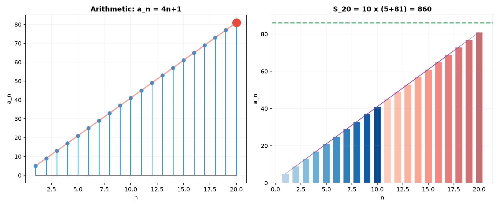
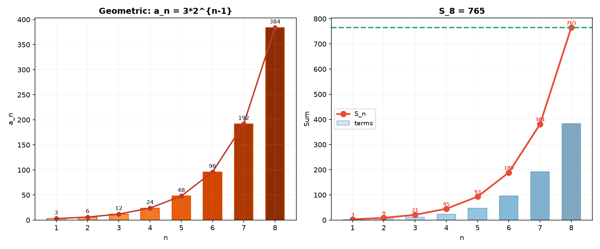
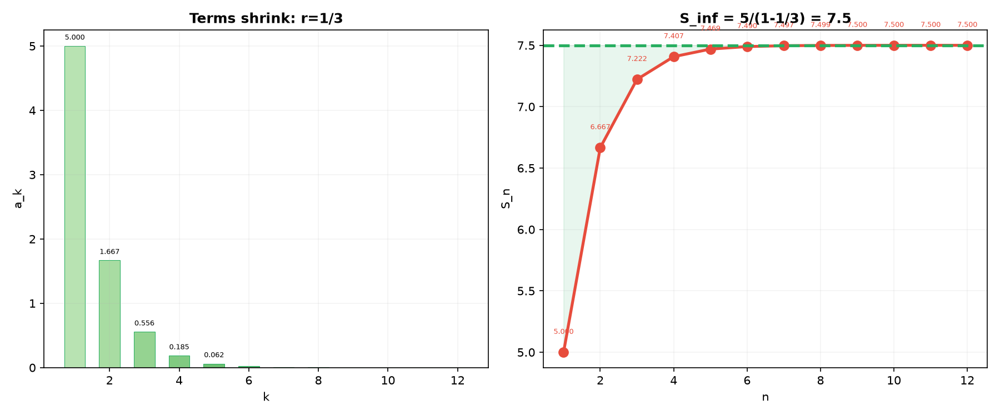
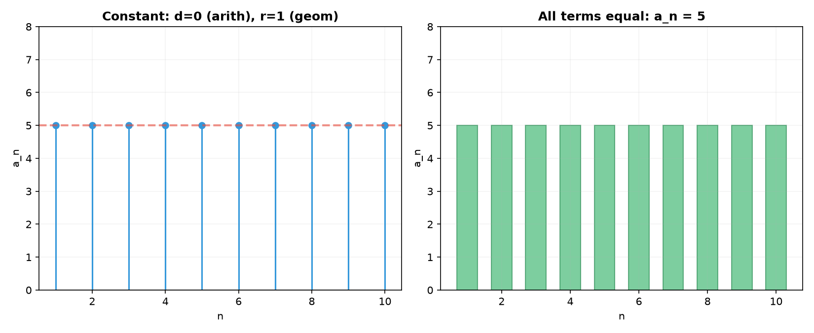
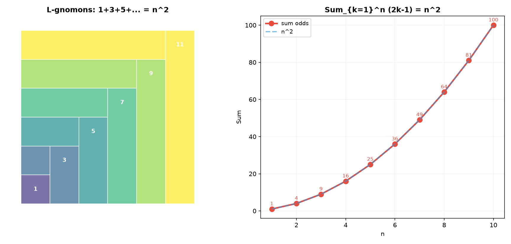
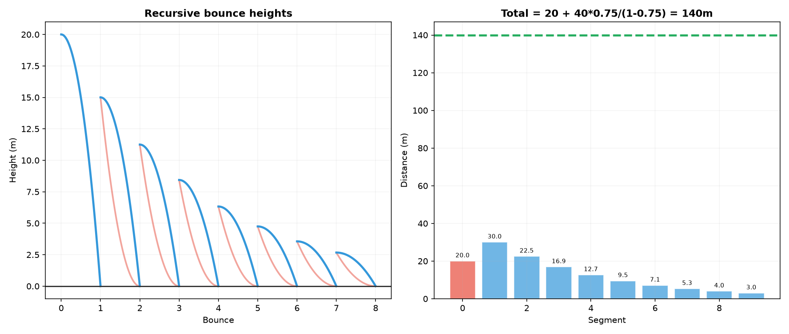
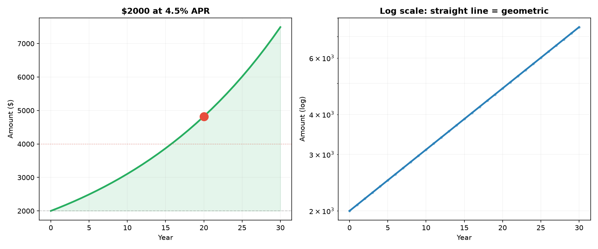
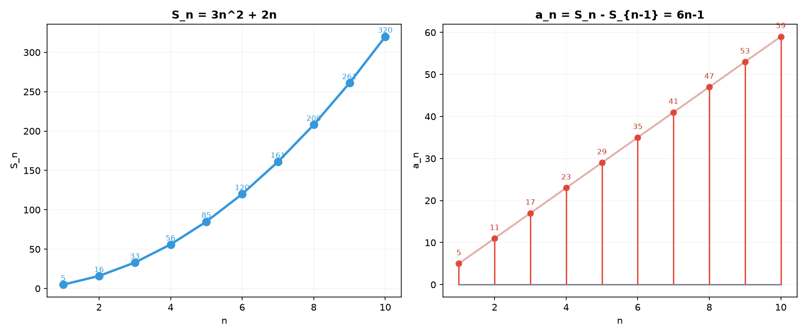
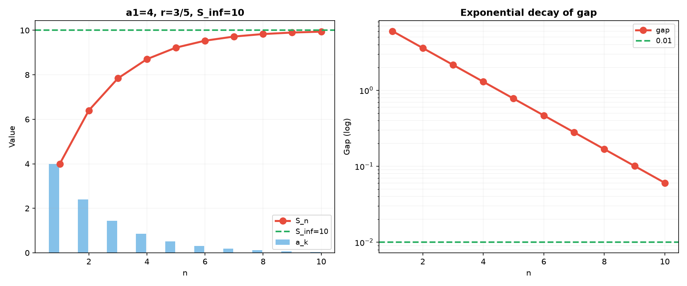
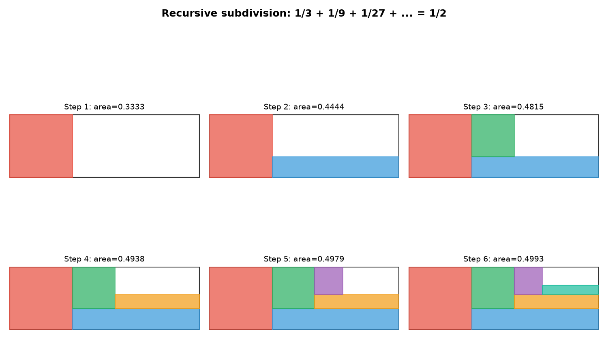

# Solutions — 12B1: Sequences and Series — Foundations

---

## Practice 1

**Find the 20th term and the sum of the first 20 terms of the arithmetic sequence: $5, 9, 13, 17, \dots$**

$a_1 = 5$, $d = 4$.

$a_{20} = 5 + (20-1)\cdot 4 = 5 + 19\cdot 4 = 5 + 76 = 81$.

$S_{20} = \frac{20(5+81)}{2} = 10 \cdot 86 = 860$.

> **Answer**: $a_{20} = 81$, $S_{20} = 860$

---

## Practice 2

**Find the sum of the first 8 terms of the geometric sequence: $3, 6, 12, 24, \dots$**

$a_1 = 3$, $r = 2$.

$S_8 = 3 \cdot \frac{1-2^8}{1-2} = 3 \cdot \frac{1-256}{-1} = 3 \cdot 255 = 765$.

Check: $3+6+12+24+48+96+192+384 = 765$ ✓.

> **Answer**: $S_8 = 765$

---

## Practice 3

**Evaluate the infinite sum: $5 + \frac{5}{3} + \frac{5}{9} + \frac{5}{27} + \cdots$**

$a_1 = 5$, $r = \frac{1}{3}$. Since $|r| = \frac{1}{3} < 1$, the infinite sum converges.

$S_\infty = \frac{a_1}{1-r} = \frac{5}{1-\frac{1}{3}} = \frac{5}{\frac{2}{3}} = \frac{15}{2} = 7.5$.

> **Answer**: $S_\infty = \frac{15}{2}$

---

## Practice 4

**A sequence is both arithmetic and geometric. Prove that all its terms must be equal. Give a real-world situation where a constant sequence naturally arises.**

Let the sequence be $a_1, a_2, a_3, \dots$.

**Arithmetic**: $a_2 = a_1 + d$ and $a_3 = a_1 + 2d$.
**Geometric**: $a_2 = a_1 r$ and $a_3 = a_1 r^2$.

From $a_2$: $a_1 + d = a_1 r \implies d = a_1(r-1)$.
From $a_3$: $a_1 + 2d = a_1 r^2$.

Substitute $d$: $a_1 + 2a_1(r-1) = a_1 r^2$.
If $a_1 = 0$, then all terms are $0$ (constant). Otherwise divide by $a_1$:
$1 + 2(r-1) = r^2 \implies 1 + 2r - 2 = r^2 \implies 2r - 1 = r^2 \implies r^2 - 2r + 1 = 0 \implies (r-1)^2 = 0 \implies r = 1$.

Thus $r = 1$ and $d = a_1(1-1) = 0$, so $a_n = a_1$ for all $n$ — a constant sequence.

**Real-world example**: A bank account that pays no interest and has no deposits/withdrawals. The balance is constant over time.

> **Answer**: $r=1$, $d=0$ → all terms equal $a_1$

---

## Practice 5

**Compute $\sum_{k=1}^{n} (2k-1)$ using sigma formulas. Show the result equals $n^2$.**

$\sum_{k=1}^{n} (2k-1) = 2\sum_{k=1}^{n} k - \sum_{k=1}^{n} 1 = 2 \cdot \frac{n(n+1)}{2} - n = n(n+1) - n = n^2$.

> **Answer**: $\sum_{k=1}^{n} (2k-1) = n^2$

---

## Practice 6: Bouncing Ball (🔗 10A)

**A ball is dropped from a height of 20 m. It rebounds to 75% of its previous height each time. Find the total vertical distance traveled.**

First drop: $20$ m.
First rebound and second drop: $2 \times (20 \cdot 0.75) = 2 \times 15$ m.
Second rebound and third drop: $2 \times (20 \cdot 0.75^2) = 2 \times 11.25$ m.

Total $= 20 + 2(20 \cdot 0.75) + 2(20 \cdot 0.75^2) + 2(20 \cdot 0.75^3) + \cdots$
$= 20 + 40(0.75 + 0.75^2 + 0.75^3 + \cdots)$.

The infinite sum: $a_1 = 0.75$, $r = 0.75$.
$S_\infty = \frac{0.75}{1-0.75} = \frac{0.75}{0.25} = 3$.

Total $= 20 + 40 \times 3 = 20 + 120 = 140$ m.

> **Answer**: $140$ m

---

## Practice 7: Compound Interest (🔗 10A)

**You invest $\$2000$ at $4.5\%$ annual interest, compounded annually.**
**(a) Find the value after 20 years.**
**(b) How long until the investment doubles?**

**(a)** $A_{20} = 2000(1.045)^{20}$.
$\ln A_{20} = \ln 2000 + 20\ln(1.045) \approx 7.6009 + 20 \times 0.0440 = 7.6009 + 0.8802 = 8.4811$.
$A_{20} \approx e^{8.4811} \approx \$4{,}823.15$.

**(b)** Rule of 72: $72/4.5 \approx 16$ years.

Verify: $2000(1.045)^n = 4000 \implies (1.045)^n = 2 \implies n = \frac{\ln 2}{\ln 1.045} \approx \frac{0.6931}{0.0440} \approx 15.75$ years.

> **Answer**: (a) $\approx \$4{,}823.15$, (b) $\approx 15.75$ years (Rule of 72 gives 16)

---

## Practice 8: Recovering $a_n$ from $S_n$

**If $S_n = 3n^2 + 2n$, find $a_n$ and identify the sequence type.**

$a_1 = S_1 = 3 + 2 = 5$.
For $n \ge 2$: $a_n = S_n - S_{n-1} = (3n^2 + 2n) - [3(n-1)^2 + 2(n-1)]$.
$= 3n^2 + 2n - [3(n^2 - 2n + 1) + 2n - 2]$
$= 3n^2 + 2n - [3n^2 - 6n + 3 + 2n - 2]$
$= 3n^2 + 2n - [3n^2 - 4n + 1]$
$= 3n^2 + 2n - 3n^2 + 4n - 1$
$= 6n - 1$.

Check: $a_2 = 11$, $a_3 = 17$, $a_4 = 23$.
Sequence: $5, 11, 17, 23, \dots$ — **arithmetic** with $d = 6$.

> **Answer**: $a_n = 6n - 1$, arithmetic with $d=6$

---

## Practice 9: Real Battle

**A geometric series has first term 4 and sum to infinity 10. Find the common ratio and the sum of the first 5 terms.**

$S_\infty = \frac{a_1}{1-r} = \frac{4}{1-r} = 10 \implies 4 = 10(1-r) \implies 4 = 10 - 10r \implies 10r = 6 \implies r = \frac{3}{5}$.

$S_5 = 4 \cdot \frac{1-(3/5)^5}{1-3/5} = 4 \cdot \frac{1-243/3125}{2/5} = 4 \cdot \frac{2882/3125}{2/5} = 4 \cdot \frac{2882}{3125} \cdot \frac{5}{2} = 4 \cdot \frac{14410}{6250} = \frac{57640}{6250} = \frac{5764}{625}$.

$S_5 = \frac{5764}{625} = 9.2224$.

Check: $4 + \frac{12}{5} + \frac{36}{25} + \frac{108}{125} + \frac{324}{625} = \frac{2500+1500+900+540+324}{625} = \frac{5764}{625}$ ✓.

> **Answer**: $r = \frac{3}{5}$, $S_5 = \frac{5764}{625}$

---

## Practice 10: Visual Proof

**Using the unit square subdivision, show that $\frac13 + \frac19 + \frac1{27} + \cdots = \frac12$.**

Divide a unit square into 3 equal vertical columns. Shade the leftmost column: area $\frac13$.
Divide the middle column into 3 equal horizontal strips. Shade the bottom strip: area $\frac13 \cdot \frac13 = \frac19$.
Divide the remaining unshaded region (top-right) into 3 equal vertical columns again. Shade the leftmost: area $\frac19 \cdot \frac13 = \frac1{27}$.

Continue this process. The total shaded area is $\frac13 + \frac19 + \frac1{27} + \cdots$.

Since the shaded and unshaded regions are always equal at each step (we always shade 1 out of 3 equal parts in the remaining rectangle), the total shaded area approaches exactly $\frac12$ of the unit square.

Algebraically: $a_1 = \frac13$, $r = \frac13$.
$S_\infty = \frac{1/3}{1-1/3} = \frac{1/3}{2/3} = \frac12$ ✓.

> **Answer**: $S_\infty = \frac12$

---

## Basic Drills

### D1. Find the 15th term of the arithmetic sequence: $4, 10, 16, 22, \dots$

$a_1 = 4$, $d = 6$.
$a_{15} = 4 + 14 \cdot 6 = 4 + 84 = 88$.

> **Answer**: $88$

---

### D2. Find the sum of the first 12 terms of the geometric sequence: $2, -4, 8, -16, \dots$

$a_1 = 2$, $r = -2$.
$S_{12} = 2 \cdot \frac{1-(-2)^{12}}{1-(-2)} = 2 \cdot \frac{1-4096}{3} = 2 \cdot \frac{-4095}{3} = 2 \cdot (-1365) = -2730$.

> **Answer**: $-2730$

---

### D3. Write $0.555\ldots$ (repeating) as a fraction using infinite geometric series.

$0.555\ldots = \frac{5}{10} + \frac{5}{100} + \frac{5}{1000} + \cdots$
$a_1 = \frac{5}{10}$, $r = \frac{1}{10}$.
$S_\infty = \frac{5/10}{1-1/10} = \frac{5/10}{9/10} = \frac{5}{9}$.

> **Answer**: $\frac{5}{9}$

---

### D4. Evaluate $\sum_{k=1}^{50} k$ using the formula.

$\sum_{k=1}^{50} k = \frac{50 \cdot 51}{2} = 25 \cdot 51 = 1275$.

> **Answer**: $1275$

---

### D5. Evaluate $\sum_{k=1}^{8} k^2$.

$\sum_{k=1}^{8} k^2 = \frac{8 \cdot 9 \cdot 17}{6} = \frac{1224}{6} = 204$.

Check: $1+4+9+16+25+36+49+64 = 204$ ✓.

> **Answer**: $204$

---

### D6. For the sequence with $S_n = 3n^2 + n$, find $a_5$.

$a_5 = S_5 - S_4 = (3 \cdot 25 + 5) - (3 \cdot 16 + 4) = (75+5) - (48+4) = 80 - 52 = 28$.

> **Answer**: $28$

---

### D7. Identify the type of sequence: $\frac{1}{3}, \frac{1}{7}, \frac{1}{11}, \frac{1}{15}, \dots$

Look at the denominators: $3, 7, 11, 15, \dots$ — arithmetic with $d=4$.
So the reciprocals form an arithmetic sequence → **harmonic sequence**.

> **Answer**: Harmonic sequence

---

### D8. Compute $\sum_{k=1}^{6} (k^3 - k)$.

$\sum_{k=1}^{6} k^3 = \left(\frac{6 \cdot 7}{2}\right)^2 = 21^2 = 441$.
$\sum_{k=1}^{6} k = \frac{6 \cdot 7}{2} = 21$.
$\sum_{k=1}^{6} (k^3 - k) = 441 - 21 = 420$.

> **Answer**: $420$

---

### D9. Find the sum of the first 20 terms of the arithmetic sequence: $7, 12, 17, 22, \dots$

$a_1 = 7$, $d = 5$.
$a_{20} = 7 + 19 \cdot 5 = 7 + 95 = 102$.
$S_{20} = \frac{20(7+102)}{2} = 10 \cdot 109 = 1090$.

> **Answer**: $1090$

---

### D10. Find the infinite sum: $8 + 4 + 2 + 1 + \frac{1}{2} + \cdots$

$a_1 = 8$, $r = \frac{1}{2}$.
$S_\infty = \frac{8}{1-1/2} = \frac{8}{1/2} = 16$.

> **Answer**: $16$

---

### D11. (🔗 10A) $\$500$ is invested at $6\%$ annual interest compounded annually. Write the first 5 terms of the amount sequence.

$a_1 = 500(1.06)^1 = 530$.
$a_2 = 500(1.06)^2 = 561.80$.
$a_3 = 500(1.06)^3 = 595.51$.
$a_4 = 500(1.06)^4 = 631.24$.
$a_5 = 500(1.06)^5 = 669.11$.

> **Answer**: $530, 561.80, 595.51, 631.24, 669.11$

---

### D12. Compute $\sum_{k=1}^{12} (3k - 2)$.

$\sum_{k=1}^{12} (3k - 2) = 3\sum_{k=1}^{12} k - \sum_{k=1}^{12} 2 = 3 \cdot \frac{12 \cdot 13}{2} - 12 \cdot 2 = 3 \cdot 78 - 24 = 234 - 24 = 210$.

Alternatively: arithmetic with $a_1 = 1$, $a_{12} = 34$, $S_{12} = \frac{12(1+34)}{2} = 6 \cdot 35 = 210$.

> **Answer**: $210$

---

## Advanced Drills

### A1. The sum of an infinite geometric series is 12, and the second term is 3. Find the first term and the common ratio.

$a_1 r = 3$ and $\frac{a_1}{1-r} = 12$.
From the second: $a_1 = 12(1-r)$.
Substitute: $12(1-r)r = 3 \implies 12r - 12r^2 = 3 \implies 12r^2 - 12r + 3 = 0 \implies 4r^2 - 4r + 1 = 0 \implies (2r-1)^2 = 0 \implies r = \frac12$.
Then $a_1 = 12(1-\frac12) = 6$.

Check: $6, 3, 1.5, 0.75, \dots$. $S_\infty = \frac{6}{1-0.5} = 12$ ✓.

> **Answer**: $a_1 = 6$, $r = \frac12$

---

### A2. An arithmetic sequence has $a_5 = 17$ and $a_{12} = 38$. Find $a_1$, $d$, and the sum of the first 15 terms.

$a_5 = a_1 + 4d = 17$.
$a_{12} = a_1 + 11d = 38$.

Subtract: $7d = 21 \implies d = 3$.
Then $a_1 = 17 - 4 \cdot 3 = 17 - 12 = 5$.

$a_{15} = 5 + 14 \cdot 3 = 5 + 42 = 47$.
$S_{15} = \frac{15(5+47)}{2} = \frac{15 \cdot 52}{2} = 15 \cdot 26 = 390$.

> **Answer**: $a_1 = 5$, $d = 3$, $S_{15} = 390$

---

### A3. A geometric sequence has $a_3 = 12$ and $a_6 = 96$. Find $a_1$, $r$, and $S_{10}$.

$a_3 = a_1 r^2 = 12$.
$a_6 = a_1 r^5 = 96$.

Divide: $\frac{a_1 r^5}{a_1 r^2} = r^3 = \frac{96}{12} = 8 \implies r = 2$.
Then $a_1 \cdot 4 = 12 \implies a_1 = 3$.

$S_{10} = 3 \cdot \frac{1-2^{10}}{1-2} = 3 \cdot \frac{1-1024}{-1} = 3 \cdot 1023 = 3069$.

> **Answer**: $a_1 = 3$, $r = 2$, $S_{10} = 3069$

---

### A4. Find $\sum_{k=1}^{n} k(k+1)$ using the formulas for $\sum k^2$ and $\sum k$. Simplify to a closed form.

$\sum_{k=1}^{n} k(k+1) = \sum_{k=1}^{n} (k^2 + k) = \sum k^2 + \sum k$.
$= \frac{n(n+1)(2n+1)}{6} + \frac{n(n+1)}{2}$
$= n(n+1)\left[\frac{2n+1}{6} + \frac{3}{6}\right]$
$= n(n+1)\frac{2n+4}{6} = \frac{n(n+1)(2n+4)}{6}$
$= \frac{n(n+1)(n+2)}{3}$.

> **Answer**: $\sum_{k=1}^{n} k(k+1) = \frac{n(n+1)(n+2)}{3}$

---

### A5. (🔗 10A) A loan of $\$10{,}000$ is repaid in equal monthly installments. If the annual interest rate is $6\%$ compounded monthly, find the monthly payment.

Monthly interest rate: $r = \frac{0.06}{12} = 0.005$.
Let $P$ be the monthly payment.

Present value of all payments: $P\left(\frac{1}{1.005} + \frac{1}{1.005^2} + \cdots + \frac{1}{1.005^n}\right)$.

For a standard 30-year (360-month) mortgage:
$10000 = P \cdot \frac{1 - (1.005)^{-360}}{0.005}$.
$P = \frac{10000 \cdot 0.005}{1 - 1.005^{-360}} = \frac{50}{1 - 0.1660} = \frac{50}{0.8340} \approx \$59.96$.

> **Answer**: $\approx \$59.96$ per month (for 30-year term)

---

### A6. Show that $\sum_{k=1}^{n} (2k-1)^2 = \frac{n(2n-1)(2n+1)}{3}$.

$\sum_{k=1}^{n} (2k-1)^2 = \sum_{k=1}^{n} (4k^2 - 4k + 1)$
$= 4\sum k^2 - 4\sum k + \sum 1$
$= 4 \cdot \frac{n(n+1)(2n+1)}{6} - 4 \cdot \frac{n(n+1)}{2} + n$
$= \frac{2n(n+1)(2n+1)}{3} - 2n(n+1) + n$
$= n\left[\frac{2(n+1)(2n+1)}{3} - 2(n+1) + 1\right]$
$= n\left[\frac{2(n+1)(2n+1) - 6(n+1) + 3}{3}\right]$
$= n\left[\frac{2(2n^2+3n+1) - 6n - 6 + 3}{3}\right]$
$= n\left[\frac{4n^2+6n+2 - 6n - 3}{3}\right]$
$= n\left[\frac{4n^2 - 1}{3}\right] = \frac{n(2n-1)(2n+1)}{3}$ ✓.

> **Answer**: Proven

---

### A7. Two arithmetic sequences have the same common difference. The first has $a_1=3$, the second has $b_1=10$. Find $n$ such that $S_n^{(1)} = S_n^{(2)}$.

$S_n^{(1)} = \frac{n}{2}[2\cdot 3 + (n-1)d] = \frac{n}{2}[6 + (n-1)d]$.
$S_n^{(2)} = \frac{n}{2}[2\cdot 10 + (n-1)d] = \frac{n}{2}[20 + (n-1)d]$.

Setting them equal (for $n > 0$):
$\frac{n}{2}[6 + (n-1)d] = \frac{n}{2}[20 + (n-1)d] \implies 6 + (n-1)d = 20 + (n-1)d \implies 6 = 20$.

This is impossible. The sums can never be equal unless $d = 0$ and $n = 0$, but $n \ge 1$.

Wait — if $d = 0$, then $S_n^{(1)} = 3n$ and $S_n^{(2)} = 10n$, and $3n = 10n \implies n = 0$. So no positive $n$ works.

Actually, the sums are equal only when $n=0$ (trivial). There is no positive integer solution.

> **Answer**: No positive integer $n$ satisfies the condition.

---

### A8. A geometric series with $a_1 = 6$ and $r = \frac23$ is summed to infinity. Find the smallest $n$ such that $S_n$ is within $0.01$ of $S_\infty$.

$S_\infty = \frac{6}{1-2/3} = \frac{6}{1/3} = 18$.

$S_n = 6 \cdot \frac{1-(2/3)^n}{1-2/3} = 18[1-(2/3)^n]$.

The gap: $S_\infty - S_n = 18(2/3)^n$.

We need $18(2/3)^n < 0.01 \implies (2/3)^n < \frac{0.01}{18} = \frac{1}{1800}$.

Take logs: $n\ln(2/3) < \ln(1/1800) \implies n > \frac{-\ln 1800}{-\ln(3/2)} = \frac{\ln 1800}{\ln 1.5}$.

$\ln 1800 \approx 7.4955$, $\ln 1.5 \approx 0.4055$.
$n > \frac{7.4955}{0.4055} \approx 18.49$.

So $n = 19$.

Check: $S_{18} = 18[1-(2/3)^{18}] \approx 18[1-0.0015] = 17.973$. Gap = $0.027$ (too big).
$S_{19} = 18[1-(2/3)^{19}] \approx 18[1-0.0010] = 17.982$. Gap = $0.018$ — still not below 0.01.

Let me recalculate more carefully.

$(2/3)^{18} = (2^{18})/(3^{18}) = 262144/387420489 \approx 0.000677$.
Gap = $18 \times 0.000677 \approx 0.01218$ — still above 0.01.

$(2/3)^{19} \approx 0.000451$. Gap = $18 \times 0.000451 \approx 0.00812$ — below 0.01.

So $n = 19$.

> **Answer**: $n = 19$

---

### A9. Prove that $\sum_{k=1}^{n} k^3 = (\sum_{k=1}^{n} k)^2$ using induction.

**Base case** ($n=1$): $1^3 = 1$, $(\frac{1\cdot2}{2})^2 = 1$. ✓

**Inductive step**: Assume $\sum_{k=1}^{m} k^3 = \left(\frac{m(m+1)}{2}\right)^2$.

For $n = m+1$:
$\sum_{k=1}^{m+1} k^3 = \left(\frac{m(m+1)}{2}\right)^2 + (m+1)^3$
$= \frac{m^2(m+1)^2}{4} + (m+1)^3$
$= \frac{(m+1)^2}{4}[m^2 + 4(m+1)]$
$= \frac{(m+1)^2}{4}(m^2 + 4m + 4)$
$= \frac{(m+1)^2}{4}(m+2)^2$
$= \left(\frac{(m+1)(m+2)}{2}\right)^2$ ✓.

Thus the formula holds for all $n \ge 1$. ✓

> **Answer**: Proven by induction

---

### A10. (🔗 9B) A circle of radius 1 is inscribed in a square. The square is inscribed in a larger circle, and so on. Find the total area of all circles (infinite series).

Circle 1: radius $r_1 = 1$, area $A_1 = \pi$.
Square 1: side $s_1 = 2$ (circle is inscribed).
Circle 2: inscribed in square 1 → radius $r_2 = \frac{s_1}{2} = 1$? No, that's wrong.

Wait, let's think again.

Circle 1: radius $R_1 = 1$. Inscribed in Square 1.
Square 1: side $s_1 = 2$ (the square that contains the circle of radius 1).
Square 2: inscribed in Circle 1 → diagonal of Square 2 = $2R_1 = 2$ → side $s_2 = \frac{2}{\sqrt{2}} = \sqrt{2}$.
Circle 2: inscribed in Square 2 → radius $R_2 = \frac{s_2}{2} = \frac{\sqrt{2}}{2} = \frac{1}{\sqrt{2}}$.
Circle 3: inscribed in Square 3 → $R_3 = \frac{1}{2}$.
Square 3: inscribed in Circle 2 → diagonal $= 2R_2 = \sqrt{2}$ → side $s_3 = \frac{\sqrt{2}}{\sqrt{2}} = 1$.
Circle 3: inscribed in Square 3 → radius $R_3 = \frac12$.

So $R_1 = 1$, $R_2 = \frac{1}{\sqrt{2}}$, $R_3 = \frac12$, $R_4 = \frac{1}{2\sqrt{2}}$, ...

This is geometric with ratio $r = \frac{1}{\sqrt{2}}$.

Total area $= \pi R_1^2 + \pi R_2^2 + \pi R_3^2 + \cdots$
$= \pi\left[1 + \frac12 + \frac14 + \frac18 + \cdots\right]$
$= \pi \cdot \frac{1}{1-1/2} = \pi \cdot 2 = 2\pi$.

> **Answer**: $2\pi$
