# Solutions — 12B2: Sequences and Series — Advanced Techniques

---

## Practice 1

**Evaluate the telescoping sum: $\displaystyle\sum_{k=1}^{20} \frac{1}{k(k+1)}$.**

$\frac{1}{k(k+1)} = \frac{1}{k} - \frac{1}{k+1}$.

$\sum_{k=1}^{20} \frac{1}{k(k+1)} = \left(\frac11 - \frac12\right) + \left(\frac12 - \frac13\right) + \cdots + \left(\frac1{20} - \frac1{21}\right)$.

All intermediate terms cancel: $= 1 - \frac{1}{21} = \frac{20}{21}$.

> **Answer**: $\frac{20}{21}$

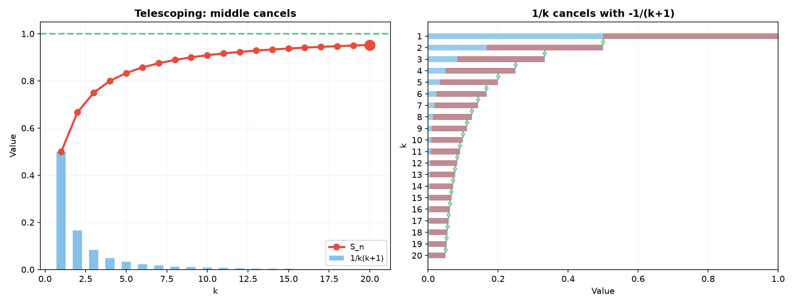

---

## Practice 2

**Solve the recurrence: $a_{n+1} = 2a_n + 3$, $a_1 = 1$. Find a formula for $a_n$.**

Fixed point: $x = 2x + 3 \implies x = -3$.
Subtract: $a_{n+1} - (-3) = 2(a_n - (-3)) \implies a_{n+1} + 3 = 2(a_n + 3)$.

Let $b_n = a_n + 3$. Then $b_{n+1} = 2b_n$, $b_1 = a_1 + 3 = 4$.
So $b_n = 4 \cdot 2^{n-1} = 2^{n+1}$.

Thus $a_n = b_n - 3 = 2^{n+1} - 3$.

Check: $a_1 = 4-3=1$ ✓. $a_2 = 8-3=5$ ✓. $a_3 = 16-3=13$ ✓.

> **Answer**: $a_n = 2^{n+1} - 3$

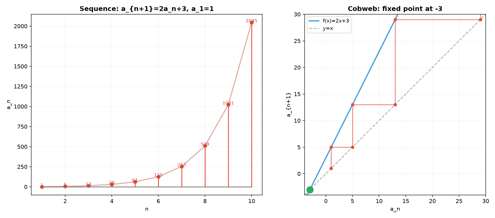

---

## Practice 3

**Solve the recurrence: $a_{n+2} = 4a_{n+1} - 4a_n$, $a_1 = 2$, $a_2 = 4$. (Repeated root!)**

Characteristic equation: $r^2 = 4r - 4 \implies r^2 - 4r + 4 = 0 \implies (r-2)^2 = 0 \implies r = 2$ (repeated).

For a repeated root, the general solution is $a_n = (A + Bn) \cdot 2^{n-1}$.

Using $a_1 = 2$: $(A + B) \cdot 2^{0} = A + B = 2$.
Using $a_2 = 4$: $(A + 2B) \cdot 2^{1} = 2(A + 2B) = 4 \implies A + 2B = 2$.

From $A + B = 2$ and $A + 2B = 2$: subtract to get $B = 0$, then $A = 2$.

Thus $a_n = 2 \cdot 2^{n-1} = 2^n$.

Check: $a_1 = 2$, $a_2 = 4$, $a_3 = 8$, ... $a_{n+2} = 2^{n+2}$, $4a_{n+1} - 4a_n = 4\cdot 2^{n+1} - 4\cdot 2^n = 8\cdot 2^n - 4\cdot 2^n = 4\cdot 2^n = 2^{n+2}$ ✓.

> **Answer**: $a_n = 2^n$

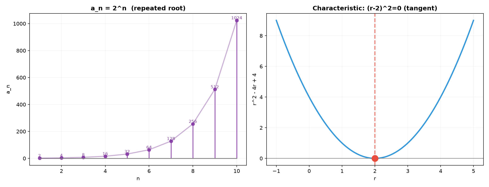

---

## Practice 4

**Find the 10th term of the sequence whose first differences are $3, 5, 7, 9, \dots$ and whose first term is $2$.**

The differences $b_k = a_{k+1} - a_k$ form an arithmetic sequence: $b_k = 2k + 1$ (starting at $k=1$ giving $3$).

$a_{10} = a_1 + \sum_{k=1}^{9} b_k = 2 + \sum_{k=1}^{9} (2k+1)$.

$\sum_{k=1}^{9} (2k+1) = 2\sum_{k=1}^{9} k + \sum_{k=1}^{9} 1 = 2 \cdot \frac{9\cdot 10}{2} + 9 = 90 + 9 = 99$.

$a_{10} = 2 + 99 = 101$.

Check: Sequence is $2, 5, 10, 17, 26, 37, 50, 65, 82, 101, \dots$ ✓.

> **Answer**: $101$

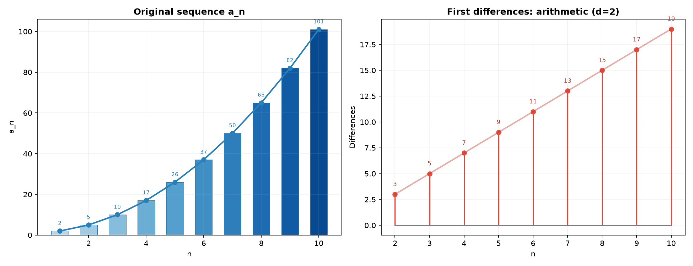

---

## Practice 5

**Find the first and last numbers in the 20th group of the grouped sequence $(1), (2,3), (4,5,6), \dots$**

Group $n$ contains $n$ consecutive integers.

Numbers before group 20: $1 + 2 + \cdots + 19 = \frac{19 \cdot 20}{2} = 190$.

First number in group 20: $190 + 1 = 191$.
Last number in group 20: $190 + 20 = 210$.

Check: Group 20 contains $191, 192, \dots, 210$ (20 numbers). ✓

> **Answer**: First = $191$, Last = $210$

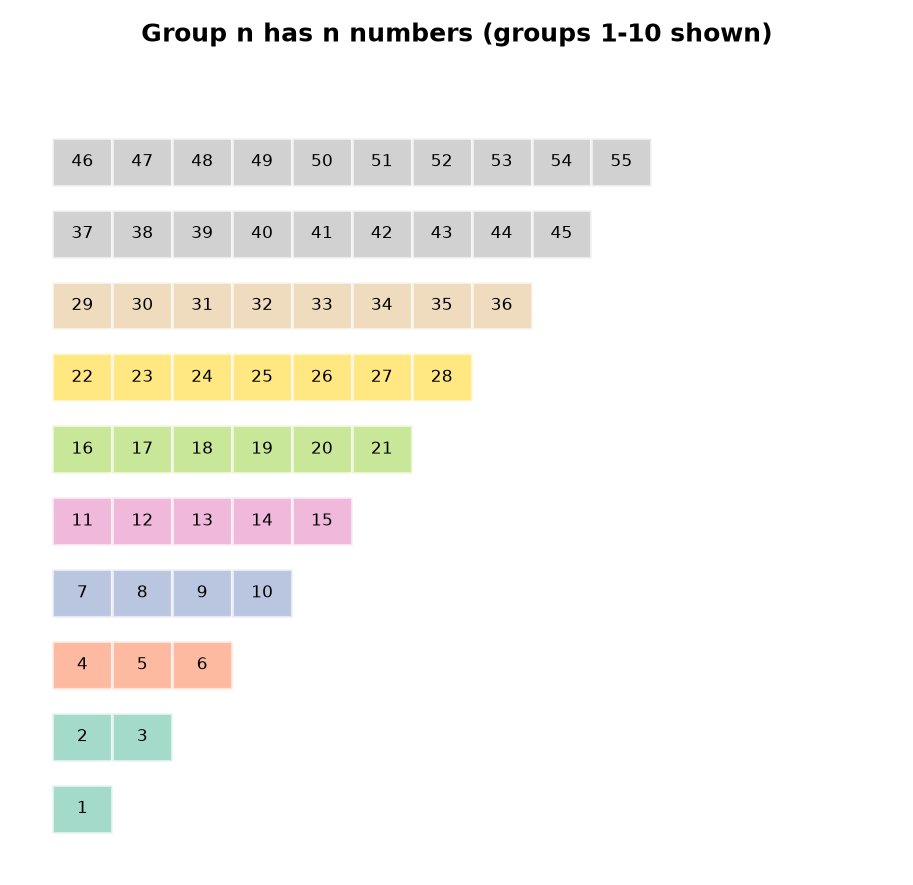

---

## Practice 6

**Prove by induction: $\displaystyle\sum_{k=1}^{n} k^3 = \left(\frac{n(n+1)}{2}\right)^2$.**

**Base case** ($n=1$): $1^3 = 1$, $\left(\frac{1\cdot2}{2}\right)^2 = 1$. ✓

**Inductive step**: Assume $\sum_{k=1}^{m} k^3 = \left(\frac{m(m+1)}{2}\right)^2$.

For $n = m+1$:
$\sum_{k=1}^{m+1} k^3 = \left(\frac{m(m+1)}{2}\right)^2 + (m+1)^3$
$= \frac{m^2(m+1)^2}{4} + (m+1)^3$
$= \frac{(m+1)^2}{4}[m^2 + 4(m+1)]$
$= \frac{(m+1)^2}{4}(m^2 + 4m + 4)$
$= \frac{(m+1)^2}{4}(m+2)^2$
$= \left(\frac{(m+1)(m+2)}{2}\right)^2$ ✓.

Thus the formula holds for all $n \ge 1$. ✓

> **Answer**: Proven by induction

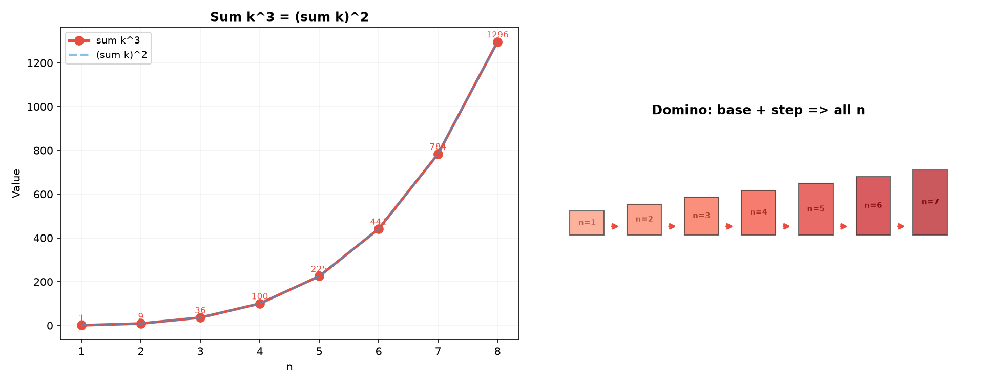

---

## Practice 7

**Find $\displaystyle\lim_{n\to\infty} \frac{5n^3 - 2n + 1}{3n^3 + n^2 + 4}$.**

Divide numerator and denominator by $n^3$:
$\frac{5n^3 - 2n + 1}{3n^3 + n^2 + 4} = \frac{5 - 2/n^2 + 1/n^3}{3 + 1/n + 4/n^3}$.

As $n \to \infty$, $2/n^2 \to 0$, $1/n^3 \to 0$, $1/n \to 0$, $4/n^3 \to 0$.

Limit $= \frac{5}{3}$.

> **Answer**: $\frac{5}{3}$

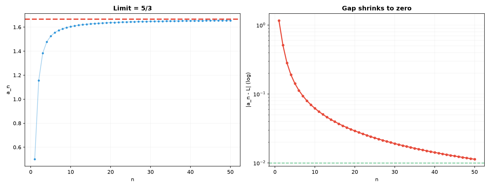

---

## Practice 8: Telescoping with Radicals

**Evaluate $\displaystyle\sum_{k=1}^{99} \frac{1}{\sqrt{k} + \sqrt{k+1}}$.**

Rationalize: $\frac{1}{\sqrt{k} + \sqrt{k+1}} \cdot \frac{\sqrt{k+1} - \sqrt{k}}{\sqrt{k+1} - \sqrt{k}} = \sqrt{k+1} - \sqrt{k}$.

The sum telescopes:
$\sum_{k=1}^{99} (\sqrt{k+1} - \sqrt{k}) = \sqrt{100} - \sqrt{1} = 10 - 1 = 9$.

> **Answer**: $9$

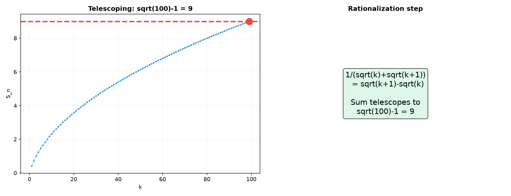

---

## Practice 9: Fibonacci Limit (🔗 12B1)

**(a) Prove by induction that $F_1 + F_2 + \cdots + F_n = F_{n+2} - 1$.**

**Base case** ($n=1$): $F_1 = 1$, $F_3 - 1 = 2 - 1 = 1$. ✓

**Inductive step**: Assume $F_1 + \cdots + F_k = F_{k+2} - 1$.

For $n = k+1$:
$(F_1 + \cdots + F_k) + F_{k+1} = (F_{k+2} - 1) + F_{k+1}$
$= (F_{k+2} + F_{k+1}) - 1$
$= F_{k+3} - 1$.

This matches the formula with $n = k+1$. ✓

**(b) Find $\displaystyle\lim_{n\to\infty} \frac{F_{n+1}}{F_n}$.**

Let $L = \lim_{n\to\infty} \frac{F_{n+1}}{F_n}$ (assuming the limit exists).

From $F_{n+2} = F_{n+1} + F_n$, divide by $F_{n+1}$:
$\frac{F_{n+2}}{F_{n+1}} = 1 + \frac{F_n}{F_{n+1}}$.

As $n \to \infty$, $\frac{F_{n+2}}{F_{n+1}} \to L$ and $\frac{F_n}{F_{n+1}} \to \frac{1}{L}$.

So $L = 1 + \frac{1}{L} \implies L^2 = L + 1 \implies L^2 - L - 1 = 0 \implies L = \frac{1+\sqrt{5}}{2}$ (positive root).

Thus $\displaystyle\lim_{n\to\infty} \frac{F_{n+1}}{F_n} = \phi = \frac{1+\sqrt{5}}{2} \approx 1.618$.

> **Answer**: (a) Proven by induction, (b) $\phi = \frac{1+\sqrt{5}}{2}$

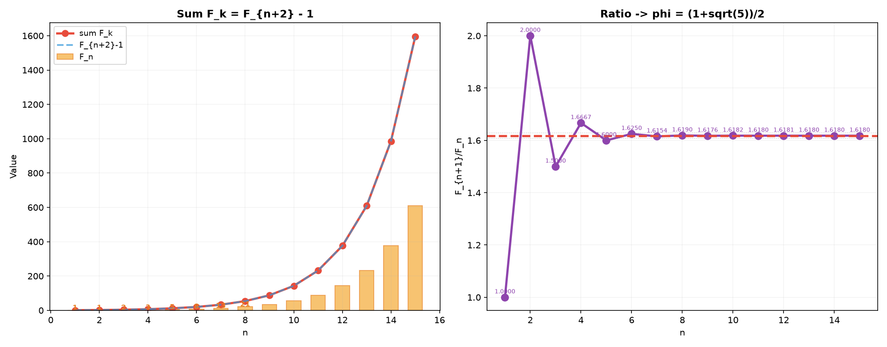

---

## Practice 10: Real Battle — Quadratics via Second Differences

**A sequence has terms $0, 3, 8, 15, 24, \dots$. Find a formula for $a_n$ using the method of second differences.**

First differences: $3-0=3$, $8-3=5$, $15-8=7$, $24-15=9$, $\dots$
Second differences: $5-3=2$, $7-5=2$, $9-7=2$, $\dots$

Constant second difference of $2$ means $a_n = An^2 + Bn + C$.

Using $n=1,2,3$:
$A + B + C = 0$
$4A + 2B + C = 3$
$9A + 3B + C = 8$

Subtract (2)-(1): $3A + B = 3$.
Subtract (3)-(2): $5A + B = 5$.
Then $2A = 2 \implies A = 1$, so $3 + B = 3 \implies B = 0$, and $1 + 0 + C = 0 \implies C = -1$.

Thus $a_n = n^2 - 1$.

Check: $n=4$: $16-1=15$ ✓. $n=5$: $25-1=24$ ✓.

> **Answer**: $a_n = n^2 - 1$

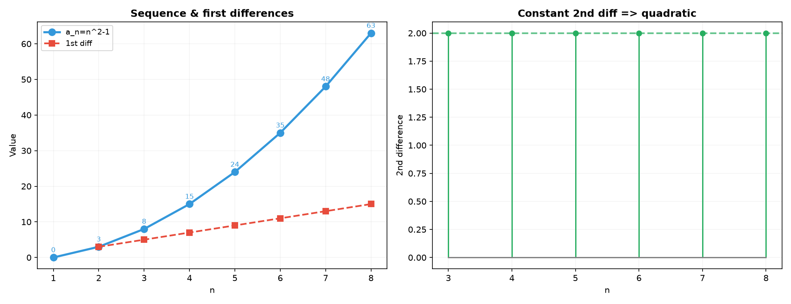

---

## Practice 11: Squeeze Theorem

**Find $\displaystyle\lim_{n\to\infty} \frac{\cos n}{n}$ using the Squeeze Theorem.**

Since $-1 \le \cos n \le 1$ for all $n$:
$-\frac{1}{n} \le \frac{\cos n}{n} \le \frac{1}{n}$.

As $n \to \infty$, $-\frac{1}{n} \to 0$ and $\frac{1}{n} \to 0$.

By the Squeeze Theorem, $\displaystyle\lim_{n\to\infty} \frac{\cos n}{n} = 0$.

> **Answer**: $0$

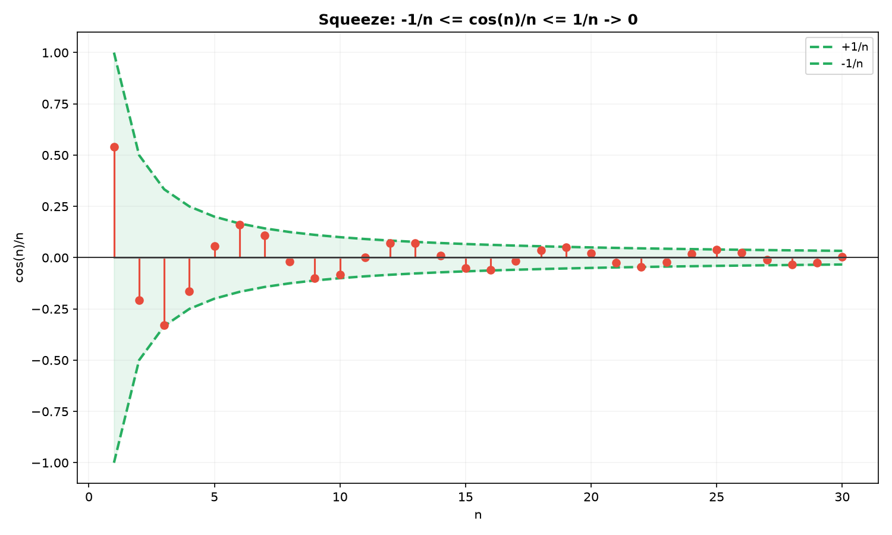

---

## Practice 12: Real Battle — Harmonic Series Intuition

**Show that the harmonic series $\sum_{k=1}^{\infty} \frac{1}{k}$ diverges by grouping terms.**

Group the terms as follows:
$\frac{1}{1} + \frac{1}{2} + \left(\frac{1}{3} + \frac{1}{4}\right) + \left(\frac{1}{5} + \frac{1}{6} + \frac{1}{7} + \frac{1}{8}\right) + \left(\frac{1}{9} + \cdots + \frac{1}{16}\right) + \cdots$

Each group (starting from the third) has $2^{m-1}$ terms and each term in group $m$ is at least $\frac{1}{2^m}$:
- Group 3 ($\frac13 + \frac14$): each term $\ge \frac14$, so sum $\ge 2 \cdot \frac14 = \frac12$.
- Group 4 ($\frac15$ to $\frac18$): each term $\ge \frac18$, so sum $\ge 4 \cdot \frac18 = \frac12$.
- Group 5 ($\frac19$ to $\frac1{16}$): each term $\ge \frac1{16}$, so sum $\ge 8 \cdot \frac1{16} = \frac12$.

Thus the sum of the harmonic series $\ge 1 + \frac12 + \frac12 + \frac12 + \cdots$, which diverges to infinity.

Therefore $\sum_{k=1}^{\infty} \frac{1}{k}$ diverges. ✓

> **Answer**: Proven by grouping — each group sums to at least $\frac12$

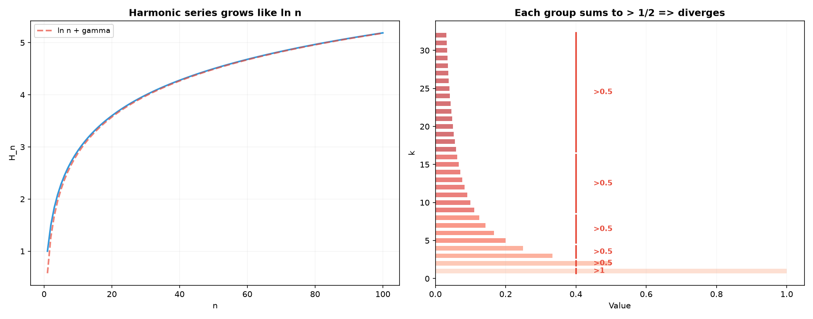

---

## Basic Algebra Drill — Advanced Sequences (12 Problems)

### D1. Compute $\sum_{k=1}^{30} \frac{1}{k(k+1)}$.

Telescoping: $1 - \frac{1}{31} = \frac{30}{31}$.

> **Answer**: $\frac{30}{31}$

---

### D2. Find the 8th term of the harmonic sequence: $\frac{1}{3}, \frac{1}{7}, \frac{1}{11}, \frac{1}{15}, \dots$

Denominators form arithmetic: $3, 7, 11, 15, \dots$ with $d=4$.
Denominator of 8th term: $3 + 7\cdot 4 = 3 + 28 = 31$.
8th term: $\frac{1}{31}$.

> **Answer**: $\frac{1}{31}$

---

### D3. Solve the recurrence $a_{n+1} = 4a_n$, $a_1 = 3$. Find $a_{10}$.

$a_n = 3 \cdot 4^{n-1}$. $a_{10} = 3 \cdot 4^9 = 3 \cdot 262144 = 786432$.

> **Answer**: $786432$

---

### D4. Solve the recurrence $a_{n+1} = 2a_n + 5$, $a_1 = 1$. Find $a_5$.

Fixed point: $x = 2x + 5 \implies x = -5$.
$a_n + 5$ is geometric with ratio 2: $a_n + 5 = 6 \cdot 2^{n-1}$.
$a_n = 6 \cdot 2^{n-1} - 5$.
$a_5 = 6 \cdot 2^4 - 5 = 6 \cdot 16 - 5 = 96 - 5 = 91$.

Check: $1, 7, 19, 43, 91$ ✓.

> **Answer**: $91$

---

### D5. Find $a_n$ for the sequence with first differences $4, 7, 10, 13, \dots$ and $a_1 = 3$.

Differences: $b_k = 3k + 1$ (starting at $k=1$ gives $4$).
$a_n = a_1 + \sum_{k=1}^{n-1} (3k+1) = 3 + 3\cdot\frac{(n-1)n}{2} + (n-1)$.
$= 3 + \frac{3n(n-1)}{2} + n - 1 = \frac{3n(n-1)}{2} + n + 2$.
$= \frac{3n^2 - 3n + 2n + 4}{2} = \frac{3n^2 - n + 4}{2}$.

> **Answer**: $a_n = \frac{3n^2 - n + 4}{2}$

---

### D6. Prove by induction that $1 + 3 + 5 + \cdots + (2n-1) = n^2$.

**Base case** ($n=1$): $1 = 1^2$ ✓.
**Inductive step**: Assume $1+3+\cdots+(2k-1) = k^2$.
Then $1+3+\cdots+(2k-1)+(2k+1) = k^2 + (2k+1) = (k+1)^2$ ✓.

> **Answer**: Proven

---

### D7. Find $\lim_{n\to\infty} \frac{2n^2 + 3n}{n^2 + 5}$.

Divide by $n^2$: $\frac{2 + 3/n}{1 + 5/n^2} \to \frac{2}{1} = 2$.

> **Answer**: $2$

---

### D8. Find $\lim_{n\to\infty} \left(\sqrt{n^2 + 4n} - n\right)$.

Rationalize: $\frac{(n^2+4n) - n^2}{\sqrt{n^2+4n} + n} = \frac{4n}{\sqrt{n^2+4n} + n}$.
Divide by $n$: $\frac{4}{\sqrt{1+4/n} + 1} \to \frac{4}{1+1} = 2$.

> **Answer**: $2$

---

### D9. Find the first number in group 12 of $(1), (2,3), (4,5,6), \dots$

Numbers before group 12: $1+2+\cdots+11 = \frac{11\cdot12}{2} = 66$.
First number in group 12: $66+1 = 67$.

> **Answer**: $67$

---

### D10. Compute $\sum_{k=1}^{20} \lfloor\sqrt{k}\rfloor$.

$\lfloor\sqrt{k}\rfloor = 1$ for $k=1,2,3$ (3 numbers).
$\lfloor\sqrt{k}\rfloor = 2$ for $k=4,5,6,7,8$ (5 numbers).
$\lfloor\sqrt{k}\rfloor = 3$ for $k=9,10,11,12,13,14,15$ (7 numbers).
$\lfloor\sqrt{k}\rfloor = 4$ for $k=16,17,18,19,20$ (5 numbers).

Sum $= 3\cdot1 + 5\cdot2 + 7\cdot3 + 5\cdot4 = 3 + 10 + 21 + 20 = 54$.

> **Answer**: $54$

---

### D11. (🔗 12B1) Which is larger: $1.01^{100}$ or $100$?

$1.01^{100} = (1+0.01)^{100} \approx e^{100\ln(1.01)} \approx e^{100\cdot 0.00995} = e^{0.995} \approx 2.70$.
So $1.01^{100} \approx 2.70$, which is much smaller than $100$.
Geometric growth is slow when the ratio is close to 1.

> **Answer**: $100$ is much larger ($1.01^{100} \approx 2.70$)

---

### D12. Find $\lim_{n\to\infty} \frac{3^n}{n!}$.

For $n > 6$, $n!$ grows much faster than $3^n$ (factorial dominates exponential).
$\frac{3^n}{n!} = \frac{3}{1}\cdot\frac{3}{2}\cdot\frac{3}{3}\cdot\frac{3}{4}\cdots\frac{3}{n}$.
Beyond $n \ge 3$, each additional factor $\frac{3}{k} \le 1$, and for $k > 3$, $\frac{3}{k} < 1$.
The product converges to $0$ as $n \to \infty$.

> **Answer**: $0$

---

## Advanced Algebra Drill — Advanced Sequences (12 Problems)

### A1. Solve the recurrence $a_{n+2} = 5a_{n+1} - 6a_n$, $a_1 = 1$, $a_2 = 2$. Find $a_{10}$.

Characteristic equation: $r^2 = 5r - 6 \implies r^2 - 5r + 6 = 0 \implies (r-2)(r-3) = 0 \implies r = 2, 3$.

$a_n = A \cdot 2^{n-1} + B \cdot 3^{n-1}$.
$a_1 = A + B = 1$.
$a_2 = 2A + 3B = 2$.

From the first: $B = 1 - A$. Substitute: $2A + 3(1-A) = 2 \implies 2A + 3 - 3A = 2 \implies -A = -1 \implies A = 1$, $B = 0$.

So $a_n = 2^{n-1}$.
$a_{10} = 2^9 = 512$.

> **Answer**: $a_{10} = 512$

---

### A2. Compute $\sum_{k=1}^{n} \frac{1}{(2k-1)(2k+1)}$ using telescoping. Give a closed form.

Partial fractions: $\frac{1}{(2k-1)(2k+1)} = \frac{1}{2}\left(\frac{1}{2k-1} - \frac{1}{2k+1}\right)$.

$\sum_{k=1}^{n} \frac{1}{(2k-1)(2k+1)} = \frac12\left[\left(\frac11 - \frac13\right) + \left(\frac13 - \frac15\right) + \cdots + \left(\frac1{2n-1} - \frac1{2n+1}\right)\right]$
$= \frac12\left(1 - \frac{1}{2n+1}\right) = \frac12 \cdot \frac{2n}{2n+1} = \frac{n}{2n+1}$.

> **Answer**: $\frac{n}{2n+1}$

---

### A3. (🔗 12B1) A geometric series has first term 12 and sum to infinity 18. Find the common ratio and the sum of the first 6 terms.

$S_\infty = \frac{12}{1-r} = 18 \implies 12 = 18(1-r) \implies 12 = 18 - 18r \implies 18r = 6 \implies r = \frac13$.

$S_6 = 12 \cdot \frac{1-(1/3)^6}{1-1/3} = 12 \cdot \frac{1-1/729}{2/3} = 12 \cdot \frac{728/729}{2/3} = 12 \cdot \frac{728}{729} \cdot \frac32 = 18 \cdot \frac{728}{729} = \frac{13104}{729} = \frac{1456}{81}$.

$S_6 = \frac{1456}{81} \approx 17.975$.

> **Answer**: $r = \frac13$, $S_6 = \frac{1456}{81}$

---

### A4. Find $\lim_{n\to\infty} \left(\frac{n}{n+1}\right)^n$.

$\left(\frac{n}{n+1}\right)^n = \frac{1}{(1+1/n)^n}$.
Since $\lim_{n\to\infty} (1+1/n)^n = e$, the limit is $\frac{1}{e}$.

> **Answer**: $\frac{1}{e}$

---

### A5. Prove by induction: $1\cdot2 + 2\cdot3 + 3\cdot4 + \cdots + n(n+1) = \frac{n(n+1)(n+2)}{3}$.

**Base case** ($n=1$): $1\cdot2 = 2$, $\frac{1\cdot2\cdot3}{3} = 2$. ✓

**Inductive step**: Assume formula holds for $n=k$.
For $n=k+1$:
$\sum_{i=1}^{k+1} i(i+1) = \frac{k(k+1)(k+2)}{3} + (k+1)(k+2)$
$= \frac{k(k+1)(k+2) + 3(k+1)(k+2)}{3}$
$= \frac{(k+1)(k+2)(k+3)}{3}$ ✓.

> **Answer**: Proven by induction

---

### A6. For the grouped sequence $(1,2), (3,4,5), (6,7,8,9), \dots$, find the first and last numbers in the 15th group.

Group 1 has 2 numbers, group 2 has 3, group 3 has 4, ... group $n$ has $n+1$ numbers.

Numbers before group 15: $2 + 3 + \cdots + 15 = \frac{(2+15)\cdot14}{2} = \frac{17\cdot14}{2} = 119$.
First number in group 15: $119 + 1 = 120$.
Group 15 has $16$ numbers.
Last number in group 15: $120 + 15 = 135$.

> **Answer**: First = $120$, Last = $135$

---

### A7. A sequence has first term 1 and each term after the first is the sum of all previous terms. Find a formula for $a_n$ and prove it by induction.

$a_1 = 1$.
$a_2 = a_1 = 1$.
$a_3 = a_1 + a_2 = 2$.
$a_4 = a_1 + a_2 + a_3 = 4$.
$a_5 = 8$.

Pattern: $a_1 = 1$, and for $n \ge 2$, $a_n = 2^{n-2}$.

**Proof by induction**: For $n=2$, $a_2 = 1 = 2^{0}$ ✓.
Assume $a_k = 2^{k-2}$ for all $k \le n$. Then:
$a_{n+1} = a_1 + a_2 + \cdots + a_n = 1 + 1 + 2 + 4 + \cdots + 2^{n-2}$.
$= 1 + (2^{n-1} - 1) = 2^{n-1}$.
This matches $2^{(n+1)-2} = 2^{n-1}$ ✓.

> **Answer**: $a_1 = 1$, $a_n = 2^{n-2}$ for $n \ge 2$

---

### A8. (🔗 9B) The Koch snowflake: start with an equilateral triangle of side 1. At each step, replace the middle third of each side with an equilateral triangle. Find the perimeter after $n$ steps as a geometric sequence. Does the perimeter converge?

Initially: 3 sides of length 1. Perimeter $P_0 = 3$.
Step 1: Each side is replaced by 4 segments of length $\frac13$. $3 \cdot 4 = 12$ sides. $P_1 = 12 \cdot \frac13 = 4$.
Step 2: Each of 12 sides splits into 4 segments of length $\frac19$. $12 \cdot 4 = 48$ sides. $P_2 = 48 \cdot \frac19 = \frac{16}{3}$.

Pattern: $P_n = 3 \cdot \left(\frac43\right)^n$.

As $n \to \infty$, $P_n \to \infty$ — the perimeter diverges (the snowflake has infinite perimeter but finite area!).

> **Answer**: $P_n = 3(4/3)^n$, diverges to $\infty$

---

### A9. Find $\lim_{n\to\infty} \frac{n!}{n^n}$.

$0 \le \frac{n!}{n^n} = \frac{1}{n} \cdot \frac{2}{n} \cdot \frac{3}{n} \cdots \frac{n}{n} \le \frac{1}{n} \cdot 1 \cdot 1 \cdots 1 = \frac{1}{n}$.

As $n \to \infty$, $\frac{1}{n} \to 0$. By the Squeeze Theorem, $\lim_{n\to\infty} \frac{n!}{n^n} = 0$.

> **Answer**: $0$

---

### A10. (🔗 9A1) Prove by induction that $\frac{d}{dx} x^n = n x^{n-1}$ for all positive integers $n$.

**Base case** ($n=1$): $\frac{d}{dx}x = 1 = 1 \cdot x^{0}$. ✓

**Inductive step**: Assume $\frac{d}{dx}x^k = kx^{k-1}$.
$\frac{d}{dx}x^{k+1} = \frac{d}{dx}(x \cdot x^k) = 1 \cdot x^k + x \cdot kx^{k-1}$ (product rule)
$= x^k + kx^k = (k+1)x^k$ ✓.

> **Answer**: Proven by induction using product rule

---

### A11. The sequence $a_n$ satisfies $a_{n+1} = \frac{1}{2}\left(a_n + \frac{2}{a_n}\right)$ with $a_1 = 1$. Compute $a_2, a_3, a_4$. What is $\lim_{n\to\infty} a_n$?

$a_2 = \frac12\left(1 + \frac{2}{1}\right) = \frac12(3) = 1.5$.
$a_3 = \frac12\left(1.5 + \frac{2}{1.5}\right) = \frac12(1.5 + 1.333\ldots) = \frac12(2.833\ldots) = 1.416\ldots$.
$a_4 = \frac12\left(1.416\ldots + \frac{2}{1.416\ldots}\right) = \frac12(1.416\ldots + 1.411\ldots) \approx 1.4142$.

This is Newton's method for $\sqrt{2}$. $\lim_{n\to\infty} a_n = \sqrt{2} \approx 1.41421356$.

> **Answer**: $a_2=1.5$, $a_3\approx1.4167$, $a_4\approx1.4142$, limit $= \sqrt{2}$

---

### A12. (🔗 12B1) Show that $\sum_{k=1}^{n} (2k-1)^3 = n^2(2n^2 - 1)$.

$\sum_{k=1}^{n} (2k-1)^3 = \sum_{k=1}^{n} (8k^3 - 12k^2 + 6k - 1)$
$= 8\sum k^3 - 12\sum k^2 + 6\sum k - \sum 1$
$= 8\left(\frac{n(n+1)}{2}\right)^2 - 12\cdot\frac{n(n+1)(2n+1)}{6} + 6\cdot\frac{n(n+1)}{2} - n$
$= 2n^2(n+1)^2 - 2n(n+1)(2n+1) + 3n(n+1) - n$
$= n[2n(n+1)^2 - 2(n+1)(2n+1) + 3(n+1) - 1]$
$= n[2n(n^2+2n+1) - 2(2n^2+3n+1) + 3n + 3 - 1]$
$= n[2n^3+4n^2+2n - 4n^2-6n-2 + 3n + 2]$
$= n[2n^3 - n] = n^2(2n^2 - 1)$ ✓.

> **Answer**: Proven
