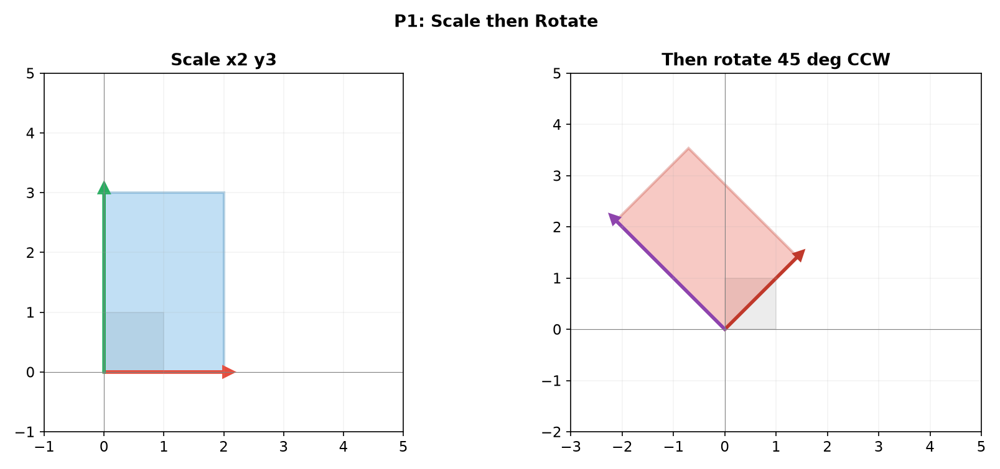
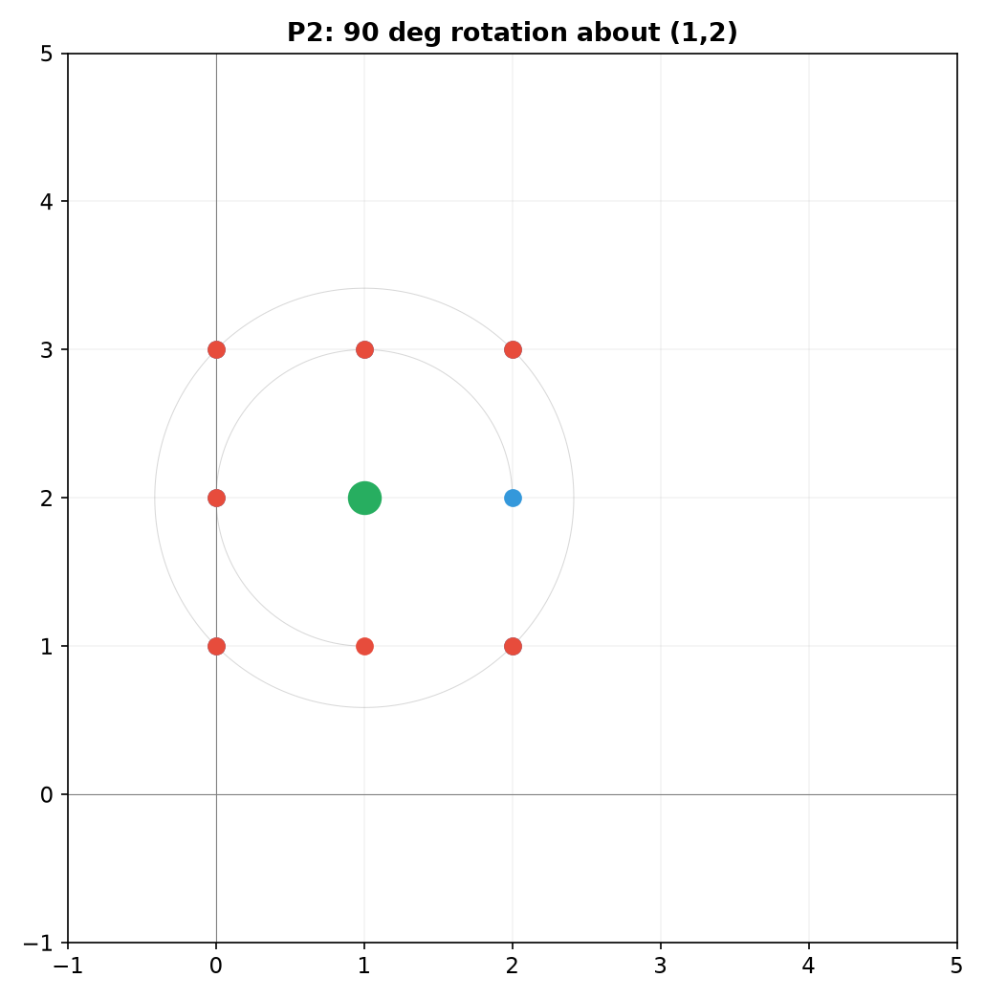
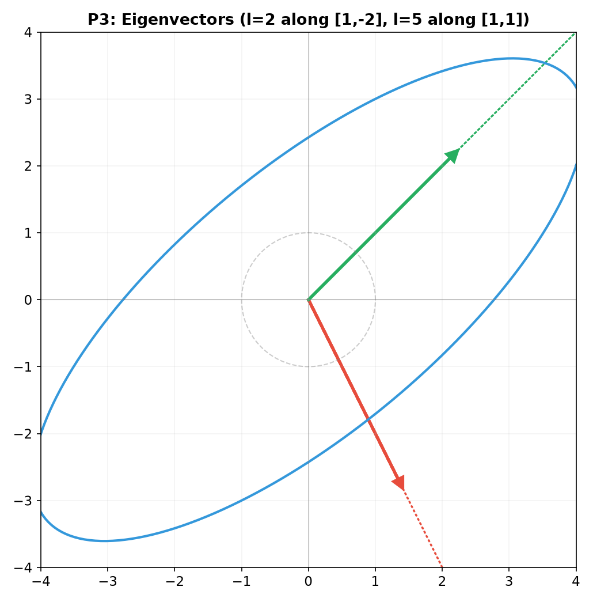
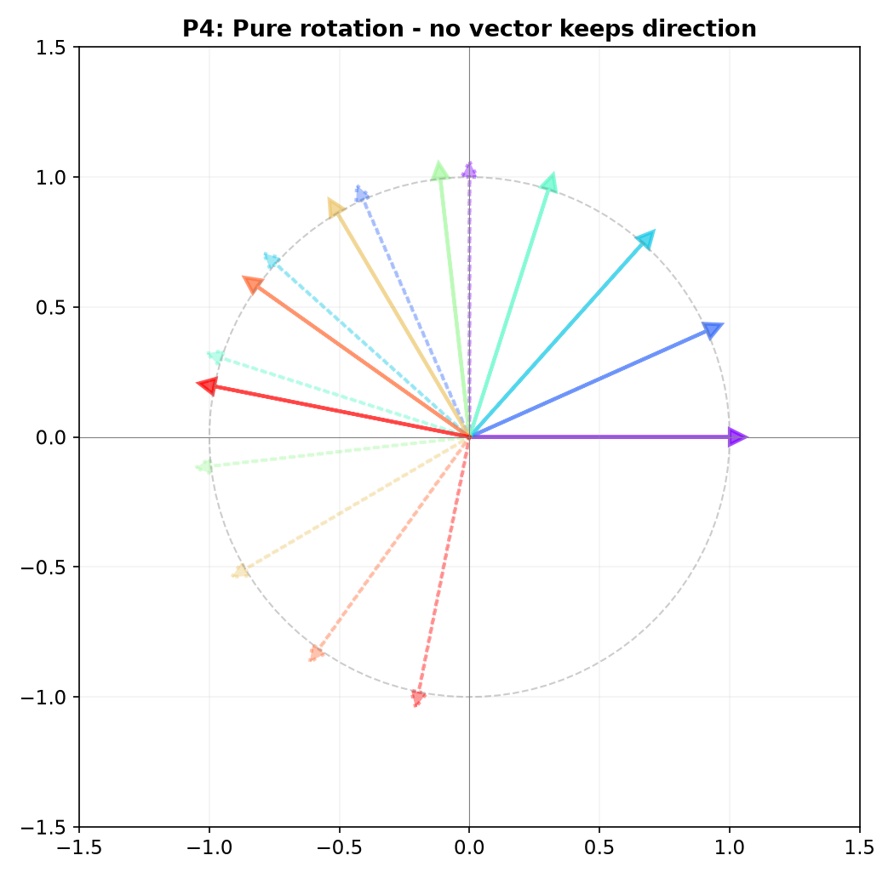
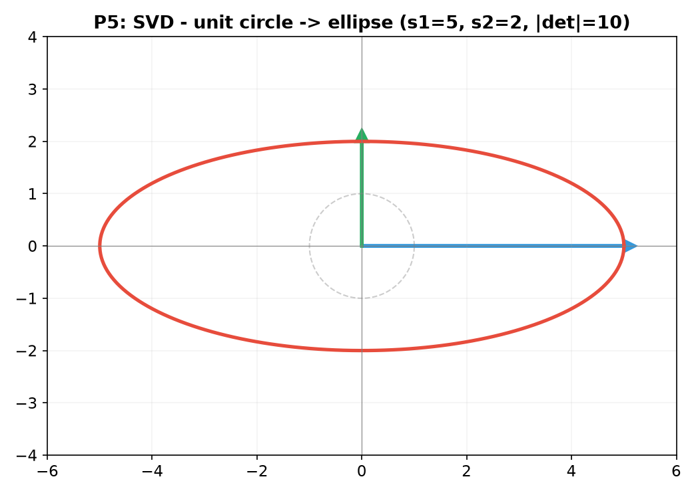
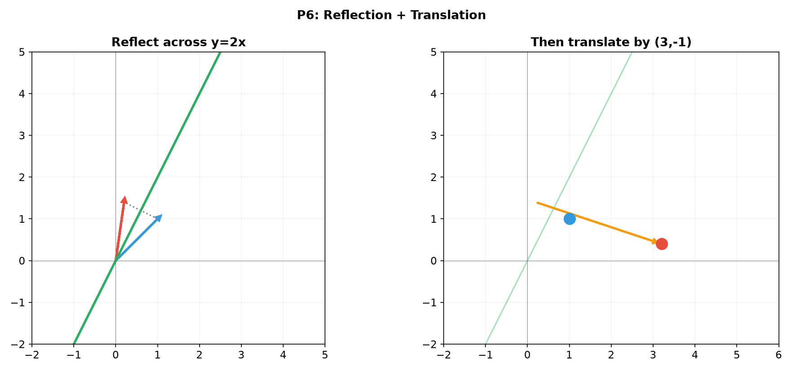
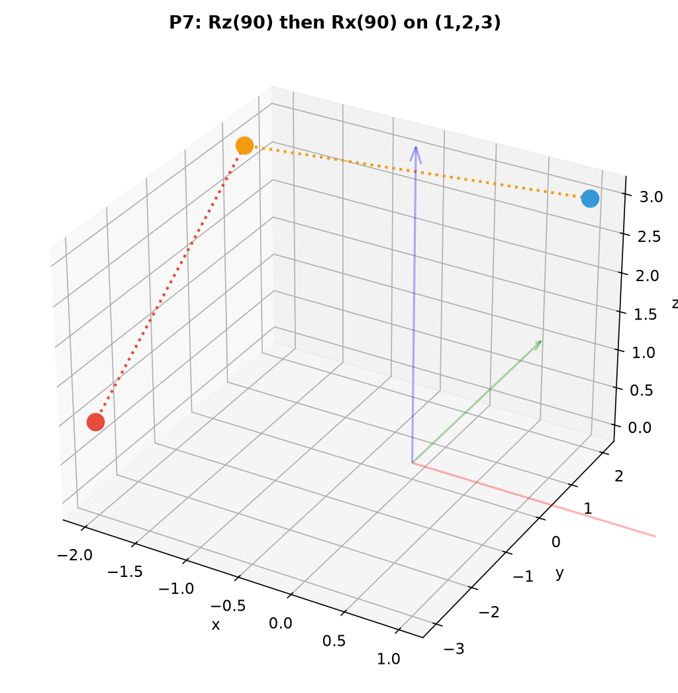
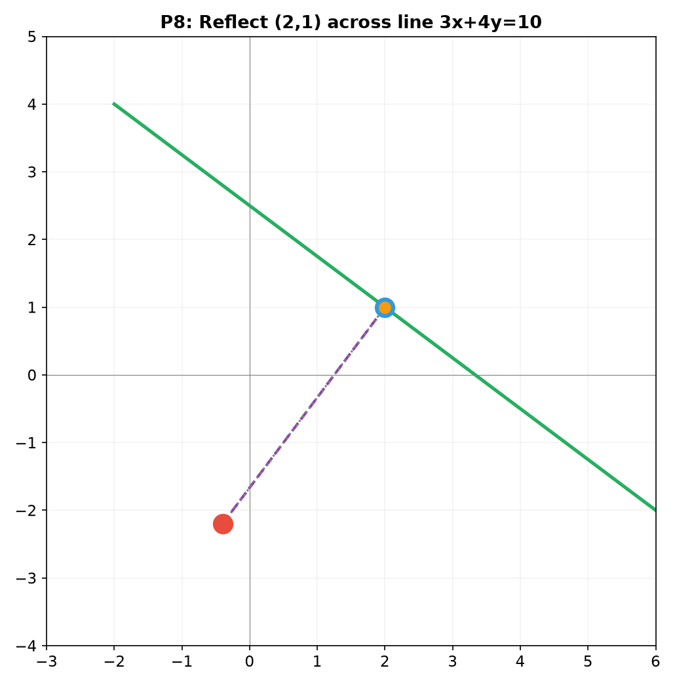
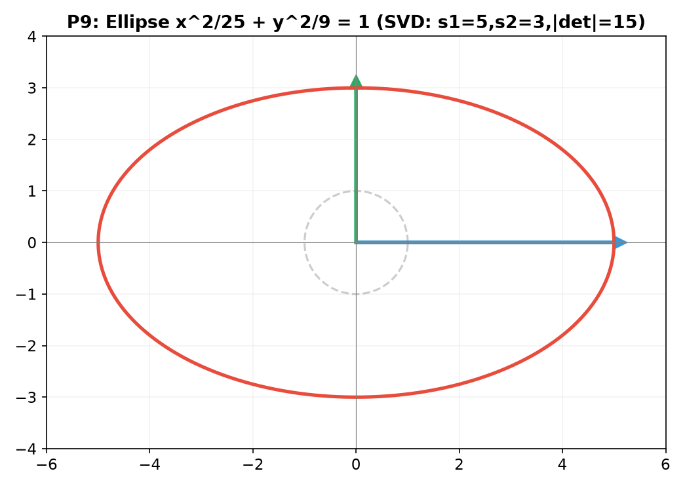

# Solutions — 12C1: Geometric Transformations — Moving and Shaping Space

---

## Practice 1

**Write the $2 \times 2$ matrix that first scales $x$ by 2 and $y$ by 3, then rotates by $45^\circ$ CCW.**

Scaling: $S = \begin{pmatrix} 2 & 0 \\ 0 & 3 \end{pmatrix}$.

Rotation by $45^\circ$ CCW: $R_{45} = \begin{pmatrix} \cos45^\circ & -\sin45^\circ \\ \sin45^\circ & \cos45^\circ \end{pmatrix} = \frac{1}{\sqrt{2}}\begin{pmatrix} 1 & -1 \\ 1 & 1 \end{pmatrix}$.

Apply right-to-left: scale first, then rotate.
$M = R_{45} \cdot S = \frac{1}{\sqrt{2}}\begin{pmatrix} 1 & -1 \\ 1 & 1 \end{pmatrix}\begin{pmatrix} 2 & 0 \\ 0 & 3 \end{pmatrix} = \frac{1}{\sqrt{2}}\begin{pmatrix} 2 & -3 \\ 2 & 3 \end{pmatrix}$.

> **Answer**: $M = \frac{1}{\sqrt{2}}\begin{pmatrix} 2 & -3 \\ 2 & 3 \end{pmatrix}$

---

## Practice 2

**Find the $3 \times 3$ homogeneous matrix that rotates a 2D point by $90^\circ$ around the point $(1, 2)$.**

(1) Translate $(-1, -2)$ to move $(1,2)$ to origin: $T_{-} = \begin{pmatrix} 1 & 0 & -1 \\ 0 & 1 & -2 \\ 0 & 0 & 1 \end{pmatrix}$.
(2) Rotate by $90^\circ$: $R_{90} = \begin{pmatrix} 0 & -1 & 0 \\ 1 & 0 & 0 \\ 0 & 0 & 1 \end{pmatrix}$.
(3) Translate back by $(1, 2)$: $T_{+} = \begin{pmatrix} 1 & 0 & 1 \\ 0 & 1 & 2 \\ 0 & 0 & 1 \end{pmatrix}$.

$M = T_{+} \cdot R_{90} \cdot T_{-} = \begin{pmatrix} 1 & 0 & 1 \\ 0 & 1 & 2 \\ 0 & 0 & 1 \end{pmatrix}\begin{pmatrix} 0 & -1 & 0 \\ 1 & 0 & 0 \\ 0 & 0 & 1 \end{pmatrix}\begin{pmatrix} 1 & 0 & -1 \\ 0 & 1 & -2 \\ 0 & 0 & 1 \end{pmatrix}$.

First multiply $R_{90} \cdot T_{-}$:
$R_{90}T_{-} = \begin{pmatrix} 0 & -1 & 0 \\ 1 & 0 & 0 \\ 0 & 0 & 1 \end{pmatrix}\begin{pmatrix} 1 & 0 & -1 \\ 0 & 1 & -2 \\ 0 & 0 & 1 \end{pmatrix} = \begin{pmatrix} 0 & -1 & 2 \\ 1 & 0 & -1 \\ 0 & 0 & 1 \end{pmatrix}$.

Then multiply by $T_{+}$:
$M = \begin{pmatrix} 1 & 0 & 1 \\ 0 & 1 & 2 \\ 0 & 0 & 1 \end{pmatrix}\begin{pmatrix} 0 & -1 & 2 \\ 1 & 0 & -1 \\ 0 & 0 & 1 \end{pmatrix} = \begin{pmatrix} 0 & -1 & 3 \\ 1 & 0 & 1 \\ 0 & 0 & 1 \end{pmatrix}$.

Test on $(1,2)$: $\begin{pmatrix} 0 & -1 & 3 \\ 1 & 0 & 1 \\ 0 & 0 & 1 \end{pmatrix}\begin{pmatrix}1\\2\\1\end{pmatrix} = \begin{pmatrix} -2+3 \\ 1+1 \\ 1 \end{pmatrix} = \begin{pmatrix}1\\2\\1\end{pmatrix}$ — stays fixed ✓.
Test on $(2,2)$: $\begin{pmatrix}0&-1&3\\1&0&1\\0&0&1\end{pmatrix}\begin{pmatrix}2\\2\\1\end{pmatrix} = \begin{pmatrix}-2+3\\2+1\\1\end{pmatrix} = \begin{pmatrix}1\\3\\1\end{pmatrix}$ — $(2,2)$ goes to $(1,3)$, which is $90^\circ$ rotation about $(1,2)$ ✓.

> **Answer**: $M = \begin{pmatrix} 0 & -1 & 3 \\ 1 & 0 & 1 \\ 0 & 0 & 1 \end{pmatrix}$

---

## Practice 3

**Find the eigenvalues and eigenvectors of $A = \begin{pmatrix} 4 & 1 \\ 2 & 3 \end{pmatrix}$.**

Characteristic equation: $\det(A - \lambda I) = \begin{vmatrix} 4-\lambda & 1 \\ 2 & 3-\lambda \end{vmatrix} = (4-\lambda)(3-\lambda) - 2 = 0$.
$= 12 - 7\lambda + \lambda^2 - 2 = \lambda^2 - 7\lambda + 10 = 0$.
$(\lambda - 2)(\lambda - 5) = 0 \implies \lambda_1 = 2$, $\lambda_2 = 5$.

For $\lambda = 2$: $(A - 2I)\vec{v} = \begin{pmatrix} 2 & 1 \\ 2 & 1 \end{pmatrix}\begin{pmatrix} x \\ y \end{pmatrix} = \begin{pmatrix} 0 \\ 0 \end{pmatrix}$.
$2x + y = 0 \implies y = -2x$.
Eigenvector: $\vec{v}_1 = \begin{pmatrix} 1 \\ -2 \end{pmatrix}$ (any scalar multiple).

For $\lambda = 5$: $(A - 5I)\vec{v} = \begin{pmatrix} -1 & 1 \\ 2 & -2 \end{pmatrix}\begin{pmatrix} x \\ y \end{pmatrix} = \begin{pmatrix} 0 \\ 0 \end{pmatrix}$.
$-x + y = 0 \implies y = x$.
Eigenvector: $\vec{v}_2 = \begin{pmatrix} 1 \\ 1 \end{pmatrix}$.

Check: $A\vec{v}_1 = \begin{pmatrix}4&1\\2&3\end{pmatrix}\begin{pmatrix}1\\-2\end{pmatrix} = \begin{pmatrix}4-2\\2-6\end{pmatrix} = \begin{pmatrix}2\\-4\end{pmatrix} = 2\begin{pmatrix}1\\-2\end{pmatrix}$ ✓.
$A\vec{v}_2 = \begin{pmatrix}4&1\\2&3\end{pmatrix}\begin{pmatrix}1\\1\end{pmatrix} = \begin{pmatrix}5\\5\end{pmatrix} = 5\begin{pmatrix}1\\1\end{pmatrix}$ ✓.

> **Answer**: $\lambda_1 = 2$, $\vec{v}_1 = \begin{pmatrix}1\\-2\end{pmatrix}$; $\lambda_2 = 5$, $\vec{v}_2 = \begin{pmatrix}1\\1\end{pmatrix}$

---

## Practice 4: Composition

**Explain why a pure rotation in 2D has no real eigenvectors (unless $\theta = 0^\circ$ or $180^\circ$). What are the eigenvectors for a $180^\circ$ rotation?**

A rotation matrix $R_\theta = \begin{pmatrix} \cos\theta & -\sin\theta \\ \sin\theta & \cos\theta \end{pmatrix}$ has characteristic equation:
$\det(R_\theta - \lambda I) = (\cos\theta - \lambda)^2 + \sin^2\theta = 0$.
$\lambda^2 - 2\lambda\cos\theta + (\cos^2\theta + \sin^2\theta) = 0 \implies \lambda^2 - 2\lambda\cos\theta + 1 = 0$.

By the quadratic formula: $\lambda = \cos\theta \pm \sqrt{\cos^2\theta - 1} = \cos\theta \pm i\sin\theta = e^{\pm i\theta}$.

For $\theta \neq 0^\circ, 180^\circ$, the eigenvalues are complex (non-real), so there are no real eigenvectors — every non-zero vector changes direction under rotation.

For $\theta = 0^\circ$: $R_0 = I$, eigenvalue $\lambda = 1$ (repeated). Every vector is an eigenvector.
For $\theta = 180^\circ$: $R_{180} = \begin{pmatrix} -1 & 0 \\ 0 & -1 \end{pmatrix} = -I$, eigenvalue $\lambda = -1$ (repeated). Every vector is an eigenvector (all vectors are flipped).

> **Answer**: Real eigenvectors only when $\theta = 0^\circ$ (every vector fixed) or $180^\circ$ (every vector flipped)

---

## Practice 5

**A $2 \times 2$ matrix has singular values $\sigma_1 = 5$, $\sigma_2 = 2$. What is $|\det(A)|$? What shape does the unit circle become after applying $A$?**

$|\det(A)| = \sigma_1 \sigma_2 = 5 \cdot 2 = 10$.

The unit circle becomes an ellipse with semi-major axis $5$ and semi-minor axis $2$.

> **Answer**: $|\det(A)| = 10$, ellipse with semi-axes $5$ and $2$

---

## Practice 6: Real Battle

**Build the $3 \times 3$ homogeneous matrix that performs a reflection across the line $y = 2x$, then translate by $(3, -1)$. Apply it to the point $(1, 1)$. Where does it go?**

The line $y = 2x$ has slope $m = 2$. The angle $\alpha = \arctan(2) \approx 63.43^\circ$.

The $2 \times 2$ reflection matrix across a line at angle $\alpha$:
$F_\alpha = \begin{pmatrix} \cos 2\alpha & \sin 2\alpha \\ \sin 2\alpha & -\cos 2\alpha \end{pmatrix}$.

$\cos 2\alpha = \frac{1-\tan^2\alpha}{1+\tan^2\alpha} = \frac{1-4}{1+4} = -\frac35$.
$\sin 2\alpha = \frac{2\tan\alpha}{1+\tan^2\alpha} = \frac{4}{5}$.

$F_\alpha = \begin{pmatrix} -3/5 & 4/5 \\ 4/5 & 3/5 \end{pmatrix}$.

In homogeneous coordinates:
$F = \begin{pmatrix} -3/5 & 4/5 & 0 \\ 4/5 & 3/5 & 0 \\ 0 & 0 & 1 \end{pmatrix}$, $T = \begin{pmatrix} 1 & 0 & 3 \\ 0 & 1 & -1 \\ 0 & 0 & 1 \end{pmatrix}$.

$M = T \cdot F = \begin{pmatrix} 1 & 0 & 3 \\ 0 & 1 & -1 \\ 0 & 0 & 1 \end{pmatrix}\begin{pmatrix} -3/5 & 4/5 & 0 \\ 4/5 & 3/5 & 0 \\ 0 & 0 & 1 \end{pmatrix} = \begin{pmatrix} -3/5 & 4/5 & 3 \\ 4/5 & 3/5 & -1 \\ 0 & 0 & 1 \end{pmatrix}$.

Apply to $(1, 1)$:
$M\begin{pmatrix}1\\1\\1\end{pmatrix} = \begin{pmatrix} -3/5 + 4/5 + 3 \\ 4/5 + 3/5 - 1 \\ 1 \end{pmatrix} = \begin{pmatrix} 1/5 + 3 \\ 7/5 - 1 \\ 1 \end{pmatrix} = \begin{pmatrix} 16/5 \\ 2/5 \\ 1 \end{pmatrix} = \begin{pmatrix} 3.2 \\ 0.4 \\ 1 \end{pmatrix}$.

So $(1, 1)$ maps to $(3.2, 0.4)$.

> **Answer**: $M = \begin{pmatrix} -3/5 & 4/5 & 3 \\ 4/5 & 3/5 & -1 \\ 0 & 0 & 1 \end{pmatrix}$, $(1,1) \to (16/5, 2/5) = (3.2, 0.4)$

---

## Practice 7: Composition of 3D Rotations (🔗 9C)

**A point $(1, 2, 3)$ is rotated by $90^\circ$ around the $z$-axis, then by $90^\circ$ around the new $x$-axis.**

Rotation by $90^\circ$ around $z$-axis:
$R_z = \begin{pmatrix} 0 & -1 & 0 \\ 1 & 0 & 0 \\ 0 & 0 & 1 \end{pmatrix}$.

First rotation: $R_z \begin{pmatrix}1\\2\\3\end{pmatrix} = \begin{pmatrix} -2 \\ 1 \\ 3 \end{pmatrix}$.

Rotation by $90^\circ$ around $x$-axis:
$R_x = \begin{pmatrix} 1 & 0 & 0 \\ 0 & 0 & -1 \\ 0 & 1 & 0 \end{pmatrix}$.

Second rotation: $R_x \begin{pmatrix}-2\\1\\3\end{pmatrix} = \begin{pmatrix} -2 \\ -3 \\ 1 \end{pmatrix}$.

Combined: $M = R_x \cdot R_z = \begin{pmatrix} 1 & 0 & 0 \\ 0 & 0 & -1 \\ 0 & 1 & 0 \end{pmatrix}\begin{pmatrix} 0 & -1 & 0 \\ 1 & 0 & 0 \\ 0 & 0 & 1 \end{pmatrix} = \begin{pmatrix} 0 & -1 & 0 \\ 0 & 0 & -1 \\ 1 & 0 & 0 \end{pmatrix}$.

$M\begin{pmatrix}1\\2\\3\end{pmatrix} = \begin{pmatrix} -2 \\ -3 \\ 1 \end{pmatrix}$.

> **Answer**: Final position $(-2, -3, 1)$

---

## Practice 8: Reflection Across a Line from 9B (🔗 9B)

**From 9B, the line $3x + 4y = 10$ has normal vector $(3, 4)$ and slope $m = -3/4$. Find the angle $\alpha$ this line makes with the $x$-axis, then write its reflection matrix $F_\alpha$. Apply it to the point $(2, 1)$.**

Slope $m = -\frac{3}{4}$, so $\alpha = \arctan(-3/4) \approx -36.87^\circ$ (or $180^\circ - 36.87^\circ = 143.13^\circ$).

We can use $\tan\alpha = -\frac34$. Then:
$\cos 2\alpha = \frac{1-\tan^2\alpha}{1+\tan^2\alpha} = \frac{1-9/16}{1+9/16} = \frac{7/16}{25/16} = \frac{7}{25}$.
$\sin 2\alpha = \frac{2\tan\alpha}{1+\tan^2\alpha} = \frac{2(-3/4)}{25/16} = \frac{-3/2}{25/16} = -\frac{24}{25}$.

$F_\alpha = \begin{pmatrix} \cos2\alpha & \sin2\alpha \\ \sin2\alpha & -\cos2\alpha \end{pmatrix} = \begin{pmatrix} 7/25 & -24/25 \\ -24/25 & -7/25 \end{pmatrix}$.

Apply to $(2, 1)$: $F_\alpha\begin{pmatrix}2\\1\end{pmatrix} = \begin{pmatrix} 14/25 - 24/25 \\ -48/25 - 7/25 \end{pmatrix} = \begin{pmatrix} -10/25 \\ -55/25 \end{pmatrix} = \begin{pmatrix} -2/5 \\ -11/5 \end{pmatrix} = (-0.4, -2.2)$.

Verify using the Householder formula: The line's unit direction $\hat{u} = (\cos\alpha, \sin\alpha) = (4/5, -3/5)$ (since slope $-3/4$). The projection of $(2,1)$ onto $\hat{u}$ is $\frac{8/5 - 3/5}{1}(4/5, -3/5) = (1)(4/5, -3/5) = (0.8, -0.6)$. The reflected point is $2(0.8, -0.6) - (2, 1) = (1.6, -1.2) - (2, 1) = (-0.4, -2.2)$. ✓

> **Answer**: $F_\alpha = \begin{pmatrix}7/25&-24/25\\-24/25&-7/25\end{pmatrix}$, $(2,1) \to (-0.4, -2.2)$

---

## Practice 9: SVD of a Matrix from 9B Ellipse (🔗 9B, 9C)

**The ellipse $\frac{x^2}{25} + \frac{y^2}{9} = 1$ can be obtained by applying a matrix $A$ to the unit circle. Find the singular values of $A$ (they are the semi-axes). What is $|\det(A)|$?**

The ellipse has semi-axes $5$ (along $x$) and $3$ (along $y$). So the singular values are $\sigma_1 = 5$, $\sigma_2 = 3$.

$|\det(A)| = \sigma_1 \sigma_2 = 5 \cdot 3 = 15$.

The matrix $A$ could be $A = \begin{pmatrix} 5 & 0 \\ 0 & 3 \end{pmatrix}$, which is already in SVD form ($U = I$, $\Sigma = \begin{pmatrix}5&0\\0&3\end{pmatrix}$, $V^T = I$).

> **Answer**: $\sigma_1 = 5$, $\sigma_2 = 3$, $|\det(A)| = 15$

---

## Basic Algebra Drill — Transformations (12 Problems)

### D1. Multiply: $\begin{pmatrix} \cos 30^\circ & -\sin 30^\circ \\ \sin 30^\circ & \cos 30^\circ \end{pmatrix}\begin{pmatrix} 2 \\ 0 \end{pmatrix}$. Give exact coordinates.

$\cos30^\circ = \frac{\sqrt3}{2}$, $\sin30^\circ = \frac12$.
$\begin{pmatrix} \sqrt3/2 & -1/2 \\ 1/2 & \sqrt3/2 \end{pmatrix}\begin{pmatrix}2\\0\end{pmatrix} = \begin{pmatrix} \sqrt3 \\ 1 \end{pmatrix}$.

> **Answer**: $(\sqrt3, 1)$

---

### D2. Write the $2 \times 2$ matrix that scales $x$ by 4 and $y$ by $\frac{1}{2}$.

$S = \begin{pmatrix} 4 & 0 \\ 0 & 1/2 \end{pmatrix}$.

> **Answer**: $\begin{pmatrix}4&0\\0&1/2\end{pmatrix}$

---

### D3. Write the $3 \times 3$ homogeneous matrix that translates by $(5, -3)$.

$T = \begin{pmatrix} 1 & 0 & 5 \\ 0 & 1 & -3 \\ 0 & 0 & 1 \end{pmatrix}$.

> **Answer**: $\begin{pmatrix}1&0&5\\0&1&-3\\0&0&1\end{pmatrix}$

---

### D4. Compute $R_{60^\circ} \cdot R_{30^\circ}$ (rotation matrices). What single rotation does this equal?

$R_{60}R_{30} = R_{90^\circ}$ (composing rotations adds the angles).
$R_{90^\circ} = \begin{pmatrix} 0 & -1 \\ 1 & 0 \end{pmatrix}$.

> **Answer**: $R_{90^\circ} = \begin{pmatrix}0&-1\\1&0\end{pmatrix}$

---

### D5. Find the determinant of the shear matrix $\begin{pmatrix} 1 & 3 \\ 0 & 1 \end{pmatrix}$. Why does the answer make geometric sense?

$\det = 1\cdot1 - 3\cdot0 = 1$. Shear preserves area — it slides rows of a grid without changing the overall area. The unit square becomes a parallelogram of the same area.

> **Answer**: $\det = 1$, shear preserves area

---

### D6. Apply the reflection $F_{45^\circ}$ (across line at $45^\circ$) to the vector $(1, 0)$.

$F_{45^\circ} = \begin{pmatrix} \cos90^\circ & \sin90^\circ \\ \sin90^\circ & -\cos90^\circ \end{pmatrix} = \begin{pmatrix} 0 & 1 \\ 1 & 0 \end{pmatrix}$.
$F_{45^\circ}\begin{pmatrix}1\\0\end{pmatrix} = \begin{pmatrix}0\\1\end{pmatrix}$.
Reflection across $y=x$ swaps the coordinates.

> **Answer**: $(0, 1)$

---

### D7. Write the $2 \times 2$ matrix that first reflects across the $x$-axis, then rotates by $90^\circ$ CCW. What geometric transformation is the result?

Reflect across $x$-axis: $F_0 = \begin{pmatrix} 1 & 0 \\ 0 & -1 \end{pmatrix}$.
Rotate $90^\circ$ CCW: $R_{90} = \begin{pmatrix} 0 & -1 \\ 1 & 0 \end{pmatrix}$.

$M = R_{90} \cdot F_0 = \begin{pmatrix} 0 & -1 \\ 1 & 0 \end{pmatrix}\begin{pmatrix} 1 & 0 \\ 0 & -1 \end{pmatrix} = \begin{pmatrix} 0 & 1 \\ 1 & 0 \end{pmatrix}$.
This is reflection across $y=x$.

> **Answer**: $M = \begin{pmatrix}0&1\\1&0\end{pmatrix}$, reflection across $y=x$

---

### D8. Write the $3 \times 3$ homogeneous matrix for scaling by factor 2 in both $x$ and $y$ about the point $(1, 1)$.

(1) Translate $(-1,-1)$: $T_- = \begin{pmatrix}1&0&-1\\0&1&-1\\0&0&1\end{pmatrix}$.
(2) Scale: $S = \begin{pmatrix}2&0&0\\0&2&0\\0&0&1\end{pmatrix}$.
(3) Translate back: $T_+ = \begin{pmatrix}1&0&1\\0&1&1\\0&0&1\end{pmatrix}$.

$M = T_+ S T_- = \begin{pmatrix}1&0&1\\0&1&1\\0&0&1\end{pmatrix}\begin{pmatrix}2&0&0\\0&2&0\\0&0&1\end{pmatrix}\begin{pmatrix}1&0&-1\\0&1&-1\\0&0&1\end{pmatrix}$
$= \begin{pmatrix}2&0&1\\0&2&1\\0&0&1\end{pmatrix}\begin{pmatrix}1&0&-1\\0&1&-1\\0&0&1\end{pmatrix} = \begin{pmatrix}2&0&-1\\0&2&-1\\0&0&1\end{pmatrix}$.

Test on $(1,1)$: $M(1,1,1)^T = (2-1, 2-1, 1) = (1,1,1)$ — fixed point ✓.
Test on $(2,2)$: $M(2,2,1)^T = (4-1, 4-1, 1) = (3,3,1)$ — distance from $(1,1)$ doubles ✓.

> **Answer**: $M = \begin{pmatrix}2&0&-1\\0&2&-1\\0&0&1\end{pmatrix}$

---

### D9. Compute $F_0 \cdot F_{45^\circ}$ (reflect across $x$-axis, then across $y=x$). Identify the result as a rotation.

$F_0 = \begin{pmatrix}1&0\\0&-1\end{pmatrix}$, $F_{45^\circ} = \begin{pmatrix}0&1\\1&0\end{pmatrix}$.

$M = F_0 \cdot F_{45^\circ} = \begin{pmatrix}1&0\\0&-1\end{pmatrix}\begin{pmatrix}0&1\\1&0\end{pmatrix} = \begin{pmatrix}0&1\\-1&0\end{pmatrix}$.

This is $R_{-90^\circ}$ — rotation by $90^\circ$ clockwise (or $270^\circ$ CCW).
Indeed, two reflections compose to a rotation by twice the angle between the mirrors: $2 \times (45^\circ - 0^\circ) = 90^\circ$.

> **Answer**: $M = \begin{pmatrix}0&1\\-1&0\end{pmatrix} = R_{-90^\circ}$

---

### D10. A square has vertices $(\pm 1, \pm 1)$. Apply the matrix $\begin{pmatrix} 0 & 2 \\ -3 & 0 \end{pmatrix}$. What is the area of the resulting shape?

$\det = 0\cdot 0 - 2\cdot(-3) = 6$.
Original area of square (side 2) = $4$.
Area after transformation = $|\det| \times$ original area = $6 \times 4 = 24$.

> **Answer**: $24$

---

## Advanced Algebra Drill — Transformations (12 Problems)

### A1. Find the eigenvalues of the reflection matrix $F_\alpha = \begin{pmatrix} \cos 2\alpha & \sin 2\alpha \\ \sin 2\alpha & -\cos 2\alpha \end{pmatrix}$. Interpret them geometrically.

$\det(F_\alpha - \lambda I) = (\cos2\alpha - \lambda)(-\cos2\alpha - \lambda) - \sin^2 2\alpha = 0$.
$= -\cos^2 2\alpha + \lambda^2 - \sin^2 2\alpha = \lambda^2 - (\cos^2 2\alpha + \sin^2 2\alpha) = \lambda^2 - 1 = 0$.
$\lambda = \pm 1$.

Geometric interpretation: $\lambda = 1$ corresponds to vectors along the mirror line (unchanged). $\lambda = -1$ corresponds to vectors perpendicular to the mirror (flipped direction). These are the only two possibilities for a reflection.

> **Answer**: $\lambda = 1$ (along mirror), $\lambda = -1$ (perpendicular to mirror)

---

### A2. Write the $4 \times 4$ homogeneous matrix for a $90^\circ$ rotation around the $z$-axis in 3D, followed by translation by $(1, 2, 3)$.

$R_z = \begin{pmatrix} 0 & -1 & 0 & 0 \\ 1 & 0 & 0 & 0 \\ 0 & 0 & 1 & 0 \\ 0 & 0 & 0 & 1 \end{pmatrix}$, $T = \begin{pmatrix} 1 & 0 & 0 & 1 \\ 0 & 1 & 0 & 2 \\ 0 & 0 & 1 & 3 \\ 0 & 0 & 0 & 1 \end{pmatrix}$.

$M = T \cdot R_z = \begin{pmatrix} 0 & -1 & 0 & 1 \\ 1 & 0 & 0 & 2 \\ 0 & 0 & 1 & 3 \\ 0 & 0 & 0 & 1 \end{pmatrix}$.

> **Answer**: $M = \begin{pmatrix}0&-1&0&1\\1&0&0&2\\0&0&1&3\\0&0&0&1\end{pmatrix}$

---

### A3. A matrix $A$ has columns $(3, 1)$ and $(1, 3)$. Find its singular values by computing the eigenvalues of $A^T A$.

$A = \begin{pmatrix} 3 & 1 \\ 1 & 3 \end{pmatrix}$.
$A^T A = \begin{pmatrix} 3 & 1 \\ 1 & 3 \end{pmatrix}\begin{pmatrix} 3 & 1 \\ 1 & 3 \end{pmatrix} = \begin{pmatrix} 9+1 & 3+3 \\ 3+3 & 1+9 \end{pmatrix} = \begin{pmatrix} 10 & 6 \\ 6 & 10 \end{pmatrix}$.

Eigenvalues of $A^T A$: $\det(A^T A - \lambda I) = (10-\lambda)^2 - 36 = 0$.
$\lambda^2 - 20\lambda + 100 - 36 = 0 \implies \lambda^2 - 20\lambda + 64 = 0 \implies (\lambda-4)(\lambda-16) = 0$.
$\lambda_1 = 16$, $\lambda_2 = 4$.

Singular values: $\sigma_1 = \sqrt{16} = 4$, $\sigma_2 = \sqrt{4} = 2$.

> **Answer**: $\sigma_1 = 4$, $\sigma_2 = 2$

---

### A4. Prove that the composition of two reflections is a rotation. (Multiply $F_\alpha \cdot F_\beta$ and identify the result.)

$F_\alpha F_\beta = \begin{pmatrix} \cos2\alpha & \sin2\alpha \\ \sin2\alpha & -\cos2\alpha \end{pmatrix}\begin{pmatrix} \cos2\beta & \sin2\beta \\ \sin2\beta & -\cos2\beta \end{pmatrix}$.

First row, first column: $\cos2\alpha\cos2\beta + \sin2\alpha\sin2\beta = \cos(2\alpha-2\beta)$.
First row, second column: $\cos2\alpha\sin2\beta - \sin2\alpha\cos2\beta = \sin(2\beta-2\alpha) = -\sin(2\alpha-2\beta)$.
Second row, first column: $\sin2\alpha\cos2\beta - \cos2\alpha\sin2\beta = \sin(2\alpha-2\beta)$.
Second row, second column: $\sin2\alpha\sin2\beta + \cos2\alpha\cos2\beta = \cos(2\alpha-2\beta)$.

So $F_\alpha F_\beta = \begin{pmatrix} \cos(2\alpha-2\beta) & -\sin(2\alpha-2\beta) \\ \sin(2\alpha-2\beta) & \cos(2\alpha-2\beta) \end{pmatrix} = R_{2(\alpha-\beta)}$.

The composition of two reflections is a rotation by twice the angle between the mirror lines.

> **Answer**: $F_\alpha F_\beta = R_{2(\alpha-\beta)}$ — a rotation

---

### A5. Find a $3 \times 3$ homogeneous matrix that shears the plane so that the $x$-axis stays fixed, but the $y$-axis tilts to point at $30^\circ$ from vertical.

We want a shear that maps $(1,0) \to (1,0)$ (x-axis fixed) and $(0,1) \to (k, 1)$ where the new direction makes $30^\circ$ from vertical.

If the $y$-axis tilts by $30^\circ$ from vertical, then the angle from the horizontal is $60^\circ$.
The direction vector is $(\cos60^\circ, \sin60^\circ) = (1/2, \sqrt3/2)$.

But we need $(0,1) \to (k, 1)$ to have direction $(k, 1)$ making $30^\circ$ from vertical.
$\tan(30^\circ) = \frac{k}{1} = \frac{1}{\sqrt3}$, so $k = \frac{1}{\sqrt3}$.

Shear matrix: $H = \begin{pmatrix} 1 & 1/\sqrt3 \\ 0 & 1 \end{pmatrix}$.
In homogeneous: $M = \begin{pmatrix} 1 & 1/\sqrt3 & 0 \\ 0 & 1 & 0 \\ 0 & 0 & 1 \end{pmatrix}$.

> **Answer**: $M = \begin{pmatrix} 1 & 1/\sqrt3 & 0 \\ 0 & 1 & 0 \\ 0 & 0 & 1 \end{pmatrix}$

---

### A6. A square with vertices $(\pm1, \pm1)$ is transformed by $A = \begin{pmatrix} 2 & 1 \\ 0.5 & 1.5 \end{pmatrix}$. Find the area of the resulting parallelogram.

$\det(A) = 2 \cdot 1.5 - 1 \cdot 0.5 = 3 - 0.5 = 2.5$.
Original area of square (side 2) = $4$.
Area of transformed shape = $|\det(A)| \times 4 = 2.5 \times 4 = 10$.

> **Answer**: $10$

---

### A7. Find the eigenvalues and eigenvectors of the rotation matrix $R_\theta$. Show that real eigenvectors exist only for $\theta = 0^\circ$ or $180^\circ$.

$R_\theta = \begin{pmatrix} \cos\theta & -\sin\theta \\ \sin\theta & \cos\theta \end{pmatrix}$.

Characteristic equation: $(\cos\theta-\lambda)^2 + \sin^2\theta = 0 \implies \lambda^2 - 2\lambda\cos\theta + 1 = 0$.
$\lambda = \cos\theta \pm i\sin\theta = e^{\pm i\theta}$.

For $\theta \neq 0^\circ, 180^\circ$, $\lambda$ is complex → no real eigenvectors.

For $\theta = 0^\circ$: $R_0 = I$, $\lambda = 1$, every vector is an eigenvector.
For $\theta = 180^\circ$: $R_{180} = -I$, $\lambda = -1$, every vector is an eigenvector.

> **Answer**: $\lambda = e^{\pm i\theta}$, real only when $\theta = 0^\circ, 180^\circ$

---

### A8. A matrix $A$ has SVD $A = U\Sigma V^T$ with $\Sigma = \begin{pmatrix} 3 & 0 \\ 0 & 0 \end{pmatrix}$. What is the rank of $A$? Describe geometrically what $A$ does to the plane.

Rank = number of non-zero singular values = 1.

Geometrically: $A$ collapses the 2D plane onto a 1D line. $V^T$ rotates the input, $\Sigma$ scales by 3 in one direction and sends the perpendicular direction to zero, then $U$ rotates the result. Every point in the plane maps to a point on a line through the origin.

> **Answer**: Rank = 1, collapses the plane onto a line

---

### A9. Derive the $3 \times 3$ homogeneous matrix for reflection across an arbitrary line $y = mx + b$ in 2D.

(1) Translate by $(0, -b)$ to move the intercept to the origin: $T_1 = \begin{pmatrix} 1 & 0 & 0 \\ 0 & 1 & -b \\ 0 & 0 & 1 \end{pmatrix}$.
(2) Reflect across $y = mx$ (line through origin). The angle $\alpha = \arctan(m)$.
$F_\alpha = \begin{pmatrix} \cos2\alpha & \sin2\alpha & 0 \\ \sin2\alpha & -\cos2\alpha & 0 \\ 0 & 0 & 1 \end{pmatrix}$.
(3) Translate back: $T_2 = \begin{pmatrix} 1 & 0 & 0 \\ 0 & 1 & b \\ 0 & 0 & 1 \end{pmatrix}$.

$M = T_2 \cdot F_\alpha \cdot T_1$.

> **Answer**: $M = T_2 F_\alpha T_1$ with $T_1, T_2, F_\alpha$ as above

---

### A10. A shear matrix $H_x(k)$ has determinant 1. What geometric property must any matrix with determinant 1 have? Verify that $H_x(k)$ preserves area by transforming a unit square.

Any matrix with $\det = 1$ preserves area (and orientation if $\det > 0$).

For $H_x(k) = \begin{pmatrix} 1 & k \\ 0 & 1 \end{pmatrix}$, apply to the unit square vertices:
$(0,0) \to (0,0)$, $(1,0) \to (1,0)$, $(1,1) \to (1+k, 1)$, $(0,1) \to (k, 1)$.

The resulting shape is a parallelogram with base 1 (from $(0,0)$ to $(1,0)$) and height 1 (vertical separation). The area = base $\times$ height = $1 \cdot 1 = 1$, same as the original unit square. ✓

> **Answer**: $\det = 1$ preserves area; verified with unit square

---

### A11. (🔗 9C) A point on a sphere of radius 5 at spherical coordinates $(\rho=5, \phi=\pi/3, \theta=\pi/4)$ is rotated by $30^\circ$ around the $z$-axis. Use $R_z$ to find its new Cartesian coordinates.

First convert to Cartesian:
$x = 5\sin(\pi/3)\cos(\pi/4) = 5 \cdot \frac{\sqrt3}{2} \cdot \frac{\sqrt2}{2} = \frac{5\sqrt6}{4}$.
$y = 5\sin(\pi/3)\sin(\pi/4) = 5 \cdot \frac{\sqrt3}{2} \cdot \frac{\sqrt2}{2} = \frac{5\sqrt6}{4}$.
$z = 5\cos(\pi/3) = 5 \cdot \frac12 = \frac52$.

Rotation by $30^\circ$ around $z$-axis:
$R_z = \begin{pmatrix} \cos30^\circ & -\sin30^\circ & 0 \\ \sin30^\circ & \cos30^\circ & 0 \\ 0 & 0 & 1 \end{pmatrix} = \begin{pmatrix} \sqrt3/2 & -1/2 & 0 \\ 1/2 & \sqrt3/2 & 0 \\ 0 & 0 & 1 \end{pmatrix}$.

$R_z\begin{pmatrix}5\sqrt6/4\\5\sqrt6/4\\5/2\end{pmatrix} = \begin{pmatrix} \frac{\sqrt3}{2}\cdot\frac{5\sqrt6}{4} - \frac12\cdot\frac{5\sqrt6}{4} \\ \frac12\cdot\frac{5\sqrt6}{4} + \frac{\sqrt3}{2}\cdot\frac{5\sqrt6}{4} \\ 5/2 \end{pmatrix}$
$= \begin{pmatrix} \frac{5\sqrt6}{8}(\sqrt3 - 1) \\ \frac{5\sqrt6}{8}(1 + \sqrt3) \\ 5/2 \end{pmatrix}$.

The $z$-coordinate is unchanged (rotation around $z$-axis).

> **Answer**: $\left(\frac{5\sqrt6}{8}(\sqrt3-1),\; \frac{5\sqrt6}{8}(1+\sqrt3),\; \frac52\right)$

---

### A12. (🔗 9B) The parabola $y = x^2$ is sheared by $H_x(2)$ (shear factor 2). Find the equation of the resulting curve. Is it still a parabola?

$H_x(2) = \begin{pmatrix} 1 & 2 \\ 0 & 1 \end{pmatrix}$. This maps $(x,y) \to (x+2y, y)$.

A point on the original parabola: $(t, t^2)$.
After shear: $(t + 2t^2, t^2)$.

So $x = t + 2t^2$, $y = t^2$.
Eliminate $t$: $t = \pm\sqrt{y}$.
$x = \pm\sqrt{y} + 2y$.

Taking the positive branch: $x - 2y = \sqrt{y} \implies (x-2y)^2 = y \implies x^2 - 4xy + 4y^2 - y = 0$.

The discriminant $B^2 - 4AC = (-4)^2 - 4(1)(4) = 16 - 16 = 0$.
Since $B^2 - 4AC = 0$, it is still a parabola. Shear preserves the conic type (it's an affine transformation).

> **Answer**: $x^2 - 4xy + 4y^2 - y = 0$; yes, still a parabola ($B^2-4AC = 0$)
